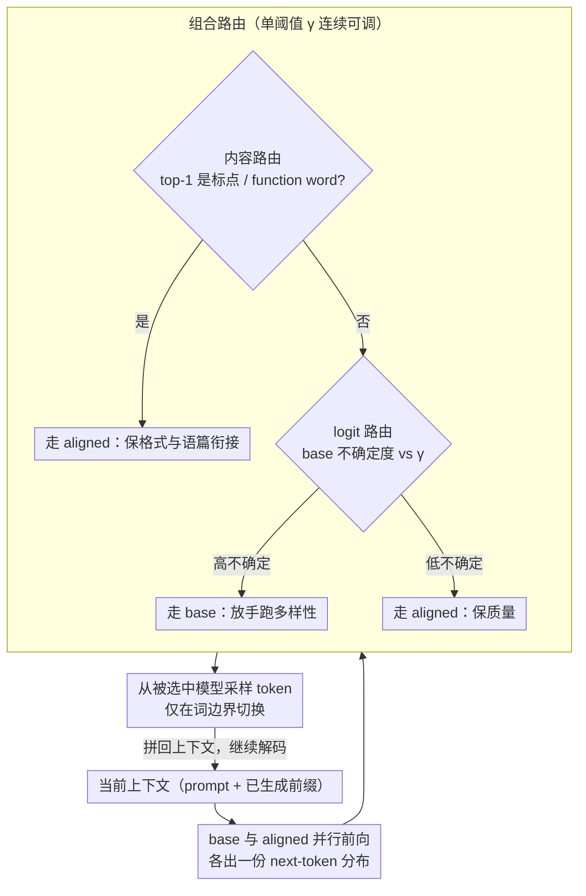

# Optimizing Diversity and Quality through Base-Aligned Model Collaboration

**会议**: ICML 2026  
**arXiv**: [2511.05650](https://arxiv.org/abs/2511.05650)  
**代码**: 有 (项目主页 + 仓库已开源)  
**领域**: LLM / NLP  
**关键词**: 多样性-质量权衡, 推理时协同, token级路由, 对齐, 开放式生成

## 一句话总结
作者提出 BACO，一种推理时 token 级路由框架：让"未对齐的 base 模型"和"对齐后的 instruct 模型"在同一次解码里逐 token 切换，用 logit 不确定度与内容词信号决定该信谁，从而在不再训练、不多次采样的前提下同时拿到 base 的多样性与 aligned 的质量，best router 相对最强 baseline 取得 21.3% 的多样性-质量联合提升。

## 研究背景与动机

**领域现状**：对齐（SFT + RLHF/DPO）让 LLM 在指令跟随、安全性、奖励分数上大幅提升，已经是部署级模型的默认形态；但同样的 prompt 反复采样时，对齐模型会塌缩到极少数"模板回答"，例如问"美国夏季旅游目的地"会反复给出"Maui, Hawaii"。

**现有痛点**：之前缓解多样性塌缩主要走两条路。训练侧（如 diverse RLHF、多样性正则）需要重新训模型，会动到对齐分布、可能牺牲安全与有用性；推理侧则要么是高温/多样 beam search，要么是 in-context resampling、paraphrase prompting、回译，多数需要多次解码或长程规划，而且常常用质量换多样性。

**核心矛盾**：单模型范式存在结构性 trade-off ——对齐过程本身会降低 next-token 分布的熵（mode collapse），让概率质量集中在少数高质量 token 上。论文给出实测对比：Llama-3-8B 与 Llama-3-8B-Instruct 在 WildChat 子集上 diversity 比是 3.15×，但 quality 比反向是 5.95×，没有 Pareto 占优的一边。

**本文目标**：在不再训练、且只跑一次解码的前提下，得到一个能在 diversity-quality 平面上整体抬高 Pareto 前沿、并可由用户按需调节工作点的方法。

**切入角度**：作者抓住了"superficial alignment"现象——base 和 aligned 模型在大多数 token 上的预测高度一致，分歧主要集中在风格性/功能性 token（标点、换行、function word）和少数高不确定度的"语义岔路口"。既然只有少数位置真正分歧，那就只在这些位置切换模型即可。

**核心 idea**：把 base 当作"多样性来源"、把 aligned 当作"质量来源"，在解码时用一个轻量级 router 在 token 粒度上动态选其一来出 token，把单模型权衡变成两模型协同。

## 方法详解

### 整体框架
BACO 想在一次解码里既拿 base 的多样性又拿 aligned 的质量，做法是让两个模型逐 token 抢麦克风。它把生成写成 $P_{\text{BACO}}(y_t|c_t) = w_{\text{base}} \cdot P_{\text{base}}(y_t|c_t;\theta_{\text{base}}) + (1-w_{\text{base}}) \cdot P_{\text{aligned}}(y_t|c_t;\theta_{\text{aligned}})$，其中 $c_t = [x, y_{<t}]$，$w_{\text{base}} \in \{0,1\}$ 是 router 给的**硬**选择——不是软混权，每个 token 完全归属某一个模型。每步两模型并行前向，router 看当前位置的信号决定信 base 还是 aligned，再从被选中那个分布里采样 token、拼回上下文继续。为防止两模型 tokenizer 不一致拼出乱码，切换只发生在词边界（word boundary）上。整条流程只跑一次解码、不微调、不做 prompt 工程，所以能零成本套到任何现成的"base + instruct"权重对上。

### 关键设计

**1. 基于 logit 的路由：让 base 自己的不确定度决定哪里该放手**

对齐塌缩的根源是 aligned 在该多样的位置也强行收敛，可真正"可以多样"的位置其实是少数——那些续写有好几种都合理的"语义岔路口"。BACO 直接用 base 模型当下的预测不确定度来识别这些岔路口：不确定就让 base 出 token 跑多样性，确定就让 aligned 出 token 保质量。两个代表变体落地这个思路——BACO-P 在 base 的 top-1 概率 $\max_{y_t} P_{\text{base}}(y_t|\cdot) < \gamma$ 时路由到 base；BACO-H 在 base 的预测熵 $H_{\text{base}}(Y_t|\cdot) = -\sum_{y_t} P_{\text{base}}(y_t|\cdot)\log P_{\text{base}}(y_t|\cdot) > \gamma$ 时路由到 base。阈值 $\gamma$ 等价于一个"多样性温度"：调大偏向 base（更多样），调小偏向 aligned（更高质量）。它之所以有效，是因为高不确定度位置上让 aligned 硬收敛只是白白烧掉"可多样化的预算"，而低不确定度位置 base 与 aligned 本就高度一致，切换没收益还徒增风险。

**2. 基于内容的路由：按 token 的语言学角色分工，而不是看概率**

logit 信号需要拿到 base 的 logits，且会把所有高不确定度位置都判给 base，但有一类位置——标点、换行、function word——恰恰是两模型分歧最多、读者却最不在意的地方，多样化它们毫无意义还会破坏格式。BACO 因此改用 token 的语言学角色来分工：把"风格性 token"留给 aligned，把"实义内容词"留给 base。BACO-PUNC 在 top-1 是标点/格式 token（如 `\n`、句号）时强制走 aligned 以保格式一致；BACO-FC 在 top-1 是 function word（and/if/the 等）时走 aligned 以保语篇衔接。这背后是个语言学观察——人感知到的"多样性"几乎全在内容词上（地名、动词、形象描写），把功能/风格词交给 aligned 既稳住了行文又不牺牲读者真正在意的多样性。而且这类信号根本不需要 logits，所以连只能调 API 的黑盒对齐模型也能用。

**3. 组合路由 + 可控阈值：把两类信号串起来，沿 Pareto 前沿连续滑动**

logit 信号倾向"有把握就交给 aligned"，内容信号倾向"风格/功能词归 aligned"，两者关注的维度不同、天然互补，单用任一个都够不到最优。组合版（BACO-P-PUNC、BACO-P-FC、BACO-H-PUNC 等）先用内容规则（PUNC/FC）锁定"必须走 aligned"的 token，剩下的再回退到 logit 规则判方向；这样既保住语篇连贯，又能在真正的岔路口放手让 base 跑多样性。更实用的是只需调单一阈值 $\gamma$ 就能扫出从"低多样-高质量"到"高多样-中等质量"的整条曲线，给上层应用留了一个连续可调的旋钮，而不是只给一个固定工作点。

### 损失函数 / 训练策略
不训练。所有 router 都是无参启发式，唯一连续超参是阈值 $\gamma$，相当于面向用户的"多样性温度"，既不用校准也不用学习。论文显式把 learned router 留作 future work，理由是多样性本身是多维的（lexical / semantic / discourse），用单一标量损失去学反而会引起目标冲突、训练不稳。

## 实验关键数据

### 主实验
评测集合：NoveltyBench（指令跟随）、WildChat（对话）、Narrative-Discourse（长文本创意写作）；模型对：Llama-3-8B/Instruct、Olmo2-7B/Instruct；指标：11 个多样性 × 2 个质量 = 22 个 diversity-quality 子空间，并用 **Coverage**（曲线下面积，衡量整段 trade-off 占据的区域）和 **Dominance**（占全局 Pareto 前沿的比例，衡量是否独占最优解）两个多目标优化指标聚合。

| 方法 | Lexical Cov. | Lexical Dom. | Semantic Cov. | Semantic Dom. | Overall Cov. | Overall Dom. |
|------|-------------|-------------|---------------|---------------|--------------|--------------|
| Base | 0.098 | 12.7% | 0.098 | 16.0% | 0.098 | 14.3% |
| Aligned | 0.269 | 49.0% | 0.104 | 29.2% | 0.186 | 39.0% |
| Nudging (协同 baseline) | 0.276 | 9.3% | 0.247 | 9.9% | 0.261 | 9.6% |
| Prompting (Best) | — | 2.7% | — | 2.2% | — | 2.4% |
| Ensemble (Best) | — | 1.1% | — | 1.9% | — | 1.5% |
| **BACO (Best)** | **0.445** | 24.9% | **0.360** | **40.5%** | **0.403** | 32.7% |

Coverage 相对最强 baseline 提升 0.142（约 +30% 可达区域），整体多样性-质量联合提升 21.3%；语义维度 Dominance 提升到 40.5%（即近一半的 Pareto 最优点是 BACO 独占的）。

### 消融实验（NoveltyBench 上不同 router）
| Router | Lexical Cov. | Lexical Dom. | Semantic Cov. | Semantic Dom. | Overall Cov. | Overall Dom. |
|--------|-------------|-------------|---------------|---------------|--------------|--------------|
| -RAND（随机切换） | 0.493 | 26.3% | 0.409 | 17.0% | 0.451 | 21.7% |
| -JUDGE（外部模型判） | 0.302 | 2.6% | 0.254 | 0.6% | 0.278 | 1.6% |
| -P（仅最大概率） | 0.433 | 4.8% | 0.397 | 8.5% | 0.415 | 6.7% |
| -FC（仅 function word） | 0.419 | 3.2% | 0.382 | 4.7% | 0.401 | 4.0% |
| **-P-PUNC（最优组合）** | **0.495** | **30.7%** | **0.452** | **31.3%** | **0.474** | **31.0%** |
| -H-PUNC | 0.466 | 16.4% | 0.427 | 18.6% | 0.446 | 17.5% |
| -P-FC | 0.435 | 16.0% | 0.406 | 19.2% | 0.421 | 17.6% |

### 关键发现
- 组合策略（-P-PUNC、-H-PUNC、-P-FC）几乎全面碾压单策略，证明 logit 信号和内容信号互补、不能互相替代。
- -RAND 在 lexical 维度表现意外不错，但 semantic Dominance 只有 17%——说明"无脑切"只能制造表面词形多样性，做不出真正语义多样性，必须有 router 引导。
- -JUDGE（让另一个 LLM 当裁判判每个 token）反而最差且最慢，作者用这个结果反证：本任务不需要复杂判别器，启发式信号已经够强。
- 在可验证任务（IFEval、GSM8K）上，BACO 也能在保持质量/准确率不掉的前提下抬高多样性，说明收益不是"开放式评测的伪影"。
- 人工评估与自动指标方向一致，多样性提升被人类评审感知到，未带来明显的质量退化。

## 亮点与洞察
- 把"模型协同"从一次只能选一个模型升级到 token 级硬切换，且严格走 word boundary，是个干净又工程友好的做法——任何 base + instruct 的开源对都能现成接上，零训练成本。
- "superficial alignment"假设被用得很到位：既然两模型大多数 token 一致，只需在少数分歧点做选择，于是 router 就只需要是几行规则而不是一个学习模型，简单到反直觉地强。
- 把多样性-质量评估从"单点比分"升级为"Coverage + Dominance 两指标 + 11×2 子空间"，把"是否可控"作为一等公民评估，方法论上比之前 NoveltyBench 等单指标评测更扎实，可复用到任何 trade-off 类研究。
- 内容信号（PUNC/FC）适用于黑盒模型，意味着即便只能调 API 的对齐模型，也能通过"分句/结构 token 走 API，其余 token 走开源 base"的方式复刻 BACO，工程外推性很好。

## 局限与展望
- 需要同时持有 base 和 aligned 两份权重，部署内存翻倍；论文未给出量化或 KV 复用版本，对显存吃紧的场景不友好。
- 严格依赖"base 与 aligned 同源、分歧仅在风格/岔路口"这一假设；若 base 与 aligned 来自不同家族（如不同 tokenizer 或不同预训练数据），不仅 word-boundary 切换会失效，"superficial alignment"也未必成立。
- 评测集中在英文开放式生成，对代码、长链推理、多语言的覆盖较少；只在 IFEval/GSM8K 做了 sanity check，没有给出在强推理任务上多样性是否仍有积极价值的结论。
- 阈值 $\gamma$ 仍需用户/任务调，论文没有自动选 $\gamma$ 的机制；如何用一两个无监督信号（例如 prompt embedding 或任务类别）自动设定 $\gamma$ 是自然的下一步。
- learned router 被显式留作 future work，但在多维度多样性目标下学习信号的设计本身就是开放问题，可能需要 multi-objective RL 框架配合。

## 相关工作与启发
- **vs Nudging (Fei et al., 2025)**: 同样基于"superficial alignment"做协同，但 Nudging 是把 aligned 的少量 token 注入 base 的解码以提升 base 的质量；BACO 的目标恰恰相反——是把 base 注入 aligned 来恢复多样性，并且把方向选择交给可控 router，因此能扫出整条 Pareto 而不是单点。
- **vs 训练侧多样性方法（diverse RLHF / DivPO）**: 后者要重训对齐阶段、可能损害安全与有用性；BACO 完全推理时、不动权重，安全属性保持不变。
- **vs 解码多样化（温度、Diverse Beam Search、对比解码）**: 这些只能在一个模型的分布内"翻搅"，受限于该分布本身的熵；BACO 利用了**两个不同分布**作为多样性源，天花板更高，对 mode collapse 的缓解是结构性的而非参数级的。
- **vs Prompt 类（in-context resampling / paraphrase）**: 需要多次解码或更长上下文，开销大；BACO 单次解码完成，wall-clock 上更友好。

## 评分
- 新颖性: ⭐⭐⭐⭐ 用 base+aligned 协同来"反向使用 superficial alignment"是一个干净的新视角；router 本身朴素，但目标重定向到 diversity 是值得记一笔的贡献。
- 实验充分度: ⭐⭐⭐⭐⭐ 22 个 trade-off 子空间 + 长文本 + 多模型对 + 人工评估 + 可验证任务交叉检验，覆盖面在 ICML 同类工作里属上乘。
- 写作质量: ⭐⭐⭐⭐ 概念图清晰，把"diversity-quality 平面 + Coverage/Dominance"这套评估语言讲得很顺；方法部分稍偏简洁，附录依赖较重。
- 价值: ⭐⭐⭐⭐ 零训练即可缓解 mode collapse，对开放式生成、创意写作、对话推荐这些 diversity-first 场景立刻可用；额外提供了一套可复用的多目标评测协议。

<!-- RELATED:START -->

## 相关论文

- [\[ICLR 2026\] Optimas: Optimizing Compound AI Systems with Globally Aligned Local Rewards](../../ICLR2026/llm_nlp/optimas_optimizing_compound_ai_systems_with_globally_aligned_local_rewards.md)
- [\[AAAI 2026\] STEM: Efficient Relative Capability Evaluation of LLMs through Structured Transitive Evaluation Model](../../AAAI2026/llm_nlp/stem_efficient_relative_capability_evaluation_of_llms_through_structured_transit.md)
- [\[ICML 2026\] The Cylindrical Representation Hypothesis for Language Model Steering](the_cylindrical_representation_hypothesis_for_language_model_steering.md)
- [\[ICML 2026\] On the Limits of LLM Adaptability: Impact of Model-Internalized Priors on Annotation](on_the_limits_of_llm_adaptability_impact_of_model-internalized_priors_on_annotat.md)
- [\[ICLR 2026\] WebDevJudge: Evaluating (M)LLMs as Critiques for Web Development Quality](../../ICLR2026/llm_nlp/webdevjudge_mllm_web_development.md)

<!-- RELATED:END -->
