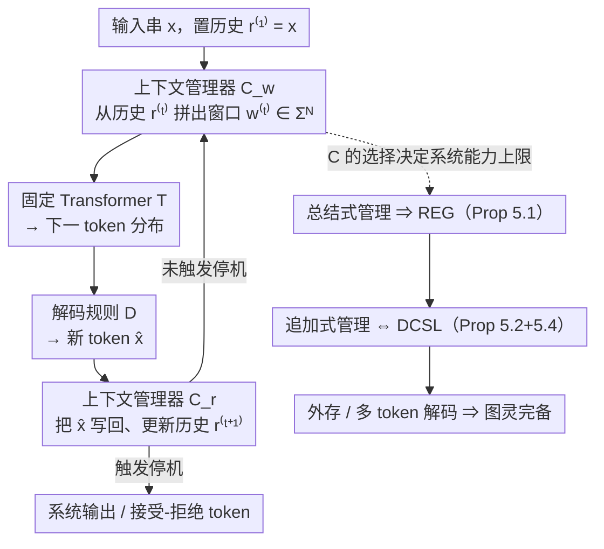

# Position: The Turing-Completeness of Autoregressive Transformers Relies Heavily on Context Management

**会议**: ICML2026  
**arXiv**: [2605.19514](https://arxiv.org/abs/2605.19514)  
**代码**: 无  
**领域**: LLM/NLP  
**关键词**: Transformer 图灵完备性, 自回归解码, 上下文管理, 计算复杂度, position paper

## 一句话总结
作者指出"Transformer 是图灵完备"这一流行说法在大多数已有证明里其实悄悄换成了"一族不同的 Transformer 共同能模拟图灵机"，并形式化了贴近真实部署的固定系统 $(T,D,C)$，证明同一个固定 Transformer 在不同上下文管理策略下计算能力可以从仅识别正则语言一路跃迁到图灵完备，从而把研究重点从模型本身扭转到 context manager 上。

## 研究背景与动机

**领域现状**：自 2019 年以来一长串理论工作（Pérez、Bhattamishra、Merrill & Sabharwal、Li 等）宣称 Transformer 在某种意义上是图灵完备的，被大量 LLM 论文当作"模型表达力足够"的默认背书。

**现有痛点**：这些证明几乎都依赖两类不切实际的假设——**让上下文窗口随输入长度增长**（每步注意力可以看到 $n+t$ 个 token），或者**让数值精度随输入长度增长**（$O(\log n)$、$\mathrm{poly}(n)$ 甚至无界实数）。真实部署的 LLM 上下文窗口 $N$ 和数值精度都是固定的常量，从而构造里的"模型"在不同输入长度下其实是不同的网络。

**核心矛盾**：图灵机的定义要求**单一**机器在任意长输入上都能跑；如果每个长度都换一台 Transformer，本质上得到的是一族电路（circuit family），这与 Savage 把 $\textsf{DTIME}(T(n))$ 编码为大小 $O(T(n)^2)$ 的电路族在性质上等价，不能直接称为"图灵完备"。换句话说，scaling-family 给的是**资源界**，不是**通用性**。

**本文目标**：把"什么是固定的、什么可以增长"严格分开，把已有结果重新归类，并在真正贴近现实的固定系统里重新讨论计算能力。

**切入角度**：固定一个预训练 Transformer $T:\Sigma^N\to\Delta(\Sigma)$、固定解码规则 $D$、固定有限精度后，能处理任意长输入的唯一办法是引入一个**上下文管理器** $C$——决定每一步把哪 $N$ 个 token 送进窗口、把生成结果如何写回历史。整个系统是三元组 $(T,D,C)$，而 $C$ 这一向被当作工程细节的部件，其实决定了系统的可计算性上界。

**核心 idea**：在固定系统范式下，Transformer 本身的图灵完备性是无意义的命题，**上下文管理方式才是决定整个系统计算能力的关键变量**——总结式管理把系统打回正则语言，追加式管理给出线性空间图灵机，而读写外部内存或多 token 解码才真正达到图灵完备。

## 方法详解

整篇论文是 position paper，没有实验，"方法"是一个形式化模型加一组定性归类，再由两条主定理把它落到复杂度阶梯上。

### 整体框架

作者把一个能处理任意长输入的 LLM 抽象成固定系统 $(T,D,C)$：给定输入 $x=x_1\cdots x_n$，置 $r^{(1)}=x$，第 $t$ 步由上下文管理器 $C$ 用 $w^{(t)}=C_w(r^{(t)})\in\Sigma^N$ 拼出送进窗口的字符串，Transformer 给出下一 token 分布，解码规则取 $\hat{x}_{t+1}=D(T(w^{(t)}))$，$C$ 再用 $r^{(t+1)}=C_r(\hat{x}_{t+1}, r^{(t)})$ 更新自己维护的历史串，直到触发停机。论文的核心主张就是：在 $T$、$D$、精度全部固定的前提下，**$C$ 才是决定系统计算能力的自由变量**。论证分三步——先把固定系统与 scaling-family 的语义剥开，再分别证明两种"简单到能工程部署"的 $C$ 把系统钉死在哪一复杂度类。

### 关键设计

**1. 固定系统形式化 $(T,D,C)$ 与 fixed/scaling 二分：先把"什么固定、什么可增长"写进定义**

作者把 Transformer 抽象成常数函数 $T:\Sigma^N\to\Delta(\Sigma)$，并把解码与历史维护从 $T$ 中分离出来交给 $D$ 和 $C$，于是可以显式区分两个 regime：fixed-system regime 是单一固定 Transformer 配固定窗口 $N$、固定精度；scaling-family regime 则是一族 Transformer、按输入长度挑模型。关键观察是 scaling-family 与电路族（circuit family）同构，给出的是 $O((T(n))^2)$ 量级的资源界，而非图灵完备性。这就解释了为什么 Pérez 2019、Merrill & Sabharwal 2024 等"$O(\log n)$ 精度即可模拟 TM"的结论被实践者读成"GPT 是图灵完备"是误读——那些证明的"机器"会随 $n$ 改变，对应的根本不是一台部署中的 LLM。为避免 $C$ 内部偷偷塞进图灵机使结论平凡，分析对象被限定为 **simple manager**：只用 $N$ 个 token 单元加 $O(1)$ 状态、对历史串只能 push/pop/常数偏移、不能跑通用算法。在这个框架下重审 Table 1 的代表性工作，绝大多数 Turing-completeness 证明同时落在 Group A（窗口至少 $n+t$）和 Group B（精度至少 $O(\log n)$），因而本质上是 scaling-family 论证。

**2. 总结式管理 ⇒ 常数空间上界（Proposition 5.1）：`/compact` 救不出正则语言**

只要 $C$ 把过去历史压成单 token 摘要（类似 `/compact`、AutoCompressor、ICAE），那么无论 $T$ 多强，整个 $(T,D,C)$ 都不超过 $\textsf{FDSPACE}(1)$。证明构造一台一向读、三带的转录机来模拟系统：工作带前 $N$ 格模拟上下文窗口、第 $N+1$ 格放分隔符、之后是模拟单步 Transformer 解码的工作区；每步要么把输入指针处的新 token 拼到 $r^{(t)}$ 末尾、要么触发摘要，所需总空间始终是常数 $O(N)$。结合 $\textsf{REG}=\textsf{DSPACE}(1)$ 这一标准事实，总结式系统只能识别正则语言，识别不了等串 $\{x\#x\}$、回文 $\{x\#x^R\}$、二进制加法这类典型非正则语言。这直接打脸"加个 `/compact` 就能跑任意长任务"的工程信念——压缩历史本质是把记忆压到 $O(1)$ bit，不管 $T$ 内部多 fancy，都被有限状态自动机这一外层封顶；它也照见了 scaling law 的另一面：状态数随 $N$ 指数增长，所以系统工程上仍能变强，理论类别却纹丝不动。

**3. 追加式管理 ⇔ 线性空间图灵机（Proposition 5.2 + 5.4）：换个 manager 就跳到 DCSL**

当 $C$ 改用 sliding-window 加追加（每生成一个 token 就追加到末尾、窗口左移一格）时，整个系统的能力恰好等价于 $\textsf{DSPACE}(n)$，即确定性上下文相关语言 DCSL。正向（Prop. 5.2）用图灵机把整段历史搬到工作带、每步把前 $N$ 个 token 拷到工作区做单步解码再写回左移，总空间 $O(n)$；反向（Prop. 5.4）借助 Schuurmans et al. 2024 的 $(N,K)$-restricted system 框架——$(2,1)$-restricted system 已被证可模拟任意线性空间 TM，再用 Lemma 5.3 证明任何 $f:\Sigma^2\to\Sigma$ 都能由一个窗口为 2 的 Transformer 加贪心解码精确实现，于是 $(2,1)$ 系统能由固定 $(T,D,C)$ 实例化。把三块拼起来就得到一条清晰的能力阶梯：同一个 $T$ 配总结式管理停在正则语言，配追加式管理跃到 DCSL，再放开到多 token 解码（$K=2$）或外部内存读写才真正达到图灵完备——这正是"$C$ 才是决定 real-world LLM 能力的部件"这一立场的硬支撑。整套论证不涉及任何训练目标，所有结论都来自对预训练模型加解码系统的形式语言与复杂性分析。

## 实验关键数据

position paper 没有数值实验，关键"数据"是两张归类与能力分级表。

### 主表 1：已有 Turing-completeness 证明的隐含 scaling 假设

| 上下文窗口规模 | 数值精度 | 代表工作 | 是否真在 fixed system 下证明 |
|----------------|----------|----------|-------------------------------|
| $n+t$ | unbounded | Pérez 2019, Bhattamishra 2020, Roberts 2024, Nowak 2024, Jiang 2026 | 否（双 scaling） |
| $n+t$ | $\mathrm{poly}(n)$ | Li 2024 | 否（双 scaling） |
| $n+t$ | $O(\log(n+t))$ | Merrill & Sabharwal 2024, Qiu 2025, Hou 2025 | 否（窗口 scaling） |
| $n+t$ | $O(1)$ | Malach 2024 | 否（窗口 scaling） |
| $n$ | unbounded / $O(\log n)$ | Back De Luca 2024, Giannou 2023 | 否（窗口与输入同阶） |
| $s(n)$ | $O(1)$ | Li & Wang 2025 | 否（按空间复杂度 scaling） |

绝大多数 cited 证明同时触发 Group A（scaling window）与 Group B（scaling precision），从而本质上是 circuit family 论证。

### 主表 2：固定 Transformer 系统在不同上下文管理下的能力

| 上下文管理方式 | 计算能力 | 出处 |
|----------------|----------|------|
| 读/写外部内存 | $\equiv$ Turing machine | Schuurmans 2023 |
| $(2,2)$-restricted（每步可生 2 token） | $\equiv$ Turing machine | Schuurmans et al. 2024 |
| $(2,1)$-restricted（追加式特例） | $\equiv$ $O(n)$-space TM | Schuurmans et al. 2024 |
| Appending-style（本文 Prop. 5.2 + 5.4） | $\equiv$ $O(n)$-space TM (= DCSL) | 本文 |
| Summarization-style（本文 Prop. 5.1） | $\leq$ $O(1)$-space TM (= REG) | 本文 |

### 关键发现
- 同一个固定 $T$ 在两种"简单到可以工程部署"的 $C$ 之间，能力差距是 REG vs DCSL——从有限状态自动机直接跳到非线性增长的图灵机带状结构，跨越在复杂度阶梯上非常大。
- 总结式管理识别不了等串、回文、加法这类基本非正则语言；这给"LLM 长上下文靠 summary 维持"的工程实践一个**理论上限警告**：再多次 `/compact` 也救不出超过正则语言类的能力。
- Turing-complete 需要的不是更大的 Transformer，而是**多 token 解码 + 写回上下文**或**外部内存读写**——结论与 Schuurmans 系列工作互证，说明 ReAct/Agent/带外存的系统在理论上确实可能突破 DCSL。

## 亮点与洞察
- **把 LLM Agent 抽象为 $(T,D,C)$ 是非常干净的形式化**：现在 prompt engineering、context compression、memory tool、tool call 都能塞进 $C$ 一项中讨论，让"agent 比 base model 强多少"这个口号有了可计算意义上的描述。
- **scaling-family 与 circuit family 的类比足够犀利**：把 "$O(\log n)$ 精度的 Transformer 可模拟 TM" 直接对应到 Savage "$O(T(n)^2)$ 电路可模拟 TM"，立刻让人意识到这只是资源界、不是通用性——这一类比可迁移用来审视任何"某网络是图灵完备"的论证。
- **Lemma 5.3（context-window 2 的 Transformer 可实现任意 $\Sigma^2\to\Sigma$）** 看似细节，其实是连接 Schuurmans 框架与具体网络结构的关键钉子，证明了即使是"最小 Transformer + sliding window"也能保住线性空间能力。

## 局限与展望
- 论文反复声明 "$C$ 必须 simple enough"，否则把 Python 解释器塞进去就立即图灵完备；但 simple 的边界（多大是 $O(1)$ 状态、什么算 fixed local operation）写得偏 informal，留下灰色地带——例如 RAG 的向量检索是否真"simple"？
- 全文只覆盖确定性、贪心解码、单 token 的设定；nondeterministic decoding、temperature > 0 的随机系统在框架内只是脚注，没有给出概率版本的能力分级（如有限状态 Markov vs 概率上下文相关）。
- Proposition 5.1 把摘要器固定成单 token；现实里的 `/compact` 是输出 $\Theta(N)$ 长度摘要，作者用 "$t$ token budget" 一笔带过，但实际上多 token 摘要是 chain-of-thought 形态，是否还能保持常数空间结论需要更细致的证明。
- 作者自己也强调：Turing-completeness 只回答"是否可计算"，不回答"是否可学到 / 可泛化"——这正是 LLM 理论与实践之间最大的鸿沟，本文给出方向但没给方法。

## 相关工作与启发
- **vs Pérez 2019 / Bhattamishra 2020 / Merrill & Sabharwal 2024**：这些工作给出的是 scaling-family 下的模拟构造，本文承认其作为资源界的价值，但拒绝把它们读作 fixed-system 的图灵完备性，重新归到 Table 1 的"$n+t$ 窗口"行。
- **vs Schuurmans 2023 / Schuurmans et al. 2024**：技术线路最接近——都强调"固定 Transformer + 修改 decoding/memory 接口"是真正决定能力的；本文把他们的 $(N,K)$-restricted system 用作 Prop. 5.4 的黑盒，并把同一框架推广到总结式管理（给出 REG 上界），把碎片化的几篇构造拼成一张完整能力阶梯。
- **vs Akhlaghpour 2024 博客 "Are Transformers Turing-Complete? A Good Disguise Is All You Need"**：博客以编年体散讲质疑，本文把同样直觉形式化为 fixed/scaling 二分、给出可证伪的命题，并补上"context manager 才是关键"这条博客没强调的论点。
- **可迁移启发**：任何宣称"某神经网络是图灵完备"的工作，都应先回答"我固定了什么、我让什么 scaling"；以及对 LLM-as-Agent 设计者——选择 manager 的能力上限比挑 base model 更决定系统天花板。

## 评分
- 新颖性: ⭐⭐⭐⭐ 不是构造新模型，而是把社区长期混用的两种语义剥开，并给出干净的能力阶梯，属于"重整地基"型贡献。
- 实验充分度: ⭐⭐⭐ position paper 无数值实验，但两条主命题加 Schuurmans 已有结果，已能完整支撑核心立场。
- 写作质量: ⭐⭐⭐⭐ 形式化与归类清晰，roadmap、定义、命题逐节铺陈；细节如 simple manager 的边界略显 informal。
- 价值: ⭐⭐⭐⭐⭐ 直接修正了一段被广泛误引的理论叙述，并把研究焦点从"模型本体"导向"context manager / agent harness"，对 LLM 理论与 Agent 工程都有长期指导意义。

<!-- RELATED:START -->

## 相关论文

- [\[ACL 2025\] Why Are Positional Encodings Nonessential for Deep Autoregressive Transformers? Revisiting a Petroglyph](../../ACL2025/llm_nlp/why_are_positional_encodings_nonessential_for_deep_autoregressive_transformers_r.md)
- [\[ACL 2025\] X-Turing: Towards an Enhanced and Efficient Turing Test for Long-Term Dialogue Agents](../../ACL2025/llm_nlp/xturing_enhanced_turing_test.md)
- [\[NeurIPS 2025\] In-Context Learning of Linear Dynamical Systems with Transformers: Approximation Bounds and Depth-Separation](../../NeurIPS2025/llm_nlp/in-context_learning_of_linear_dynamical_systems_with_transformers_approximation_.md)
- [\[ICLR 2026\] In-Context Algebra](../../ICLR2026/llm_nlp/in-context_algebra.md)
- [\[AAAI 2026\] Learning Spatial Decay for Vision Transformers](../../AAAI2026/llm_nlp/learning_spatial_decay_for_vision_transformers.md)

<!-- RELATED:END -->
