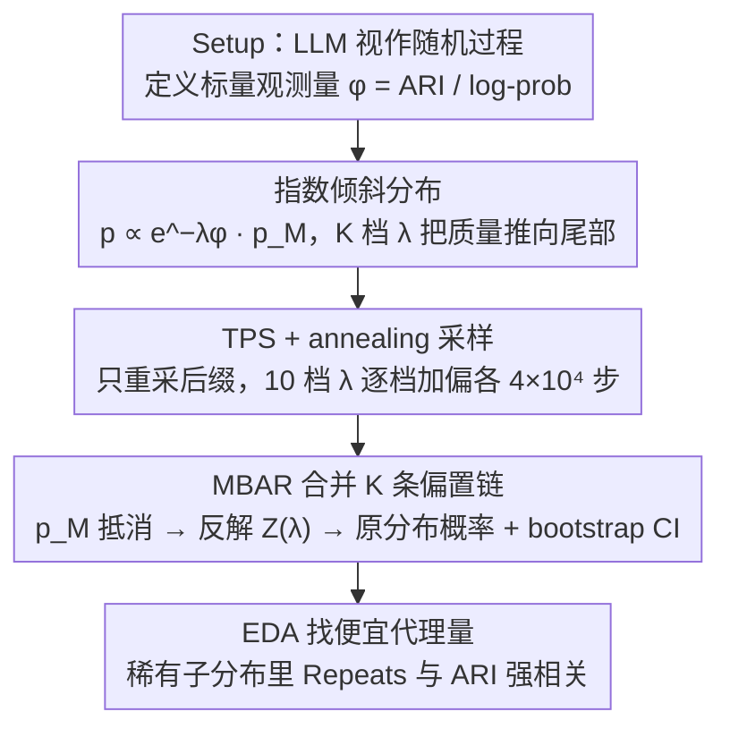

# Rare Event Analysis of Large Language Models

**会议**: ICML2026 Oral Spotlight  
**arXiv**: [2602.06791](https://arxiv.org/abs/2602.06791)  
**代码**: 有（论文附录给出最小实现）  
**领域**: LLM 分析 / 稀有事件采样 / 统计物理方法  
**关键词**: 稀有事件分析, 重要性采样, MBAR, Transition Path Sampling, LLM 安全

## 一句话总结
本文把统计物理里成熟的稀有事件分析（REA）方法搬到 LLM 上，用「指数倾斜分布 + Transition Path Sampling + MBAR」三件套，在 TinyStories 上以可承受的算力估出比直接采样小好几个数量级的稀有完成概率，并通过 EDA 找出便宜的运行时代理（连续 token 重复数）来预筛高 ARI 异常输出。

## 研究背景与动机
**领域现状**：LLM 是概率模型，部署规模一旦上来，「训练/测试期几乎看不到的事件」在线上会以非可忽略频率发生，比如对齐之后被压到分布尾部的有害输出。目前圈内对这类「尾部行为」的定量分析还处于起步阶段：要么只看单 token 概率（Wu & Hilton 2025），要么从少量测试 prompt 外推到部署分布（Jones et al. 2025）。

**现有痛点**：默认的「直接采样」方法（即 temperature=1 自回归采样）在尾部极度低效——想看到一个 $10^{-9}$ 的事件，得平均生成约 $10^{9}$ 个完成。对于研究小模型尚可，对生产级 LLM 则代价惊人；更糟的是直方图很多 bin 计数为 0，连点估都做不出来。

**核心矛盾**：稀有事件按定义就是「采不到的」，但又是安全 / 合规 / OOD 行为分析里最关键的部分。要在不爆算力的前提下系统刻画 LLM 输出分布的尾部，必须借助专门的稀有事件采样方法。

**本文目标**：给 LLM 的稀有事件分析（REA）搭一套可落地的端到端框架，拆成三阶段：(1) Setup：把 LLM 看成随机过程、把「稀有事件」形式化为可观测量取极端值；(2) Estimation：估计稀有事件概率；(3) Exploration：分析稀有完成的结构与性质。

**切入角度**：分子动力学和统计物理几十年的稀有事件工具箱（umbrella sampling、TPS、MBAR、bootstrap CI）天然适配「自回归序列 + 标量可观测量」的设定，只需要把「粒子轨迹」换成「token 轨迹」就能直接迁移。

**核心 idea**：用指数倾斜分布 $p_{\lambda}(\mathbf{x}) \propto e^{-\lambda \phi(\mathbf{x})} p_{\mathcal{M}}(\mathbf{x})$ 把采样推向尾部，配合 TPS-MCMC 在序列空间里游走，再用 MBAR 把多 $\lambda$ 的偏置样本拼回原始分布的概率估计，并对每一步给出 bootstrap 置信区间。

## 方法详解

### 整体框架
把 LLM 看成产生 token 序列 $\mathbf{x}_{1:T}$ 的随机过程，研究的对象是某个标量可观测量 $\phi(\mathbf{x}_{1:T})$（本文取 ARI 自动可读性指数和 completion 的 log-probability）取极端值的概率。整条流水线分三段走：先在 $K$ 个不同温度 $\lambda_k$ 下构造一族「人为偏向尾部」的倾斜分布，用 Transition Path Sampling 配 annealing 在序列空间里各跑一条 MCMC 链把样本压到稀有区；再用 MBAR 把这些偏置链合并、反解归一化常数，把概率拉回原始分布 $p_{\mathcal{M}}$ 并给出 bootstrap 置信区间；最后对采出来的稀有 completion 做 EDA，找一个能在生成时实时算的便宜代理量。整个过程不训练模型，只对预训练 TinyStories-8M 采样。

### 关键设计

**1. 指数倾斜分布：把采样人为推向尾部，又保持对原分布的代表性**

直接采样在尾部样本数趋零、估计方差爆炸，很多直方图 bin 干脆是 0 计数。解法是给每个偏置参数 $\lambda_k$ 定义一个倾斜（tilted）PMF

$$p_{\lambda_k}(\mathbf{x}) = Z(\lambda_k)^{-1} e^{-\lambda_k \phi(\mathbf{x})} p_{\mathcal{M}}(\mathbf{x})$$

它属于指数族：$\lambda$ 调大就把概率质量从典型区挪向 $\phi$ 的极端区，又因为乘的是原模型 $p_{\mathcal{M}}$，采出来的样本仍「长得像」原模型的输出而非凭空乱造。本文取正、负两组 $\lambda$ 分别把链压向两条尾巴。这一步只负责定义「该往哪偏」；怎么真正从这个分布采样、怎么把概率拉回原分布 $p_{\mathcal{M}}$，分别由下面的 TPS（设计 2）和 MBAR（设计 3）解决。

**2. Transition Path Sampling + annealing：用「只改尾巴」的 MCMC 在序列空间高效游走**

倾斜分布有了，还得有办法从它采样。如果在每个 $\lambda_k$ 下独立重新自回归生成整条序列，接受率会随序列长度指数衰减、几乎必被拒。TPS 改成只动后缀：第 $i$ 步当前轨迹 $\mathbf{x}^{(i)}_{1:T}$，随机选一个截断位置 $\tau \in [1, T)$，保留前缀 $x_{1:\tau-1}$，只把 $x_{\tau:T}$ 用 LLM 自回归地重采一遍得到候选 $\tilde{\mathbf{x}}$，再按由 $p_{\lambda_k}$ 决定的 Metropolis-Hastings 接受率取舍，满足细致平衡。这样接受率回到 $O(1)$ 量级。annealing 解决另一个老问题：大 $\lambda$ 下初始化离目标分布太远会导致 burn-in 过长，于是把 $\lambda$ 从小到大分 10 档逐档加偏、每档 $4 \times 10^4$ 步，让链从「接近典型」平滑过渡到「极端尾部」，每个 $\lambda_k$ 起步就已接近其目标分布而不直接卡死。

**3. MBAR：把多组偏置样本拼回对原分布的无偏概率估计**

倾斜分布采出来的样本是「被人为扭曲过」的，必须拼回原分布 $p_{\mathcal{M}}$ 才有意义。把目标期望写成混合重要性采样（umbrella sampling）形式 $\bar f = \sum_k \alpha_k \mathbb{E}_{p_{\lambda_k}}[w_{\text{Mix}} f]$，混合权重

$$w_{\text{Mix}}(\mathbf{x}) = \frac{1}{\sum_j \alpha_j Z(\lambda_j)^{-1} e^{-\lambda_j \phi(\mathbf{x})}}$$

里原模型对完整序列的概率 $p_{\mathcal{M}}(\mathbf{x})$ 恰好被消掉——这意味着**不需要知道模型对完整序列的归一化概率，只要 token-level log-prob 就够**，闭源 API 也能做。$K$ 个未知的归一化常数 $Z(\lambda_j)$ 由 MBAR 的 $K$ 元自洽方程一次解出（最优混合权重取 $\alpha_k = N_k^{-1}$），再用 percentile bootstrap（重采样 100 次）给每个 bin 配 96% 置信区间。比起直接采样只能给 bin-by-bin 的 Wilson 区间，MBAR 把所有偏置链的信息复用到一起、对全部 bin 给出全局一致估计，实测尾部相对 CI 宽度比直接采样小几个数量级。

**4. EDA 找便宜代理量：把昂贵的目标量换成能在生成时实时算的廉价统计量**

可读性、毒性、事实性这类指标往往要看完整文本甚至外部模型才算得出来，部署时根本来不及在线过滤。思路是先用大 $\lambda$ 把样本逼到高 ARI 极端区，再画 ARI vs Log-Prob 的散点、按连续重复 token 数

$$\text{Repeats}(\mathbf{x}) = \sum_t \mathbb{I}[x_{t+1}=x_t]$$

着色，看哪个简单统计量在尾部和目标量强相关。实测 TinyStories 在高 ARI 尾部会大量重复（"Trurururu…"），而 $\text{Repeats}(\mathbf{x})$ 是个 $O(T)$、生成时可增量计算的便宜量，与 ARI 在该子分布里显著正相关。于是它就能当运行时早 abort 的代理：在稀有事件子分布里找代理，比在典型分布上做特征工程更有针对性，省下算完整指标的推理算力。

### 损失函数 / 训练策略
不训练模型，只对预训练 TinyStories-8M 采样分析。MCMC 关键超参：$K=10$ 个 $\lambda$ 档、每档 $4 \times 10^4$ TPS 步、burn-in 砍前 10%、Gelman-Rubin 统计量 $\ge 1.1$ 的段全部丢弃、bootstrap 重采样 100 次得到 96% CI。ARI 在 15 处做截断，以避免极少数 high-ARI-high-LogProb 的 completion 导致 MCMC 接受率塌陷。

## 实验关键数据

### 主实验：尾部覆盖与样本效率

模型：TinyStories-8M，prompt 固定为 16 token，completion 100 token；总 token 预算约 $4 \times 10^8$。

| 方法 | 总 completion 数 | ARI / Log-Prob 尾部覆盖 | 直方图尾部 bin 是否有计数 |
|------|------------------|--------------------------|------------------------|
| 直接采样（SOTA） | $4.1 \times 10^6$（100 token / 个） | 仅覆盖训练数据范围内 | 大量 0 计数 |
| TPS + MBAR（本文） | $\approx 7 \times 10^6$ 有效 / $8 \times 10^6$ 生成（平均 50 token / 个） | 远超训练数据范围，能估到比直接采样小**多个数量级**的概率 | 全范围非零 |

### 误差分析（消融视角）

| 指标 | 直接采样 | MBAR | 说明 |
|------|---------|------|------|
| 典型区相对 CI 半宽 | 小 | 相当 | 中部两法接近 |
| 尾部相对 CI 半宽（以 MBAR 估为真值） | 巨大（很多 bin 为 0，需用「最小非零 bin 一半」兜底） | 显著更小 | 尾部 MBAR CI 比直接采样窄几个数量级 |
| 加倍 MCMC 步数后 bin 高变化 / 当前 CI 半宽 | — | 多数 < 1，部分接近 1 | 提示「再加步数 > 再加并行链」更划算 |

### 关键发现
- **MBAR 在尾部的优势不是边际的**：直接采样在尾部 bin 计数为 0 时连点估都没有；MBAR 给出的相对 CI 半宽在尾部比直接采样小几个数量级，这是稀有事件估计的本质收益。
- **annealing 是 TPS 收敛的关键**：从 Fig.2 的运行平均可看到，越极端的 $\lambda$ 越需要 burn-in；用 GR ≥ 1.1 卡掉未收敛段后，整体偏差有界。
- **OOD 区域的模型行为很「机械」**：把 ARI 强制推到训练分布之外，模型给出的高概率 completion 是高度重复的 token（"rururururu..." 50 次），说明模型在外推时倾向于回落到「重复 = 高似然」这种最廉价的模式，这一现象给出了一个可解释性洞察。
- **代理变量「连续重复数」在高 ARI 尾部与 ARI 显著正相关**：可以作为运行时早过滤指标，省去算完整 ARI 的代价。

## 亮点与洞察
- **把统计物理工具箱搬进 LLM 分析**很自然但此前没人系统做过：LLM 自回归 = 序列轨迹，token = 粒子状态，log-prob = 能量，作者一一对应后整个 MBAR + TPS 几乎是「换个变量名」就能用，省下了重新发明算法的成本。
- **不需要 model weights，只需要 token log-prob**：MBAR 权重里 $p_{\mathcal{M}}$ 恰好抵消，意味着同样的分析可以通过 API 完成（只要 API 返回 token-level logprob），对闭源大模型的第三方安全审计是一个非常实用的入口。
- **「找便宜代理量」这个 EDA 范式可迁移**：任何「目标观测量贵 + 想在线过滤」的场景（毒性、越狱、PII 泄露）都可以借这个框架——先用倾斜分布把稀有子分布采出来，再在子分布里找便宜统计量做代理，比在典型分布上做特征工程更有针对性。
- **GR、burn-in、bootstrap CI 这套统计严格性是论文最大的工程贡献**：作者明确指出了「rigorous coverage probability 仍需小心」（McGrath & Burke 2024），不掩饰方法的局限，这种透明度在 ML 论文里少见。

## 局限与展望
- **作者承认的局限**：只测了 TinyStories-8M 这种玩具规模模型；对生产级 LLM 直接套用需要算力升级和算法改进（adaptive runtime、parallel tempering、infilling proposal 等）。
- **prompt 单一**：主要实验只用一个 16 token 的 prompt（附录 D 有少量对比），部署场景的 prompt 多样性问题需结合 Jones et al. 2025 的外推方法。
- **倾斜分布族的设计依赖目标量平滑**：当目标量是稀疏非零的（如「输出是否包含某个具体不良 token」），需要构造平滑代理 biasing observable，这本身是个开放问题，作者把它类比为 RLHF 里 reward 模型设计。
- **改进思路**：(1) 用 fine-tuned 小模型作 TPS 的 proposal 分布以提升长序列接受率；(2) 把 RL-based 变分方法（Rose et al. 2021、Gillman et al. 2024）和 Doob transform（Ji et al. 2026）纳入框架；(3) 把 EDA 找代理这步自动化（如用稀疏回归 / Shapley 在稀有子分布上做特征选择）。

## 相关工作与启发
- **vs Wu & Hilton 2025**: 他们只估「单个 rare token 在不同 prompt 下的概率」，本文扩展到「完整 completion + 任意标量可观测量」，覆盖范围质变。
- **vs Jones et al. 2025**: 他们做「少数 test prompt → 大量部署 prompt 的外推」，本文做「单 prompt 下的精细稀有事件估计」，两者正交互补，作者明示二者可组合使用。
- **vs Karan & Du 2025 / Ji et al. 2026 的「distribution sharpening」**: 那两篇本质上分别是 TPS 的 shooting method 和 Doob transform 的特例，作者把它们都纳入统一的 REA 框架，并指出 RLHF / DPO 的 KL 正则目标也属于同一变分视角。

## 评分
- 新颖性: ⭐⭐⭐⭐ 把成熟的统计物理稀有事件工具箱系统性地搬到 LLM 分析，是一篇方法迁移而非新算法发明的论文，但视角和落地深度都新。
- 实验充分度: ⭐⭐⭐⭐ 在玩具规模上做得很彻底（CI、GR、bias-vs-variance trade-off 全覆盖），但缺少生产级模型 sanity check。
- 写作质量: ⭐⭐⭐⭐⭐ 自包含、动机清晰、公式推导完整、坦率交代局限，对跨领域读者非常友好。
- 价值: ⭐⭐⭐⭐⭐ 给 LLM 安全 / 对齐审计领域提供了一套不依赖模型权重的稀有事件量化框架，落地价值很高。

<!-- RELATED:START -->

## 相关论文

- [\[ACL 2025\] Behavioral Analysis of Information Salience in Large Language Models](../../ACL2025/llm_nlp/behavioral_analysis_of_information_salience_in_large_language_models.md)
- [\[ACL 2025\] Large Language Models for Predictive Analysis: How Far Are They?](../../ACL2025/llm_nlp/large_language_models_for_predictive_analysis_how_far_are_they.md)
- [\[ACL 2025\] Explicit and Implicit Data Augmentation for Social Event Detection](../../ACL2025/llm_nlp/explicit_and_implicit_data_augmentation_for_social_event_detection.md)
- [\[AAAI 2026\] Whispering Agents: An Event-Driven Covert Communication Protocol for the Internet of Agents](../../AAAI2026/llm_nlp/whispering_agents_an_event-driven_covert_communication_protocol_for_the_internet.md)
- [\[ICML 2026\] Resting Neurons, Active Insights: Robustify Activation Sparsity for Large Language Models](resting_neurons_active_insights_robustify_activation_sparsity_for_large_language.md)

<!-- RELATED:END -->
