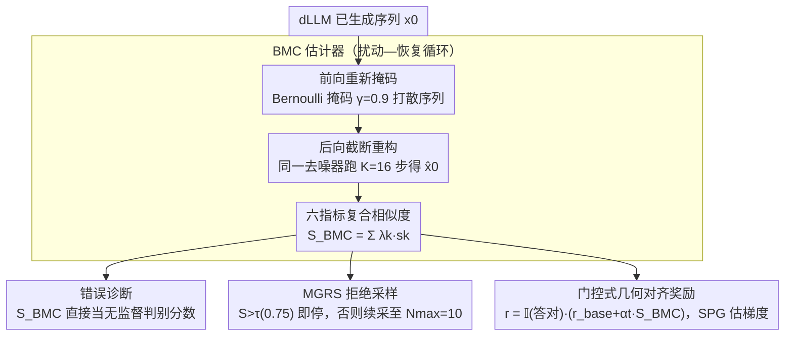

<!-- 由 src/gen_stubs.py 自动生成 -->
# Reasoning on the Manifold: Bidirectional Consistency for Self-Verification in Diffusion Language Models

**会议**: ICML2026  
**arXiv**: [2604.16565](https://arxiv.org/abs/2604.16565)  
**代码**: 待确认  
**领域**: LLM 推理 / 扩散语言模型 / 自验证  
**关键词**: 扩散语言模型, 流形几何, 双向一致性, 推理自验证, 强化学习对齐  

## 一句话总结
本文从"有效推理轨迹是学习分布上的稳定吸引子"这一几何视角出发，提出 BMC（Bidirectional Manifold Consistency）这一无监督、训练自由的度量：通过对扩散语言模型（dLLM）生成结果做一次"前向重新掩码 + 后向少步重构"，用重构稳定性来打分；BMC 同时支撑错误诊断、推理时拒绝采样和 RL 稠密奖励三大任务，在四个推理基准上系统超越置信度、Self-Consistency、Self-Evaluation 等基线。

## 研究背景与动机

**领域现状**：以 LLaDA、Dream 为代表的扩散大语言模型（dLLM）以全注意力 + 双向去噪过程替代自回归（AR）的严格左到右生成，被认为更适合"全局规划 + 反复修订"型的 System-2 推理。

**现有痛点**：验证生成轨迹是否真的"对"仍是个公开问题。主流做法多是从 AR 时代搬过来的外部信号：PRM 要昂贵的过程级标注；Self-Consistency 要采大量样本且在难题上常常一起错；Self-Evaluation 类提示在跨域时几乎退化成乱猜。这些方法把模型当黑盒，完全没用扩散过程本身的概率几何结构。

**核心矛盾**：dLLM 的去噪过程是**可逆的、双向的**——理论上模型自己就持有"这条轨迹有多稳"的信息，但现有验证范式无法读出。换句话说，外部验证器之所以贵，是因为我们没去看内部已经摆好的"地形"。

**本文目标**：把"答案对不对"还原成可测量的几何性质，且必须满足：(1) 无需 ground-truth；(2) 无需额外训练；(3) 开销远小于重采样；(4) 同一信号能贯穿"诊断 → 推理 → 对齐"全链路。

**切入角度**：作者假设有效解位于学习分布的高密度流形上、是去噪算子 $\mathcal{T}_\theta$ 的稳定吸引子，错误解则偏离流形；那么"扰动后能否被忠实重建"就是流形距离的代理。

**核心 idea**：用"前向再掩码 + 后向少步重构"的循环来量化稳定性——若 $\hat{x}_0 \approx x_0$，说明 $x_0$ 在流形上、推理可靠；否则发生 off-manifold drift，说明大概率错了。

## 方法详解

### 整体框架
方法把"这条推理轨迹对不对"翻译成一个可测的几何问题：输入 dLLM 已生成的完整序列 $x_0$，先按比例 $\gamma$ 重新部分掩码再用同一去噪器跑 $K$ 步截断重构得到 $\hat{x}_0$，用 $x_0$ 与 $\hat{x}_0$ 的复合相似度作为几何稳定性分数 $S_{\text{BMC}}(x_0)$——稳定即在流形上、推理可靠，漂移即大概率错。这同一个分数随后无改动地驱动三件事：错误诊断（直接当 score）、推理时的 Manifold-Guided Rejection Sampling（MGRS）拒绝采样、以及 RL 阶段的稠密奖励。理论侧作者把它锚到 ELBO：$\mathcal{D}$ 取 KL 散度时 BMC 等价于重加权 ELBO 估计（Prop. 3.2），取 Csiszár $f$-divergence 时与边缘 ELBO 一致（Prop. 3.3），连续嵌入下经 Lipschitz 连续放松到语义近邻（Prop. 3.4），并给出重构残差是流形距离上界的硬保证 $\|z_0 - z^*\| \le \frac{1}{1-\kappa}\|z_0 - \mathcal{T}_\theta(z_0)\|$（Prop. 3.5）。

### 关键设计

**1. BMC 估计器：用一次"扰动—恢复"循环量化流形稳定性**

要测的量是 $\mathcal{R}_\mathcal{D}(x_0) := -\mathbb{E}_{t, \tilde{x}_t}[\mathcal{D}(x_0, \hat{x}_0(\tilde{x}_t))]$，即"扰动后能否被忠实重建"。前向用 Bernoulli 掩码 $\tilde{x}_t^{(i)} = m_i x_0^{(i)} + (1-m_i)\texttt{[MASK]}$（$\gamma{=}0.9$）打散序列，后向只跑 $K{=}16$ 步而非完整 $T{=}1024$ 步去噪——这个截断是把验证开销压到生成开销零头、避免它退化成又一次重采样的工程关键。最终分数 $S_{\text{BMC}} = \sum_k \lambda_k s_k$ 由六个互补指标加权：Token Accuracy $s_{\text{tok}}$（局部收敛）、Semantic Similarity $s_{\text{sem}}$（容许同义改写）、Number Retention $s_{\text{num}}$（数学链关键节点）、Final Answer Match $s_{\text{ans}}$（终点收敛），外加 Character Similarity 与 Intrinsic Confidence。之所以要复合而非单指标：纯似然太严苛会把同义改写误判为错，纯答案匹配又忽略推理链中段的稳定性，六指标互补让 BMC 既贴近 ELBO 又对语义鲁棒。

**2. MGRS：让算力跟着题目难度走的拒绝采样**

把固定预算的 Best-of-N 升级成按难度动态分配算力。每次 $x_0 \sim p_\theta(\cdot|q)$ 采出后立刻算 $S = S_{\text{BMC}}(x_0)$，若 $S > \tau$（$\tau{=}0.75$）就当"地形稳定、无需再采"立即返回，否则继续采、最多 $N_{\max}{=}10$ 次，全都不过阈值则返回历史最高分候选。效果是简单题平均 $\sim$2–3 次即停、难题（如 MATH）自然多采到 $\sim$5–6 次。对比起来，Self-Consistency 不分难易地多数表决既浪费简单题算力又在难题上"齐刷刷错"，Best-of-N(Confidence) 用 token 概率排序但置信度与推理正确性几乎无关；BMC 给的是几何信号而非统计信号，预算因此与题难度天然耦合。

**3. 门控式几何对齐奖励：把流形稳定性内化进策略**

要让模型不只在推理时挑样本，而是把几何稳定性训进权重，于是把 BMC 注入 RL 奖励：$r(x_0) = \mathbb{I}(y_{\text{pred}} = y^*) \cdot [r_{\text{base}} + \alpha_t \cdot S_{\text{BMC}}(x_0)]$。乘法门控是关键——它保证答错的链一律 0 奖励，建立"先对、再稳"的严格层级，否则稠密几何奖励会把模型带向"自洽但错"的漂移（即几何版奖励黑客，正是 outcome-only RL 的反面教材）；权重 $\alpha_t = \alpha_{\min} + (\alpha_{\max} - \alpha_{\min}) \cdot t/T$ 线性退火，前期重答案、后期重几何。梯度估计上，因为 dLLM 的似然不可解，标准 ELBO 近似有偏，作者改用 Sandwiched Policy Gradient（SPG）以 sandwiched evidence bounds 替代来估梯度，把稀疏 outcome 奖励变成稠密且无偏可优化的几何质量奖励。

### 损失函数 / 训练策略
BMC 本身训练自由，只用预训练 dLLM 推理。RL 阶段用 SPG 框架在 LLaDA-8B 上做对齐，超参 $r_{\text{base}} = 1.5$、$\alpha \in [0.5, 1.0]$、$K{=}16$、$\gamma{=}0.9$、$N_{\text{BMC}}{=}4$ 集成样本，语义相似度用 all-MiniLM-L6-v2。

## 实验关键数据

### 主实验：无监督错误诊断（AUROC）

| 模型 | 方法 | GSM8K | MATH | ARC-C | GPQA |
|------|------|-------|------|-------|------|
| LLaDA-8B | Model Confidence | 0.753 | 0.713 | 0.550 | 0.482 |
| LLaDA-8B | Self-Evaluation | 0.549 | 0.558 | 0.546 | 0.529 |
| LLaDA-8B | Self-Consistency | 0.872 | 0.803 | 0.735 | 0.539 |
| LLaDA-8B | **BMC (Ours)** | **0.893** | **0.820** | **0.777** | **0.678** |
| Dream-7B | Self-Consistency | 0.684 | 0.675 | 0.708 | 0.527 |
| Dream-7B | **BMC (Ours)** | **0.898** | **0.825** | **0.804** | **0.605** |

在 LLaDA 上，BMC 对 SC 的优势从 GSM8K 的 +2.1% 拉大到 GPQA 的 +13.9%——任务越难、SC 的"共识假设"越失效，几何信号越显价值。在 Dream-7B 上由于采样多样性差，SC 几乎和置信度齐平，而 BMC 仍稳定 0.80+ AUROC，说明它对底模型不敏感。

### MGRS 推理与对齐效果

| 模型 | 任务 | Standard | Self-Cons. | Best-of-N(Conf) | **MGRS** |
|------|------|----------|------------|-----------------|----------|
| LLaDA | GSM8K | 70.5 | 74.3 | 70.7 | **79.5** |
| LLaDA | MATH | 24.4 | 24.2 | 23.8 | **27.6** |
| LLaDA | ARC-C | 83.2 | 86.1 | 83.3 | **87.2** |

| 对齐方法 (LLaDA, len=512) | GSM8K | MATH | ARC-C | GPQA |
|--------------------------|-------|------|-------|------|
| SFT | 80.4 | 34.8 | 78.1 | 26.8 |
| Outcome RL | 83.5 | 37.2 | 82.2 | 30.8 |
| **Geometric Align (Ours)** | **85.8** | **41.6** | **85.2** | **34.4** |

### 关键发现
- **$K$ 与 $\gamma$ 的几何含义**：AUROC 在 $K{=}16$ 处饱和（$0.840 \to 0.873$），说明截断重构足以探测 $\mathcal{T}_\theta$ 的局部收缩性；掩码率呈倒 U 型，峰在 $\gamma{=}0.9$（0.889），$\gamma{=}1.0$ 暴跌到 0.712——必须保留少量"几何锚点"才能测稳定性，否则就是另一次无条件重采样。
- **乘法门控不可省**：若把 $r$ 改成加法形式，模型会被"自洽但错"的链带偏，正是这种几何奖励黑客是 outcome-only RL 的反面教材。
- **算力自适应**：MGRS 在 GSM8K 平均只采 $\sim$2.2–3.3 次，在 MATH 自然涨到 $\sim$5.4–5.8 次，几何信号让预算和难度对齐，而 Best-of-N(Conf) 在 MATH 上甚至给出**负 Sample Efficiency**。

## 亮点与洞察
- **"重构稳定性 = 流形距离"是个干净的桥梁**：把验证问题翻译成几何收缩问题，既给出 Prop. 3.5 的硬上界，又落到工程上一个 $K{=}16$ 步的轻量循环，理论与可用性少见地兼顾。
- **同一信号贯穿三任务**：诊断、推理时挑样、RL 稠密奖励共用同一 BMC，避免了"诊断用 PRM、推理用 SC、对齐用 outcome"这种工具拼装；这种"一签多用"是把内在概率结构挖出来的红利。
- **可迁移到任何 masked denoising 模型**：只要有"掩码—去噪"双向过程，BMC 都能直接套用——视觉 / 蛋白质等 discrete diffusion 任务可立即复用同款几何稳定性判据。

## 局限与展望
- BMC 假设 dLLM 已经较好地学到了"正确答案 = 高密度流形"，对欠训练或严重错位的底模型，吸引子结构本身可能不成立，几何信号会失真。
- 复合分数 $S_{\text{BMC}}$ 的六个权重 $\lambda_k$ 论文里基本是手工设定，没系统讨论自适应权重；在跨任务迁移（如代码、医疗）时这些权重很可能需要重调。
- 实验主要在 LLaDA-8B 和 Dream-7B 上，规模未到 70B 级；当底模本身已经几乎全对（如 ARC-C 上 Dream），BMC 提升幅度趋窄，scaling 行为需要更大规模验证。
- 几何稳定性≠事实正确性：BMC 能拒掉"漂移轨迹"，但对"流形上但事实错误"的幻觉（如统一口径的常识错误）仍无能为力。

## 相关工作与启发
- **vs PRM / Generative Verifier**：他们靠外部标注或额外评判模型，BMC 完全 white-box 利用 dLLM 自身的去噪算子；优势是零标注、零额外模型，劣势是只能用在 masked diffusion 这类有双向过程的架构上。
- **vs Self-Consistency**：SC 是统计共识，BMC 是几何稳定性。SC 在难题上会"一起错"，BMC 因为只看单条轨迹的稳定性，对 sparse correct mass 的场景更鲁棒。
- **vs RemeDi / CDLM**：RemeDi 用 dual-stream 重新掩码低置信 token、CDLM 训练专门的纠错头，都是"再生成"导向；BMC 把同样的双向动力学**显式形式化**成一个验证准则，不改训练目标即可拿来诊断和对齐。
- **vs TraceRL / diffu-GRPO**：他们隐式优化轨迹似然近似，BMC 提供了显式的稠密几何信号，且配合 SPG 用 sandwiched bounds 解决 dLLM 似然不可解的梯度估计问题，几何稠密奖励与无偏梯度估计形成互补。

## 评分
- 新颖性: ⭐⭐⭐⭐⭐ 首次把 dLLM 的双向动力学形式化为"流形稳定性"验证准则，且打通诊断/推理/对齐三链路。
- 实验充分度: ⭐⭐⭐⭐ 覆盖两套 dLLM × 四个推理基准 × 三个下游任务，并配 $K$/$\gamma$ 灵敏度和组件消融；缺更大规模和跨域（代码/医疗）验证。
- 写作质量: ⭐⭐⭐⭐⭐ 几何 intuition + 四条命题 + 算法伪代码层层递进，理论与方法衔接清晰。
- 价值: ⭐⭐⭐⭐⭐ 给 dLLM 范式提供了一个"训练自由 + 一签多用"的内在验证基线，对扩散语言模型的推理时缩放和 RL 后训练都是直接可用的工具。

<!-- RELATED:START -->

## 相关论文

- [\[ICML 2026\] dLLM-Cache: Accelerating Diffusion Large Language Models with Adaptive Caching](dllm-cache_accelerating_diffusion_large_language_models_with_adaptive_caching.md)
- [\[ACL 2025\] Self-Training Elicits Concise Reasoning in Large Language Models](../../ACL2025/llm_nlp/self-training_elicits_concise_reasoning_in_large_language_models.md)
- [\[ACL 2026\] Unlocking the Potential of Diffusion Language Models through Template Infilling](../../ACL2026/llm_nlp/unlocking_the_potential_of_diffusion_language_models_through_template_infilling.md)
- [\[ICML 2026\] SPA-Cache: Singular Proxies for Adaptive Caching in Diffusion Language Models](spa-cache_singular_proxies_for_adaptive_caching_in_diffusion_language_models.md)
- [\[ICLR 2026\] Toward Safer Diffusion Language Models: Discovery and Mitigation of Priming Vulnerabilities](../../ICLR2026/llm_nlp/toward_safer_diffusion_language_models_discovery_and_mitigation_of_priming_vulne.md)

<!-- RELATED:END -->
