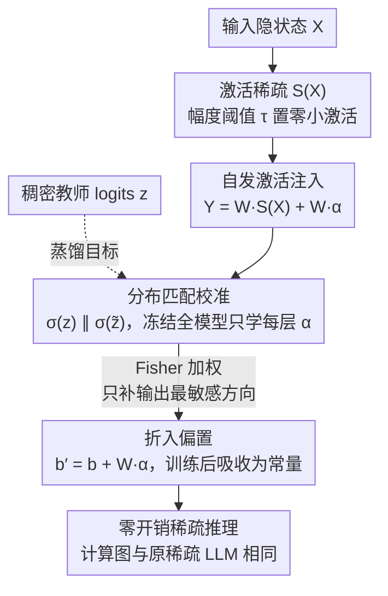

# Resting Neurons, Active Insights: Robustify Activation Sparsity for Large Language Models

**会议**: ICML 2026  
**arXiv**: [2512.12744](https://arxiv.org/abs/2512.12744)  
**代码**: https://github.com/hxu105/SPON (有)  
**领域**: 模型压缩 / LLM 效率  
**关键词**: 激活稀疏、表示稳定性、自发神经元、偏置吸收、知识保留

## 一句话总结
本文把激活稀疏导致 LLM 掉点的本质归因为"表示漂移"，并仿照生物自发放电向每层注入一个输入无关、训练后可吸收进 bias 的小向量（SPON），以接近零推理开销显著缩小稀疏模型与稠密模型的差距。

## 研究背景与动机
**领域现状**：为了加速 LLM 推理，激活稀疏（activation sparsity）成为相对优雅的一条路线，其代表方法如 TEAL / LaRoSA / R-Sparse 通过幅度阈值 $\tau$ 将小幅激活置零，进而在 MLP/Attention 的线性变换中跳过相应权重列；这种"动态遮蔽"不改权重、不动激活函数，自然适合现有稠密权重的 LLM。

**现有痛点**：稀疏比一旦推到 50% 以上，几乎所有现有方案都会出现明显的 perplexity 上升和零样本任务掉点，必须靠重训练或结构调整才能挽回，与"零成本加速"的初衷相违。

**核心矛盾**：作者通过观察发现：随着序列变长，能在所有 token 上都被同时激活的神经元比例呈指数衰减（Figure 1）。也就是说，原本在稠密模型里充当"全局锚点"的那些常活神经元，在稀疏后被各 token 选择性地关掉，导致隐状态分布发生 token-dependent 的漂移，等价于丢掉了预训练时学到的"先验"。

**本文目标**：在不重训权重、不改架构、不增加推理 FLOPs 的前提下，恢复稀疏 LLM 的表示稳定性，从而把性能拉回稠密水平。

**切入角度**：把激活稀疏问题重新表述为"表示对齐"问题——稀疏引入的不是简单的信息丢失，而是缺少稳定的、输入无关的"基线活动"作为参考。生物神经系统中存在的自发放电（spontaneous activity）恰好扮演这种角色，提供静态先验。

**核心 idea**：在每一层注入少量可学习、输入无关的"自发激活向量" $\vec{\alpha}$，仅通过对稠密模型 logits 的 KL 蒸馏来训练这个向量；由于与输入无关，训练后可直接折进 bias，推理时零额外开销。

## 方法详解

### 整体框架
SPON 的全部改动落在 transformer 每个线性层上：原本 $Y = WX$ 在激活稀疏后变成 $Y = W\,S(X)$，其中 $S(X)_i = \mathbf{1}\{|x_i|>\tau\}\cdot x_i$ 把小幅激活清零；SPON 在此基础上并联一个与输入无关的"自发神经元"项，写成 $Y = W\,S(X) + W\vec{\alpha}$。训练时冻结整模型、只学每层一组 $\vec{\alpha}$，用 KL 散度把稀疏模型的 logits 拉回稠密模型；训练完后 $W\vec{\alpha}$ 是常量，直接折进偏置 $b' = b + W\vec{\alpha}$，推理图与原始稀疏 LLM 一模一样，不多一次矩阵乘。

### 关键设计

**1. 输入无关的自发激活注入：用一个静态向量补回丢掉的常活神经元**

稀疏的代价不在"丢信息"而在"丢锚点"——稠密模型里那些几乎对所有 token 都激活的神经元，本来提供了一份输入无关的全局先验，稀疏后被各 token 选择性关掉，隐状态就发生 token-dependent 的漂移。SPON 的做法是在 $W\,S(X)$ 之后并上一项 $W\vec{\alpha}$，其中 $\vec{\alpha}\in\mathbb{R}^d$ 是该层独有、与输入 $X$ 无关的可学习向量；因为它跟 token 无关，$W\vec{\alpha}$ 就是个常量，能在推理前算好塞进 bias，等于把稠密模型隐含的"全局期望"显式写回稀疏计算图。值得注意的是，论文发现每层只需 **一个** 自发神经元（即 $\vec{\alpha}$ 相当于一个固定方向的激活）就足以把性能找回，说明真正缺的是稳定的"方向"而非额外"容量"，因此能在严守零推理开销硬约束的同时稳住表示。

**2. 分布匹配式的轻量校准：只蒸 logits、只学每层自发向量 $\vec{\alpha}$**

有了 $\vec{\alpha}$ 还得有不动原模型权重的训练方式。SPON 取一小批校准语料 $u\sim D$（WikiText、C4 皆可），把稠密、稀疏模型的输出 logits 分别记为 $z(u)$ 与 $\tilde z(u;\mathcal{A})$，只优化 $\mathcal{A}=\{\vec{\alpha}_\ell\}$ 去最小化 $\mathcal{L}(\mathcal{A}) = \mathbb{E}_u[\mathrm{KL}(\sigma(z)\|\sigma(\tilde z))]$。由于待学参数只有每层一个小向量，校准成本远低于全量微调；又因为只对齐最终 logits、不强行匹配中间层，自发神经元充当的是对稀疏残差的"全局补偿"，对校准语料分布相当鲁棒——在 C4 上校准、WikiText 上评估，PPL 仍优于基线。

**3. Fisher 加权的残差校正：解释为什么一个向量就够**

这一点从理论上回答"单个静态向量凭什么救活整个稀疏模型"。以最后一层投影为例，定义稀疏残差 $e(X) = WX - WS(X)$，对 KL 损失取一阶最优条件得到 $\mathbb{E}_u[W^\top H(W\vec{\alpha} - e(X))] = 0$，其中 $H$ 是 logits 处的 Hessian，恰好等于输出分布的 Fisher 信息矩阵。也就是说，最优 $\vec{\alpha}$ 让 $W\vec{\alpha}$ 成为 $e(X)$ 在 Fisher 度量下的最优近似——KL 自带的 Fisher 几何会把有限容量优先花在"输出分布最敏感"的方向上，只在那里补偿稀疏偏差。这正解释了为何极小参数量就能稳住关键表示：不是平均地修所有残差，而是精准地修那些一动就改变输出的方向。

### 损失函数 / 训练策略
全程只训练 $\mathcal{A}$，损失即上式的 $\mathrm{KL}(\sigma(z)\|\sigma(\tilde z))$；校准集很小，训练完成后把每层的 $W\vec{\alpha}$ 折入 bias，推理图保持不变。

## 实验关键数据

### 主实验

| 数据集 | 模型 | 稀疏度 | TEAL | SPON | 备注 |
|--------|------|--------|------|------|------|
| WikiText PPL | Llama3-8B | 50% | 8.34 | 7.83 | 接近稠密 6.75 |
| WikiText PPL | Mistral-7B | 50% | 6.00 | 5.86 | 稠密 5.49 |
| WikiText PPL | Qwen3-8B | 50% | 9.75 | 9.26 | 稠密 8.99 |
| WikiText PPL | Llama3-8B | 60% | 11.62 | 9.63 | 高稀疏增益最明显 |

与剪枝方法对比（Llama3-8B, 50%）SPON PPL=7.83，明显优于 SparseGPT (9.18)、Wanda (9.66)、MaskLLM (8.58)、ARMOR (10.10)。

### 消融实验

| 配置 | 关键指标 | 说明 |
|------|---------|------|
| TEAL only | Llama3-8B 50% PPL 8.34 | 仅幅度阈值稀疏 |
| + 自发神经元(每层 1 个) | PPL 7.83 | 仅增加一个 $\vec{\alpha}$ |
| 校准在 C4、评估 WikiText | PPL 7.95 | 验证跨语料鲁棒 |
| 与 LaRoSA/WINA/R-Sparse 组合 | Llama3-8B 五任务均分 71.96% | 高于 LaRoSA(69.82)/WINA(70.97)/R-Sparse(69.56) |

### 关键发现
- 把每层"自发神经元"个数压到 1，性能依旧最好，说明 SPON 主要解决的是"方向"而非"容量"问题，与 Fisher 残差校正的理论解释一致。
- 越激进的稀疏（60% > 50% > 25%）SPON 的增益越大，提示自发激活实际在补偿"被强行关掉的常活神经元"。
- SPON 与现有稀疏方法（LaRoSA、WINA、R-Sparse、WAS）正交，可叠加获得进一步增益；在 Qwen3-32B 与 Llama3-70B 上也能稳定带来 0.75% / 0.96% 提升，说明并非仅对小模型奏效。

## 亮点与洞察
- "把缺失的常活神经元用静态偏置补回来"这一定义非常干净——既复用了 bias 的硬件路径，又把稀疏与表示稳定性挂钩，方法成本几乎为零。
- KL+Fisher 的推导让"一个向量为什么够用"这件事变成了可解释结论，而不是工程巧合；这种"用 Fisher 几何指导最小参数补偿"的思路可迁移到其他低 bit/低秩压缩里。
- 通常 LLM 设计倾向于忽略 bias，本文反其道而行之，说明在重度稀疏场景下"bias-like"参数实际充当不可或缺的表征支架，提示了一个被忽视的设计自由度。

## 局限与展望
- 仅在 7B–8B 主体上做了大量实验，70B 与 32B 上虽然有效但实验粒度较小，长上下文、推理链场景下自发向量是否依然稳定尚需更系统的验证。
- 自发向量是逐层独立学习的，没有显式建模层间相互作用，未来可探索按结构（如 attention vs MLP）共享或低秩耦合，以进一步减少校准成本。
- 训练仍需要稠密模型的 logits 作为教师，对完全无访问 dense 模型的部署场景（如只有量化权重）需要替代信号。

## 相关工作与启发
- **vs TEAL/LaRoSA/R-Sparse**：它们关注"如何更聪明地选要遮蔽的激活"，本文承认稀疏后的残差并主动补偿，因此与它们正交并可组合。
- **vs SparseGPT/Wanda/MaskLLM**：权重剪枝永久删除参数，SPON 完全在激活空间运作，权重原封不动，因此更易回滚和叠加。
- **vs Bias-only fine-tuning（如 BitFit）**：BitFit 是任务自适应，SPON 是稀疏自适应；两者形式相似但目标不同，提示"只动 bias"在 LLM 时代仍是一片值得挖掘的低成本调节空间。

## 评分
- 新颖性: ⭐⭐⭐⭐ 把激活稀疏重新表述为表示对齐问题，并用 Fisher 残差解释，思路清晰但单点改动较小
- 实验充分度: ⭐⭐⭐⭐ 多模型多基线 + 与剪枝/SOTA 稀疏方法的全面对比，缺一些超长上下文场景验证
- 写作质量: ⭐⭐⭐⭐ 故事线（生物动机→经验观察→理论推导→工程实现）非常顺畅
- 价值: ⭐⭐⭐⭐ 几乎零成本即可叠加在现有稀疏方法上，工业部署友好

<!-- RELATED:START -->

## 相关论文

- [\[ACL 2025\] From Neurons to Semantics: Evaluating Cross-Linguistic Alignment Capabilities of Large Language Models via Neurons Alignment](../../ACL2025/llm_nlp/from_neurons_to_semantics_evaluating_cross-linguistic_alignment_capabilities_of_.md)
- [\[NeurIPS 2025\] Scaling Up Active Testing to Large Language Models](../../NeurIPS2025/llm_nlp/scaling_up_active_testing_to_large_language_models.md)
- [\[NeurIPS 2025\] Polar Sparsity: High Throughput Batched LLM Inferencing with Scalable Contextual Sparsity](../../NeurIPS2025/llm_nlp/polar_sparsity_high_throughput_batched_llm_inferencing_with_scalable_contextual_.md)
- [\[ICML 2026\] ANCHOR: Abductive Network Construction with Hierarchical Orchestration for Reliable Probability Inference in Large Language Models](anchor_abductive_network_construction_with_hierarchical_orchestration_for_reliab.md)
- [\[ICML 2026\] Rare Event Analysis of Large Language Models](rare_event_analysis_of_large_language_models.md)

<!-- RELATED:END -->
