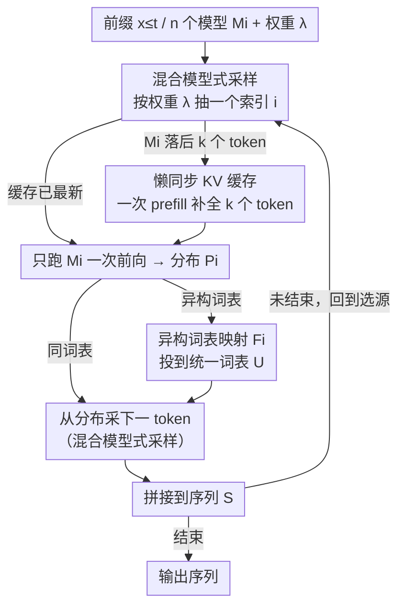

# Rethinking LLM Ensembling from the Perspective of Mixture Models

**会议**: ICML 2026 Spotlight  
**arXiv**: [2605.00419](https://arxiv.org/abs/2605.00419)  
**代码**: https://github.com/jialefu/Mixture-model-like-Ensemble (有)  
**领域**: LLM 效率 / 解码与集成  
**关键词**: LLM 集成、混合模型、采样等价、KV 缓存、token-level 路由

## 一句话总结
本文证明对 $n$ 个 LLM 做 token 级集成时无需每步都跑所有模型——按权重随机抽一个模型采下一个 token，输出分布与"先平均后采样"严格等价，从而把 $n$ 倍前向变回 1 倍前向，并配合"懒同步 KV 缓存"实现 1.78×–2.68× 的实际加速。

## 研究背景与动机
**领域现状**：传统机器学习集成把多个模型的概率分布平均后取 argmax；这种范式被直接搬到 LLM 上变成"在每个 token 上平均 $n$ 个模型的下一 token 分布，再从平均分布里采样"，可以提升生成质量，但需要 $n$ 次前向。

**现有痛点**：把 $n$ 个模型放到 $n$ 张卡上并行也无法真正接近 $1\times$ 速度，因为每个 token 都要做跨设备同步通信，开销极重；现有"降低集成频率"或"截断词表"的省时方法只是在边角优化，瓶颈"必须显式构造集成分布"仍然存在。

**核心矛盾**：传统集成的"argmax 选择"行为让"显式平均分布"成为必要，但 LLM 解码本身是"从分布中采样"，分布的"形状"只在采样意义下重要——这是被实践沿用却没被正面挑战的隐含假设。

**本文目标**：用最少的算法改动，把 LLM 集成的渐进推理代价从 $O(n)$ 拉回 $O(1)$，并保持与传统集成完全一致的输出分布。

**切入角度**：作者提出一个朴素却关键的问题——LLM 集成真的需要调所有模型吗？观察到"采样自加权分布"等价于"按权重选一个分量再从该分量采"，这正是混合模型（mixture model）的定义。

**核心 idea**：把 LLM 集成看成混合模型 $\sum_i \lambda_i M_i$，每步随机抽一个 $i\sim \mathrm{Mult}(\lambda)$，只跑模型 $M_i$ 一次前向再采样，证明所得 token 分布与传统集成相同；同时建立 LLM 集成与 token-level routing 的等价桥梁。

## 方法详解

### 整体框架
给定 $n$ 个 LLM $M_1,\dots,M_n$ 与权重 $\lambda_i\ge 0$、$\sum_i \lambda_i = 1$，传统集成（CE）每步要显式算出加权平均分布 $\bar P(y|x_{\le t}) = \sum_i \lambda_i M_i(y|x_{\le t})$ 再采下一个 token，因而每步都得跑全部 $n$ 个模型。本文提出的混合模型式集成（ME）反过来：每步先从 $\mathrm{Mult}(\lambda)$ 抽一个索引 $i$，只用 $M_i$ 算一次分布并采 token——再套上"懒 KV 同步"处理换模型时的历史缺口、用词表映射兼容异构模型，就能把 $n$ 倍前向无损地变回 1 倍。整条流水线是一个逐 token 的解码回环：选源 → 补缓存 → 单次前向 → （异构时）映射词表 → 采样 → 拼接 → 回到选源。

### 关键设计

**1. 混合模型式采样：把"平均"换成"先选源再采样"**

CE 之所以每步要跑满 $n$ 个模型，根子在于它先把分布平均出来才能采样，可这恰恰是从传统机器学习集成照搬来的习惯——传统集成最后做 argmax，才必须有一个显式的平均分布。但 LLM 解码本来就是采样，而"从加权分布 $\sum_i \lambda_i M_i$ 里采样"在概率上完全等价于"先按权重 $\lambda$ 随机挑一个分量 $M_i$、再从 $M_i$ 里采"——这正是混合模型的定义。于是 ME 每个生成步独立地从 $\mathrm{Mult}(\lambda_1,\dots,\lambda_n)$ 抽索引 $i$，只前向一次拿到 $P_i = M_i(y|x_{\le t})$，再从 $P_i$ 采出 $x_{t+1}$。它在算法上只是把 CE 的第 5 行改成"先抽索引、只跑被抽中的模型"，却把每步前向从 $n$ 降到 1，而最终 token 分布严丝合缝地一致：$P(x_{t+1}=y) = \sum_i P(\text{选 }i)\,M_i(y|\cdot) = \sum_i \lambda_i M_i(y|\cdot)$，与 CE 完全相同。把采样这一步从"分布之后"提前到"模型选择阶段"，没丢任何信息，却省下 $n-1$ 次前向。

**2. 懒同步 KV 缓存：换模型时只补一次 prefill**

省掉前向后冒出一个新麻烦：这一步用了 $M_i$，下一步若抽到 $M_j$，$M_j$ 的 KV 缓存里缺了中间这几个 token 的历史，没法直接续算。最朴素的补法是每步把所有模型的 KV 都同步一遍，可那样所有模型权重每步又都得 load 一次，内存带宽重新落回 $O(n)$，等于把省下的前向原样赔回去。ME 的做法是每个模型各自维护 KV 缓存、谁被抽中谁才补：把它落后的 $k$ 个 token 一次性做"prefill 式补全"。关键在于 LLM 解码是 memory-bandwidth bound 的，这一次 forward extend 处理 $k$ 个 token 的延迟和处理 1 个 token 几乎没差别（瓶颈在搬权重而非算 token），所以补全的摊销成本可以忽略——思路与投机解码里一次 verify 多个 token 同源。

**3. 异构词表映射：顺手把集成统一进 token-level routing**

各模型词表不同就没法直接选源采样，ME 为每个模型加一个映射 $F_i: P_i\mapsto \tilde P_i$，把各自词表上的分布投到统一词表 $U$ 上，算法里只需把第 5 行的 $M_i(y|x_{\le t})$ 换成 $F_i[M_i(y|x_{\le t})]$，就能无缝接 UniTe 等词表对齐方案、支持架构和词表都不同的模型。更妙的是这把视角打通了：训练一个 router 来选模型、和 ME 这种按固定 $\lambda$ 随机选模型，本质只差在 router 是"输入相关 vs 输入无关"，所以 LLM 集成其实是 token-level routing 的最简退化特例。这条线把集成、routing、MoE 摆到同一根"训练成本—性能"坐标轴上，选哪种方案从此是系统工程权衡而非概念之争。

### 损失函数 / 训练策略
ME 无需任何额外训练，是纯推理时的 plug-and-play 算法；唯一开销是换模型时一次性的 KV prefill 补全，且可与 UniTe 等词表对齐方案直接配合。

## 实验关键数据

### 主实验

| 设定 | 模型组合 | 任务 | CE 性能 | ME 性能 | 加速 |
|------|----------|------|---------|---------|------|
| 同构同词表 | Qwen-3B + Qwen-Math-1.5B | GSM8K/MMLU/BBH/ARC | 与 ME 几乎一致 | 与 CE 平齐 | 1.78×–2.68× vs CE 序列/并行 |
| 异构异词表 | Openchat + DeepSeek-7B + Mistral-7B | 四数据集 | 高于单模 | 与 CE 平齐 | 接近单模速度 |
| 不同规模 | Llama-3-8B + Llama-3-1B/3B | 综合 | — | $\lambda$ 控速 vs 精度权衡 | 显著快于 CE |

### 消融实验

| 配置 | 关键指标 | 说明 |
|------|---------|------|
| 单模型 | 速度最快、精度最低 | 上界比较 |
| CE (Sequential) | 准确率高、速度 $\approx 1/n$ | 显式平均 |
| CE (Parallel, GaC) | 略快于 Sequential | 多 GPU 通信开销大 |
| ME | 与 CE 精度等价、速度接近单模 | 关键证据 |
| 模型数 2→3 (❸+❹+❺) | 多数任务无进一步提升 | "更多模型不一定更好" |

### 关键发现
- ME 与 CE 在 GSM8K、MMLU、BBH、ARC 四类任务上准确率持平，强力支撑"分布等价"证明。
- 并行 CE 因每步跨设备通信几乎无加速，证实 LLM 集成的瓶颈是"必须显式构造集成分布"而非纯计算。
- 集成模型数量增加并非单调提升性能，最优 $n$ 与任务/模型组合相关，提示集成更像是"互补性挖掘"而非"暴力平均"。

## 亮点与洞察
- 把"集成"从条件概率层面降到"先选源后采样"的混合模型层面，是少见的"一行算法改动 + 严格等价 + 巨大效率收益"的工作，可教学意义极高。
- 懒 KV 同步利用了"LLM 解码 memory-bandwidth bound"这一被忽视的硬件事实，与投机解码思路同源；这种"摊销 prefill"的 trick 可用于解释和优化其他多模型协作场景。
- 将集成视为 token-level routing 的退化情况，把"完全无训练 vs 训练 router vs 训练 expert"统一为一个连续谱，给后续设计 MoE/routing 提供了简洁坐标。

## 局限与展望
- ME 的输出分布等价于 CE，但收益主要在效率；当 CE 本身只带来微弱增益（如不互补的同源模型），ME 也无法凭空创造性能。
- 等价证明针对"采样解码"成立，对 greedy/beam search 等不采样场景需要重新分析。
- 模型选择仍由固定 $\lambda$ 决定，未利用上下文信号；天然的下一步就是用轻量 router 把 ME 升级为带输入相关的 token-level routing。

## 相关工作与启发
- **vs 传统集成范式（Rokach 等）**：传统因 argmax 需要显式平均，本文揭示 LLM 因采样而无需。
- **vs GaC/UniTe（Yu 2024 / Yao 2024）**：它们改进词表对齐或降低集成频率，仍受限于 $n$ 次前向，本文从根上跳过这一步。
- **vs MoE / token-level routing**：作者明确将三者放在"训练成本-性能-推理速度"三角中比较，提出 ME = "训练自由+推理零开销+性能微增"，是当下最便宜的集成选项。

## 评分
- 新颖性: ⭐⭐⭐⭐ 思想简单但严格等价并把集成与路由打通，少见的"被错过的真相"型工作
- 实验充分度: ⭐⭐⭐⭐ 多模型族 × 多任务 × 同/异构 / 不同尺寸均验证，速度测试细致
- 写作质量: ⭐⭐⭐⭐⭐ 故事性强、动机清晰、证明短而漂亮
- 价值: ⭐⭐⭐⭐ 推理 1.78×–2.68× 提速且实现简单，可立即落地 LLM 应用

<!-- RELATED:START -->

## 相关论文

- [\[ACL 2025\] Mixture of Small and Large Models for Chinese Spelling Check](../../ACL2025/llm_nlp/mixture_of_small_and_large_models_for_chinese_spelling_check.md)
- [\[ACL 2025\] SR-LLM: Rethinking the Structured Representation in Large Language Model](../../ACL2025/llm_nlp/sr-llm_rethinking_the_structured_representation_in_large_language_model.md)
- [\[ICLR 2026\] Rethinking Code Similarity for Automated Algorithm Design with LLMs](../../ICLR2026/llm_nlp/rethinking_code_similarity_for_automated_algorithm_design_with_llms.md)
- [\[NeurIPS 2025\] Are Language Models Efficient Reasoners? A Perspective from Logic Programming](../../NeurIPS2025/llm_nlp/are_language_models_efficient_reasoners_a_perspective_from_logic_programming.md)
- [\[ACL 2025\] Are Optimal Algorithms Still Optimal? Rethinking Sorting in LLM-Based Pairwise Ranking with Batching and Caching](../../ACL2025/llm_nlp/are_optimal_algorithms_still_optimal_rethinking_sorting_in_llm-based_pairwise_ra.md)

<!-- RELATED:END -->
