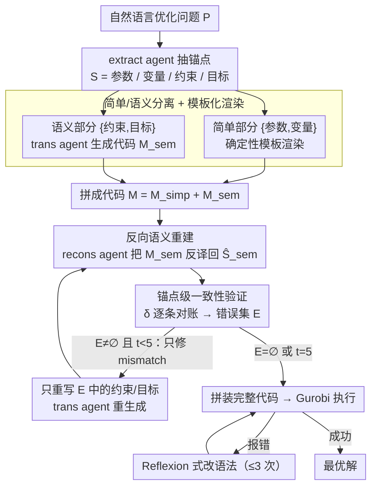

# SAC-Opt: Semantic Anchors for Iterative Correction in Optimization Modeling

**会议**: ICML2026  
**arXiv**: [2510.05115](https://arxiv.org/abs/2510.05115)  
**代码**: https://github.com/Forrest-Stone/SAC-Opt  
**领域**: 代码智能 / LLM 优化建模 / 自一致性修正  
**关键词**: 优化建模, 语义锚点, 反向修正, Solver 代码生成, LLM Agent

## 一句话总结
SAC-Opt 把 LLM 生成的优化求解器代码再"反向翻译"回结构化语义锚点（约束与目标），与原始问题描述的锚点逐条比对，只重写不一致的那条约束/目标并迭代到全部对齐，在 7 个公开数据集上平均提升 7.7%、ComplexLP 上提升 21.9%。

## 研究背景与动机

**领域现状**：用 LLM 把自然语言描述的优化问题（线性规划、整数规划等）直接翻译成 Gurobi/CPLEX 可执行代码，是降低运筹学使用门槛的主流路径。代表工作包括 CoE、CAFA、OptiMUS 系列，思路基本是"一次性前向生成 + 必要时根据 solver 报错做后处理"。

**现有痛点**：solver 只能检查语法和可行性，**检查不出语义错误**。一个本应是 $\le$ 的上界约束被写成 $\ge$ 的下界，代码照样能跑、照样能解出一个"最优解"，但这个解和原问题毫无关系。论文管这类故障叫 "silent semantic error"——它不抛异常，传统的 Reflexion 式 "看报错改代码" 完全捕捉不到。

**核心矛盾**：solver-driven 的反馈信号（执行错误、不可行性）和真正想要的 "代码是否忠实表达了问题意图" 之间有信息鸿沟。求 solver 给信号，等于让一个不懂业务的执行器去校验业务逻辑，本质上做不到。

**本文目标**：(1) 在不依赖 solver 反馈、不依赖额外训练的前提下，主动检测代码里的语义错误；(2) 让修正具备"细粒度"——别每次都把整个模型重生成一遍，只动出错那一条约束/目标；(3) 给出一个能收敛的迭代过程，而不是无限循环猜。

**切入角度**：作者的观察是——既然问题描述能被 LLM 抽成结构化的 $(\mathcal{P}, \mathcal{V}, \mathcal{C}, \mathcal{O})$（参数、变量、约束、目标），那也可以反过来用一个 agent 把生成的代码"翻译"回同样格式的结构化锚点 $\widehat{S}_{\mathrm{sem}}$。这两份结构化数据用同一种 schema，就能逐条对齐、逐条诊断、逐条修。

**核心 idea**：用"语义锚点"做双向桥梁，构造一个 "extract → translate → reconstruct → verify → re-translate" 的反向闭环，把代码生成从开环的前向流水线改成闭环的语义对齐过程。

## 方法详解

### 整体框架
SAC-Opt 想解决的是 LLM 把优化问题翻译成 solver 代码时那种"代码能跑、解也求得出、但和原问题对不上"的隐式语义错误。它的办法是不再单向地"描述→代码"一气呵成，而是绕一个闭环：先把自然语言问题 $P$ 抽成结构化锚点 $S=(\mathcal{P},\mathcal{V},\mathcal{C},\mathcal{O})$（参数/变量/约束/目标），生成代码后再用一个 agent 把代码"反向翻译"回同样 schema 的锚点 $\widehat{S}_{\mathrm{sem}}$，拿正反两份锚点逐条对账，哪条对不上就只重写哪条，直到全部对齐再交给 Gurobi 执行。

落到流程上是 6 步：`extract` agent 抽出 $S$；接着把 $S$ 拆成简单部分 $S_{\mathrm{simp}}=\{\mathcal{P},\mathcal{V}\}$（模板渲染）和语义部分 $S_{\mathrm{sem}}=\{\mathcal{C},\mathcal{O}\}$（`trans` agent 生成），拼成初始代码 $\mathcal{M}^{(0)}=\mathcal{M}_{\mathrm{simp}}+\mathcal{M}_{\mathrm{sem}}^{(0)}$；`recons` agent 把 $\mathcal{M}_{\mathrm{sem}}^{(t)}$ 反译回 $\widehat{S}_{\mathrm{sem}}^{(t)}$；用一致性函数 $\delta$ 逐条比对、找出错误集 $\mathcal{E}^{(t)}=\{s_i:\delta=0\}$；只重写 $\mathcal{E}^{(t)}$ 里的锚点后回到反译步继续验证，直到 $\mathcal{E}=\emptyset$ 或达到 $T_{\max}=5$ 轮；最后拼装完整代码送 Gurobi，若执行报错再按 Reflexion 式改语法（最多 3 次）。整条 pipeline 的关键是把"语义级修正"（反译—验证—重写这一段）和"语法级修正"（solver 报错那一段）彻底解耦，前者由结构化锚点驱动，后者由执行器报错驱动，各管一段互不干扰。

### 关键设计

**1. 简单/语义分离 + 模板化渲染：把修正算力全砸在约束和目标上**

参数与变量的声明本质上是格式化输出——`RollWidth = data["RollWidth"]` 这种代码不需要任何语言理解，让 LLM 来写反而徒增随机性。SAC-Opt 因此把锚点 $S$ 一刀切成两摊：简单部分 $S_{\mathrm{simp}}=\{\mathcal{P},\mathcal{V}\}$ 走确定性模板 $f_{\mathrm{det}}^{\mathrm{trans}}$ 直接渲染，语义部分 $S_{\mathrm{sem}}=\{\mathcal{C},\mathcal{O}\}$ 才交给 `trans` agent 用 LLM 生成。真正承载业务逻辑、容易出隐式错误的只有约束和目标，把它们单独拎出来，意味着后续的反译和验证都只针对 $\mathcal{M}_{\mathrm{sem}}$，状态空间从 $O(|\mathcal{P}|+|\mathcal{V}|+|\mathcal{C}|+|\mathcal{O}|)$ 直接砍到 $O(|\mathcal{C}|+|\mathcal{O}|)$。这一刀还顺带堵住了"修一条约束时手滑把某个变量声明也改错"的连锁污染——确定性部分根本不进修正循环。

**2. 反向语义重建：让模型自述病情，造出一个免标注的监督信号**

传统方法只能拿 solver 报错当反馈，可执行器只懂语法和可行性，对"运行对但意思错"无能为力，等于看症状猜病。SAC-Opt 的破局点是加一个独立的 `recons` agent，把生成出来的 solver 代码再翻译回**与原始锚点同 schema** 的结构化描述 $\widehat{S}_{\mathrm{sem}}=f_{\mathrm{agent}}^{\mathrm{recons}}(\mathcal{M}_{\mathrm{sem}})$——相当于强迫一个"读代码的人"用问题原本的语言重述这段代码到底干了什么。如果实现写错了（比如本该 $\le$ 的上界被写成 $\ge$ 的下界），反译出的 $\widehat{s}_i$ 自然会和原锚点 $s_i$ 对不上；如果实现是对的，两者应当语义等价。这一步是整个反向闭环的信号源：在没有 ground truth 解的前提下，用同一个 LLM 在正反两个方向上的表述差异，凭空造出了一个可以逐条比对的代理监督信号。

**3. 锚点级一致性验证 + 只修 mismatch 的可终止迭代**

有了正反两份锚点，就用二值一致性函数 $\delta(s_i,\widehat{s}_i)\in\{0,1\}$ 逐条判等价。它给了两种可替换的实现：LLM-based 让 `verif` agent 直接判等价（准但贵），Similarity-based 用 SentenceTransformer 算 cosine、以阈值 $\tau=0.75$ 卡（糙但能离线、无 GPU 跑），作者明确二者是 alternative implementations 而非融合或 oracle。每轮据此算出错误集 $\mathcal{E}^{(t)}$，**只对 $\mathcal{E}^{(t)}$ 里的锚点**执行 $\mathcal{M}_{\mathrm{sem}}^{(t+1)}[s_i]\leftarrow f_{\mathrm{agent}}^{\mathrm{trans}}(s_i)$ 重写，其余原封不动。这种细粒度增量修正避开了 self-refine 全文重写"改 A 弄坏 B"的全局回归病；更妙的是收敛性可由 $|\mathcal{E}^{(t)}|$ 的单调下降直接保证——每轮要么消除若干不一致、要么至少不变，循环至多 $T_{\max}=5$ 轮必停，错误集大小始终有界，整个循环可定义、可观测、可终止。

### 损失函数 / 训练策略
**无任何训练**。整个框架完全 training-free / supervision-free，4 个 agent（extract / trans / recons / verif）都是同一个 backbone LLM（默认 GPT-4o）在不同 prompt 下的角色化调用。关键超参：$T_{\max} = 5$（语义修正轮数），debug 轮数 $= 3$（solver 报错重试次数），相似度阈值 $\tau = 0.75$。这种"零训练 + 纯 prompt 调度"是本文一大卖点——可直接换装到 Qwen2.5-72B-Instruct 等开源模型仍然 work。

## 实验关键数据

### 主实验

backbone = GPT-4o，verifier = LLM-based，7 个数据集 5 次平均：

| 数据集 | SAC-Opt | 第二名 (OptiMUS-0.3) | 提升 |
|--------|---------|----------------------|------|
| NL4OPT | 86.8% | 79.8% | +7.0% |
| IndustryOR | 63.8% | 54.3% | +9.5% |
| EasyLP | 96.5% | 92.4% (CoE 94.4%) | +2.1% |
| ComplexLP | **79.6%** | 52.1% | **+21.9%** |
| NLP4LP | 94.0% | 89.8% | +4.2% |
| ReSocratic | 88.7% | 81.0% | +7.7% |
| ComplexOR | 58.9% | 57.1% (CoE) | +1.8% |
| **平均** | — | — | **+7.7%** |

越复杂的数据集（ComplexLP / IndustryOR / ReSocratic）提升越大，这恰恰是 solver-driven 方法最容易翻车的场景，说明语义反向校验抓住的就是"隐式语义错误"这块原本无人监管的空白。

### 消融实验

| 配置 | NL4OPT | IndustryOR | ComplexLP | NLP4LP | 说明 |
|------|--------|------------|-----------|--------|------|
| SAC-Opt | 86.8% | 63.8% | 79.6% | 94.0% | 完整模型 |
| w/o correction | 82.9% | 50.5% | 63.8% | 90.1% | 去掉语义锚点修正（步骤 3-5）|
| w/o debugging | 84.6% | 60.5% | 72.3% | 92.8% | 去掉 solver 报错修代码（步骤 6）|

**w/o correction 比 w/o debugging 掉得猛得多**（如 ComplexLP 掉 15.8% vs 7.3%）——这是论文最关键的一张表，直接证明"语义修正"才是性能主驱动，传统的"看报错改代码"只是辅助。

另外 Verifier 对比（表 4）：LLM-based 在 NL4OPT 上 86.8% vs Similarity-based 83.1%；运行时间 LLM 78s vs Sim 157s（Sim 因为信号糙、要更多迭代轮数：平均 4.6 vs 1.1 轮）；两种 verifier 跨 7 个数据集的 Pearson 相关 = 0.962，说明 verifier 选择不影响结论结构。

### 关键发现
- **语义修正 >> 语法修正**：去掉 semantic correction 在 ComplexLP 上掉 15.8%，去掉 debugging 只掉 7.3%，证明 solver-driven 范式确实漏掉了主要错误源。
- **跨 LLM 鲁棒**：换成 Qwen2.5-72B-Instruct，虽然绝对值低 GPT-4o 一截，但 SAC-Opt 相对 w/o correction 仍稳定提升 4-9%（ComplexLP 57.5%→62.9%），说明增益来自机制本身而非 GPT-4o 的特殊能力。
- **越难提升越大**：在简单数据集（EasyLP、NL4OPT）提升 2-7%，在复杂数据集（ComplexLP +21.9%、IndustryOR +9.5%）提升显著放大——隐式语义错误在复杂问题里更普遍。
- **轻量 verifier 也能打**：Similarity-based 用一个 all-MiniLM-L6-v2 句向量，无需 GPU、在 ComplexLP 上仍达 65.3%，超过大多数 baseline，说明"反向重建 + 逐条对齐"的架构本身就鲁棒，不强依赖 verifier 精度。

## 亮点与洞察
- **"反向翻译"作为自监督信号**：本质是用同一个 LLM 在两个方向上的表述差异充当 ground truth 的代理——既不要标注、也不要 solver 告诉你哪错了，只要正反两次描述对不上，就一定是哪里翻车了。这个思路完全可迁移到任何"自然语言 → 结构化执行体"的任务（SQL 生成、API 调用、工具使用、agent 任务规划），核心模式是：让一个 agent 把执行体反向描述回原始语义层，再和原始描述比对。
- **细粒度增量修正避免回归**：传统 self-refine 的死穴是"重生成整段代码导致改 A 弄坏 B"，SAC-Opt 用 schema 同构强行把修正 scope 锁在单条约束/目标上，是个非常工程化但极有效的设计——任何想做 self-correction 的 LLM 系统都该借鉴。
- **可终止的收敛保证**：不像很多迭代式 LLM 框架靠玄学超参止损，SAC-Opt 的收敛条件 $\mathcal{E}^{(t)} = \emptyset$ 是离散、可观测、单调下降的；即便 verifier 不完美，错误集大小至少有界。
- **simple/semantic 分离是被低估的细节**：把 $\mathcal{P}, \mathcal{V}$ 走确定性模板这一步看似工程小事，实际上把整个修正的状态空间从 $O(|\mathcal{P}| + |\mathcal{V}| + |\mathcal{C}| + |\mathcal{O}|)$ 砍成 $O(|\mathcal{C}| + |\mathcal{O}|)$，效率和稳定性都提升一大截。

## 局限与展望
- **依赖 extract 和 recons 两个 agent 都靠谱**：如果 `extract` agent 把原始问题就抽错了（比如漏了一条约束），后续整个流程就是在校验一个错误的 ground truth，本文也没正面回应 extraction 错误的传播问题。
- **缺乏人工 anchor-level 验证**：作者明确说 LLM-vs-Sim 两个 verifier 的 0.962 相关只是 dataset-level agreement，不是人工标注的 anchor-level 校准，所以语义等价判断到底有多准是个公开问题；若 LLM verifier 把错的判成对，循环会提前 break，掩盖错误。
- **重 LLM 调用代价**：每轮迭代要重新跑 `recons` + `verif`，最多 $T_{\max} = 5$ 轮，再加 3 轮 debug，单题平均 40-90 秒（表 4），相比 Standard 单次前向贵约 1-2 个数量级，对工业部署是非小成本。
- **只在线性/整数规划上验证**：所有 7 个数据集都是 LP/MILP，对非线性规划、动态规划、组合优化等更难的形式没验证；约束语言越复杂，`recons` agent 反向描述的歧义可能越大。
- **改进方向**：(1) 在 verifier 上做 human-in-the-loop calibration；(2) 给 extract 阶段也加一层反向验证形成两级闭环；(3) 把 recons agent 蒸馏成小模型降低成本；(4) 扩展到 NLP / SAT / Constraint Programming 等更广的"自然语言→形式化"任务族。

## 相关工作与启发
- **vs OptiMUS-0.3 (AhmadiTeshnizi et al., 2024a)**：OptiMUS 也做了 extraction 阶段的 correction（在抽 parameter/variable 时纠错），但代码层还是靠 solver 报错。SAC-Opt 把 correction 推到代码语义层、用反向重建做信号源，在所有数据集都明显超过 OptiMUS-0.3（如 ComplexLP 79.6% vs 52.1%）。
- **vs Reflexion (Shinn et al., 2023)**：Reflexion 是经典的 solver-driven 反馈范式——拿执行错误信息驱动自我反思。SAC-Opt 的批判直指要害：solver 反馈只能覆盖"运行错"，对"运行对但意思错"无能为力。两者其实可以叠加（事实上 SAC-Opt 步骤 6 就是 Reflexion 式的语法修正）。
- **vs CoE (Xiao et al., 2024)**：CoE 用多 agent 分工但仍是前向单次生成，没有验证-修正闭环；SAC-Opt 不光多 agent，更关键的是 agent 之间的反向闭环，本质区别是"分工" vs "对账"。
- **更广启发**：这套"前向生成 → 反向重建 → 逐元素对齐 → 选择性修正"的模板对所有"NL → DSL/code/structured-output"任务都成立——SQL 文本生成、JSON schema 抽取、function calling 参数填充、agent tool use 等场景都可以借这套架构做 self-correction，而且不需要任何额外训练。

## 评分
- 新颖性: ⭐⭐⭐⭐ 反向语义重建做 self-correction 是这个赛道里第一次显式提出的，思路干净
- 实验充分度: ⭐⭐⭐⭐ 7 个数据集 + 消融 + 跨 LLM + Verifier 对比 + Case Study 都齐全；只缺 anchor-level 人工校准
- 写作质量: ⭐⭐⭐⭐ 算法 1 和反向闭环图清晰，公式记号统一；动机部分对 "silent semantic error" 的反复点题很到位
- 价值: ⭐⭐⭐⭐ 模式本身可迁移到 NL→DSL 整个家族，工程上也 training-free 开箱即用，潜在影响面较大

<!-- RELATED:START -->

## 相关论文

- [\[ICML 2026\] Differential Syntactic and Semantic Encoding in LLMs](differential_syntactic_and_semantic_encoding_in_llms.md)
- [\[ACL 2026\] Iterative Formalization and Planning in Partially Observable Environments](../../ACL2026/llm_nlp/iterative_formalization_and_planning_in_partially_observable_environments.md)
- [\[ICML 2026\] Express Your Doubts: Probabilistic World Modeling Should Not Be Based on Token logprobs](express_your_doubts_--_probabilistic_world_modeling_should_not_be_based_on_token.md)
- [\[ACL 2025\] Quantifying Semantic Emergence in Language Models](../../ACL2025/llm_nlp/quantifying_semantic_emergence_in_language_models.md)
- [\[AAAI 2026\] VSPO: Validating Semantic Pitfalls in Ontology via LLM-Based CQ Generation](../../AAAI2026/llm_nlp/vspo_validating_semantic_pitfalls_in_ontology_via_llm-based_cq_generation.md)

<!-- RELATED:END -->
