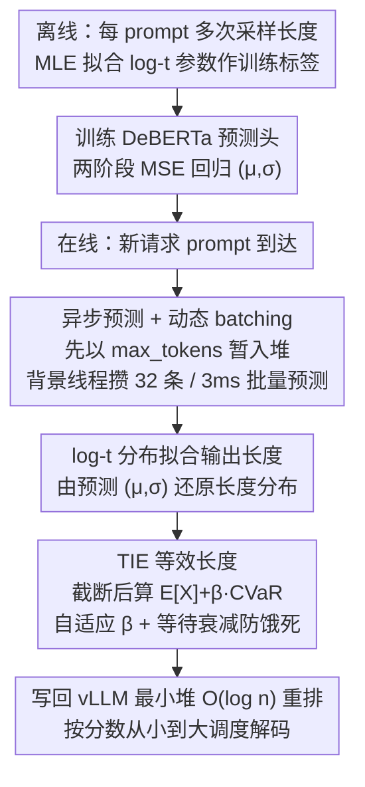

# Scheduling LLM Inference with Uncertainty-Aware Output Length Predictions

**会议**: ICML 2026  
**arXiv**: [2604.00499](https://arxiv.org/abs/2604.00499)  
**代码**: https://github.com/Hyzheng-code/TIE  
**领域**: LLM 效率 / 推理调度  
**关键词**: SJF 调度, 输出长度预测, 重尾分布, log-t 分布, CVaR

## 一句话总结
本文把 LLM 推理调度中"预测单一输出长度"的点估计换成 log-t 分布拟合，并用一个加上 CVaR 尾部惩罚的期望（Tail Inflated Expectation, TIE）替代 SJF 中的输出长度作为优先级，在 LMSYS-Chat-1M 上把在线每 token 延迟相比最强 baseline LTR 再降 $2.31\times$，离线 SDG 吞吐量提升 $1.42\times$。

## 研究背景与动机

**领域现状**：vLLM 这类 LLM 服务系统默认 FCFS 调度，长请求会阻塞短请求（HOL blocking）。一类主流改进是 SJF 思路：用一个轻量预测器（SSJF / LTR / TRAIL / ELIS）给每个 prompt 预测输出长度，然后按长度从短到长排队。

**现有痛点**：预测误差很大。Chen et al. (2025b) 报告输出长度预测的误差非常显著；为对抗预测错误，TRAIL / ELIS 之类方法在生成过程中反复预测并抢占（每个 token 或每 50 token 重预测一次），代价是预测和抢占本身的开销吞掉了一大部分调度收益。

**核心矛盾**：作者认为这些方法都没意识到一个更根本的问题——LLM 解码本身就是随机过程，每步从概率分布中采样一个 token，EOS 何时出现是随机变量。同一个 prompt 跑 100 次会得到 100 个不同长度。**用一个点估计去描述一个分布，必然在尾部出大错**：当一个本质偏长的请求被错预测成短的，它会卡住整个 batch；而 LLM 输出长度天然就是重尾分布（top 10% 长度占总长度的 35.7%，P99/P50 比例可达 10.77），让这件事雪上加霜。

**本文目标**：(1) 给输出长度找一个合适的概率分布族而不是单点估计；(2) 把分布信息转成一个标量优先级，让 SJF 调度器能直接用；(3) 在 vLLM 上以低开销跑起来。

**切入角度**：从 LLM 的解码过程出发证明输出长度服从幂律尾的重尾分布，从分布族里挑出 log-t (3 参数) 作为最佳拟合（KS 检验通过率 93.1%）。

**核心 idea**：用 log-t 分布拟合每条请求的输出长度，并用 $\mathbb{E}[X] + \beta \cdot \mathrm{CVaR}_\alpha[X]$ 作为 SJF 的"等效长度"，让调度器在排序时显式惩罚尾部风险高的请求。

## 方法详解

### 整体框架
方法把"预测一个长度数字"换成"预测一个长度分布再算风险敏感优先级"，跑在 vLLM 上。离线先为每个 prompt 用 MLE 拟合 log-t 分布参数当训练标签；在线时一个 fine-tuned DeBERTa-v3-base 直接从 prompt 预测分布参数，TIE 调度器把这个分布转成一个标量优先级喂给 vLLM 的最小堆队列，并用异步预测把预测开销藏在主循环之外。

### 关键设计

**1. log-t 分布拟合输出长度：用分布替代点估计**

所有 SJF 类方法的死穴是把"同一 prompt 跑 100 次会得到 100 个不同长度"这件事压成一个数字，一旦把本质偏长的请求错预测成短的，它就会卡住整个 batch。本文先从第一性原理论证为什么必须用重尾分布：Assumption 3.1 + Theorem 3.2 证明，若不同生成轨迹的终止概率 $p$ 在 0 附近的密度满足 $f(p)\sim c\cdot p^{\alpha-1}$，则输出长度 $L=\min\{t\ge 1: x_t=\text{EOS}\}$ 的尾概率满足 $P(L>n)\sim c\cdot\Gamma(\alpha)/n^\alpha$，即幂律衰减——这是重尾的充分条件。实证上他们对 LMSYS-Chat-1M 的 1K prompt 各采 100 次响应，统计平均偏度 3.10、变异系数 1.09，确认了重尾性质。

具体把每条请求的输出长度建模为 3 参数分布 $X \sim \text{Log-t}(\mu,\sigma,\nu)$，PDF 为 $f(x\mid\mu,\sigma,\nu) = \frac{1}{\sigma x}\cdot t_\nu\left(\frac{\ln x-\mu}{\sigma}\right)$，其中 $\nu$ 控制尾部厚度。分布族是跑 KS 检验在 6 个候选里挑出来的：log-t (3 参数) 通过率 93.1%，固定 $\nu=3.5$ 的 2 参数版 90.6%，而 log-normal 只有 60.3%。最终选 log-t($\nu=3.5$)——固定 $\nu$ 省掉一个待预测参数，拟合质量却几乎不掉。这一步直接化解了"点估计 vs. 随机解码"的根本矛盾，因为长度方差恰恰是决定调度风险的关键信号，而点估计完全看不见它。

**2. TIE：用 CVaR 把分布压成一个尾部敏感的等效长度**

有了分布还得变成一个标量才能塞进 SJF 队列排序。最直接的做法是取期望 $\mathbb{E}[X]$，但那等价于经典 SEPT 策略（消融里平均延迟 0.75s），它只看均值、对"均值不大但有 10% 概率特别长"的请求毫无戒心。TIE 的做法是先把预测分布在 `max_tokens` 处截断 $\tilde X = \min(X, x_{\max})$（生成不会超过上限），再定义优先级分数为期望加一个尾部惩罚项 $\text{Score} = \mathbb{E}[\tilde X] + \beta\cdot\mathrm{CVaR}_\alpha[\tilde X]$。这里 $\mathrm{CVaR}_\alpha[X] = \mathbb{E}[X\mid X\ge \text{VaR}_\alpha(X)]$ 是分布尾部 $(1-\alpha)$ 比例的条件期望，$\alpha=0.9$ 时就是"最坏 10% 情况下的平均长度"——比单点分位数 P90 更能反映极端长请求的代价。加上这一项后延迟从 0.75s 降到 0.67s。

惩罚力度 $\beta$ 随系统压力自适应：$\beta = \min(0.5, \max(0.1, 0.1\cdot L_q/B))$，其中 $L_q$ 是等待队列长度、$B$ 是最大 batch size。低负载时长请求阻塞代价小、应该贪心选短的（$\beta$ 趋小），高负载时阻塞代价大、应该保守惩罚尾部（$\beta$ 趋大）。两个期望都用 10k 蒙特卡洛采样估计而非数值积分。最后再叠一层等待衰减 $\text{Score}' = \text{Score}\cdot\gamma^{t_w/\tau}$（$\gamma=0.9, \tau=30s$），让等久了的长请求分数逐渐变小、避免饿死。

**3. 异步预测 + 动态 batching：把预测开销藏到主线程之外**

预测器本身要跑一次 DeBERTa、有 GPU 开销，之前 SSJF / LTR 走同步预测——请求来了先预测完才入队，结果低负载下白白阻塞、高负载下逐个预测又来不及。TIE 把调度器拆成主线程（管 vLLM 的 running batch）和背景预测线程。新请求到达时直接以 `max_tokens` 作初始分数插进最小堆等待队列（让未预测请求自然沉底、已预测的先跑），同时丢进预测队列；预测线程攒够 32 条或等够 3ms 就 batch 推理一次，结果回来后更新堆里分数并重新 heapify，单次操作复杂度只有 $O(\log n)$。这样低负载时新请求"先跑起来、再靠预测结果纠正排队顺序"，高负载时预测器又能高吞吐地清扫队列，预测开销基本不落在主路径上。

### 损失函数 / 训练策略
预测器对 $\mu$ 做 z-score 归一化，对 $\sigma$ 先做 $\tilde\sigma = \log(1+\sigma)$ 修正右偏再归一化，两个 MLP 头各 3 层 (256, 256, 128)，用 MSE 两阶段训练（先全参，再冻结 DeBERTa 只调 MLP）。训练数据取 LMSYS-Chat-1M 前 45K prompt × 20 次生成（共 900K 样本，与 SSJF/LTR 训练量对齐），最终 $\mu, \sigma$ 的 $R^2$ 分别为 0.82 和 0.76。

## 实验关键数据

### 主实验
8B 模型 + LMSYS-Chat-1M 在线 chatbot 服务，100 RPS 下平均每 token 延迟：

| 调度策略 | LMSYS PTLA (s/token) ↓ | 相对 FCFS 加速 | 相对 LTR 加速 |
|----------|------|------|------|
| FCFS (vLLM 默认) | 3.17 (推算) | 1.00× | — |
| SSJF | 1.95 (推算) | 1.62× | — |
| LTR | 1.55 (推算) | 2.05× | — |
| **TIE (本文)** | **0.67** | **4.73×** | **2.31×** |

70B 模型跨数据集泛化（训练只在 LMSYS-Chat-1M 8B 上做）：

| 测试数据 | 模型 | 指标 | FCFS | SSJF | LTR | **TIE** |
|----------|------|------|------|------|-----|---------|
| LMSYS-Chat-1M | 70B | Avg PTLA | 9.08 | 5.50 | 4.34 | **2.41** |
| ShareGPT | 70B | Avg PTLA | 4.36 | 2.43 | 2.22 | **1.41** |
| Alpaca | 70B | Avg PTLA | 4.52 | 2.06 | 2.36 | **1.54** |
| LMSYS-Chat-1M | 70B | P90 PTLA | 16.13 | 8.24 | 7.03 | **4.05** |

离线 SDG (Alpaca + 8B)：time@3K 从 LTR 的 139.5s 降到 **98.1s**（$1.42\times$），3 分钟吞吐从 3672 → **4762** 样本。

### 消融实验
LMSYS-Chat-1M + 8B 在线服务，PTLA / 3K 时间：

| 配置 | Avg PTLA (s) | P90 PTLA (s) | Time@3K (s) | 说明 |
|------|------|------|------|------|
| **TIE 完整**（log-t, $\nu$=3.5, $\mathbb{E}+\beta\cdot\text{CVaR}$） | **0.67** | **0.96** | **98.12** | 默认配置 |
| log-t (dynamic $\nu$) | 0.69 | 1.02 | 97.70 | 多 1 个参数收益微小，效率更差 |
| log-normal 替换 log-t | 1.63 | 3.37 | 142.21 | 拟合差 (60% vs 90% KS) 直接拉爆 |
| 仅 $\mathbb{E}[X]$（SEPT） | 0.75 | 1.21 | 108.51 | 去掉 CVaR 尾部惩罚 |
| $\mathbb{E}+0.1\cdot\text{CVaR}$ (固定) | 0.72 | 1.15 | 104.76 | 固定 $\beta$ 不如自适应 |
| $\mathbb{E}+0.3\cdot\text{CVaR}$ (固定) | 0.71 | 1.18 | 105.04 | 同上 |

### 关键发现
- **分布族选择直接决定调度上限**：log-normal 的 KS 通过率从 90.6% 掉到 60.3%，端到端 PTLA 从 0.67s 暴涨到 1.63s——分布拟合质量是这条技术路线的瓶颈。
- **CVaR 比单纯期望好**：去掉 CVaR 退化为 SEPT，平均 PTLA 从 0.67 → 0.75（+12%），P90 从 0.96 → 1.21（+26%），尾部惩罚对 P90 类指标尤其关键。
- **跨模型跨数据集泛化强**：训练只在 8B + LMSYS 上做，迁到 70B + ShareGPT/Alpaca 仍稳居第一，作者归因于分布建模避免了对具体 workload 的过拟合。
- **RPS 抗压性更好**：RPS 从 30 涨到 100，FCFS/SSJF/LTR 的 PTLA 分别恶化 $7.42\times / 8.55\times / 6.17\times$，TIE 只恶化 $3.68\times$——自适应 $\beta$ 在高压时变保守起到了关键作用。
- **可视化解释**（Figure 5）：把 (输出长度, 完成时间) 画成 heatmap，SSJF/LTR 短请求扎堆但长请求散开，TIE 即使在长尾区域也保持高聚集度——说明它对"长度方差大"的请求排序更准。

## 亮点与洞察
- **把"调度问题"重新表述为"分布预测 + 风险敏感排序"**：这套范式（log-t + CVaR）几乎不依赖 LLM 特性，可以平移到任何"任务执行时间天然随机"的调度场景（例如 GPU kernel launch、查询优化器、ML 训练任务排队）。
- **从随机解码过程推出幂律尾的理论桥梁很优雅**：Theorem 3.2 把"轨迹间终止概率的分布"和"输出长度的幂律尾"严格连起来，给"为什么要用重尾分布"提供了第一性原理的支撑，不是凑出来的经验选择。
- **CVaR 比 P90 更适合调度风险**：作者明确比较了 CVaR 和单点分位数 P90，指出 P90 只是一个点，而 CVaR 是"P90 之上的条件期望"，对极端事件更敏感——这个观察可以迁移到任何用 P90/P99 做 SLA 的系统。
- **异步预测 + 动态 batching 是被低估的工程亮点**：很多预测式调度论文方法漂亮但工程上跑不动，本文 3ms 攒批 + 最小堆延后更新的设计直接把预测开销藏到主路径之外，复杂度只有 $O(\log n)$。

## 局限与展望
- **重训练成本高**：DeBERTa fine-tune 要 45K prompt × 20 次响应 = 900K 样本，跨模型时（虽然论文证明 8B 训练的预测器能直接服务 70B）仍需重训练才能拿到最佳性能，对新发布的模型来说不够即插即用。
- **log-t($\nu=3.5$) 是平均最优但非全局最优**：固定 $\nu$ 牺牲了部分拟合质量；dynamic $\nu$ 的消融显示性能接近但代价是参数从 2 个变 3 个，作者选效率，但在对延迟极敏感的批服务里可能值得再调。
- **依赖 vLLM 的 continuous batching**：没讨论 PagedAttention 之外的服务栈（如 TensorRT-LLM）上能否复用，特别是 KV cache 抢占代价不同的系统里 CVaR 的 $\beta$ 范围可能要重新校。
- **没有处理 multi-turn / 流式对话**：所有实验都假设一次性提交全 prompt，但实际 chatbot 是 multi-turn 累积上下文，预测器需要在每轮重新预测，分布也可能随历史漂移。
- **改进方向**：把预测器换成更轻的 in-flight head（用 LLM forward 的隐状态而不是单独跑 DeBERTa），可以省掉一次 86M 参数模型推理；让 $\nu$ 也作为预测输出，做到"每个请求一个尾部厚度"。

## 相关工作与启发
- **vs SSJF (Qiu et al., 2024)**：SSJF 用 BERT 类小模型直接回归一个输出长度数值，本文同样用 BERT 类小模型，但回归的是 log-t 分布的 2 个参数；本文优势是显式刻画了不确定性。
- **vs LTR (Fu et al., 2024)**：LTR 把预测变成排序（learning-to-rank）以缓解回归误差，本文则证明回归本身没问题，只要预测对象从点变成分布即可；本文在所有数据集上都明显优于 LTR。
- **vs TRAIL / ELIS（迭代预测+抢占）**：这两类方法靠"边生成边重预测+抢占"对抗预测误差，每 1 或 50 token 重跑一次预测器并可能换出运行中的请求，代价是显著的预测/抢占开销。本文证明只要把分布抓对了，**一次性预测 + 不抢占**就够了，工程上简单很多。
- **vs 经典 SEPT (Weber, 1983)**：SEPT 是按期望排序的最优策略（最小化期望完成时间），但只在分布已知且无截断时最优。本文 $\beta=0$ 时就退化为 SEPT，加上 CVaR 项相当于在 SEPT 上加了"尾部风险厌恶"，类似金融里的 mean-CVaR 优化。

## 评分
- 新颖性: ⭐⭐⭐⭐⭐ 把"分布预测 + CVaR 调度"系统地用到 LLM serving 是清晰的范式转移，理论 + 实验都打得很完整。
- 实验充分度: ⭐⭐⭐⭐⭐ 3 个数据集 × 2 个模型 + 在线/离线两套场景 + 6 个分布族对比 + RPS 30→100 抗压实验 + heatmap 可视化，几乎该有的都有。
- 写作质量: ⭐⭐⭐⭐ 逻辑清晰、动机层层递进，Theorem 3.2 给理论桥梁；只是部分公式（如 CVaR 截断后的 $\Psi$ 表达式）需要看附录才能完整理解。
- 价值: ⭐⭐⭐⭐⭐ 直接基于 vLLM 0.11.1 实现，开源代码，无侵入式改动，工业界（serving 团队）可以低成本接入并立刻获得 $2\times$ 量级的延迟/吞吐改进。

<!-- RELATED:START -->

## 相关论文

- [\[ACL 2025\] Revisiting Uncertainty Quantification Evaluation in Language Models: Spurious Interactions with Response Length Bias Results](../../ACL2025/llm_nlp/revisiting_uncertainty_quantification_evaluation_in_language_models_spurious_int.md)
- [\[ICML 2026\] A Geometric Relation of the Error Introduced by Sampling a Language Model's Output Distribution to its Internal State](a_geometric_relation_of_the_error_introduced_by_sampling_a_language_models_outpu.md)
- [\[ICML 2026\] SLAY: Geometry-Aware Spherical Linearized Attention with Yat-Kernel](slay_geometry-aware_spherical_linearized_attention_with_yat-kernel.md)
- [\[ACL 2025\] LLM Braces: Straightening Out LLM Predictions with Relevant Sub-Updates](../../ACL2025/llm_nlp/llm_braces_straightening.md)
- [\[ICML 2026\] Compute as Teacher: Turning Inference Compute Into Reference-Free Supervision](compute_as_teacher_turning_inference_compute_into_reference-free_supervision.md)

<!-- RELATED:END -->
