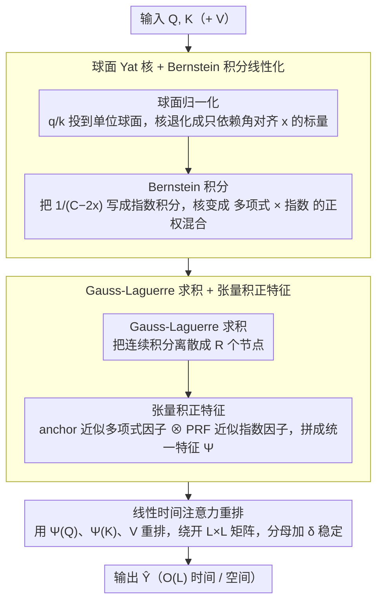

# SLAY: Geometry-Aware Spherical Linearized Attention with Yat-Kernel

**会议**: ICML 2026  
**arXiv**: [2602.04915](https://arxiv.org/abs/2602.04915)  
**代码**: 无  
**领域**: 线性注意力 / Transformer 高效化 / 长上下文建模 / 核方法  
**关键词**: Yat-kernel, 球面归一化, Bernstein 定理, 正随机特征, Gauss–Laguerre 求积

## 一句话总结
SLAY 把受物理"逆平方相互作用"启发的 Yat-kernel 通过 (1) 球面归一化 (2) Bernstein 定理的 Laplace 积分表示 (3) Gauss-Laguerre 求积 (4) 多项式+指数核张量积正随机特征四步连击线性化，得到 $O(L)$ 时间复杂度且与 softmax 几乎无差异的注意力机制。

## 研究背景与动机

**领域现状**：标准 Transformer 用 softmax 注意力，要构造 $L \times L$ 矩阵，时空都是 $O(L^2)$，长上下文场景下成本爆炸。已有大量 efficient attention 工作：聚类/哈希 (Reformer)、核近似 + 随机特征 (Performer/FAVOR+)、低秩 (Linformer)、滑窗等。

**现有痛点**：(1) 早期 Rahimi-Recht 风的三角随机特征会产生**负值**，训练不稳；Performer 用正随机特征 (PRFs) 解决了稳定性但仍只逼近 softmax 那一类核。(2) softmax 把"对齐"和"模长"耦合在 $\exp(\mathbf{q}^\top \mathbf{k})$ 里，需要小心 normalize/stabilize。(3) 新兴的 Yat-kernel $\text{Yat}(\mathbf{q}, \mathbf{k}) = (\mathbf{q}^\top \mathbf{k})^2 / (\|\mathbf{q} - \mathbf{k}\|^2 + \epsilon)$（受逆平方力启发）天然几何感知——既奖励对齐又惩罚距离，但**不可因子化**：$\|\mathbf{q} - \mathbf{k}\|^2 = \|\mathbf{q}\|^2 + \|\mathbf{k}\|^2 - 2\mathbf{q}^\top \mathbf{k}$ 把 q/k 耦合进分母，无法走 Performer 那条"分解—重排"路线，naive 实现仍是 $O(L^2)$。

**核心矛盾**：想要 Yat-kernel 的几何感知性（自正则 + 自由活动），又想要线性时间复杂度——但分母里的距离项天然不可分。

**本文目标**：(1) 设计一种保持 Yat-kernel 几何性质但**可分**的核变体；(2) 推导其线性时间近似；(3) 在保持 softmax 级别性能的同时让随机特征数控制得住；(4) 严格论证非负性以避免 negative-attention 不稳定。

**切入角度**：作者注意到，若把 q/k 强制到单位球面 $\mathbb{S}^{d-1}$，则 $\|\mathbf{q}-\mathbf{k}\|^2 = 2 - 2\mathbf{q}^\top\mathbf{k}$，整个 kernel 就只依赖角对齐 $x = \mathbf{q}^\top \mathbf{k} \in [-1, 1]$，记作 $\text{Yat}_{\text{sph}}(\mathbf{q}, \mathbf{k}) = x^2 / (C - 2x)$，$C = 2 + \epsilon$。**这就把 q/k 解耦了**，但 $1/(C-2x)$ 仍不是因子化形式，怎么办？用 Bernstein 定理把 $1/y$ 写成 $\int_0^\infty e^{-sy} ds$，再做 Gauss-Laguerre 求积离散化，每个节点都是一个**多项式 × 指数**核——而这两类核都有现成的正随机特征。

**核心 idea**：球面归一化解耦 + Bernstein 拉普拉斯积分把不可分核写成正混合的指数簇 + Gauss-Laguerre 求积 + 张量积正随机特征——四步把"几何感知 + 线性时间 + 训练稳定"打包在一起。

## 方法详解

### 整体框架
SLAY 想要的是一个"既有几何感知、又是线性时间"的注意力。难点全在 Yat-kernel 的分母把 q/k 耦合死了，没法走 Performer 的"分解—重排"。整套方法就是一条四步流水线，把这个不可分的核一层层拆开：先把 q/k 归一化到单位球面、让核退化成只依赖角对齐 $x=\hat{\mathbf{q}}^\top\hat{\mathbf{k}}$ 的标量函数；再用 Bernstein 定理把分母写成指数积分、把整个核变成"二阶多项式 × 指数"两类可线性化原子核的**正权混合**；接着用 Gauss-Laguerre 求积把积分离散成有限个节点；最后给每个节点的两类原子核各配一组正随机特征、张量积融合后拼接，得到统一的特征映射 $\widetilde{\Psi}(\cdot)$。有了 $\widetilde{\Psi}$，注意力就按 $\hat{\mathbf{Y}} = \widetilde{\Psi}(\mathbf{Q})\,(\widetilde{\Psi}(\mathbf{K})^\top \mathbf{V}) / \widetilde{\Psi}(\mathbf{Q})\,(\widetilde{\Psi}(\mathbf{K})^\top \mathbf{1})$ 计算，永不显式构造 $L\times L$ 矩阵。

### 关键设计

**1. 球面 Yat 核 + Bernstein 积分线性化：把不可分的几何核拆成可线性化的正混合**

Yat-kernel 的麻烦在于 $\|\mathbf{q}-\mathbf{k}\|^2$ 把 q/k 缠在分母里，naive 实现还是 $O(L^2)$。第一步先用单位球面归一化解开它：q/k 落到 $\mathbb{S}^{d-1}$ 后 $\|\hat{\mathbf{q}}-\hat{\mathbf{k}}\|^2 = 2(1-\hat{\mathbf{q}}^\top\hat{\mathbf{k}})$，整个核就缩成只依赖角对齐的标量 $\text{Yat}_{\text{sph}} = x^2/(C-2x)$（$C=2+\epsilon$），等价于一个被球面弦距离正则的对齐分数 $(\hat{\mathbf{q}}^\top\hat{\mathbf{k}})^2/(d_{\mathbb{S}^{d-1}}^2+\epsilon)$。q/k 解耦了，但 $1/(C-2x)$ 还不是因子化形式。

关键一招是 Bernstein 定理：$g(y)=1/y$ 在 $(0,\infty)$ 上完全单调，因此有 Laplace 表示 $1/y = \int_0^\infty e^{-sy}\,ds$。代入 $y=C-2x$（$x\in[-1,1]$ 时 $y\ge\epsilon>0$，条件满足）得

$$\text{Yat}_{\text{sph}} = \int_0^\infty e^{-sC}\cdot x^2 e^{2sx}\,ds.$$

这就把一个不可分核改写成了"二阶多项式 $x^2$ × 指数 $e^{2sx}$"的**正权混合**——而这两类原子核都有现成的正随机特征。把不可分核拆成"可线性化原子核的正加权和"是 Performer 之外的另一条线性化套路：只要每个原子核的近似非负，加权和的近似也保持非负，下游分母才不会抵消崩溃。

**2. Gauss-Laguerre 求积 + 张量积正特征：把积分离散后用 Anchor + PRF 近似两个因子**

积分是连续的，得先离散。这里用 $R$ 点 Gauss-Laguerre 求积 $\int_0^\infty e^{-sC} h(s)\,ds \approx \sum_r w_r h(s_r)$（节点 $s_r=t_r/C$、权重 $w_r=\alpha_r/C$），把它变成有限个"多项式 × 指数"核乘积之和。每个乘积里的两个因子各配一组随机特征：**多项式因子** $(\hat{\mathbf{q}}^\top\hat{\mathbf{k}})^2$ 用 anchor features $\phi_{\text{anc}}(\mathbf{x}) = \frac{1}{\sqrt{P}}[(\mathbf{x}^\top\mathbf{a}_i)^2]_{i=1}^P$（默认选择，保非负且不需 Gram 矩阵反演）；**指数因子** $e^{2s\hat{\mathbf{q}}^\top\hat{\mathbf{k}}}$ 用 Choromanski 的 PRF $\phi_{\text{PRF}}(\mathbf{u};s) = \frac{1}{\sqrt{D}}[\exp(\sqrt{2s}\,\omega_i^\top\mathbf{u}-s)]_{i=1}^D$（$\omega_i\sim\mathcal{N}(0,I_d)$，在单位球面上无偏估计指数核）。两套特征用 **Tensor Product Sketch** $\mathcal{S}$ 融合并降维，省掉显式 $D_p\cdot D_r$ 维的 Kronecker 向量。

为什么挑 anchor 而不是更快的 TensorSketch/Random Maclaurin？因为后者带符号，会在分母处产生负值、引发除零或抵消崩溃，而 anchor 保非负。论文 Table 1 按"维度/成本/无偏/非负"四维比较四种多项式近似，唯一同时无偏又非负的只有显式 $\text{vec}(uu^\top)$（$d^2$ 维太大）和 anchor；Table 2 实证 anchor 在 489ms 内拿到最低 relative L2 error，比 Laplace-only(1906ms) 快 4×，比 TensorSketch/RM/Nystrom 误差小三到四个数量级。

**3. 线性时间注意力计算 + 数值稳定化：装配特征后走标准线性注意力重排**

前三步的产物是统一特征映射：拼接所有节点的特征得 $\widetilde{\Psi}(\mathbf{Q}),\widetilde{\Psi}(\mathbf{K})\in\mathbb{R}^{L\times m}$（$m=O(R D_t)$）。有了它，注意力就按 $\hat{\mathbf{Y}} = \widetilde{\Psi}(\mathbf{Q})\,(\widetilde{\Psi}(\mathbf{K})^\top\mathbf{V}) / \widetilde{\Psi}(\mathbf{Q})\,(\widetilde{\Psi}(\mathbf{K})^\top\mathbf{1})$ 重排计算——分子是 $L\times d_V$，分母是 $L\times 1$ 向量按行广播，整体时间 $O(Lmd_V)$、空间 $O(Lm)$，$L^2$ 项彻底消失。分母再加一个小稳定项 $\delta$ 防除零。这一步本身是 Performer 的标准套路，SLAY 的全部创新都压在如何得到 $\widetilde{\Psi}$ 的前三步上，第四步顺水推舟。

### 损失函数 / 训练策略
本文不改训练损失，只换注意力机制；SLAY 作为 drop-in 替换其他 attention（softmax / Performer FAVOR+ / Cosformer / Linear ELU+1），其余超参不变，便于公平比较。

## 实验关键数据

### 主实验
五维度评估：(1) 多项式因子近似方法对比；(2) 计算成本扩展性；(3) 22 个合成任务（核心能力测试）；(4) 极端分类；(5) 完整 Transformer 模型训练。

| 评估场景 | 指标 | SLAY (Anchor) | 对比 | 备注 |
|---------|------|--------------|------|------|
| 多项式核近似质量 | Rel. L2↓ | 0.527 | Laplace-only 0.544; Nystrom 70.3; TensorSketch 24823 | anchor 误差最小 |
| 多项式核近似延迟 | Latency (ms)↓ | **489** | Laplace-only 1906; Hadamard 1932 | anchor 快 4× |
| 多项式核近似余弦 | Cos↑ | 0.850 | Hadamard 0.732; Nystrom -0.009 | anchor 最高对齐 |
| 长序列扩展 (A100) | 序列长度上限 | 131K | Standard OOM 较早 | $O(L)$ 内存/计算 |
| Transformer 端到端 | 性能差距 vs softmax | "几乎不可区分" | Performer/Cosformer 显著退化 | 论文核心结论 |

### 消融实验

| 配置 | 关键指标 | 说明 |
|------|---------|------|
| 完整 SLAY (球面 + Bernstein + GL + Anchor + PRF) | 最优 | — |
| w/o 球面归一化 | 不可分仍 $O(L^2)$ | 球面是线性化前提 |
| TensorSketch 代替 Anchor | 误差 4 个数量级 | 失去非负性，分母抵消崩溃 |
| Nystrom 代替 Anchor | 误差不可接受 | 需 Gram 反演损失非负 |
| Laplace-only (无 polynomial factor) | 误差略大且慢 4× | 多项式因子是几何感知关键 |
| Hadamard (共享 $\omega$) | 误差与 exact softmax 接近但延迟 1932ms | 不实用 |

### 关键发现
- **Anchor features 是 sweet spot**：保非负、无偏、$O(dP)$ 廉价，比 Nystrom 稳定，比 TensorSketch/RM 精确。
- **非负性是稳定性的根本**：有符号近似 (TensorSketch/RM/Nystrom) 在分母处可能产生负值，导致除零或抵消，论文专门留 Appendix L.2 论证。
- **球面归一化 + Bernstein** 是把"不可分核"线性化的可推广套路——任何"距离正则的对齐分数"都可以用此模板。
- 在 131K 序列长度下 SLAY 仍可正常运行，而 standard attention 早已 OOM。

## 亮点与洞察
- **Bernstein 定理把不可分核炼成正混合**：这是数学工具应用的漂亮典范——把数值线性代数和概率核方法连起来。
- **"几何感知" + "线性时间" 二选一被打破**：Yat-kernel 的物理直觉（逆平方相互作用）被保留，同时享受 $O(L)$ 复杂度。
- **Anchor features 作为多项式核 sweet spot**：作者把四种竞争方法整理成 Table 1，按维度/成本/无偏/非负四个维度比较，是非常清晰的工程决策示范。
- 这套"球面化 + Bernstein + GL + tensor-product RF"是通用模板，可移植到其他物理启发或几何启发的核（如多极/Coulomb 形式）。

## 局限与展望
- **求积节点数 $R$ 与 PRF 数 $D$ 是超参**，需要扫描；论文未给自动选择策略。
- 多项式因子是固定的二次（$(\hat{\mathbf{q}}^\top \hat{\mathbf{k}})^2$）；若要更高阶多项式调控锐度，需要重新设计 anchor features。
- 当前实验主要验证 transformer encoder 风格任务；自回归 LM、code 任务、多模态等需要进一步验证。
- 球面归一化抹掉了 q/k 的模长信息——这可能让模型损失某些"权重大小"信号；但作者论证这是 softmax 类似的归一化代价。
- 默认 anchor 数 $P$、PRF 数 $D$、求积阶 $R$ 之间的最优配置随 d 和 L 变化，工程上需要 case-by-case 调。

## 相关工作与启发
- **vs Performer / FAVOR+ (Choromanski 2021)**：他们线性化 softmax，本文线性化 Yat-kernel；都用 PRF 但本文多了 Bernstein 这一非平凡步骤。
- **vs Cosformer (Qin 2022)**：cosformer 重设计了相似度函数走 $O(L)$，但失去 softmax 的表达力；SLAY 用 Yat-kernel 兼得几何感知 + $O(L)$。
- **vs Reformer (LSH-based)**：哈希走的是稀疏近似，复杂度依赖于桶内冲突；SLAY 走的是稠密低秩近似，复杂度更可预测。
- **vs ELU+1 linear attention**：那是最简单的特征映射，性能上限有限；SLAY 用更精细的"多项式 + 指数"组合近似，性能接近 softmax。
- **vs Hadamard shared $\omega$ 变体**：误差相同但延迟差 4 倍，工程上不实用。

## 评分
- 新颖性: ⭐⭐⭐⭐⭐ 把 Bernstein 定理引入注意力线性化是真正新颖的数学操作；球面化 + Yat 几何感知是新方向
- 实验充分度: ⭐⭐⭐⭐ 五维度评估很完整（多项式近似/扩展/合成任务/极端分类/端到端 Transformer），缺自回归 LM 大规模验证
- 写作质量: ⭐⭐⭐⭐⭐ 每一步推导都有定理 + Remark 支持，数学严谨且工程实现清晰
- 价值: ⭐⭐⭐⭐ 提供 softmax 级别性能 + $O(L)$ 复杂度的高质量替代品；anchor features 的整理对线性注意力社区有直接参考价值

<!-- RELATED:START -->

## 相关论文

- [\[NeurIPS 2025\] Unifying Attention Heads and Task Vectors via Hidden State Geometry in In-Context Learning](../../NeurIPS2025/llm_nlp/unifying_attention_heads_and_task_vectors_via_hidden_state_geometry_in_in-contex.md)
- [\[ICML 2026\] Scheduling LLM Inference with Uncertainty-Aware Output Length Predictions](scheduling_llm_inference_with_uncertainty-aware_output_length_predictions.md)
- [\[NeurIPS 2025\] MonarchAttention: Zero-Shot Conversion to Fast, Hardware-Aware Structured Attention](../../NeurIPS2025/llm_nlp/monarchattention_zero-shot_conversion_to_fast_hardware-aware_structured_attentio.md)
- [\[ICML 2026\] In-Context Routing (ICR): 一次训练、处处可用的 attention-level 隐式 ICL](train_once_reuse_everywhere_generalizable_implicit_in-context_learning_by_routin.md)
- [\[NeurIPS 2025\] Adaptive Kernel Design for Bayesian Optimization Is a Piece of CAKE with LLMs](../../NeurIPS2025/llm_nlp/adaptive_kernel_design_for_bayesian_optimization_is_a_piece_of_cake_with_llms.md)

<!-- RELATED:END -->
