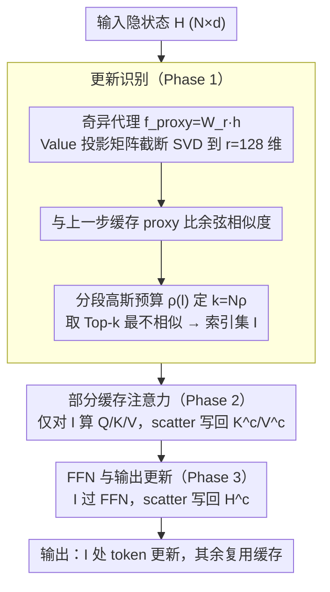

# SPA-Cache: Singular Proxies for Adaptive Caching in Diffusion Language Models

**会议**: ICML 2026  
**arXiv**: [2602.02544](https://arxiv.org/abs/2602.02544)  
**代码**: https://github.com/wenhao728/spa-cache (有)  
**领域**: LLM 效率 / 扩散语言模型 / 推理加速  
**关键词**: Diffusion LM, KV Cache, 奇异值分解, 自适应预算, 推理加速

## 一句话总结
SPA-Cache 把扩散语言模型 (DLM) 中"哪些 token 需要更新"的判定，从原本在 $d=4096$ 维 Value 空间做余弦相似度，压缩到 $r=128$ 的奇异子空间，并按层动态分配更新预算，在不掉精度的前提下让 LLaDA-8B 在 GSM8K 上达到 $6.4\times$、在 MBPP 上达到 $8\times$ 的吞吐提升，叠加并行解码后总加速 $28\times$。

## 研究背景与动机
**领域现状**：扩散语言模型 (DLM) 如 LLaDA-8B、Dream-7B 以双向注意力 + 任意顺序解码取代了 AR 模型的左到右生成范式，在多模态、推理和"反转诅咒"等任务上展示了竞争力。但 DLM 每个解码步都要对整段长度 $N$ 的序列做完整 forward，复杂度 $O(T \cdot N^2)$，相比 AR 模型的 KV-Cache 极为低效。

**现有痛点**：标准 KV-Cache 因解码顺序不固定而不可用。后续工作走两条路：(i) dKV-Cache、d2Cache、Fast-dLLM 采用窗口启发式，假设"只更新最近解码 token 附近的隐状态"，缺乏理论依据；(ii) dLLM-Cache 监控 Value 状态漂移，在任意位置识别"漂移 token"，但每步都要在 $d$ 维空间做投影 + 相似度，开销大；且在所有层用统一更新比例 $\rho$，把固定预算平均分给所有层。

**核心矛盾**：识别开销和稀疏收益之间存在 trade-off——降低更新比例 $\rho$ 能减少 attention/FFN 计算，但 $d$ 维相似度计算本身就把节省吃掉了一大半。同时，作者通过 Figure 2 观察到不同层的漂移 token 比例差异巨大：浅层做 embedding 变换、深层趋于稳定，中间层才是漂移高峰；用统一 $\rho=25\%$ 会在浅/深层浪费预算，而 $\rho=20\%$ 又会把中间高方差层算"漏"。

**本文目标**：同时优化"哪些 token 要更新"和"每层分多少更新预算"两件事。

**切入角度**：作者形式化分析 DLM 隐状态演化，证明 Value 状态的余弦相似度可以作为 attention output 和 FFN output 漂移的上界（Theorem 3.1/3.2），且 $W$ 的截断 SVD 在 $r \ll d$ 子空间内能保持相似度结构（Theorem 3.4）。这意味着不必在全维 Value 上做相似度，只在前 $r$ 个奇异方向上算就够了。

**核心 idea**：用 $W$ 的截断 SVD 构造的低维"奇异代理 (singular proxy)"代替全维 Value 来识别漂移 token，再用分段高斯函数按层自适应分配更新预算 $\rho(l)$。

## 方法详解

### 整体框架
SPA-Cache 要解决的核心问题是：DLM 每个解码步都对全序列重算 forward，但其实大部分 token 的隐状态在步间几乎不变，只要找出真正"漂移"的少数 token 重算、其余复用缓存就能省下大量计算——难点在于"找漂移 token"这件事本身别太贵，而且不同层该重算的比例还不一样。围绕这两点，单个 Transformer block 的 SPA-Cache 工作流分三阶段（Algorithm 1）：先做**更新识别**，把输入隐状态 $H \in \mathbb{R}^{N \times d}$ 经低维投影 $f_\text{proxy}: \mathbb{R}^d \to \mathbb{R}^r$ 得到 proxy 标识，与上一步缓存的 proxy 比余弦相似度，按当前层预算 $\rho(l)$ 选出 Top-$k$（$k = N\rho$）最不相似的索引集 $\mathcal{I}$；再做**部分缓存注意力**，只对 $\mathcal{I}$ 里的 token 算 $Q_\mathcal{I}, K_\mathcal{I}, V_\mathcal{I}$ 并 scatter 写回缓存 $K^c, V^c$，让这批 sparse query 对完整 KV 缓存做 attention；最后**更新 FFN 与输出**，sparse attention 输出过 FFN 后 scatter 写回输出缓存 $H^c$，未选中的 token 直接复用缓存。这样每层 attention 与 FFN 的计算量从 $O(N)$ 降到 $O(k) = O(N\rho)$，而 $\rho$ 还按层自适应。下面三个设计分别回答"该用什么信号选 token""怎么把选 token 这步算便宜""每层该选多少"——其中"该用什么信号"由理论奠基（Theorem 3.1/3.2 证明 Value 相似度是漂移上界）回答，框架图里不单列节点；另两个设计是 Phase 1 里真正改造的环节，体现在下图的更新识别阶段。

### 关键设计

**1. 理论奠基：把"用 Value 选 token"从经验升成有上界的保证**

前作 dLLM-Cache 监控 Value 状态漂移来选 token 纯属经验观察，没人说清为什么不用 Query/Key 或 attention output。本文用两个定理把这条经验串成一条因果链：Theorem 3.1 证明 attention output 的余弦不相似度被 Value 不相似度上界控制，$1 - \mathcal{S}_\cos(h_i^t, h_i^{t+1}) \le C \cdot (1 - \mathcal{S}_\cos(v_i^t, v_i^{t+1})) + \epsilon$；Theorem 3.2 再证 FFN 输出差被其输入相似度上界，$\|f_\text{FFN}(h_1) - f_\text{FFN}(h_2)\|_2 \le C \cdot \sqrt{1 - \mathcal{S}_\cos(h_1, h_2)} + \epsilon$。两者衔接起来就是"Value 稳 → attention 稳 → FFN 稳"，所以只要 Value 相似度高，整个 block 的输出就可以放心复用。实证（Table 1）也佐证了这个选择：Value 是唯一同时守住 78.59% 精度和 164.88 TPS 的标识符，而 attn output 因深层各向异性 (anisotropy) 把不同 token 都挤进同一窄锥、彼此难以区分，精度掉到 73.92%。这种"先证明再实现"的取法比堆 trick 更稳，也方便换 RMSNorm/LayerNorm/MoE 时直接套用 Remark 3.3。

**2. 奇异代理：用截断 SVD 把"选 token"这步算便宜**

识别开销和稀疏收益之间天然冲突——降低更新比例能省下 attention/FFN 计算，但在 $d=4096$ 维 Value 上算余弦相似度本身就把省下的算力吃掉一大半。奇异代理的做法是：对 Value 投影矩阵 $W \in \mathbb{R}^{d \times d}$ 做 SVD 得 $W \approx U \Lambda V^\top$，只取前 $r$ 个奇异向量构造截断投影 $W_r = \Lambda_r V_r^\top \in \mathbb{R}^{r \times d}$，proxy 即 $f_\text{proxy}(h_i) = W_r h_i$，把每步识别开销从 $O(d^3) + O(d)$ 压到 $O(rd^2) + O(r)$。它之所以可靠，是因为 Theorem 3.4 证明截断只引入被 $2(\lambda_{r+1}/\lambda_r)^2$ 上界控制、且与具体输入无关的相似度误差——奇异谱衰减越快，低维子空间越能忠实保留原相似度结构。注意这里 SVD 的用法和常见的低秩权重压缩不同：权重本身没被改，只是借前 $r$ 个奇异方向构造一个廉价的比较代理。$r$ 取 128（比全维缩 32 倍）是甜点：TPS 从 164.88 升到 179.43，精度从 78.59 仅降到 78.23 几乎无损（Table 5）；$r=64$ 会开始掉点，$r=512$ 虽无损但加速幅度变小。

**3. 分段高斯自适应预算：把固定的更新比例换成跟漂移分布走的曲线**

dLLM-Cache 给所有层统一一个更新比例 $\rho$，相当于把固定预算平均摊到每层，但 Figure 2 显示漂移 token 比例沿层呈不对称钟形——浅层做 embedding 变换、深层做整合都很稳，中间层才是 transformation 高峰。统一 $\rho=25\%$ 会在浅/深层浪费预算、又喂不饱中间高方差层。本文改用峰值在 $l_p$ 的分段高斯函数参数化层级预算 $\rho(l) = \rho_p \exp\!\left(\ln(\rho_1/\rho_p) \cdot ((l-l_p)/(l_p-1))^2\right)$（$l \le l_p$，$l > l_p$ 用对称分支），其中 $\rho_p$ 是峰值比例（默认 25%）、$\rho_1, \rho_L$ 是首末层比例。这样只用 4 个超参 $\{\rho_p, l_p, \rho_1, \rho_L\}$ 就刻画出"中间高、两头低"的归纳偏置，避免逐层学标量带来的搜索/过拟合。效果是平均预算 $\bar\rho$ 从 25% 降到 16%、但中间层仍按需配峰值预算，精度不掉反而吞吐再升（Table 4：TPS 179→189）。

### 损失函数 / 训练策略
SPA-Cache 完全无训练，是 inference-time plug-in，不改 DLM 权重，只在每层加 proxy 投影 + Top-$k$ 选择。所有超参（$r=128$、$\rho_p=0.25$、分段高斯的 $l_p, \rho_1, \rho_L$）按模型一次性配置即可。

## 实验关键数据

**实验设置**：在 LLaDA-8B-Instruct 与 Dream-v0-Instruct-7B 两个 DLM 上，覆盖 7 个 benchmark（GSM8K, MATH500, GPQA, BBH, MMLU-pro, MBPP, HumanEval），与 vanilla decoding、dLLM-Cache、Fast-dLLM 对比。所有实验在单张 NVIDIA B200 上跑。

### 主实验（LLaDA-8B-Instruct）

| Benchmark | Baseline TPS | dLLM-Cache TPS | Fast-dLLM TPS | SPA-Cache TPS | 加速比 | 精度 (SPA vs Baseline) |
|-----------|-------------:|---------------:|--------------:|--------------:|-------:|-----------------------:|
| GSM8K | 29.67 | 68.62 ($2.3\times$) | 93.86 ($3.2\times$) | **190.73** | $6.4\times$ | 78.24 / 78.62 |
| MATH500 | 33.35 | 74.26 ($2.2\times$) | 85.94 ($2.6\times$) | **172.19** | $5.2\times$ | 33.44 / 33.18 |
| MMLU-pro | 20.68 | 52.71 ($2.5\times$) | 81.25 ($3.9\times$) | **124.06** | $6.0\times$ | 36.30 / 37.08 |
| MBPP | 5.75 | 8.38 ($1.5\times$) | 12.49 ($2.2\times$) | **46.12** | $8.0\times$ | 39.00 / 39.20 |
| HumanEval | 37.48 | 40.29 ($1.1\times$) | 81.90 ($2.2\times$) | **132.91** | $3.5\times$ | 42.07 / 42.07 |

精度几乎与 baseline 持平（多数差距在 $\pm 1$ 个点内），吞吐普遍是 dLLM-Cache 的 2-5 倍、Fast-dLLM 的 1.5-3.7 倍。

### 叠加并行解码（Table 3，LLaDA-8B）

| Benchmark | Baseline | Fast-dLLM 并行 | SPA-Cache + 并行 | 总加速 |
|-----------|---------:|---------------:|-----------------:|-------:|
| GSM8K | 29.67 | 176.45 ($5.9\times$) | **276.39** | $9.3\times$ |
| BBH | 24.85 | 301.33 ($12.1\times$) | **693.96** | $\mathbf{27.9\times}$ |
| MMLU-pro | 20.68 | 86.40 ($4.2\times$) | **224.97** | $10.9\times$ |
| MBPP | 5.75 | 50.11 ($8.7\times$) | **143.25** | $24.9\times$ |

SPA-Cache 与并行解码正交，叠加后能把 BBH 推到接近 $28\times$ 的总加速，且仍优于 Fast-dLLM 的 dual cache。

### 消融实验（LLaDA-8B, GSM8K, Table 4-5）

| 配置 | 峰值 $\rho_p$ | 平均 $\bar\rho$ | TPS | 精度 |
|------|-------------:|----------------:|-----:|-----:|
| Baseline (无 cache) | 100% | 100% | 29.01 | 78.62 |
| Value 全维 | 25% | 25% | 164.88 | 78.59 |
| + Singular-128（替 Value） | 25% | 25% | 179.43 | 78.23 |
| + 自适应预算 | 25% | 16% | **189.13** | 78.24 |
| 强制均匀 16%（去自适应） | 16% | 16% | 190.06 | 75.65 |

Rank 扫描：$r=4096$ (Value) 178.4 → $r=512$ 172.6 → $r=256$ 176.4 → $r=128$ 179.4 → $r=64$ 181.8 但精度从 78.23 掉到 77.79，因此选 $r=128$ 作默认。

### 关键发现
- **奇异代理本身贡献"加速不掉点"**：Value→Singular-128 让 TPS 涨 9%，精度只掉 0.36，验证 Theorem 3.4 的相似度保持上界在实际模型上确实紧。
- **自适应预算是免费午餐**：平均预算从 25%→16%，TPS 再涨 5%，精度反而几乎不变；而把同样的 16% 平均分给所有层会掉 2.59 个点，证明"中间层吃饱、首尾层饿着"才是关键。
- **MBPP 加速最大 ($8\times$)**：因为 MBPP 序列长，sparse 计算节省的绝对收益最大；HumanEval 序列短，加速 $3.5\times$ 相对最小，体现 SPA-Cache 对长生成场景更友好。
- **DLM-Cache 在 HumanEval 上反而拖慢 Dream-7B (0.8×)**：印证作者关于"全维识别开销吃掉稀疏收益"的论断。

## 亮点与洞察
- **把"经验启发式"上升为"有上界的理论"**：dLLM-Cache 选 Value 是 ad-hoc，本文用两个 Theorem 把 Value 相似度推成 attention/FFN 漂移的上界，再用 Theorem 3.4 把"低维替代"也推成有界误差。这种"先证明再实现"的工作风格，比单纯堆 trick 更有说服力，也方便后续 follow-up（比如换 RMSNorm/LayerNorm/MoE 都能套用 Remark 3.3）。
- **SVD on weight matrix 不是新东西，但用法新**：权重 SVD 通常用于压缩 (low-rank adapter)，这里用来构造"代理标识符"——只保留前 $r$ 个奇异方向算相似度，权重本身没被修改。这种"用 SVD 做 cheap proxy"的思路可以迁移到任何"想用某个投影特征比较 token 但维度太大"的场景，比如 retrieval、MoE routing、speculative decoding 的拒采。
- **层级异质性可被参数化**：用分段高斯而不是 per-layer 学一个标量，既保证了"中间高两边低"的归纳偏置，又只需要 4 个超参 $\{\rho_p, l_p, \rho_1, \rho_L\}$，避免了 layer-wise 标量带来的搜索/过拟合问题。这套"用低参数曲线描述层级行为"的套路在 attention pruning、layer skipping 都能复用。
- **与并行解码正交**：caching 优化 per-step compute，parallel decoding 优化 per-step 解码 token 数，二者相乘得到 $28\times$ 的复合加速。这种"找正交维度叠加"的思路在效率工作里比"再压一遍 latency"更有价值。

## 局限与展望
- **只在 LLaDA / Dream 两个 8B 量级模型上验证**，对更大规模 DLM（如未来 30B+）的奇异谱衰减是否依然友好（即 $\lambda_{r+1}/\lambda_r$ 在更宽矩阵上是否仍快速下降）没有给出经验数据。
- **分段高斯曲线的 4 个超参靠经验配**：论文没有说明 $l_p, \rho_1, \rho_L$ 是否需要在每个新模型上重新搜，附录里给了 LLaDA / Dream 的具体值但缺乏自动选参方案，迁移到新 DLM 时仍可能需要 grid search。
- **$r=128$ 是 GSM8K 上的甜点**：论文没扫描"不同任务是否需要不同 $r$"——长生成、代码、推理任务的漂移模式可能不一样，固定 $r$ 可能不是全局最优。
- **未触及训练侧加速**：SPA-Cache 只能加速 inference；DLM 的训练成本（每步双向 forward）仍是开放问题，本文方法不能直接套用到 training。
- **改进方向**：把分段高斯换成 token / sample 级 dynamic（比如根据当前 prompt 难度估计 $\rho_p$）；用奇异代理做 speculative decoding 的接受判别；把 Theorem 3.1/3.2 的上界推到 MoE FFN 上做实验验证。

## 相关工作与启发
- **vs dLLM-Cache (Liu et al., 2025b)**：dLLM-Cache 也用 Value 相似度选 token，但 (i) 在全维 $d$ 上算相似度，(ii) 所有层用统一 $\rho$。SPA-Cache 在这两点上都给出更便宜更精细的方案，并且证明了 dLLM-Cache 的"用 Value"是有理论根据的，相当于把对方升级了一遍。
- **vs Fast-dLLM (Wu et al., 2025b)**：Fast-dLLM 走窗口 + 并行解码路线，假设局部性 (locality bias)；本文走全局 token 选择，二者正交可叠加，最终在 BBH 上得到 $28\times$ 总加速。
- **vs dKV-Cache / d2Cache (Ma et al., 2025; Jiang et al., 2025)**：这两类都是基于"最近解码 token 附近才需要更新"的窗口启发式，缺乏 global dependency 建模能力。SPA-Cache 因为按相似度全局选 Top-$k$，能捕获远距离 token 漂移。
- **对效率方向的启发**：在 AR LLM 里也存在类似问题——比如 attention pruning、MoE expert routing、speculative decoding 都需要"用便宜的代理特征比较 token/expert"。SPA-Cache 的"权重 SVD → 截断子空间 → cheap proxy"流程，是一个非常 portable 的设计模式。

## 评分
- 新颖性: ⭐⭐⭐⭐ 把权重 SVD 用来构造识别代理而不是压缩权重，是一个角度上的创新；自适应分段高斯预算也有归纳偏置上的小巧思。
- 实验充分度: ⭐⭐⭐⭐ 7 个 benchmark × 2 个 DLM × 3 个 baseline，主表 + 并行叠加 + 消融 + rank 扫描都齐了；缺更大规模模型验证。
- 写作质量: ⭐⭐⭐⭐ Method 段落"理论 → 算法 → 实证"三段式结构清晰，Theorem 给得克制（只给最关键的 3 个），Algorithm 伪代码精炼。
- 价值: ⭐⭐⭐⭐ 单方法 $8\times$、叠加并行 $28\times$ 的吞吐提升对落地 DLM 是实打实的，且方法 inference-time、零训练，工程门槛低。

<!-- RELATED:START -->

## 相关论文

- [\[ICLR 2026\] d²Cache: Accelerating Diffusion-Based LLMs via Dual Adaptive Caching](../../ICLR2026/llm_nlp/d2cache_accelerating_diffusion-based_llms_via_dual_adaptive_caching.md)
- [\[ICML 2026\] dLLM-Cache: Accelerating Diffusion Large Language Models with Adaptive Caching](dllm-cache_accelerating_diffusion_large_language_models_with_adaptive_caching.md)
- [\[ICLR 2026\] Stopping Computation for Converged Tokens in Masked Diffusion-LM Decoding](../../ICLR2026/llm_nlp/stopping_computation_for_converged_tokens_in_masked_diffusion-lm_decoding.md)
- [\[ICML 2026\] Margin-Adaptive Confidence Ranking for Reliable LLM Judgement](margin-adaptive_confidence_ranking_for_reliable_llm_judgement.md)
- [\[ICLR 2026\] Toward Safer Diffusion Language Models: Discovery and Mitigation of Priming Vulnerabilities](../../ICLR2026/llm_nlp/toward_safer_diffusion_language_models_discovery_and_mitigation_of_priming_vulne.md)

<!-- RELATED:END -->
