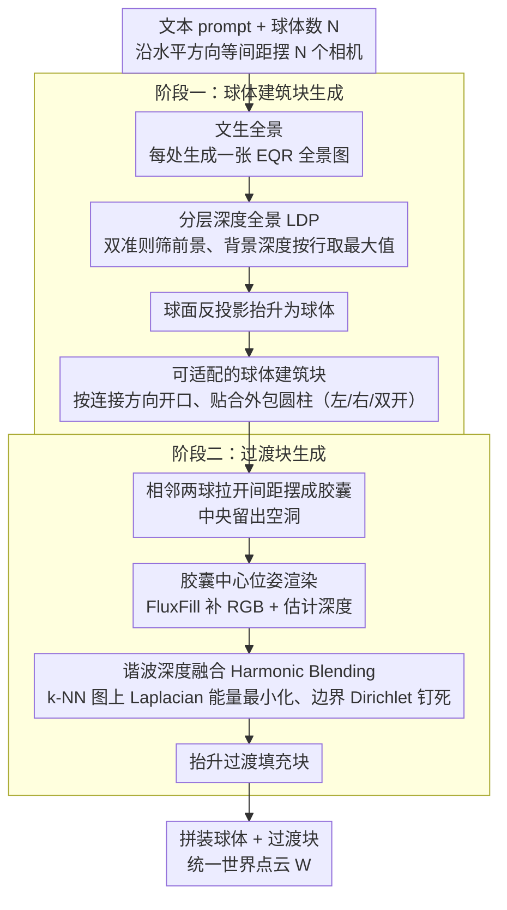

# SphericalDreamer: Generating Navigable Immersive 3D Worlds with Panorama Fusion

**会议**: ICML 2026  
**arXiv**: [2605.19974](https://arxiv.org/abs/2605.19974)  
**代码**: https://sphericaldreamer.github.io/ (有，项目页含开源代码)  
**领域**: 3D视觉 / 3D 世界生成 / 全景图像  
**关键词**: 3D 世界生成、全景图、分层深度全景、谐波融合、可导航沉浸式场景

## 一句话总结
SphericalDreamer 通过把多张文本生成的分层深度全景图各自抬升为 3D"球体"建筑块、再用谐波融合把相邻球体之间缺失的过渡区域生成并拼接起来，得到首个同时具备 360°×180° 全方向沉浸感和长距离可导航能力的户外 3D 世界。

## 研究背景与动机
**领域现状**：文本驱动的 3D 户外世界生成主要有两条路线——全景图路线（先用 diffusion 生成等距矩形 EQR 全景再借助单目深度抬升到 3D 点云/3DGS）和迭代补全路线（不断渲染新视角→用图像 inpaint 补缺→反投影回 3D）。前者代表是 LayerPano3D、HoloDreamer、PanoDreamer，后者代表是 LucidDreamer、SceneScape、WonderJourney。

**现有痛点**：两条路线都只能满足"沉浸"和"可导航"中的一个。全景图方法的相机只能在全景节点附近的小邻域内动一动，平移稍微大一点就会出现明显的视差畸变和几何穿模；迭代补全方法为了避免相机走向"已被观察过的封闭区域"，通常只能沿后退方向扩张场景，因此天然丢失"回头看"等视角，无法做真正的全向沉浸。

**核心矛盾**：两种范式各自的"自洽"假设——单一节点的全方向光场 vs. 单向后退轨迹的连续补全——彼此不兼容。前者把所有视角压在一个点上，后者把全方向覆盖压在一个方向上。任何只在一种表征内打补丁的尝试都难以两者兼得。

**本文目标**：在户外/自然场景设定下，设计一种 3D 表达和生成流程，使得 (i) 每个空间位置都能看到完整的 360°×180° 视场；(ii) 相机可以在远距离尺度上自由平移；(iii) 视觉与几何在拼接处保持连贯。

**切入角度**：作者观察到全景图天然适合做"局部沉浸单元"，那么只要能解决"多个全景单元如何无缝对齐、彼此之间的空隙如何被合理生成"这两件事，就可以用一串全景球串联出一个长走廊式的世界。换句话说，把单个全景的"完整光场"性质局部保留，而长距离扩展交给"球与球之间的过渡块"完成。

**核心 idea**：用分层深度全景（LDP）做可被切开/对接的"球体建筑块"，再借助 inpaint + 谐波深度融合在相邻球体之间合成"过渡块"，最后把球体和过渡块拼成一个统一的彩色点云世界。

## 方法详解

### 整体框架
给定文本 prompt $p$ 和球体数 $N$，SphericalDreamer 沿水平方向 $\mathbf{d}$ 等间距摆 $N$ 个相机位姿，每处用文本到全景模型生成一张 EQR 全景并抬升成一个"球体建筑块"，再为每对相邻球体在中间空隙处生成一个"过渡填充块"，最后把所有块拼成统一的世界点云 $\mathcal{W}=\{(\mathbf{p}_k,\mathbf{c}_k)\}_{k=0}^{K-1}$。球体数 $N$ 同时充当"世界规模"的代理——$N$ 越大、场景越长，整条流水线 $\mathcal{W}=\mathcal{W}^{\text{partial}}\cup\bigcup_{i=0}^{N-2}\mathcal{B}_i^{\text{fill}}$ 把"局部沉浸"压在球体里、把"长距离扩展"压在过渡块里，分工互不打架。

### 关键设计

**1. 分层深度全景 LDP：让球体被切开后内部还有远景壳**

单层全景球有个致命缺陷：相机一旦偏离节点平移，被前景物体挡住的地方就会暴露成黑洞（Figure 3b），因为那里根本没有背景几何。LDP 的做法是把每个全景拆成前景、背景两层分别抬升。先用 SAM 分出候选 mask $\{S_k\}$，再用一个新颖的双准则筛前景——同时看 mask 边界与深度图边缘的对齐度、以及 mask 边界法向上的深度梯度幅值，把高分 mask 合并成前景 mask $M_i^{\text{fg}}$；用它抠掉前景并 inpaint 出干净的背景全景 $I_i^{\text{bg}}$。关键巧思在背景深度 $D_i^{\text{bg}}$ 不再做一次估计，而是直接对原深度图**按行取最大值**，得到"每个仰角下最远场景半径"构成的平滑包络面，这既避免了背景层自己产生新的估计噪声，也保证层间深度一致。最后用球面反投影 $\Pi_\mathbb{S}^{-1}$ 把两层都抬升、合并为 $\mathcal{S}_i=S_i\cup S_i^{\text{bg}}$，这样球体被切开时内部仍有一层可视的"远景壳"兜底。

**2. 可适配的球体建筑块：把闭合球改造成可对接的接口件**

要把一串球串成走廊，闭合球必须能彼此对接，但直接把两个完整球拼在一起会在同一物理位置堆两套不一致的点，几何严重冲突。于是对每个球按目标连接方向去掉一片点云形成"开口"，再把开口后的点云形变贴合到一个外包圆柱面上，得到 $\mathcal{S}_i^{\text{left}}$、$\mathcal{S}_i^{\text{right}}$、$\mathcal{S}_i^{\text{both}}$ 三种状态——首尾两球只开一侧，中间球两侧都开。圆柱面把开口面整形成规则边界，是为了让后续过渡区域的边界条件更光滑、更利于能量最小化对齐。同时相邻相机位姿被刻意拉开间距 $\lambda$（间隔 $\lambda\mathbf{d}$），让两个相对开口之间保留一段中央空洞，整体排成"胶囊"形——这段空洞正是留给过渡块的"创作空间"。

**3. 谐波深度融合 Harmonic Blending：把估计深度无缝缝进已有几何**

过渡块的难点在于：中间空洞处只能靠 inpaint 补 RGB、靠单目深度估计补几何，但单目深度在尺度和局部结构上都不可靠，naive 地直接替换深度会在拼缝处留下肉眼可见的几何断层（Figure 4a）。作者把图形学里的 Laplacian mesh editing / 谐波曲面变形搬了过来：先从胶囊中心位姿 $\mathbf{T}_{i+1/2}=\text{Translate}(\mathbf{T}_i,\tfrac{1}{2}\lambda\mathbf{d})$ 渲染拿到 $(I_i^r,D_i^r,M_i^r)$，用 FluxFill 在掩膜 $1-M_i^r$ 上补全 RGB 得到 $I_i^{\text{ip}}$、再估计出深度 $D_i^{\text{est}}$；然后在新合成点之间建一张 k-NN 图，在图上最小化 Laplacian 平滑能量，并用 Dirichlet 边界条件把已知边界深度严格钉死为参考深度 $D_i^r$，解出位移场得到 $D_i^{\text{blend}}=\text{Harmonic-Blend}(D_i^r,D_i^{\text{est}},M_i^r)$。这相当于把估计深度当"软目标"、把已有几何当"硬约束"，用一次一阶能量的受限平滑插值，既保留估计深度的局部结构、又让边界严丝合缝。最后只在 $1-M_i^r$ 区域抬升出填充块 $\mathcal{B}_i^{\text{fill}}=\Pi_\mathbb{S}^{-1}(I_i^{\text{ip}},D_i^{\text{blend}},\mathbf{T}_{i+1/2},1-M_i^r)$，与两侧球体（$\mathcal{W}^{\text{partial}}=\mathcal{S}_0^{\text{right}}\cup\bigcup_{i=1}^{N-2}\mathcal{S}_i^{\text{both}}\cup\mathcal{S}_{N-1}^{\text{left}}$）拼成完整世界。

### 训练策略
SphericalDreamer 完全免训练，所有组件都是现成模型组装：文本到全景用 Flux + LayerPano3D 训出的 EQR 模型，全景深度估计用 Rey-Area 等的 360° 单目深度，前景分割用 SAM，RGB inpaint 用 FluxFill；谐波融合是闭式能量最小化（稀疏线性系统求解）、无可学参数。整套 pipeline 在单张 A100 上以 $N=3$ 跑约 40 分钟。

## 实验关键数据

### 主实验
评测覆盖三种相机轨迹：纯旋转（评沉浸感）、纯平移（评可导航性）、旋转+平移（评沉浸式导航）。每场景各采 20 个相机位姿，用 BRISQUE 评图像质量，用 Coverage（渲染图中真实场景像素比例，非背景黑色）评覆盖率。

| 方法 | Rot BRISQUE↓ | Rot Cov↑ | Trans BRISQUE↓ | Trans Cov↑ | Rot+Trans BRISQUE↓ | Rot+Trans Cov↑ |
|------|--------------|----------|----------------|------------|--------------------|----------------|
| SceneScape | 52.50 | 0.796 | 44.32 | 0.960 | 55.91 | 0.724 |
| WonderJourney | 57.36 | 0.556 | 41.31 | 0.998 | 61.68 | 0.404 |
| LayerPano3D | 48.40 | **1.000** | 70.08 | 0.476 | 76.74 | 0.594 |
| LucidDreamer | 62.54 | 0.798 | 65.16 | 0.682 | 64.35 | 0.775 |
| **SphericalDreamer** | **44.96** | 0.999 | **36.57** | **0.999** | **41.73** | **0.999** |

只有 SphericalDreamer 在三种轨迹下都接近满分覆盖率，同时 BRISQUE 全线最优。LayerPano3D 在旋转下满覆盖但平移立刻塌到 0.476；WonderJourney 在平移下满覆盖但旋转只有 0.556，正好验证了"沉浸 vs 可导航"无法两全的旧矛盾。

### 消融实验
| 配置 | 关键观察 | 说明 |
|------|----------|------|
| Full | 图像质量与几何最优 | 完整模型（LDP + HB + 多球融合） |
| w/o LDP | 平移时背景出现可见空洞 | 单层球体在前景遮挡处暴露黑色背景（Fig 3b） |
| w/o Harmonic Blending | 过渡处出现明显深度断层 | naive 替换深度导致拼缝可见（Fig 4a） |
| $N=3\to 7$ | 质量指标基本稳定 | 世界规模放大不损失图像质量（Table 7） |

### 关键发现
- LDP 与 HB 是两类质量"不可降级"的组件：去掉任一项都会引入肉眼可见的伪影（背景空洞或几何断层），但消融对纯旋转视角下的指标影响有限——它们的价值主要体现在"可导航"场景，再次说明现有指标体系容易低估沉浸式导航中的几何一致性。
- "行最大值"构造背景深度这种近乎工程化的小技巧，居然在与 LayerPano3D、3D Photography 的背景全景对比中胜出（Appendix C.5），说明面向全景的简单几何先验比再做一次估计更稳。
- 全景单目深度仍是主要瓶颈：附录里作者承认在城市/室内等需要精确平面几何的场景下会出现曲率伪影，本文也据此把适用范围限定在户外/自然场景。

## 亮点与洞察
- "把两条对立范式各取一半"的设计思路非常优雅：用全景图保证局部沉浸，用 inpaint-based 补全保证长距离扩展，过渡块刚好接在两者无法各自解决的接缝处。这种"分块负责 + 拼缝生成"的范式可直接迁移到任何"局部稠密但全局不可扩展"的生成问题。
- Harmonic Blending 把图形学里几十年前的 Laplacian mesh editing 搬到点云深度融合，是个被低估的工具：只要存在"可信参考"和"待融合估计"，并能在它们之间定义图结构和边界条件，就能用一次稀疏线性求解完成无缝拼接，远比对抗式或扩散式后处理便宜。
- 用 SAM mask + 深度边缘双准则筛前景，比单纯阈值化深度梯度稳健得多，可作为任意 LDP / 多层场景表达方法的标准前处理。

## 局限与展望
- 作者承认的局限：依赖全景单目深度，在城市建筑、室内等需要精确平面几何的场景中会因深度估计误差产生曲率畸变，方法主打户外/自然。
- 自己看到的局限：相机轨迹被限定为一条水平直线，世界形态本质上是"长走廊/隧道"；要做分叉、回环或上下楼层需要额外的连通图设计。$N=3$ 一个完整世界要 40 min/A100，规模扩展到上百球时延迟与显存都成问题。当前评测全部是非参考指标（BRISQUE/Coverage），没有人类偏好或下游 VR/SLAM 任务的定量评估。
- 改进方向：把直线轨迹推广到分叉树或图结构，让胶囊融合成为"图边生成"，配合 3D Gaussian Splatting 重表征以加速渲染；针对城市/室内训一个全景平面深度先验，把曲率伪影压下来。

## 相关工作与启发
- **vs LayerPano3D**：同样用 LDP 抬升单全景，但只能在一个全景节点附近；本文借用其前景层思路，新增更稳健的背景层构造（行最大值 + inpaint）并把单球扩展为多球串联，因而获得平移可导航性。
- **vs HoloDreamer / PanoDreamer**：同属全景路线，靠精心设计的相机轨迹做 inpaint，本质仍是单节点；本文用胶囊式中间相机把 inpaint 限定在球与球之间的窄过渡区，避免了"在已观察区域里硬塞新内容"的悖论。
- **vs LucidDreamer / SceneScape / WonderJourney**：迭代补全路线，可走长但因单向后退视角而牺牲沉浸；本文证明只要把"长距离扩展"局部化到过渡块并配合谐波融合，就可以同时保留全方向视角，刷新了该任务的 Pareto 前沿。
- **vs 经典图形学（Laplacian/谐波曲面编辑）**：把 Sorkine 等人的网格编辑能量改成点云深度图上的图能量最小化，是一次成功的跨域复用，提示更多"3D 生成 + 经典几何处理"组合仍有空间。

## 评分
- 新颖性: ⭐⭐⭐⭐ 系统层面把两类范式融合并配上谐波深度融合，整体方案罕见；单个组件多为工程组合而非新模型。
- 实验充分度: ⭐⭐⭐⭐ 主实验三轨迹 + 多项消融 + 组件对比 + 规模扫描齐全，但缺人类偏好和下游任务评测。
- 写作质量: ⭐⭐⭐⭐⭐ 范式对比表（Table 1）一目了然，方法图分阶段递进，符号体系自洽。
- 价值: ⭐⭐⭐⭐⭐ 首个在户外 3D 世界生成上同时做到全向沉浸与长距离可导航的方法，对 VR/数字孪生有直接应用潜力。

<!-- RELATED:START -->

## 相关论文

- [\[ACL 2026\] VOYAGER: A Training Free Approach for Generating Diverse Datasets using LLMs](../../ACL2026/llm_nlp/voyager_a_training_free_approach_for_generating_diverse_datasets_using_llms.md)
- [\[AAAI 2026\] ProFuser: Progressive Fusion of Large Language Models](../../AAAI2026/llm_nlp/profuser_progressive_fusion_of_large_language_models.md)
- [\[CVPR 2025\] Dora: Sampling and Benchmarking for 3D Shape Variational Auto-Encoders](../../CVPR2025/llm_nlp/dora_sampling_and_benchmarking_for_3d_shape_variational_auto-encoders.md)
- [\[ACL 2025\] Combining the Best of Both Worlds: A Method for Hybrid NMT and LLM Translation](../../ACL2025/llm_nlp/combining_the_best_of_both_worlds_a_method_for_hybrid_nmt_and_llm_translation.md)
- [\[ACL 2025\] FoodTaxo: Generating Food Taxonomies with Large Language Models](../../ACL2025/llm_nlp/foodtaxo_generating_food_taxonomies_with_large_language_models.md)

<!-- RELATED:END -->
