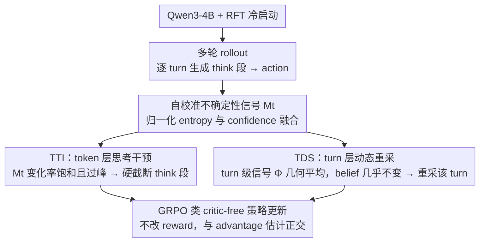

# T$^2$PO: Uncertainty-Guided Exploration Control for Stable Multi-Turn Agentic Reinforcement Learning

**会议**: ICML 2026 Spotlight  
**arXiv**: [2605.02178](https://arxiv.org/abs/2605.02178)  
**代码**: https://github.com/WillDreamer/T2PO (有)  
**领域**: LLM 推理 / Agentic RL / 多轮强化学习  
**关键词**: 多轮 RL、训练崩溃、自校准不确定性、token-level 思考干预、turn-level 动态重采样

## 一句话总结
T$^2$PO 把多轮 agentic RL 的训练崩溃归因为"hesitation（犹豫）"——token 层过思考、turn 层重复无效——并用一个融合 entropy+confidence 的自校准不确定性信号 $M_t$ 同时驱动 token-level Thinking Intervention（动态截断 think 段）和 turn-level Dynamical Sampling（重采样无效 turn），在 WebShop / ALFWorld / Search QA 上稳定超越 PPO/GRPO/GiGPO。

## 研究背景与动机

**领域现状**：多轮 agentic RL（agent 在 WebShop、ALFWorld 这种环境里多次交互 + 自进化）是构建推理型 LLM agent 的核心范式。主流方法包括 PPO、GRPO、GiGPO（group-based critic-free），并配合 rejection-FT 冷启动 + 长度惩罚等技巧。

**现有痛点**：所有 SOTA baseline 都被"训练崩溃"困扰——随机种子换一下，success rate 突然暴跌、KL 散度和 gradient norm 同时爆炸，整个训练失败。已有缓解策略（细粒度 credit assignment、internal reward shaping、轨迹过滤）要么粒度太粗（trajectory-level filter），要么靠 reward shaping 间接控制，结果就是训练动力学对超参极其敏感。

**核心矛盾**：现有工作把"训练效率"和"训练稳定性"当作 trade-off——加速 rollout 会引入 off-policy drift / stale policy；做密集 reward shaping 又破坏 RL 目标。**本文主张这俩根本不矛盾**——只要找到崩溃的真正成因。

**本文目标**：1) 解释为何稳定性差——找到统一的失败机制；2) 设计 token-level + turn-level 双尺度干预；3) 不引入额外 reward shaping，效率与稳定性同步提升。

**切入角度**：分析训练轨迹后发现，崩溃源于**探索效率低**——具体表现为两种 hesitation：(i) token-level over-thinking——思考链很长但信息增益早就饱和；(ii) turn-level 重复无效——agent 在错误动作空间里反复试同样的 turn。这正是探索-利用权衡的系统性违背。

**核心 idea**：用一个能同时捕捉"分布尖锐度"和"top-1 置信度"的自校准信号 $M_t=\alpha\tilde H_t+(1-\alpha)(1-\tilde C_t)$，监控 token 间 $M_t$ 的变化率：变化率太小（信息饱和）就在 token 层强制截断 think；turn 之间 $\Phi^k$ 的变化太小就重采样这个 turn。

## 方法详解

### 整体框架
T$^2$PO 的核心主张是：多轮 agentic RL 的训练崩溃不是 trade-off，而是 hesitation（犹豫）造成的探索效率低下——token 层过思考、turn 层重复无效。于是它在标准多轮 RL pipeline（base LLM + RFT 冷启动 + GRPO 类策略更新）之上，不动 reward、只在 rollout 阶段插两个干预：**TTI（Token-level Thinking Intervention）** 在思考链饱和时硬截断 think 段，**TDS（Turn-level Dynamical Sampling）** 在某个 turn 没带来信息增益时重采它。两个干预共享同一个底层量——自校准不确定性信号 $M_t$，token 层看它的逐步变化、turn 层看它聚合后的逐轮变化。

### 关键设计

**1. 自校准不确定性信号 $M_t$：给 token/turn 干预一个在大词表下也靠谱的标量**

两个干预都要回答"模型此刻到底确不确定"，但单一指标在 Qwen3 这种 152K 大词表下都有盲区。Shannon entropy $H_t=-\sum_i p_t^{(i)}\log p_t^{(i)}$ 在极端分布处几乎分不出层次——分布 $(1,0,0,\dots)$ 与 $(0.5,0.5,0,\dots)$ 的 entropy 差距只有 $\log 2$，相对 152K 项的总量级几乎不可见；而 top-$j$ confidence $C_t=-\frac{1}{j}\sum_{i=1}^j\log p_t^{(i)}$ 又只盯 arg-max、完全忽略尾部概率。T$^2$PO 先对两者做轨迹内归一化 $\tilde H_t=(H_t-H_{\min})/(H_{\max}-H_{\min})$、$\tilde C_t=(C_t-C_{\min})/(C_{\max}-C_{\min})$，再融合成

$$M_t=\alpha\tilde H_t+(1-\alpha)(1-\tilde C_t).$$

论文用 contour 图论证 $M_t$ 在等高线几何上同时继承了 entropy 的尾部敏感性和 confidence 的 top-1 分层，成为"局部分布稳定性"的可靠 scalar——这样同一套阈值规则在不同 token、不同 turn 上才有一致的语义，TTI/TDS 才能共用一个信号。

**2. TTI（Token-level Thinking Intervention）：在 think 段停得恰到好处**

token-level 的过思考表现为思考链拖很长但信息增益早已饱和。TTI 的做法是从最小前缀长度 $L_{\min}$ 之后开始监控 $M_t$ 的相邻变化 $\Delta_t^k=|M_t^k-M_{t-1}^k|$，一旦窗口 $N$ 内的平均变化跌破阈值 $\varepsilon$（即 $\frac{1}{N+1}\sum_{i=0}^N\Delta_{t-i}^k<\varepsilon$，认为"非犹豫"已经收敛），就在 $t^*+1$ 步把终止符 `</think>`（token 151668）的 logit 设为 $+\infty$、其余设为 $-\infty$，强制 $p_\theta(y_{t^*+1}=\texttt{</think>}\mid y_{\le t^*})=1$，随后按固定 queue $\mathcal{Q}=[\texttt{</think>},\backslash n,\texttt{<action>}]$ 注入以保证结构化输出。

这里最反直觉、也最关键的一点是：**不在 $M_t$ 峰值处截断**。$M_t$ 沿响应呈"先升后降"的 hump，峰值附近恰好是 task-specific token（如 WebShop 的商品名），那是高信息密度而非过思考，截了反伤性能；TTI 只在峰值之后的"收敛区"动手。配合 sliding window 平滑掉单点 spike、one-time activation（每条生成最多触发一次）和全局 $L_{\max}$ 兜底，它就成了一个直接、自适应、token 级的硬截断——比"不截 / 固定长度截 / 用 length penalty 间接控制"这几种旧做法都更精准。

**3. TDS（Turn-level Dynamical Sampling）：重采掉没改变 belief 的无效 turn**

崩溃的另一主因是 agent 在错误动作空间里反复试同样的 turn，白白消耗 rollout 预算还污染梯度。TDS 先把一个 turn 内所有 token 的 $M_t$ 做几何平均，得到 turn 级信号 $\Phi^k=(\prod_{t=1}^T M_t)^{1/T}$（用几何平均而非算术平均，是因为内部不确定性常被极少数高 entropy token 拉偏，几何平均更稳地反映整体 belief），再看相邻 turn 的变化 $\Gamma^k=|\Phi^k-\Phi^{k-1}|$。当 $\Gamma^k<\eta$——即这一 turn 几乎没改变 agent 的内部 belief——就丢弃动作 $\mathbf{a}^k$、在同一 state 下重新 rollout，直到 $\Gamma^k\ge\eta$ 或触达重采上限 $B_{\max}$。

它不能照搬单轮 RL 的 DAPO-style filter：单轮可以用 dense per-turn reward 判断 turn 好坏，而多轮 RL 缺这种 reward，所以 TDS 改用 turn-level 的内部不确定性变化当"代理 accuracy"。相比 SimpleTIR 那种事后过滤整条含 void turn 的轨迹，TDS 在 rollout 阶段就只重采单个无效 turn，粒度更细、还不丢有效数据。

### 损失函数 / 训练策略
RFT 冷启动 + memory context window（只看最近 $P$ turn 以省显存）+ turn-level discounted return $R(\tau^k)=\sum_{j=k}^K\beta^{j-k}r^j$ + 严格格式惩罚（强制 think/action 标签）+ GRPO 类 critic-free 策略更新。TTI / TDS 只在 rollout 阶段干预，不改 policy update，因此与各种 advantage 估计方法正交可叠加。

## 实验关键数据

### 主实验
在 WebShop 和 ALFWorld 双 benchmark（5 seed 平均 ± std）上对比，base 模型为 Qwen3-4B + RFT 冷启动：

| 方法 | WebShop Task Score | WebShop Success Rate | ALFWorld Success Rate |
|------|---------------------|----------------------|------------------------|
| GPT-4o (Prompting) | 31.8 | 23.7 | 48.0 |
| Gemini-2.5-Pro (Prompting) | 42.5 | 35.9 | 60.3 |
| Claude Sonnet 4 (Prompting) | 45.6 | 39.8 | 63.7 |
| Qwen3-4B + SFT | 70.91 | 26.56 | 64.06 |
| PPO | 70.34 ± 8.63 | 61.93 ± 5.93 | 75.39 ± 3.81 |
| GRPO | 80.02 ± 7.94 | 68.56 ± 4.11 | 77.35 ± 0.62 |
| GiGPO | 86.03 ± 4.18 | 73.83 ± 3.04 | 80.47 ± 2.43 |
| **T$^2$PO（本文）** | **最高且 std 最小** | **最高** | **最高** |

关键指标：T$^2$PO 在 WebShop / ALFWorld / Search QA 三任务上均最佳，且**跨 seed 方差显著小于 baseline**（直接缓解训练崩溃）。

### 消融实验

| 配置 | 关键现象 | 说明 |
|------|---------|------|
| Full T$^2$PO | 最优且训练稳定 | TTI + TDS 共同生效 |
| 仅 TTI | 单轮 think 段短了，平均稳定性改善 | 控 token-level hesitation |
| 仅 TDS | 无效 turn 减少，rollout 效率高 | 控 turn-level hesitation |
| 用纯 entropy $H_t$ 替 $M_t$ | 阈值规则失效，因为大词表下区分度差 | 验证 $M_t$ 必要 |
| 用纯 confidence $C_t$ 替 $M_t$ | 尾部信息丢失，TTI 容易在错位 | 验证融合必要 |
| 在 $M_t$ 峰值处截断 | 性能反降——截掉了 task-specific 关键 token | 验证 sliding-window 设计 |

### 关键发现
- $M_t$ 沿响应长度的轨迹呈"先升后降"的 hump 形状，峰值附近多是 task-specific token（如 WebShop 里的商品名），过峰后才是真正可以剪掉的冗余思考——这条经验性发现是 TTI 设计的灵魂。
- One-time activation + $L_{\min}$ 前缀保护 + sliding window 这三件套是 TTI 在工程上不会误伤的关键。
- TDS 的 $\Phi^k$ 用几何平均而非算术平均，是因为内部不确定性常常被极少数高 entropy token 拉偏，几何平均更稳定地反映 turn 整体 belief 状态。
- 完全不引入外部 reward shaping，效率和稳定性都提升，验证了"hesitation 才是崩溃根本"的核心论点。

## 亮点与洞察
- 用一个**自校准不确定性**统一两个尺度的干预（TTI / TDS），是个非常优雅的统一视角——以前 token-level 与 turn-level 控制总是各搞各的，本文证明同一个 $M_t$ 就够了。
- "用 stop-gradient 的硬截断 + 注入 token queue"代替"软惩罚"是工程上的 sharp tool——直接在 rollout 阶段把"该停就停"做成确定性操作，比加 length penalty 这种间接信号简洁有效得多。
- "不在 $M_t$ 峰值处截"这一反直觉细节体现了对 reasoning trace 的细致分析：峰值处对应"高信息密度"而非"过思考"，截了就毁了任务相关性——这是教科书级别的 ablation 教训。
- TDS 的"belief shift 不够大就重采"机制可以迁移到任何 multi-turn RL（包括 tool-use、多轮对话、code agent），是个通用的轨迹质量控制器。

## 局限与展望
- TTI / TDS 的阈值 $\varepsilon, \eta, L_{\min}, N, B_{\max}$ 较多，跨任务自适应仍需调参，没给出自动 tuning 方法。
- 自校准信号依赖归一化范围 $H_{\min}, H_{\max}$ 等估计，长 horizon 下统计可能漂移。
- 实验集中在 4B 量级 Qwen + 三个环境，更大模型（70B+）和更复杂工具调用环境（如 SWE-Bench）上的扩展性未测。
- 与 off-policy RL 算法（如 KL-controlled importance sampling）的组合未探索；与 async rollout 加速的兼容性也待验证。

## 相关工作与启发
- **vs SimpleTIR / rStar2-Agent（trajectory-level filter）**：他们事后过滤含 void turn 的整条轨迹；T$^2$PO 在 rollout 阶段就重采单个 turn，粒度更细且不丢有效数据。
- **vs GiGPO / DAPO（group-based critic-free）**：他们改 advantage 估计；T$^2$PO 改 rollout 本身，二者正交可以叠加，本文也直接用 GRPO 类 update 做了组合。
- **vs SEED-GRPO / DeepConf（internal reward 用 entropy/confidence）**：他们把 internal signal 喂回 reward；T$^2$PO 把 internal signal 用于显式截断/重采，避免 reward shaping 引入的训练动力学污染，逻辑上更干净。

## 评分
- 新颖性: ⭐⭐⭐⭐ 双尺度 hesitation 视角 + 自校准信号 + 硬截断/重采机制，组合思路鲜明。
- 实验充分度: ⭐⭐⭐⭐ 覆盖 WebShop / ALFWorld / Search QA + 多 baseline + 多 seed 方差对比，崩溃缓解有数据支撑。
- 写作质量: ⭐⭐⭐⭐ "hesitation is defeat" 的论述链一气呵成，图 1-4 把现象、机制、效果递进呈现。
- 价值: ⭐⭐⭐⭐ 给 agentic RL 提供了一个可即插即用的稳定化工具，开源代码会让社区跟进很快。

<!-- RELATED:START -->

## 相关论文

- [\[ICLR 2026\] Unsupervised Evaluation of Multi-Turn Objective-Driven Interactions](../../ICLR2026/llm_nlp/unsupervised_evaluation_of_multi-turn_objective-driven_interactions.md)
- [\[AAAI 2026\] LILAD: Learning In-context Lyapunov-stable Adaptive Dynamics Models](../../AAAI2026/llm_nlp/lilad_learning_in-context_lyapunov-stable_adaptive_dynamics_models.md)
- [\[ACL 2026\] Generative Floor Plan Design with LLMs via Reinforcement Learning with Verifiable Rewards](../../ACL2026/llm_nlp/generative_floor_plan_design_with_llms_via_reinforcement_learning_with_verifiabl.md)
- [\[AAAI 2026\] Quantifying Conversational Reliability of Large Language Models under Multi-Turn Interaction](../../AAAI2026/llm_nlp/quantifying_conversational_reliability_of_large_language_models_under_multi-turn.md)
- [\[ACL 2025\] SudoLM: Learning Access Control of Parametric Knowledge with Authorization Alignment](../../ACL2025/llm_nlp/sudolm_authorization_alignment.md)

<!-- RELATED:END -->
