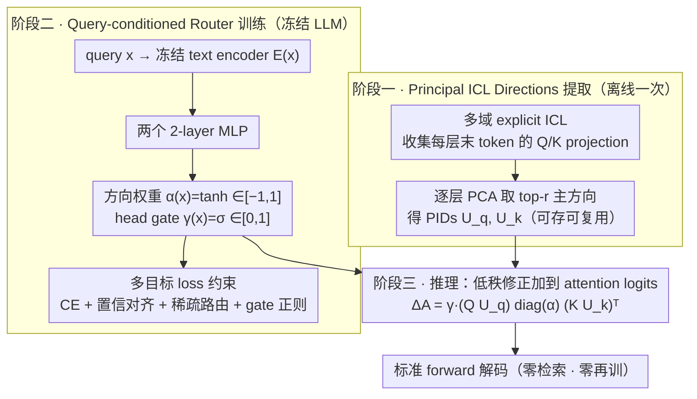

# In-Context Routing (ICR): 一次训练、处处可用的 attention-level 隐式 ICL

**会议**: ICML 2026  
**arXiv**: [2509.22854](https://arxiv.org/abs/2509.22854)  
**代码**: https://github.com/Lijiaqian1/In-Context-Routing.git  
**领域**: LLM 高效推理 / 隐式 ICL / Attention 编辑  
**关键词**: 隐式 ICL, 注意力路由, Principal ICL Directions, 跨域泛化, 零样本推理

## 一句话总结
ICR 不在 residual stream 注入 shift vector，而是从多域 ICL 中用 PCA 抽出 Principal ICL Directions (PIDs) 作为 attention logits 的 low-rank 修正方向，配 query-conditioned router 自适应调制；一次训练后能在 12 个 in/out-of-domain 任务上零样本推理，无任务特定检索/再训练，在 OOD 上不像 vector-based 方法那样退化。

## 研究背景与动机

**领域现状**：In-Context Learning (ICL) 让 LLM 通过 prompt 里加 few-shot 例子学会新任务，但有两个痛点——(1) 加 ICD 让序列变长、推理成本翻倍；(2) 性能脆弱，对 ICD 顺序/格式敏感。隐式 ICL 把 ICD 转成 dense vector 注入到模型隐藏层去模拟 ICL 效果（Hendel et al. 2023, Liu et al. 2023, Li et al. 2024）。

**现有痛点**：vector-based 隐式 ICL 用 shift vector $\mathbf{V}^l_{\mathrm{shift}}$ 加到 residual stream（$\tilde{\mathbf{h}}^l = \mathbf{h}^l + \beta^l \cdot \mathbf{V}^l_{\mathrm{shift}}$）但局限明显——(1) 固定大小 vector 容量有限，加新知识就要新 vector；(2) post-hoc 加在 residual 上不能控制信息流；(3) 训练时跟特定任务绑定，OOD 时退化甚至比 zero-shot 还差（M2IV 在 7 个 OOD 任务有 3 个 collapse）。

**核心矛盾**：要泛化就需要"任务无关的 ICL 模式"，但 vector-based 方法的 shift 是任务特定的；要"task-agnostic"必须把 ICL 机制本身（不是 ICD 内容）提炼出来。

**本文目标**：找一个 task-agnostic 的 ICL pattern + 一次训练后可跨域复用 + 不依赖任务检索或再训练。

**切入角度**：观察发现多任务 ICL prompting 有时能超过 zero-shot 和最强 single-source few-shot，但也可能拖累（Figure 1）——这说明 ICL 的"用处"不在 ICD 内容而在 latent cross-task pattern；显式 prompting 引入噪声反而盖住这个 pattern。所以应该深入 attention space 提炼这个 pattern。

**核心 idea**：跨多个域做 explicit ICL，收集每层每个 prompt 末 token 的 query/key projections，PCA 提取 Principal ICL Directions (PIDs) $U_q^l, U_k^l \in \mathbb{R}^{d \times r}$；用 query-conditioned router 算 routing vector $\alpha^l(x)$ 和 head gate $\gamma^l(x)$，把 low-rank 修正 $\Delta \mathbf{A}^l = (Q_{\mathrm{zs}} U_q^l) \mathrm{diag}(\alpha^l) (K_{\mathrm{zs}} U_k^l)^\top$ 加到 attention logits。

## 方法详解

### 整体框架

ICR 把"隐式 ICL"从 residual stream 的加性偏移搬到 attention logits 的低秩调制：先离线跨多个域跑显式 ICL、用 PCA 从每层 query/key projection 里提炼一组任务无关的 Principal ICL Directions (PIDs)，再训一个 query-conditioned router 学会"对当前 query 该怎么沿这些方向调制注意力"。三阶段串起来——(1) 跨 $\mathbb{D}$ 个域提 PIDs $U_q^l, U_k^l \in \mathbb{R}^{d\times r}$；(2) 冻结 LLM、只训 router 输出每层方向权重 $\alpha(x)$ 和每 head gate $\gamma(x)$；(3) 推理时对任意新 query 算出 $\alpha,\gamma$，把低秩修正加到 attention logits，全程零检索零再训。下图把这条 pipeline 的两个核心设计（PIDs 提取、router）与推理调制串起来：

### 关键设计

**1. Principal ICL Directions：用 PCA 把"如何做 ICL"提成跨域稳定的注意力方向**

vector-based 隐式 ICL 把整段 ICD 压进一个固定大小的 shift vector，容量有限、还跟具体任务绑死，所以一换域就 collapse。ICR 的做法是不去存"ICD 内容"，而是抓"让 ICL 生效的 query-key 匹配几何"这个结构性模式。每个 prompt 末 token 是上下文信息的整合点，它的 $Q^l, K^l$ projection 携带"该按 ICL 方式作答"的信号；跨 $\mathbb{D}$ 个域把这些末 token projection 堆成 ICL bases $\tilde{Q}^l, \tilde{K}^l \in \mathbb{R}^{N\times d}$（每行一个 prompt），对其做 PCA 取 top-$r$ 主方向就得到 PIDs $U_q^l, U_k^l$。

为什么 PCA 能恰好捞出跨域共享的那部分？论文用 Spiked Covariance Model 给出依据：每个域的协方差 $\Sigma_Q^{(\mathbb{d})} = S_q \Lambda_q S_q^\top + B_{q,\mathbb{d}} \Gamma_{q,\mathbb{d}} B_{q,\mathbb{d}}^\top + \sigma^2 I$，其中 $S_q$ 是跨域共享的 ICL 结构、$B_{q,\mathbb{d}}$ 是域特定变化。当各域的 $\{B_{q,\mathbb{d}}\}$ 足够多样且方向不一致时，pooled covariance $\mathbb{E}[\hat{\Sigma}_Q] = S_q \Lambda_q S_q^\top + \sigma^2 I + \frac{1}{N}\sum |\mathcal{D}_\mathbb{d}| B_{q,\mathbb{d}} \Gamma_{q,\mathbb{d}} B_{q,\mathbb{d}}^\top$ 里第三项被平均成接近各向同性的噪声，PCA 的 top eigenvectors 就自然落在 $S_q$ 上——即 PIDs 恢复出的正是跨域稳定的 ICL pattern，而非某个域的特例。几何上这比 additive shift 更贴近 ICL 的真实机制（Olsson et al. 2022 已论证 attention heads 是 ICL 的核心载体）。注意 PIDs 是逐层独立提取的，给不同层的不同 ICL 角色（早层 retrieval、后层 reasoning）各留一组方向。

**2. Query-conditioned router：低秩方向权重 × head gate 的自适应调制**

有了 PIDs 这套"原料",还需要决定对每个具体 query 沿哪些方向、调多强、哪些 head 参与——固定 routing 会过拟合训练任务，所以 ICR 让调制随 query 变。用一个冻结的 text encoder 算 query embedding $E(x)$,两个 2-layer MLP 并行输出：方向权重 $\alpha(x) = \tanh(g_{\theta_\alpha}(E(x))) \in \mathbb{R}^{L\times r}$,用 $\tanh$ 把每层每个 PID 方向的强度压到 $[-1,1]$，从而既能增强也能抑制某方向；head gate $\gamma(x) = \sigma(g_{\theta_\gamma}(E(x))) \in \mathbb{R}^{L\times H}$,用 sigmoid 给每层每个 head 一个 $[0,1]$ 的开关，让 head 可选择性激活。

最终注意力 logits 被修正为 $\tilde{\mathbf{A}}^{l,h}(x) = \mathbf{A}^{l,h}(x) + \gamma^{l,h}(x)\,(Q_{\mathrm{zs}}^l U_q^l)\,\mathrm{diag}(\alpha^l(x))\,(K_{\mathrm{zs}}^l U_k^l)^\top$。这里的修正项是 layer-shared 的低秩 bias（同一层所有 head 共用 $U_q^l, U_k^l$ 与 $\alpha^l$）再乘上 per-head 的 $\gamma^{l,h}$ gate——不是每个 head 各算一套独立调制，既保留了 head 间的差异化能力，又把参数量压到极小（router 两个 MLP 合计 $\le 10M$，相对 7B LLM 可忽略），推理时延几乎和 zero-shot 持平。整个推理只需：算 $E(x)$ → router 出 $\alpha,\gamma$ → 按上式改 attention logits → 标准 forward，无检索、无再训。

### 损失函数 / 训练策略

冻结 LLM、只训 router，用四项目标的加权和约束它学到"有用且克制"的调制 $\mathcal{L} = \mathcal{L}_{\mathrm{CE}} + \lambda_{\mathrm{conf}}\mathcal{L}_{\mathrm{conf}} + \lambda_{\mathrm{spar}}\mathcal{L}_{\mathrm{spar}} + \lambda_{\mathrm{gate}}\mathcal{L}_{\mathrm{gate}}$：

- **监督 CE** $\mathcal{L}_{\mathrm{CE}} = -\frac{1}{B}\sum_i \log P^{\mathrm{ICR}}(y_i | x_i)$ 让 router 学到正确答案；但只用 CE 时 router 容易退化成"绕过 ICL 机制"的捷径，所以需要后面三项约束。
- **置信对齐** $\mathcal{L}_{\mathrm{conf}} = \frac{1}{B}\sum \mathrm{ReLU}\big(H(\mathrm{softmax}(p_i^{\mathrm{ICR}})) - H(\mathrm{softmax}(p_i^{\mathrm{zs}}))\big)$ 惩罚"ICR 比 zero-shot 更不自信"的情况（$H$ 为熵，熵更高=更不确定）——强制调制后至少不比 zero-shot 差，防止 router 靠 underconfidence 取巧、也是 OOD 不 collapse 的关键保险。
- **稀疏路由** $\mathcal{L}_{\mathrm{spar}} = \mathbb{E}_x\big[\frac{1}{L}\sum_l w^l \|\alpha^l(x)\|_1 / r\big]$ 把方向权重往 0 拉、让最终调制接近 identity（最小化对原 attention 的干预、提升可解释性）；权重 $w^l$ 随层线性增大，反映"早层做 broad 处理、后层做 specific 决策"的语言模型逐层结构，后层更该克制。
- **Gate 正则** $\mathcal{L}_{\mathrm{gate}} = \mathbb{E}_x\big[\frac{1}{L}\sum_l \|\gamma^l(x)\|_1 / H\big]$ 同理约束 head gate 稀疏，只让真正需要的 head 被激活。

## 实验关键数据

### 主实验：12 个 benchmark（5 ID + 4 Near OOD + 3 Far OOD）

| 模型/方法 | AG | SST-2 | TREC | CSQA | PIQA | SST-5 | MR | MRPC | CB | COPA | CREAK | AI2SciE | 平均 | Collapse |
|---|---|---|---|---|---|---|---|---|---|---|---|---|---|---|
| **Llama2-7B** | | | | | | | | | | | | | | |
| Zero-shot | 67.0 | 78.6 | 56.6 | 22.4 | 52.2 | 25.8 | 72.2 | 44.4 | 37.5 | 63.0 | 51.8 | 34.8 | 50.5 | – |
| Few-shot* | 81.0 | 95.2 | 84.6 | 58.0 | 59.8 | 37.4 | 98.6 | 68.2 | 41.1 | 82.0 | 50.8 | 45.4 | 66.8 | 1 |
| I2CL | 85.5 | 86.0 | 78.6 | 23.8 | 55.6 | 27.6 | 71.6 | 42.4 | 38.2 | 63.6 | 52.6 | 35.0 | 55.0 | **2** |
| LIVE | 86.0 | 86.2 | 81.0 | 24.2 | 56.4 | 32.8 | 73.8 | 47.6 | 40.8 | 64.8 | 51.0 | 34.6 | 56.6 | **2** |
| M2IV | 86.4 | 86.4 | 81.5 | 24.8 | 56.8 | 30.8 | 74.0 | 46.0 | 42.6 | 64.8 | 54.0 | 35.2 | 56.9 | 0 |
| **ICR** | 86.6 | 86.4 | 83.8 | 24.8 | 57.0 | **38.6** | **79.8** | **53.4** | **46.4** | **68.0** | **56.4** | **37.2** | **59.9** | **0** |
| **Qwen2.5-7B** | | | | | | | | | | | | | | |
| Zero-shot | 66.8 | 54.0 | 65.8 | 80.4 | 76.2 | 31.4 | 64.4 | 72.4 | 83.9 | 92.0 | 77.8 | 90.4 | 71.3 | – |
| Few-shot* | 80.2 | 95.6 | 67.6 | 82.2 | 86.0 | 37.2 | 70.2 | 76.2 | 83.9 | 95.0 | 59.7 | 95.8 | 77.5 | 1 |
| I2CL | 77.0 | 86.4 | 68.6 | 81.6 | 81.2 | 34.6 | 69.0 | 70.8 | 80.6 | 92.6 | 74.8 | 91.8 | 75.6 | **3** |
| LIVE | 79.0 | 87.8 | 70.4 | 81.6 | 82.0 | 30.8 | 68.6 | 69.4 | 81.0 | 93.2 | 72.8 | 91.8 | 75.7 | **4** |
| M2IV | 79.6 | 89.0 | 70.8 | 81.8 | 82.5 | 31.6 | 71.2 | 71.0 | 76.0 | 93.5 | 74.6 | 92.4 | 76.2 | **3** |
| **ICR** | 80.4 | 91.0 | 70.6 | 82.0 | 82.6 | **41.4** | **89.4** | 73.2 | **84.6** | 95.0 | **79.2** | **93.2** | **80.2** | **0** |

ICR 在两个 LLM 上都是 SOTA：Llama2-7B 平均 59.9 vs M2IV 56.9（+3.0），Qwen2.5-7B 平均 80.2 vs M2IV 76.2（+4.0）。最重要的是 **Collapse=0**——其他 baseline 在 4 个 OOD 任务上经常比 zero-shot 还差（如 LIVE 在 Qwen 上 4 个任务 collapse），ICR 一个都没退化。

### In-domain 子集（Qwen2.5-7B）

| 方法 | AG | SST-2 | TREC | CSQA | PIQA | 平均 |
|------|----|-------|------|------|------|------|
| TV | 70.4 | 78.2 | 64.6 | 80.6 | 74.6 | 73.7 |
| FV | 68.4 | 76.8 | 66.2 | 78.8 | 80.0 | 74.0 |
| ICV | 74.6 | 83.0 | 67.2 | 81.3 | 77.2 | 76.7 |
| ELICIT | 70.4 | 78.5 | 65.0 | 79.2 | 76.4 | 74.3 |

跟其他 attention/vector 操控方法比 ICR 也明显胜出。

### 关键发现

- **ICR 是唯一 OOD 不 collapse 的方法**：在 Qwen 上其他 baseline 4 个 OOD 任务里有 3-4 个比 zero-shot 还差，ICR 全部不退化甚至涨——证明 attention-level pattern 比 residual-level vector 更 generalizable。
- **跨 LLM 都有效**：Llama2-7B 和 Qwen2.5-7B 架构差异不小，ICR 都是 SOTA，说明 PIDs + router 的设计是 model-agnostic 的。
- **MR (Near OOD) 上 ICR vs 其他差距最大**：Qwen 上 ICR 89.4 vs 其他 ~70（+19），说明 attention-level routing 在与训练域接近但不同的任务上特别强。
- **CREAK (Far OOD) ICR 反超 few-shot**：Llama 上 ICR 56.4 vs few-shot 50.8，证明 attention pattern 抓的是任务无关的"how to do ICL"机制，反而比直接展示 example 更稳定（few-shot 在 CREAK 上低于 zero-shot）。
- **ICR 不需要任务检索**：M2IV/LIVE 需要在推理时根据任务找对应 vector，ICR 一次训练后所有任务用同一组 PIDs + 同一个 router，部署极简。

## 亮点与洞察

- **attention-level pattern vs residual-level vector 的范式转移**：把"ICL 是 hidden state 的偏移"改成"ICL 是 attention 几何的调制"，更接近 ICL 的机制本质（Olsson et al. 2022 已论证 induction heads 是 ICL 关键）。
- **Spiked Covariance + PCA 给 PIDs 理论基础**：用 covariance 分解证明 PCA 在多域 ICL bases 上自然恢复跨域共享方向 $S_q$，让"PIDs 提炼出真正的 ICL pattern"不是 empirical claim 而是有数学支撑。
- **Train once, reuse everywhere**：12 个任务用同一组 PIDs + 同一个 router 零样本推理，是 implicit ICL 第一个真正实现 task-agnostic generalization 的方法。
- **多目标 loss 的结构性收益**：confidence align 防退化、sparse routing 防过修改 attention、layer-wise weighted sparsity 反映模型结构——每个 loss 项都有明确动机和 ablation 验证。
- **Router 参数量极小**：两个 2-layer MLP + 几个 PID 矩阵，相比 LLM 7B 可忽略，部署时跟 zero-shot 同 latency。
- **Layer-wise PIDs**：每层独立提 PIDs 而非全局一套，给不同 layer 的不同 ICL 角色（早层 retrieval、后层 reasoning）留出空间。

## 局限与展望

- **PIDs 提取需要原始 ICL 数据**：虽然一次性，但仍需多个域的 labeled examples 跑 explicit ICL，对没有标注数据的领域适用性受限。
- **Router 训练数据是 mixed-domain**：训练数据组成可能影响 OOD 泛化，最优 domain mix 没系统消融。
- **rank $r$ 选择**：PIDs 的 rank $r$ 是超参，太低损失信息太高过拟合，论文给定值但没扫描分析。
- **没在 reasoning-heavy 任务上验证**：12 任务以 classification/QA 为主，对 math reasoning、code generation 等长 CoT 任务 ICR 是否有效未知。
- **跨 model size 的扩展性**：所有实验在 7B 模型上，70B+ 模型上 PIDs 数量、router 容量、训练成本如何变化没讨论。
- **跟 LoRA / Prompt Tuning 没正面比**：作为 parameter-efficient 方法 ICR 跟 LoRA、Prefix Tuning 的 ID-OOD 综合对比缺失。
- **Confidence align loss 的 underconfidence shortcut**：理论上仍可能学到"伪装 confidence"的捷径，没分析 router 学到的 routing 是否真有 semantic meaning。

## 相关工作与启发

- **vs I2CL / LIVE / M2IV**：这些是 vector-based 隐式 ICL 的前作，本文证明它们 OOD collapse 是 paradigm 问题（residual-level shift），不是工程问题；ICR 切到 attention-level 一招破解。
- **vs ICV / FV / TV / ELICIT**：这些是 attention-space 工作但 task-specific，ICR 是首个 task-agnostic + train-once 的 attention routing 方法。
- **vs LoRA / Prefix Tuning**：那些是 PEFT，需要每个任务一组 adapter；ICR 一组 PIDs + 一个 router 跨任务，部署更简单。
- **vs Mixture of Experts**：router 思路相似（query-conditioned 选 expert），但 ICR 在 attention space 而非 FFN，且 expert 是 PID 方向而非完整 MLP，参数量小三个数量级。
- **vs FlashAttention**：他们优化 attention 计算 kernel，ICR 修改 attention logits 内容，正交可叠加。
- **启发**：(1) 任何"原本是 prompt 行为"都可以试着提炼成 attention 几何 → 内化进模型；(2) PCA on attention activations 是 universally useful 的提取工具；(3) low-rank attention modulation + query-conditioned routing 是高效注入"任务模式"的 pattern。

## 评分

- 新颖性: ⭐⭐⭐⭐⭐ "attention routing" 范式转移 + PIDs 数学基础 + query-conditioned router 整套设计是 ICL 工程的方法学创新。
- 实验充分度: ⭐⭐⭐⭐⭐ 2 LLM × 12 任务（覆盖 ID/Near OOD/Far OOD）+ collapse 量化 + 多种 baseline + 多消融，证据链完整。
- 写作质量: ⭐⭐⭐⭐ Section 2 形式化清晰，Section 3 method 复现简洁；Spiked Covariance 分析放在 appendix 削弱主文论证完整性。
- 价值: ⭐⭐⭐⭐⭐ 直接解决隐式 ICL 跨域泛化痛点，部署友好（零检索、零再训），对 LLM 推理优化社区是 plug-and-play 升级。

<!-- RELATED:START -->

## 相关论文

- [\[AAAI 2026\] ICL-Router: In-Context Learned Model Representations for LLM Routing](../../AAAI2026/llm_nlp/icl-router_in-context_learned_model_representations_for_llm_routing.md)
- [\[ICML 2026\] SLAY: Geometry-Aware Spherical Linearized Attention with Yat-Kernel](slay_geometry-aware_spherical_linearized_attention_with_yat-kernel.md)
- [\[ICML 2026\] Deep Networks Learn to Parse Uniform-Depth Context-Free Languages from Local Statistics](deep_networks_learn_to_parse_uniform-depth_context-free_languages_from_local_sta.md)
- [\[ICLR 2026\] Near-Optimal Online Deployment and Routing for Streaming LLMs](../../ICLR2026/llm_nlp/near-optimal_online_deployment_and_routing_for_streaming_llms.md)
- [\[ICML 2026\] Position: The Turing-Completeness of Autoregressive Transformers Relies Heavily on Context Management](position_the_turing-completeness_of_autoregressive_transformers_relies_heavily_o.md)

<!-- RELATED:END -->
