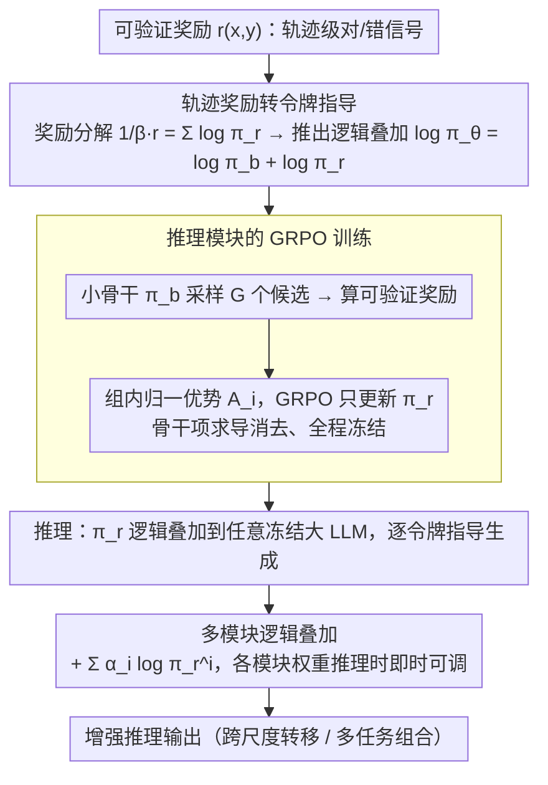

# Universal Reasoner: 冻结 LLM 的可组合即插即用推理器

**会议**: ICML 2026  
**arXiv**: [2505.19075](https://arxiv.org/abs/2505.19075)  
**代码**: https://github.com/hangeol/UniR  
**领域**: LLM 推理  
**关键词**: 推理增强, 模块化推理, 可组合推理, 冻结 LLM, 可验证奖励

## 一句话总结
提出通用推理器（UniR）——通过训练独立的轻量推理模块来捕获奖励导向的推理行为，在推理时通过逻辑叠加与冻结 LLM 组合，实现无需微调冻结模型、跨模型大小转移和多任务可组合的推理增强。

## 研究背景与动机

**领域现状**：当前通过 RL 微调（RFT）增强 LLM 推理能力，但需大量计算和内存资源。PEFT 如 LoRA 试图降低成本，但仍有两大缺陷——（1）强烈依赖模型架构，跨不同尺度模型（3B→14B）转移性差；（2）多个 LoRA 适配器线性组合缺乏理论支撑。

**现有痛点**：无法在不访问 LLM 内部参数前提下灵活高效地增强推理能力；无法跨模型尺度复用训练好的推理能力；无法组合多个不同任务的推理模块。

**核心矛盾**：推理增强需要参数更新（传统微调）但模型通常冻结；多任务学习需要端到端重训（多目标冲突）。

**本文目标**：设计模块化、可转移、可组合的推理增强方法。

**切入角度**：观察到可验证奖励（如数学问题正确性）可通过轨迹级信号转换为令牌级指导。将轨迹级奖励建模为推理模块的对数概率之和，使得逻辑叠加成为自然的组合机制。

**核心 idea**：分离奖励模型训练与策略更新，训练专用推理模块 $\pi_r$ 以最大化可验证奖励，推理时通过添加其逻辑 $\log\pi_r$ 到冻结骨干 $\pi_b$ 的逻辑来指导令牌生成。

## 方法详解

### 整体框架
UniR 把"增强推理"这件事从冻结的大模型里彻底剥离出来，做成一个可拆装的小部件。训练时只在一个较小的骨干上训练独立的推理模块 $\pi_r$，用可验证奖励配 GRPO 把"奖励导向的推理行为"学进去；推理时把 $\pi_r$ 的逻辑直接叠加到任意冻结 LLM 的逻辑上，做令牌级指导。骨干一根手指都不用动，模块却能换大模型、能多个并联。

### 关键设计

**1. 轨迹奖励转令牌指导：把全局对错拆成每一步的方向盘**

可验证奖励（比如数学题最后答对没有）天然是轨迹级的——整条回答生成完才知道 $r(x,y)$ 是 0 还是 1，可生成过程却是一步一个令牌，这个全局信号没法直接告诉第 $t$ 步该选哪个词。UniR 的破局点是给奖励硬塞一个结构化假设：把轨迹奖励写成推理模块对数概率之和 $\frac{1}{\beta}r(x,y)=\sum_{t=1}^{|y|}\log\pi_r(y_t|x,y_{<t};\phi)$。把这个代入 KL 正则化的策略优化目标后，最优策略就自然解出成"骨干逻辑 + 模块逻辑"的叠加形式 $\log\pi_\theta(y_t|x,y_{<t})=\log\pi_b(y_t|x,y_{<t})+\log\pi_r(y_t|x,y_{<t})-\log Z'(x,y_{<t})$。定理 4.1 进一步证明收敛时 $\log\pi_r(y_t|x,y_{<t})=\frac{1}{\beta}Q^*(y_t|x,y_{<t})$，也就是说推理模块学到的逻辑恰好正比于令牌级的最优动作价值 $Q^*$——一个轨迹级的"对/错"被翻译成了每一步实打实的最优决策信号，逻辑叠加由此从一个工程 trick 变成有理论根基的必然解。

**2. 推理模块的 GRPO 训练：只动小模块，骨干全程冻结**

要在不碰骨干参数的前提下把奖励学进 $\pi_r$，UniR 用 GRPO 来更新。对每个问题从骨干 $\pi_b$ 采样 $G$ 个候选回答，算出各自的外部可验证奖励 $r_i$，再组内归一化成优势 $A_i=\frac{r_i-\text{mean}(\{r_1,...,r_G\})}{\text{std}(\{r_1,...,r_G\})}$，然后在 GRPO 目标上只优化推理模块的参数 $\phi$。妙处在梯度里——优化目标里的策略是 $\pi_b$ 与 $\pi_r$ 的叠加，但对 $\phi$ 求导时冻结骨干那一项是常数被自动消掉，梯度只流向 $\pi_r$，于是骨干天然不动。选 GRPO 而非 PPO 是因为它不需要单独训一个价值网络，且组内相对优势对"答对得 1、答错得 0"这种稀疏可验证奖励特别友好，正好贴合这个场景。

**3. 多模块逻辑叠加：不同任务的推理器零代价并联**

既然单个奖励能解出一个加性模块，那多个约束就能各训各的再叠起来。对 $N$ 个不同奖励 $\{r_1,...,r_N\}$ 分别训出 $N$ 个推理模块 $\{\pi_r^1,...,\pi_r^N\}$，推理时直接线性叠加 $\log\pi_\theta(y_t|x,y_{<t})\propto\log\pi_b(y_t|x,y_{<t})+\sum_{i=1}^{N}\alpha_i\log\pi_r^i(y_t|x,y_{<t})$，每个模块的权重 $\alpha_i$ 还能在推理时即时调。真实推理往往同时受多个约束（既要算对又要表达清楚），传统多任务得端到端重训且目标互相打架，而逻辑叠加既是上面那套 KL 推导的原则性产物，又允许把已训好的模块当积木零代价拼装，不必重训任何东西。

## 实验关键数据

### 主实验

| 模型配置 | GSM8K | MATH-500 | AIME24 | 平均提升 |
|---------|-------|----------|--------|---------|
| Llama3.2-3B 骨干 | 65.6 | 33.0 | 3.7 | 基线 |
| + GRPO LoRA (3B) | 65.8 | 32.1 | 6.0 | -0.3% |
| UniR (1B + 3B) | 77.5 | 48.8 | 7.3 | +35.2% |
| Qwen2.5-3B 骨干 | 74.4 | 44.2 | 6.3 | 基线 |
| UniR (1.5B + 3B) | 75.6 | 48.3 | 8.1 | +6.8% |

### 消融实验

| 实验项 | 描述 | 性能 |
|--------|------|------|
| 推理模块单独 | 1B $\pi_r$ 独立生成 | 远低于组合 |
| 无推理模块 | 仅冻结 3B 骨干 | 65.6 (GSM8K) |
| +推理模块（有调优） | 结合后 | 77.5 |
| 多模块（α₁=1, α₂=0.5） | 数学+翻译加权 | 72.3 |

### 关键发现
- 弱强转移——1B 推理模块能有效指导更大模型（14B），无需重训。
- 可组合性验证——多模块加权组合在不同权重下表现稳健。
- 奖励内化——训练后推理模块对正确响应（r=1）的对数概率显著高于错误响应（r=0）。

## 亮点与洞察
- **优雅的理论基础**：从 KL 正则多目标优化出发严格推导逻辑叠加。
- **零重训转移**：推理模块跨模型尺度转移无需微调。
- **推理时组合灵活性**：多模块加权融合在推理阶段即时可调。
- **实证 Q 函数学习**：通过对数概率分离验证了推理模块确实在学习令牌级最优决策信号。

## 局限与展望
- 假设局限——方法假设轨迹奖励可分解为令牌对数概率之和。
- 推理模块能力瓶颈——受其初始大小和训练数据限制。
- 权重选择问题——多模块组合时权重 $\alpha_i$ 需手调。
- 改进：探索非分离式奖励的令牌级分解；设计自适应权重学习。

## 相关工作与启发
- **vs PEFT (LoRA)**：LoRA 依赖模型内部维度，跨尺度转移困难；UniR 通过逻辑层指导解耦架构依赖。
- **vs Reasoning Vectors**：后者用 RL 与 SFT 差分修改模型参数；UniR 用独立推理模块更轻便。
- **vs RAST/GenARM**：UniR 直接用可验证奖励训练推理模块更原则性。

## 评分
- 新颖性: ⭐⭐⭐⭐⭐  将轨迹级奖励系统地映射到推理模块的令牌级对数概率。
- 实验充分度: ⭐⭐⭐⭐⭐  多个数学基准对比 + 消融验证弱强转移和多模块组合。
- 写作质量: ⭐⭐⭐⭐⭐  动机清晰、推导严格、实验有据。
- 价值: ⭐⭐⭐⭐⭐  解决冻结 LLM 推理增强的关键问题，通用、低成本、易部署。

<!-- RELATED:START -->

## 相关论文

- [\[ACL 2025\] Efficient Universal Goal Hijacking with Semantics-guided Prompt Organization](../../ACL2025/llm_nlp/goal_hijacking_attack.md)
- [\[ICML 2025\] Towards Universal Offline Black-Box Optimization via Learning Language Model Embeddings](../../ICML2025/llm_nlp/towards_universal_offline_black-box_optimization_via_learning_language_model_emb.md)
- [\[ICML 2026\] YAQA: 端到端 KL 最小化的 LLM 自适应权重量化](model-preserving_adaptive_rounding.md)
- [\[ICML 2026\] "I've Seen How This Goes"：用渐进条件惊奇度刻画 LLM 与人类写作的多样性](ive_seen_how_this_goes_characterizing_diversity_via_progressive_conditional_surp.md)
- [\[ICML 2026\] Token-Efficient Change Detection in LLM APIs](token-efficient_change_detection_in_llm_apis.md)

<!-- RELATED:END -->
