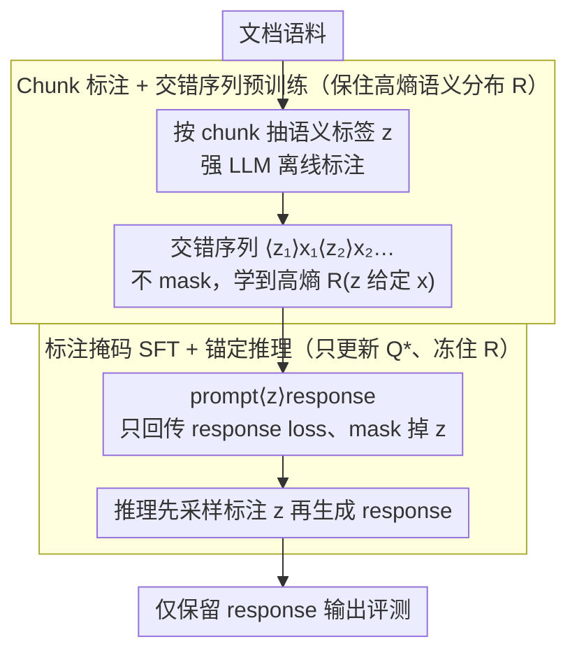

# Annotations Mitigate Post-Training Mode Collapse

**会议**: ICML 2026  
**arXiv**: [2605.09995](https://arxiv.org/abs/2605.09995)  
**代码**: 论文未明确公开  
**领域**: LLM 预训练 / 后训练对齐 / 生成多样性  
**关键词**: 模式坍塌, SFT, 语义熵, 标注锚定, 多样性-质量权衡

## 一句话总结
作者发现 SFT 把模型对齐到一个低熵语义先验上、导致"指令模型越大越无聊"的反向 scaling，于是提出"标注锚定训练"——预训练阶段给文档配语义 tag、SFT 阶段对 tag 部分 mask loss，让推理时先采样语义再生成响应，从而在保持指令跟随能力的同时把语义多样性差距缩小 85%。

## 研究背景与动机
**领域现状**：当前主流的对齐 pipeline 是先在海量网页上做无监督预训练，再用一个相对窄的指令数据集做 SFT（外加 RLHF），把基础模型雕琢成"听话又格式齐整"的助手。

**现有痛点**：基础模型本身的输出虽然质量参差，但语义覆盖很广；而经过 SFT 之后，模型在同一 prompt 下生成的几条回复在主题、人名、地点、风格上高度雷同——这就是"语义模式坍塌"。更糟的是，作者复现并扩展了 NoveltyBench 的发现：基础模型随规模变大语义越多样，但 SFT 之后的模型随规模变大反而越坍塌，且这种坍塌在 brainstorm、multiple sampling 等多样性 prompting 策略下都消不掉。

**核心矛盾**：SFT 的优化目标是"让模型分布匹配后训练数据分布"，但后训练数据本身就是一个低熵语义集合（标注者偏好的少数模式），最大似然训练会无差别地把这个低熵语义先验灌进模型。也就是说，SFT 同时改了两件事——"在给定语义下怎么写回复"（想要的）和"哪些语义会被表达"（不想要的），二者纠缠在一起。

**本文目标**：把这两个分布解耦，使后训练只更新条件响应行为 $Q^\star(y\mid x,z)$，而把语义分布 $R(z\mid x)$ 锚定在预训练的高熵状态上。

**切入角度**：作者引入一个显式的语义变量 $z$（一组 key-value 风格的标签，如 topic / location / entities / genre），把响应生成因式分解为 $P^\star_R(y\mid x)=\int R(z\mid x)\,Q^\star(y\mid x,z)\,dz$。只要训练过程能保住 $R$ 的高熵性质，多样性就不会塌。

**核心 idea**：在预训练时给每个 chunk 配标注、把 `<z>x` 交错拼成训练序列；在 SFT 时对 z 部分的 token 做 loss mask；推理时让模型自己先吐 annotation 再吐 response，annotation 的采样多样性自然继承自预训练分布。

## 方法详解

### 整体框架
方法叫 annotation-anchored training，想干的事只有一件：让 SFT 只更新"给定语义怎么写回复"、不去碰"哪些语义会被表达"。做法是离线用一个强 LLM 给文本配上 `<key>:<value>` 形式的语义标签 $z$，预训练时把标签和文本交错拼起来照常训，SFT 时只对标签部分 mask 掉 loss——于是响应能力被指令数据塑造，而语义分布被冻在预训练的高熵状态。推理时模型先自己吐一个 annotation 再 condition 在它上面生成 response，annotation 的采样随机性就把多样性自然带进最终输出。整套 trick 极简：数据格式变一点、loss mask 变一点，剩下完全是标准自回归 LM，不引入任何新模块或新损失。

### 关键设计

**1. 显式语义变量 z：把"写什么"和"怎么写"拆成两个可独立调控的分布**

坍塌的根源在于 SFT 的最大似然目标会无差别地把后训练数据的低熵语义先验灌进模型，分不清"哪部分该改、哪部分该留"——传统熵正则、KL 约束也只对响应整体分布下手，同样分不清。作者的破局点是引入一个显式语义变量 $z$（一组可变长的 `<key>:<value>` tag，如 topic / domain / entities / location），把生成因式分解开：预训练分布写成 $P(y)=\int R(z)Q(y\mid z)\,dz$、后训练分布写成 $P^\star(y\mid x)=\int R^\star(z\mid x)Q^\star(y\mid x,z)\,dz$。一旦看清坍塌就是 $R^\star$ 的熵比 $R$ 小太多造成的，治疗方案立刻浮现——把目标改成 $P^\star_R(y\mid x)=\int R(z\mid x)\,Q^\star(y\mid x,z)\,dz$，即保留预训练的语义先验 $R$、只吸收后训练的条件响应能力 $Q^\star$。因为 $z$ 本身就是自然语言 token，这个因子化与标准 LM 100% 兼容，不需要任何额外结构。

**2. Chunk-level 标注 + 交错序列预训练：在预训练阶段先把高熵的 $z\mid x$ 分布灌进去**

推理时 annotation 的多样性得有来源，这个来源就在预训练。直接给整篇文档配一个全局标签会丢掉局部信号，所以作者按双换行把文档切成 chunk $x_1,\dots,x_n$，对每个 chunk 独立抽标签，再交错排成 $\langle z_1\rangle x_1\langle z_2\rangle x_2\cdots\langle z_n\rangle x_n$ 做标准 next-token prediction、不 mask 任何 token。模型由此学到一条"前文 → 下一段语义 → 下一段文本"的条件链，而这条链在 SFT 阶段恰好就是"prompt → annotation → response"的格式先验，可以无缝迁移。值得一提的是这套设计对标注噪声很鲁棒：annotator 不可能每个标签都准，但 chunk 级别的多标签平均下来整体 annotation 分布的熵依然很高，而要保住的正是这个高熵性质，单条标签错了无伤大雅。

**3. Annotation-masked SFT + 锚定推理：用一行 loss mask 锁住语义分布**

这是整个方法最关键的"一行代码"。SFT 数据格式为 `prompt <annotation> response`，loss 只回传 response token、annotation token 全部 mask（论文中约 0.3% 的例外是只 mask tag 的 value 以稳定格式）。由于 annotation token 不参与梯度更新，模型对 $p(z\mid x)$ 的预测就被冻在预训练学到的高熵分布上，只有 $p(y\mid x,z)$ 被 SFT 数据重新塑造——这恰好实现了第 1 点要的"只动 $Q$、不动 $R$"。它等价于在响应分布上施加了一个隐式 KL 约束，但比显式 KL 更精确，因为它只约束 $R$ 而完全放开 $Q$，且实现成本为零。推理时直接按温度 1 解码即可：模型先采样一个 annotation，再生成 response，annotation 的随机性自然把语义多样性带进最终输出，评测时只保留 response 部分。

### 损失函数 / 训练策略
预训练用标准 next-token loss、不做任何 mask；SFT 同样是 next-token loss，但在 annotation token 位置上 mask。annotation 占总 token 预算的一部分（"annotations replace content tokens"，以保持 FLOPs/token 匹配），学习率通过 validation perplexity 调；训练量按 Chinchilla-optimal 设定（0.6B 用 12B token，1B 用 20B，2.5B 用 50B）。

## 实验关键数据

### 主实验
在 Stories / NoveltyBench / WildChat / InfinityChat 四个多样性 benchmark 上对比标准 SFT。Stories 用 LLM judge 抽 8 个属性的标签后计算语义熵；对话用 Qwen3-Embedding-0.6B 的两两 cosine 距离。

| 评测项 | 模型规模 | Standard SFT | Annotation-Anchored | 备注 |
|--------|----------|--------------|---------------------|------|
| Stories 语义熵 | 2.5B | 显著坍塌（远低于 base） | 与 base 差距缩到约 15% | 6× less collapse |
| NoveltyBench / WildChat / InfinityChat | 0.6B / 1B / 2.5B | 全规模坍塌 | 全规模高于 SFT | 跨 benchmark 一致 |
| 推理 sampling | temp 0.6~1.1 | 提温掉质量、不涨多样性 | 多样性-质量 Pareto 全面外移 | 见 Fig 6 |

| 任务能力评测 | 0.6B | 1B | 2.5B | 说明 |
|--------------|------|----|------|------|
| ARC/BoolQ/HellaSwag 等 9 项平均 (SFT) | 53.1 | 57.7 | 62.4 | 标准基线 |
| 同上 (Annotated) | 54.5 | 56.6 | 62.3 | 全规模差距 ≤ 1 点 |
| GSM8k (SFT / Annotated) | 11.3 / 10.8 | 19.4 / 18.9 | 35.4 / 36.4 | 推理能力几乎无损 |

### 消融实验

| 配置 | 主要结论 |
|------|----------|
| 仅 anchored SFT (不做 annotated pretraining) | 效果掉很多，证明预训练阶段灌入高熵 annotation 分布是必要的 |
| 加大 SFT 数据量 | Standard SFT 多样性进一步下降；Annotated 反而维持/提升 |
| 提高 validation likelihood | Standard SFT：似然越高、多样性越低（强负相关）；Annotated：两者正相关 |
| 不同 temperature (0.6~1.1) | Annotated 在所有温度下都比 SFT 多样性高，质量近似 |

### 关键发现
- "拟合后训练数据更紧 → 多样性更差"在多种超参和数据量下都成立；annotation-anchored 把这种负相关翻转成正相关，说明它确实从机制上解决了坍塌而不是靠 trick 掩盖。
- 反向 scaling 现象（指令模型越大越窄）只在 SFT pipeline 下出现，annotation-anchored 完全恢复了正向 scaling（越大越多样）。
- 在 2.5B 规模上，Stories 上的语义多样性差距闭合 85%，这说明坍塌的"上限"并不是 SFT 不可避免的，而是优化目标设计不当造成的。

## 亮点与洞察
- **优雅的分布因式分解**：用一个简单的 $R \cdot Q$ 拆解把"语义先验"和"条件响应"概念上分开，这种因子化视角不仅解释了反向 scaling，还直接给出了治疗方案——这是一个少见的"理论清晰 + 工程极简"的组合。
- **mask loss 即 anchor**：annotation token 不参与梯度更新这一招，等价于在 $R$ 上施加了一个隐式 KL 约束，但成本是零，比显式 KL、entropy reg 这些方法都更精准。
- **可扩展到其他任务的范式**：作者最后一段提示 annotation 不一定是 topic/entity，也可以是数学题的"证明策略"、代码的"算法思路"——本质上是"任何你想保多样性的隐变量"，这给思维链多样性、推理路径多样性提供了新模板。

## 局限与展望
- annotation 需要一个相对强的 LLM 来抽（论文用 Qwen3-30B-A3B），对小团队是非平凡成本；不过作者强调 annotator 不必准，只要分布熵够高。
- 实验最大只到 2.5B、token 50B，距离真正前沿的 70B+/万亿 token 还有距离；规模上去后 SFT 数据格式（annotation token 占比、tag schema）需要重调。
- 推理时多了一段 annotation 生成开销（虽然短）；对延迟敏感的部署需要权衡。
- annotation schema 是手工设计的，且与任务类型耦合；如何自动发现"该多样的 z 维度"仍是 open question。

## 相关工作与启发
- **vs NoveltyBench (Zhang et al. 2025b)**：他们首次报告反向 scaling 现象但只给了诊断；本文给了机制解释和工程解法，把"问题"变成了"方法"。
- **vs Entropy Regularization / KL-constrained SFT**：那些方法对响应整体分布做约束，分不清哪部分要保；本文用显式 z 精准锚定语义边缘分布，是更细粒度的工具。
- **vs Latent variable / CVAE 系列对话模型**：相同点都是引入隐变量增加条件多样性；不同点是本文目标不是"用户可控属性"，而是"保住预训练的语义先验"，应用场景完全不同。
- **vs Verbalized Sampling / Diverse Beam Search**：那些是推理时多样性 trick，与本文正交，可以叠加。

## 评分
- 新颖性: ⭐⭐⭐⭐⭐ 把"分布因子化 + loss mask"组合到 SFT 上是个新颖且极简的视角
- 实验充分度: ⭐⭐⭐⭐ 跨 4 个多样性 benchmark + 9 个能力 benchmark + 多温度，扎实；但规模封顶 2.5B
- 写作质量: ⭐⭐⭐⭐⭐ 概念清晰、公式与图示对得上，因子化论证非常优雅
- 价值: ⭐⭐⭐⭐⭐ 对 LLM alignment / 创意生成 / 合成数据多样性都有直接启发，可能成为新一代对齐 pipeline 的默认组件

<!-- RELATED:START -->

## 相关论文

- [\[ICML 2026\] Beyond Structural Symmetries: Linear Mode Connectivity via Neuron Identifiability](beyond_structural_symmetries_linear_mode_connectivity_via_neuron_identifiability.md)
- [\[ICLR 2026\] Scaling with Collapse: Efficient and Predictable Training of LLM Families](../../ICLR2026/llm_pretraining/scaling_with_collapse_efficient_and_predictable_training_of_llm_families.md)
- [\[ICCV 2025\] FlowMo: Flow to the Mode — Mode-Seeking Diffusion Autoencoders for State-of-the-Art Image Tokenization](../../ICCV2025/llm_pretraining/flow_to_the_mode_mode-seeking_diffusion_autoencoders_for_state-of-the-art_image_.md)
- [\[ACL 2025\] Synthesizing Post-Training Data for LLMs through Multi-Agent Simulation](../../ACL2025/llm_pretraining/synthesizing_post-training_data_for_llms_through_multi-agent_simulation.md)
- [\[ICLR 2026\] Explaining Grokking and Information Bottleneck through Neural Collapse Emergence](../../ICLR2026/llm_pretraining/explaining_grokking_and_information_bottleneck_through_neural_collapse_emergence.md)

<!-- RELATED:END -->
