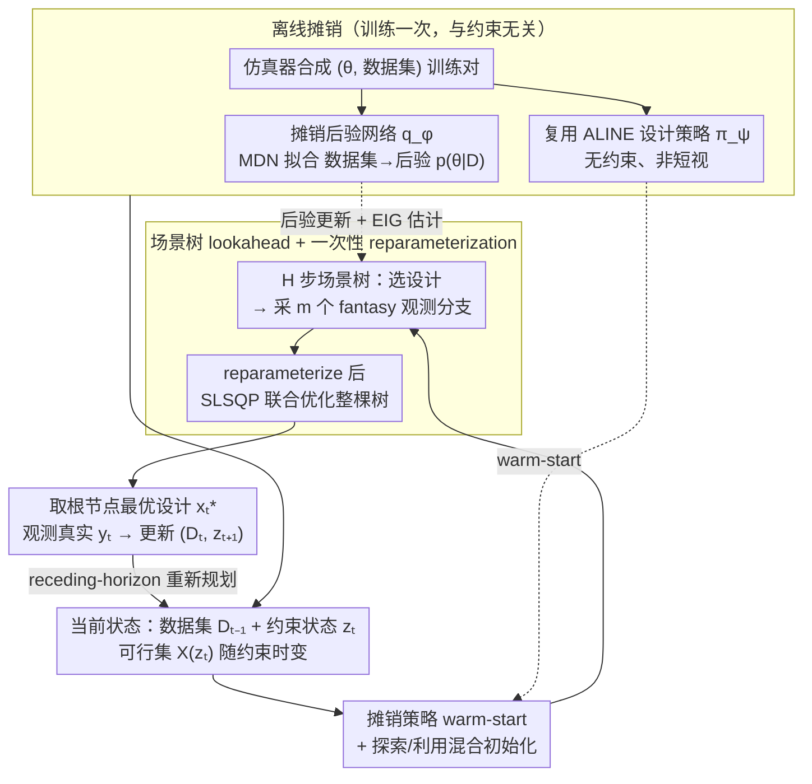

# Constrained Bayesian Experimental Design via Online Planning

**会议**: ICML 2026  
**arXiv**: [2605.26990](https://arxiv.org/abs/2605.26990)  
**代码**: https://github.com/yujiag21/COPEx  
**领域**: 优化 / 贝叶斯实验设计 / 主动学习 / 序列决策  
**关键词**: Bayesian experimental design, EIG, scenario tree, amortized inference, constrained planning

## 一句话总结
本文提出 COPEx：通过"离线预训练 amortized 后验网络 + 设计策略 + 在线多步 lookahead 场景树"的半摊销方案，让贝叶斯实验设计在测试时能动态适应预算 / 成本 / 转移约束，在受约束的 location finding、CES、cost-aware AL 三类任务上 EIG / RMSE 一致超过 VPCE、ALINE、RL-BOED 等基线。

## 研究背景与动机

**领域现状**：贝叶斯实验设计（BED）通过最大化期望信息增益（EIG）来挑选下一个实验。近年的"摊销 BED"路线（Foster 2021、Ivanova 2021、Blau 2022、Huang 2026 等）在离线阶段训练一个 transformer / RL 设计策略 $\pi_\psi(x \mid \mathcal{D})$，测试时几乎零延迟地非贪婪输出非短视设计序列。

**现有痛点**：实际科学实验几乎都带有动态约束 —— 仪器测量成本随时变化、总预算有限、传感器移动距离/能量受限、相邻刺激不能差太多等。但摊销策略在训练时是按某一固定可行集训练的，部署时如果加上"相邻设计 $\|x_t - x_{t-1}\| \le \delta$"或"全程总预算 $B_{\text{total}}$"等约束，要么需要重训整张策略网络，要么靠 post-hoc mask 把动作硬投到可行集 —— 后者会把轨迹推到训练分布之外，效果显著恶化（图 1 展示了 ALINE 在 $\delta=0.1$ 时探索得很烂，posterior 几乎不收敛）。

**核心矛盾**：约束不是无关紧要的运行细节，而会从根本上重塑最优设计策略；但要"约束感知 + 非短视"，naive 做法要么算不动（每个候选 trajectory 都要嵌套估计 posterior 和 EIG），要么不够通用（每改一种约束就重训）。

**本文目标**：设计一个测试时就能在线适配任意预算 / 转移 / 可行性约束的 BED 方法，并保持 amortized 方法的非短视优势与可控的计算开销。

**切入角度**：把 BED 显式建模成"约束状态 $z_t$ 演化 + Bellman 递推"的有限视界动态规划，用 H 步 lookahead 场景树近似求解；通过"离线摊销 posterior + 摊销策略 warm-start + 一次性 reparameterization"压掉场景树本身的爆炸成本，把 nested posterior update 变成可微的前向 pass。

**核心 idea**：把"约束感知"放在在线规划层，把"算得快"放在离线摊销层 —— 两者解耦，约束改了不用重训。

## 方法详解

### 整体框架

COPEx 把"测试时改约束不用重训"这件事拆成两层：约束感知交给在线规划，算得快交给离线摊销，两层解耦。它先把约束 BED 写成在状态 $(\mathcal{D}_{t-1}, z_t)$ 上的有限视界 MDP——奖励是当步期望信息增益 $\text{EIG}(x_t;\mathcal{D}_{t-1})$，数据集随观测增长 $\mathcal{D}_t = \mathcal{D}_{t-1}\cup\{(x_t,y_t)\}$，约束状态按 $z_{t+1}=f(z_t,x_t)$ 演化，可行集 $\mathcal{X}(z_t)$ 随之时变（一套 $z$/$f$ 就能覆盖三类典型约束：bounded-change 转移 $\|x_t-x_{t-1}\|\le\delta$、全局预算 $b_{t+1}=b_t-c(x_t,\breve z_t)$、设计相关成本）。

测试时走 receding-horizon：每一步 $t$ 在线展开一棵 H 步 lookahead 场景树，根节点是当前 $(\mathcal{D}_{t-1},z_t)$，每个 decision 节点选一个设计 $x_k^{j_{1:\ell}}$，每个设计往下采 $m_k$ 个 fantasy 观测分支，到深度 $H+1$ 截断；一次性联合优化整棵树上的所有决策变量 $\mathbf{X}_{\text{tree}}$，只执行根节点最优设计 $x_t^\star$，观测真实 $y_t$，更新状态后重新规划。支撑这棵树高速运转的，是离线预训练好的两件东西：摊销 posterior 网络 $q_\phi(\theta\mid\mathcal{D})$（混合密度网络拟合 $\mathcal{D}\mapsto p(\theta\mid\mathcal{D})$，负责"算得快"）和摊销设计策略 $\pi_\psi$（直接复用 Huang et al. 2026 的 ALINE transformer，负责"初始化得好"）。

### 关键设计

**1. 场景树多步 lookahead + 一次性 reparameterization：把 Bellman 递推折成一个可微优化**

要做到"非短视 + 约束感知"，最直接的写法是解 Bellman 递推 $V_t(\mathcal{D}_{t-1},z_t) = \max_{x_t}\{\text{EIG}(x_t;\mathcal{D}_{t-1}) + \gamma\mathbb{E}_{y_t}[V_{t+1}]\}$，但这需要在每个候选 trajectory 上嵌套做 posterior 更新和 EIG 估计，对非共轭模型几乎不可行。COPEx 借 Jiang 2020b 的 one-shot tree BO 思路绕开嵌套：预先采一组固定的 base noise $\varepsilon=(\varepsilon_\theta,\varepsilon_y)$，让所有 fantasy 后验样本 $\theta_k^{j_{1:\ell}} = g_\phi(\mathcal{D}_{k-1}^{j_{1:\ell}}, \varepsilon_{\theta,k}^{j_{1:\ell}})$ 和 fantasy 观测 $\tilde y_k = h(x_k, \theta_k, \varepsilon_y)$ 都变成决策变量的确定性函数。这样整棵树的目标

$$\widehat V^{(H)}(\mathbf{X}_{\text{tree}};\varepsilon) = \sum_{\ell=0}^H \gamma^\ell \frac{1}{\prod m}\sum_{j_{1:\ell}}\widehat{\text{EIG}}$$

塌缩成单一的非线性规划，用 SLSQP 一次解完，梯度对整棵树都可达。约束则直接挂在变量上——转移约束写进各节点的 $\mathcal{X}(z_k^{j_{1:\ell}})$，预算约束靠 $z$ 累加——而不是塞进策略网络。于是换约束只需改 $\mathcal{X}(z)$ 和 $f$ 两个函数，完全不碰任何网络权重。

**2. 摊销后验网络 + adaptive contrastive EIG 估计器：把 nested expectation 压成几次前向**

场景树节点数随 H 指数爆炸，每个节点又要做"posterior 更新 + fantasy 采样 + EIG 估计"三件昂贵的事，naive 算法根本撑不住——而这两件正是 BED 用 EIG 的根本难点（反复后验更新 + nested expectation）。COPEx 用一个混合密度网络 $q_\phi(\theta\mid\mathcal{D})$ 把它们都摊销掉：离线最小化 $-\frac{1}{n}\sum\log q_\phi(\theta_i\mid\mathcal{D}_i)$，从仿真器一次性合成的训练数据里学一个"数据集 → 后验"的映射。在线时，posterior 更新就是评估 $q_{\hat\phi}(\theta\mid\mathcal{D}\cup\{(x,\tilde y)\})$，fantasy 就是先 $\tilde\theta\sim q_{\hat\phi}(\cdot\mid\mathcal{D}_{k-1}^{j_{1:\ell}})$ 再从似然 $p(\cdot\mid x,\tilde\theta)$ 采样。EIG 套 Foster 2020 的 adaptive contrastive 目标

$$\widehat{\text{EIG}}(x;\mathcal{D},\hat\phi) := \mathbb{E}\Big[\log\frac{p(\tilde y\mid x,\theta_0)}{\frac{1}{L+1}\sum_l q_{\hat\phi}(\theta_l\mid\mathcal{D})\,p(\tilde y\mid x,\theta_l)/q_{\hat\phi}(\theta_l\mid\mathcal{D}\cup\{(x,\tilde y)\})}\Big],$$

把昂贵的 nested 期望换成几次 MDN 评估。正是这一步把"在线规划"从理论玩具变成实际可跑的东西。

**3. 摊销策略 $\pi_\psi$ warm-start + 探索/利用混合初始化：用好 prior 替多次 random restart**

高维非凸的场景树优化很容易陷局部解，而强约束又常把可行域推到策略训练分布之外。COPEx 的应对是：对每个 decision 节点 $(t+\ell,j_{1:\ell})$ 直接用预训练的无约束 ALINE 策略给初始化 $x_{t+\ell}^{j_{1:\ell}}\leftarrow \pi_\psi(\mathcal{D}_{t+\ell-1}^{j_{1:\ell}})$；当约束严重偏移可行域、policy 也不知道怎么走时，就同时跑多棵树，一部分用 $\pi_\psi$ 利用、一部分用随机策略探索，取最优。图 3(a) 给了直接证据：单棵 policy-init 树的累计 EIG 比 10 棵 random-init 还高、耗时还更短——一个好的 prior 远比多个 random restart 划算。

### 损失函数 / 训练策略

离线阶段两件事：（i）摊销 posterior 用 NLL（公式 6）训练，仿真采样 $\theta_i\sim p(\theta)$、长度 $S_i\sim\text{Unif}\{1,\dots,T\}$、设计 $x_{i,s}\sim p(x)$；（ii）设计策略直接借 Huang 2026 的 ALINE，不另训。在线阶段用 SLSQP 解约束非线性规划（公式 9），取 $H\in\{0,\dots,3\}$、$m\in\{1,2\}$。

## 实验关键数据

### 主实验

| 任务 | 约束 | 度量 | COPEx | 最佳基线 |
|------|------|------|-------|----------|
| Location finding ($T=30$) | $\delta\in\{0.05,0.1,0.2\}$ 转移 | 累计 EIG | 各 $\delta$ 一致最高，$\delta$ 越小优势越大 | ALINE / VPCE 在小 $\delta$ 时崩塌 |
| CES ($B_{\text{total}}=100$) | 全局预算 | 累计 EIG | **7.03 ± 0.55** ($H=1$) | ALINE 4.46 / RL-BOED 4.93 / VPCE 2.18 |
| CES ($B_{\text{total}}=150$) | 全局预算 | 累计 EIG | **7.47 ± 0.55** ($H=1$) | ALINE 5.70 / RL-BOED 4.98 |
| Cost-aware AL (Ackley/Branin/Goldstein-Price × Hazard/Rough) | 设计相关成本 + 转移 | RMSE @ 同成本 | 一致低于 GP-EPIG/US/VR/RS | 4 个 GP 基线 |

### 消融实验

| 配置 | 结果 / 说明 |
|------|-------------|
| Policy-init 单棵 vs 10 棵 random-init | Policy-init 单棵 EIG 更高且耗时显著更短（图 3a） |
| 规划视界 $H\in\{0,\dots,5\}$ | EIG 在 $H=2,3$ 后饱和，runtime 继续指数涨（图 3b） |
| 分支数 $m_k=m$ | Location finding 上 $m$ 增大几乎无收益，runtime 指数涨（图 3c） |
| CES 上 $H=0$ vs $H=1$ vs $H=3$ | $H=1$ 最好（7.03），$H=3$ 反降到 6.36 —— 深树会让 $q_{\hat\phi}$ 的偏差沿 rollout 累积 |
| Hazard Center vs Rough Terrain (AL) | 在更崎岖的成本地形下，非短视 COPEx 相对短视的优势更明显 |

### 关键发现
- 摊销策略 warm-start 是"性价比之王"：策略本身不需要 constraint-aware，单纯作为初始化就能把 SLSQP 推到优质局部解，节省的时间远大于多 restart。
- 短视界（$H=1$ 或 $2$）几乎够用：BED 这种 EIG 累加目标的边际收益衰减很快，深规划在多数任务上不划算，且会放大 $q_{\hat\phi}$ 的系统偏差。
- 约束越紧 COPEx 越赚：$\delta$ 减小或 $B_{\text{total}}$ 减小时，post-hoc mask 类基线（ALINE）和短视 VPCE 越吃亏，COPEx 的相对优势随之扩大。
- 即便没有显式潜变量 $\theta$，把摊销 posterior 替成摊销 predictive $q_\phi(y\mid x,\mathcal{D})$、用 EPIG 替 EIG，整个框架在主动学习上也无缝迁移。

## 亮点与洞察
- **"约束在线、模型离线"的解耦哲学**：摊销负责贵的（posterior + EIG 估计），在线规划负责脏的（任意可行集 + 任意成本）；改约束不用碰任何神经网络权重，这点对真实科学实验流水线意义巨大。
- **One-shot reparameterized tree**：把通常要嵌套 backward induction 才能解的 H 步 lookahead 折叠成一个梯度可达的非线性规划，是把 Jiang 2020b 的 BO 思路迁移到 BED 的关键技巧 —— BED 的难点（nested EIG）刚好被摊销 posterior 一并消掉。
- **诚实的 horizon 报告**：作者直接给出 $H=3$ 反而劣于 $H=1$ 的现象并归因于摊销偏差累积，没有刻意往"更深更好"上靠，避免了同类工作常见的"深规划无脑包打天下"叙事。
- 可迁移到任何"高代价序列决策 + 状态可被神经网络拟合"的场景（多臂赌博机式临床试验、机器人主动感知、自适应物理仿真），关键是把 EIG / EPIG 换成你需要的 utility，再把约束写进 $\mathcal{X}(z)$ 和 $f$ 即可。

## 局限与展望
- **摊销 posterior 偏差累加**：$q_{\hat\phi}$ 的小偏差在深树 rollout 时会指数放大（CES 上 $H=3$ 反降已经验证），需要更稳的密度估计或在线 fine-tune。
- **训练分布外的强约束**：如果约束严重偏移了可行域，$\pi_\psi$ 给的初始化会失效，作者只能靠 random restart 兜底 —— 没有真正解决"约束感知策略"问题。
- **每步在线规划开销不小**：CES 上 $H=1$ 单步约 19.5s，对实时性高的应用（在线主动学习 / 机器人在线决策）仍偏重；可结合 Hedman 2025 的周期性策略 fine-tune 缓解。
- **依赖可仿真生成模型**：摊销 posterior 训练需要大量 $(\theta,\mathcal{D})$ 仿真对，对似然完全黑箱、仿真也贵的真实科学场景（高保真分子动力学）不太友好。
- 评估未覆盖更大维度 $d_\mathcal{X}$ 或更长视界 $T \gg 30$ 的场景，scaling 行为还不清楚。

## 相关工作与启发
- **vs ALINE (Huang 2026)**：ALINE 是完全摊销的非短视策略，测试时零延迟但完全无法适配新约束（只能靠 mask）。COPEx 直接复用了它的策略当 warm-start，但额外加了一层在线规划，把"约束感知"从训练阶段挪到测试阶段。
- **vs VPCE (Foster 2020)**：VPCE 是非摊销变分 EIG 优化，可以通过 reparameterize 满足转移约束，但本质短视且每步要重新训练变分分布，CES 上单步 105s vs COPEx 19s 且 EIG 仅 2.18 vs 7.03。
- **vs RL-BOED (Blau 2022)**：RL 训出来的非短视策略对全局预算这种 trajectory-level 约束没有显式建模，且无法测试时调整。
- **vs One-shot tree BO (Jiang 2020b)**：本文把这个技巧迁到了 BED，但 BED 的 nested EIG 比 BO 的 GP 预测均值/方差贵得多，必须配合摊销 posterior 才能跑得动。
- **vs Astudillo 2021 (cost-aware BO)**：他们的"fantasy budget"技巧（用 base policy 估计 N 步未来成本作为当前预算代理）被作者点名作为缓解"大预算下规划失效"问题的可行扩展。

## 评分
- 新颖性: ⭐⭐⭐⭐ — 把 one-shot tree + 摊销 posterior + 摊销策略三件套合到约束 BED 上，组件不算全新但组合点和动机很自然。
- 实验充分度: ⭐⭐⭐⭐ — 三类异质任务（位置估计 / CES / AL）+ 多种约束 + 充分消融，主表清晰；缺更大规模问题的 scaling 实验。
- 写作质量: ⭐⭐⭐⭐ — 公式与符号体系工整，方法部分推导清楚；图 1 的对比展示极有说服力。
- 价值: ⭐⭐⭐⭐ — 把"测试时改约束不用重训"这件事真正解决了，对实验科学落地价值高。

<!-- RELATED:START -->

## 相关论文

- [\[CVPR 2026\] Watch and Learn: Learning to Use Computers from Online Videos](../../CVPR2026/llm_pretraining/watch_and_learn_learning_to_use_computers_from_online_videos.md)
- [\[NeurIPS 2025\] Composition and Alignment of Diffusion Models using Constrained Learning](../../NeurIPS2025/llm_pretraining/composition_and_alignment_of_diffusion_models_using_constrai.md)
- [\[NeurIPS 2025\] Optimal Online Change Detection via Random Fourier Features](../../NeurIPS2025/llm_pretraining/optimal_online_change_detection_via_random_fourier_features.md)
- [\[ACL 2025\] Data-Constrained Synthesis of Training Data for De-Identification](../../ACL2025/llm_pretraining/data-constrained_synthesis_of_training_data_for_de-identification.md)
- [\[ICML 2025\] Position: The Future of Bayesian Prediction Is Prior-Fitted](../../ICML2025/llm_pretraining/position_the_future_of_bayesian_prediction_is_prior-fitted.md)

<!-- RELATED:END -->
