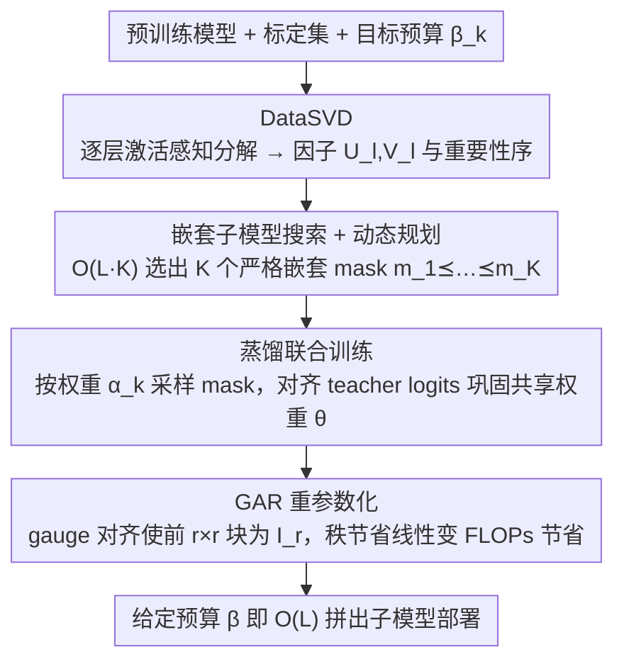

# FlexRank: Nested Low-Rank Knowledge Decomposition for Adaptive Model Deployment

**会议**: ICML 2026 Spotlight  
**arXiv**: [2602.02680](https://arxiv.org/abs/2602.02680)  
**代码**: https://github.com/RickZack/FlexRank  
**领域**: 模型压缩 / 弹性推理 / 低秩分解  
**关键词**: 弹性模型, 低秩分解, 嵌套子模型, 知识蒸馏, 帕累托前沿

## 一句话总结
FlexRank 把预训练大模型的每个线性层做 activation-aware 低秩分解（DataSVD），用动态规划在 $O(L\cdot K)$ 时间内挑出一组**严格嵌套**的子模型对应不同算力预算，再用知识蒸馏联合训练这套共享权重，最后通过 Gauge-Aligned Reparametrization 把秩节省真正翻译成 FLOPs 节省——一次训练即可在 LLM 与 ViT 上得到逼近真实帕累托前沿的"一族"可部署模型。

## 研究背景与动机

**领域现状**：LLM 和 ViT 已经膨胀到数十亿参数，从头训练只有少数机构负担得起。社区的主流做法是复用预训练权重，配合 PEFT（LoRA 等）做下游适配，或用量化/剪枝在部署侧压成本。

**现有痛点**：PEFT 只动小部分参数，backbone 的算力结构没变，部署成本仍然是"一刀切"。量化和剪枝虽然能减计算，但量化感知训练要改 pipeline，结构化稀疏依赖硬件 kernel；更关键的是这些方法都只产出**单一压缩比例**的模型，给一台手机一种尺寸、给一台服务器另一种尺寸时需要反复 retrain 或 maintain 多套权重。

**核心矛盾**：现有弹性方案要么 (i) 先训满模型，再 post-hoc 切子网（PTS）—— 作者用定理 4.1 证明这样得到 Pareto 最优子模型的"概率为零"；要么 (ii) 联合训练所有子模型（ASL），但所有子网会**竞争同一份表示容量**，定理 4.2 证明其每个 rank 的次优 gap 严格大于 0。两条路线都给不出真正贴近 Pareto 前沿的子模型族。

**本文目标**：从一个预训练模型出发，构造**一套共享权重 $\theta$** 和一组**严格嵌套**的 mask $\mathbf{m}_1 \preceq \mathbf{m}_2 \preceq \dots \preceq \mathbf{m}_K$，使得在 $K$ 个不同算力预算 $\beta_k$ 下截取得到的子模型同时尽量贴近真实 Pareto 前沿。

**切入角度**：作者注意到 SVD 给每层 weight 提供了天然的"重要性序"（奇异值从大到小），而**嵌套（nested）**这个看似限制更严的约束反而能避免 ASL 的相互干扰：第 $r+1$ 列只需要学第 $r+1$ 阶 SVD 截断与第 $r$ 阶之间的残差 $A_{r+1}-A_r$，不会和小子模型抢容量。

**核心 idea**：用 layer-wise activation-aware SVD 给出每层的局部重要性，用 DP 把局部序聚合成全局嵌套子模型族，再用蒸馏把"独立的层分解"消化成"协同的端到端弹性模型"，最后在推理时用 gauge 重参数化把 $r$ 阶截断真正变成 $\mathcal{O}((m+n-r)r)$ FLOPs。

## 方法详解

### 整体框架
FlexRank 从一个预训练模型 $f(\cdot;\theta_{\mathrm{orig}})$ 出发，借一份约 $10^3$ 样本的小标定集 $\mathcal{Z}$ 和一组目标预算 $\mathcal{B}=\{\beta_k\}_{k=1}^K$，最终交付**单套**共享参数 $\theta=\{(U_l,V_l)\}_{l=1}^L$ 加一条严格嵌套的 mask 序列 $\mathcal{M}^\star=\{\mathbf{m}_k^\star\}$；部署时只要给定预算 $\beta$，就能在 $O(L)$ 时间内拼出对应子模型 $\theta_\beta$，不需要任何额外训练。整条流水线分三步走：先把每层权重独立做 activation-aware SVD，得到带"重要性序"的低秩因子 $(U_l,V_l)$；再用动态规划在 $K^L$ 种全局秩组合里搜出 $K$ 个互相嵌套的子模型；最后在这 $K$ 个 mask 上轮流采样、用 teacher logits 蒸馏，把一堆独立的层分解巩固成端到端协同的弹性模型。这三步产出共享权重，部署时再叠一层 GAR 重参数化把秩节省真正落成 FLOPs 节省。

### 关键设计

**1. DataSVD：让分解对齐真实输入而非权重本身**

单纯对 $W_l$ 做 SVD 在 LLM 上掉点很惨（Fig. 4 显示压掉 20% 参数就崩），原因是权重幅值大不代表它对真实输入贡献大。DataSVD 把分解目标从最小化权重重构误差 $\|W_l - U_l V_l^\top\|_F^2$ 换成最小化**输出误差** $\mathbb{E}_{\mathbf{x}_l}\bigl[\|(W_l-U_l V_l^\top)\mathbf{x}_l\|_2^2\bigr]$，于是奇异方向由激活协方差决定，"重要的方向"自然和真实输入分布对齐。实现上用标定集采集激活矩阵 $\mathbf{X}_l$、对加权问题求闭式 SVD，作者证明空间复杂度可以做到 $\mathcal{O}(n_l^2)$、与样本数 $N$ 无关。不过这步只是初始化，作用是给后面的 DP 提供一个可靠的"重要性序"——作者在 Remark 3.1 明确指出光有它远不够，仍要靠后续蒸馏。

**2. 嵌套子模型搜索 + 动态规划：把组合爆炸驯到 $O(LK)$**

要在 $K^L$ 种全局秩组合里选出 $K$ 个**严格嵌套**的子模型 $\mathbf{m}_1 \preceq \dots \preceq \mathbf{m}_K$、每个都尽量贴近其预算 $\beta_k$ 下的 Pareto 最优，直接枚举不可行。FlexRank 先对每层 $l$ 枚举 $K$ 个候选秩，算出"截断到该秩"带来的 cost 节省 $\Delta c$ 与 error 增加 $\Delta e$，得到该层的局部 Pareto 表 $\mathcal{Q}_l$；再在**层间误差可加**这一 standard 但 strong 的 additivity 假设下，用 DPRankSelection 在 $\mathcal{O}(L\cdot K)$ 时间内从这些局部表组合出全局嵌套 mask 序列（作者在 4 层、$K=10$、共 10000 个子网的可枚举设定下验证了它的排序保真度足够）。

之所以非要"嵌套"这条更紧的硬约束，是从理论上反推出来的，也是全篇最硬核的贡献：Thm 4.1 证明"先训满模型再 post-hoc 切子网"（PTS）找到 Pareto 最优的概率为 0；Thm 4.2 证明"联合训练所有子网"（ASL）每个 rank 至少留下 $\frac{1}{k}(r\lambda-\sum_{i\le r}\sigma_i)^2$ 的次优 gap，因为子网在抢同一份容量；而 Thm 4.3 证明嵌套训练（NSL）能让每个 rank 的 gap 恰好为 0——关键在于第 $r+1$ 列只需要学第 $r+1$ 阶与第 $r$ 阶截断之间的残差 $A_{r+1}-A_r$，不会回头和小子模型竞争。

**3. Gauge-Aligned Reparametrization (GAR)：把秩节省真正翻译成 FLOPs 节省**

低秩分解有个尴尬的临界点：原始 $(U,V)$ 形式即使秩从 $\min(m,n)$ 降到 $r$，矩阵乘的 FLOPs 也只在 $r\ll\min(m,n)$ 时才跑得赢 dense kernel，秩压得不够低就白省。GAR 利用 $UV^\top$ 分解不唯一这一点，引入 gauge $G=U_{1:r,:}^{-1}$，把分解改写成 $UV^\top = (UG)(G^{-1}V^\top) = \tilde{U}\tilde{V}^\top$，让 $\tilde{U}$ 的前 $r\times r$ 块**恰好对齐成 $I_r$**——这部分既不用存也不用算，只剩 $(m-r)\times r$ 的 $\hat{U}$ 真正参与计算，推理代价从 $\mathcal{O}(mr+nr)$ 降到 $\mathcal{O}((m+n-r)r)$，比 dense 的 $\mathcal{O}(mn)$ 严格更省。这样一来 $r$ 的任何减少都**线性**翻译成 FLOPs 减少，临界点被彻底消掉，任意 $r<\min(m,n)$ 都立刻有收益。GAR 的预处理只是一次 $\mathcal{O}(r^3)$ 矩阵求逆，相比 SVD 可忽略；它和具体 elastic 算法无关，作者为公平起见在所有 baseline 上也都开了 GAR，比较的就是算法本身而非工程差距。

### 损失函数 / 训练策略
固定搜索出的 $\mathcal{M}^\star$ 后，每个 step 从 $\mathcal{M}^\star$ 里按权重 $\alpha_k$ 采样一个 mask $\mathbf{m}_t^\star$，把对应子模型的输出与原始 teacher $f(\cdot;\theta_{\mathrm{orig}})$ 对齐：

$$\ell_k(\theta)=\mathbb{E}_{\mathbf{d}}\bigl[\mathcal{L}_{\text{KD}}(f(\mathbf{d};\mathcal{T}_{\mathbf{m}_k^\star}(\theta)), f(\mathbf{d};\theta_{\mathrm{orig}}))\bigr]$$

总目标是 $\min_\theta \sum_k \alpha_k \ell_k(\theta)$，标准梯度下降即可。Llama-3.2-1B 上只用 5B token（相比 LayerSkip 的 839B token 少 167×），即可在很多预算下匹配甚至超过更重的 baseline。

## 实验关键数据

### 主实验

| 设置 | 评估 | FlexRank | SOTA 对比 | 说明 |
|------|------|----------|-----------|------|
| Llama-3.2-1B/3B/8B, 5B token | commonsense lm-eval-harness 平均准确率 | 在 20–80% 各预算下持续领先 | 单纯 SVD/DataSVD 在去掉 20% 参数就大幅掉点；ACIP（SOTA elastic 低秩法）在低预算段被压制 | Fig. 4-top |
| DINOv3 ViT-L/16 → ViT-7B/16, ImageNet-1K | top-1 acc | 压到 30% 仍接近满模型 | 同 baseline 各预算下均显著落后 | Fig. 4-bottom，压到 70% 时 gap 仍在 5% 内 |
| Llama-3.2-1B, LoRA 微调到数学/代码 | math/code avg acc | base→1×→0.8×→0.4× 平滑下降（math: 25.7→25.0→20.5→13.6） | — | Tab. 1，子模型可直接挂 LoRA 做下游适配 |

### 消融实验

| 配置 | 关键发现 | 含义 |
|------|----------|------|
| PTS（先训满模型再切） | Pareto gap 永远 > 0（Thm 4.1） | 任何"满训完再 post-hoc 取子网"路线注定次优 |
| ASL（联合训所有子网） | 严格正 gap $\ge \frac{1}{k}(r\lambda-\sum\sigma_i)^2$（Thm 4.2） | 子网相互干扰、抢容量 |
| NSL = FlexRank 的嵌套训练 | gap = 0（Thm 4.3） | 嵌套是恢复 Pareto 前沿的充分条件 |
| 独立训层（无端到端蒸馏） | 性能持续很差（Fig. 7b） | 层间非线性信息流必须靠端到端蒸馏巩固 |
| DataSVD 标定样本数 | 128 样本已饱和（Fig. 7a） | 标定开销极小，瓶颈不在 SVD 精度 |
| GPT-2 各预算下的层级压缩热力图 | 中间注意力层 c_proj 最后才被裁（Fig. 6） | DP 真的在按重要性差异化分配，不是均匀截断 |

### 关键发现
- **嵌套是 Pareto 弹性的"刚需"而非启发式**：作者用三条定理（4.1 / 4.2 / 4.3）把 PTS、ASL、NSL 的最优性 gap 从理论上夹紧，得出"嵌套+联合训练"是唯一能让所有 rank 同时达到 Pareto 最优的方案。
- **GAR 让低秩压缩"FLOPs 立刻就省"**：传统低秩分解需要 $r$ 极小才能跑赢 dense kernel，GAR 把这个临界点彻底消掉，是把理论秩节省翻译到实际推理加速的关键工程 trick。
- **训练成本可摊销**：训练时秩是满的，约 2× 显存 + 2× 慢于 dense forward；但一次训练得到 $K$ 个可部署模型，相比为每个预算单独 retrain 仍然非常划算。

## 亮点与洞察
- **"先用理论否决错路再设计正路"的论文结构**：第 4 节先用 Thm 4.1 / 4.2 把 PTS 和 ASL 两条最直觉的路线"判死刑"，再用 Thm 4.3 证明嵌套是恢复 Pareto 的充分条件。这种"反证驱动设计"的写法比常见的"提方法+实验赢"更有说服力。
- **GAR 是和算法解耦的通用 trick**：作者在所有低秩 baseline 上都开了 GAR，这样比较的就是"算法本身"而不是"工程优化差距"。这种 fair-by-construction 的对照让 FlexRank 的胜出更可信。
- **DP + additivity 假设是把组合爆炸驯服到 $O(LK)$ 的关键**：作者承认 additivity 是 strong assumption，但在可枚举的小规模实验里验证了"排序保真度"——这是把不可解的 $K^L$ 搜索变成可解算法的核心一步，思路可迁移到任何"按层独立打分 + 全局组合预算"的剪枝/量化场景。
- **可推广方向**：嵌套 + KD 的范式可以套到深度弹性（不同层数）、宽度弹性（不同 head 数）、甚至量化位宽弹性上，只要找到对应的"重要性序"。

## 局限与展望
- additivity 假设（层间误差可加）在很深的非线性网络上严格不成立，作者只在 4 层小网上验证；在 8B Llama 这种规模下偏差有多大、对 DP 解的影响多深，论文没给定量界。
- 训练阶段需要存满秩 $(U,V)$，~2× 显存开销，对真正巨型模型（70B+）尚不可行；如何在训练阶段就用部分秩或 sharded factors 是工程门槛。
- 论文没评估"输入自适应路由"，即给定 token 难度动态选预算——但 FlexRank 天然提供了这个能力，结合 difficulty estimator 可能是后续低垂果实。
- 仅比较了同家族（rank-based）和少量跨家族（LLM-Pruner / LayerSkip）baseline，与量化、深度弹性、MoE 的组合潜力尚未探索。

## 相关工作与启发
- **vs ACIP (Genzel et al., 2025)**: ACIP 也走 SVD-分解 + LoRA adapter，但 frozen base + 联合优化 adapter 与 pruning score 本质是 PTS+ASL 的混合。FlexRank 直接更新 $(U,V)$ 共享权重并强制嵌套，理论上更优；实验在低预算段优势明显，并避免 ACIP 在满预算下"adapter 反而拖累"的现象。
- **vs SVD-LLM / DRONE / ASVD**: 都是 activation-aware 低秩压缩，但都只输出**单一压缩比例**的模型；FlexRank 用 DP + 嵌套训练一次产出一族子模型，把"一次训练 $\to$ 任意预算部署"做到位。
- **vs MatFormer / Once-For-All / Flextron**: 这些是 width/depth/architecture 维度的弹性方案，FlexRank 是首次把弹性建在**因式分解空间**上并给出理论支撑；二者互补，可叠加。
- **vs LLM-Pruner / LayerSkip**: 结构化剪枝和早退方法在 Llama-3.2-1B 上被 FlexRank 在 5B token 训练下击败，而 LayerSkip 用了 839B token（167×）。说明低秩弹性在"训练效率/部署灵活度"维度有独特性价比。

## 评分
- 新颖性: ⭐⭐⭐⭐⭐ 把"嵌套子模型训练"上升到定理层面证明，并配套 DP + GAR，是低秩弹性方向少见的理论+工程并重之作。
- 实验充分度: ⭐⭐⭐⭐ 覆盖 GPT-2 / Llama 3.2-1B/3B/3.1-8B / DINOv3 ViT-L 到 7B，5B token 训练量公平，下游 LoRA 也验证了——但跨家族对比相对单薄。
- 写作质量: ⭐⭐⭐⭐⭐ 用 PTS→ASL→NSL 三个定理把动机讲透，附录给出可枚举验证、复杂度推导和工程细节，几乎是这个细分方向的范式之作。
- 价值: ⭐⭐⭐⭐⭐ "train-once, deploy-everywhere" 是 LLM/ViT 异构部署的真实痛点，FlexRank 给出了理论清晰、工程可落地的解。

<!-- RELATED:START -->

## 相关论文

- [\[ICLR 2026\] Implicit Bias and Loss of Plasticity in Matrix Completion: Depth Promotes Low-Rank](../../ICLR2026/llm_pretraining/implicit_bias_and_loss_of_plasticity_in_matrix_completion_depth_promotes_low-ran.md)
- [\[NeurIPS 2025\] Breaking the Frozen Subspace: Importance Sampling for Low-Rank Optimization in LLM Pretraining](../../NeurIPS2025/llm_pretraining/breaking_the_frozen_subspace_importance_sampling_for_low-rank_optimization_in_ll.md)
- [\[ACL 2026\] KoCo: Conditioning Language Model Pre-training on Knowledge Coordinates](../../ACL2026/llm_pretraining/koco_conditioning_language_model_pre-training_on_knowledge_coordinates.md)
- [\[ICML 2026\] SPARe: Stacked Parallelism with Adaptive Reordering for Fault-Tolerant LLM Pretraining Systems with 100k+ GPUs](spare_stacked_parallelism_with_adaptive_reordering_for_fault-tolerant_llm_pretra.md)
- [\[ACL 2026\] SAGE: Sign-Adaptive Gradient for Memory-Efficient LLM Optimization](../../ACL2026/llm_pretraining/sage_sign-adaptive_gradient_for_memory-efficient_llm_optimization.md)

<!-- RELATED:END -->
