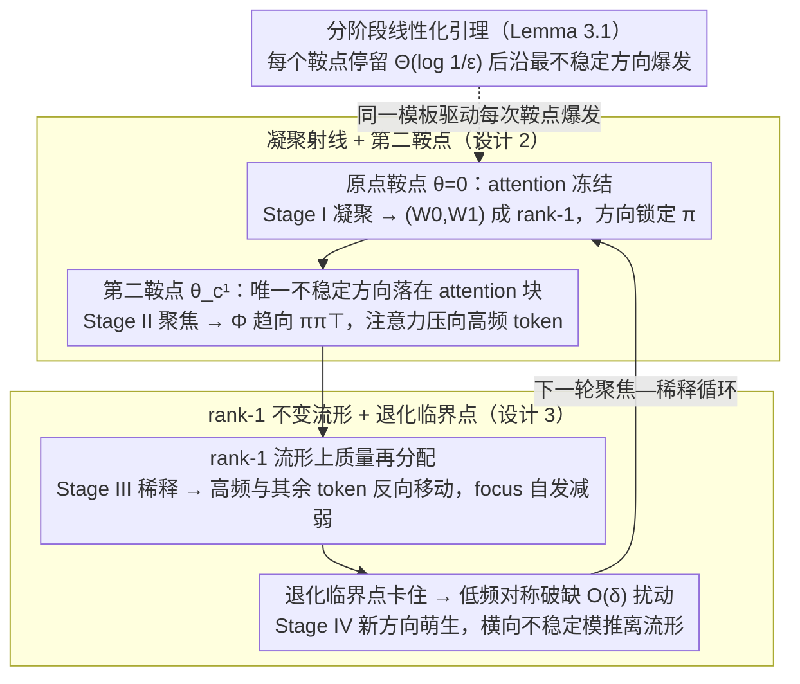

# Focus and Dilution: The Multi-stage Learning Process of Attention

**会议**: ICML 2026  
**arXiv**: [2605.01199](https://arxiv.org/abs/2605.01199)  
**代码**: 无  
**领域**: LLM 预训练 / Transformer 训练动力学  
**关键词**: 注意力训练动力学、聚焦-稀释循环、凝聚现象、马尔可夫数据、鞍点线性化

## 一句话总结
本文在单层 Transformer 学习马尔可夫数据的简化场景下，通过围绕一系列临界点做分阶段线性化的梯度流分析，揭示并严格刻画了注意力训练中反复出现的「聚焦—稀释」循环，并在 WikiText 与 TinyStories 上观察到一致的现象。

## 研究背景与动机
**领域现状**：Transformer 的逼近能力已有大量理论结果，但人们对「训练过程中注意力到底如何一步步形成」的机制理解仍非常薄弱。已有分析往往依赖重参数化或代理动力学来回避真实耦合，因而看不见 embedding、投影与 attention 之间真实的相互作用。

**现有痛点**：经验研究观察到 Transformer 训练存在多阶段切换，并且 attention 会从高度集中突然变得弥散，但没有理论解释「为什么会从聚焦切换到稀释」「为什么聚焦会再次出现」。常用的 NTK / 代理动力学要么淹没了这种相变，要么需要把 attention 当成事先固定的结构去研究。

**核心矛盾**：要保留住「embedding–投影–attention 三者耦合」这条本质，又必须把动力学化简到可以闭式分析；过去的工作几乎都在二者之间做了让步。

**本文目标**：在不破坏耦合结构的前提下，给出一个能解释完整训练曲线分段形状的、可证明的机制描述：解释凝聚为什么先出现、attention 为什么在某一时刻突然增长、为什么又会自行稀释、之后又如何从对低频 token 的对称破缺重启新一轮循环。

**切入角度**：选择最小可行的设定——单层 Transformer + 马尔可夫数据 + 群体梯度流——并在每个临界点附近做局部线性化。然后把多个线性化阶段「拼起来」，每个阶段的稳定/不稳定方向决定了下一阶段的行为。

**核心 idea**：训练动力学不是单调收敛，而是一条在多个鞍点之间逐段跳跃的轨迹；每个鞍点上「不稳定特征方向」决定了下一阶段是凝聚、是 attention 增长、还是稀释。

## 方法详解

### 整体框架
论文不提新算法，而是为「单层 Transformer + 马尔可夫数据 + 交叉熵 + 群体梯度流」这个极简设定，给出一个能解释完整训练曲线分段形状的、可证明的动力学故事。设词表 $\mathcal{V}=[d]$，序列由转移矩阵 $P=\lambda I+(1-\lambda)\mathbf{1}\pi^{\top}$ 生成、长度为 $s$，模型含 embedding $W_0$、注意力 $W_Q,W_K$ 与输出 $W_1$；作者把它们打包成三个等价矩阵 $M=W_0W_1$、$\Phi=W_0W_QW_K^{\top}W_0^{\top}$、$W_{QK}=W_QW_K^{\top}$ 并推出群体梯度 $\partial\mathcal{L}/\partial M$、$\partial\mathcal{L}/\partial\Phi$ 的闭式表达。核心叙事方式是：沿着「原点 → 凝聚射线上的第二鞍点 → rank-1 流形上的退化临界点 → 对称破缺后的新临界点」这串临界点逐个做局部线性化，再把各段拼起来，每个鞍点上的不稳定方向决定下一段轨迹是凝聚、聚焦还是稀释。整条轨迹不是单调收敛，而是一个会自我重启的环：

### 关键设计

**1. 分阶段线性化引理（Lemma 3.1）：把「鞍点停留→沿某方向爆发」变成可证明的通用模板**

实验里训练曲线呈现一段段平台再突变，但缺一个能逐段刻画的工具。引理在每个临界点 $\theta_*$ 处做 Taylor 展开 $\dot{\Delta\theta}=J\Delta\theta+O(\|\Delta\theta\|^2)$，证明只要初始扰动 $\|\Delta\theta(0)\|=\varepsilon$ 足够小、Jacobian 最大实部 $\mu>0$ 且谱隙 $\rho>0$，非线性流动就能与线性化流动 $\dot{\widetilde{\Delta\theta}}=J\widetilde{\Delta\theta}$ 在误差 $C\varepsilon^2 e^{2\mu t}$ 内对齐，并在 $t=\Theta(\log(1/\varepsilon))$ 时间内把归一化方向 $\Delta\theta(t)/\|\Delta\theta(t)\|$ 强制对齐到最不稳定特征向量 $v_u$。它之所以管用，是因为「在鞍点附近停很久、再沿最不稳定方向冲出去」这件直觉中的事被它变成了带误差界的定理，于是后面四个阶段都能套同一个模板分析，不必每次重新发明轮子。

**2. 凝聚射线 + 第二鞍点（Theorems 3.2–3.5）：解释 attention 为什么先按兵不动、再突然聚焦到高频 token**

经验上观察到 attention 总是先无所作为、随后骤然集中，却没人说清触发条件。关键在于原点处 $\partial\mathcal{L}/\partial\Phi=0$，所以注意力子系统暂时没有梯度驱动、原地不动，只有 $(W_0,W_1)$ 被驱动着按 $W_0/\|W_0\|\to\pi/\|\pi\|\,\alpha_1^{\top}$ 凝聚成 rank-1——这就是 Stage I 凝聚。轨迹沿这条凝聚射线滑到第二个临界点 $\theta_c^1$，那里 Jacobian 干净地分解成「负半定的 outer 块 + 正半定的 attention 块」，于是唯一的不稳定方向落在 attention 块上，子系统满足闭式 $\dot{\Delta W_Q}=c\alpha_1\alpha_1^{\top}\Delta W_K$，$(W_Q,W_K)$ 沿同一方向指数增长，把 $\Phi/\|\Phi\|$ 推向 $\pi\pi^{\top}$，所有 token 的注意力一齐压到高频 token 上——这就是 Stage II 聚焦。这样一来，「为什么聚焦一定发生、且一定排在凝聚之后」就被还原成「不稳定方向只存在于 attention 块」这一可证明的事实。

**3. rank-1 不变流形 + 质量再分配 + 退化临界点（Props 3.6–3.8、Theorem 3.9）：解释稀释为何自发发生、循环又如何重启**

聚焦之后参数被困在 rank-1 流形 $W_0=\gamma(t)\alpha_1^{\top}$、$W_1=\alpha_1\beta(t)^{\top}$、$W_{Q,K}=\lambda_{Q,K}(t)\alpha_1\tilde\alpha_1^{\top}$ 上，此时普通线性化已不够，必须保留 attention 的 next-order 反馈。约简动力学给出 $(1-\pi_1)\gamma_1(t)-(d-1)\pi_1\gamma_{i\neq 1}(t)\propto e^{ct}$，意味着高频 token 与其余 token 的 embedding 被迫反向移动——这个「质量再分配」不靠任何正则化或学习率调度，本身就让 attention 自动 dilution，即 Stage III 稀释。而当低频 token 完全对称时，rank-1 流形上出现 $\partial\mathcal{L}/\partial M=\partial\mathcal{L}/\partial\Phi=0$ 的退化临界点，线性化彻底失效、系统会卡住；作者显式承认这一点，再引入 $O(\delta)$ 量级的低频对称破缺扰动，用 Lyapunov–Schmidt 约简证明 Hessian 会冒出 $\Theta(\delta)$ 的横向不稳定模和至多 $O(\delta^2)$ 的切向不稳定模，把轨迹推离 rank-1 流形、萌生新的 embedding 方向，从而开启下一轮聚焦—稀释循环——这就是 Stage IV，也给出了「现实语料里微弱的频率不对称足以让循环不断重启」的物理图像。

### 损失函数 / 训练策略
训练目标就是最后 token 的交叉熵 $\mathcal{L}(\theta)=N^{-1}\sum_i\ell(f_\theta(X_i)_s,y_i)$，分析使用群体梯度流 $\dot\theta=-\nabla\mathcal{L}(\theta)$ 在 $(N,s)\to\infty$ 极限下进行。所有阶段都假定初始化为 $\mathcal{N}(0,\varepsilon^2)$ 的极小尺度 $\varepsilon\ll 1$，从而保证轨迹一开始确实落在原点这个临界点的 $O(\varepsilon)$ 邻域内。

## 实验关键数据

### 主实验

| 实验数据 | 观察到的阶段 | 与理论的对应 |
|----------|--------------|--------------|
| 合成马尔可夫数据，$\pi=(0.75,0.19,0.05,0.01)$ | Stage I–IV 完整出现 | $(W_0,W_1)$ 先变 rank-1，$W_Q,W_K$ 高秩不变（Thm 3.2）；随后突变进入 rank-1 并把所有 attention 拉到 token 0；之后低频 token 的 embedding 出现回撤；最后正交方向涌现 |
| WikiText 真实语料 | 中频 token 「continue」呈四相变化：稀释→聚焦到 whitespace→再次稀释→聚焦回自身 | 与「聚焦—稀释」周期性预测一致 |
| TinyStories | 输入 [the, comma, a, full, been] 的 attention 演化与 WikiText 同型 | 验证 Markov 近似在弱非 Markov 文本上的适用性 |

### 消融实验

| 配置 | 关键观察 | 说明 |
|------|----------|------|
| 不同转移矩阵 $P$、相同 $\pi$ | 都重现四阶段，且阶段顺序一致 | 说明阶段切换由 $\pi$ 的频率结构而非具体 $P$ 决定 |
| PCA 嵌入轨迹 | Stage I–II 单方向生长，Stage III 收缩，Stage IV 沿正交方向爆发 | 直接对应 rank-1 流形上的「质量再分配」与「退化解除」 |
| Attention entropy 与 $\|W_0\|$ 的时间序列 | entropy 先下降后上升再下降；norm 在低频 token 上反复涨缩 | 「focus–dilution」循环不止一次出现，验证理论预测的周期性 |

### 关键发现
- 聚焦相位的出现完全由「在凝聚射线上的鞍点处，attention 块是唯一的不稳定方向」决定；这也是为什么 attention 总是「先按兵不动、再突然集中到高频 token」。
- 稀释相位不需要任何调度，本身就是 rank-1 流形上 embedding 之间「高频 vs 其他 token 反向运动」的自发结果，跟正则化、学习率衰减无关。
- 在低频 token 完美对称的数据上，理论预言系统会卡在退化临界点；实验中如果手动强行对齐低频频率，确实出现训练长期停滞，这反过来证明真实语料里的弱不对称是重启循环的关键。

## 亮点与洞察
- 把训练曲线上看似不可名状的「相变」用「围绕鞍点的线性化 + 不稳定模」串成统一框架，避免了引入额外的代理动力学。这种「分阶段线性化 + 拼接」的做法对其他有相变现象的网络（如双层 MLP、GAN 训练）也可借鉴。
- 「质量再分配」是这篇最 aha 的发现：明明 attention 已经固定指向高频 token，但仅靠 next-order 反馈就能让 embedding 自行 dilution，无需任何外部调度。这意味着不少经验上的「self-correction」可能并不神秘。
- 用「低频 token 间的微小不对称」来解除退化临界点，把数据分布的细微非对称性提升为训练动力学的关键参数，这种 lens 可以迁移到分析 fine-tuning 或 continual learning 中的「平台期」现象。

## 局限与展望
- 理论只覆盖单层、单头、无 LayerNorm、群体梯度流的极简模型；多层与多头会引入额外耦合，尚不清楚阶段结构是否仍然分明。
- 假设了非常小的初始化 $\varepsilon\ll 1$ 才能让分阶段线性化成立；在常规初始化下，凝聚阶段可能根本被略过，相变也会被打乱。
- 真实语料的验证仍局限在 WikiText / TinyStories 这种小规模、单 epoch 的设定；如果想说明大模型预训练全程都有 focus–dilution 循环，需要把分析推广到带 LayerNorm、AdamW、warmup 的实际优化器，并刻画扰动 $\delta$ 与采样噪声之间的相互作用。

## 相关工作与启发
- **vs Chen & Luo (2025) 的 condensation 工作**：本文复述并细化了凝聚定理，把凝聚方向显式锁定到稳态分布 $\pi$，并接着分析了凝聚之后发生的所有事。
- **vs Tian et al. (2024) 关于 attention 从集中到弥散的实验观察**：本文给出了这一现象的第一个 saddle-to-saddle 解释，并指出「稀释」并不是过拟合或正则化效应，而是 rank-1 流形上必然出现的 mass-redistribution。
- **vs Chang et al. (2024) 学习曲线分阶段研究**：本文把多阶段从经验描述抬高到可证明的动力学结构，并提供了「下一个阶段如何被触发」的具体机制（不稳定特征向量 + 对称破缺）。

## 评分
- 新颖性: ⭐⭐⭐⭐⭐ 用线性化拼出多阶段相变图，并独家给出「稀释」与「重启循环」的理论解释。
- 实验充分度: ⭐⭐⭐ 合成实验与定理高度对应，但真实语料只覆盖两套小型数据。
- 写作质量: ⭐⭐⭐⭐ 概念清晰，但定理叙述较密集、读者需要补足谱论与 Lyapunov–Schmidt 背景。
- 价值: ⭐⭐⭐⭐ 为「读懂 Transformer 训练曲线」提供了通用语言，是后续解释更复杂相变的良好起点。

<!-- RELATED:START -->

## 相关论文

- [\[ICML 2025\] On the Role of Label Noise in the Feature Learning Process](../../ICML2025/llm_pretraining/on_the_role_of_label_noise_in_the_feature_learning_process.md)
- [\[ICML 2026\] Names Don't Matter: Symbol-Invariant Transformer for Open-Vocabulary Learning](names_dont_matter_symbol-invariant_transformer_for_open-vocabulary_learning.md)
- [\[NeurIPS 2025\] The Atlas of In-Context Learning: How Attention Heads Shape In-Context Retrieval Augmentation](../../NeurIPS2025/llm_pretraining/the_atlas_of_in-context_learning_how_attention_heads_shape_in-context_retrieval_.md)
- [\[ICLR 2026\] Deconstructing Positional Information: From Attention Logits to Training Biases](../../ICLR2026/llm_pretraining/deconstructing_positional_information_from_attention_logits_to_training_biases.md)
- [\[ICML 2026\] Trust Functions: Near-Lossless Weak-to-Strong Generalization by Learning When to Trust the Weak Teacher](trust_functions_near-lossless_weak-to-strong_generalization_by_learning_when_to_.md)

<!-- RELATED:END -->
