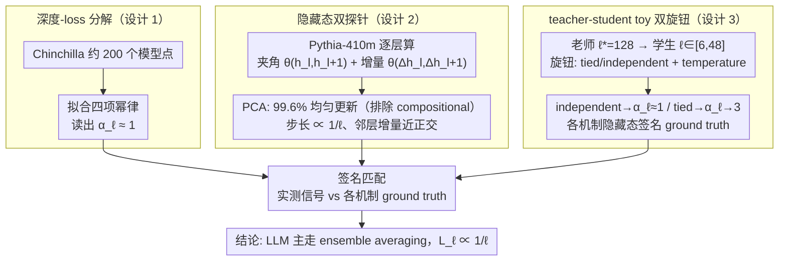

# Inverse Depth Scaling From Most Layers Being Similar

**会议**: ICML2026  
**arXiv**: [2602.05970](https://arxiv.org/abs/2602.05970)  
**代码**: https://github.com/liuyz0/DepthScaling  
**领域**: LLM 预训练 / Neural Scaling Laws  
**关键词**: 深度 scaling、ensemble averaging、残差网络、Chinchilla、宽深权衡

## 一句话总结
本文通过对 LLM 隐藏态动力学的测量 + teacher-student toy model 的对照实验，证明 LLM 的 loss 与深度近似成反比（$\alpha_\ell \approx 1$），并将其归因于"绝大多数层在做功能相似的小步更新、通过 ensemble averaging 抵消误差"这一非高效但鲁棒的使用模式。

## 研究背景与动机
**领域现状**：Neural scaling laws 把 loss 写成参数量 $N$、数据量 $D$ 的幂律 $L = c_N/N^{\alpha_N} + c_D/D^{\alpha_D} + L_0$（Kaplan 2020、Chinchilla 2022），但绝大多数工作把 $N$ 当成一个黑盒子的整数，没区分宽度 $m$ 和深度 $\ell$ 各自贡献了什么。

**现有痛点**：另一条线（Levine 2020、Liu 2025a、Bordelon 2025b）开始把 $N$ 拆成宽度和深度，但深度对 loss 的具体函数形式仍有三种互相矛盾的理论候选：(i) **compositional assembly**——每一层学一个抽象层级，loss 取决于数据层级结构；(ii) **procedural assembly**——残差网络近似 neural ODE，loss 是离散误差的幂律；(iii) **ensemble averaging**——层像浅子网络的集成，loss 由中心极限定理产生 $1/\ell$ 量级。经验侧（Gromov、Sanyal、Men 等）反复发现 LLM 大量层冗余、可删可换，但都缺一个把"为什么冗余"和"loss 怎么随深度走"连起来的定量框架。

**核心矛盾**：理论上有三个候选机制都能产生幂律，经验上又只看到"层冗余"这种定性描述，没人把 LLM 真实的 $\alpha_\ell$ 测出来、再对应到具体机制。

**本文目标**：分两步——先在真实 LLM 上量出深度专属的 loss 项及其指数 $\alpha_\ell$；再设计一个能可控切换机制的 toy model，把测到的指数 + 隐藏态特征对应回三个机制中的某一个。

**切入角度**：作者注意到三种机制对**隐藏态轨迹**的预期签名是不同的——compositional 会出现"早停"（不同输入在不同深度停止更新）；procedural 要求邻层更新方向**相关**（光滑动力学一阶导数存在）；ensemble averaging 则预期邻层更新**不相关**且每层步长 $\propto 1/\ell$。这给了一把直接从隐藏态切入区分机制的尺子。

**核心 idea**：用隐藏态相邻层夹角 $\theta(h_l, h_{l+1})$ 和增量相关性 $\theta(\Delta h_l, \Delta h_{l+1})$ 当探针，配合 teacher-student toy model 中"权重绑定 vs 独立"切换 procedural/ensemble 两种 ground truth，把 LLM 实测信号匹配回机制——结论是 LLM 主要走 ensemble averaging，因此 $L_\ell \propto 1/\ell$。

## 方法详解

### 整体框架
全文要回答一个问题：LLM 的 loss 到底怎么随深度 $\ell$ 走、又是为什么。为此作者开了"测真实 LLM"和"训可控 toy"两条并行管线，最后让两边的隐藏态签名互相对账。LLM 侧在 Pythia 系列（主要是 Pythia-410m）上跑 FineWeb，逐 token 逐层算相邻隐藏态夹角 $\theta(h_l, h_{l+1})$ 并用 PCA 把轨迹聚成"中间均匀更新" vs "早停"两类，同时在 Chinchilla 公开的约 200 个模型点上拟合一个把深度单列出来的 loss 形式，直接读出指数 $\alpha_\ell$。Toy 侧造一个深度 $\ell^* = 128$ 的"老师"残差网络生成 KL 目标，让深度 $\ell \in [6, 48]$ 的"学生"去拟合，靠两个旋钮——老师权重 **tied/independent**、目标分布 temperature——把学生稳定推进 procedural 或 ensemble 区，得到每种机制下 $\alpha_\ell$ 和隐藏态签名的 ground truth。最后拿 toy 产出的三类签名（步长曲线、$1/\ell$ scaling、邻层增量相关性）当模板去 match LLM 实测，谁全对上谁就是 LLM 的真实机制——结论是 ensemble averaging。

### 关键设计

**1. 把深度从 $N$ 里拆出来的 loss 分解：让 $\alpha_\ell$ 第一次可被单独读出**

痛点在于以往 scaling laws 把参数量 $N$ 当黑盒，深度的贡献被宽度淹没，根本测不出 $\alpha_\ell$。作者把 Chinchilla 形式里的 $c_N/N^{\alpha_N}$ 进一步拆成宽度项和深度项，写成 $L = c_m/m^{\alpha_m} + c_\ell/\ell^{\alpha_\ell} + c_D/D^{\alpha_D} + L_0$：宽度项捕捉"表征能力受限"的误差，深度项捕捉"变换能力受限"的误差，两者被当成本质独立、跨项 $L_{m\ell}$ 高阶可忽略。在约 200 个 Chinchilla 重建点上最小化 $\log L$ 的 MSE、同时拟合 7 个自由参数，量到 $\alpha_m = 0.98 \pm 0.08$、$\alpha_\ell = 1.2 \pm 0.3$、$\alpha_D = 0.30 \pm 0.01$，平均相对误差仅 0.4%。这个最少假设的分解之所以管用，是因为它既不像旧理论那样硬塞 $\log \ell$ 修正、也不像纯幂律那样拟合不上真实数据，而是直接读出 $\alpha_\ell \approx 1$；顺带还推出最优宽深关系 $m \propto \ell$，让组合参数量 scaling 落到 $N^{-1/3}$，刚好对上 Chinchilla 实测的 0.34。

**2. 隐藏态轨迹的双重探针：用两个角度量同时区分三种机制**

光有指数还不够——三个候选机制都能产生幂律，必须从隐藏态本身找到能区分它们的指纹。作者用两个量当探针：相邻隐藏态夹角 $\theta(h_l, h_{l+1})$ 衡量每层步长（区分"早停 vs 均匀更新"），相邻增量夹角 $\theta(\Delta h_l, \Delta h_{l+1})$ 衡量更新方向相关性（区分光滑动力学 vs 随机游走）。具体做法是把每个 token 的 $\ell$ 维角度向量做 PCA，结果 99.6% 的 token 聚成"中间层均匀更新"一类、只有 0.4%（基本是文档首 token）属于"早停"——这一步直接排除 compositional assembly 主导。再把平均步长 $\langle \theta \rangle_{\mathcal{D}, l}$ 对深度作图，发现 $\langle \theta \rangle \propto 1/\ell$，符合 procedural 和 ensemble 共同的预期；但关键的二阶签名 $\theta(\Delta h_l, \Delta h_{l+1})$ 接近 $\pi/2$，说明邻层更新几乎正交、不存在一阶导数，这就和需要光滑轨迹的 procedural 对不上了。单看步长无法分开 procedural 和 ensemble（两者都给 $1/\ell$），正是补上"邻层相关性"这个二阶量才闭环判定出 ensemble，而且两个量都从一次 forward pass 直接读出，零额外训练成本。

**3. Teacher-student toy 的双旋钮校准：把三种机制翻译成可证伪的隐藏态指纹**

直接在 LLM 上做机制级控制实验代价太高、混杂太多，于是作者在一个可解析的最小残差网络（标准残差 + RMSNorm + ReLU² MLP）里先把"什么机制对应什么签名"钉死。老师深度 $\ell^* = 128$ 远大于学生 $\ell$，两个旋钮决定老师的动力学性质：**tied** 权重（跨层共享）让累积变换 $h_0^* \to h_{\ell^*}^*$ 趋于光滑动力学，**independent** 权重（i.i.d. 抽样）让它变成随机游走，外加 softmax temperature 调目标分布尖锐度。理论推导（式 10-12）给出两种极限：tied 且训练收敛后由离散化误差主导，典型 loss $\propto 1/\ell^3$（即 $\alpha_\ell = 3$）；independent 下任何层都只能用 $f^\circ(l/\ell)$ 去拟合整段积分 $\int_0^1 f^*(s)\,\mathrm{d}s$，每层误差 $O(1/\ell)$，求和后由中心极限定理给出 $\|\cdot\| \sim 1/\sqrt{\ell}$，平方进 loss 正好 $\propto 1/\ell$。实验里 tied 权重的 $\alpha_\ell$ 随训练步从 1 一路升到 3，independent 权重则稳定在 1 附近，而且独立权重学生的隐藏态在步长曲线、$1/\ell$ scaling、邻层正交三个签名上和 LLM 完全对得上——这就把抽象的"理论候选"变成了一组可拿去 match 真实模型的经验指纹。

### 损失函数 / 训练策略
Toy 学生用 Adam 训练 40000 步（图 4 中扩到 80000 步），损失是学生与老师输出分布的 KL 散度（等价于 cross-entropy 减常数项，scaling 行为不变）。老师 MLP 权重按标准方案初始化并整体乘 $1/\sqrt{\ell}$，保证 $h_0^* \to h_{\ell^*}^*$ 的累积变换为 $O(1)$；softmax 前对 logits 除以 temperature 控制目标分布尖锐度。LLM 侧不做训练，只在 Pythia 系列预训练 checkpoint 上跑 forward pass 测隐藏态、在 Chinchilla 公开点上做曲线拟合。

## 实验关键数据

### 主实验：LLM 实测分解 scaling

| 拟合项 | 指数 | 含义 |
|--------|------|------|
| 宽度 $\alpha_m$ | $0.98 \pm 0.08$ | 与 Liu 2025a 理论 $\approx 1$ 一致 |
| 深度 $\alpha_\ell$ | $\mathbf{1.2 \pm 0.3}$ | 本文核心结论：LLM 中 $L_\ell \approx 1/\ell$ |
| 数据 $\alpha_D$ | $0.30 \pm 0.01$ | 与 Chinchilla 原始 $0.30$ 完全吻合 |
| $\log L$ 平均相对误差 | 0.4% | 200 个 Chinchilla 点上的拟合质量 |

### Toy 模型机制对照实验

| 老师权重 | Temperature | 训练步 | 拟合 $\alpha_\ell$ | 对应机制 |
|----------|-------------|--------|-------------------|----------|
| Independent ($\rho = 0$) | 任意 | 40k | $\approx 1$ | Ensemble averaging |
| Tied ($\rho = 1$) | 高 | 40k | $\to 3$（收敛后） | Procedural assembly |
| Tied ($\rho = 1$) | 低 | 40k | $\approx 1$（未收敛） | 假象——延长训练后升至 3 |
| Tied + 高阶积分架构 | 高 | 80k | $> 3$ | 验证 procedural 机制 |

### 关键发现
- **PCA 把 token 一刀两断**：Pythia-410m 上 99.6% 的 token 属于"中间层均匀更新"簇，只有 0.4% 属于"早停"簇且基本都是文档首 token——直接否决了 compositional assembly 作为主导机制。
- **首尾层 vs 中间层不同质**：第一层和最后一层的步长 $\theta \approx \pi/2$ 且与深度无关，像是"做组合"；但中间层步长随深度严格按 $1/\ell$ 下降——主体是 ensemble，而不是组合。
- **邻层增量几乎正交**：$\theta(\Delta h_l, \Delta h_{l+1})$ 接近 $\pi/2$，光滑动力学（procedural）所需的一阶导数不存在；与之对应，独立权重 toy 的学生也呈现同样的正交签名。
- **训练不充分会冒充 ensemble**：低 temperature 下 tied 老师的学生看上去 $\alpha_\ell \approx 1$，但延长训练后会升到 3——提醒后续工作不能用单一训练步的 scaling 去下机制结论。
- **宽深耦合**：$\alpha_m \approx \alpha_\ell \approx 1$ 自然推出最优 $m \propto \ell$，组合后参数量 scaling 为 $N^{-1/3}$，与 Chinchilla 经验 $0.34$ 一致——给出了"为什么 Chinchilla 指数是这个数"的一种机制级解释。

## 亮点与洞察
- **把"层冗余"这种定性描述钉到定量曲线上**：之前 ShortGPT / Layer pruning 系列只说"层可删"，本文给出"为什么 loss 还能下降"的精确指数 $1/\ell$，并指明这是 CLT 在起作用——是从描述性观察走向机制性解释的关键一步。
- **PCA + 双探针的诊断范式可迁移**：把"邻层夹角 + 邻层增量相关性"当作机制指纹的思路，可以直接拿去诊断别的架构（如 Mamba、recurrent depth、MoE）究竟在哪个机制区间，不需要重新训练或建大量 toy。
- **Functional group 视角**：作者在 Discussion 用 ROME 的 causal tracing 反推出"层会聚成功能组、组内 ensemble 平均、组间分工"的弱版本组合性——这给"恒等映射友好的残差架构本质上不鼓励组合性"这一更深的批评提供了实验立脚点。
- **架构启示**：既然问题出在"残差连接 + 非光滑目标"，那"递归深度"（如 Geiping 2025）这种强行让深度多次使用同一组权重的方案，可能就是绕开 $1/\ell$ 这个慢速 scaling 的关键。

## 局限与展望
- 公式 (3) 的分解形式是"经验 + 理论拼凑出"的工作假设，并非从第一性原理导出；跨项 $L_{m\ell}$ 等被假设为高阶可忽略，小模型场景下未必成立。
- 三种机制以外的可能机制无法被严格排除；作者只能说"现有三个候选里 ensemble 最匹配"，不能说"一定是 ensemble"。
- LLM 侧的隐藏态分析只能统计平均行为，无法在单层粒度告诉你这层到底在算什么；功能组（functional group）的概念虽然有 causal tracing 支持，但尺度和数量都还没量化。
- Toy 模型抛掉了 attention 和 embedding 训练，作者论证 scaling exponent 在 PDE 推广下不变，但跨 token 耦合实际可能带来 cross term。
- 实验只覆盖 Pythia + Chinchilla 这两个家族，MoE / state-space / 训练数据高度结构化（如代码 / 数学）的场景下是否仍是 $1/\ell$ 主导是开放问题。
- 改进方向：尝试递归深度、深度方向 weight tying、引入显式层级化目标（如 random hierarchy model 的合成数据）等手段，看能否把 $\alpha_\ell$ 推到 2-3。

## 相关工作与启发
- **vs Gromov 2024 / Men 2025 (ShortGPT) / Sanyal 2024**：他们经验上发现"层可删、层冗余"，本文给同一现象配上定量 scaling $\alpha_\ell \approx 1$ 和 ensemble averaging 机制解释，把现象升级成预测。
- **vs Liu 2025a (Superposition scaling) / Bordelon 2025b**：这两篇理论侧首先提出"宽度和深度应分开 scaling"，本文给出直接的实证测量和数值匹配（$\alpha_m \approx 1$ 与 Liu 2025a 预测一致）。
- **vs Csordás 2025 ("Do LLMs use depth efficiently?")**：他们发现 LLM 没有充分利用数据中的组合结构；本文进一步说明"为什么没利用"——架构偏置 + 目标非光滑迫使网络落入 ensemble 区，并量化了由此带来的低效。
- **vs Sander 2022 / Chizat 2025 (residual ↔ ODE)**：之前用 worst-case 误差界分析残差网络作为 ODE 离散化；本文表明真实 LLM 不在最坏情况，而在 CLT 主导的典型行为区，给前者补上了"什么时候这个理论才适用"的边界。
- **vs Lad 2024 ("Stages of inference")**：他们划分 inference 阶段的工作可以和本文 Discussion 中的"功能组"图景结合，为下一步定量刻画"组内 ensemble + 组间分工"提供出发点。

## 评分
- 新颖性: ⭐⭐⭐⭐⭐ 首次把"层冗余"现象、$1/\ell$ scaling、ensemble averaging 三件事用一个定量框架串通，并解释了 Chinchilla 指数。
- 实验充分度: ⭐⭐⭐⭐ Chinchilla 拟合 + Pythia 多尺寸隐藏态 + toy 模型 4 旋钮扫描三路证据闭环，但 LLM 侧家族单一、缺现代 dense/MoE 模型验证。
- 写作质量: ⭐⭐⭐⭐⭐ 三机制 → 探针设计 → toy 校准 → LLM 匹配的论证链非常清晰，公式与图表分工到位。
- 价值: ⭐⭐⭐⭐⭐ 为"如何让深度真正有用"提供了可操作的诊断工具和架构方向（递归深度、tying、显式层级化目标），对 LLM 架构演进有直接指导意义。

<!-- RELATED:START -->

## 相关论文

- [\[ICML 2026\] Scaling Depth Capacity via Zero/One-Layer Model Expansion](scaling_depth_capacity_via_zeroone-layer_model_expansion.md)
- [\[NeurIPS 2025\] Scaling Embedding Layers in Language Models](../../NeurIPS2025/llm_pretraining/scaling_embedding_layers_in_language_models.md)
- [\[ICML 2026\] Dropout Universality: Scaling Laws and Optimal Scheduling at the Edge-of-Chaos](dropout_universality_scaling_laws_and_optimal_scheduling_at_the_edge-of-chaos.md)
- [\[ICML 2026\] InfoLaw: Information Scaling Laws for Large Language Models with Quality-Weighted Mixture Data and Repetition](infolaw_information_scaling_laws_for_large_language_models_with_quality-weighted.md)
- [\[ICLR 2026\] Implicit Bias and Loss of Plasticity in Matrix Completion: Depth Promotes Low-Rank](../../ICLR2026/llm_pretraining/implicit_bias_and_loss_of_plasticity_in_matrix_completion_depth_promotes_low-ran.md)

<!-- RELATED:END -->
