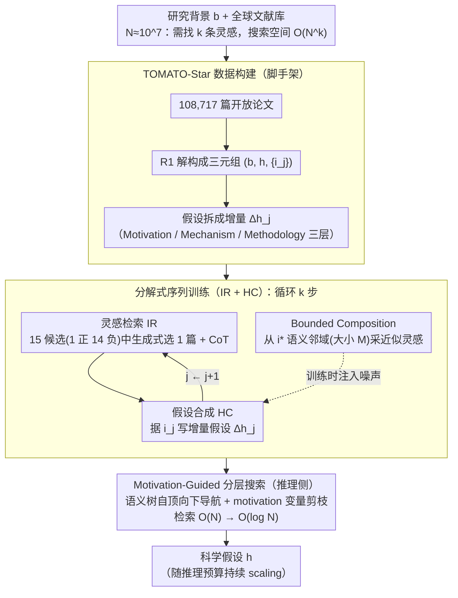

# MOOSE-Star: Unlocking Tractable Training for Scientific Discovery by Breaking the Complexity Barrier

**会议**: ICML 2026  
**arXiv**: [2603.03756](https://arxiv.org/abs/2603.03756)  
**代码**: https://github.com/ZonglinY/MOOSE-Star (有)  
**领域**: LLM 推理 / 科学发现 / 分解训练  
**关键词**: 假设生成、灵感检索、分层搜索、可解可训、TOMATO-Star

## 一句话总结
MOOSE-Star 把"训练一个能直接生成科学假设的 LLM"这个原本要在 $\mathcal{O}(N^k)$ 组合空间里搜索的问题拆成"灵感检索 + 假设合成"两个序列子任务，再叠上层级树检索 + bounded composition + motivation 规划，把最优复杂度从指数级压到 $\mathcal{O}(\log N)$，并放出 108,717 篇带分解标注的 TOMATO-Star 数据集。

## 研究背景与动机
**领域现状**：LLM for scientific discovery 的工作几乎全部聚焦"推理时怎么用 LLM"或者"用外部反馈微调"（比如评审反馈、规则评分、与数据对齐的 reward）。直接对 $P(\text{hypothesis}\mid\text{background})$ 这一最核心的条件分布建模 + 训练几乎是空白。

**现有痛点**：作者在理论上指出——直接训练 $P(h\mid b)$ 隐含"在全球科学文献库 $N\approx 10^7$ 中找到正确的 $k$ 条灵感序列"，搜索空间是 $\mathcal{O}(N^k)$（例如 $N=10^7,k=3$ 时 $\approx 10^{21}$），这种"组合复杂度墙"使端到端训练数学上 ill-posed。

**核心矛盾**：要么放弃直接建模 $P(h\mid b)$（现有 feedback-based 路线），要么硬刚组合复杂度（不可行）。两边都不好走。

**本文目标**：在保留"直接建模 $P(h\mid b)$"的雄心的前提下，把训练复杂度压到现代算力可承担的量级，并提供可重复的数据集与开源代码。

**切入角度**：作者借 MOOSE-Chem 的概率分解定理把 $P(h\mid b)\approx \prod_j P(i_j\mid b,h_{j-1},\mathcal{I})\cdot P(h_j\mid b,h_{j-1},i_j)$ 看成"灵感检索 + 增量合成"序列。这一分解此前只用于推理，本文把它升级为可训练目标。

**核心 idea**：把不可训的 $\mathcal{O}(N^k)$ 问题降到可训的 $\mathcal{O}(k\cdot N)$ 序列子任务，再用分层树搜索 + bounded composition + motivation 规划把检索那一段从 $\mathcal{O}(N)$ 进一步压到 $\mathcal{O}(\log N)$。

## 方法详解

### 整体框架
MOOSE-Star 的目标是直接训练 $P(h\mid b)$——给定研究背景 $b$ 就生成科学假设 $h$，难点在于这隐含着要在 $N\approx10^7$ 篇文献里找出 $k$ 条灵感序列，搜索空间 $\mathcal{O}(N^k)$ 大到没法端到端学。整条 pipeline 就是把这个不可训的问题层层降复杂度：先用 R1 / R1-distill-Qwen 把 108,717 篇 2020–2025 开放论文解构成 $(b,h,\{i_j\})$ 三元组、并把 $h$ 拆成若干增量 $\Delta h_j$（每个写成 Motivation/Mechanism/Methodology 三层），再把 $P(h\mid b)$ 按 chain rule 拆成"灵感检索 (IR) + 假设合成 (HC)"两个可训子任务循环 $k$ 次，最后在推理侧用语义检索树 + motivation 剪枝把检索那一段从线性压到对数级。

### 关键设计

**1. 分解式序列训练（IR + HC）：把指数级的端到端学习换成 $k$ 步线性子任务**

直接学 $P(h\mid b)$ 之所以训不动，是因为它隐式要求在 $\mathcal{O}(N^k)$ 的灵感组合里搜索。本文借 MOOSE-Chem 的概率分解定理把它按 chain rule 拆开：$P(h\mid b)\approx \prod_{j=1}^{k} P(i_j\mid b,h_{j-1},\mathcal{I})\cdot P(h_j\mid b,h_{j-1},i_j)$，于是一个组合问题变成 $k$ 次"先检索一条灵感、再增量合成一步假设"的循环。IR 任务是从 15 个候选论文（1 正 + 14 负的硬负例 pool，输入 title+abstract）里生成式地选出最相关那 1 篇，输出带 CoT 推理；HC 任务是在拿到 ground-truth $i_j$ 后写出增量假设 $\Delta h_j$。两者都用 teacher-based RFT 训练，整体复杂度从 $\mathcal{O}(N^k)$ 落到 $\mathcal{O}(k\cdot(N+1))$。这一步把指数级笛卡尔积换成 $k$ 个线性求和，是把问题搬进可训范畴的关键；同时 IR/HC 各自都是清晰、可监督、可评测的任务，远比对整条 $h$ 打分来得稳。

**2. Bounded Composition：让合成模型容忍检索误差**

就算检索做到对数级，最末一层选出的灵感也未必正好是 ground-truth $i^*$，HC 若只见过完美灵感就会在真实噪声下崩掉。做法是定义一个以 $i^*$ 为中心、大小为 $M$ 的语义容忍邻域 $\mathcal{I}_{i^*}\subset\mathcal{I}$，训练时随机从这个邻域采"近似灵感"喂给 HC，逼它学会用相邻概念也能合成出有效的 $\Delta h_j$。这等价于把检索的精度要求从"$1/N$ 精确匹配"放宽到"$1/(N/M)$ 模糊匹配"，又把 IR 的有效搜索空间压了一档。本质上它把"检索误差"显式建模成训练分布，类似 noise-aware training，让整条 pipeline 在不完美检索下仍然鲁棒。

**3. Motivation-Guided Hierarchical Search：用语义树 + 方向变量把检索从 $\mathcal{O}(N)$ 压到 $\mathcal{O}(\log N)$**

IR 把复杂度降到了线性，但逐篇扫 $N$ 仍嫌慢。这里把全文献按语义聚成一棵检索树，每一步只在当前节点的孩子里选最相关分支，理想情况下检索深度只要 $\mathcal{O}(\log N)$。但"该往哪棵子树走"本身仍是开放问题，所以再给 background 附加一个显式的 motivation 变量 $m$（取自 $\Delta h$ 的 Motivation 层），它充当树的"生成根"动态裁掉与当前目标无关的子树，把可搜空间从 $N$ 缩到 $N_m\ll N$。语义树省的是检索步数，motivation 变量给的是生成性的方向控制信号——两者合起来才让模型在 inference time 真正能随预算 scale。

### 损失函数 / 训练策略
IR 与 HC 都用 Rejection Sampling Fine-Tuning（RFT）+ CoT 监督：每个样本先采 N 条 CoT，按"是否选对/合成质量"用 rubric 评估器筛掉低质，留高质再做 SFT。HC 的 rubric 同时检查 Motivation/Mechanism/Methodology 三层。数据集 TOMATO-Star 用四项自动质检（必要性、充分性、互斥性、非冗余）才入库。

## 实验关键数据

### 主实验

| 维度 | 配置 | 结果亮点 |
|------|------|---------|
| 数据规模 | 108,717 篇开放论文，38,400 GPU·小时 | 训练集 2020-09/2025，测试集 2025-10（时序无泄漏） |
| 复杂度（最坏 → 最好） | $\mathcal{O}(N^k)$ → $\mathcal{O}(\log N)$ | 通过 IR/HC 分解 + 树检索 + motivation 剪枝逐层压缩 |
| Test-time scaling | brute-force vs. MOOSE-Star | brute-force 在多灵感组合任务上很快"撞复杂度墙"；MOOSE-Star 成功率随推理预算持续上升 |
| 推理时的灵感命中 | IR 在 1 正 14 负 pool 中显著优于随机/最近邻 baseline | 表明生成式选择 + CoT 监督有效（细节见 § F） |

### 消融实验

| 配置 | 关键指标 | 说明 |
|------|---------|------|
| 去掉 Bounded Composition（$M=1$） | HC 对检索噪声敏感、综合任务成功率下降 | 验证"检索不准时也能合"的必要性 |
| 去掉 Motivation 变量 | 树检索路径变长、剪枝失效，inference 预算同档下成功率掉点 | motivation 是剪枝有效性的关键 |
| End-to-end 训练 $P(h\mid b)$（baseline） | 训练难以收敛 / 合成 trace 无法 distill | 论文 § 7.1 显示 distillation 直接给 $b\to h$ 的 reasoning trace 不可行 |
| Brute-force test-time sampling | 在多灵感组合任务上撞"复杂度墙" | 反衬 MOOSE-Star 的层级搜索能持续 scaling |

### 关键发现
- 直接训练 $P(h\mid b)$ 之所以失败，根本原因是隐式的组合搜索空间太大，而不是数据少或模型小——这是对"feedback-driven discovery"路线的一次釜底抽薪式批评。
- "把指数问题分解 + 层级 + 容忍 + 剪枝"是一个可迁移的范式：每一步只解决一个复杂度量级的瓶颈，组合起来才能从 $N^k$ 落到 $\log N$。
- TOMATO-Star 的 (b, h, i) + (Motivation, Mechanism, Methodology) 双层结构本身就是 LLM-discovery 数据集设计的一次升级，超越了"摘要式 hypothesis"。
- 时序严格分割（2025-10 之后才入测试集）使评估不被预训练污染——这对越来越大的 LLM 评测体系是一种值得效仿的做法。

## 亮点与洞察
- 第一次把"为什么 P(h|b) 训不动"做成了严肃的复杂度论证（$\mathcal{O}(N^k)$ vs $\mathcal{O}(\log N)$），让"科学发现 LLM"从工程论文升级成了有理论骨架的研究方向。
- 把 inference 期才用的概率分解定理重新解释为 training objective，是 MOOSE-Chem 之后最关键的一跳，思路上与 RL 里把 Bellman 方程拆成 TD-update 类似。
- Bounded Composition 把"检索-合成"两段从"必须完美对齐"放宽到"邻域容忍"，这是一种对真实检索噪声的工程姿态，非常贴近搜索/RAG 实践。
- 开放 108k 篇带结构化分解的数据集 + 全套训练/推理代码 + 模型，把 reproducibility 卷到了"科学发现"这一历史薄弱领域。

## 局限与展望
- 现有体系仍依赖"作者引用 = ground-truth 灵感"这一假设，会偏向作者明示的影响，对真正"未被引用却影响深远"的灵感欠缺敏感性。
- 1 正 14 负的 IR 设置仍是受限近似，真实文献库不止 15 篇候选；当树根选错时，分层搜索本身没有自纠错机制。
- Bounded Composition 的容忍半径 $M$ 是超参，过小退化为精确匹配、过大会让 HC 输出泛化失控；论文没给系统化的 $M$ 选择策略。
- 主要在生物、化学、医学等领域验证，对 ML/CS 这类引用结构更密集、灵感链更短的领域是否同样吃这套分解尚需验证。

## 相关工作与启发
- **vs MOOSE-Chem (Yang et al., 2025b)**: MOOSE-Chem 只在推理时用概率分解，本文把同一分解做成训练目标，是从"推理工具"到"训练范式"的关键升级。
- **vs feedback-driven 训练 (Weng/Behzadifar/Goel et al.)**: 它们靠 reviewer/数据/规则反馈微调 hypothesis，不碰 $P(h\mid b)$ 这一核心分布；本文是首个直接训练这一分布的工作。
- **vs O'Neill et al. (2025)**: 同样尝试直接建模 $P(h\mid b)$ 但走 distillation，被本文 § 7.1 论证为不可行（reasoning trace 难复刻）。

## 评分
- 新颖性: ⭐⭐⭐⭐⭐ 把"科学发现 LLM 训不动"的根因严格论证为组合复杂度，并给出一条把它压成 $\log N$ 的可执行路径，少见的"理论+工程"双新颖度。
- 实验充分度: ⭐⭐⭐⭐ 数据规模和 GPU 投入（38,400 A800 小时）非常足，但对照实验更偏定性，缺统一基准上的硬对比表。
- 写作质量: ⭐⭐⭐⭐ 复杂度推导清晰，模块之间因果链顺畅；"为什么这一步把复杂度从 X 降到 Y"讲得很到位。
- 价值: ⭐⭐⭐⭐⭐ 同时给出框架、数据集（TOMATO-Star 108k）、代码和训练好的模型，是"LLM-for-discovery"方向一份事实上的 baseline。

<!-- RELATED:START -->

## 相关论文

- [\[NeurIPS 2025\] Breaking the Gradient Barrier: Unveiling Large Language Models for Strategic Classification](../../NeurIPS2025/llm_pretraining/breaking_the_gradient_barrier_unveiling_large_language_models_for_strategic_clas.md)
- [\[ICLR 2026\] RECON: Robust symmetry discovery via Explicit Canonical Orientation Normalization](../../ICLR2026/llm_pretraining/recon_robust_symmetry_discovery_via_explicit_canonical_orientation_normalization.md)
- [\[CVPR 2026\] Unlocking Pre-trained Weights: Parameter Inheritance for Zero-Shot Initialization](../../CVPR2026/llm_pretraining/unlocking_pre-trained_weights_parameter_inheritance_for_zero-shot_initialization.md)
- [\[ICML 2025\] On the Clean Generalization and Robust Overfitting in Adversarial Training from Two Theoretical Views: Representation Complexity and Training Dynamics](../../ICML2025/llm_pretraining/on_the_clean_generalization_and_robust_overfitting_in_adversarial_training_from_.md)
- [\[ICML 2026\] Annotations Mitigate Post-Training Mode Collapse](annotations_mitigate_post-training_mode_collapse.md)

<!-- RELATED:END -->
