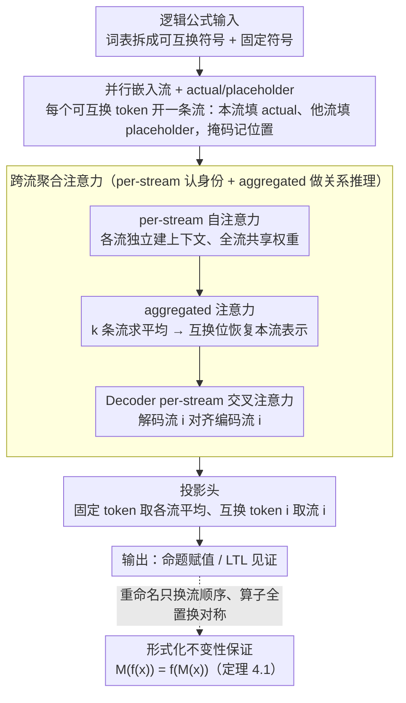

# Names Don't Matter: Symbol-Invariant Transformer for Open-Vocabulary Learning

**会议**: ICML 2026  
**arXiv**: [2601.23169](https://arxiv.org/abs/2601.23169)  
**代码**: https://bu-depend-lab.github.io/Symbol-Invariant-Transformer/ (项目页)  
**领域**: LLM 预训练 / Transformer 架构 / 符号推理 / 开放词表  
**关键词**: 符号不变性、alpha 等价、并行嵌入流、开放词表泛化、LTL

## 一句话总结
作者把 Transformer 改成"对每个可互换符号开一条共享权重的并行嵌入流 + 跨流聚合注意力"的结构，从架构层面保证对变量重命名（alpha 等价）的输出完全不变，并且允许测试期向词表里塞训练时没见过的新符号，在命题逻辑与 LTL 见证生成任务上超过同类基线甚至 GPT-5.2。

## 研究背景与动机
**领域现状**：把符号推理任务（定理证明、数理推理、LTL 综合）丢给 Transformer 已经成了主流路线，理论上 Transformer 也被证明能模拟任意有限自动机。但这些工作都是在**固定词表**上训练 / 测试，把"符号"当成普通离散 token 学一个嵌入。

**现有痛点**：符号系统里有一类特殊 token —— 变量名、原子命题、$\lambda$ 演算里的绑定变量 —— 它们之间是**可互换的**，重命名不应改变语义（$\lambda x.x+1$ 和 $\lambda y.y+1$ 等价）。但用固定嵌入表训练的模型对名字过拟合：LLM 在保持语义的变量重命名扰动下代码任务准确率掉最多 70%；DeepLTL 这类模型一旦测试集出现训练时没见过的 AP 名字就崩。

**核心矛盾**：嵌入表的角色天生冲突 —— 想让模型"区分两个不同符号"就必须给它们不同向量，可一旦向量编码了"身份"，重命名不变性就被破坏，新符号也无法表示。现有缓解办法（如 Işık et al. 2025 用随机向量代替学习嵌入）虽然能做后训练词表扩展，但随机性意味着**不同种子会给 alpha 等价输入不同预测**，没有形式化保证。

**本文目标**：设计一个 Transformer 架构，使得 (i) 对可互换 token 的任何重命名输出都自动等价；(ii) 测试期能接纳训练词表之外的新可互换 token；(iii) 不依赖随机性，invariance 是"by construction"的硬保证。

**切入角度**：既然 alpha 等价本质是"$k$ 个可互换符号之间的置换不变性"，那就把每个可互换符号拆成一条独立的嵌入流，所有流走同一份权重，最后把流之间的信息用置换不变的算子（求和 / 平均）融合 —— 这样**重命名只是把 $k$ 条流换个顺序**，而置换在所有算子下不变，等价性自然成立。

**核心 idea**：用 $k$ 条共享权重的并行嵌入流替代单一嵌入表，每条流"以一个可互换符号为视角"看输入，用置换不变的聚合注意力跨流通信，从而把 alpha 等价从训练目标提升为架构保证。

## 方法详解

### 整体框架
这篇论文要让 Transformer 对变量重命名（alpha 等价）天生不变，同时还能在测试期接纳训练词表里没见过的新符号。做法是把单一嵌入表换成 $k$ 条共享权重的并行嵌入流：词表先拆成可互换部分 $\mathbb{V}_i$（原子命题、变量名）和固定部分 $\mathbb{V}_n$（逻辑算子、关键字），输入里出现几个不同的可互换 token 就开几条流，每条流"以一个可互换 token 为视角"重写同一条序列，流内先做 per-stream 自注意力、再用置换不变的 aggregated 注意力让流之间通信（Decoder 还多一条 per-stream 交叉注意力把解码流对齐到对应编码流），最后投影头从各 token 的专属流读出预测。因为重命名只是把这 $k$ 条流换个顺序，而流内部张量和所有跨流算子都对顺序对称，输出的等价性就被架构本身锁死了。

### 关键设计

**1. 并行嵌入流 + actual/placeholder 双重嵌入：把"区分身份"的责任从嵌入表挪到流索引**

传统嵌入表的根本矛盾在于，向量一旦编码了 token 的"身份"，重命名不变性和开放词表就成了对立目标——想区分两个符号必须给不同向量，可不同向量又破坏了"换名不换义"。本文的破法是不再用向量表身份，而用流索引表身份：处理流 $i$ 时，把序列中真正是 token $i$ 的位置填一个 actual 嵌入，把其他可互换 token 的位置统一填一个共享的 placeholder 嵌入，固定 token 原样保留，同时维护一个二值掩码记录每个位置属于哪个 token。于是 $k$ 条流彼此同形——非互换部分完全一样，互换部分都被消歧成 actual/placeholder——可以塞进同一份 Transformer 权重并行处理。重命名 $f$ 把 token $i$ 换成 $j$，效果仅仅是让原来的"流 $i$"变成"流 $j$"，流内张量分毫不变。由于 self-attention / FFN / LayerNorm 权重全流共享，词表里新冒出来的 token 只需**多开一条流**，没有任何未训练参数，也无需重训。

**2. 跨流聚合注意力（aggregated attention）：让流之间交换信息又不破坏置换不变性**

纯 per-stream 注意力（每条流各做各的 self-attention）只够各自消化"我这个符号在哪出现"，碰到 $p \land q$ 这种需要关联两个命题的关系推理就无能为力，所以必须有一条让流互相看见的通路。聚合注意力的做法是先把 $k$ 条流的隐藏状态求平均得到一个融合视图，再在每个可互换 token 出现的位置用对应流 $i$ 的真实隐藏状态替换回去（恢复"专属表示"），然后在这个融合视图上做 self-attention。关键在于这条路径处处对称：平均天然对置换不变（$\sum_i v_i = \sum_i v_{\pi(i)}$），而按位置恢复用的是"token 对应的那条流"而非"流的绝对编号"，所以即使把流重新排序，聚合结果也完全一样，关系推理因此同样是 alpha 不变的。Encoder 和 Decoder 都采用 per-stream + aggregated 的双注意力组合；Decoder 额外引入跨流交叉注意力，默认走 per-stream 模式（流 $i$ 对齐 encoder 的流 $i$），消融证明这条对齐是流身份能不能认对的命门。

**3. 形式化不变性保证（Theorem 4.1）：把"对重命名不变"从经验现象变成定理**

上一代随机嵌入方法（Işık et al. 2025）的不变性只是统计意义上的——同一对 alpha 等价输入换个随机种子就可能给出不同预测，对形式验证这类场景远远不够。本文要的是 0-1 的硬保证：对任意 alpha 重命名 $f$，模型满足 $M(f(x)) = f(M(x))$，即 $f^{-1}(\hat{y}') = \hat{y}$。证明只需顺着上面两个设计走一遍——重命名把可互换 token $i$ 映到 $j$ 时，原计算里的"流 $i$"恰好就是新计算里的"流 $j$"；per-stream 算子因权重共享、只依赖流内输入而与流编号无关；aggregated 算子用求和/平均加"按 token 提取对应流"的恢复，求和对置换不变、按 token 提取也不看流的绝对编号。两类算子各自对流顺序的置换严格对称，整个网络的对称性也就成立，invariance 是 by construction 而非训出来的。

### 损失函数 / 训练策略
延用 Işık et al. 2025 的 cosine loss（特征和嵌入都归一化、logit 退化成余弦相似度），并用 AdaCos 做自适应缩放，把序列长度当作 batch 维。Encoder 配 RoPE + 树位置编码以匹配逻辑公式的树结构输入，解码用 beam search（$k=3$）。投影头上有一处省算技巧：固定 token 的 logit 取所有流的平均（各视角本就等价），可互换 token $i$ 的 logit 直接取流 $i$，避免跨流求和把专属表示稀释掉。

## 实验关键数据

### 主实验
两个核心任务：**命题逻辑赋值预测**（PropRandom35）和 **LTL 见证生成**（LTLRandom35，DeepLTL benchmark），用 pyaiger / spot 验证预测正确性。评测三类指标：Correct（语义正确率）、Exact（完全匹配 ground truth）、Alpha-Covariance（3/4/5 AP 下的 alpha 等价一致性）。

| 任务 | 训练设置 | 方法 | Correct | Exact | α-cov (5 AP) |
|------|---------|------|---------|-------|--------------|
| 命题逻辑 | Normal | Baseline | 95.62% | 57.94% | 76.02% |
| 命题逻辑 | Normal | Random Emb (Işık 2025) | 93.25% | 56.45% | 92.98% |
| 命题逻辑 | Normal | **Proposed** | **98.03%** | **60.96%** | **100.0%** |
| 命题逻辑 | Reduced (80K) | Baseline | 63.26% | 29.31% | 53.31% |
| 命题逻辑 | Reduced | **Proposed** | **70.43%** | **35.81%** | **100.0%** |
| 命题逻辑 | Pretrained | GPT-5.2 | 99.73% | 25.60% | 1.03% |
| LTL | Normal | Baseline | 98.23% | 83.23% | 91.80% |
| LTL | Normal | **Proposed** | **98.24%** | 79.65% | **100.0%** |
| LTL | Pretrained | GPT-5.2 | 86.83% | 35.93% | 77.56% |

亮点：alpha-covariance 在所有 AP 数下都是 **100%**（验证 Theorem 4.1）；在 LTL 上甚至**超过 GPT-5.2**（98.24% vs 86.83%），而 GPT-5.2 在 5 AP 命题逻辑上的 α-cov 只有 1.03%，说明 LLM 完全无法处理重命名不变性。

### 消融实验（命题逻辑）
两位字母编码：第一字母 E/D/C = 编码器/解码器/交叉注意力；第二字母 P/A = per-stream/aggregated。

| 配置 | Heatmap 准确率 | 说明 |
|------|---------------|------|
| Best (EP-DP-EA-DA-CP) | 95.05% | 推荐默认配置 |
| -CP+CA | 28.51% | **灾难性**：用聚合跨注意力取代 per-stream，decoder 流认不出对应 encoder 流 |
| -DP | 46.55% | 移除 decoder per-stream → 严重掉点（流身份识别失败） |
| -EA-DA | 72.35% | 同时去掉两个聚合注意力 → 关系推理能力丧失 |
| -DA | 84.48% | 去掉 decoder aggregated → 中等程度掉点 |
| -EA | 92.47% | 去掉 encoder aggregated → 小幅掉点（DA 还能间接补偿） |

### 关键发现
- **per-stream cross-attention 是身份对齐的命门**：换成聚合就掉 60+ 个百分点，说明 decoder 必须知道"我现在生成的 token 对应哪条 encoder 流"。
- **任务决定聚合注意力重要性**：命题逻辑里关系推理（implication / xor 等关联多个 AP 的算子）是主要瓶颈，aggregated 注意力贡献大；LTL 主要瓶颈是时序推理而非 AP 关系，去掉 DA 反而略涨。
- **alpha-covariance 跟 baseline 拉开差距**：基线在 5 AP 时降到 76% / 91.8%，本文恒为 100% —— 这是架构保证而非数据/超参带来的。
- **Pareto 改进**：在 Renamed 训练集上，本文比基线在原始数据集上还高（命题逻辑 41.57% → 本文 Renamed 同 setting 也保持高水平），说明这种 inductive bias 不是简单的鲁棒性 trick，而是真的帮模型学到结构。
- **预训练模型可改造**：把基线的两个 token 嵌入当 actual / placeholder，1 epoch fine-tune 后 LTL heatmap 从无法生成到 85.91%，5 epoch 接近从零训的 84.13%。这条改造路径对落地 LLM 很重要。
- **开销可控**：理论复杂度 $O(SL^2)$，$S=10$ 时单样本推理 3.38 ms → 5.13 ms，比 GPT-5.2 的 10–90 秒/样本快 4 个数量级。

## 亮点与洞察
- **把"等价类不变性"做成架构原语**：等价类（这里是 alpha 等价）通常靠数据增广或正则化逼近，本文用"对等价群作用的对称算子"直接做掉。这种"用群作用 = 不变性"的思路完全可以迁移到其他存在对称性的领域（图节点重命名、集合输入、$k$ 元关系编码）。
- **共享权重 + 流索引 = 开放词表**：传统模型扩词表必须改嵌入表+重训，本文加新 token = 多开一条流，零新增参数，零重训。这是处理符号系统"无穷词表"的优雅范式 —— 类似 GNN 用消息传递替代节点 id 嵌入。
- **结构性保证 vs 统计性保证**：上一代用随机嵌入的工作经验上能涨点但没有 0-1 保证，本文示范了"形式化保证 + 经验性能 + 计算可行" 三者兼得。对安全 / 验证 / 形式推理场景，这个 0-1 保证比涨几个点重要得多。
- **per-stream vs aggregated 的功能分工**：消融非常干净地把"流身份识别"（per-stream）和"跨流关系推理"（aggregated）解耦，并发现两者的重要性随任务而变，是一份很有教学价值的设计分析。
- **预训练模型的轻量改造路径**：让"已有大模型 + 少量 fine-tune"即可获得 alpha 不变性，把这条技术从"必须从头训"变成"可以增量改造"，是落地到代码 / 数学 LLM 的关键。

## 局限与展望
- **流数 $S$ 的硬上限**：复杂度 $O(SL^2)$、内存 $O(SLd)$，$S \le 10$ 已验证可用，但程序合成、定理证明里局部变量动辄数百个，直接用会爆。作者建议的 Top-K 流稀疏化必须用"输入对称的"准则（如按位置频率），不能按 token 身份选，否则破坏 invariance。
- **不能生成训练词表外的"新符号"**：流是从 encoder 输入实例化的，模型只能输出输入里出现过的可互换 token。constructive proof / code synthesis 这类要"发明新变量名"的任务暂时不行；作者提议维护一个"未来符号池"留几条预留流。
- **任务相对受限**：实验只在命题逻辑和 LTL 两个 toy-ish 符号任务，虽然 vs GPT-5.2 很有说服力，但要证明这套方法在真实代码 / 数学 / 定理证明上同样优势明显，还需要更大规模的实验和大模型整合。
- **Aggregated attention 的位置依赖任务**：消融显示 DA 在命题逻辑里关键、在 LTL 里有害，意味着架构超参（哪几个 A 开 / 哪几个 P 开）需要任务级 tuning，不算完全 plug-and-play。
- **改进思路**：(i) 设计 alpha 等价友好的流稀疏化（按 token 出现频率 / 位置统计）；(ii) 与 retrieval-augmented 或专家路由结合处理大词表；(iii) 把"流 = 视角"的思想推广到其他对称性，如集合输入、图同构、类型多态。

## 相关工作与启发
- **vs Random Embedding (Işık et al. 2025)**：他们用随机向量给每个互换 token 一个不可学的"身份码"+ 共享可学部分，统计上能扩词表，但同一对 alpha 等价输入不同种子可能输出不同。本文走结构对称路径，把不变性从统计期望提升为 0-1 保证，且 5 AP 命题逻辑准确率 98.03% vs 93.25%，全面超过。
- **vs Renamer (Ankner et al. 2023)**：同样追求对变量重命名的可证不变性，但不考虑词表扩展（仍在固定 vocabulary 内）。本文通过流权重共享同时拿到 invariance + 开放词表。
- **vs 自动推理 GNN（Olsák et al. 2019）**：GNN 路线在 ATP 里也有 invariance 但只能处理图结构，做不了 seq2seq。本文把这套"置换不变性"思想引入到 encoder-decoder Transformer，能处理序列输入输出。
- **vs 集合/置换不变 Transformer（Lee et al. 2019 Set Transformer / Xu et al. 2024）**：通用置换不变方案是把整个序列当集合，丢掉顺序；本文只对"可互换 token 这个子集"做不变性，固定 token 保留顺序，是更精细的 partial-invariance 设计。
- **vs 视觉开放词表（CLIP 等）**：CLIP 的开放词表依赖大规模预训练里类别间的语义关系，对"语义上完全等价、只是名字不同"的可互换 token 不适用 —— 它们之间没有可利用的语义结构。
- **vs LLM (GPT-5.2)**：通用 LLM 在 5 AP 命题逻辑上 α-cov 仅 1.03%，LTL 准确率 86.83%，且单样本 10–90 秒。本文专用模型在 LTL 上 98.24%、毫秒级推理，例证"对结构性任务，inductive bias 比规模重要"。

## 评分
- 新颖性: ⭐⭐⭐⭐⭐ 把 alpha 等价提升为架构对称性，结合开放词表，思路干净且有形式化保证。
- 实验充分度: ⭐⭐⭐⭐ 两个任务足够说明问题（含详尽 ablation + heatmap + GPT-5.2 对比 + 预训练改造），但缺乏在代码 / 数学等大规模符号任务上的验证。
- 写作质量: ⭐⭐⭐⭐⭐ 动机 → 方法 → 定理 → 消融的链路非常清晰，per-stream / aggregated 的概念命名与图示一致，便于复现理解。
- 价值: ⭐⭐⭐⭐⭐ 对形式验证、定理证明、符号推理类应用提供了一种可证安全的架构原语，且能改造现有预训练模型，落地路径明确。

<!-- RELATED:START -->

## 相关论文

- [\[ECCV 2024\] Plan, Posture and Go: Towards Open-Vocabulary Text-to-Motion Generation](../../ECCV2024/llm_pretraining/plan_posture_and_go_towards_open-vocabulary_text-to-motion_generation.md)
- [\[ICML 2026\] If open source is to win, it must go public](if_open_source_is_to_win_it_must_go_public.md)
- [\[NeurIPS 2025\] Learning in Compact Spaces with Approximately Normalized Transformer](../../NeurIPS2025/llm_pretraining/learning_in_compact_spaces_with_approximately_normalized_transformer.md)
- [\[NeurIPS 2025\] Born a Transformer – Always a Transformer? On the Effect of Pretraining on Architectural Abilities](../../NeurIPS2025/llm_pretraining/born_a_transformer_--_always_a_transformer_on_the_effect_of_pretraining_on_archi.md)
- [\[ICML 2026\] Focus and Dilution: The Multi-stage Learning Process of Attention](focus_and_dilution_the_multi-stage_learning_process_of_attention.md)

<!-- RELATED:END -->
