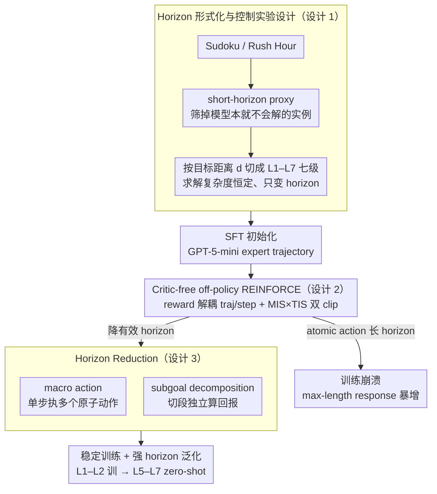

# On Training Large Language Models for Long-Horizon Tasks: An Empirical Study of Horizon Length

**会议**: ICML 2026  
**arXiv**: [2605.02572](https://arxiv.org/abs/2605.02572)  
**代码**: 未公开  
**领域**: LLM Agent / 强化学习 / Long-Horizon  
**关键词**: horizon reduction, REINFORCE, macro action, subgoal, horizon generalization

## 一句话总结
本文用一套精心控制"推理难度恒定、只变 horizon 长度"的 Sudoku/Rush Hour 任务，系统证明**任务 horizon 本身就是 LLM agent RL 训练崩溃的独立根因**，并提出 macro action 与 subgoal decomposition 两种 horizon-reduction 机制——它们不仅稳住训练，还让模型在更长 horizon 上实现强 zero-shot 泛化（horizon generalization）。

## 研究背景与动机

**领域现状**：把 LLM 当 agent 已经成为主流（Claude Code、Codex 等多步代码代理），训练手段集中在 system 层的 context engineering 和 model 层的 SFT/RL（GRPO、DAPO、GSPO 等 critic-free 方法）。

**现有痛点**：当任务需要的交互步数从短（10-20 步）拉到长（30+ 步）时，原本能在短任务上稳定提升的 RL 会突然**灾难性崩溃**——success rate 暴跌、回应长度爆炸到 max-length。社区往往把锅甩给"任务太难"或"reward 太稀疏"，没人去拆"horizon 到底是不是独立的 bottleneck"。

**核心矛盾**：现实任务里 horizon 长度天然与推理复杂度耦合（更难的 Sudoku 既需要更长 trace 也需要更高级技巧），导致没法判断训练失败到底来自"horizon 长"还是"推理难"。

**本文目标**：1) 把 horizon 从其他困难因素中**机械隔离**出来；2) 在 horizon 单变量下定量刻画 RL 训练动态；3) 找到能稳住长 horizon RL 的简单原则。

**切入角度**：作者用一个关键假设——"如果模型有解题能力，把任务塞成单步形态它就应能解"——构造 **short-horizon proxy task**（"一步给出整个 Sudoku 答案"）来筛选实例，再按 atomic-action 数 $d(s_0, g)$ 切成 L1–L7 七个 horizon 级别，保证不同级别的"求解复杂度"相同。

**核心 idea**：horizon 不是 environment 限制而是 task 的内在属性；把有效 horizon $h_\pi(s_0, g)$ 主动降下来（用 macro action 或 subgoal）远比设计复杂 RL 算法更能根治长 horizon 训练崩溃，且自然带来 horizon 泛化。

## 方法详解

### 整体框架
这篇论文走"诊断—干预—验证"的路子：先在控制求解复杂度的前提下，对 Qwen3-1.7B 在 L1–L4 上做 SFT + REINFORCE 风格 RL，观察训练曲线随 horizon 变长怎么崩；再提出两类 horizon reduction 机制——macro action（单步执多个原子动作）和 subgoal decomposition（按子目标切段独立算回报）——把有效 horizon 压回 RL 能稳学的区间；最后在 Rush Hour、WebShop、4B 模型、GRPO 优化器上交叉验证 robustness，并测 L5–L7 上的 zero-shot horizon generalization。

### 关键设计

**1. Horizon 形式化与控制实验设计：把 horizon 从所有其他困难因素里干净拆出来**

社区一直没法判断长 horizon RL 失败到底来自"步数多"还是"题更难"，因为现实任务里两者天然耦合。作者先把 horizon 拆成三个量——目标距离 $d(s_0, g)$（最优策略到达 $g$ 的原子动作数）、交互预算 $H_{\max}$、有效 horizon $h_\pi(s_0, g)$（策略实际花的步数），三者满足 $d \le h_\pi \le H_{\max}$。在此之上构造单变量数据集：Sudoku 用空格数当 $d$ 的代理，并通过 HoDoKu 求解器把所有训练实例钉死在"只需 basic 技巧"上，从而把推理复杂度固定；Rush Hour 用最少移动数 min_moves 当 $d$。再用 short-horizon proxy（让模型一步给整个答案）筛掉"模型本身就不会解"的实例，剩下的实例**只在 horizon 上有差异**，按 $d$ 切成 L1–L7 七级。之所以选 Sudoku，是因为 LLM 对它有大量先验知识，能解短版几乎必然意味着具备求解能力——这套数据集是全文成立的基石，没有它"horizon 是独立 bottleneck"的结论就立不住。

**2. Critic-free off-policy REINFORCE 与 reward decoupling：在长 horizon 下给一个稳定优化器，且让 step penalty 不污染 trajectory 信号**

长 horizon 下 value-based 的方差缩减已被证明衰减，所以作者干脆放弃 PPO 的 critic，回到带 baseline 的 REINFORCE：$A_t = \hat r_t^{\text{traj}} + \alpha \hat r_t^{\text{step}}$，其中 $r^{\text{traj}}_t = \sum_{k=t}^{T-1} \gamma^{k-t} r_k$ 是 trajectory 回报，$r^{\text{step}}_t = r^{\text{format}}_t + r^{\text{valid}}_t$ 单独惩罚 parsing/无效动作，两者各自做 batch 归一化后再以 $\alpha = 0.2$ 加权——这一步 reward decoupling 是关键，否则 step penalty 会把 trajectory 学习信号搅烂。off-policy 阶段再用 MIS（masked importance sampling，基于几何均值比率的 clip）× TIS（truncated IS，基于序列级 ratio 的 clip）联合修正：$w_t = \mathbb{I}(C_{\text{low}}\le \rho_{\text{geo},t}\le C_{\text{high}}) \cdot \min(\rho_{\text{seq},t}, C)$，防止 off-policy 漂移雪上加霜。这套设计直指作者揭示的崩溃机理之一——**negative advantage 的扩散性**：被惩罚的 sample token 会把概率扩散到整个 vocab，长 trajectory 里一两个错误就能污染全部 token，解耦 reward + 双 clip 正是为了挡住这种扩散。

**3. Horizon Reduction：macro action 与 subgoal decomposition，把有效 horizon 物理压回 RL 稳定区**

既然 RL 稳定性主要看 $h_\pi$ 而非 $d$，那就别再卷复杂算法、直接降 $h_\pi$，对应论文最响亮的口号 "The best way to escape from a problem is to solve it."。第一种机制 **macro action** 让策略一次产出多个原子动作（Sudoku 多格填值、Rush Hour `move(id, direction, N)` 多格移动），把 $\pi'$ 定义在宏动作空间上，使 $h_{\pi'}(s_0, g) \le h_\pi(s_0, g)$；作者对比 atomic vs fixed-length（恰好 $k$ 步）vs flexible（$n\le 5$）三种粒度，发现 fixed-length 因 overshooting 反而最差，flexible 让策略自主决定动作长度最优。第二种机制 **subgoal decomposition** 把全局目标 $g$ 拆成可独立验证的子目标序列 $(g_1, \ldots, g_k)$（Sudoku 的子宫格正确率天然适合），按 segment 计算独立的 segment-wise $G_t$，等价于把一个长 sparse-reward MDP 切成多个短 dense-reward MDP。一个关键 ablation 坐实了机理：用 macro-action 训练但**强制每步只执行 1 个原子动作**，照样崩溃——说明 macro action 的真实贡献是降 horizon，而非提升 base policy 的探索能力。

### 损失函数 / 训练策略
基础模型 Qwen3-1.7B（验证用 4B、Llama3 等），先在 GPT-5-mini 生成的 expert trajectory 上做 SFT，再用上述 off-policy REINFORCE 做 4 epoch RL；rollout/inference 温度都用 0.8，pass@K / avg@K 用每实例 4 trajectory 估。

## 实验关键数据

### 主实验

| 设置 | 短 horizon (L1-L2) | 长 horizon (L3-L4) |
|------|--------------------|--------------------|
| Atomic action RL | 稳定提升 | **训练崩溃**，max-length ratio 暴增 |
| Macro action RL | 收敛更快、更高 | **稳定提升**，无崩溃 |
| Subgoal decomposition | — | 在 sparse-reward baseline 完全不学的 L3-L4 上稳定学到强性能 |

### 消融实验

| 配置 | 关键现象 | 说明 |
|------|---------|------|
| Macro-action policy 但限制 1 atomic/turn | 仍然崩溃 | horizon 是真正 bottleneck，policy 表达能力不是 |
| Fixed-length macro ($k$ 步) | 性能不佳，overshooting | rigid 约束有害 |
| Flexible macro ($n\le5$ 或无界) | 最佳 | 策略自主决定动作长度 |
| GRPO-style optimizer | 同样在长 horizon 崩溃，horizon reduction 同样有效 | 结论与优化器无关 |
| WebShop / 4B 模型 | horizon reduction 普遍稳定提升 | 结论跨环境、跨 scale 成立 |

### 关键发现
- **崩溃伴随 max-length response ratio 急剧上升**：作者推测是累积的负 advantage 把策略推向 incoherent 长生成；这是一个干净的崩溃前兆，可用作早停信号。
- **Horizon generalization**：只在 L1-L2 训的 macro-action 模型，在未见过的 L5-L7 长 horizon 上明显优于 atomic baseline，说明 horizon reduction 不只是稳训练，还学到了**跨 horizon 可迁移**的解题模式。
- **Horizon curriculum 有效**：先短后长的训练顺序 (curriculum) 比 short-only / long-only 都好，再次印证"先把 $h_\pi$ 降到 RL 能稳学的区间"才是关键。

## 亮点与洞察
- **horizon 与 reasoning 解耦的数据集设计**是本文最有方法论价值的贡献——这套 short-horizon proxy + 求解器分级的范式可以直接迁移到 web agent、coding agent 的训练评估。
- 把"复杂方法 vs 简单原则"对照得很漂亮：RL 算法社区一直在 PPO/GRPO/DAPO/CISPO 上卷，但作者证明只要降低 effective horizon，最朴素的 REINFORCE 就能稳。
- "negative-advantage 扩散造成 incoherent 生成"是一条对 LLM RL 实践非常重要的 mechanistic insight，可解释很多场景下"训练越久越乱"的现象。
- **horizon generalization 现象** 给出了一个反直觉的上限提示：在短 horizon 上有效训练，可获得 zero-shot 泛化到长 horizon 的能力——这可能让大规模 long-horizon RL 训练变得可肩肩多。

## 局限与展望
- 实验环境主要是 text-based games（Sudoku、Rush Hour、WebShop），**真实开放式 coding/research agent 的 horizon-reduction 效果未直接验证**——macro action 在代码编辑中如何定义本身是 open question。
- 模型规模主要在 1.7B/4B，14B+ 大模型的崩溃边界是否能被 horizon reduction 完全压住缺验证。
- subgoal decomposition 需要"可独立验证的子目标"，对 Sudoku 这种结构化任务自然，但对推理链式任务（数学证明、复杂规划）如何自动找子目标仍未解决。
- 没有讨论 horizon reduction 与 search/planning 类方法（MCTS、tree-of-thought）的关系；理论上两者可以叠加。

## 相关工作与启发
- **vs Shen et al. / Xi et al. / Bai et al. (horizon-based curriculum)**：他们把 horizon 视为环境约束（interaction budget），本文把它视为任务内在属性，分析更深入也更接近"为什么"层面。
- **vs CALM (wang-etal-2025)** 及其他"长 horizon RL = 设计更精巧 algorithm" 的工作：本文走相反路线，用结构化任务修改替代算法堆砌，简单且 robust。
- **vs Park et al. (mapping complexity scaling)**：本文实证了他们关于"状态-动作复杂度非线性增长"的理论预测，并给出实操解药。
- **vs Sinha et al. 的高步准确率分析**：同意 long-horizon 需要指数级步准确率，但提出了"不要提高 step 准确率，而是减少 step 数"的反向思路。

## 评分
- 新颖性: ⭐⭐⭐⭐ horizon 单变量隔离的数据集设计是真正新意。
- 实验充分度: ⭐⭐⭐⭐ 跨环境/模型规模/优化器都验证了 robustness，但缺真实代码 agent 验证。
- 写作质量: ⭐⭐⭐⭐⭐ 论证链条清晰，"诊断-干预-验证"结构极易跟。
- 价值: ⭐⭐⭐⭐⭐ 对训长 horizon LLM agent 的从业者是马上能用的指导。

<!-- RELATED:START -->

## 相关论文

- [\[ACL 2025\] Nemotron-CC: Transforming Common Crawl into a Refined Long-Horizon Pretraining Dataset](../../ACL2025/llm_pretraining/nemotron_cc_pretraining_data.md)
- [\[ICML 2026\] InfoLaw: Information Scaling Laws for Large Language Models with Quality-Weighted Mixture Data and Repetition](infolaw_information_scaling_laws_for_large_language_models_with_quality-weighted.md)
- [\[ICML 2026\] Tuning the Implicit Regularizer of Masked Diffusion Language Models: Enhancing Generalization via Insights from k-Parity](tuning_the_implicit_regularizer_of_masked_diffusion_language_models_enhancing_ge.md)
- [\[ICML 2026\] Predicting Large Model Test Losses with a Noisy Quadratic System](predicting_large_model_test_losses_with_a_noisy_quadratic_system.md)
- [\[ACL 2025\] Towards Effective and Efficient Continual Pre-training of Large Language Models](../../ACL2025/llm_pretraining/towards_effective_and_efficient_continual_pre-training_of_large_language_models.md)

<!-- RELATED:END -->
