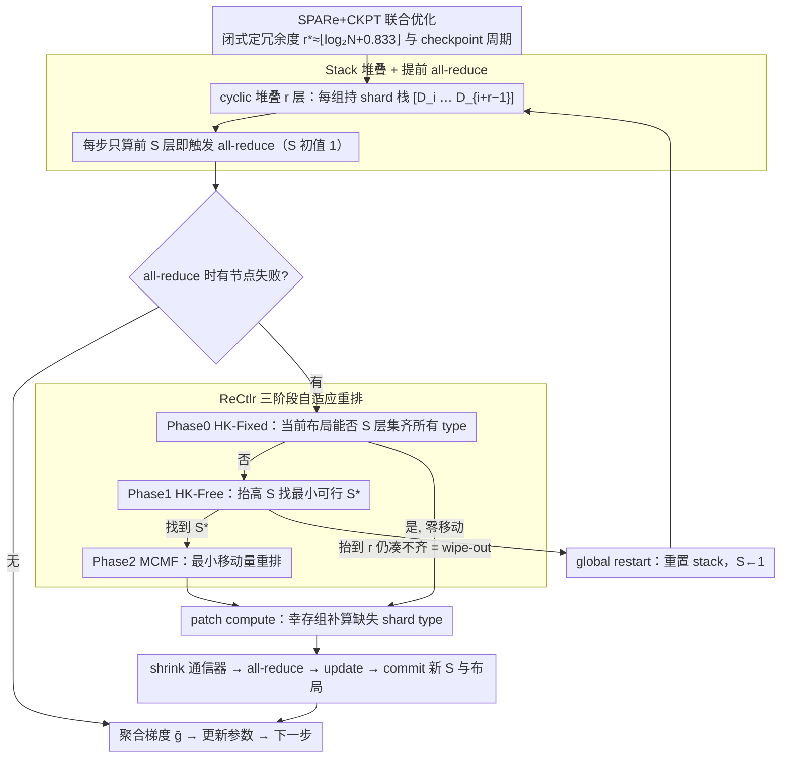

# SPARe: Stacked Parallelism with Adaptive Reordering for Fault-Tolerant LLM Pretraining Systems with 100k+ GPUs

**会议**: ICML2026  
**arXiv**: [2603.00357](https://arxiv.org/abs/2603.00357)  
**代码**: https://github.com/padsysl/SPARe  
**领域**: LLM 预训练 / 容错系统 / 分布式并行  
**关键词**: 故障掩蔽, 数据并行, 冗余计算, 自适应重排, checkpointing

## 一句话总结
SPARe 在数据并行维度把同一份数据 shard 跨组 cyclically 堆叠 $r$ 层，并在节点失败后用 Hopcroft-Karp + min-cost max-flow 自适应重排"all-reduce stack 数"，使得在 600k GPU 的 restart-dominant 场景下，只需 $2\sim 3\times$ 计算开销就能达到与 $r\times$ 传统副本同等的可用性，把 time-to-train 相比 Rep+CKPT 进一步降 $40\sim 50\%$。

## 研究背景与动机

**领域现状**：当前 frontier LLM 预训练集群已迈入 $10^5$ GPU 量级（Llama-3 16k H100、未来 600k H100），主流容错手段有三：checkpointing（GEMINI、Just-in-Time、Universal CKPT）、partial recovery（communicator shrink）、replication（每组冗余 $r$ 份计算）。

**现有痛点**：随集群规模膨胀，MTBF 按 $\mathcal{O}(1/\#\mathrm{GPU})$ 下降，而每次全局 restart 的 NCCL_init / 集合通信代价又按 $\#\mathrm{GPU}$ 线性涨。Llama-3 报告 16k GPU 平均 3 小时一故障；推到 96k 是 30 min、600k 是 5 min，而 600k 上一次 global restart 要 60 min——系统进入 **restart-dominant regime**，downtime 反客为主。Checkpointing 只能减少 rework 浪费，无法削减 restart 次数；传统副本能把可用性顶住，但 $r=20$ 就要付 $20\times$ 计算成本，不可承受。

**核心矛盾**：可用性增益（需要冗余度 $r$ 大）与计算开销（随 $r$ 线性涨）之间的硬 trade-off。

**本文目标**：在数据并行层做一种"冗余但近常数开销"的 failure-masking 方案，独立于模型结构与内层并行拓扑（TP/PP/EP）。

**切入角度**：关键洞察是 **不必把每组的全部计算都做完才能 all-reduce**——只要 $N$ 个 shard 类型都至少有一个 surviving group 算了，gradient 就能聚合。因此把"冗余"放在 shard 级而不是 group 级，并允许"少算几层 stack"提前 all-reduce。

**核心 idea**：把 $N$ 个数据 shard $\{D_0,\dots,D_{N-1}\}$ 按 cyclic rotation 跨 $N$ 个 model-parallel 组堆 $r$ 层（每个 group 拿 $r$ 份不同 shard），训练时只算到能"集齐所有 type"所需的最小 stack 数 $c(k)=\lceil N/(N-k)\rceil$ 即可触发 all-reduce；节点失败后用 HK + MCMF 算法**自适应重排** stack 顺序，使该最小 stack 数仍能达到。

## 方法详解

### 整体框架
SPARe 完全建在 synchronous Data Parallelism 之上：$N$ 个 model-parallel group、每组 $M$ 个 GPU 持一份模型副本，组间形成 $M$ 个 DP 通信器、world size $N$。它不改模型结构也不动内层 TP/PP/EP 拓扑，只重新安排**每个 group 承担哪些 shard**以及**什么时候触发 all-reduce**。布局上是静态的：每组 $g_i$ 按 cyclic rotation 持有一个 shard 栈 $[D_i, D_{i+1}, \dots, D_{i+r-1}]$（下标 mod $N$），这样任意两种 shard 在所有 group 里至多重合一次（独立性条件，见下方 Thm. 4.1）。调度上是动态的：每个训练 step 维护一个 all-reduce stack 数 $S$（初值 1），表示"这一步每组只算到栈里第 $S$ 层就触发 all-reduce"；一旦有节点失败，控制器 ReCtlr 决定是否要重排 shard、是否要抬高 $S$，然后让幸存的 group 补算缺失的 shard type（patch compute），shrink 通信器，all-reduce，更新参数。下图把"配置（闭式定 $r$ 与 checkpoint 周期）→ 静态堆叠 + 提前 all-reduce → 失败时 ReCtlr 三阶段重排 → 补算/更新"这条主链路串起来：

### 关键设计

**1. Stack 堆叠 + 提前 all-reduce：把"冗余"和"必须算完"解耦**

传统副本之所以一份冗余就要付一份完整算力，是因为它强行把"留 $r$ 份冗余"和"$r$ 份都得算完才能聚合"绑死了。SPARe 的关键洞察是：不必每组都算满 $r$ 份，只要 $N$ 种 shard type 每种都至少有一个幸存 group 算过，gradient 就能正常聚合。于是它把每组的 $r$ 份从"全算"改成"排着但只算前 $S$ 份"，开销随之从 $r\times$ 压到约 $S\times$。具体地，在第 $k$ 次失败时剩 $N-k$ 个 group 要覆盖 $N$ 种 type，所需最小 stack 数有下界 $c(k)=\lceil N/(N-k)\rceil$，SPARe 就以此为目标设 $S$，在第 $S$ 层算完立刻 all-reduce——若 ring all-reduce 期间没有新故障 hang 就直接进入参数 update，否则转入 ReCtlr 处理。整个过程对模型层完全透明：重排只是换了"谁来供给 type $i$"，聚合出的梯度仍是 $\bar{\mathbf g}=\frac{1}{N}\sum_i \mathbf g_i$，optimizer state 和 update 一律不变。正因为这层解耦，冗余度 $r$ 可以放得很大，而常态下（$k$ 小）只算前 $S\approx 2$ 层就够，容错的额外开销被压到接近常数。

**2. ReCtlr：HK-Fixed / HK-Free / MCMF 三阶段自适应重排**

失败发生后真正的难点是：当前的 shard 布局还能不能在 $S$ 层内集齐所有 type？如果不能，最小要抬到多少层、又怎么以最少的数据搬运重排过去？ReCtlr 把"$N$ 种 shard type → 幸存 group 的前 $S$ 层"建成一张二部图，分三阶段求解。第一步 **HK-Fixed**（Hopcroft-Karp）在当前固定布局上查是否仍存在完美匹配——存在就零移动直接返回，这一步在 90%+ 的训练步上都能命中，省掉不必要的重排。命不中则进 Phase 1，从当前 $S_0$ 起逐层抬高 $S$ 跑 **HK-Free**（允许组内 stack 任意置换）找最小可行的 $S^\star$；若一路抬到 $r$ 都凑不齐就判定 wipe-out，触发 global restart。Phase 2 再用 **MCMF**（min-cost max-flow）在"幸存 group × stack 槽位"上求一个满足 $S^\star$ 且总移动代价最小的重排方案。在 $N\sim 10^{2\sim 3}$ 的规模上这三种算法都是多项式时间、极轻（建模时设 0.1 s 可忽略）。这套选型很自然：bipartite matching 本就是"shard type ↔ 幸存 group"这类约束的天然语言，HK-Free 负责保证可行性、MCMF 负责压住搬运量，两者合起来让重排本身不会变成新瓶颈。

**3. SPARe+CKPT 联合优化：闭式解出最优冗余度 $r^\star$ 与 checkpoint 周期**

SPARe 不能无限掩蔽失败，必须有 checkpointing 兜底，所以论文把两套 trade-off（冗余 vs 开销、checkpoint 频率 vs rework）一次性解掉，给系统工程师一个可直接查表的配置。它定义归一化 time-to-train $J(r)=\bar S(N,r)/A^\star(\mu(N,r)\, m)$，其中平均计算开销 $\bar S(N,r)\approx \frac{1}{\lfloor\mu\rfloor}\sum_{k=0}^{\lfloor\mu\rfloor-1}(c(k)+\rho_k)$，wipe-out 前平均可掩蔽的失败数 $\mu(N,r)\approx \frac{\Gamma(1/r)}{r}N^{1-1/r}$，$A^\star$ 取 Saxena et al. (2024) 的最大可用性。代入近似 $\mu(N,r^\star)\approx N/2$、$\bar S\approx 2$，便解得最优冗余度

$$r^\star\approx \big\lfloor\log_2 N + 0.833\big\rfloor,$$

而 checkpoint 周期沿用 Young & Daly 风格的闭式 $T_c^\star=T_s+\sqrt{T_s^2+2T_s(T_f+T_r)}$。这意味着工程师不必跑 GPU 实验，给定集群规模 $N$ 就能直接算出该堆几层冗余、隔多久存一次 checkpoint。

### 训练策略
不动 optimizer 与模型结构，只在每步 all-reduce 处插入 ReCtlr：见伪代码 Alg.1（训练主循环）+ Alg.2（ReCtlr 三阶段）。故障检测走 NCCL all-reduce hang/drop 的常规方式；shrink 与 ReCtlr 各计 0.1 s；checkpoint 间隔取上面的 $T_c^\star$。

## 实验关键数据

### 主实验
基于 FedDES (SimGrid) 离散事件仿真，模拟 600k H100 集群、10T 参数模型、$T_r=60$ min、MTBF $m=5$ min（Weibull $k=0.78$）、$T_s=60$ s、10,000 步训练。基线：Rep+CKPT、CKPT-only。

| $N$ | Rep+CKPT 最优 $\text{TTT}/T_0$ | Rep 可用性 | SPARe+CKPT 最优 $\text{TTT}/T_0$ | SPARe $r^\star$ | SPARe 可用性 | TTT 相对提升 |
|------|------|------|------|------|------|------|
| 200 | 6.07 | 61.74% | **2.92** | 9 | 87.00% | **51.9%** |
| 600 | 4.27 | 79.89% | **2.49** | 8 | 93.90% | **41.7%** |
| 1000 | 3.88 | 84.41% | **2.34** | 9 | 96.54% | **39.6%** |

CKPT-only 在该 restart-dominant 设定下几乎走不出几步即被基线碾压，无可比性。

### 消融 / 理论 vs 仿真

| 配置 | 关键指标 | 说明 |
|------|---------|------|
| $\mu(N,r)$ 公式 vs Monte-Carlo | 1.13% 绝对误差 | 平均可掩蔽失败数闭式与 MC 一致 |
| $\bar S(N,r)$ 下界 vs MC | 0.60% 绝对误差 | 平均计算开销下界紧 |
| $\bar S(N,r)$ vs DES 仿真 | ≤4% 绝对误差 | 含 patch compute 的完整估计也准 |
| $r=20$, $N=600$ | $\mu\approx 426$，$\bar S\approx 2.8\times$ | 而 Rep 在同冗余下要 $20\times$ |
| Rep+CKPT 最优 $r$ | $r=3$ | 与 Ferreira et al. (2011) 一致，再涨就被 $r\times$ 拖死 |
| SPARe $r^\star$ 理论 | $\lfloor\log_2 N+0.833\rfloor=8,10,10$ | 仿真 $r^\star=9,8,9$，差异源于 Weibull $k<1$ |

### 关键发现
- **理论闭式都对**：可掩蔽失败数 $\mu$、计算开销 $\bar S$、最优冗余 $r^\star$ 三个公式都和 DES 仿真在 5% 内吻合，论文不是"调参出 SOTA"而是"闭式做工程指导"。
- **高 $r$ 反而比理论更好**：仿真在 $r$ 大时 availability 比 $A^\star(\mu m)$ 还高，因为 active GPU 数随冗余被掩蔽而减少，real-time failure rate 自然降——这是个 self-reinforcing 的 favorable effect。
- **低 $r$（尤其 $r=2$）反而比理论差，甚至输给 Rep**：因为 Weibull $k=0.78<1$ 早期 burstier，$\mu$ 小、过早 wipe-out。修正只需上 dynamic checkpointing（Bougeret 2011 / Benoit 2022），不动 SPARe 本体。
- **gain 随 $N$ 缓慢衰减**：51.9% → 41.7% → 39.6%，因为 Rep+CKPT 在大 $N$ 下 $r=3$ 已经够撑。但绝对 TTT 仍 $\sim 2.3\times T_0$，留有进一步空间。

## 亮点与洞察
- **把"冗余"和"必须算完"解耦**是真正的关键 insight：传统副本之所以贵，是把这两件事强绑；SPARe 通过 cyclic 堆叠 + 提前 all-reduce，让冗余度可以放大到 $r=20$ 而开销只增到 $2.8\times$。这个思路其实在 erasure coding 的 storage 系统里早有先例，但搬到 gradient computation 上并用 HK + MCMF 在线维护是新做法。
- **closed-form 工程指标**：$\mu\approx\Gamma(1/r)N^{1-1/r}/r$、$r^\star\approx\log_2 N+0.833$ 这种"系统工程师能直接拿去配置"的公式，比"我们调出 SOTA"在 HPC 圈更有价值——可以无 GPU 直接查表评估容错策略。
- **完全在 DP 层抽象**：算法 1/2 只操作 shard placement 和 all-reduce stack，不动 TP/PP/EP 内层拓扑，可以叠加在任意模型/任意内层并行之上，与 Bamboo、ReCycle、FT-HSDP 等内层方案正交互补。
- **HK + MCMF 的算法选型很 clever**：bipartite matching 本就是"shard type ↔ surviving group" 这种约束的天然语言，且在 $N\sim 10^3$ 规模上多项式时间足够轻，几乎免费。

## 局限与展望
- **仅做了仿真，没有真机**：虽然 FedDES + SimGrid 在 HPC 圈被广泛接受，但 600k H100 上 NCCL 行为、Weibull 参数、内存压力的真实细节仍可能与模型有偏差。
- **Weibull $k<1$ 在低 $r$ 下输给 Rep**：论文承认这是"提前 burst 故障 + exponential 假设"的水土不服，需要 dynamic CKPT 补救，但还没有给出与 SPARe 联调的实验。
- **shard 物理隔离假设**：闭式独立性近似要求 shard placement 与物理 failure domain（rack / zone）解耦，论文只给"应该这么放"的建议，没在仿真中显式建模 rack-level correlated failure。
- **存储/带宽未建模**：每个 group 持 $r$ 份 shard 的存储/preload 带宽随 $r$ 线性涨，论文未量化这部分的非计算开销（IO / HBM 占用）。
- **可改进方向**：(i) 与 universal checkpointing（Lian 2025）耦合做 elastic-$N$ 训练；(ii) 在 ReCtlr 中引入 cost-aware MCMF，把 reorder 的 IO 写回成本算进 objective；(iii) 把 $r^\star$ 从静态扩到 adaptive 的、随训练 wall-clock 推进而调的方案。

## 相关工作与启发
- **vs Rep+CKPT (Ferreira 2011 / Benoit 2019)**：同样靠冗余掩蔽失败，但 SPARe 把"计算冗余"换成"数据 shard 冗余 + 自适应停早"，开销从 $r\times$ 降到 $2\sim 3\times$；最优 $r$ 也从 $\approx 3$ 拉高到 $\log_2 N+0.833$。
- **vs Bamboo / ReCycle / FT-HSDP**：那些方法在 pipeline / hybrid 内层做"被动 reroute"，SPARe 在数据并行外层做"主动冗余"，可层叠互补。
- **vs GEMINI / DataStates-LLM / Universal CKPT**：那些方法降单次 rollback 的代价，SPARe 直接减少 rollback 次数；论文明确说自己与 storage-assisted CKPT 正交。
- **vs TrainMover (hot spare migration)**：TrainMover 在失败时迁移、SPARe 不替换失败 group 而是让 survivor 算预堆 shard，部署更简单（不需 standby pool）。
- **理论根上**：$\mu(N,r)$ 与 Ferreira (2011) 一致；$T_c^\star$ 沿用 Saxena (2024) availability-optimal；HK (Hopcroft-Karp 1973) 与 MCMF (Goldberg-Tarjan 1990) 是教科书算法，组合起来恰好覆盖问题约束。

## 评分
- 新颖性: ⭐⭐⭐⭐ "提前 all-reduce + adaptive reorder" 这个角度很新，在 fault tolerance for LLM training 这条线上是有辨识度的设计。
- 实验充分度: ⭐⭐⭐ 全仿真、无真机；但仿真器（FedDES + SimGrid）扎实，三种 $N$、三条 trail，理论与实验闭环对得上。
- 写作质量: ⭐⭐⭐⭐ 闭式 + 伪代码 + 图示三位一体，公式推导清晰，故事线（restart-dominant → 三种现有方案不够 → SPARe）一气呵成。
- 价值: ⭐⭐⭐⭐ 600k GPU 集群的 fault tolerance 是个真问题，闭式公式 + 开源代码（github.com/padsysl/SPARe）对系统工程师即用即查；但全仿真无真机略显单薄，需后续真机验证。

<!-- RELATED:START -->

## 相关论文

- [\[ACL 2026\] SAGE: Sign-Adaptive Gradient for Memory-Efficient LLM Optimization](../../ACL2026/llm_pretraining/sage_sign-adaptive_gradient_for_memory-efficient_llm_optimization.md)
- [\[ICML 2026\] FlexRank: Nested Low-Rank Knowledge Decomposition for Adaptive Model Deployment](flexrank_nested_low-rank_knowledge_decomposition_for_adaptive_model_deployment.md)
- [\[NeurIPS 2025\] Breaking the Frozen Subspace: Importance Sampling for Low-Rank Optimization in LLM Pretraining](../../NeurIPS2025/llm_pretraining/breaking_the_frozen_subspace_importance_sampling_for_low-rank_optimization_in_ll.md)
- [\[NeurIPS 2025\] An Empirical Investigation of Neural ODEs and Symbolic Regression for Dynamical Systems](../../NeurIPS2025/llm_pretraining/an_empirical_investigation_of_neural_odes_and_symbolic_regression_for_dynamical_.md)
- [\[ICML 2026\] Data Difficulty and the Generalization--Extrapolation Tradeoff in LLM Fine-Tuning](data_difficulty_and_the_generalization--extrapolation_tradeoff_in_llm_fine-tunin.md)

<!-- RELATED:END -->
