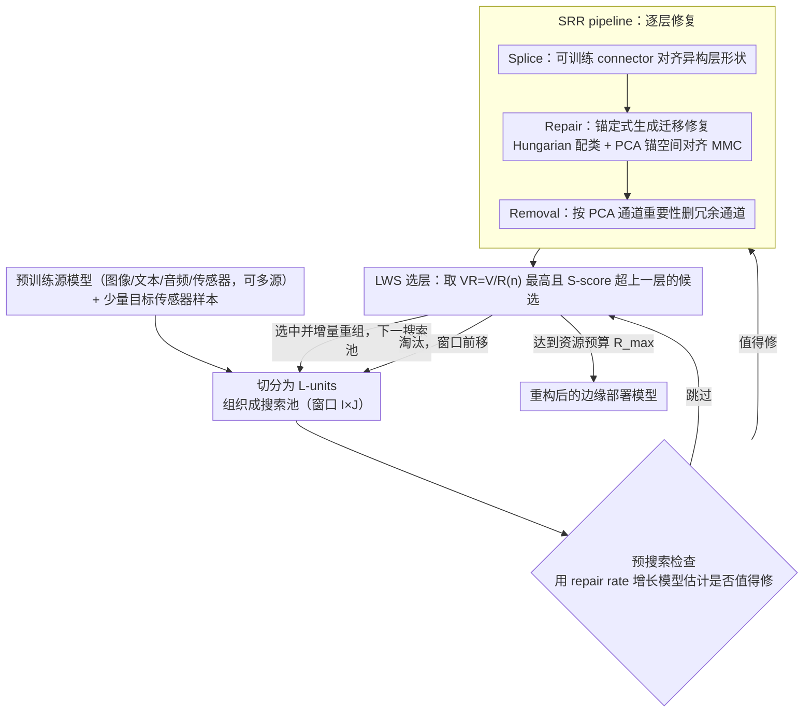

# XTransfer: Modality-Agnostic Few-Shot Model Transfer for Human Sensing at the Edge

**会议**: ICML2026  
**arXiv**: [2506.22726](https://arxiv.org/abs/2506.22726)  
**代码**: https://github.com/zhangy10/XTransfer  
**领域**: 人体理解 / 人体感知 / 边缘智能  
**关键词**: human sensing, few-shot transfer, cross-modality, edge deployment, layer recombining  

## 一句话总结
XTransfer 面向边缘设备上的人体感知任务，用少量目标传感器数据把来自图像、文本、音频或传感器等任意模态的预训练模型迁移过来，通过 layer-wise model repairing 和 resource-constrained layer recombining 缓解跨模态特征错位，同时提升少样本精度与边缘部署效率。

## 研究背景与动机
**领域现状**：人体感知任务包括活动识别、手势、情绪、生命体征和毫米波/超声等传感器应用。深度学习能显著提升识别效果，但边缘设备上的训练和部署受数据、算力、隐私和采集成本限制。Few-shot learning、transfer learning 和 cross-domain FSL 试图用少量数据适配已有模型。

**现有痛点**：人体感知数据和图像/文本不同，常有低信噪比、个体差异、场景变化、硬件差异和隐私限制。很多 FSL 方法仍要求同模态大规模 source dataset 或 target-modality foundation model；多模态/跨模态学习又常依赖 paired data、共享语义空间或大规模无标签数据。对于新传感器任务，这些条件往往不成立。

**核心矛盾**：公开预训练模型很多，但源模态和目标传感器模态之间存在严重 modality shift。直接 fine-tune 容易过拟合，直接 pruning/structuring 又会在少样本跨模态下损伤精度。本文要解决的是“如何复用任意来源的预训练模型，同时只用 few-shot sensor data，并满足边缘资源约束”。

**本文目标**：XTransfer 希望做到 modality-agnostic model transfer：不依赖配对数据、不要求共享语义空间、不从头训练 target 模型，而是在 layer-wise latent feature distribution 层面对源模型进行修复，再重组有用层形成适合边缘部署的模型。

**切入角度**：作者发现 modality shift 对每一层的影响不均匀，某些层的 Mean Magnitude of Channels (MMC) shift 会破坏 layer-wise accuracy convergence。也就是说，问题不是“整个模型都不可用”，而是某些中间表示和目标传感器分布错位，需要逐层诊断、修复和选择。

**核心 idea**：把跨模态迁移拆成两步：先用 SRR pipeline 在 anchor PCA space 中修复每层特征分布，再用 LWS control 在多个 source model 的候选层中选择并重组最有价值、资源成本合适的层。

## 方法详解
XTransfer 的整体流程包括 model repairing 和 layer recombining。前者解决“目标传感器输入进入源模型后，哪一层表示错位、如何对齐”的问题；后者解决“修复后的层不是都值得保留，如何在精度和边缘资源之间选层”的问题。

### 整体框架
XTransfer 把“任意模态预训练模型 → 少样本传感器任务”的迁移拆成两大组件：**模型修复（model repairing，由 SRR pipeline 实现）** 解决“目标传感器输入进入源模型后，哪一层表示错位、如何对齐”；**层重组（layer recombining，由 LWS control 实现）** 解决“修复后的层不是都值得保留，如何在精度与边缘资源之间选层、重构模型”。

给定一个或多个预训练源模型，XTransfer 先把每个模型切分成 **L-units**（可独立搜索的单层，或像 ResNet 残差块那样不可拆开的层块），再把来自不同源、不同深度的候选层组织成 **搜索池**（窗口大小 $I\times J$ = 源模型数 × 层深）。LWS control 逐池推进：先用 **pre-search check** 估计某候选层值不值得修复（避免对每个候选都跑一遍 SRR），值得修的层交给 **SRR pipeline** 做逐层修复——少量带标签的传感器样本经一个可训练 connector 被 splice 到层前后对齐形状，再在 PCA 锚空间里把目标 MMC 分布对齐到源 anchor，最后删掉冗余通道。修复完的层由 LWS 按“精度 / 资源”比值打分，分值最高且 S-score 超过上一选中层的才选作 layer of interest 增量重组进输出模型，否则淘汰、窗口前移；如此逐池搜索直到达到设备资源预算，得到一个重构后、适合边缘部署的模型。

### 关键设计

**1. SRR pipeline：拼接—修复—删除的逐层修复流程**

跨模态迁移时，源模型每一层的表示都和目标传感器分布存在错位，直接 fine-tune 整个模型在少样本下会过拟合、直接固定 reshape 又会丢传感器特征。SRR 把修复约束在“层级 + 轻量 connector”上分三步走：**Splice** 用一个可训练的紧凑 connector（Pre-header 自适应卷积 + Resizer + 一对 encoder-decoder）插在异构层之间强制形状兼容，替代不可训练、会丢特征的固定上/下采样；**Repair** 是整条流程的核心，用生成式迁移把目标特征对齐到冻结源层的 anchor 分布（机制见下一点）；**Removal** 在修复之后，用 PCA 通道重要性（而非 MMC shift 下不可靠的 L2 范数）删掉冗余通道，在尽量保住 S-score 的前提下进一步压缩。之所以有效，是因为可训练量被收缩到 connector 与低维锚空间，极少目标样本也能稳定对齐；且修复是 target-specific 的，每个目标模态单独初始化并修复自己的 connector。

**2. 锚定式生成迁移修复（Repair 的核心机制）**

跨模态既没有共享语义空间、也没有 paired data，常规对齐手段失效。本文的做法是：先在源模型里挑出 S-score 最高的类作 **anchor 类**，用 **Hungarian 算法** 把源类与目标传感类做一对一配对（最小化配对后质心距离之和），得到配对集 $\mathcal{P}_{ST}$；再设计一个 **生成式迁移模块**——生成器就是 connector，判别器在每个冻结源层及其 anchor PCA 空间上工作（冻结保证锚点稳定、防过拟合）。优化目标是 **anchor-based repair loss**：正项拉近每一对（源类, 目标类）在 PCA 锚空间投影后的 MMC 质心，负项用 margin 把不同目标类的样本推开（由 ReLU 触发，距离小于 $M_{max}$ 才施罚）。选 MMC 作对齐信号是因为它是只依赖层输出的 activation-based 统计量，天然 modality-agnostic，比高维激活分布更稳定，恰好适配 few-shot 传感设定。

**3. LWS control：资源感知的逐层搜索与重组**

多源候选层的搜索空间巨大，边缘设备又有 FLOPs / 显存约束，而且修复后并非每层都有用。受 NAS 启发，LWS 把搜索空间定义为所有源模型的层、组织成窗口 $I\times J$ 的搜索池，并定义四种动作：init（选起始层，默认深度 1）、continue / skip（同模型内重组）、cross（跨模型重组）。它用基于 S-score 的层价值函数 $V$ 衡量某修复层的判别力与相邻层收敛度，再除以资源系数得到 **资源约束价值** $VR_{ij}=V_{ij}/R(n)_{ij}$（$R(n)$ 融合该层实际 FLOPs/显存与一个随重组深度 $n$ 递增的资源系数 $\mathrm{RC}(n)$，鼓励早期层多用、后期层慎用）；每池取 $VR$ 最大且 S-score 超过上一选中层的候选作为 layer of interest，否则丢弃、窗口前移，约束是累计资源 $\le$ 设备预算 $R_{max}$。两个加速/稳定机制让搜索可行：**pre-search check** 用 repair rate 增长模型 $rate_n=\exp(an)+b$（非线性回归拟合）估计某层修复后能达到的 S-score，从而跳过不值得修的层、省去对每个候选都跑一遍 SRR；**dynamic search range** 按估计误差放大或缩小搜索范围，避免只盯 top-1 而过早剪枝错过好层。它把“修复有用”真正变成“可部署有用”——同时优化 accuracy 与 accuracy-to-resource 比，是 XTransfer 边缘落地的关键。

### 损失函数 / 训练策略
核心训练目标是 SRR 的 anchor-based repair loss。它对每个 source-target class pair 最小化 projected MMC centroids 的距离，并对不同 target classes 加入 margin-based negative loss。LWS 阶段的目标不是传统梯度损失，而是按 $VR_{ij}=V_{ij}/R(n)_{ij}$ 选择候选层，其中 $V_{ij}$ 是 S-score，$R(n)_{ij}$ 融合 FLOPs、参数量和当前重组层位置的资源系数。整体训练只使用 few-shot target labeled data，无需额外 unlabeled 或 paired cross-modal data。

## 实验关键数据

### 主实验
实验覆盖 image/text/audio/sensing source datasets 和 HHAR、WESAD、Gesture、Writing、Emotion、ChestX 等目标任务。评价包括 accuracy 和 ATR，其中 ATR = Accuracy / normalized resource cost。下表摘取 Table 4 中几个代表性 5-shot accuracy。

| 目标任务 5-shot | ProtoNet | DAPN | MAML | SemiCMT | MetaSense oracle | Our-Single | Our-Multi |
|-----------------|----------|------|------|---------|------------------|------------|-----------|
| HHAR | 45.7 | 51.2 | 42.3 | 38.9 | 69.0 | 71.8 | 74.3 |
| WESAD | 49.3 | 61.2 | 57.9 | 40.0 | 64.0 | 78.4 | 77.8 |
| Gesture | 55.8 | 49.4 | 41.3 | 34.4 | 73.4 | 69.6 | 73.1 |
| Writing | 78.7 | 78.6 | 39.7 | 38.6 | 83.3 | 87.0 | 86.1 |
| Emotion | 49.2 | 50.0 | 26.9 | 33.6 | 56.3 | 55.6 | 55.1 |
| ChestX | 23.4 | 24.4 | 20.4 | 25.6 | 28.1 | 28.6 | 30.0 |

### 消融实验
论文将 SRR、channel removal、LWS 和 efficient search 分开分析。下表整理关键 ablation 与效率结果。

| 分析项 | 设置 | 结果 | 结论 |
|--------|------|------|------|
| Repair loss | HHAR + ResNet18, 5-shot, MMC channels 64-512 | Repair loss 平均 S-score 约 0.20，N-Pair 约 0.05，Triplet 约 0.07 | Anchor-based repair 更能恢复层级判别性 |
| Efficient search | Multi-Pre vs Multi-Efficient | Multi-Pre 搜索最快但准确率平均低 3.36%/7.94%；Multi-Efficient 在 5/10-shot 下搜索时间比 Multi 降低 2.1x-4x | 只 top-1 pre-search 不稳，dynamic range 更平衡 |
| Source modality | Image/Text/Audio/Sensing sources on HHAR | 3-10-shot 平均 accuracy: Image 70.5%，Text 69.6%，Audio 64.3%，Sensing 67.0% | source 质量与语义相关性影响很大，image 默认更稳 |
| SRR only | SRR vs SRR-w/o-Removal | SRR 多数目标上优于 w/o Removal，但 HHAR/Writing 略不稳定 | channel removal 有帮助，但最好和 LWS 联动 |
| ATR | Our variants vs baselines | Our-Single/Our-Multi 的 ATR 分别比单源和多源 baseline 平均高 1.6-29x、16.6-98x | LWS 对边缘效率贡献显著 |

### 关键发现
- SRR 单独就能在 HHAR、WESAD、Gesture 等任务上提高平均 accuracy，说明 layer-wise MMC repair 确实缓解了 modality shift。
- LWS 是把“修复有用”变成“可部署有用”的关键。没有 LWS 时 connector 虽轻量但仍引入资源成本，ATR 可能不如 baseline；加入 LWS 后 accuracy 和 ATR 同时提升。
- 多源模型并不只是堆更多参数。动态搜索让 Multi-Efficient 在搜索空间扩大 5 倍时只增加约 2.1 倍搜索时间，并带来更稳定结果。
- 源模型选择仍很重要。Image source 在 3-10 shot 平均最强，但在 2-3 shot 极低样本下 Text/Sensing source 有时更稳，说明“最好的源”依赖 target 数据覆盖程度。

## 亮点与洞察
- 论文把跨模态迁移失败定位到 layer-wise latent distribution misalignment，而不是笼统说 domain gap。这使 repair、search 和 pruning/selection 都有了可操作的层级指标。
- MMC + PCA anchor space 是很实用的设计：它不需要语义对齐或 paired data，又比高维 activation distribution 更稳定，适合 few-shot sensor setting。
- LWS 同时做模型迁移和结构搜索，这点很贴合边缘场景。许多迁移方法只追 accuracy，XTransfer 明确把 FLOPs/Params 放进选择目标。

## 局限与展望
- 方法依赖可用且合适的 source models。作者也指出，如何为具体 target sensing task 自动选择最优 source model 仍是重要未来方向。
- 论文主要用 S-score/MMC 作为 layer value 的代理指标，它和最终任务 accuracy 相关但不完全等价；在更复杂任务或回归型生命体征估计中可能需要改造。
- SRR 和 LWS 的流程较复杂，包含 connector、PCA、Hungarian pairing、adversarial/generative repair、search range 调整等多个组件，真实部署时调参和工程维护成本不低。
- 实验覆盖多种人体感知任务，但主要仍是分类和 few-shot setting；连续估计、多用户长期漂移、在线更新和隐私保护训练还需要进一步验证。

## 相关工作与启发
- **vs FSL / cross-domain FSL**: ProtoNet、MAML、DAPN 等方法通常仍在同模态或相近域中工作，XTransfer 更强调任意 source modality 到 sensor modality 的 few-shot transfer。
- **vs multimodal / cross-modal learning**: CLIP-style 或 image-to-sensor distillation 常要求 shared semantic space、paired data 或大规模无标签数据；XTransfer 用 activation statistics 和 few labels 避开这些条件。
- **vs pruning / NAS for edge**: 传统 pruning/NAS 假设目标数据充足或 modality shift 小，XTransfer 先 repair 再 recombine，避免直接压缩一个已经负迁移的模型。
- **启发**: 对边缘人体感知应用，迁移源不一定非得是同类传感器模型；如果能逐层诊断并修复 latent distribution，图像/文本/音频模型也可能成为低成本 source。

## 评分
- 新颖性: ⭐⭐⭐⭐☆ 将 layer-wise repair 与 edge-aware recombining 结合用于 modality-agnostic human sensing transfer，方向很有特色。
- 实验充分度: ⭐⭐⭐⭐⭐ 数据集、source modality、baseline、accuracy、ATR 和消融都比较完整，还包含真实采集的私有人体感知数据。
- 写作质量: ⭐⭐⭐⭐☆ 系统组件较多但动机清楚，实验表格信息密集；如果算法伪代码更集中会更易读。
- 价值: ⭐⭐⭐⭐⭐ 对边缘人体感知落地价值很高，尤其适合数据采集贵、部署资源紧、但可复用公开预训练模型的场景。

<!-- RELATED:START -->

## 相关论文

- [\[ECCV 2024\] Learning to Obstruct Few-Shot Image Classification over Restricted Classes](../../ECCV2024/llm_pretraining/learning_to_obstruct_few-shot_image_classification_over_restricted_classes.md)
- [\[ICML 2025\] Revisiting Continuity of Image Tokens for Cross-Domain Few-Shot Learning](../../ICML2025/llm_pretraining/revisiting_continuity_of_image_tokens_for_cross-domain_few-shot_learning.md)
- [\[ICML 2026\] Dropout Universality: Scaling Laws and Optimal Scheduling at the Edge-of-Chaos](dropout_universality_scaling_laws_and_optimal_scheduling_at_the_edge-of-chaos.md)
- [\[CVPR 2026\] Linking Modality Isolation in Heterogeneous Collaborative Perception](../../CVPR2026/llm_pretraining/linking_modality_isolation_in_heterogeneous_collaborative_perception.md)
- [\[ACL 2025\] Data Whisperer: Efficient Data Selection for Task-Specific LLM Fine-Tuning via Few-Shot In-Context Learning](../../ACL2025/llm_pretraining/data_whisperer_data_selection.md)

<!-- RELATED:END -->
