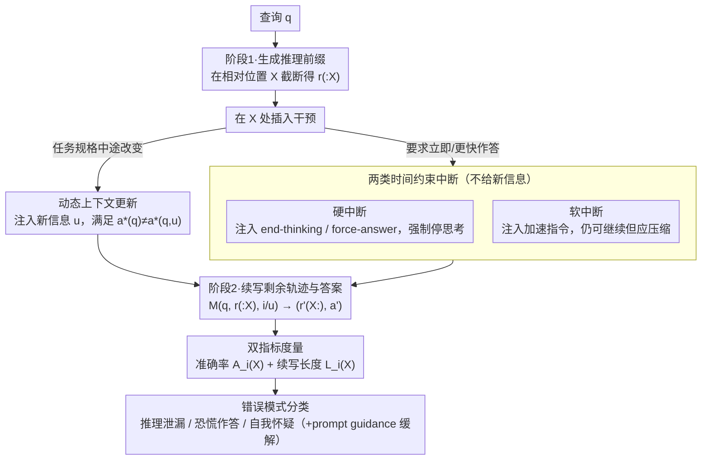

# Are Large Reasoning Models Interruptible?

**会议**: ICML 2026  
**arXiv**: [2510.11713](https://arxiv.org/abs/2510.11713)  
**代码**: 作者公开代码与数据，见论文项目页  
**领域**: LLM推理  
**关键词**: 可中断推理, 动态上下文, 长推理模型, 推理鲁棒性, 评测基准  

## 一句话总结
这篇论文把大推理模型从静态题目评测拉到会被用户打断、会收到中途更新的动态环境中，构建数学与编程评测协议，并发现强模型会出现推理泄漏、恐慌作答和自我怀疑三类稳定失效模式。

## 研究背景与动机
**领域现状**：大推理模型通常先生成较长的显式推理轨迹，再给出最终答案。现有数学和代码评测大多默认题目、上下文和用户目标在生成期间保持不变，模型只需要在一次完整生成结束后交出答案。

**现有痛点**：真实交互并不总是这么安静。用户可能想立刻拿到部分答案，可能发现原请求有问题并插入新条件，也可能在多人或多智能体协作的代码库中改变环境状态。如果每次变化都只能终止生成、手动改上下文、从头再跑，既浪费计算，也丢掉已经形成的中间推理。

**核心矛盾**：长推理提升了静态准确率，却也让模型暴露在更长的交互时间窗口里。评测只看完整轨迹后的答案，会掩盖一个关键能力：模型能否在推理尚未完成时稳健地停止、压缩、改向或吸收新信息。

**本文目标**：作者希望回答三个问题。第一，模型被硬性中断时是否具有类似 anytime algorithm 的性质，即推理越多答案越好。第二，模型收到加速指令时能否在减少推理长度的同时保持正确性。第三，模型收到中途更新时，是否能识别更新并把它纳入后续推理。

**切入角度**：论文不提出新的训练算法，而是先把“可中断性”定义成一个独立评测对象。它把中断点放在模型已有推理轨迹内部，用相同题目比较无中断、硬中断、软中断和动态更新下的准确率与输出长度。

**核心 idea**：用可控的中途干预协议替代静态一次性评测，直接测量长推理模型在时间约束和上下文变化下的稳定性。

## 方法详解
本文的方法本质上是一个评测框架：先让模型在标准题目上生成完整推理轨迹，再在轨迹的不同比例位置插入中断或更新，观察模型后续生成的答案、长度和错误类型。它关心的不是“怎样让模型少想一点”，而是“当世界已经变了，模型能不能正确地继续工作”。

### 整体框架
给定查询 $q$，静态评测中模型 $M$ 输出推理轨迹 $r=(r_1, r_2, \dots, r_T)$ 和最终答案 $a$。动态评测把生成拆成两段：第一段只生成到比例位置 $X$，得到前缀 $r_{:X}$；第二段在输入中加入干预标记 $i$ 或更新 $u$，再让模型生成剩余轨迹 $r'_{X:}$ 与答案 $a'$。

评测指标有两类。准确率记作 $A_i(X)=Pr[a'=a^* \mid X,i]$，衡量中断条件下最终答案是否正确；长度记作 $L_i(X)=|r'_{X:}\oplus a'|$，作为中断后新增计算量的代理。这样，论文不仅能看到答案对不对，也能看到模型是否把本应停止的推理偷偷挪到答案区。

实验覆盖数学和编程两类长推理任务。数学包括 GSM8K 的 500 题子集、MATH-500、AIME-24/25；编程使用 LiveCodeBench-v6，并过滤到 2024 年 10 月 1 日之后发布的问题。主要模型包括 Qwen3-8B、GPT-OSS-20B high reasoning effort 和 Magistral-Small-1.2，附录还扩展到 GPT-OSS-120B、DeepSeek-R1、Nemotron-3-Nano 以及 GPT-5.4-Mini 的近似实验。

中断位置采用相对推理长度 $X\in\{0.1,0.3,\dots,0.9\}$，因为不同模型和题目的推理 token 数差异很大。作者也在附录里用句子级中断和绝对 token 中断做稳健性检查，结论趋势保持一致。

### 关键设计
**1. 两类时间约束中断：不改题目，只逼模型“现在就答 / 答快点”**

这一支对应框架图里 X 处的「时间约束」分支，针对“用户等不及完整推理”这个痛点。在相对位置 $X$ 截断后，硬中断注入 `end-thinking` 或 `force-answer`（后者再追加 `\boxed{` 这类格式符 $\delta$），令剩余轨迹 $r'_{X:}=\varnothing$、模型直接进入答案区；软中断只注入一句“Please answer faster”，模型仍可继续思考，但被期望主动压缩后续长度。这样分是为了把两种能力拆开测：硬中断检验“截到一半的推理是否已经撑得起一个可用答案”，即准确率 $A_i(X)$ 是否随 $X$ 增大而近似单调上升（anytime 性质）；软中断检验模型能否在收到加速信号时调节推理预算，而不是在压力下直接弃题。

**2. 动态上下文更新协议：中途塞进“非答不可”的新信息，看模型能否改向**

对应框架图里的「更新」分支，针对协作或多轮场景中题目本身会变的痛点。注入更新 $u$ 时刻意构造成 $a^*(q)\neq a^*(q,u)$——即不吸收 $u$ 就必然答错，从而把“模型是否真正用上了更新”和“它是否靠记忆旧题答案蒙对”干净地区分开。具体构造上，数学任务先改写题目初始条件、再用中途更新把语义改回原题；编程任务先只给文字描述、再在中途补 starter code、变量范围、额外约束或样例。所有更新由 GPT-5 生成并经作者人工核验，确保 $u$ 确为正确解题所必需。它的意义在于：真能在动态环境里可靠工作的模型，不应沿旧轨迹惯性推下去，而要察觉目标已变、并在后续推理里显式吸收新信息。

**3. 错误模式分类与轻量缓解：把准确率下降拆成可解释、可对症的三种病理**

对应框架图末端的归类环节，针对“只报告曲线变差无法指导改进”的痛点。作者按中断后的行为归出三类稳定失效：推理泄漏（硬中断后模型把思考偷偷搬进答案区，答案最长膨胀到完整版的 10×）、恐慌作答（收到加速指令后用不到 1% 剩余预算就关掉思考、直接给错答案）、自我怀疑（收到更新后反复质疑其可靠性，最终仍沿用旧题或给出混乱答案）。针对自我怀疑，论文给出一个免训练基线：在更新后追加一句模型口吻的 prompt guidance，声明更新已由用户核验。这样切分的价值在于三类病理各自指向一个不同的能力缺口——停止控制、预算调节、上下文信任，后续工作可以逐类对症优化。

### 损失函数 / 训练策略
本文不是训练方法，没有新的损失函数。所有实验都是推理时评测，主要变量是中断类型、中断位置、更新形式、prompt guidance 是否加入、模型族与模型规模。AIME-24/25 因样本小且方差高，每题运行 16 次独立试验，其余数据集运行一次，并报告均值与 bootstrap 95% 置信区间。

## 实验关键数据

### 主实验
论文的主结论不是某个单点 SOTA，而是静态表现高的模型在动态条件下会系统性变差。硬中断下，模型大体呈现 anytime 行为：越晚中断通常越准；但早期硬中断会带来明显推理泄漏。软中断在简单任务上还能保持准确率，在 AIME 和 LiveCodeBench 这类难题上会触发恐慌作答。动态更新最脆弱，尤其更新发生在推理后期时，性能最多下降约 60%。

| 场景 | 主要评测对象 | 关键结果 | 说明 |
|------|--------------|----------|------|
| 硬中断 | GSM8K / MATH-500 / AIME / LiveCodeBench | 准确率随中断点变晚整体上升 | 部分推理有价值，但早停并不等于稳定可用 |
| 硬中断输出长度 | AIME / LiveCodeBench | 早期中断后答案最长可达完整思考答案的 10x | 模型把推理泄漏到 final answer 或代码注释中 |
| 软中断 | AIME / LiveCodeBench | 准确率最多下降约 30% | 加速指令会让部分模型过早关闭思考 |
| 动态更新 | 数学与编程更新任务 | 更新较晚引入时，性能最多下降约 60% | 静态评测显著高估动态鲁棒性 |
| Prompt guidance | GSM8K / MATH-500 | 基本消除更新带来的主要问题 | 简短确认语能缓解简单数学任务的自我怀疑 |

### 消融实验
消融部分说明，这些失效不是单一实现细节造成的。模型规模、用户回合插入方式、prompt guidance 改写形式、以及 Chain of Draft 这类紧凑推理方法都会改变曲线，但三类病理现象仍然存在。

| 消融 / 分析 | 设置 | 关键指标或观察 | 说明 |
|-------------|------|----------------|------|
| 推理泄漏归因 | 30% 硬中断 | 失败案例中可出现最高 10x 答案膨胀 | 停止 thinking block 并不保证停止推理 |
| 恐慌作答归因 | 30% 软中断 | 超过 90% 的新增错误来自 panic；部分损失中最高约 80% 可归因于 panic | “快点”可能被模型理解成“立刻结束” |
| 自我怀疑归因 | 30% 动态更新 | 约 80% 更新驱动错误与 self-doubt 有关 | 模型不总是信任并吸收中途更新 |
| Chain of Draft | Qwen3-8B，30% 硬中断 | AIME 答案长度仍为 1.38x，LiveCodeBench-v6 仍为 6.27x | 压缩推理不能自动解决可中断性 |
| Chain of Draft 软中断 | AIME，30% 中断 | panic rate 为 13.1%，高于常规 assistant-turn 的 3.8% | 更短草稿式推理反而可能更容易急停 |
| 动态更新成本 | Prompt guidance 设置 | GPT-OSS 在代码任务上后期更新成本不超过原始推理的 110% | 若能正确吸收更新，中断继续推理通常比完全重启便宜 |

### 关键发现
- 静态高准确率不能推出动态鲁棒性。模型在完整、固定题目上表现强，并不意味着它能处理中途变化。
- 推理 token 曲线会低估真实计算。硬中断后答案区可能继续承载大量隐性推理，因此只统计 thinking token 会误判效率。
- Prompt guidance 说明问题有可修复空间。简单确认语能明显改善 GSM8K 和 MATH-500，但 AIME 与代码任务仍远未解决。
- 模型规模不是万能解。Qwen3-8B 和 32B 在更新任务上好于 1.7B，但硬中断和软中断并没有呈现单调、彻底的规模解决趋势。
- 用户回合中断更自然，但当前模型格式控制不稳定。论文主实验采用 assistant-turn 插入，是为了避免不同模型对 thinking block 开闭格式的支持差异。

## 亮点与洞察
- 这篇论文最有价值的地方是把“可中断性”从工程体验问题变成可测量能力。它指出真实部署中的模型不只是答题器，而是运行在会变化的世界里的推理过程。
- 三类错误模式很有解释力。推理泄漏、恐慌作答、自我怀疑分别对应停止控制、预算调节、上下文信任三个不同能力缺口，后续工作可以逐类优化。
- 动态更新构造很巧妙。数学任务通过“先改题，再用更新改回来”的方式检查模型是否真正吸收更新，而不是靠记忆原题答案取巧；作者还用改写题直接评测来排除简单记忆解释。
- 对 agent 系统尤其有启发。多智能体协作、IDE agent、长任务研究助手都天然存在中途打断和环境改变，因此这类 benchmark 比传统一次性数学题更接近交互式部署风险。
- 论文没有把 prompt guidance 包装成最终方案，这是诚实的。它只是证明某些 self-doubt 可被提示缓解，同时也暴露 AIME 和代码任务仍需要更强的训练或推理控制方法。

## 局限与展望
- 任务范围仍偏窄。论文主要覆盖数学和编程，因为它们有长推理轨迹和可自动验证答案；多轮问答、深度研究、网页操作和工具调用场景还没有系统纳入。
- 中断形式相对理想化。实验主要使用单次、明确、预设位置的中断，而真实用户可能连续打断、给出含噪更新，甚至插入互相矛盾或恶意的信息。
- 闭源模型评测不完整。许多 API 不暴露原生中间推理，也不允许在 reasoning trace 内部插入更新，所以作者只能做近似代理，无法完全比较闭源强模型。
- 论文偏诊断而非缓解。它没有提出 interruption-aware training，也没有设计新的解码约束；后续可以把模拟中断纳入后训练，用正确性奖励结合泄漏、恐慌和自我怀疑惩罚。
- 人工构造更新仍有尺度限制。尽管作者对数据进行人工核验，但更大规模、更复杂的动态任务需要更系统的数据生成和验证流程。

## 相关工作与启发
- **vs Budget Forcing / S1**: 预算强制研究固定 token 或 step 预算下的推理控制，本文强调外部用户或环境不可预测地打断模型，并评估答案区是否继续泄漏推理。
- **vs NoThinking**: NoThinking 关注绕过显式思考能否仍然有效，本文则在模型已经开始思考后从不同位置截断，观察部分轨迹是否能支持可靠答案。
- **vs Chain of Draft**: Chain of Draft 用更短草稿压缩推理，本文发现紧凑推理并不能消除硬中断泄漏、软中断恐慌和动态更新自我怀疑。
- **vs efficient reasoning 训练方法**: 许多方法优化“少想但答对”，本文提醒还要优化“被打断也答对、世界变化也能改向”。
- **vs missing premise / overthinking 工作**: 相关工作发现缺失前提会放大过度思考，本文进一步研究当缺失或错误前提在中途被补齐时，模型是否能信任并使用新信息。

## 评分
- 新颖性: ⭐⭐⭐⭐☆ 把可中断性系统定义为长推理模型评测问题，并提炼出清晰失效 taxonomy，问题设定很新但方法本身偏评测协议。
- 实验充分度: ⭐⭐⭐⭐☆ 覆盖多数据集、多模型、多中断位置和多种消融，主图数值在文本抽取中不够表格化，但结论支撑较扎实。
- 写作质量: ⭐⭐⭐⭐☆ 论文问题意识强，failure mode 命名直观，形式化与案例结合得好；部分图表信息依赖可视化曲线，文字表述可再量化。
- 价值: ⭐⭐⭐⭐⭐ 对交互式 LLM、IDE agent 和长任务推理系统很有现实意义，提醒研究者不要只用静态完整答案评估推理可靠性。

<!-- RELATED:START -->

## 相关论文

- [\[ICML 2026\] DecepChain: Inducing Deceptive Reasoning in Large Language Models](decepchain_inducing_deceptive_reasoning_in_large_language_models.md)
- [\[ICML 2026\] Internalizing Safety Understanding in Large Reasoning Models via Verification](internalizing_safety_understanding_in_large_reasoning_models_via_verification.md)
- [\[ICML 2026\] Reasoning Structure of Large Language Models](reasoning_structure_of_large_language_models.md)
- [\[ICML 2026\] Modeling Hierarchical Thinking in Large Reasoning Models](modeling_hierarchical_thinking_in_large_reasoning_models.md)
- [\[AAAI 2026\] Text-to-Scene with Large Reasoning Models](../../AAAI2026/llm_reasoning/text-to-scene_with_large_reasoning_models.md)

<!-- RELATED:END -->
