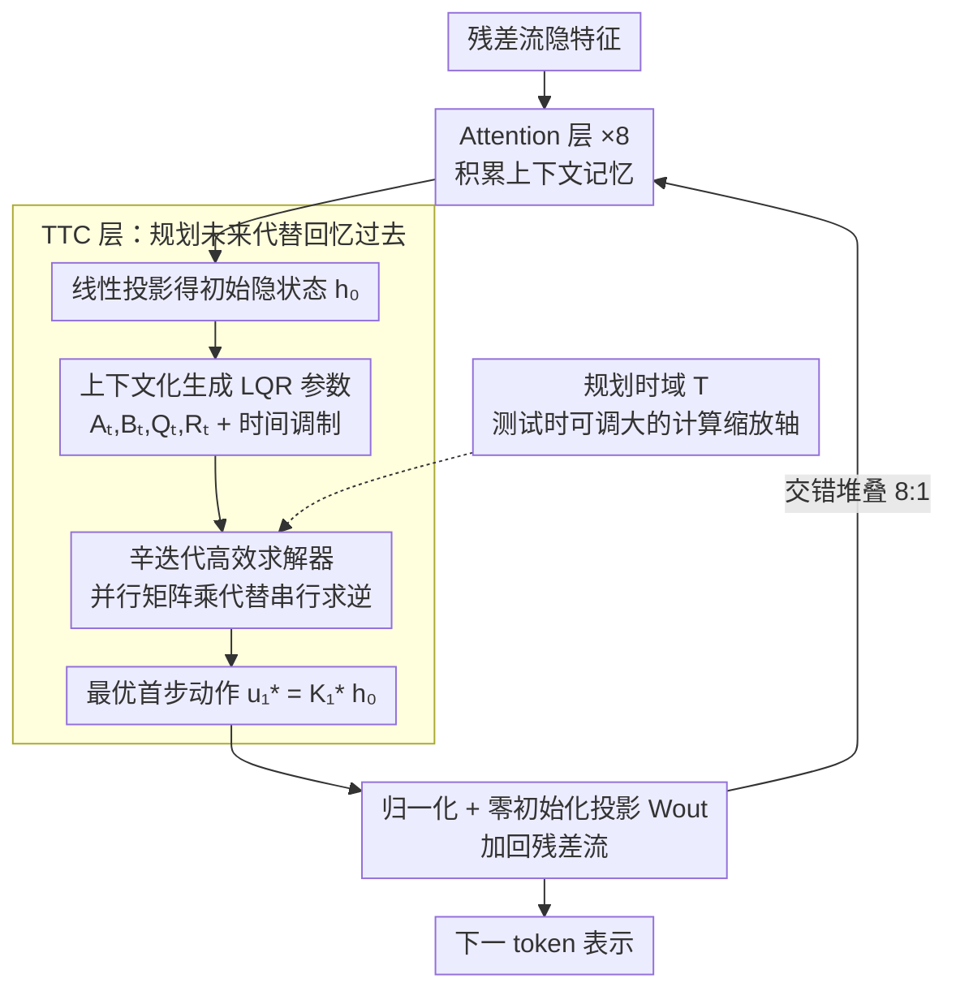

# Beyond Test-Time Memory: State-Space Optimal Control for LLM Reasoning

**会议**: ICML 2026  
**arXiv**: [2603.09221](https://arxiv.org/abs/2603.09221)  
**代码**: https://vita-group.github.io/TTC-Net (项目页)  
**领域**: LLM推理  
**关键词**: 最优控制, LQR, 测试时规划, 状态空间模型, 数学推理  

## 一句话总结

将 LLM 推理建模为隐空间上的最优控制问题（线性二次调节器 LQR），提出 Test-Time Control (TTC) 层在前向传播中执行有限时域规划并解码最优控制动作作为下一 token 表示，配合辛迭代 CUDA 高效求解器，作为适配器插入预训练 LLM 后在 MATH-500 上提升最多 +27.8%，AMC/AIME 上 Pass@8 提升 2-3 倍。

## 研究背景与动机

**领域现状**：当前主流序列模型（Transformer、SSM、线性 RNN）共享一个核心设计原则——基于联想记忆的预测。Attention 保留全部 KV 缓存并通过查询匹配检索，线性 RNN 则将历史上下文压缩到固定大小隐状态再解码，本质上都是 System 1 式的快速模式匹配。

**现有痛点**：纯记忆范式在需要发现、推理和求解的任务上能力受限。虽然强化学习（RL）可以让模型更具目标导向性，但 RL 仅作为外部训练/后训练过程，在前向推理时缺席。模型学会了"优化什么"，却没有在计算过程中学会"如何通过规划来推理"。

**核心矛盾**：记忆架构对应 System 1 思维，而 System 2 式的深思熟虑、多步规划和长程推理需要专门的架构支持。RL 训练无法突破记忆架构施加的推理天花板，规划能力依然外挂于模型之外。

**本文目标**：将规划直接内化到模型架构中，使 LLM 在前向传播中就能执行目标导向的推理，而非依赖外部训练程序。

**切入角度**：作者观察到 LQR（线性二次调节器）是可解析求解的 MDP 子类，且线性动力系统已被证明能表达广泛的 MDP 族。如果将每一层的下一 token 预测建模为一个可微分的有限时域 LQR 问题，就能在前向推理时原生地执行规划。

**核心 idea**：用最优控制中的 LQR 规划替代纯记忆检索，让模型在预测前先"思考未来轨迹"，实现 System 2 推理的架构化。

## 方法详解

### 整体框架

TTC-Net 把"预测下一个 token"重新理解为一次有限时域的最优控制规划：与其从记忆里检索答案，不如先在隐空间里推演一条未来轨迹，再把这条轨迹的第一步动作当作下一 token 的表示。具体落地为一个混合架构——在预训练 Transformer 每隔 8 层 Attention 后插入一个 TTC 层。输入 token 特征经线性投影得到初始隐状态 $\boldsymbol{h}_0$，TTC 层在该状态上构建并求解一个 LQR 问题，得到最优第一步动作 $\boldsymbol{u}_1^*$，再经归一化和线性投影加回残差流。整个过程端到端可微，既能从零训练，也能作为适配器插在预训练模型上微调。

### 关键设计

**1. Test-Time Control (TTC) 层：把"回忆过去"换成"规划未来"**

现有的 Attention / SSM 记忆层只能从已经发生的上下文里回忆信息，本质是 System 1 的模式匹配，对需要多步推演的题目就力不从心。TTC 层的做法是在前向传播里直接解一个有限时域最优控制问题：以编码了上下文的 $\boldsymbol{h}_0$ 为初始状态，假设隐状态按线性动力学 $\boldsymbol{h}_t = \boldsymbol{A}_t \boldsymbol{h}_{t-1} + \boldsymbol{B}_t \boldsymbol{u}_t$ 演化，并对未来 $T$ 步施加二次代价 $\sum_{t=1}^{T}(\boldsymbol{h}_t^\top \boldsymbol{Q}_t \boldsymbol{h}_t + \boldsymbol{u}_t^\top \boldsymbol{R}_t \boldsymbol{u}_t)$，然后用 Riccati 迭代求出最优第一步动作 $\boldsymbol{u}_1^* = \boldsymbol{K}_1^* \boldsymbol{h}_0$。这里 LQR 的所有参数（$\boldsymbol{A}_t, \boldsymbol{B}_t, \boldsymbol{Q}_t, \boldsymbol{R}_t$）都由上下文 $\boldsymbol{h}_0$ 经线性层动态生成（上下文化），再乘上时间调制系数 $\boldsymbol{\Gamma}_\Box^t$ 实现时间异质参数化，让动力学和代价随规划步逐步变化；反向传播则通过 KKT 系统求解对偶 LQR，使整层完全可微。之所以有效，是因为它给每个序列建模块赋予了一个内在值函数 $V_t(\boldsymbol{h}_t) = -\frac{1}{2}\boldsymbol{h}_t^\top \boldsymbol{P}_t \boldsymbol{h}_t$——模型不再只是检索，而是在最小化长程代价的意义上"朝目标推演"，这正是记忆层给不了的归纳偏置。

**2. 辛迭代高效求解器（Symplectic Iteration Solver）：让最优控制层在 GPU 上真正跑得动**

经典 Riccati 求解器要顺序反向迭代 $T$ 步，每步都含一次稠密矩阵求逆（整体 $O(Td^3)$），这种串行 + 求逆的模式和擅长并行矩阵乘的 GPU 严重不匹配，直接用会让 TTC 层慢到没法上规模。求解器利用 LQR 动力学固有的辛结构，把 Riccati 递推改写成辛矩阵 $\boldsymbol{\Sigma}_t$ 的累积矩阵乘积：各时间步要求的逆 $\boldsymbol{A}_t^{-1}$、$\boldsymbol{R}_t^{-1}$ 彼此独立、可一次性并行算出，剩下的顺序计算只剩矩阵乘法（正好喂给 Tensor Core）；再通过对角化 $\boldsymbol{A}_t$ 和 $\boldsymbol{R}_t$，把稠密求逆的复杂度从 $O(T)$ 压到 $O(1)$。整套流程进一步融合成 CUDA kernel，按行分块、把参数流式加载到 SRAM，并用行归一化保持数值稳定。这样计算瓶颈就从"求逆"挪到了"乘法"，吞吐提升 10 倍以上；前向还顺手缓存 $\boldsymbol{Y}_1$ 的 LU 分解和部分中间结果给反向传播复用，省掉了额外的辛迭代开销。

**3. 混合架构与测试时规模化：把规划时域变成一个新的计算缩放轴**

TTC 层只优化轨迹却不擅长积累上下文，所以必须靠 Attention 喂给它丰富的记忆状态——于是采用 8:1 的交错比（每 8 层 Attention 配 1 层 TTC）、多头结构（头大小 16），把 TTC 当作轻量适配器嵌进预训练 LLM。训练时若固定规划时域，测试时一旦想加大时域就会遇到分布偏移，因此规划时域 $T_{train}$ 从一个截断的 Poisson 对数正态分布采样（均值 $T_\mu = 8$，上限 32），让模型见过深浅不一的规划深度。这样做暴露出一个架构原生、且正交于"生成多少 token"的测试时计算缩放轴：推理时把规划时域 $T_{test}$ 任意调大，模型即便在训练最大时域 32 之上也能泛化到 $T=64$ 并持续涨点。微调时输出投影 $\boldsymbol{W}_{out}$ 零初始化，保证刚插入 TTC 层的模型与原始骨干完全一致，不破坏已有能力。

### 训练策略

采用混合时域训练：每次迭代从 Poisson 对数正态分布采样规划时域 $T_{train}$，均值 $T_\mu = 8$，对数标准差 $T_\sigma = 0.1$，上限 32。在预训练模型上微调时使用 OpenThoughts2-114K 数据集加 800K 自收集推理样本进行 SFT，相当于模仿学习 + 逆强化学习。

## 实验关键数据

### 主实验 — 数学推理（基于 Llama-3-Instruct-7B 微调）

| 模型 | MATH-500 | AMC Acc@8 | AMC Pass@8 | AIME24 Acc@8 | AIME24 Pass@8 | AIME25 Pass@8 |
|------|----------|-----------|------------|-------------|---------------|---------------|
| Base model | 25.00 | 6.63 | 31.32 | 0.00 | 0.00 | 0.00 |
| Full Finetuning | 46.80 | 20.78 | 46.98 | 1.67 | 6.67 | 0.00 |
| + Attention | 47.00 | 20.48 | 44.58 | 0.42 | 3.33 | 6.67 |
| + Mamba | 44.80 | 22.29 | 44.58 | 0.83 | 3.33 | 3.33 |
| + GDN | 47.80 | 17.77 | 37.35 | 0.42 | 3.33 | 6.67 |
| + MesaNet | 47.40 | 12.65 | 27.71 | 1.25 | 10.00 | 0.00 |
| **TTC-Net** | **52.80** | **23.34** | **54.22** | **3.33** | **20.00** | **20.00** |

### 消融实验 — MATH-500

| 配置 | $T_{test}=8$ | $T_{test}=16$ | 说明 |
|------|------------|-------------|------|
| 时间齐次参数化 | 48.40 | 45.70 | 去除时间调制，增大时域反而掉点 |
| 固定训练时域 | 50.60 | 31.50 | 无法泛化到更大测试时域 |
| 均匀采样时域 | 50.80 | 51.00 | 效果接近但训练成本翻倍 |
| Attn:TTC = 4:1 | 53.00 | — | 更多 TTC 层可提升但计算开销大 |
| Attn:TTC = 16:1 | 47.20 | — | TTC 层过少性能下降 |
| **TTC-Net (PLN + 8:1)** | **52.80** | **53.60** | 最优平衡点，可泛化至 $T=64$ |

## 亮点与洞察

- **架构范式转换**：首次将推理从"记忆检索"重新定义为"最优控制"，为 LLM 推理提供了 System 2 认知的架构化实现
- **测试时规模化新轴**：规划时域 $T$ 提供了一个正交于 token 生成数量的计算缩放轴，增大 $T$ 可持续提升推理准确率且不需要重新训练
- **突破推理天花板**：TTC-Net 在 AIME 上实现了从 0% 到 20% 的 Pass@8 突破，说明控制目标提供了记忆层无法达到的归纳偏置
- **辛迭代求解器**：通过算法-硬件协同设计实现 10 倍以上吞吐量提升，使最优控制层在大规模 LLM 中实际可用

## 局限性 / 可改进方向

- 多层 TTC 的联合动力学行为缺乏理论理解，层间交互机制不明确
- 当前仅在 7B 模型上验证，更大规模模型和全阶段训练（预训练 + RL）的效果未知
- LQR 的线性动力学和二次代价仍有表达力限制，非线性 MDP 公式化可能进一步提升
- 参数上下文化的线性层较简单，更丰富的世界模型参数化值得探索

## 相关工作与启发

- 与 TTT（Test-Time Training）系列工作形成对比：TTT 是测试时记忆（自监督回归），TTC 是测试时决策（最优控制）
- 与 RL for LLM（如 DeepSeek-R1）互补：RL 提供训练时目标，TTC 将目标内化到架构前向传播中
- 辛迭代求解器的设计思路可推广到其他需要在神经网络中嵌入优化层的场景
- Titans、DeltaNet 等记忆架构可与 TTC 混合，探索更丰富的记忆-规划交互

## 评分

- 新颖性: 9/10 — 首次将最优控制作为架构组件嵌入 LLM，范式性创新
- 实验充分度: 7/10 — Sudoku + 数学推理验证充分，但仅限 7B 模型且缺少 NLP/代码任务
- 写作质量: 9/10 — 从认知科学到控制论的叙事连贯，数学推导严谨
- 价值: 8/10 — 开辟了 LLM 推理的新架构方向，但实际落地需更大规模验证

<!-- RELATED:START -->

## 相关论文

- [\[ICLR 2026\] ∇-Reasoner: LLM Reasoning via Test-Time Gradient Descent in Latent Space](../../ICLR2026/llm_reasoning/nabla-reasoner_llm_reasoning_via_test-time_gradient_descent_in_latent_space.md)
- [\[NeurIPS 2025\] Towards Thinking-Optimal Scaling of Test-Time Compute for LLM Reasoning](../../NeurIPS2025/llm_reasoning/towards_thinking-optimal_scaling_of_test-time_compute_for_llm_reasoning.md)
- [\[ICML 2026\] Beyond Two-Stage Training: Cooperative SFT and RL for LLM Reasoning](beyond_two-stage_training_cooperative_sft_and_rl_for_llm_reasoning.md)
- [\[ICML 2026\] Conformal Thinking: Risk Control for Reasoning on a Compute Budget](conformal_thinking_risk_control_for_reasoning_on_a_compute_budget.md)
- [\[ICLR 2026\] A State-Transition Framework for Efficient LLM Reasoning](../../ICLR2026/llm_reasoning/a_state-transition_framework_for_efficient_llm_reasoning.md)

<!-- RELATED:END -->
