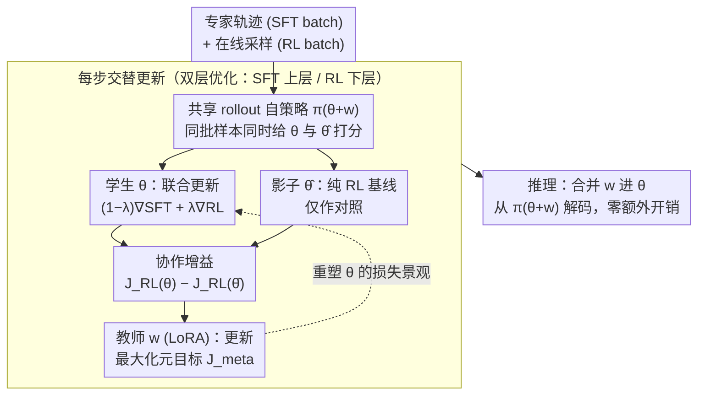

# Beyond Two-Stage Training: Cooperative SFT and RL for LLM Reasoning

**会议**: ICML 2026  
**arXiv**: [2509.06948](https://arxiv.org/abs/2509.06948)  
**代码**: https://github.com/ChanLiang/BRIDGE  
**领域**: 强化学习  
**关键词**: LLM推理, 强化学习, 监督微调, 双层优化, 元学习  

## 一句话总结

提出 BRIDGE 框架，将 SFT 与 RL 的整合建模为双层优化问题——SFT 作为上层教师通过轻量 LoRA 模块学习选择性地向 RL 学生传递有益监督信号，在五个数学推理基准上平均绝对提升超过 3 个百分点。

## 研究背景与动机

**领域现状**：SFT（监督微调）和 RLVR（基于可验证奖励的强化学习）是 LLM 推理后训练的两大范式。SFT 能高效模仿专家轨迹但易过拟合，RLVR 通过探索发现高奖励轨迹但采样效率低。当前主流做法是"两阶段流水线"——先 SFT 再 RL。

**现有痛点**：两阶段方法并不总能优于纯 RL（在 Llama-3.2-3B 上甚至更差）。SFT 的优势主要是静态的初始化作用，一旦进入 RL 阶段，监督信号就被丢弃，模型只能依赖无引导的探索。而单阶段混合方法（直接加权 $J_{\text{hyb}}(\theta) = J_{\text{RL}}(\theta) + \mu J_{\text{SFT}}(\theta)$）效果更差——实验表明朴素混合的奖励甚至低于纯 RL。

**核心矛盾**：并非所有监督更新都有利于奖励优化。直接将 SFT 和 RL 梯度混合可能产生反作用，关键问题是：如何动态提取那些真正有助于 RL 奖励最大化的监督信号？

**切入角度**：作者观察到 SFT 和 RL 之间存在教师-学生的层次关系——SFT 拥有专家推理轨迹（教师），RL 通过探索寻找高奖励策略（学生）。将二者建模为双层优化（Stackelberg 博弈）可以让 SFT 根据对 RL 的帮助程度来自适应调整监督方式。

**核心 idea**：用元学习让 SFT 学会"教" RL——通过最大化联合训练相对于纯 RL 的协作增益信号，使监督更新只在有助于奖励优化时才被采纳。

## 方法详解

### 整体框架

BRIDGE 把"先 SFT 再 RL"的两阶段流水线改写成一场教师-学生的双层博弈：上层（leader）是 SFT 目标，它操纵一个轻量 LoRA 教师模块 $w$；下层（follower）是 RL 目标，它负责优化 LLM 主干参数 $\theta$。每个训练步交替做两件事——学生更新先把 SFT 和 RL 梯度融合起来推进 $\theta$，教师更新再根据"这次联合训练比纯 RL 多赚了多少奖励"来调整 $w$，让监督信号只在真正帮到奖励优化时才被采纳。推理时把 $w$ 直接合并进 $\theta$，不带来任何额外开销。

### 关键设计

**1. 双层优化公式化：让 SFT 服从于 RL 的最优解，而不是和它硬抢梯度**

朴素混合（$J_{\text{RL}} + \mu J_{\text{SFT}}$）失败的根因是 SFT 和 RL 被放在同一层平等加权，监督更新可能把模型拽离奖励高地。BRIDGE 改用层次结构来表达"SFT 是来辅佐 RL 的"这层关系：上层目标 $\max_w J_{\text{SFT}}(w, \theta^*(w))$，下层约束 $\theta^*(w) = \arg\max_\theta J_{\text{RL}}(\theta, w)$——SFT 的优化必须以 RL 已经收敛到最优解为前提，从结构上保证监督信号不会反过来干扰奖励。直接求解这个双层问题需要对 $\theta^*(w)$ 求二阶导，在 LLM 规模下不可行，于是作者用惩罚松弛把它压成单层：$\max_{\theta,w} (1-\lambda) J_{\text{SFT}}(\theta,w) - \lambda \, p(w,\theta)$，其中 $p(w,\theta)$ 度量 $\theta$ 偏离 RL 最优解的程度。这样只需一阶梯度即可优化，且松弛带来的近似误差被控制在 $O(1-\lambda)$ 量级。

**2. LoRA 教师模块与协作增益信号：用独立低秩子空间给 RL"重塑损失景观"，并用一个差值信号判断监督该不该听**

如果让 SFT 和 RL 共用同一套参数去优化，两边的更新会互相污染。BRIDGE 让策略变成 $\pi_{\theta+w}$，教师只动低秩的 $w$，相当于在 $\theta$ 自己的优化之外，悄悄重塑它面对的损失景观，二者在独立子空间里互不踩脚。教师的元目标写成 $J_{\text{meta}} = (1-\lambda) J_{\text{SFT}}(\theta,w) + \lambda [J_{\text{RL}}(\theta,w) - J_{\text{RL}}(\hat{\theta},w)]$，其中 $\hat{\theta}$ 是一份只吃纯 RL 梯度的辅助参数。括号里那一项就是**协作增益**——联合训练相对纯 RL 多出来的奖励；只有当这个差值为正时，监督才被认为"教对了"。这个设计还顺手解决了奖励噪声：若奖励里混入一个加性偏置，它在两个 $J_{\text{RL}}$ 的相减中被天然对消，使元信号对不完美验证器更鲁棒。合并 $w$ 后推理零成本，又保住了部署友好。

**3. 交替三路更新算法：每步同时维护学生、纯 RL 影子、教师三套更新，用共享 rollout 把协作增益估准**

要把上面的元目标真正落到训练里，关键是怎么量化"比纯 RL 多赚多少"。BRIDGE 每步采样 SFT 和 RL 两个 mini-batch，做三路更新：学生 $\theta^{k+1} = \theta^k + \alpha [(1-\lambda)\nabla_\theta J_{\text{SFT}} + \lambda \nabla_\theta J_{\text{RL}}]$ 走联合训练；辅助参数 $\hat{\theta}^{k+1} = \hat{\theta}^k + \alpha \nabla_{\hat\theta} J_{\text{RL}}$ 维护一个纯 RL 基线作为对照；教师 $w^{k+1} = w^k + \beta \nabla_w J_{\text{meta}}$ 据此更新 LoRA。$\hat{\theta}$ 这个影子参数的存在让协作增益从抽象概念变成可计算的量。为避免两条策略各自采样带来的噪声把增益估计搅浑，两者共享同一批 rollout 来评估奖励差，方差因此显著下降。

## 实验关键数据

### 主实验

在三个不同规模和系列的 LLM 上验证，训练数据为 MATH 数据集 hard split（8.5K 问题），评估五个数学推理基准：

| 方法 | MATH500 | Minerva Math | OlympiadBench | AIME24 | AMC23 | 平均 |
|------|---------|-------------|---------------|--------|-------|------|
| RL | 64.4 | 26.5 | 27.0 | 3.3 | 40.0 | 32.2 |
| SFT→RL | 66.0 | 24.3 | 26.8 | 9.0 | 35.0 | 32.2 |
| SFT+RL | 55.6 | 20.6 | 25.0 | 3.3 | 42.5 | 29.4 |
| CHORD | 66.0 | 23.2 | 25.9 | 6.7 | 40.5 | 32.5 |
| **BRIDGE** | **66.2** | **23.9** | **28.9** | **13.3** | **47.5** | **36.0** |

> Qwen2.5-3B 结果。BRIDGE 平均 36.0%，超过最强基线 CHORD 3.5 个百分点。

| 模型 | 最强基线 | BRIDGE | 绝对提升 |
|------|---------|--------|---------|
| Qwen2.5-3B | 32.5 (CHORD) | 36.0 | +3.5 |
| Llama-3.2-3B | 21.9 (LUFFY) | 24.7 | +2.8 |
| Qwen3-8B | 45.9 (CHORD) | 49.9 | +4.0 |

### 消融与效率分析

| 配置 | 平均准确率 | 说明 |
|------|-----------|------|
| BRIDGE | 49.9 | 完整方法 (Qwen3-8B) |
| w/o $J_{\text{meta}}$ | 40.3 | 去掉元目标，退化为朴素多任务，降 9.6 点 |

| 指标 | RL | SFT→RL | BRIDGE | 说明 |
|------|-----|---------|--------|------|
| 训练时间 (hr, 3B) | 6.1 | 12.3 | 6.9 | BRIDGE 比两阶段节省 44% 时间 |
| 训练时间 (hr, 8B) | 38.5 | 39.1 | 33.5 | BRIDGE 比两阶段节省 14% 时间 |
| 显存 (GB, 3B) | 52.2 | 45.9 | 59.3 | 增加约 11% 显存 |
| 准确率 (%, 3B) | 32.2 | 32.2 | 36.0 | 性能提升 11.8% |

奖励噪声鲁棒性：当奖励以概率 $p=0.2$ 翻转时，BRIDGE 仍达 32.9%，而纯 RL 降至 13.9%（差距从 +3.8 扩大到 +19.0），因为协作增益中的加性偏置 $p$ 恰好被对消。

## 亮点与洞察

- **元学习视角的 SFT-RL 整合**：首次将推理 LLM 训练建模为双层优化，提供了比启发式混合更有原则的框架
- **协作增益信号天然抗噪**：数学上证明奖励噪声中的偏置项在差值中被消除，使方法在不完美验证器下依然稳健
- **解的多样性不降反升**：Pass@32 在 AIME24 上比纯 RL 高 10 个百分点，说明 SFT 轨迹丰富了探索空间
- **跨域零样本泛化**：数学训练的模型在代码 (LiveCodeBench) 和科学 (GPQA) 上零样本优于纯 RL，而 SFT→RL 反而低于基础模型

## 局限性 / 可改进方向

- 仅在可自动验证的任务上测试（数学/逻辑/代码），未验证主观奖励（如开放生成）的效果
- 辅助参数 $\hat{\theta}$ 需要维护完整 LLM 副本，70B+ 规模下显存压力显著
- 混合系数 $\lambda$ 虽然实验显示对 0.3-0.7 范围鲁棒，但最优值仍需按模型/任务调整

## 相关工作与启发

- **CHORD** (Zhang et al., 2025)：全局+token级动态加权 SFT 和 RL，是最强启发式基线
- **LUFFY** (Yan et al., 2025)：将 SFT 示范作为离策略轨迹注入 RL，但受分布不匹配限制
- **SRFT** (Fu et al., 2025)：熵感知加权+裁剪减少目标干扰，但仍是启发式混合
- **SimpleRL** (Zeng et al., 2025)：纯 RL 基线框架，发现短 CoT 微调可能损害推理
- 启发：双层优化为"学习如何教"提供了通用框架，可推广到其他需要整合模仿与探索的场景

## 评分

- 新颖性: ⭐⭐⭐⭐ (首次将 SFT-RL 整合建模为双层优化)
- 实验充分度: ⭐⭐⭐⭐⭐ (三个模型、五个基准、多维分析、鲁棒性/泛化/多样性)
- 写作质量: ⭐⭐⭐⭐ (动机推导清晰，数学公式完整)
- 价值: ⭐⭐⭐⭐ (为 SFT-RL 整合提供了有原则的替代方案)

<!-- RELATED:START -->

## 相关论文

- [\[ICML 2026\] ETS: Energy-Guided Test-Time Scaling for Training-Free RL Alignment](ets_energy-guided_test-time_scaling_for_training-free_rl_alignment.md)
- [\[NeurIPS 2025\] First SFT, Second RL, Third UPT: Continual Improving Multi-Modal LLM Reasoning via Unsupervised Post-Training](../../NeurIPS2025/llm_reasoning/first_sft_second_rl_third_upt_continual_improving_multi-modal_llm_reasoning_via_.md)
- [\[ICML 2026\] Beyond Test-Time Memory: State-Space Optimal Control for LLM Reasoning](beyond_test-time_memory_state-space_optimal_control_for_llm_reasoning.md)
- [\[ICML 2026\] On Robustness and Chain-of-Thought Consistency of RL-Finetuned VLMs](on_robustness_and_chain-of-thought_consistency_of_rl-finetuned_vlms.md)
- [\[ACL 2026\] SHAPE: Stage-aware Hierarchical Advantage via Potential Estimation for LLM Reasoning](../../ACL2026/llm_reasoning/shape_stage-aware_hierarchical_advantage_via_potential_estimation_for_llm_reason.md)

<!-- RELATED:END -->
