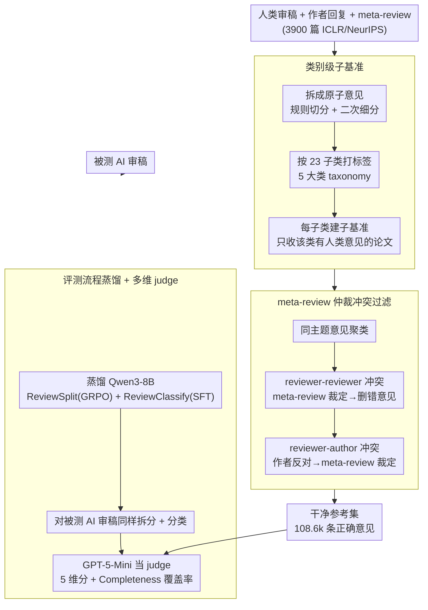

# CoCoReviewBench: A Completeness- and Correctness-Oriented Benchmark for AI Reviewers

**会议**: ICML 2026  
**arXiv**: [2605.07905](https://arxiv.org/abs/2605.07905)  
**代码**: https://github.com/hexuandeng/CoCoReviewBench (有)  
**领域**: LLM 推理 / AI 评审 / 评测基准  
**关键词**: AI Reviewer、完备性、正确性、冲突检测、Meta-Review

## 一句话总结
本文提出 CoCoReviewBench，通过"按类别建子基准 + 用 meta-review 仲裁审稿人/作者冲突来过滤错误意见"两步，把 3,900 篇 ICLR/NeurIPS 论文的人工审稿改造成一个更可信的 AI 审稿评测参考，并发现现有 AI 审稿在 correctness 和 thoroughness 上仍落后于人类、推理模型则更有潜力。

## 研究背景与动机
**领域现状**：随着投稿量暴涨、审稿质量下滑，研究界尝试用 LLM 当 "AI 审稿人"，并形成两条评测路线：一条是 LLM-as-a-judge 不引入人类参考；另一条是直接拿人类审稿当 gold reference，用 BLEU/ROUGE/BERTScore 或 LLM 匹配的方式打分。

**现有痛点**：第一条路线缺少专家信号，容易被 LLM 自身偏见放大分数；第二条路线则把人类审稿当作"真相"，但人类审稿其实**既不全也不一定对**——单个审稿人平均只覆盖 23 个子类别中的 5.10 个，全部审稿合起来也只覆盖 9.23 个（40%），且 13% 的论文存在 ≥4 分的分歧、22% 的论文存在 reviewer-reviewer 冲突、76% 的论文存在 reviewer-author 冲突。

**核心矛盾**：把不完备且偶尔出错的人类审稿当 gold reference，会造成两类系统性偏差——(1) AI 提出的"人类没说过的有效问题"被误判为不相关而被惩罚；(2) AI 学到了人类审稿里的错误观点，评测时反而被奖励。

**本文目标**：(a) 构造一个不会因为参考"不全"而误罚 AI 的评测；(b) 用专家信号（其它审稿人、作者 rebuttal、meta-review）过滤掉人类审稿里的错误意见；(c) 在这样的可信参考上重新比较各类 AI 审稿模型，看清当前差距与方向。

**切入角度**：与其试图合成"比人更好"的审稿，不如**回到 OpenReview 自带的多方讨论结构**——同类话题被多个 reviewer 讨论时若意见冲突，meta-review 天然就是高水平的仲裁信号；作者明确反对某条意见时，meta-review 也能裁定谁对。这些都是**免费的专家标注**。

**核心 idea**：把"AI 审稿评测"重新定义为**类别级匹配 + 冲突过滤后的人类参考对齐**——按 5 大类 23 个子类拆分基准，只在双方都覆盖某类别时打分；用 meta-review 当裁判去掉错误的人类参考意见，再用 LLM-as-a-judge 在干净参考上多维度评 AI。

## 方法详解

### 整体框架
CoCoReviewBench 想解决的核心问题是：把"既不全又偶尔出错"的人类审稿，洗成一份既不会冤枉 AI、又不会奖励 AI 学坏的可信评测参考。整条流水线（Figure 4）顺着"拆 → 过滤 → 蒸馏 → 打分"走：先把每条人类审稿连同对应的作者回复拆成"原子意见"并打上 23 类标签；再把同主题意见聚类，先后做 reviewer-reviewer、reviewer-author 两轮冲突检测，凡有冲突就请 meta-review 仲裁、丢掉被裁定为错的意见；然后把这套拆分+分类的能力蒸馏进一个 Qwen3-8B（ReviewSplit + ReviewClassify），用它给**被测的 AI 审稿**做同样处理；最后在每个类别上用 GPT-5-Mini 当 judge 算 Correctness / Thoroughness / Grounding / Verifiability / Clarity 五维分，再叠一个跨类别的 Completeness 覆盖率。

数据规模上，基准覆盖 NeurIPS 2021-2024 + ICLR 2017-2025，每年分层抽 300 篇共 3,900 篇，强制每篇 ≥3 个独立审稿、≥75% 审稿有作者回复，最终得到 14.1k 条 review、134.8k 条原子意见、115.9k 个意见簇、108.6k 条被判定为"正确"的参考意见。

### 关键设计

**1. 类别级子基准：把"参考没覆盖"从扣分变成跳过**

人类审稿天然覆盖不全——单个 reviewer 平均只碰 23 个子类里的 5.10 个，全部合起来也才 9.23 个（40%）。如果直接拿它当 gold reference 整体打分，AI 提出的那些"合理但 reviewer 恰好没说"的意见就会被当成离题而系统性扣分。本文的做法是按 NeurIPS 2025 审稿指南 + ARR 表单建一个两级 taxonomy——5 大类（Quality / Clarity / Significance / Originality / Policy）下含 23 个子类，把每篇论文所有 reviewer 的意见聚成一个 per-paper 标签集，再**为每个子类别单独构造一个子基准**，子基准只收"该类别下人类确实有意见"的论文；评测时只有当 AI 和人类在同一类别都有发言才打分，没人类信号的类别直接跳过而非惩罚。本文同时报两种粒度：paper-level 把一篇里所有类别的 AI 与人类意见混在一起打一个分，category-level 则每类独立打分再平均。这样既消除了"覆盖偏差"，又把"广度不足"（少覆盖几个类别）和"单类深度不足"两种毛病拆开来分别诊断。

**2. 基于 meta-review 仲裁的冲突过滤：用免费的专家信号删掉错的人类意见**

光跳过没覆盖的还不够——保留下来的人类参考本身就可能是错的（13% 论文有 ≥4 分分歧、22% 有 reviewer-reviewer 冲突、76% 有 reviewer-author 冲突），AI 若拟合这些错意见反而会被奖励。直接让一个"强 LLM 当裁判"判对错在专业领域并不靠谱，于是本文转而利用 OpenReview 自带的多方讨论结构作为**天然专家标注**：有冲突就意味着至少一方错，而 meta-review 是 AC 给出的高层裁定。具体分两条来源、各走三步独立 LLM 请求（aggregate / detect conflict / adjudicate）——inter-reviewer 这边先把同主题意见聚类，组内 ≥2 条时判是否冲突，有冲突就用 meta-review 决定哪条对、保留其中最长的那条正确意见；reviewer-author 这边把 reviewer 意见与 author 回复视作一组，先判作者是否明确反对，反对才再请 meta-review 裁定。被判错的意见从参考集中删除，但留档当"反向训练信号"。这条信号并不完美（强冲突论文 4 维平均仅 3.24/5，Conflict Coverage 最弱），作者论证它仍比"LLM 直接判正确性"或"原始未洗审稿"更可靠，而且分别在 22% / 76% 的论文上抓出了错误意见，量级足以形成有效过滤。

**3. 评测流程蒸馏 + 多维 judge：让评测既便宜又能拆出系统性差异**

处理人类审稿是一次性成本，但评测 AI 审稿要反复跑，每篇都喂强 LLM 做拆分+分类太贵。本文因此把这套能力蒸馏进 8B 小模型：ReviewSplit 用 GRPO 训 Qwen3-8B，每条样本采 32 个轨迹做 augmentation，用 Omega Index 衡量聚类正确性，奖励为

$$R = \max\!\left(0.5,\ \text{OmegaIndex} + \mathbb{1}(\text{Correct Format})\right)$$

ReviewClassify 因奖励太稀疏改用 SFT 训非思考模式（实测连带提升了思考模式）。蒸馏出的 8B 模型在人工 50 篇验证上达到 87.09% 完全正确分类，已逼近甚至超过部分强 LLM。judge 阶段定义 5 个 1-5 分维度——Correctness（与洗后人类意见的对齐度）、Thoroughness（覆盖完整度）、Grounding（是否点明论文具体位置）、Verifiability（可否核实）、Clarity（行文清晰度），paper-level 与 category-level 两个粒度同时报；再外加一个 $\text{Completeness} = \dfrac{\text{AI 覆盖类别数}}{\text{该论文所有 reviewer 合集覆盖类别数}} \times 100$。用多维分而非单一总分，正是为了暴露那些会被平均掉的系统性差异——比如 AI 的 clarity 普遍高于人类、correctness 却低于人类。

### 损失函数 / 训练策略
两个组件独立两阶段训练：ReviewSplit 用 GRPO 在二级分割上训练，让"两句是否属同一意见"的 0/1 判断对齐 Omega Index；ReviewClassify 用纯 SFT 把每条原子意见映射到 23 子类之一。整条 pipeline 的每一步还用 6 个强 LLM 做 leave-one-out 一致性验证，选一致性最高的模型生成最终标注，以压住单步标注噪声。

## 实验关键数据

### 主实验
作者在 3,900 篇基准上随机抽 1/3（1,300 篇）测试 18 个模型，覆盖闭源、开源推理、开源非推理、专用 AI 审稿模型四组。表中数字是相对人类参考的差值（+正负负）：

| 模型组 | 老指标 BLEU/ROUGE/BERT | Correct./Thoro. | Ground./Verify. | Clarity | Complete. |
|--------|-----------------------|-----------------|-----------------|---------|-----------|
| GPT-5.2（闭源强） | -1.93/-5.06/-1.31 | +0.36/+0.64 | +0.92/+0.78 | +0.32 | 84.49 |
| Gemini-3-Pro | -0.95/-1.12/-0.36 | +0.14/+0.16 | +0.69/+0.34 | +0.42 | 67.69 |
| QwQ-32B（推理） | -1.38/-2.44/-0.63 | -0.01/+0.13 | +0.58/+0.02 | +0.27 | 79.83 |
| Qwen3-8B no-think | -0.87/-0.53/-1.10 | -0.28/-0.10 | -0.40/-0.58 | -0.07 | 72.28 |
| CycleReviewer-70B（专用非推理）| -0.78/+0.34/-0.11 | -0.15/-0.22 | -0.55/-0.48 | +0.48 | 50.89 |
| DeepReviewer-14B（专用推理）| -1.11/-3.53/-0.09 | -0.17/+0.28 | +0.41/+0.41 | +0.17 | 81.98 |
| 人类基线（leave-one-out） | 2.73/17.54/84.04 | 3.55/2.37 | 3.75/2.38 | 4.15 | 55.66 |

最反直觉的现象：在老指标下，**非推理小模型和专用 AI reviewer 反而超过 GPT-5/Gemini-3**，说明 BLEU/ROUGE 主要奖励"表面像人类审稿"，而非真正的正确性。新提出的 paper-level LLM judge（Paper. 一列从 +0.07 到 +0.90）才与模型综合能力一致。

### 消融实验

| 配置 | 关键发现 | 说明 |
|------|---------|------|
| Strong-conflict 论文（≥5 个错意见）vs weak-conflict | Meta-review 4 维平均 3.24 vs 2.94 | 验证 meta-review 在冲突显著时确实能提供有效仲裁信号，但 Conflict Coverage 最弱（仅 2.85），所以只能当**粗粒度**裁判用 |
| Human 50 篇标注复核 | 分类 85.45% / 聚类 93.41% / inter-reviewer 错检 81.40% | 流水线总体可靠；reviewer-author 错检仅 66.83%（拒稿论文掉到 50%），是当前最大不确定来源 |
| 强 LLM × 6 leave-one-out | 各步骤跨模型一致性高 | 选最高分模型生成最终标注，单步噪声可控 |
| 直接把"错意见"也算作参考 | AI - Human correctness 差距明显缩小 | 反向证明 AI 在拟合人类审稿时也吸收了人类的错误意见，存在"学坏"风险 |

### 关键发现
- 推理模型在 **Grounding / Verifiability** 上已能持平甚至超过人类，说明 LRM 的"链式论证 + 引用上下文"能力直接转化为更可核查的审稿——这是本文给出的最强方向性结论：**未来 AI 审稿应优先选推理模型**。
- **AI 审稿"广而浅"**：跨类别覆盖普遍超单个 reviewer 但低于所有 reviewer 合集（Complete < 100），同时单类深度（Thoroughness）相比人类没显著提升，特别是非推理模型。
- **幻觉信号**：尽管输入纯文本，所有模型仍每篇都会生成少量 Figure 相关意见（<0.05/篇），表明 AI 审稿存在"凭空虚构"的低概率但持续的幻觉。
- **类别画像**：AI 在 Quality 类（实验、对比）甚至略胜人类；最弱在 Clarity 和 Policy，提示未来工作应重点补这两类训练信号。

## 亮点与洞察
- **把"参考不全 → 误罚"和"参考有错 → 误奖"两个问题分开解决**：Category-level 解决前者、Conflict-based filtering 解决后者，思路非常工整，几乎可以直接迁移到其它"参考不可信"的评测任务（如对话评测、code review）。
- **Meta-review 是被忽视的免费监督**：以往工作都在用 reviewer 文本，本文第一次系统把 meta-review 当成"高层裁判"用于错误检测，给"如何利用 OpenReview 全量讨论结构"打开新方向。
- **8B 蒸馏方案让评测可工业化**：处理人类审稿用强 LLM 是一次性成本，但评测 AI 审稿需要反复跑——把流水线蒸到 8B 让长期使用成本下降一个数量级，是 benchmark 项目少见的工程考量。
- **多维 + paper/category 双粒度的 LLM-judge** 揭示了"单一分数会掩盖问题"的事实：clarity 高不代表 correctness 高，老指标和新指标排序完全不一致——这本身就是对评测方法学的有力贡献。

## 局限与展望
- 作者承认 conflict-based filtering 只能抓**显式分歧**：作者没回复或回复语气温和时漏检；meta-review 偏负面时人工标注员倾向站 reviewer，导致 reviewer-author 错检在拒稿论文上仅 50% 准确率。
- 评测本身仍**依赖 LLM-judge（GPT-5-Mini）**，把 ground-truth 进一步 outsource 给另一个 LLM，存在"用 LLM 评 LLM"的循环风险——尽管本文已用人工验证缓解。
- 23 类分类体系来自 NeurIPS 2025 + ARR 表单，**对非 NLP/ML 会议（如理论、视觉细分）可能粒度不足**；移植到其他领域需要重做 taxonomy。
- 未来方向：(1) 利用被标错的意见做反向训练，专门训"不会附和错误意见"的 AI reviewer；(2) 用本文的覆盖信号合成"完整版人类参考"，从评测扩展到 reviewer 训练数据增强（作者已在附录 B.5 给出 agent 框架雏形）；(3) 评估 AI 是否能识别"最关键的审稿意见"，而不只是给出全套意见。

## 相关工作与启发
- **vs PeerRead / NLPeer / ReviewMT / Re2**: 这些数据集要么只提供 review 文本要么加 meta/rebuttal，**没有原子意见、类别标签、冲突检测、错误标注**。CoCoReviewBench 是首个 7 维全占的资源，Table 1 完整对比。
- **vs RevUtil（Sadallah et al., 2025）**: RevUtil 也做了 atomic + fine-grained + category-level，但**没有 rebuttal/meta/conflict/错误**信号；本文在它基础上补足了"正确性"维度。
- **vs DeepReviewer / CycleReviewer / OpenReviewer / SEA**: 专用 AI 审稿模型在老指标上分数虚高、新指标上反而被通用闭源 LLM 反超，说明它们大量"模仿了人类审稿表面风格"而非提升真实评审能力。本文给这类工作下一步训练（少模仿、多推理）提供了清晰的诊断证据。
- **vs LLM-as-a-judge 路线（Xu et al., GRE-bench）**: 那条路线完全不用人类参考、靠 LLM 偏好打分；本文走中间路线——保留人类参考但清洗它，兼顾覆盖和成本。

## 评分
- 新颖性: ⭐⭐⭐⭐ 把 meta-review 当冲突仲裁信号 + 类别级跳过评测两步组合，思路清晰，但单点创新都不算颠覆。
- 实验充分度: ⭐⭐⭐⭐⭐ 3,900 篇大规模、18 个模型横向、人工 50 篇复核、6 LLM 一致性、多粒度多维度，证据链非常完整。
- 写作质量: ⭐⭐⭐⭐ 结构干净，Table 1/2 信息密度高，但术语 (Correctness/Thoroughness/Grounding/Verifiability) 高度相近，读者需反复对照定义。
- 价值: ⭐⭐⭐⭐⭐ 为整个 "AI reviewer" 子领域提供了可工业化的可信评测，并直接给出"推理模型 > 非推理"的方向性结论，引领后续工作。

<!-- RELATED:START -->

## 相关论文

- [\[ICML 2026\] FloorplanQA: A Benchmark for Spatial Reasoning in LLMs Using Structured Representations](floorplanqa_a_benchmark_for_spatial_reasoning_in_llms_using_structured_represent.md)
- [\[ACL 2026\] LLM Reasoning as Trajectories: Step-Specific Representation Geometry and Correctness Signals](../../ACL2026/llm_reasoning/llm_reasoning_as_trajectories_step-specific_representation_geometry_and_correctn.md)
- [\[ICML 2026\] ToolMATH: A Math Tool Benchmark for Realistic Long-Horizon Multi-Tool Reasoning](toolmath_a_math_tool_benchmark_for_realistic_long-horizon_multi-tool_reasoning.md)
- [\[ACL 2026\] CoAct: Co-Active LLM Preference Learning with Human-AI Synergy](../../ACL2026/llm_reasoning/coact_co-active_llm_preference_learning_with_human-ai_synergy.md)
- [\[ICLR 2026\] On The Fragility of Benchmark Contamination Detection in Reasoning Models](../../ICLR2026/llm_reasoning/on_the_fragility_of_benchmark_contamination_detection_in_reasoning_models.md)

<!-- RELATED:END -->
