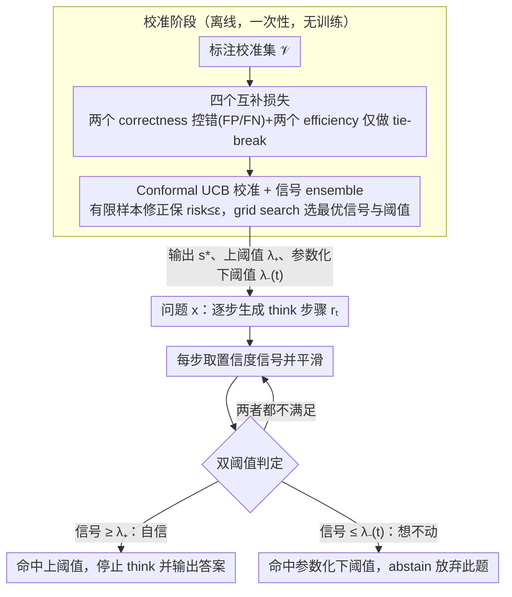

# Conformal Thinking: Risk Control for Reasoning on a Compute Budget

**会议**: ICML 2026  
**arXiv**: [2602.03814](https://arxiv.org/abs/2602.03814)  
**代码**: https://github.com/xidulu/reasoning_risk_control/  
**领域**: LLM 推理 / 自适应早停；conformal prediction；test-time scaling  
**关键词**: 双阈值早停、conformal risk control、参数化下阈值、UCB 校准、Qwen3 / DeepSeek-R1

## 一句话总结
本文把"reasoning LLM 何时停止思考"从一个不可解释的阈值调参问题，重构为一个**用户可指定 risk 容忍度**的 conformal 风险控制问题：用两个阈值——上阈值在模型自信时停（控 false positive），新提出的**参数化下阈值**在模型在不可解题上"想不动"时强行停（控 false negative）——并通过 UCB 算法从校准集自动求出满足风险约束的阈值，在 AIME / GPQA / MathVision 上实现"准确率几乎不掉、token 大幅省"。

## 研究背景与动机

**领域现状**：reasoning LLM（如 DeepSeek-R1、o1）通过 test-time scaling 提升准确率：思考 token 越多准确率越高。自适应早停（Wang et al., Yang et al.）通过监控置信度 / entropy，当达到某个阈值就停止 `<think>` 阶段。

**现有痛点**：(i) 阈值本身**不可解释**——0.7 还是 0.85 没有直接业务含义，且这个数字依赖于信号类型（entropy/confidence/probe）、模型与任务，迁移性极差；(ii) 现有"stop-when-confident"方法**只有上阈值**，在难题（如 AIME / 人类终极考）上模型常常永远达不到置信度，结果跑满 budget，大量 token 浪费；(iii) 现有方法只在 token level 监控置信度，未区分"已经答对了"vs"问题根本不可解"两种应该停止的情况。

**核心矛盾**：用户真正关心的是"我能承受多少错误率"这种业务量，而现有系统让用户去调一个跟错误率没有直接映射关系的内部阈值。同时，单纯的"自信就停"无法应对"信心一直上不去"的难题，导致 budget 浪费。

**本文目标**：(i) 把阈值调参问题改写为 risk control 问题，让用户直接指定 $\epsilon$（容忍错误率）；(ii) 引入下阈值机制让 unsolvable 实例尽早 abstain；(iii) 用分布无关 conformal 算法（UCB）从校准集求出满足 $\mathbb{P}(\mathcal{R}\le\epsilon)\ge 1-\delta$ 的阈值组合。

**切入角度**：早退神经网络（EENN）社区早就用 conformal risk control 决定哪个 exit 停（Jazbec et al. 2024）；reasoning LLM 的"何时停 think"本质上是同一个问题，只是 exit 数变成了 token 数。直接把 EENN 的 conformal framework 搬过来 + 加一个下阈值机制处理 unsolvable 情形，就能解决。

**核心 idea**：用 conformal UCB 把"两个阈值（上+下）"和"用户的 risk 容忍 $\epsilon$"绑定起来，让阈值选择自动化、误差率可保证、token 显著节省——尤其在难题占比高时下阈值的价值最大。

## 方法详解

### 整体框架
方法监控 reasoning 轨迹每一步的置信度信号，用上下两个阈值决定何时停止 `<think>`：上阈值在模型自信时停，下阈值在模型"想不动"时强行停；两个阈值都不靠手调，而是用 conformal UCB 算法从一个标注校准集上自动求出来，使最终错误率以高概率不超过用户指定的容忍度 $\epsilon$。整个流程完全无训练，只在 inference 端加监控。

具体地，给定轨迹 $y = \langle\text{think}\rangle r_{1:T}\langle/\text{think}\rangle a$ 和每步信号 $s_t = u(x, r_{1:t})$（可取 entropy / confidence / mutual predictability 等多种），平滑后得 $\tilde s_t = g(s_{1:t})$，早停时刻为 $\tau = \min\{t\ge 1 : \tilde s_t \ge \lambda_+ \;\lor\; \tilde s_t \le \lambda_-\}$（Eq. 5），$\lambda_+>\lambda_-$，命中上阈值表示"自信答出"、命中下阈值表示"放弃此题"。

### 关键设计

**1. 参数化动态下阈值：让"想不动"的题尽早 abstain**

现有 stop-when-confident 方法只有上阈值，在 AIME、GPQA 这类难题上几乎所有题目都永远达不到置信度，结果跑满 budget、token 全部浪费。本文补上一个对偶机制：上阈值控错（false positive，自信却答错），下阈值控浪费（false negative，明知做不出还硬算）。但下阈值不能是静态常数——静态下阈值只在"信心倒退"时才触发，实际几乎不起作用。关键做法是把下阈值写成关于 token 用量 $\omega_t$ 的 sigmoid：$\lambda_-(t;c,s,l,u) = \dfrac{u-l}{1+e^{-c(\omega_t - sB)}}+l$，其中 $B$ 是 budget，$c$ 控制斜率（要求信心增长多快）、$s$ 控制水平偏移（多早开始施压）、$l,u$ 控制上下界。它的含义是"模型必须按一张时间表 demonstrate 信心提升，否则被踢出场"；调 $(c,s)$ 就能把这张时间表恢复成线性、指数、对数、常数等多种形状，既给了 conformal 优化器足够的参数空间，又不至于爆炸。

**2. 四个互补损失：把 correctness 与 efficiency 解耦**

为了让 UCB 能独立校准，本文把"停得好不好"拆成四个 $[0,1]$ 范围的损失。两个 correctness 损失决定阈值是否合格：上阈值的 FP 损失 $\ell^+ = \mathbb{I}[\tilde s_t\ge\lambda_+]\cdot\mathbb{I}[f_t\ne y^*]$（自信停了却答错），下阈值的 FN 损失 $\ell^- = \frac{\mathbb{I}[\tilde s_t\le\lambda_-]}{T-t+1}\sum_{k=t}^T \mathbb{I}[f_k=y^*]$（放弃了但之后其实会做对）。两个 efficiency 损失只用于在合格阈值里挑最省的：$\mathcal{J}^+(t) = \frac{1}{T}\max(0, t-t')$（$t'=\min\{t:f_t=y^*\}$，答对后又多烧了多少 token）和 $\mathcal{J}^-(t) = \frac{1}{T}\sum_{k\le t}\mathbb{I}[f_k\ne y^*]$（停之前有多少 token 是错的）。这样 conformal 校准只盯着 correctness 必须 $\le\epsilon$、效率仅做 tie-breaking。其中下阈值的 $\ell^-$ 是 **farsighted** 设计——它不看"当前是否答对"，而是检查 $[t,T]$ 全程是否会答对，从而避免把"中间过程出错但最终能做对"的题误判为可放弃。

**3. Conformal UCB 校准 + 信号 ensemble：把调参从用户身上拿掉**

阈值的求法若直接用经验风险 $\widehat{\text{Risk}}(\lambda;\mathcal{V}) = \frac{1}{N}\sum\ell(\cdot;\lambda)$ 来选，在小校准集下会过于乐观、违反真实 $\epsilon$（Fig. 4 左图证明 naive 校准频繁违规）。本文改用 UCB（Bates 2021）：以 $\widetilde{\text{Risk}}(\lambda;\mathcal{V}) = \widehat{\text{Risk}} + (\text{finite-sample correction})$ 代替，correction 随校准集大小 $|\mathcal{V}|$ 和 $\delta$ 缩放，从而保证 $\mathbb{P}(\text{true risk}\le\epsilon)\ge 1-\delta$（Fig. 4 右图全程 $\le\epsilon$）。校准分两步走：先固定 risk target $\epsilon^+$ 用 UCB 求 $\hat\lambda_+$，再在固定 $\hat\lambda_+$ 下求下阈值参数 $\hat c$ 满足 $\mathbb{E}[\ell^-\mid\hat\lambda_+]\le\epsilon^-$；若多个阈值都合格，选 efficiency loss 最小的（Eq. 16）。更进一步，Algorithm 1 在多个候选信号 $\mathcal{S}$（entropy / confidence / probe 等）和阈值网格 $\Lambda_s$ 上一起 grid search，从可行集合 $\mathfrak{C}$ 里取效率最优的组合——因为不同 $\epsilon$ 下最优信号会切换，让算法自动选信号，是真正把"调参"从用户手上拿走的一步。

### 损失函数 / 训练策略
完全无训练——所有阈值与信号选择都通过 Algorithm 1 在校准集 $\mathcal{V}=\{(x_i, y_i^*)\}$ 上一次性 grid search + UCB correction 完成，得到 $(s^*, \lambda^*)$ 后直接部署。模型侧只需 inference，验证覆盖 Qwen3-8B、Qwen3-30B-A3B、DeepSeek-R1-Distill-Qwen-32B、Qwen3-VL-8B。

## 实验关键数据

### 主实验

| 实验设置 | 信号 | 关键现象 |
|---------|------|---------|
| 风险控制验证（Fig. 4） | 多信号 | Naive 校准频繁违反 $\epsilon$，UCB 校准全程 $\le\epsilon$（with prob $1-\delta$） |
| 信号 ensemble（Fig. 5） | 4 个模型 × 多信号 | Risk control 自动选效率最优的信号，超过任何单信号 |
| 下阈值价值（Fig. 6） | Qwen3-8B + confidence | solvable:unsolvable = 1:1 / 1:3 时，Lower+Upper 比 Upper-only 在相同准确率下大幅省 token |

### 消融实验

| 配置 | 关键效果 | 说明 |
|------|---------|------|
| Upper-only | 难题占比高时跑满 budget | 大量 unsolvable 题目永远达不到 confidence 阈值 |
| Lower-only | 仅在信心倒退时触发 | 静态下阈值几乎无用 |
| **Lower+Upper（dynamic）** | 准确率几乎不变，token 显著下降 | 双阈值互补效应 |
| Naive 校准 | 经常违反 $\epsilon$ | 经验风险偏乐观 |
| UCB 校准 | 始终 $\le\epsilon$ | finite-sample 修正起效 |
| Ensemble of signals | 优于任何单信号 | risk control 自动选最优 |

### 关键发现
- **下阈值的价值随难题比例放大**：solvable:unsolvable = 3:1 时收益小（多数题能正常自信收敛），1:1 和 1:3 时下阈值价值显著——把 unsolvable 题目识别出来并立刻 abstain 是省 token 的关键。
- **触发分布符合直觉**：在 Lower+Upper 配置的代表性操作点上，solvable 题大多通过上阈值正常退出，unsolvable 题大多通过下阈值早退——双阈值各司其职。
- **没有单一信号是最优**：不同 $\epsilon$ 下最优信号会切换（Fig. 1 右图），所以 ensemble + 自动选信号是必要的。
- **UCB correction 是关键**：finite-sample correction 看起来"保守"，但实际效果是"刚好不违反"——naive 校准频繁违规，UCB 校准则把违规率压到 $\le\delta$。
- **下阈值的 farsighted loss 设计避免误判**：如果用"看当前是否答对"，会把"中间过程错但最终能答对"的题误判为可放弃；farsighted 检查 $[t, T]$ 范围内的全部答案，使下阈值的统计意义真正对应"未来也不会答对"。

## 亮点与洞察
- **从阈值调参到风险指定的范式转换**：原来工程师调一个看不懂的 0.7；现在用户直接说"我能接受 5% 错误率"，系统反推出阈值。这是 ML 部署侧"接口可解释化"的范例。
- **下阈值是被现有 literature 忽视的对称机制**：大家都在做 stop-when-confident，没人做 stop-when-stuck；本文指出难题场景下后者收益更大。这种"对称设计补全"的研究思路很值得学习。
- **Dynamic 参数化形式的设计很巧**：sigmoid + (slope, shift, lower, upper) 四参数足以涵盖线性 / 指数 / 对数 / 常数等多种 schedule，给了 conformal 优化器足够的参数空间又不至于爆炸——是个"小巧但表达力强"的设计。
- **可直接接入现有系统**：完全无训练、不改模型权重、不改 decoding，只在 inference 端加阈值监控 + 校准；对工业部署友好。
- **理论与实践的桥梁**：把 EENN 的 conformal framework（Jazbec 2024）系统地迁到 reasoning LLM，并补全 unsolvable 处理——一个把已有理论与新兴问题精准对接的好例子。

## 局限与展望
- **下阈值的"上限可被违反"理论风险**：作者承认两步式校准在 lower threshold 完全 broken（多数 solvable 被误踢）的极端情况下可能违反上阈值的 risk bound——虽然实践中"极端分布漂移"很少见，但在 OOD 场景部署需要谨慎。
- **依赖标注校准集**：UCB 需要 $\mathcal{V}=\{(x_i, y_i^*)\}$ 的 ground truth，对没有标注的开放领域（如创意写作、医疗咨询）不直接适用。
- **静态校准 + 动态阈值的不匹配**：校准基于一次性 grid search，但部署时分布会漂移（新模型版本、新题型），需要重新校准。文中没讨论在线 conformal 化的方案。
- **效率/准确率 trade-off 仍非帕累托最优**：Fig. 1 右图表明不同 $\epsilon$ 下不同方法 Pareto 最优——本文虽然能给定 $\epsilon$ 选合适方法，但没有跳过这个 trade-off 本身。
- **未与训练侧 reasoning length compression（如 Reward Shaping）对比**：本文是 inference-only 方案，但近年训练侧也有方法显式 penalize 长 thinking，两者对比缺失。

## 相关工作与启发
- **vs Wang 2025 / Yang 2025（上阈值 stop-when-confident）**：他们只用 entropy/confidence 阈值，单阈值且阈值手调；本文是 conformal-calibrated 的双阈值。
- **vs Thought Calibration (Wu 2025)**：也用 risk control，但是 stop-when-stable（用 linear probe 预测最终答案是否稳定）；本文用通用信号 + UCB，并且 explicitly 处理 unsolvable。
- **vs PAC Reasoning (Zeng 2026)**：他们 conformally 决定"要不要 reason"（二元），本文决定"reason 到何时"（连续）。
- **vs EENN conformal risk control (Jazbec 2024)**：本文直接 inherit 其 UCB 框架，但把"哪个 exit"换成"哪个 token"，并新增下阈值机制。
- **启发**：conformal calibration + 双阈值（"对的太自信" vs "永远不自信"）这个范式可以推广到任何 cost-aware inference 场景——如多智能体讨论何时停、active learning 何时停、search 何时剪枝。

## 评分
- 新颖性: ⭐⭐⭐⭐ 双阈值 + 参数化动态下阈值是真正新颖的设计；conformal 框架本身借自 EENN literature，但向 reasoning 的迁移做得干净。
- 实验充分度: ⭐⭐⭐⭐ 覆盖 4 个模型、4 个数据集（含视觉推理），验证 risk control 性质 + ensemble + 下阈值价值；但缺乏 inference 成本的端到端数字（如平均节省 token% 在不同 $\epsilon$ 下），效率收益的可读性可以更好。
- 写作质量: ⭐⭐⭐⭐ 把 conformal 和 reasoning early-exit 两个领域桥得清晰，4 个损失的物理意义讲得通透；少数符号定义偏密。
- 价值: ⭐⭐⭐⭐ 直接可部署、完全无训练、给用户可解释的接口；对推理成本敏感的工业应用（搜索、问答、代码助手）实用性高。

<!-- RELATED:START -->

## 相关论文

- [\[ICML 2026\] Beyond Test-Time Memory: State-Space Optimal Control for LLM Reasoning](beyond_test-time_memory_state-space_optimal_control_for_llm_reasoning.md)
- [\[NeurIPS 2025\] Towards Thinking-Optimal Scaling of Test-Time Compute for LLM Reasoning](../../NeurIPS2025/llm_reasoning/towards_thinking-optimal_scaling_of_test-time_compute_for_llm_reasoning.md)
- [\[ICML 2026\] LatentChem: From Textual CoT to Latent Thinking in Chemical Reasoning](latentchem_from_textual_cot_to_latent_thinking_in_chemical_reasoning.md)
- [\[ICML 2026\] Less Diverse, Less Safe: The Indirect But Pervasive Risk of Test-Time Scaling in Large Language Models](less_diverse_less_safe_the_indirect_but_pervasive_risk_of_test-time_scaling_in_l.md)
- [\[ICML 2026\] Modeling Hierarchical Thinking in Large Reasoning Models](modeling_hierarchical_thinking_in_large_reasoning_models.md)

<!-- RELATED:END -->
