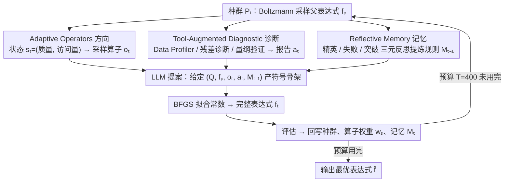

# Deliberate Evolution: Agentic Reasoning for Sample-Efficient Symbolic Regression with LLMs

**会议**: ICML 2026  
**arXiv**: [2606.04360](https://arxiv.org/abs/2606.04360)  
**代码**: https://github.com/Xinyu-Pang/Deliberate-Evolution (有)  
**领域**: LLM推理 / Agent / 符号回归  
**关键词**: 符号回归, 进化搜索, agentic reasoning, 样本效率, LLM 工具调用

## 一句话总结
把 LLM 主导的符号回归"出招—打分"循环拆成"提案 vs. 导航"两层——再用自适应算子（方向）、诊断工具（残差/量纲）、反思记忆（轨迹经验）三路信号显式引导 LLM，只用 40% 评估预算就在 LLM-SRBench 上把 NMSE 平均压低 37–55%。

## 研究背景与动机

**领域现状**：当下主流的 LLM-based 符号回归（LLM-SR、LASR、SGA）走的是"进化优化"路子——LLM 提候选表达式 → BFGS 拟合常数 → 用 MSE 打分 → 反馈回 LLM 继续变异。

**现有痛点**：这套循环样本效率极差，每道题平均要烧 $10^3$ 量级的候选评估。原因是 LLM 拿到的只有"父表达式 + 一个 scalar MSE"，被迫同时推理三件事：怎么改、为什么错、过往经验是什么。

**核心矛盾**：现有方法把"提案"和"搜索引导"这两件本该解耦的事强行塞进同一个 prompt。Scalar 反馈缺三类关键信号——**方向**（该 refine 还是 regenerate？）、**诊断**（残差里藏着周期性还是量纲错误？）、**记忆**（哪些 motif 反复成功、哪些 edit 一直失败？）。结果就是搜索在"看似合理但毫无信息量"的候选间打转。

**本文目标**：把这三类信号显式化、模块化，让 LLM 专注做它擅长的"提符号骨架"，把"导航"交给确定性模块。

**切入角度**：作者把符号回归重新定义成"被引导的科学搜索"而非"被打分的试错"——只要每一步候选都带着明确意图、定位证据、累积经验，理论上一步成功率从 $p_0$ 提升到 $p_0+\gamma$ 就能让 hitting time 指数级缩短（$\Pr(N>k)\le \exp[-k(p_0+\gamma)]$）。

**核心 idea**：用 agentic framework **解耦** symbolic generation 与 search control——LLM 只提骨架，外部模块负责定方向、做诊断、攒记忆。

## 方法详解

### 整体框架

DE 要解决的是 LLM 符号回归"出招—打分"循环样本效率太差的问题：LLM 拿到的只有"父表达式 + 一个标量 MSE"，被迫同时推理"往哪改、为什么错、过往经验是什么"三件事，于是在看似合理却毫无信息量的候选间空转。DE 的做法是把这三类信号从 prompt 里拆出来，交给三个确定性模块各管一路，LLM 只负责它擅长的"提符号骨架"。

具体到第 $t$ 轮：先从种群 $P_t$ 用 Boltzmann 采样取出父表达式 $f_p$，由它的状态 $s_t$ 索引算子策略采样出算子 $o_t$ 给出**方向**，再调用工具集 $\mathcal{T}=\{T_{\text{data}},T_{\text{res}},T_{\text{dim}}\}$ 生成**诊断**报告 $a_t$，连同**历史**记忆 $M_{t-1}$ 一起注入提案分布 $p_\theta(\cdot\mid Q,f_p,o_t,a_t,M_{t-1})$，LLM 据此产生骨架 $\tilde f_t$，BFGS 拟合常数得 $f_t$，评估后回写种群、算子权重和记忆。整套循环的预算上限只设 $T=400$ 候选，是基线的 $1/2.5$。

### 关键设计

**1. Adaptive Operators：替 LLM 决定该 refine 还是该跳出，而不是让它瞎猜方向**

标量反馈缺的第一类信号是"方向"——这一步到底该小修（refine）、变异（mutate）、交叉（crossover）还是推倒重来（regenerate）。DE 把这件事从 prompt 里抽出来，建成一个极简的状态机加老虎机：先定义算子集 $\mathcal{O}=\{o_{\text{ref}},o_{\text{mut}},o_{\text{cross}},o_{\text{reg}}\}$（从 exploit 到 explore 排开），再给每个父表达式映射一个二元状态 $s_t=(\mathbb{I}[\tilde r_p\le \tau_r],\mathbb{I}[v_p\ge\tau_v])$，两位分别表示"质量好不好"和"这块区域访得多不多"，于是只有 $2\times2=4$ 种状态。每个状态维护一组算子权重 $w_s^{(t)}$，采样时按 $\pi_s^{(t)}(o)=(1-\alpha)\,w_s^{(t)}(o)/\sum w + \alpha/|\mathcal{O}|$ 做带 $\epsilon$-探索的归一化；每用完一个算子，用相对提升 $r_t=\text{clip}((\ell(f_p)-\ell(f_t))/(\ell(f_p)+\varepsilon))$ 做乘性更新 $w_s^{(t+1)}(o_t)\leftarrow w_s^{(t)}(o_t)\cdot\max(\delta,1+\eta r_t)$。这样它能自己学出"高质量且常访的区域 → 该 mutate 跳出去""低质量又没充分探索 → 该 refine 深挖"这类显式 meta-policy，比 LLM 在 prompt 里反复猜要用哪种 edit 稳得多。另配一个 stagnation 触发器 $\text{Stag}_t$：连续 $h$ 轮最优损失提升不到 $\xi$，就强制抬高 mutate/regenerate 概率把搜索从局部最优里踹出来。

**2. Tool-Augmented Diagnostic Proposal：把"错了多少"翻译成"错在哪、为什么错"**

第二类缺失信号是"诊断"。一个标量 MSE 只告诉 LLM"错了多少"，却说不清"残差里藏着周期项还是量纲就不对"，于是变异是盲目的。DE 用三件工具串行把标量变成结构化报告 $a_t=(T_{\text{data}}(D),T_{\text{res}}(f_p,D),T_{\text{dim}}(f_p,Q))$：**Data Profiler** 先统计输入变量范围、算子可行域、变量交互、周期性/奇异性等数据先验；**Residual Diagnostic** 再分析残差 $e_i=y_i-f_p(x_i)$ 是否含未拟合的周期成分、缺项或振荡 pattern——比如算出残差与 $\sin(t)$ 的相关系数为 $-0.67$，就直接提示"缺一个周期项"；**Dimensional Verifier** 最后做物理量纲一致性检查，把单位上就站不住脚的组合提前枪毙。三份报告以自然语言注入 prompt，把原本"无方向的变异"变成"有的放矢的修订"。消融里这一块掉得最惨——去掉工具后 Physics 上 NMSE 从 4.37e-4 飙到 2.52e-2（恶化 58 倍），正好印证作者那句判断：标量反馈的根本缺陷是"只评估、不诊断"。

**3. Reflective Memory：把跨轮经验沉淀成自然语言规则，让搜索从试错变成有积累**

第三类缺失信号是"记忆"：纯 in-context 进化是无记忆的，同一个坑会反复踩。DE 维护一份记忆 $M_t$，但**只在该写时才写**，避免每轮都做昂贵的 LLM 反思——触发条件 $\delta_t=\mathbb{I}[(t\bmod K=0)\vee(\Delta_t>\epsilon_{\text{mem}})]$ 是周期性更新加突破性更新的并集。一旦触发，就构造反思上下文 $C_t=(Q,M_{t-1},\text{Elite}(P_t),\text{Fail}(\mathcal{H}_t),\text{Break}(\mathcal{H}_t))$，把当前精英、显著恶化的失败 edit、显著提升的突破 edit 一起喂给 LLM，让它对比成败提炼出可复用规则（例如"这两个变量都应该被周期函数包起来"）。最后做一次压缩 $M_t\leftarrow\text{Compress}(M_{t-1}\cup p_\theta(\cdot\mid C_t))$，把反复成功的 motif 留下、常见失败模式记成戒律、冗余删掉。这样搜索就从"每轮独立试错"升级成"有累积经验的科学家"，而 trigger + Elite/Fail/Break 三元对比让反思既不爆炸又带着梯度方向。

### 损失函数 / 训练策略

全程无梯度训练，纯 inference-time。backbone 用 Llama-3.1-8B-Instruct / Qwen3-4B-Instruct，温度 0.8，表达式常数交给 BFGS（quasi-Newton）拟合。理论侧作者用 hitting-time 分析背书：只要这三路引导把一步成功率从 $p_0$ 提到 $p_\theta\ge p_0+\gamma$，就有 $\Pr(N_\theta>k)\le\exp[-k(p_0+\gamma)]$，对任意 $\gamma>0$ 都意味着命中所需评估数指数级下降——这正是只花 40% 预算还能更准的理论来源。

## 实验关键数据

### 主实验

LLM-SRBench（LSR-Transform + LSR-Synth 共 240 题，覆盖 Physics/Material/Chemistry/Biology）。基线均给 1000 候选预算，DE 只给 400（40%）。

| 数据集 (Qwen3-4B) | 指标 | DE | 最强基线 (LASR) | 相对提升 |
|---|---|---|---|---|
| LSR-Transform | NMSE ↓ | 1.15e-1 | 1.83e-1 | -37% |
| LSR-Transform | Acc0.01 ↑ | **50.45%** | 30.91% | +19.5pt |
| Physics | NMSE ↓ | **4.37e-4** | 2.51e-3 (LLM-SR) | -83% |
| Chemistry | NMSE ↓ | **1.88e-4** | 2.31e-3 | -92% |
| Stress-Strain (real) | ID/OOD NMSE ↓ | **1.11e-1 / 2.98e-1** | 1.44e-1 / 6.34e-1 | OOD -53% |

OOD 泛化更夸张：基线在 Physics 上 NMSE 飙到 8e4、Chemistry 5e6，DE 始终维持在 1e1 量级——说明它恢复的是真实结构而非过拟合骨架。

### 消融实验

Physics + Qwen3-4B：

| 配置 | NMSE ↓ | Acc0.01 ↑ | 说明 |
|---|---|---|---|
| Full DE | **4.37e-4** | **15.91** | 完整模型 |
| w/o Memory | 1.34e-3 | 9.52 | 失去历史经验，NMSE×3 |
| **w/o Tool** | **2.52e-2** | 4.55 | **诊断最关键，NMSE×58** |
| Fixed Refine | 8.69e-3 | 9.52 | 算子退化为单一 refine |
| Uniform 算子 | 1.02e-2 | 6.82 | 失去自适应策略 |
| w/o Stagnation | 7.69e-4 | 13.64 | 失去 stagnation escape |

### 关键发现

- **诊断工具是头号功臣**：去掉工具掉得最惨（NMSE ×58），印证作者"scalar 反馈缺的不是评估而是诊断"的诊断。
- **三模块互补无冗余**：去掉任一模块都恶化，说明方向/诊断/记忆是正交的三类信号而非彼此替代。
- **样本效率几何级提升**：用 40% 预算达成更低误差，hitting-time 理论与实测曲线（Fig.2）一致。
- **运行稳定性最佳**：Qwen3-4B 上三次独立运行方差仅 9e-10（基线常在 1e-3 以上抖动）。
- **噪声鲁棒**：σ=5% 噪声下 NMSE 1.83e-1，仍优于无噪 LASR 的 1.83e-1，从 1% 到 5% 退化幅度也比基线小。
- **能恢复正确骨架**：案例研究显示 DE 直接产出 `sin(t)+sin(v)+v` 这种 ground-truth 骨架，而基线常用多项式 surrogate 替换缺失的周期项。

## 亮点与洞察

- **"解耦提案与导航"是个通用框架**：这套思想完全可以迁移到 code generation、theorem proving、retrosynthesis 等任何"LLM 在结构化空间里搜索"的任务——把 scalar reward 拆成方向/诊断/记忆三路是个普适配方。
- **State machine + 算子老虎机的极简 meta-RL**：用 $2\times2$ 二值状态空间就把"该 exploit 还是 explore"学出来了，比 RL 训练 controller 轻量得多，是 LLM 时代值得收藏的"贫民版 meta-controller"。
- **Trigger-based memory 解决了 in-context agent 的"记什么、何时记"难题**：周期性 + 突破性双触发避免每轮昂贵反思，又不漏关键洞察；Elite/Fail/Break 三元对比让反思有梯度信息可用。
- **理论与实验对得上**：用最简单的 geometric distribution hitting-time 论证 $\gamma>0\Rightarrow$ 指数加速，避免了花哨的 regret bound，反而更说服人。

## 局限与展望

- 工具集是手工设计的（data profiler、residual、dimensional），换到非物理科学领域（如代码生成、博弈策略）需要重新设计诊断工具，这部分目前没有自动化方案。
- 算子集固定为 4 个（refine/mutate/crossover/regenerate），状态空间只有 $2\times 2=4$ 种——领域更复杂时（如多目标 SR、含约束的 SR）这套粒度可能不够。
- 实验全在 4B–8B 量级开源模型上跑，没在 GPT-4 / Claude 这种强模型上验证；强模型本身 prior 更准，可能反而稀释 DE 的引导收益（需要确认 $\gamma$ 是否随 backbone 增强而衰减）。
- Memory compress 步骤本身是 LLM 调用，长程下记忆质量会不会漂移、会不会引入"伪规则"，论文没做长程稳定性实验。
- BFGS 拟合常数对初值敏感，骨架对了常数没拟好仍会被 MSE 误判——这是所有 LLM-SR 的共性短板。

## 相关工作与启发

- **vs LLM-SR (Shojaee et al., 2025a)**: 同样是 LLM + 进化 + BFGS，但 LLM-SR 只给 LLM 一个 scalar MSE；DE 用诊断工具把 MSE 翻译成"错在哪"。结果 DE 在 Physics 上 NMSE 从 2.51e-3 降到 4.37e-4，且只用 40% 预算。
- **vs LASR (Grayeli et al., 2024)**: LASR 靠 $10^5$ 量级非 LLM 变异补足探索，本质是"用算力换样本效率"；DE 用结构化引导达成同效，证明"更聪明的 prompt"比"更暴力的搜索"更优雅。
- **vs SGA (Ma et al., 2024)**: SGA 走梯度引导思路，但梯度对离散符号空间近似差；DE 用工具+算子离散引导反而更稳，OOD 上差距尤其明显。
- **vs 通用 LLM Agent（ReAct/Reflexion）**: 这些通用框架的反思机制是"每步反思"，DE 用 trigger 控制反思频率，更适合长 horizon 的优化场景，避免 LLM 调用爆炸。
- **启发**：可以借这个 pattern 重写 LLM-as-optimizer 在 prompt optimization、neural architecture search、formal verification 等任务中的 pipeline——只要原任务存在"残差/诊断信号"可计算，就能从 scalar 反馈升级到结构化反馈。

## 评分
- 新颖性: ⭐⭐⭐⭐ "解耦提案与搜索控制"在 LLM-SR 这个具体场景下确实是头一次系统化做，但整体框架（adaptive operator + tool + memory）拼装感较强。
- 实验充分度: ⭐⭐⭐⭐⭐ 主表 + OOD + 噪声 + 真实世界 + 多 backbone + 三次独立运行 + 五项消融 + 案例研究，全套打满。
- 写作质量: ⭐⭐⭐⭐⭐ Fig.1 三栏对比把核心 idea 一图讲清，章节结构（方向/诊断/记忆）和动机（缺这三类信号）严格对应，可读性极佳。
- 价值: ⭐⭐⭐⭐ 40% 预算拿到更优结果，对 LLM-SR 社区是直接可用的强基线；通用 LLM agent 设计也能借鉴 trigger-based memory 和 state-machine operator policy。

<!-- RELATED:START -->

## 相关论文

- [\[ICLR 2026\] Stabilizing Policy Gradients for Sample-Efficient Reinforcement Learning in LLM Reasoning](../../ICLR2026/llm_reasoning/stabilizing_policy_gradients_for_sample-efficient_reinforcement_learning_in_llm_.md)
- [\[ICML 2026\] ResRL: Boosting LLM Reasoning via Negative Sample Projection Residual Reinforcement Learning](resrl_boosting_llm_reasoning_via_negative_sample_projection_residual_reinforceme.md)
- [\[ACL 2025\] FineReason: Evaluating and Improving LLMs' Deliberate Reasoning through Reflective Puzzle Solving](../../ACL2025/llm_reasoning/finereason_evaluating_and_improving_llms_deliberate_reasoning_through_reflective.md)
- [\[ICML 2026\] MOSAIC: Learning When to Act or Refuse — Guarding Agentic Reasoning Models for Safe Multi-step Tool Use](learning_when_to_act_or_refuse_guarding_agentic_reasoning_models_for_safe_multi-.md)
- [\[ICML 2026\] Lookahead Sample Reward Guidance for Test-Time Scaling of Diffusion Models](lookahead_sample_reward_guidance_for_test-time_scaling_of_diffusion_models.md)

<!-- RELATED:END -->
