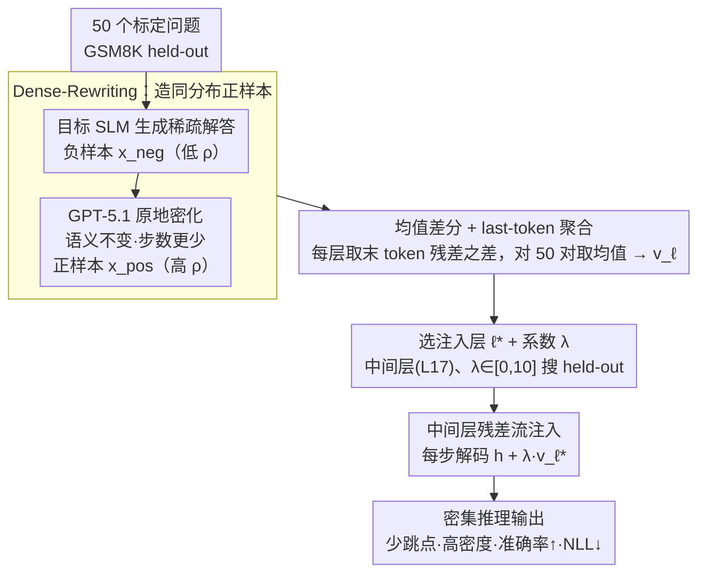

# DenseSteer: Steering Small Language Models towards Dense Math Reasoning

**会议**: ICML 2026  
**arXiv**: [2605.29247](https://arxiv.org/abs/2605.29247)  
**代码**: https://github.com/oyy2000/DenseSteer  
**领域**: LLM推理 / 小模型 / 激活引导  
**关键词**: dense reasoning, steering vector, 小语言模型, GSM8K, 推理时干预

## 一句话总结
观察到强模型 CoT 步数更少但每步信息密度更高（Dense Reasoning），DenseSteer 用 GPT-5.1 把小模型自己的稀疏解答改写成"信息更密"的同分布正样本，与原解答构成对比对，在中间层（≈ L17）残差流注入一条均值差分得到的 steering vector，零训练即可在 GSM8K / MATH500 / AMC / AIME 等数学基准上稳定涨点且不抬高 token-level NLL。

## 研究背景与动机

**领域现状**：让小语言模型（SLM, ≤ 3B）也能多步数学推理的主流路线是知识蒸馏：用大模型生成长 CoT，再去微调小模型（Short / Long CoT, Mix-Long, Mix-Large 等）。

**现有痛点**：（1）蒸馏要数千条 teacher 样本 + 训练资源；（2）更关键的是"learnability gap"——小模型吃不下强 teacher 的 trace，token-level NLL 显著抬高，反而出现 distribution mismatch。文中 Figure 3(a) 直接量化：Qwen2.5-7B 同族 trace 在 Qwen2.5-3B 上的 NLL 都高于 self-likelihood，跨族（Llama-3.2-8B → Qwen2.5-3B）更高。

**核心矛盾**：想从大模型借推理能力，又不想偏离小模型自身的生成先验。Steering Vector 这条推理时干预路线虽然轻量（50 对样本就够），但如果直接拿大模型 hidden state 当正样本，就会把目标模型推到自己语言流形之外，导致输出崩坏。

**本文目标**：找到一种"同分布正样本"——它既携带强模型那种更优的推理结构，又落在目标小模型自己的生成先验里。

**切入角度**：作者在 Qwen2.5 家族上做经验观察（Figure 1）——更强的模型推理步骤数 $N_\text{steps}$ 反而**更少**，但每步 token 数 $\rho = N_\text{tokens} / N_\text{steps}$ **更大**。这说明"强推理"的结构特征是 **Dense Reasoning**：少跳点、每跳信息密度高，从而减少中间错误累积。

**核心 idea**：与其用 alien teacher 当正样本，不如让 GPT-5.1 把小模型**自己**的稀疏解答最小改写成"语义不变、密度更高"的 dense 版本（Dense-Rewriting），与原稀疏版构成 in-distribution 对比对，从中提取均值差分作为 steering vector，在中间层残差流注入即可。

## 方法详解

### 整体框架
DenseSteer 想给小模型（≤3B）补上"强模型那种少跳点、每步信息密度高"的推理结构，但全程不动一个参数。它先拿 50 个标定问题让目标 SLM 自己生成稀疏解答作负样本 $x_\text{neg}$，再让 GPT-5.1 把这些解答"原地密化"成语义不变、步骤更紧的正样本 $x_\text{pos}$；这一对密/疏样本在每层残差流的激活之差求平均，就得到一条"指向 dense reasoning"的方向向量；推理时把它按系数 $\lambda$ 持续加到中间某层 $\ell^*$ 的残差流上，引导解码朝密集方向走。整条链路只需 50 对样本做 calibration，没有任何梯度更新。

### 关键设计

**1. Dense-Rewriting：用模型自己的话造同分布正样本**

这是 DenseSteer 区别于一切"拿大模型 trace 当正样本"方法的根本点。作者先把"好推理"操作化成一个可度量、可改写的结构量——Reasoning Density $\rho = N_\text{tokens} / N_\text{steps}$（步数以双换行分隔），强模型恰恰是 $\rho$ 更大、$N_\text{steps}$ 更少。直接借强 teacher 的 trace 当正样本看似省事，却会撞上 learnability gap：7B/8B teacher 的解答在 3B 模型上的 token-level NLL 反而高于模型自身似然，正样本落到了目标模型语言流形之外。DenseSteer 的解法是让 GPT-5.1 在保持语义和正确性的前提下，把目标 SLM **自己**的解答合并冗余步骤、提高单步信息量，得到 $x_\text{pos}$，原解答即 $x_\text{neg}$。Figure 3(b) 证实这种 rewrite 的 NLL 接近 self-likelihood baseline、远低于同族 7B trace——既保证了分布兼容，又把"少而密"这条结构信号干净地注进了对比对里。

**2. 均值差分 + last-token 聚合提取 steering vector**

有了 50 对密/疏样本，下一步要把它们压成每层一条可注入的方向向量 $v_\ell$。难点在于 dense 与 sparse 长度不一，逐 token 对齐会引入噪声。DenseSteer 对每个样本只取**最后一个 token** 在层 $\ell$ 的残差激活 $h_\ell(x)[-1]$ 作 sequence-level 摘要，再对全部 $N=50$ 对取均值差分：

$$v_\ell = \frac{1}{N}\sum_{i=1}^{N}\bigl(h_\ell(x_\text{pos}^{(i)})[-1] - h_\ell(x_\text{neg}^{(i)})[-1]\bigr)$$

这套 Mean Difference 继承自 Panickssery 等人的 CAA，胜在简洁——在 50 对这种极度有限的数据下，逐 token 对齐或全序列池化都不稳，而 last-token 摘要 + 均值差分仍能稳定刻画"dense vs sparse"的主导方向。

**3. 中间层 + 适中 $\lambda$ 的残差流注入**

向量提好后，推理时每个解码步执行 $\tilde h_{\ell^*, t} = h_{\ell^*, t} + \lambda \cdot v_{\ell^*}$，$\lambda$ 在 $[-20, 20]$ 的 held-out 集上搜。注入层 $\ell^*$ 的选择是成败关键：层敏感性分析（Figure 4）显示早层（L6）几乎无响应，因为它学的是低级特征、对"推理结构"这种高阶属性不敏感；后层（L27/L35）离 logits 太近，干预会与已成型的输出轨迹冲突，引发补偿性啰嗦甚至增 token；唯有中间层（L16/L17）对步数和总 token 数控制最强、最稳定。这与 Templeton 等人 Scaling Monosemanticity 报告的"高级语义特征聚集在中间层"一致，所以中间层天然适合承载"推理密度"这种结构方向。Figure 5/6 进一步显示 L17 在 $\lambda \in [0,10]$ 内 accuracy 单调升、NLL 单调降。

### 损失函数 / 训练策略
**无任何训练**。仅有的"超参搜索"是在 GSM8K 训练子集上为每个目标模型挑 $\ell^*$ 和 $\lambda$。生成端固定贪心解码、max length 2048。Calibration 集 50 题，与评测集不重叠。

## 实验关键数据

### 主实验

Qwen-2.5-3B-Instruct 上跨 5 个数学基准（GSM8K / MATH500 / AMC / Olympiad / AIME，Avg. 为样本加权）：

| 方法 | GSM8K | MATH500 | AMC | Olympiad | AIME | Avg. |
|------|-------|---------|-----|----------|------|------|
| Zero-shot CoT | 83.6 | 63.0 | 42.5 | 20.0 | 0.0 | 61.2 |
| Prompt Engineering (dense style) | 20.0 | 32.8 | 30.0 | 9.8 | 6.7 | 19.8 |
| Short CoT (蒸馏) | 79.9 | 58.6 | 30.0 | 18.1 | 6.7 | 57.8 |
| Long CoT (蒸馏) | 82.5 | 49.8 | 25.0 | 12.7 | 0.0 | 55.9 |
| Mix-Large (最强蒸馏) | 83.7 | 61.6 | 37.5 | 21.0 | 6.7 | 61.3 |
| InFamilySteer（7B trace 当正样本） | 85.3 | 59.8 | 37.5 | 20.0 | 0.0 | 61.4 |
| **DenseSteer（本文）** | 84.8 | **64.6** | **42.5** | 20.7 | **10.0** | **62.5** |

Llama-3.2-3B-Instruct 上 DenseSteer Avg. 52.7，与最强蒸馏 Mix-Long（54.2）持平，但**无需任何训练 + 仅 50 对样本**（蒸馏要 2000+ 条 teacher 样本）。

### 消融 / 分析

| 配置 | 关键指标 | 说明 |
|------|---------|------|
| Layer = L6（早层）| 步数 / token 几乎不随 $\lambda$ 变 | 早层学低级特征，对推理结构不敏感 |
| Layer = L17（中间层）| 步数、token 单调下降；accuracy 单调升 | 最佳注入点，$\lambda \in [0,10]$ 稳定增益 |
| Layer = L35（后层）| 步数 / token 反而上升，accuracy 不稳 | 与已成型输出轨迹冲突，引发补偿性啰嗦 |
| Prompt Engineering（同 prompt 不做 steering） | Avg. 19.8 vs DenseSteer 62.5 | 小模型读不懂复杂 rewrite prompt，直接跳过 CoT 出答案 |
| InFamilySteer（用 7B trace 当 pos）| Avg. 61.4 | 与 DenseSteer 接近，验证 NLL 选样策略有效；但需要更大同族模型 |
| LogiQA（OOD 逻辑推理） | 44.22 → 58.22 (DenseSteer) / 60.22 (InFamilySteer) | "dense reasoning" 不局限数学，可迁移逻辑推理 |
| MMLU / BBH CoT / HotpotQA | 与 baseline 持平（64.62 / 54.05 / 45.87） | 通用任务无明显退化，干预副作用可控 |

### 关键发现
- **同分布 > 强 teacher**：Dense-Rewriting 的 NLL 接近 self-likelihood，而同族 7B trace 的 NLL 反而更高（Figure 3）；这直接量化了"learnability gap"，也解释了为何 DenseSteer 在 AIME 等难题上反超所有蒸馏基线。
- **中间层是结构干预的甜点**：L17 干预下 accuracy 单调升、NLL 单调降，与 Templeton 等人关于中间层富含高级语义特征的发现一致。
- **prompt 工程在小模型上几乎崩盘**（Avg. 19.8）：同样的"dense"指令以 prompt 形式给 3B 模型，会直接让它跳过 CoT。这说明**结构信号必须在表征层注入，不能靠文本指令**——这是 representation-level 干预相对 prompt 干预的本质优势。

## 亮点与洞察
- **"借结构而不借分布"** 是这篇最值得抄的范式：teacher 模型用来定义"什么是好"，但正样本必须由 student 自己产出。这条思路可推广到 alignment、style transfer、安全性等任何受限于 learnability gap 的小模型场景。
- **Reasoning Density $\rho = N_\text{tokens} / N_\text{steps}$** 是个非常便宜的代理指标——只需数双换行就能算，却抓住了"少跳点高信息量"的结构特征。可以直接搬到 RL reward shaping、过滤蒸馏数据、CoT 质量评估等任务上。
- **NLL 当作"分布兼容性"过滤器**：用目标模型对候选正样本打 NLL，挑低 NLL 的当 pos，这条选样准则可以替换任何 steering 方法里的"对比样本筛选"环节。

## 局限性 / 可改进方向
- 作者承认：DenseSteer 只能重组**已经潜伏**在模型里的推理能力，不能注入新知识或新技能；对需要补事实/补能力的题无效。
- 主要在数学推理 + 少量逻辑推理上验证，更复杂多步任务（代码、agent 规划、多模态推理）和更大模型族（>8B）的迁移仍待补。
- Dense-Rewriting 依赖商用 GPT-5.1 来改写，把"对 teacher 的依赖"从训练侧搬到了正样本构造侧；如果用开源模型自蒸馏改写、或者训练一个小 rewriter，会更彻底地实现"无外部依赖"。
- 主结果只挑了 N=50、greedy decoding 的最佳 $(\ell^*, \lambda)$，对采样解码、temperature > 0 场景没报告；steering vector 在更长 reasoning trace（如 R1 风格 8k+ token）下是否稳定也无验证。

## 相关工作与启发
- **vs CAA (Panickssery et al., 2024)**：CAA 用行为/语义对立样本（如安全 vs 不安全）做对比对，DenseSteer 改成"同一解答的稀疏 vs 密集改写"，把对比信号从"语义对立"转到"结构对立"，并用 NLL 显式做分布兼容性筛选——这是核心方法学差异。
- **vs SEAL (Chen et al., 2025a)**：SEAL 也是 training-free steering，但方向是"steer **away from** 冗余反思与过渡模式"（减法）；DenseSteer 是"steer **towards** dense reasoning subspace"（加法），且对比对构造方式完全不同。
- **vs 知识蒸馏（Short / Long CoT, Mix-Large 等）**：蒸馏要 2000+ teacher 样本 + GPU 训练；DenseSteer 50 对样本 + 推理时一次加法，accuracy 仍能匹配甚至超过最强蒸馏基线，揭示"推理结构"很大程度上是 representation-level 的方向问题而非参数问题。
- **vs Skip-Thinking (Chen et al., 2025b) / Phi-4-Mini-Reasoning**：这两者通过设计训练数据（chunked CoT、定制 recipe）来达到"密集推理"；DenseSteer 把同样的结构目标搬到了推理时，且不动参数。

## 评分
- 新颖性: ⭐⭐⭐⭐ 把 steering vector 的对比对从"语义对立"改成"自我密化对立"，并用 NLL 做分布兼容性筛选，是一个干净且可推广的新设定。
- 实验充分度: ⭐⭐⭐⭐ 覆盖 2 个模型族 × 3 个尺度 × 5 个数学基准 + OOD 逻辑/通用任务，层与 $\lambda$ 敏感性分析齐全；但只有贪心解码、未报 variance。
- 写作质量: ⭐⭐⭐⭐ 动机—观察—方法链条非常顺，Figure 3 的 NLL 对比把"learnability gap"做成可视化论据，说服力强。
- 价值: ⭐⭐⭐⭐ 给小模型推理增强提供了一个"50 对样本 + 零训练"的实用基线，对 deployment 友好；"借结构不借分布"的方法学也值得推广到 alignment / style control 等场景。

<!-- RELATED:START -->

## 相关论文

- [\[ACL 2026\] RSAT: Structured Attribution Makes Small Language Models Faithful Table Reasoners](../../ACL2026/llm_reasoning/rsat_structured_attribution_makes_small_language_models_faithful_table_reasoners.md)
- [\[AAAI 2026\] Small Language Models for Efficient Agentic Tool Calling: Outperforming Large Models with Targeted Fine-tuning](../../AAAI2026/llm_reasoning/small_language_models_for_efficient_agentic_tool_calling_outperforming_large_mod.md)
- [\[ACL 2026\] LegalDrill: Diagnosis-Driven Synthesis for Legal Reasoning in Small Language Models](../../ACL2026/llm_reasoning/legaldrill_diagnosis-driven_synthesis_for_legal_reasoning_in_small_language_mode.md)
- [\[ICLR 2026\] Efficient Test-Time Scaling for Small Vision-Language Models](../../ICLR2026/llm_reasoning/efficient_test-time_scaling_for_small_vision-language_models.md)
- [\[ICML 2026\] ToolMATH: A Math Tool Benchmark for Realistic Long-Horizon Multi-Tool Reasoning](toolmath_a_math_tool_benchmark_for_realistic_long-horizon_multi-tool_reasoning.md)

<!-- RELATED:END -->
