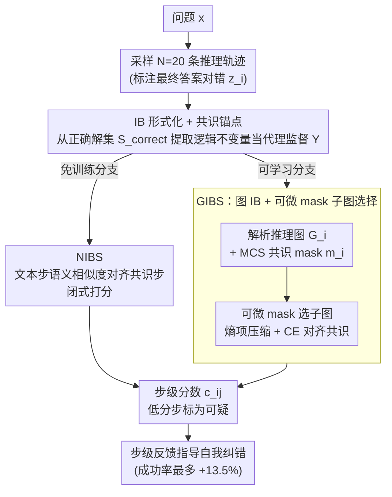

# Diagnosing Multi-step Reasoning Failures in Black-box LLMs via Stepwise Confidence Attribution

**会议**: ICML2026  
**arXiv**: [2605.19228](https://arxiv.org/abs/2605.19228)  
**代码**: https://anonymous.4open.science/r/ICML_2026_step_wise-2D45  
**领域**: LLM推理 / 置信度估计 / 推理诊断  
**关键词**: 步骤级置信度, 信息瓶颈, 共识图, 黑盒LLM, 自我纠错

## 一句话总结
本文把"找出 CoT 推理链里哪一步出错"形式化为黑盒场景下的步级置信度归因问题，用信息瓶颈原则把"同一问题多次采样得到的正确推理轨迹"压成共识结构，分别给出免训练的 NIBS（语义共识对齐）和可学习的 GIBS（图共识子图选择）两种实例，在 GSM8K / Math / MoreHopQA 上稳定优于白盒基线，并用步级反馈把自我纠错成功率提升最多 13.5%。

## 研究背景与动机

**领域现状**：长链推理（CoT / GoT）已成为 LLM 解题的主流形态。要判断一条推理链是否可信，业界主要走两条路：一条是收集人工的逐步标注训练 Process Reward Model（PRM800K、Math-Shepherd 等），另一条是直接让 LLM 自评（LLM-as-judge）；置信度估计（CE）则提供了第三条路，但绝大多数 CE 方法只针对最终答案，给出的是"整条链对不对"，不能定位"第几步错了"。

**现有痛点**：少数尝试做步级 CE 的工作（LeCo、SL(norm) 等）需要拿到 token 级 logits 或熵，本质上是白盒方法，对 GPT-4o / Claude 这类闭源 API 不可用。把答案级 CE 简单拆到每一步会面临一个新难题：同一问题的正确解法在表述顺序、分步粒度上可以差别很大（图 1 中 B、C 两条不同顺序的解都正确），naïve 的相似度比较会把"合理变异"误判成"错误"。

**核心矛盾**：黑盒约束下只有生成的文本可用，且必须区分"合法变异"和"真错"——前者只是表面差异、后者是逻辑偏离。

**本文目标**：在仅有生成轨迹和最终答案对错标签的前提下，给每个推理步打一个反映"对最终正确性的贡献"的可靠性分数。

**切入角度**：作者观察到正确解虽然顺序可变，但都会经过若干"逻辑不变量"（如数学题里中间费用、多跳 QA 里关键实体值）；错误解则会偏离这种共识结构。于是可以把"对多条正确轨迹求共识 → 与共识对齐程度即置信度"作为代理信号。

**核心 idea**：用信息瓶颈 $\min_Z I(T_i;Z) - \beta I(Z;Y)$ 形式化"压缩冗余表述、保留与正确性相关的共识子结构"这一直觉，$Y$ 由从正确轨迹聚合出的共识锚点近似。

## 方法详解

### 整体框架
给定问题 $x$，先用温度 1.0 从 LLM 采样 $N=20$ 条推理轨迹 $\mathcal{S}=\{(T_i, A_i, z_i)\}$，$z_i\in\{0,1\}$ 来自最终答案是否与 gold 匹配（数学题用 exact match，QA 用 GPT-4o judge）。然后 pipeline 分三段：(A) 把每条文本轨迹解析成有向推理图 $G_i=(V_i,E_i)$，节点 $v_{ij}$ 是中间结果、边 $e_{ij}$ 是子问题/操作（用 LangFun 风格 prompt + 规则解析）；(B) 从 $\mathcal{S}_{\text{correct}}$ 聚合出"共识锚点"——NIBS 直接做语义相似度集合，GIBS 计算 Maximum Common Subgraph 得到 mask $\mathbf{m}_i$；(C) 用 IB 目标产出步级分数 $c_{ij}$，分数低的步被标为可疑。两种实例由"是否用图结构"分叉：免训练的 NIBS 只比文本步语义相似度，可学习的 GIBS 在推理图上做可微子图选择。

### 关键设计

**1. IB 形式化 + 共识锚点：把不可观测的步级标签换成可算的代理信号**

黑盒约束下没有任何 token 概率可用，更没有"第几步对不对"的逐步标注，IB 目标 $\min_Z I(T_i;Z) - \beta I(Z;Y)$ 里的监督变量 $Y$ 因此根本观测不到。作者的破局点是：同一问题反复采样后，正确解尽管表述顺序千变万化，却几乎都会经过同一批"逻辑不变量"（数学题里的中间费用、多跳 QA 里的关键实体值）。于是把 $Y$ 替换成从 $\mathcal{S}_{\text{correct}}$ 聚合出的"共识锚点"——几乎所有正确解都经过的步或子结构。在这个代理下，压缩项 $I(T_i;Z)$ 推动只保留少量关键步、丢掉冗余表述，相关项 $I(Z;Y)$ 则推动保留下来的步必须与共识对齐。相比现有 PRM 路线要靠昂贵的人工步级标注、LLM-as-judge 又会把自身偏差带进打分，"多次采样后正确解的共识"这种群体监督零人工成本，而且天生只用文本就能拿到，正好契合黑盒 + 仅有答案对错标签的设定。

**2. NIBS：免训练的非参数共识对齐，作为 IB 的封闭式近似**

如果不想训练，可以把 $Z$ 直接取成"出现在多条正确解里的步集合"，此时 IB 解退化成一个闭式打分：对轨迹 $T_i$ 的每个步 $t_{ij}$，置信度就是它和正确解里各步语义相似度的期望

$$c_{ij}=\mathbb{E}_{S\sim\mathcal{S}_{\text{correct}}}\big[\text{Agg}\big(\{\text{sim}(\mathbf{t}_{ij},\mathbf{t}')\mid\mathbf{t}'\in S\}\big)\big]$$

其中相似度 $\text{sim}$ 可选 BERT cosine 或 NLI entailment，聚合 $\text{Agg}$ 取 max 或 mean，整套算法没有任何待训参数。它一方面充当强基线，验证"共识程度即置信度"这个假设本身就已经携带很强的信号（实验里 NLI-Max 已经把白盒 P(true)/Entropy/LECO 甩开一倍以上）；另一方面给出在完全没有训练预算时也能直接对 GPT-4o / Claude 这类 API 部署的简单方案。

**3. GIBS：图 IB + 可微 mask 的子图选择，补回结构依赖**

NIBS 只比词面相似，忽略了一件事：两个语义接近却在推理图里位置完全不同的步，不该被一视同仁地判为"对齐"。GIBS 因此先把每条轨迹解析成有向推理图 $G_i$，再把置信度 $Z$ 实例化成一张软子图 $G^*=G_i\odot \mathbf{p}_\theta$，选择概率 $\mathbf{p}_\theta$ 由 BERT 步特征与 2 层 GCN 结构特征融合后预测。共识监督则来自 $G_i$ 与每张正确图的 Maximum Common Subgraph 聚合成的 mask $\mathbf{m}_i$。直接对离散子图求互信息既组合爆炸又不可微，作者用变分上界把目标松弛成

$$\mathcal{L}=H(\mathbf{p}_\theta)+\lambda\,\text{CE}(\mathbf{p}_\theta,\mathbf{m}_i)$$

熵项一肩挑起"压缩 + sparsity"，把每个 $p_{\theta,ij}$ 往 0/1 两端推，省掉额外的 sparsity 超参；CE 项则承担相关性，逼软 mask 贴近 MCS 共识。推理时直接取 $c_{ij}=p_{\theta,ij}$ 作为步级分数。GCN 引入的结构上下文让模型学到的是"逻辑依赖模式"而非孤立词面，这也是它在跨数据集 OOD 测试里仍稳过 NIBS 与白盒基线的根源。

### 损失函数 / 训练策略
GIBS 在 2000 个推理图上训练，损失即式 (6) 中熵项 + CE 项；变分先验取独立 Bernoulli($\epsilon<0.5$)。推理时对每个数据集平均 10000 条轨迹评测。NIBS 完全免训练。

## 实验关键数据

### 主实验

3 个 LLM（Llama3.1-8B、DeepSeek-R1-Distill-Qwen-32B、Phi4-Reasoning）× 3 个数据集（GSM8K、MoreHopQA、Math），4 个指标（AUROC↑、AUCPR↑、ACC@80%↑、ECE↓），GIBS 在 9 个 AUROC 配置里拿下 7 个最优。

| 数据集 | LLM | 最强白盒基线 (AUROC) | NIBS 最优 (AUROC) | GIBS (AUROC) |
|--------|------|----------------------|-------------------|--------------|
| GSM8K | Phi4-Reasoning | NLI-Max 0.660 | NLI-Max 0.660 | **0.789** |
| MoreHopQA | DeepSeek-R1-32B | NLI-Max 0.666 | NLI-Max 0.666 | **0.808** |
| Math | Phi4-Reasoning | Cos-Mean 0.612 | Cos-Mean 0.612 | **0.695** |
| GSM8K | Llama3.1-8B | NLI-Max 0.710 | NLI-Max 0.710 | 0.691 |

NIBS（特别是 Cos-Mean / NLI-Max）已经显著超过 P(true)、Entropy、LECO 这类白盒方法；GIBS 在更复杂的 Math 和多跳 MoreHopQA 上提升尤为明显。

### 消融实验
Phi4-Reasoning，AUROC：

| 配置 | GSM8K | MoreHopQA | Math | 说明 |
|------|-------|-----------|------|------|
| Full GIBS | 0.789 | 0.662 | 0.695 | 含 edge encoder + graph encoder |
| w/o Graph Encoder | 0.723 | 0.648 | 0.596 | 丢失全局结构，Math 跌 0.10 |
| w/o Edge Encoder | 0.519 | 0.376 | 0.476 | 丢边几乎崩溃，证明逻辑边是核心信号 |

共识来源消融（GIBS, MoreHopQA AUROC）：Correct-only 0.808 > Self-consistency 0.784 > All trajectories 0.648——伪标签质量与最终性能强相关（Phi4 上 self-consistency 与 gold 重合 ~80% 故掉点小；Llama3.1-8B 重合仅 ~28% 故掉点大）。

### 关键发现
- **边编码比节点更关键**：去掉 edge encoder 在三个数据集 AUROC 平均跌 0.26，远大于去掉 graph encoder 的 0.07，说明"步与步之间的逻辑依赖"才是判定"是否属于共识结构"的决定性特征。
- **正确解 MCS 集中在 0.8、错误解集中在 0.4**（图 3 在 1000 张图上的统计），直接给"共识=正确性"假设提供了经验支持。
- **步级反馈显著强于答案级反馈**：在 MoreHopQA 上对初始答错样本做一次自我修正，GIBS 步级反馈把成功率最多提升 13.5%，强推理模型（DeepSeek-R1、Phi4）增益更大——因为它们能更好地利用定位信号。
- **OOD 鲁棒性**：在 MoreHopQA 训练、Math 直接测，GIBS 仍优于 NIBS 和白盒基线，作者归因于 IB + 图结构学到的是"抽象推理模式"而非数据集词汇。

## 亮点与洞察
- 把"步级置信度归因"这一问题在黑盒场景下首次形式化，并用 IB 给出一个干净的优化目标，比"训 PRM"和"让 LLM 自评"都更轻量。
- "用多次采样的正确解共识替代不可观测的步级标签"是一个非常可移植的 trick——任何"目标变量只在序列级可见、想做序列内部归因"的问题（生成质量评估、agent trajectory 评分、RL credit assignment）都可以借鉴。
- 免训练的 NIBS 在 GSM8K Llama3.1-8B 上 NLI-Max AUROC=0.710，已经把白盒 P(true)（0.40）、Entropy（0.41）、LECO（0.39）甩开一倍以上——这个数字本身就说明"白盒 token 概率与步逻辑正确性相关性不强"，反而是"多轨迹共识"这种群体信号更可靠。
- 变分 IB 用熵项同时承担"sparsity + 二值化"双重角色，避免引入额外 sparsity 超参，工程上很优雅。

## 局限与展望
- 依赖 $N=20$ 次采样，单条问题推理成本提高一个量级，对 API 调用费/延迟敏感的部署场景代价不小。
- 共识锚点的质量上限决定了方法的天花板——当问题特别难、20 条轨迹里几乎没有 correct 解（论文也在 Llama3.1-8B 上观察到 self-consistency 与 gold 重合仅 28%），方法会显著退化。
- 推理图的构造依赖 LangFun 风格 prompt + 规则解析，泛化到自由文本 / 非结构化推理（如对话、open-ended 写作）仍需重新设计 parser。
- 评估只覆盖可客观打分的任务（数学 + 多跳 QA）；对没有 gold answer 的开放任务（创意写作、长文摘要）这套范式如何迁移作者只在 5.5 给了初步的 self-consistency 替代方案。
- 后续可探索：把步级置信度反馈进训练 loop（做 token-level RL credit）、用更便宜的 LLM 充当 N-1 条采样者降本。

## 相关工作与启发
- **vs PRM 路线（PRM800K, Math-Shepherd）**：他们靠人工/合成的步级标注训分类器，本文用"采样共识"代替标注，零人工成本但需要多次采样；GIBS 在他们的 PRM800K 上也跑了实验（附录 F）并取得强结果，说明并不是"只能靠人标"。
- **vs LLM-as-judge（Weng 2023, Li 2024）**：让 LLM 自评会继承 judge 自身偏差且对相同问题输出不稳定，本文用群体一致性作为更客观的代理。
- **vs 白盒步级 CE（LeCo, SL(norm), Token Entropy）**：他们需要 logits，本文完全黑盒；实验表明白盒 token 信号在"步级逻辑正确性"上其实预测力很弱，远不如基于群体共识的语义/结构信号。
- **vs 图式推理（Graph-of-Thought, GraphReason）**：他们关注用图组织推理过程本身，本文把图当成"对齐共识结构"的工具，正交但可叠加——可以在 GoT 推理基础上接 GIBS 做诊断。

## 评分
- 新颖性: ⭐⭐⭐⭐ 第一个把黑盒步级 CE 形式化为 IB + 共识对齐，"用多采样共识替代步级标签"思路很灵巧。
- 实验充分度: ⭐⭐⭐⭐ 3 LLM × 3 数据集 × 4 指标 + 消融 + label-free 替代 + OOD + PRM800K 验证，覆盖较全。
- 写作质量: ⭐⭐⭐⭐ IB 推导清晰，图 1 的 A/B/C 例子直观，工程细节（mask 二值化解读、变分先验选取）解释到位。
- 价值: ⭐⭐⭐⭐ 步级反馈把自我纠错提升 13.5% 是个有吸引力的下游收益，方法 API-only 也能跑，落地门槛低。

<!-- RELATED:START -->

## 相关论文

- [\[NeurIPS 2025\] Self-Evaluating LLMs for Multi-Step Tasks: Stepwise Confidence Estimation for Failure Detection](../../NeurIPS2025/llm_reasoning/self-evaluating_llms_for_multi-step_tasks_stepwise_confidence_estimation_for_fai.md)
- [\[ICML 2026\] Inducing Overthink: Hierarchical Genetic Algorithm-based DoS Attack on Black-Box Large Language Reasoning Models](inducing_overthink_hierarchical_genetic_algorithm-based_dos_attack_on_black-box_.md)
- [\[ICML 2026\] Inference Time Optimization with Confidence Dynamics](inference_time_optimization_with_confidence_dynamics.md)
- [\[ACL 2026\] Merlin's Whisper: Enabling Efficient Reasoning in Large Language Models via Black-box Persuasive Prompting](../../ACL2026/llm_reasoning/merlin39s_whisper_enabling_efficient_reasoning_in_large_language_models_via_blac.md)
- [\[ICML 2026\] MOSAIC: Learning When to Act or Refuse — Guarding Agentic Reasoning Models for Safe Multi-step Tool Use](learning_when_to_act_or_refuse_guarding_agentic_reasoning_models_for_safe_multi-.md)

<!-- RELATED:END -->
