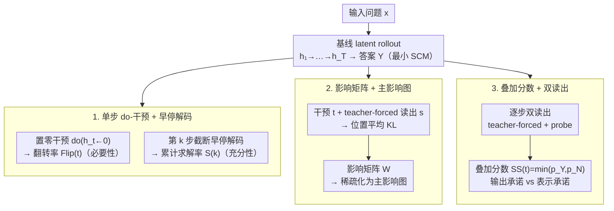

# Dynamics Within Latent Chain-of-Thought: An Empirical Study of Causal Structure

**会议**: ICML 2026  
**arXiv**: [2602.08783](https://arxiv.org/abs/2602.08783)  
**代码**: https://github.com/J1mL1/causal-latent-cot  
**领域**: LLM推理 / 可解释性  
**关键词**: 隐式思维链, 因果干预, do-intervention, 结构因果模型, Coconut, CODI

## 一句话总结
作者把 latent CoT 看作一个可干预的结构因果模型（SCM），对每个连续"思考步"做 step-wise `do`-intervention + 早停解码 + teacher-forced 读出，系统量化 Coconut/CODI 在数学和常识推理上的步级必要性、传播结构与轨迹叠加性，发现 latent step 并不是同质化的"加深"，而是高度异质、非局部路由、且输出层早承诺先于表示层承诺的结构化界面。

## 研究背景与动机
**领域现状**：显式 CoT 虽然在 GSM8K、CommonsenseQA 等推理任务上效果显著，但解码代价大、输出冗长、还可能是事后合理化（post-hoc rationalization）而非真正反映模型计算。为缓解这些问题，Coconut、CODI、Sim-CoT 等方法把"逐 token 思考"替换成在连续表征空间里跑 T 步隐式思考（latent CoT），用最后一层隐状态当下一步输入，最后再解码答案。

**现有痛点**：latent CoT 的中间计算不再是离散、可读、可编辑的 token，传统的"删段落 / 改 rationale / shuffle"这一套针对显式 CoT 的可解释性手段完全失效；现有评测最多只能用 probe 看相关性，但 probe 高激活既可能反映"模型真在用这一步"，也可能只是"信息恰好被线性可分"。

**核心矛盾**：相关性方法既无法回答"这一步是不是真的对最终答案有因果作用"，也无法刻画"信息在 T 步之间如何流动"，更分不清"输出早早偏向 Yes 是不是意味着表示已经塌缩"。本质上缺一个干预（intervention）层面的因果框架。

**本文目标**：给 latent CoT 建立 step-resolved 的因果评测，回答三个问题——(RQ1) 哪些 latent 步对正确性是因果必需的、答案在第几步开始可解码；(RQ2) 步与步之间的影响如何传播、是否还像显式 CoT 那样近似链式；(RQ3) 中间轨迹是否同时保留多种候选答案模式，输出层承诺和表示层承诺之间差多远。

**切入角度**：把每一个 latent state $h_t$ 当作 SCM 中的变量，$do(h_t \leftarrow \tilde h_t)$ 直接覆写它再让下游按原始 transition 重算，配合 teacher-forced 读出量化效应——这是经典因果中介分析在连续思考轨迹上的自然推广。

**核心 idea**：用 `干预 + 读出`（intervention + readout）的统一协议，把 latent CoT 从"黑盒深度"重铸为"可操纵的因果系统"，从而把"步级必要性 / 传播结构 / 叠加-承诺"三个问题放进同一个可复现的实验框架。

## 方法详解

### 整体框架
评测协议如 Figure 2 所示，建模一个最小 SCM：

$$\text{(隐藏)}\; H_t = f_t(H_{<t}, x, \epsilon_t; \theta), \quad t=1,\dots,T; \qquad \text{(输出)}\; Y = g(H_{1:T}, x, \epsilon_y; \theta).$$

对一个 prompt $x$，标准 propagation 给出基线轨迹 $h_{1:T}$ 和答案 $y$；在此基础上构造三类反事实：

1. **早停解码**：在第 $k$ 步截断 latent 计算，直接从 $h_k$ 解码，用于检测"答案最早何时可读"；
2. **单步干预**：$do(h_t \leftarrow \tilde h_t)$（论文统一用 $\tilde h_t = \mathbf 0$ 的 zero intervention），保持下游 $f_{t'>t}$ 不变重新前推，得到 $\tilde y^{(t)}$；
3. **干预 + 早停读出**：在 $t$ 处干预、在 $s>t$ 处用 teacher forcing 读出，得到一对分布 $p_{\text{base}}^{(s)}$ 和 $p_{\text{do}(t)}^{(s)}$，两者之间的 KL 衡量 $t \to s$ 的影响强度。

实验对象是 Coconut 和 CODI 两类 latent reasoning 范式，分别跑在 GPT-2 / Llama3-1B / Qwen3-4B-Instruct 三个底座上；数据集为 GSM8K-Aug → GSM8K（数学）和 CommonsenseQA-CoT → CommonsenseQA（常识），RQ3 额外用 StrategyQA 的 Yes/No 二分判定。

### 关键设计

**1. 单步 `do`-干预 + 早停解码：测每步的必要性与答案最早可解码步**

针对的痛点是 probe 这类相关性指标分不清"这一步真在被用"还是"信息恰好线性可分"。做法很直接：对每个样本跑一条基线轨迹，再跑一条只把第 $t$ 步隐状态置零（$do(h_t \leftarrow \mathbf 0)$）的反事实轨迹，下游 transition 与 readout 完全不动，统计预测发生翻转的样本比例 $\mathrm{Flip}(t)$ 当作该步的决策依赖强度。早停那一支则定义最早正确步 $k_i = \min\{k: \hat y_i^{(\le k)} = y_i^*\}$ 和累计求解率 $S(k) = \frac{1}{N}\sum_i \mathbb{1}\{k_i \le k\}$，用 $S(k)$ 的爬升曲线刻画"给多少 latent 预算才够"。之所以选 zero intervention 而非别的扰动，是因为它在 GPT-2/Llama/Qwen 几个底座间最稳定、不会注入分布外噪声；之所以把"必要性"（干预后会不会翻）和"充分性"（早停后能不能读出）分开测，是为了避免把"答案已经可读"误当成"后面几步没用了"——两者其实是两件事。

**2. 影响矩阵 $W_{t,s}$ + 主影响图（Principal Influence Graph）：把"$t$ 步扰动如何传到 $s$ 步"画成一张有向加权图**

单点 flip rate 只能说"这一步关键不关键"，却答不出"信息在 T 步之间怎么流"，更分不清一个高杠杆步是自己重要还是某条远距离路由的中继。于是在"干预 + teacher-forced 读出"协议下定义样本级位置平均 KL $\mathrm{KL}^{(i)}_{t\to s} = \frac{1}{|y_i^*|} \sum_u \mathrm{KL}(p_{\text{base}}^{(s)}(\cdot\mid y^*_{i,<u}) \| p_{\text{do}(t)}^{(s)}(\cdot \mid y^*_{i,<u}))$，对样本取期望得到影响矩阵 $W_{t,s} = \mathbb E_i[\mathrm{KL}^{(i)}_{t\to s}]$，再用阈值 $\alpha = 0.1 \cdot \max(W)$ 加每节点 top-1 出边稀疏化，得到主影响图。对照侧把显式 CoT 生成的 rationale 切成 $T=6$ 段、用每段末 token 隐状态当匹配节点，从而和 latent 图同尺度比较；除可视化外还在归一化 $W$ 上算 locality / span / early-out / late-in 四个结构指标量化"布线形状"。这里坚持用 teacher-forced 读出而非采样解码，是为了压掉温度抖动、让 $W_{t,s}$ 真反映传播而不是噪声；论文也反复声明它只是"operator-specific empirical influence structure"，不是可识别的真实因果图，附录 C.4/C.5 还专门换干预算子和读出协议测了稳定性。

**3. 叠加分数（Superposition score）+ 双读出对比：分清"输出层早早偏向"和"表示层真正塌缩"差多远**

问题出在单看一种读出会得出相反结论——只看 teacher-forced 会觉得模型很早就承诺了一个答案，只看 probe 又会高估"中间步还在犹豫"。做法是在 StrategyQA 上对同一 prompt 做 $K$ 次随机 rollout，只保留 Yes / No 都出现过的"双模" prompt；在每个 latent 步 $t$ 用两种读出估两模式概率 $p_Y(t), p_N(t)$——(i) teacher-forced 模板打分、(ii) 在冻结 latent 上训练的轻量 probe，再用对称指标 $\mathrm{SS}(t) = \min(p_Y(t), p_N(t))$ 量叠加程度（两模都强时高、一边压倒另一边时趋零）。把两种读出并排看，才能把"分布层面的早偏向（output commitment）"和"表征里是否还藏着另一种答案（representational commitment）"切开——这正是全文最核心的概念区分。

### 损失函数 / 训练策略
本文不训练新模型，使用 CODI 官方权重 + Coconut 在三种底座上的复现；所有分析是 inference-only。Probe 是在冻结 latent 上训练的小线性分类器，用作 RQ3 的另一种读出。

## 实验关键数据

### 主结果：步级必要性与早停可解码性（RQ1）

| 设置 | 现象 | 数值/方向 |
|------|------|-----------|
| 单步置零干预 $\mathrm{Flip}(t)$ | 步间显著差异（非平坦） | GSM8K 上多数底座出现中段峰值 |
| 数据集对比 | 算术 vs 常识的决策波动 | GSM8K $\mathrm{Flip}\sim 0.1$–$0.2$，CommonsenseQA $<0.1$ |
| 范式对比 | 同底座 Coconut vs CODI | Coconut 翻转率更高，GSM8K 上尤其明显 |
| 底座强度 | 更强底座抑制翻转 | Qwen3-4B 显著低于 GPT-2，但 step-dependent 形状保留 |
| 早停 $S(k)$ | 数据集差异 | CommonsenseQA 前几步就饱和；GSM8K 一直涨到 $k=6$ |

### 消融/对照：传播结构（RQ2，GSM8K）

| 配置 | locality | span | late-in | 解读 |
|------|----------|------|---------|------|
| CoT-SFT (显式) | 均 $\ge 0.6$ | 低 | 低 | 近链式、相邻传播 |
| Coconut (隐式) | 显著更低 | 大 | 高 | 早→晚长程跳连主导 |
| CODI (隐式) | 较低 | 大 | 较高 | 偏离链式但 early→final 捷径不如 Coconut 极端 |

主影响图（Figure 5 vs Figure 6）直观验证：CoT-SFT 几乎只有相邻边；Coconut/CODI 充满跳过中间步的远距离边。

### 关键发现
- **causal leverage 高度异质**：单点 flip 形状在不同步上差异巨大，存在"高杠杆步"和"低杠杆步"，与"latent 就是同质加深"的直觉相悖。
- **latent CoT 不继承显式 CoT 的链式拓扑**：即便 Coconut/CODI 是从显式 CoT 蒸馏/压缩而来，影响结构仍系统性地变成 skip-dominant，说明 latentization 改了"内部布线"而不只是"表面格式"。
- **输出承诺早于表示承诺**：teacher-forced 读出显示模型很早就偏向一个答案，但 probe 读出显示中间步对另一答案仍有可解码支持，直到最后一步才陡降——"答案早可读"≠"表示已塌缩"。

## 亮点与洞察
- 把 latent CoT 的"可解释性"从相关性 probe 推进到干预-因果层面，这一框架天然能搬到 Sim-CoT / 任意 hidden-state 推理范式，附录 D 已经在 Sim-CoT 上跑通。
- "Phenomenon–mechanism–nature"三段论非常清爽：异质杠杆（现象）→ 非局部路由（机制）→ 输出早承诺 vs 表示晚承诺（本质）；这种把 RQ1/RQ2/RQ3 串成因果链的写法值得借鉴。
- 给出"latent budget 不是同质深度"的工程启示——意味着把 supervision、正则、停步规则按"功能角色"分配（而非每一步都用同一个 CoT imitation loss）可能是下一代 latent reasoning 的正确方向。
- Influence matrix 的"operator-conditioned"诚实声明很关键：作者明确说这不是可识别的真实因果图，只是固定干预/读出协议下的经验结构，这种克制比"我们发现了 latent 推理的真实结构"那种过度声明可信得多。

## 局限与展望
- 作者承认的局限：所有干预都用 zero intervention，更具语义的干预（如换成另一个同类样本的 $h_t$）只在附录 C.4 简短测过；影响图严重依赖 teacher-forced 读出，换成采样解码可能给出不同稀疏模式。
- 自身发现的局限：RQ3 只在 StrategyQA 二分场景上充分展开，GSM8K 的开放数值答案两模过滤太稀疏只能放附录；T=6 步是 Coconut/CODI 训练时定死的，没系统扫不同 budget 下结构是否质变；底座最大只到 Qwen3-4B，更大模型上"高杠杆步"是否退化未知。
- 改进方向：把"高杠杆步识别 + 高影响路由保护"做成 latent CoT 的正则项；针对"输出早承诺 vs 表示晚承诺"的缝隙设计 commitment-aware 停步策略；用更连续的干预族（线性插值、方向投影）量化 effect size 而不只是 KL。

## 相关工作与启发
- **vs Coconut / CODI / Sim-CoT**：本文不提新训练算法，只把它们当被试，提供了首个 step-resolved 因果评测协议。Coconut 用最后一层 hidden state 当下一步输入；CODI 用 self-distillation 把显式 CoT 蒸到连续空间——本文给出"两种范式产出的传播结构不同（Coconut 更 early→final，CODI 更分散）"这一定量证据。
- **vs 显式 CoT faithfulness 工作（Turpin 2023, Pruthi 2020）**：他们做 rationale 层面的删/换/序对比答案变化，本文把这套思路推到连续 hidden 层，对 latent CoT 给出可比的 faithfulness 度量。
- **vs causal mediation analysis（Vig 2020, Meng 2022, Conmy 2023）**：方法学共享 do-intervention 框架，但目标变成了"推理轨迹的步级结构"而不是"事实知识在哪一层"，并把效应聚合成有向影响矩阵这一新视角。
- **启发**：probe-vs-teacher-forced 读出对比 + superposition 指标可以直接搬到 RLHF 模型的"对齐塌缩"分析；influence matrix + principal graph 渲染也能用来比较 mixture-of-depths / early-exit 等其他变深机制的"内部布线"。

## 评分
- 新颖性: ⭐⭐⭐⭐ 首个把 SCM + do-intervention 系统应用到 latent CoT 的工作，框架级贡献清晰。
- 实验充分度: ⭐⭐⭐⭐ 两范式 × 三底座 × 两数据集 × 三 RQ，附录还测了换干预算子/读出/Sim-CoT/更大底座，覆盖面好。
- 写作质量: ⭐⭐⭐⭐⭐ "phenomenon–mechanism–nature"主线 + 三 RQ 串联非常清爽，结论克制且对设计启示有具体指向。
- 价值: ⭐⭐⭐⭐ 给出"latent budget 不是同质深度""输出承诺早于表示承诺"两个有工程含义的结论，能直接指导下一代 latent reasoning 的训练目标与停步策略。

<!-- RELATED:START -->

## 相关论文

- [\[ICML 2026\] Hidden Error Awareness in Chain-of-Thought Reasoning: The Signal Is Diagnostic, Not Causal](hidden_error_awareness_in_chain-of-thought_reasoning_the_signal_is_diagnostic_no.md)
- [\[ICML 2026\] A Formal Comparison Between Chain of Thought and Latent Thought](a_formal_comparison_between_chain_of_thought_and_latent_thought.md)
- [\[ICML 2026\] Stabilizing Recurrent Dynamics for Test-Time Scalable Latent Reasoning in Looped Language Models](stabilizing_recurrent_dynamics_for_test-time_scalable_latent_reasoning_in_looped.md)
- [\[ICML 2026\] How Far Ahead Do LLMs Plan? Uncovering the Latent Horizon in Chain-of-Thought Reasoning](how_far_ahead_do_llms_plan_uncovering_the_latent_horizon_in_chain-of-thought_rea.md)
- [\[ICML 2026\] Prioritize the Process, Not Just the Outcome: Rewarding Latent Thought Trajectories Improves Reasoning in Looped Language Models](prioritize_the_process_not_just_the_outcome_rewarding_latent_thought_trajectorie.md)

<!-- RELATED:END -->
