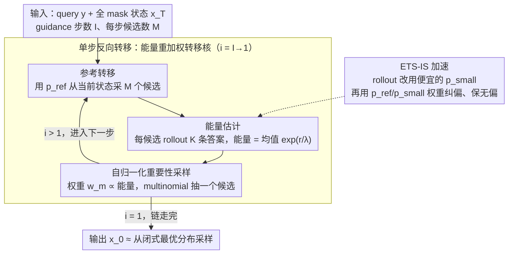

# ETS: Energy-Guided Test-Time Scaling for Training-Free RL Alignment

**会议**: ICML 2026  
**arXiv**: [2601.21484](https://arxiv.org/abs/2601.21484)  
**代码**: https://github.com/sheriyuo/ETS (有)  
**领域**: LLM 推理 / 测试时扩展 / 训练免对齐  
**关键词**: KL 正则 RL 闭式解、能量重加权、Monte Carlo、重要性采样、ARM/DLM 通用

## 一句话总结
ETS 直接从 KL 正则化 RLHF 目标的**闭式最优解**采样，把它写成「参考策略 × 指数 reward 的条件期望（能量项）」，再用 Monte Carlo + 自归一化重要性采样在测试时近似这个能量项，从而**不训练**就达到甚至超过经过 RL 后训练的策略，并通过 lightweight proposal + Fast-dLLM 把延迟控制在可用范围。

## 研究背景与动机

**领域现状**：RLHF / DPO / GRPO 已成 LLM 后训练标配，把模型对齐到「reward 高 + 不偏离参考策略 $p_{\text{ref}}$」。理论上这个 KL 正则目标早有 Rafailov 等给出的闭式解 $p(\boldsymbol{x}_0\mid\boldsymbol{y})\propto p_{\text{ref}}(\boldsymbol{x}_0\mid\boldsymbol{y})\exp(r/\lambda)$，但现有 RL pipeline 仍用梯度迭代去逼近。

**现有痛点**：训练版 RL 需要昂贵 reward model + 大量人类偏好、训练不稳定、超参敏感、reward 一改就得重训；且 Power Sampling / Quest 之类 MH 采样虽免训练却串行慢。

**核心矛盾**：「最优分布已知闭式」与「实际仍靠迭代训练逼近」之间存在巨大鸿沟 — 如果能在测试时**直接采样**那个闭式分布，所有训练问题就都消失了。

**本文目标**：(1) 给出统一 MLM 框架（含 ARM 和扩散语言模型 DLM）下闭式解的**反向 Markov 转移核**形式；(2) 设计 Monte Carlo 估计 + 加速器使其可用；(3) 给出收敛速率与误差累计的理论保证。

**切入角度**：把生成过程视作从 $\boldsymbol{x}_T\to\boldsymbol{x}_0$ 的反向 Markov 链（ARM 是固定左→右、DLM 是动态 unmask），在该框架下推导最优反向转移核会自然分解为「参考转移 × 能量项」。

**核心 idea**：在每个 guidance step 用候选采样 + 能量重加权 + 多项式抽样实现「沿反向链一步步走向最优分布」，避免任何参数更新。

## 方法详解

### 整体框架
ETS 不训练任何参数，而是把对齐这件事搬到推理时来做：它把 KL 正则 RLHF 的闭式最优解写成一条从 $\boldsymbol{x}_T$（全 mask）到 $\boldsymbol{x}_0$（成品答案）的反向 Markov 链，然后沿着这条链一步步采样，每走一步都用「能量」把候选往高奖励的方向重新加权。给定 query $\boldsymbol{y}$、guidance 步数 $I$、每步候选数 $M$，算法从 $i=I$ 反推到 $i=1$：先用参考策略 $p_{\text{ref}}$ 从当前状态 $\boldsymbol{x}_{t_i}$ 采出 $M$ 个候选 $\boldsymbol{x}_{t_{i-1}}(m)$，再给每个候选估一个能量值 $\widehat{\mathcal E}$，自归一化成权重 $w_m\propto\widehat{\mathcal E}$，最后按多项式分布抽一个候选当作下一步状态。链走完，$\boldsymbol{x}_0$ 就近似是从最优分布 $p(\boldsymbol{x}_0\mid\boldsymbol{y})$ 里抽出来的样本。值得注意的是当 $I=1,\lambda\to 0$ 时整个流程退化成 Best-of-N，所以 ETS 严格泛化了 BoN，而 $I$ 给了一个「把对齐拆成多步、逐步分摊误差」的更细旋钮。

### 关键设计

**1. 能量重加权反向转移核（Proposition 2）：把闭式最优解改写成逐步可采样的形式**

Rafailov 等给出的 RLHF 闭式解 $p(\boldsymbol{x}_0\mid\boldsymbol{y})\propto p_{\text{ref}}(\boldsymbol{x}_0\mid\boldsymbol{y})\exp(r/\lambda)$ 虽然已知，却没法直接采样——它定义在整条 token 序列空间上，归一化常数要对所有可能答案求和。ETS 的破局点是把它转成链上的逐步转移：对任意 $s<t$ 推出 $p(\boldsymbol{x}_s\mid\boldsymbol{x}_t,\boldsymbol{y})\propto p_{\text{ref}}(\boldsymbol{x}_s\mid\boldsymbol{x}_t,\boldsymbol{y})\cdot\mathbb E_{p_{\text{ref}}(\boldsymbol{x}_0\mid\boldsymbol{y},\boldsymbol{x}_s)}\!\big[\exp(r/\lambda)\big]$。后一项就是「能量」 $\mathcal{E}(\boldsymbol{y},\boldsymbol{x}_s)$，它衡量从当前 partial state $\boldsymbol{x}_s$ 出发、未来期望能拿到多高的奖励。这样一来，原本不可直接采的全局最优分布被干净地分成两块：参考模型 $p_{\text{ref}}$ 可以直接采的转移项，加上一个可以用 Monte Carlo 估的条件期望项，两块都可操作。这个分解还自然统一了 ARM（固定左→右生成）与扩散语言模型 DLM（动态 unmask）——它们只是反向链转移核 $p_{\text{ref}}(\boldsymbol{x}_s\mid\boldsymbol{x}_t,\boldsymbol{y})$ 形式不同，能量重加权的框架照搬即可。

**2. 能量项的 Monte Carlo 估计 + 自归一化重要性采样（Algorithm 1）：把绝对概率问题换成相对采样问题**

能量 $\mathcal{E}$ 是个条件期望，没有解析解，而它的全局归一化常数（partition function）要在整个序列空间求和，根本算不出来。ETS 用两层近似绕过去：先对每个候选 $\boldsymbol{x}_{t_{i-1}}(m)$ 从 $\boldsymbol{x}_s$ 出发用 $p_{\text{ref}}$ rollout 出 $K$ 条完整答案 $\boldsymbol{x}_0(k)$，能量估成 $\widehat{\mathcal E}(\boldsymbol{y},\boldsymbol{x}_s)=\frac{1}{K}\sum_k\exp(r(\boldsymbol{y},\boldsymbol{x}_0(k))/\lambda)$；再在同一步的 $M$ 个候选之间做自归一化，得到的权重恰好是「相对最优概率」，按它做 multinomial 抽样，等价于从最优分布在这 $M$ 个候选上的受限版本里抽样。这一步把「算不出的绝对概率」偷换成了「batch 内可比的相对概率」，是从能量基模型与扩散指导继承来的稳定 trick。理论上 Proposition 3 给出总变差距离上界 $\widetilde{\mathcal O}(I/\sqrt M + I\epsilon)$，其中 $\epsilon$ 是能量估计误差——候选数 $M$ 越大、估计越准，采样分布就越逼近真正的最优分布，且误差随 guidance 步数 $I$ 线性累加（和扩散模型里的误差累计结论同构）。

**3. 重要性采样加速 ETS-IS（Algorithm 2）：用便宜的小模型 rollout，保住无偏**

设计 2 虽然能跑，但延迟瓶颈很扎眼：每个候选都要用大模型 $p_{\text{ref}}$ 跑 $K$ 条 rollout，总共 $M\times K$ 条全用 $p_{\text{ref}}$ 极贵。ETS-IS 换一个便宜的 proposal 模型 $p_{\text{small}}$ 来 rollout，再用重要性权重把偏差修回来：基于恒等式 $\mathcal E(\boldsymbol{y},\boldsymbol{x}_s)=\mathbb E_{p_{\text{small}}}\big[\tfrac{p_{\text{ref}}}{p_{\text{small}}}\exp(r/\lambda)\big]$，得到一个无偏的 IS 估计。具体地，ARM 用同 tokenizer 的 Qwen3 小模型当 $p_{\text{small}}$；DLM 没有现成对齐良好的小模型可用，就退而用 Fast-dLLM（KV cache + 并行解码）充当 $p_{\text{small}}$。代价是方差会变大，但 Theorem 1 证明只要 $K$ 取得足够大，IS 版本仍保持 $\widetilde{\mathcal O}(I/\sqrt M + I/\sqrt K)$ 的同阶收敛——也就是说在不牺牲精度量级的前提下，把能量估计这个延迟大头从大模型 rollout 换成了小模型 rollout，是让整套方法工程可用的关键一步。

### 损失函数 / 训练策略
**完全不训练**，所以没有损失函数。唯一需要的「reward」也不靠训练 reward model，而是用 self-consistency proxy：对每个候选采 $K$ 条 completion，对最终答案做 majority vote，候选答案匹配多数票就 reward=1，否则 0。文中实验显示这个 proxy 给出的奖励分布在所有 uncertainty 度量里最接近 ground-truth，比拿 logits 置信度或 entropy 当 reward 都更准。

## 实验关键数据

### 主实验
在 MATH500 / GSM8K / HumanEval / GPQA-Diamond 上 pass@1（单次最终回答）评测；ARM 用 Qwen3-1.7B/8B（non-thinking），DLM 用 LLaDA-8B-Instruct。baseline 包括 Base、Beam Search、Best-of-N、Power Sampling、以及 Verl 训出来的 RL 与 LLaDA-1.5。

| 模型 | 数据集 | Base | Best-of-N | Power Sampling | RL 训练版 | **ETS / ETS-IS** |
|---|---|---|---|---|---|---|
| Qwen3-8B (ARM) | MATH500 | baseline | 提升 | 提升但慢 | 强 baseline | **超过 RL 版** |
| Qwen3-8B (ARM) | GPQA-Diamond | baseline | 中 | 中 | 强 | **最优** |
| LLaDA-8B (DLM) | HumanEval | baseline | 中 | 中 | LLaDA-1.5 | **超过 LLaDA-1.5** |
| Qwen3-1.7B (ARM) | GSM8K | baseline | 中 | 慢 | 强 | **最优**（不需 IS） |

（具体数值随设置变化，但总趋势：ETS 在所有四个 benchmark 上都稳定优于 TTS baselines，且常常胜过专门 RL 后训练的同尺寸模型。）

### 消融实验

| 配置 | 关键效果 | 说明 |
|---|---|---|
| Full ETS ($I>1$) | 最优 | guidance 多步分摊误差 |
| $I=1,\lambda\to 0$ | 退化为 Best-of-N | 证明 ETS 严格泛化 BoN |
| 去掉 IS（纯 $p_{\text{ref}}$） | 同精度但延迟 ↑↑ | IS 是延迟救星 |
| reward 改为 logits 置信度 / entropy | 精度下降 | self-consistency reward 最接近 oracle |
| 增大 $M$ | 精度↑、延迟↑ | 符合 $1/\sqrt M$ 收敛 |

### 关键发现
- 「训练免对齐」首次在主流推理 benchmark 上做到了**与 RL 后训练同档甚至更好**，说明现有 RL 训练浪费了大量计算去做闭式解能直接采样的事。
- $I=1$ 不一定最差也不一定最好 — 误差并非线性累加，guidance 步数与 $\lambda$ 联合决定最优工作点（Remark 2）。
- 用对齐良好的 Qwen3 小模型做 IS proposal 时，效率/精度 trade-off 最优；speculative decoding（EAGLE-3）因不兼容 batch 反而吃亏。

## 亮点与洞察
- **方法论亮点**：把「RLHF 的闭式解」这件已知但被忽视的事实，扩展成可在 ARM/DLM 通用的反向链转移核，并配上完整误差分析 — 这是把 score-based / diffusion guidance 的思路平滑迁移到离散 MLM 的范本。
- **理论闭环**：Proposition 2（转移核） → Proposition 3（误差） → Theorem 1（含 IS 加速误差），层层闭合，且和扩散模型中的误差累加结果（$\propto I$）类比清晰。
- **可迁移 trick**：「自归一化 + lightweight proposal IS」可直接搬到其他 inference-time alignment 任务（对话偏好、agent reward shaping、tool selection 重排），且天然兼容 batch 并行。

## 局限与展望
- proxy reward 用 self-consistency，本质要求「多数答案 = 正确答案」，在创造性 / 开放问答 / 多解任务中会失效。
- 误差上界假设各步 guidance error $\epsilon$ 一致，但实际不同 $\boldsymbol{x}_t$ 误差差异大；更精细的随状态变化的上界是开放问题。
- 对 DLM 的加速依赖 Fast-dLLM 工程实现，未来若有真正对齐良好的小 DLM 可显著进一步提速。
- 与 speculative decoding / 量化等加速路径的真正打通仍未完成。

## 相关工作与启发
- **vs Power Sampling / Quest**：都瞄准从 RL 最优分布采样，但 MH 算法天然串行；ETS 借助 batched MC + IS，天然并行，速度高一档。
- **vs Dang 2025 / Uehara 2024**：他们在连续时间扩散模型下推类似公式，本文适用于离散 MLM 且统一 ARM/DLM。
- **vs Best-of-N / Beam Search**：BoN 是 $I=1$ 特例；Beam Search 是确定性最大化，未必匹配最优概率分布。ETS 兼具理论保证与实证收益。

## 评分
- 新颖性: ⭐⭐⭐⭐⭐ 把闭式 RL 最优解直接「采」出来，免训练匹敌 RL，方法范式上是新的
- 实验充分度: ⭐⭐⭐⭐ 覆盖 ARM/DLM × 数学/代码/科学共 4 benchmark + 多个加速消融
- 写作质量: ⭐⭐⭐⭐ 推导工整，从闭式解一路到 IS 加速逻辑顺畅；记号略多但可读
- 价值: ⭐⭐⭐⭐⭐ 给出了「测试时对齐」的可行实现，工程上能省下整套 RLHF 流程，应用前景大

<!-- RELATED:START -->

## 相关论文

- [\[ICLR 2026\] Understanding the Role of Training Data in Test-Time Scaling](../../ICLR2026/llm_reasoning/understanding_the_role_of_training_data_in_test-time_scaling.md)
- [\[ICML 2026\] Beyond Two-Stage Training: Cooperative SFT and RL for LLM Reasoning](beyond_two-stage_training_cooperative_sft_and_rl_for_llm_reasoning.md)
- [\[ICML 2026\] Lookahead Sample Reward Guidance for Test-Time Scaling of Diffusion Models](lookahead_sample_reward_guidance_for_test-time_scaling_of_diffusion_models.md)
- [\[ICML 2026\] Prism: Efficient Test-Time Scaling via Hierarchical Search and Self-Verification for Discrete Diffusion Language Models](prism_efficient_test-time_scaling_via_hierarchical_search_and_self-verification_.md)
- [\[ICML 2026\] Less Diverse, Less Safe: The Indirect But Pervasive Risk of Test-Time Scaling in Large Language Models](less_diverse_less_safe_the_indirect_but_pervasive_risk_of_test-time_scaling_in_l.md)

<!-- RELATED:END -->
