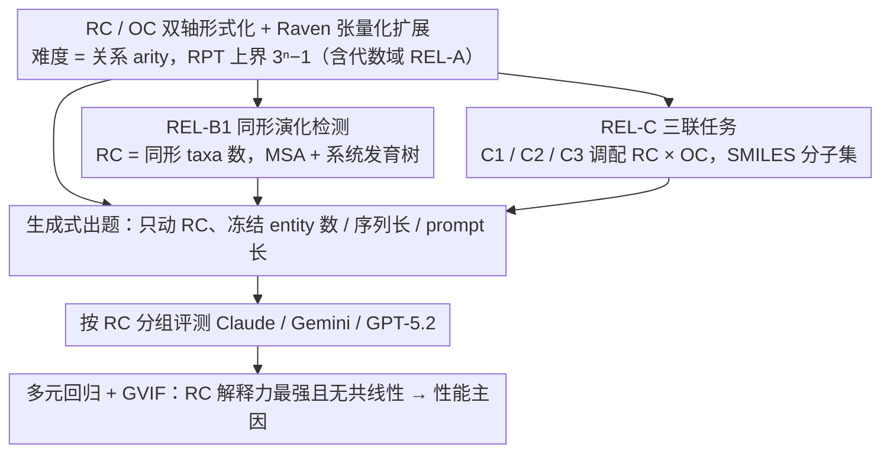

# Evaluating Relational Reasoning in LLMs with REL

**会议**: ICML 2026  
**arXiv**: [2604.12176](https://arxiv.org/abs/2604.12176)  
**代码**: 有（Project Page + GitHub + Hugging Face）  
**领域**: LLM 评测 / 关系推理 / 科学推理 Benchmark  
**关键词**: 关系复杂度、Raven's Progressive Tensor、同形演化、分子异构体、高 arity 绑定

## 一句话总结
作者把认知科学里的"关系复杂度"（Relational Complexity, RC）—— 即一次推理步骤里必须同时绑定的独立变量数 —— 作为衡量任务难度的统一坐标轴，构建了横跨代数 / 生物 / 化学三个学科的生成式 benchmark REL，发现前沿 LLM（Claude Opus 4.5 / Gemini 3 Pro / GPT-5.2）的准确率随 RC 单调下降，且 test-time compute、ICL、外接工具都救不回来。

## 研究背景与动机
**领域现状**：当前 LLM 评测多以输入长度、token 数、entity 数或多跳跳数作为"难度"代理，graph-based 关系推理 benchmark（多跳 QA、知识图谱）虽多，但都把关系结构和具体表征耦合在一起。

**现有痛点**：(1) 同样是"难"，可能源自 prompt 变长、表征变复杂、需要更多背景知识，而非真正的关系推理瓶颈；(2) 现有评测无法区分"模型不会做"和"模型已饱和需要更难任务"，导致 benchmark 分数难以解释；(3) 已有的 graph-based 评测只在图结构本身上做文章，迁移不到代数 / 化学 / 生物等真实科学场景。

**核心矛盾**：**关系绑定的 arity（一次须同时持有的独立 slot 数）** 这个真正的难度维度，被 entity count、prompt length 等粗糙代理混淆掉了 —— 模型在"看似很难（entity 多）但 arity 低"的任务上表现良好，却在"entity 少但 arity 高"的任务上崩盘，benchmark 报告的分数因此严重失真。

**本文目标**：分解为三个子问题 —— (i) 把"关系难度"形式化为可控、可参数化的量；(ii) 在多个科学领域内只动 RC、其他变量冻结，观察 LLM 行为；(iii) 验证 RC 是否真的是性能的主要驱动因子，而非和 prompt 长度、entity 数之类相关变量混杂的伪相关。

**切入角度**：作者借用 Halford 等认知科学家研究 Raven's Progressive Matrices 时使用的 Relational Complexity 概念 —— 一个推理步骤所需绑定的独立 slot 数等于关系的 arity。这个量天然脱离表征，可以在不同领域（数字矩阵、分子集合、系统发育树）里被独立调节。

**核心 idea**：用"一次推理必须同时绑定的独立变量数 = 关系 arity"作为统一难度坐标轴 RC，再配上"识别 / 表征单个 slot 的难度" OC（Operand Complexity）来分离表征复杂度，跨代数 / 生物 / 化学构造同一 RC 可调、其他混淆变量受控的生成式任务集，把 LLM 的"高 arity 推理崩溃"这个失败模式从噪声里拎出来。

## 方法详解

### 整体框架
REL 不是一份固定题集，而是一个**生成式 benchmark 框架**：先把"关系推理难度"形式化为一个可参数化的数字 RC，再让每个学科的题目生成器只动 RC、冻结 entity 数 / 序列长 / prompt 长度等混淆变量，最后按 RC 分组对比 LLM 的准确率。框架横跨三个学科——**REL-A（代数）** 基于 Raven's Progressive Matrices 及作者新引入的张量化扩展 RPT，**REL-B（生物）** 让模型在多序列比对（MSA）+ 系统发育树上识别 homoplasy（趋同演化），**REL-C（化学）** 围绕同分异构体 / 最大公共子结构 / 缺失异构体补全设计三个 RC 配比不同的任务。三者共享同一套 RC / OC 定义，于是来自不同领域的失败可以放在同一根难度坐标轴上比较。

### 关键设计

**1. RC / OC 双轴形式化 + Raven 张量化扩展：把"难度"拆成可单独扫描的数字**

整个 benchmark 的根基，是要回答"难度到底来自哪里"这个被 entity count、prompt length 长期混淆的问题。作者把它拆成两个正交维度：RC（Relational Complexity）定义为"完成一次推理步骤必须同时绑定的独立变量 / operand 数"，也就是关系的 arity；OC（Operand Complexity）定义为"识别、表征单个 slot 本身的难度"。在 Raven's Progressive Matrices 上 RC 可以被机械地数出来——作者给出 7 条规则覆盖不同 arity，如 A1 (Constant) 全行相等 $\text{RC}=1$、A2 (Progression) 相邻递推 $\text{RC}=2$、A3 (Permutation) 每行同 $n$ 个值随机排列 $\text{RC}=n$、A4 (Row-Sum) 末位等于其余 $n-1$ 项带符号和 $\text{RC}=n$。难点在于传统 RPM 的 RC 上限只有 4，对当代 LLM 太浅，所以作者把二维 RPM 推广到 n 维 Raven's Progressive Tensors (RPT)，理论上界一举提到 $\text{RC}_{n\text{-dim}} \le 3^{n}-1$——只要再加一维，就能在 entity 数几乎不变的小输入上把 RC 推到 4-6 甚至更高。这一步之所以关键，是因为 RC 被写成了与具体表征解耦的纯数字，意味着可以"固定 token 数、只动 RC"，从而把 RC 的效应从 prompt 长度、entity 多寡里干净剥离出来，为后面的回归归因打下形式化基础。

**2. REL-B1 同形演化检测：把抽象 arity 投到真实的生物推理上**

光在 Raven 谜题上成立还不够，作者要证明 RC 框架能落到真实科学场景。REL-B1 给定一棵系统发育树和对应 MSA，要求模型两步都答对才算通过：先判断是否存在 homoplasy（不同 lineage 独立演化出相同 motif），再准确列出所有参与的 taxa。合成生成器由四个参数控制——homoplastic taxa 数 $N_{ht}$、叶子数 $N_{\text{leaves}}$、序列长 $L_{\text{seq}}$、保守 motif 长 $L_{\text{motif}}$，其中关键令 $\text{RC} = N_{ht}$，因为模型必须把所有 homoplastic taxa 在树上的位置同时持在工作记忆里逐一核对，绑定的 slot 数正好等于 $N_{ht}$；其余三个参数则被当作"非 RC 混淆因子"专供消融，共生成 2,600 题。这样设计有两重收益：单独扫 $N_{ht}$ 而冻结其他参数，就能用多元回归 + GVIF 共线性分析量化 RC 相对其他难度代理的独立贡献，把"RC 是性能主因"从相关证据推向更强的因果证据；而同形演化本身就是"跨多 lineage 联合绑定"的典型科学问题，外部有效性强，堵住了"benchmark 太合成"的质疑。

**3. REL-C 三联任务：用同一学科内的对照实验把 RC 和 OC 分开**

要确证"是 RC 而非 OC 在主导下降"，最干净的办法是在同一学科里做受控对照。REL-C 在分子集合（SMILES 表示）上设计三个任务，刻意调配 RC 与 OC 的比例：C1 同分异构体集合分类（$\text{RC}=2$、OC 易），只需逐一比对当前分子化学式与共享化学式，是顺序二元绑定；C2 最大公共子结构 MCS（$\text{RC}=2$、OC 中），同样二元绑定但每步要在两个分子间求 MCS，OC 显著抬高；C3 缺失异构体补全（RC 高、OC 难），必须同时持有"完整同分异构体空间"和"已观察子集"两个独立来源，而空间大小 $N_{\text{isomers}}$ 平均达 29，从结构上堵死了"逐对二元更新"的偷懒解法。其中 C2 用双向子结构匹配作评估指标，$\text{IsSubstructure} = \tfrac{1}{2}(S_{\text{pred}\subseteq\text{true}} + S_{\text{true}\subseteq\text{pred}})$，同时刻画 precision 与 completeness。三者构成两组对照：C1 vs C2 在 RC 都等于 2 时只动 OC，验证 OC 单独也会拉低性能；C1/C2 vs C3 让 OC 和 RC 一起升，证明 RC 升高带来的跌幅远大于 OC，从而把 RC 钉死为主要驱动因子——而 SMILES 又是化学家日常表征，保住了任务的真实性。

### 评测协议
本文不训练模型，只评测 Claude Opus 4.5 / Gemini 3 Pro Preview / GPT-5.2 三个前沿 LLM。REL-A 给 8 个候选答案（trivial accuracy 12.5%）；REL-B1 须同时答对存在性和 taxa 集合才算通过；REL-C 把 SMILES canonical 化后做严格匹配（C2 用上面的 IsSubstructure，C3 用 recall / precision / F1）。为排除"模型只是没想够久 / 没见过例子 / 缺工具"的解释，作者还加了三类 inference-time 干预：test-time compute（max-token 4096 / 8192 / 16384）、one-shot in-context learning（REL-C 上 10% 样本）、tool use（REL-C3 提供 RDKit）。

## 实验关键数据

### 主实验

| 任务 | RC 区间 | 主要指标 | RC 增大后性能变化 |
|------|---------|----------|-------------------|
| REL-A1/A2 | RC=1/2 | accuracy | 三个模型在 $30 \times 30$ RPM 上仍达 91% |
| REL-A3 (Permutation) | RC=n | accuracy | $30 \times 30$ 时 Claude / Gemini 跌至 trivial 12%，GPT-5.2 掉 ~40% |
| REL-A4 (Row-Sum) | RC=n | accuracy | 仅 GPT-5.2 在 $9 \times 9$ 拿到 21%，其余全失 |
| REL-A7 (Neighborhood Sum) | RC=6 (固定) | accuracy | 三个模型一律 ~12%（≈ trivial） |
| REL-B1 (homoplasy) | RC=$N_{ht}$=4→25 | 严格匹配 | 35% → 1%（平均跨模型） |
| REL-C1 → C3 | RC 升 + OC 升 | task completion | 65.7% → 38.1% → 26.0%（共降 39.7%） |

### 消融实验

| 干预 | 设置 | 关键发现 |
|------|------|----------|
| 多元回归（REL-B1） | RC vs motif ratio / seq len / 距离 / prompt len | RC 解释力：Claude 24% / Gemini 32% / GPT 44%，次强因子最多只占 17% |
| GVIF 共线性 | 五个变量 | RC、距离、motif ratio 的 GVIF 均 < 1.3，无共线性威胁 |
| Test-Time Compute | 4k / 8k / 16k token | REL-A4/A5 仅升 2-3%；REL-C 平均仅 0.4%，不能填补 RC gap |
| In-Context Learning | REL-C one-shot 10% 样本 | C1 +6.6% / C2 +3.4% / C3 +6.0%，相对排序不变 |
| Tool Use (RDKit) | REL-C3 全量 | 平均 recall 仅 0.094，且仍随分子数下降（0.109 → 0.079） |

### 关键发现
- **RC 是真正的瓶颈**：在 REL-B1 上多元回归显示 RC 解释力是次强因子的 2-6 倍，且与 entity count / prompt length 几乎无共线性 —— 即 RC 不是"长 prompt"的伪相关。
- **失败模式持久**：test-time compute（+8 倍 token）、ICL、外接 RDKit 工具都只能带来个位数 / 不变的提升，说明高 arity 绑定不是"想得不够久"或"没见过例子"的问题，可能是架构层面的瓶颈。
- **OC 与 RC 可分**：REL-C1 vs C2 在 RC 都为 2 时，仅 OC 升高就让完成率从 65.7% 掉到 38.1%；但 C2 → C3（RC 显著升高）再掉 12%，说明两轴叠加且 RC 影响更陡。
- **input size 不可靠**：REL-A5/A6 上输入越大模型反而越好（更多冗余信号），entity count 完全不是难度的单调代理。

## 亮点与洞察
- **把认知科学的 RC 拉进 LLM 评测**：这是从 Halford 等 1990 年代研究 RPM 时用的概念直接迁移，证明"看似过时的认知科学难度量"对当代 LLM 仍是最锐利的分析工具 —— 这种"挪个学科找答案"的思路对评测领域很有启发。
- **生成式 + 参数化**：REL 不是固定题集，而是可以按需扫 RC、生成新题，天然抗污染（contamination）—— 哪天哪家模型刷高了，把 RC 调高 5 就立刻区分开。
- **RPT 上界 $3^n-1$ 的设计**：仅靠加一维就把 RC 推到 26 甚至 80，避免了"为了升难度必须线性放大输入"的工程困境，未来评测难度可以指数级放大；这个张量化思路对其他 grid-based benchmark（如 ARC）也可借鉴。
- **Tool use 仍失效是最有趣的负面结果**：给 RDKit 之后 C3 平均 recall 仅 0.094，说明高 RC 任务的瓶颈不是"分子解析",而是"同时持有多个 isomer 的关系绑定"，这把"工具能救一切"的乐观叙事打了个洞，提示 agent 设计也需要面对 arity 瓶颈。

## 局限与展望
- 作者承认：multiple-choice 评测可能掩盖更细的失败、context-length 限制导致部分 invalid response、任务仍偏合成。
- 自己发现的：(1) 只评测了三个 closed-source 前沿模型，没在开源模型 / 小模型上扫，无法判断 RC 瓶颈是规模无关的架构问题还是会随 scaling 缓解；(2) REL-B1 把 RC 直接等同于 $N_{ht}$ 是一种简化 —— homoplastic taxa 在树上的拓扑位置应该会影响真实绑定难度，但被忽略；(3) 没有把 reasoning chain（CoT）展开来定位"是哪一步绑定失败"，因此只能说"模型不行"，无法指明改进方向；(4) RC 定义假设"必须同时持有"，但实际推理可能可以分块流式处理，理论 RC 与 effective RC 的 gap 没讨论。
- 具体改进思路：在 RC 之外加 "topological RC"（绑定路径在结构上的距离），用 mech-interp 工具（如 attention pattern / activation patching）去找具体哪个 head 在高 RC 上垮掉，并以此设计针对性微调。

## 相关工作与启发
- **vs Liu et al. (2025a) 的图关系 benchmark**：那篇也做生成式关系推理，但只动图结构本身，REL 把 RC 提升到 task-agnostic 层级，并外推到分子和系统发育树这类非图典型场景，覆盖面更广。
- **vs Camposampiero et al. (2025a/b) 的 I-Raven-X**：作者特意指出自己**不引入 perceptual noise / confounders**，因为关心的是纯关系绑定，而非感知鲁棒性 —— 这是评测设计的取舍：本文换来的是"RC 效应可以被干净归因"。
- **vs ProteinGym / DNALongBench / TAPE / PEER**：这些生物 benchmark 都是单序列或序列对评估，REL-B1 是第一个把"跨多序列联合推理 + 系统发育约束"形式化为 RC 可调任务的。
- **vs 多跳 QA（HotpotQA / 2WikiMultihop / MuSiQue）**：多跳是把 RC=2 的关系链起来，REL 把单步 RC 推到 6+，正交于多跳维度，未来可以组合"hop × arity"形成二维难度空间。

## 评分
- 新颖性: ⭐⭐⭐⭐⭐ 把认知科学的 RC / OC 形式化迁移到 LLM 评测，并配上 RPT 张量化扩展和三学科生成器，思路罕见且有概念深度。
- 实验充分度: ⭐⭐⭐⭐ 三领域 + 三前沿模型 + 多元回归 + GVIF + 三种 inference-time 干预，覆盖到位；扣一星因仅评 closed-source 旗舰，缺 scaling 实验。
- 写作质量: ⭐⭐⭐⭐ 概念定义清晰、图表（RC 解释 variance、C1→C3 阶梯）直观；偶有 RPT 上界公式表述略密。
- 价值: ⭐⭐⭐⭐⭐ 给评测社区一把可参数化、抗污染、可解释的尺子，对"benchmark 是否饱和"这个当下争议提供了具体答案。

<!-- RELATED:START -->

## 相关论文

- [\[ACL 2025\] FineReason: Evaluating and Improving LLMs' Deliberate Reasoning through Reflective Puzzle Solving](../../ACL2025/llm_reasoning/finereason_evaluating_and_improving_llms_deliberate_reasoning_through_reflective.md)
- [\[ACL 2026\] Self-Reinforcing Controllable Synthesis of Rare Relational Data via Bayesian Calibration](../../ACL2026/llm_reasoning/self-reinforcing_controllable_synthesis_of_rare_relational_data_via_bayesian_cal.md)
- [\[ICML 2026\] FloorplanQA: A Benchmark for Spatial Reasoning in LLMs Using Structured Representations](floorplanqa_a_benchmark_for_spatial_reasoning_in_llms_using_structured_represent.md)
- [\[NeurIPS 2025\] Self-Evaluating LLMs for Multi-Step Tasks: Stepwise Confidence Estimation for Failure Detection](../../NeurIPS2025/llm_reasoning/self-evaluating_llms_for_multi-step_tasks_stepwise_confidence_estimation_for_fai.md)
- [\[ICML 2026\] Deliberate Evolution: Agentic Reasoning for Sample-Efficient Symbolic Regression with LLMs](deliberate_evolution_agentic_reasoning_for_sample-efficient_symbolic_regression_.md)

<!-- RELATED:END -->
