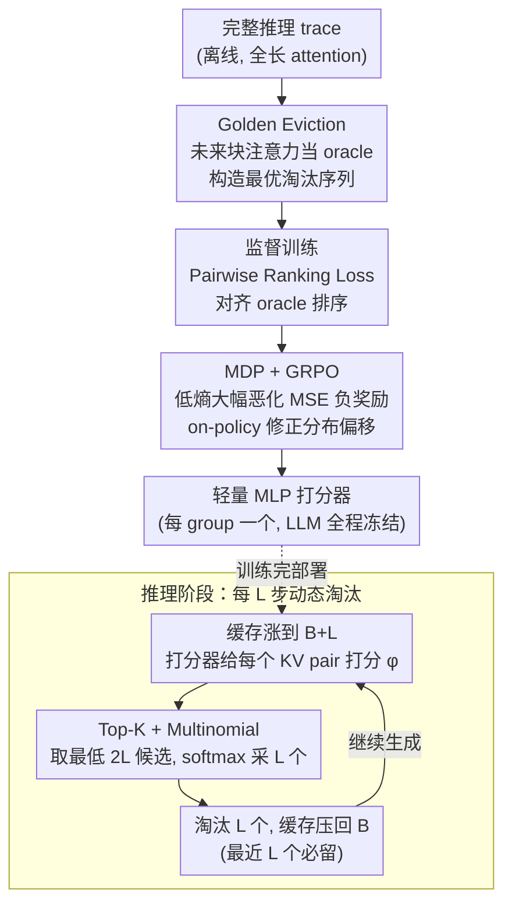

# ForesightKV: Optimizing KV Cache Eviction for Reasoning Models by Learning Long-Term Contribution

**会议**: ICML 2026  
**arXiv**: [2602.03203](https://arxiv.org/abs/2602.03203)  
**代码**: https://github.com/RUCAIBox/ForesightKV  
**领域**: LLM效率 / KV Cache 压缩 / 长推理  
**关键词**: KV cache eviction, 推理模型, Golden Eviction, GRPO, 长期贡献预测

## 一句话总结
ForesightKV 训练一个轻量打分模型，按"未来注意力贡献"动态淘汰 KV 对：先用 Golden Eviction 算法从完整 trace 中蒸馏出最优淘汰序列作监督信号，再用 GRPO 强化学习以"低熵 token 损失增量平方和"为奖励微调策略，在 AIME2024/2025 上用一半 KV 预算超过 SnapKV/H2O/R-KV，4K 预算可保留 99% 原模型性能。

## 研究背景与动机
**领域现状**：推理 LLM（DeepSeek-R1、Qwen3 系列）在数学/代码任务上靠生成 8K–32K token 的思维链取得突破，但每多生成一个 token KV cache 就线性增长——Qwen3-4B 在 32K 长度下单条样本就吃掉 4.5 GB BFloat16 显存，严重限制并发批量；解码本身是 memory-bound，搬运巨大 KV 缓存还会拖慢吞吐。主流应对是 KV cache eviction：每隔若干步根据某个"重要性分数"永久丢掉一部分 KV pair，把缓存压回预算 $B$。代表方法包括用最近窗口注意力打分的 SnapKV、累计注意力的 H2O，以及为推理模型设计的 R-KV。

**现有痛点**：训练无关（training-free）的规则方法只能用启发式（最近窗口注意力、累计 attention、位置等）估计 KV 重要性，无法刻画推理数据里复杂的注意力模式——作者在 Qwen3-4B 上观察到三类 head：global（垂直条）、position-dependent（局部）和 semantic-dependent（块状、动态切换）。SnapKV 用最近 token 的 attention 当观察窗，会把"和窗口语义无关但未来重要"的 KV 当垃圾扔掉，造成显著掉点。另一条线 DMC 之类的训练方法只在序列开始时一次性评估重要性，没法捕捉重要性随生成阶段的动态变化。

**核心矛盾**：KV 重要性是**未来 attention 分数的函数**，而所有现有方法只能看到**历史**信息，本质上是在"用过去预测未来"。更糟的是，淘汰对**低熵 token**（top-80% 低熵的细节/确定性 token）的伤害远大于高熵决策 token——Table 1 显示同样预算下低熵 token loss 涨 147%、高熵只涨 52%，而错的恰恰是数字、符号、实体这些前文出现过的事实，错一个就把后续推理带歪。

**本文目标**：(1) 找到一种能利用未来信息的"金标准"淘汰策略，提供训练监督；(2) 训一个 lightweight scoring model 把"未来意识"蒸馏成只看当前状态的策略；(3) 把训练目标对齐到真正影响推理质量的低熵 token 损失上。

**切入角度**：既然离线 trace 里有完整未来 attention，那就用 oracle 构造"如果当时这么扔，对未来伤害最小"的最优淘汰序列；用这个序列做 supervised pairwise ranking 训练一个 MLP scorer；再把整个解码过程建模成 MDP，用 GRPO 在 group-relative 优势上微调，专门盯紧"低熵且大幅恶化"的 token。

**核心 idea**：用 oracle 未来 attention 蒸馏 + 低熵 token loss 奖励的两阶段训练，让一个 MLP 学会"预测每个 KV pair 的长期贡献"，把规则式 eviction 升级成数据驱动的策略学习。

## 方法详解

### 整体框架
ForesightKV 想解决的核心问题是：KV 重要性本质是未来 attention 的函数，可所有规则方法只能看历史。它的办法是把一个轻量 MLP 打分器训练成"未来贡献预测器"，整条 pipeline 分推理和训练两侧。推理时每生成 $L$ 个新 token（$L=256$），KV 缓存涨到 $B+L$，对每一层的每一个 attention group（GQA 共享 KV），打分模型 $\pi_\theta$ 读入每个 KV pair 的特征 $\mathbf{x}_n = \text{Concat}(\mathbf{k}_n, \mathbf{v}_n, \mathbf{a}_n)$（$\mathbf{a}_n$ 是注意力分数的定长统计特征）输出重要性 $\phi_n$，保留最近 $L$ 个 pair（必留），从其余里淘汰 $L$ 个把缓存压回 $B$；LLM 全程冻结，只训几个 MLP 打分器，开销极小。训练侧则分两阶段：先用 Golden Eviction 从完整 trace 离线蒸馏最优淘汰序列做监督，再把 eviction 建成 MDP 用 GRPO 以"低熵 token 大幅恶化"为负奖励做 on-policy 微调。

### 关键设计

**1. Golden Eviction：用未来注意力当 oracle，构造能学的监督标签**

规则方法（SnapKV/H2O/R-KV）本质都是"用历史 attention 估未来重要性"，必然漏掉 semantic-dependent head 那种块状、动态切换的注意力模式。ForesightKV 的破局点是：离线 trace 里其实藏着完整的未来 attention，那就直接拿来当真值。具体做法是在原模型上一次性算出全长 attention 矩阵 $\mathbf{A}^h \in \mathbb{R}^{T\times T}$，沿 query 维以步长 $L$ 切块、对每块及每个 GQA group 内 head 做平均池化得到 block score $\tilde{\mathbf{a}}_t^{h'}$；对第 $t$ 步的淘汰决策，每个 KV pair $i$ 取**未来所有块**的最大 block score 作为它的"未来分数" $\alpha_{i,t}^{h'} = \max_{t\le j\le M}(\tilde{\mathbf{a}}_{i,j}^{h'})$，保留 $\alpha$ 最大的 $B-L$ 个、扔掉最小的——附录 A 证明这种"扔未来注意力最低者"的策略对输出上界影响最小。有了这条 oracle 轨迹，scorer 就用 Pairwise Ranking Loss $\mathcal{L}_{\text{supervised}} = \sum_t \sum_{\alpha_i < \alpha_j} \max(0, m-(\phi_i - \phi_j))$ 去对齐 oracle 的未来分数排序。这条监督信号有多强？Table 2 里 Golden Eviction 构造轨迹的 loss ratio 只有 1.07，而 R-KV/SnapKV 是 1.41+，本身就强了一个数量级——这是后续蒸馏能成功的前提。

**2. MDP + GRPO：用真实推理奖励修正分布偏移**

监督训练有个隐患：scorer 学的是 oracle 轨迹，可推理时是它自己挑 KV，会走进训练时没见过的状态分布；而且"模仿 oracle"未必等于"改善推理质量"。ForesightKV 把整个解码建成 MDP——state $s_t$ 是当前剩余 KV 缓存，action $a_t$ 是从 $\{1,\dots,B+L\}$ 里选 $B$ 个保留，policy 就是 per-group scorer $\pi_{\theta_{h,l}}$。奖励紧扣 §2.2 那个关键观察（低熵 token 才是推理质量瓶颈）：先筛出"原熵落在底 80%（低熵）且 eviction 后 loss 涨幅超阈值 $\eta$"的 token 集合 $E=\{w_t \mid w_t \in \mathbf{w}_\text{low},\ \Delta\mathcal{L}(w_t)>\eta\}$，奖励取这个子集上 loss 增量的 MSE 取负 $R_t = -\sum_{t\in E}[\Delta\mathcal{L}(w_t)]^2$，用平方专门重罚灾难性恶化。优化用 GRPO：同一序列采 $G$ 条不同 eviction 轨迹，按组相对归一化算 advantage $\hat A_t = (R_t - \text{Mean})/\text{Std}$，再把同一 advantage 广播给序列里所有 eviction 步，对所有 scorer 联合优化（带 PPO clip 和 KL 正则）。奖励为什么这么设计？Table 4 给了反证：无脑降总 loss 反而掉到 50.6（base 51.7），盯高熵 token 更糟（49.6），唯独这个"低熵 + 大幅恶化"的 MSE 奖励 $\mathcal{L}_\text{ours}$ 把 AIME24 从 51.7 推到 54.5。

**3. Top-K + Multinomial：既稳又留探索空间的离散动作参数化**

scorer 给出分数 $\Phi$ 后到底扔哪几个 KV，是个离散选择问题，纯贪心和纯采样都有坑：纯 top-$K$ 是 deterministic，对 scorer 的局部排序错误敏感、又不给 RL 留探索；纯 multinomial 太噪，而 KV eviction 一旦扔错无法召回。ForesightKV 用 $\mathcal{D}_t = \text{Multinomial}_L(\text{Softmax}(\text{Top}_{2L}(-\Phi)))$ 折中：先取分数最低的 $2L$ 个作为高置信淘汰候选池（剪掉可信的坏 KV），再在池内按 softmax(负分数) 采 $L$ 个真正淘汰。等价于"先剪枝再受控采样"——既靠剪枝保住稳定性，又靠采样的随机性给 GRPO 提供轨迹多样性。Table 5 显示这种混合在 AIME24 上同时优于纯 top-K 和纯 multinomial。

### 损失函数 / 训练策略
监督阶段用 Pairwise Ranking Loss（公式 6），margin $m$ 为超参。RL 阶段是 GRPO 目标
$$\mathcal{J}(\theta) = \mathbb{E}_{o\sim\pi_{\theta_\text{old}}}\sum_t \min(r_t(\theta)\hat A_t, \text{clip}(r_t(\theta),1-\epsilon,1+\epsilon)\hat A_t) - \beta\cdot \text{KL}[\pi_\theta\|\pi_\text{ref}]$$
其中 $r_t(\theta) = \pi_\theta(a_t|s_t)/\pi_{\theta_\text{old}}(a_t|s_t)$。每个 attention group 配一个独立 scorer（MLP，隐层 16），LLM 全程冻结；训练预算 $B\le 2K$，从候选池取 top-512 再采 256。

## 实验关键数据

### 主实验
模型：DeepSeek-R1-Distill-Qwen-7B、Qwen3-4B、Qwen3-1.7B；benchmark：AIME2024 / AIME2025；指标：pass@1 平均 32 次。

| 设置 (Qwen3-4B, AIME24) | 预算 | pass@1 | 对比 |
|------------------------|------|--------|------|
| Full KV | 32K | 55.6 | 基线上界 |
| R-KV | 2K | 44.8 | 之前 SOTA |
| **ForesightKV** | **1K** | **54.5** | 半预算反超 R-KV 9.7 点 |
| **ForesightKV** | **4K** | ≈Full | 保留约 99% 原性能 |
| **ForesightKV** | 2K | — | 保留约 92% |

效率（Qwen3-4B, A800, 32K 生成）：

| 方法 | 预算 | 最大并发批量 | 吞吐 | 加速 |
|------|------|--------------|------|------|
| Full | — | 11 | 37.73 | 1.00× |
| ForesightKV | 4K | 48 | 193.95 | 5.14× |
| ForesightKV | 2K | 70 | 268.36 | 7.11× |
| ForesightKV | 1K | 96 | 369.43 | **9.79×** |

### 消融实验

| 消融维度 | 设置 | AIME24 | 说明 |
|----------|------|--------|------|
| 奖励函数 | base (仅 SL) | 51.7 | RL 前 |
| | $-\mathcal{L}_\text{all}$ | 50.6 | 全 loss 反掉点 |
| | $-\mathcal{L}_\text{low}$ | 53.5 | 仅低熵微涨 |
| | $-\mathcal{L}_\text{high}$ | 49.6 | 高熵适得其反 |
| | $-\mathcal{L}_\text{low,large}$ | 53.8 | 锁定恶化点 |
| | $-\mathcal{L}_\text{ours}$ (MSE) | **54.5** | MSE 重罚灾难化最佳 |
| 输入特征 | Attn-only | ↓ | 没 KV 表示无法准 |
| 采样方式 | 纯 Top-K | ↓ | 缺探索 |
| | 纯 Multinomial | ↓ | 太噪 |
| | Top-K+MN | **best** | 兼顾稳与探索 |

Golden Eviction 对照（Qwen3-4B, loss ratio 越低越好）：

| 方法 | (1024,256) | (2048,256) |
|------|-----------|-----------|
| **Golden** | **1.0711** | **1.0166** |
| R-KV | 1.4101 | 1.1606 |
| SnapKV | 1.4091 | 1.1281 |
| H2O | 1.2730 | 1.0948 |

### 关键发现
- **奖励设计是 RL 阶段成败关键**：盲目优化总 loss 反而掉点，必须盯"低熵且大幅恶化"的 token MSE，验证了 §2.2 的低熵 token 主导推理质量的观察；这与 R1 系列工作"高熵 token 才是决策点"的直觉相反——决策点错了影响一个分支，事实/数字错了直接把后续推理污染掉。
- **泛化性强**：训练时只用 $B\le 2K$，4K 预算下仍能保留 99% 性能，说明 scorer 学到的是"内在重要性"而非"对特定预算过拟合"。
- **预算压得越狠加速越大**：1K 预算在 32K 生成上吞吐提到 9.79×，因为解码 memory-bound，KV 越小并发批量越大、HBM 搬运越少；MLP scorer 的开销远小于省下的 attention QKV 计算。

## 亮点与洞察
- **"Oracle 蒸馏 + on-policy RL"两阶段是经典数据驱动控制范式在 KV eviction 上的优雅落地**：监督阶段用未来信息构造可学习目标（解决"未来不可知"），RL 阶段用真实推理 reward 修正分布偏移（解决"oracle 不等于自策略"），各司其职、可解释。
- **奖励工程的洞察可外推**：把 loss 拆成"低熵 vs 高熵 × 恶化大小"四象限，发现只有"低熵大恶化"那格值得优化——这种"找出灾难性少数样本而非全样本平均"的奖励设计哲学在 LLM 对齐、缓存策略、采样温度调度上都可复用。
- **Top-K + Multinomial 的"先剪枝再采样"是一种非常实用的离散动作参数化**：在任何"有大量必扔候选 + 少量需要探索的边界候选"的离散控制问题（剪枝、稀疏激活路由、剪辑视频帧选择）都能套。
- **scorer 设计极简**：MLP 隐层只有 16，开销几乎可忽略，但因为输入特征 $\mathbf{k},\mathbf{v},\mathbf{a}$ 已经把昂贵的语义信息编码好了，模型只需学一个排序——再次印证"特征工程 + 小模型"在系统侧场景里仍然性价比极高。

## 局限与展望
- **依赖完整 trace 离线计算 Golden Eviction**：训练数据采集成本高（要跑完整长推理并存 $T\times T$ attention），对超长上下文（>32K）准备数据本身就吃显存。
- **只在数学推理 + Qwen3/DeepSeek-R1 上验证**：代码、agent、长文档 QA 等任务的"低熵 token 主导损失"假设是否成立未充分验证，附录提到代码上低熵 loss ratio 涨 75%（数学 147%），差距明显。
- **每个 attention group 独立 scorer**：参数量随 layer × group 增长，超大模型部署成本需要再压缩，可考虑跨层/跨头共享 scorer 或 LoRA-style 参数化。
- **eviction 仍然是不可逆操作**：一旦错扔无法 recall，作者用 Top-K+MN 缓解但根本上没解决；可考虑结合 KV 卸载/分层存储或 retrieval-based 召回。
- **预算和 eviction 间隔 $L$ 仍是手工超参**：自适应预算（按句子困难度动态调）是自然的下一步。

## 相关工作与启发
- **vs SnapKV / H2O**: 都是 training-free 规则方法，用最近窗口或累计 attention 当代理；ForesightKV 用 oracle 未来 attention 训练打分器，本质上把"用历史估未来"升级成"用历史学未来的映射"，在 semantic-dependent head 上优势最大。
- **vs R-KV**: 也是为推理模型设计且按周期 evict，但仍是规则式；ForesightKV 在 R-KV 同设定下用 1/2 预算反超 9 点，说明同样观察（推理 head 复杂）下数据驱动 >> 规则。
- **vs DMC / Lancucki et al.**: 那类训练方法是一次性评估 + 后续不变，错失了重要性的动态演化；ForesightKV 每 $L$ 步重新打分，匹配 §2.1 的动态切换观察。
- **vs Token Merging / KV quantization**: 这两条线减少单 pair 存储成本，与 ForesightKV 减少 pair 数量正交，可叠加用。
- **方法可迁移**：把 "oracle trace 蒸馏 + on-policy RL refinement" 套到稀疏注意力 mask 学习、speculative decoding 的 draft 选择、agent memory 压缩等任务上都很有潜力。

## 评分
- 新颖性: ⭐⭐⭐⭐ Oracle Golden Eviction + 低熵 MSE 奖励的组合在 KV eviction 文献里首次出现，但单看 SL+RL 两阶段范式不算独创。
- 实验充分度: ⭐⭐⭐⭐ 三模型 × 两 benchmark × 多预算 + 完整 reward/input/sampling 消融 + 吞吐评测；缺非数学任务的端到端验证。
- 写作质量: ⭐⭐⭐⭐ 动机推导（KV 三类 pattern + 低熵 loss spike）干净有力，公式与图表配套清晰，附录证明给力。
- 价值: ⭐⭐⭐⭐⭐ 9.79× 吞吐 + 半预算超 SOTA 同时几乎不掉点，对长推理 LLM 部署是即插即用的实用工作；scorer 极轻可直接落地。

<!-- RELATED:START -->

## 相关论文

- [\[ACL 2026\] Revisiting Entropy in Reinforcement Learning for Large Reasoning Models](../../ACL2026/llm_reasoning/revisiting_entropy_in_reinforcement_learning_for_large_reasoning_models.md)
- [\[ICLR 2026\] Segment-Level Attribution for Selective Learning of Long Reasoning Traces](../../ICLR2026/llm_reasoning/segment-level_attribution_for_selective_learning_of_long_reasoning_traces.md)
- [\[ICML 2026\] MOSAIC: Learning When to Act or Refuse — Guarding Agentic Reasoning Models for Safe Multi-step Tool Use](learning_when_to_act_or_refuse_guarding_agentic_reasoning_models_for_safe_multi-.md)
- [\[ACL 2026\] Evo-Attacker: Memory-Augmented Reinforcement Learning for Long-Horizon Tool Attacks on LLM-MAS](../../ACL2026/llm_reasoning/evo-attacker_memory-augmented_reinforcement_learning_for_long-horizon_tool_attac.md)
- [\[ICML 2026\] ResRL: Boosting LLM Reasoning via Negative Sample Projection Residual Reinforcement Learning](resrl_boosting_llm_reasoning_via_negative_sample_projection_residual_reinforceme.md)

<!-- RELATED:END -->
