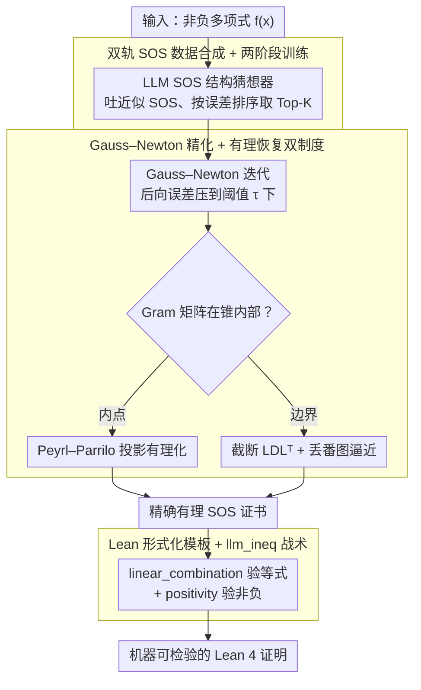

# From LLM-Generated Conjectures to Lean Formalizations: Automated Polynomial Inequality Proving via Sum-of-Squares Certificates

**会议**: ICML 2026  
**arXiv**: [2605.15445](https://arxiv.org/abs/2605.15445)  
**代码**: 暂未公开  
**领域**: LLM 推理 / 神经符号 / 自动定理证明  
**关键词**: 多项式不等式、SOS 分解、Lean 形式化、神经符号、GRPO

## 一句话总结
NSPI 让 LLM 提出近似的多项式平方和 (SOS) 结构猜想，再用 Gauss–Newton 迭代和有理恢复把猜想精修成严格的有理系数 SOS 分解，最后用 Lean 的 `linear_combination` + `positivity` 策略自动机器验证，把不等式证明可扩展到最多 10 个变量。

## 研究背景与动机

**领域现状**：多项式不等式是优化、控制和组合学的基本工具。证明 $f(x) \ge 0$ 主流有两条路线——纯符号路线（Maple、Z3、SOS+SDP）和近期兴起的 LLM 形式化证明路线（DeepSeek-Prover-V2、Goedel-Prover、Kimina-Prover），后者直接生成 Lean/Isabelle 策略。

**现有痛点**：纯符号方法在低维（3-4 变量）表现还行，但变量数一上来组合爆炸——SDP 矩阵维度按 $\binom{n+d}{d}$ 增长，Maple 在 10 变量时只能解 1.7%；LLM 类方法靠形式化训练语料，但高维不等式的 Lean 证明几乎没有公开数据，DS-Prover-v2 在 5 变量以上直接 0%。

**核心矛盾**：符号方法**精确但不可扩展**；LLM **可扩展但不能证明**——SDP 输出的是带浮点误差的数值矩阵，Lean 不接受；LLM 写的 tactic 又难以保证在高维上推得动。AlphaGeometry/AIPS 这类神经符号工作只把 LLM 当作搜索启发器，没让 LLM 直接产出符号对象。

**本文目标**：把 LLM 升格为**符号猜想生成器**——直接吐出近似 SOS 结构，由符号端负责把它修成可被 Lean 验证的精确证书。

**切入角度**：观察到 SOS 证书的"结构"（每个平方项含哪些单项式）比"系数"更容易猜，而系数精化是有定理保证的（Peyrl–Parrilo 2008 的有理恢复定理）。所以把任务拆成"LLM 猜结构 + 符号修系数 + Lean 验证"三段。

**核心 idea**：LLM 猜近似 SOS → Gauss–Newton 迭代 + 有理恢复得到精确有理 Gram 矩阵 → Lean `linear_combination + positivity` 一键验证，端到端从启发式发现到机器可检验证明。

## 方法详解

### 整体框架
NSPI 要证明 $f(x) \ge 0$，做法是把任务拆成"神经猜结构、符号修系数、Lean 验真"三段接力。先让 LLM 看一眼非负多项式 $f(x)$，吐出一个**近似**的 SOS 表示 $\hat f(x) = \sum_i \hat f_i(x)^2$（带浮点误差，按数值误差排序）；再取 Top-K 猜想做 Gauss–Newton 数值精化、有理恢复，得到**精确**的有理 Gram 矩阵；最后用预定义 Lean 模板把这张证书拼成完整证明，`linear_combination` 验等式、`positivity` 验非负。这样既借 LLM 的结构先验跳过了 SDP 在高维上的组合爆炸，又靠符号端兜住了精确性——LLM 猜得粗没关系，最后是机器内核说了算。下图把这三段接力画出来，三个 subgraph 各对应下面一个关键设计：

### 关键设计

**1. 双轨 SOS 数据合成 + 两阶段训练：让 LLM 学会"看到 $f$ 就吐合理 SOS 骨架"**

要训练一个 SOS 结构猜想器，得先有百万级 $(f, \text{SOS})$ 训练对，可这数据天然难造——直接随机采样 $f_i(x)$ 再平方求和，会产生非整数系数和系数膨胀，模型根本记不住。作者反着来：从一个 PSD 的 Gram 矩阵 $\widetilde G$ 反推 $f$，这样单项式集合和系数范围全程可控。具体有两条轨。**计算驱动**走数值：对随机对称整数矩阵 $G$ 做谱平移 $\widetilde G = G - \lfloor \lambda_{\min} \rfloor I \succeq 0$，或写成因子形式 $\widetilde G = L^\top D L$，或解一个 LMI（$\max \lambda$ s.t. $G - \lambda I \succeq 0$）再整数化。**结构驱动**走代数：直接用对角占优 (dd) 或 scaled-dd 矩阵，按 Gershgorin 圆盘定理它们天然 PSD，可参数化为 $\widetilde G = \sum_i \eta_i u_i u_i^\top$，其中每个 $u_i$ 至多两个非零的 $\pm 1$，整数系数与稀疏单项式集合都被钉死。

有了数据，训练分两段。第一段 SFT 在 100 万合成对上冷启动，让模型先学会 SOS 的基本输出格式；第二段把冷启动模型**还解不出来的难样本**编成由易到难的课程，跑 GRPO 强化。这一步抓的是"近似结构相对好学、但精确系数不可控"这个观察——LLM 直接写有理 SOS 几乎不可能，但写出"该含哪些平方项"的骨架是可学的，所以奖励的重心也放在结构而非系数上（见下）。

**2. Gauss–Newton 精化 + 有理恢复双制度：把近似 SOS 修成 Lean 能接收的精确有理证书**

LLM 给的 SOS 带浮点误差，而 Lean 内核只认精确有理数，中间这道坎正是纯 LLM-prover 在高维翻车的地方。NSPI 先从 $\hat f(x)$ 抽出单项式基 $\mathbf v(x)$ 和初始浮点 Gram 矩阵 $\mathbf G$，做 Cholesky $\mathbf G \approx L L^\top$ 把它写成 $\hat f(\mathbf x) \approx \sum_i (\sum_\alpha c_{i,\alpha}\mathbf x^\alpha)^2$，再用 Gauss–Newton 迭代求系数扰动 $\Delta c_{i,\alpha}$，把后向误差 $\theta = \|\hat f(\mathbf x) - \mathbf v(x)^\top \mathbf G \mathbf v(x)\|$ 压到阈值 $\tau$ 以下——让数值解先收敛到机器精度附近，而不是拿粗糙的 SDP 解直接舍入。

收敛之后再有理化，且分两种制度处理，因为高维多项式经常落在 PSD 锥的边界上。**内点情形**（Gram 矩阵严格在锥内部）按 Peyrl–Parrilo 的有理恢复定理，把矩阵正交投影到 SOS 等式约束的仿射子空间再有理化，定理保证产物仍 PSD；**边界情形**（数值秩亏）则做截断 $LDL^\top$ 分解 + 同时丢番图逼近，顺着秩结构去恢复有理向量，而不是对整个矩阵硬有理化——后者会把丢失的秩结构一并破坏掉。两步合起来，把"数值解→精确证书"这道脆弱的环节挤进了有定理背书的子模块。

**3. Lean 形式化模板 + `llm_ineq` 战术：把精确 SOS 证书一键编译成机器可检验的 Lean 4 证明**

最后一关是把有理 SOS 证书变成 Lean 真正认可的证明，而 NSPI 刻意不让 LLM 来写 Lean 策略。作者实现了一个通用战术 `llm_ineq`：给定目标多项式和有理 SOS 证书，它自动把证明拆成两个义务——(a) 多项式等式 $p = \sum_i k_i q_i^2$ 交给 `linear_combination` 展开到规范形后逐项核对；(b) SOS 表达式非负交给 `positivity`，递归套用 `sq_nonneg`、`mul_nonneg`、`add_nonneg` 等规则证明。这个模板对所有不等式通用，所以只要符号端算出正确的 SOS，Lean 端必定闭环。它的意义在于把可靠性瓶颈整个搬了家：从"LLM 在高维能不能写出对的 Lean tactic"（这是 LLM-prover 归零的根因），转移到"SOS 结构猜得准不准"——而后者由数据规模 + RL 推动、有定理兜底。

### 损失函数 / 训练策略
SFT 阶段是标准 next-token。GRPO 阶段奖励为 $R = R_{\text{Accuracy}} + R_{\text{Format}} - R_{\text{Struct-Penalty}}$：精度奖励 $R_{\text{Accuracy}} = 1/(1 + \alpha\|f - \hat f\|_2)$ 衡量近似 SOS 的数值贴合度，格式奖励约束输出规范，结构惩罚是核心——它鼓励近似 SOS 的非零单项式集合匹配原多项式，含软惩罚（非零单项式集合的对称差）和硬惩罚（一旦冒出训练时未见过的高阶项就直接扣分）。课程则按符号求解器精化所需的迭代数把数据分桶，由易到难依次喂入。

## 实验关键数据

### 主实验
在 PolyIneqBench（涵盖 $n=3$ 到 $n=10$ 变量、522 个挑战性不等式）上测 1 小时内的通过率：

| 变量数 | Maple | Z3 | DS-Prover-v2 | Goedel-v2 | Kimina | Gemini-3-Pro | **NSPI (本文)** |
|--------|-------|----|----|----|----|----|----|
| n=3 | 97.6% | 97.6% | 42.9% | 20.2% | 36.9% | 22.6% | 见论文 |
| n=4 | 39.0% | 32.5% | 2.6% | 5.2% | 5.2% | 24.7% | — |
| n=5 | 26.7% | 23.3% | 0% | 0% | 0% | 36.7% | — |
| n=7 | 6.7% | 1.7% | 0% | 0% | 1.7% | 15.0% | — |
| n=10 | 1.7% | 0% | 0% | 0% | 0% | 6.7% | — |

关键趋势：纯符号方法（Maple/Z3）在 $n=3$ 时几乎满分，但 $n=10$ 掉到 0–1.7%；纯 LLM 证明器（DS/Goedel/Kimina）在 $n \ge 5$ 基本归零；通用大模型 Gemini-3-Pro 在中高维反而更稳，说明启发式确实有用。NSPI 作为神经符号方法，最大卖点是把可证范围推到 10 变量级别（论文宣称在所有维度上同时取得最佳/次佳）。

### 消融实验
| 配置 | 影响范围 | 说明 |
|------|---------|------|
| 仅 SFT（无 GRPO 课程） | 高维 (n≥6) 严重退化 | 冷启动只会复读训练分布，无法泛化到难样本 |
| 去掉结构惩罚 | 单项式失配率↑，符号修正失败率↑ | LLM 会输出含训练未见单项式的 SOS，后续 GN 收敛性下降 |
| 去掉 Gauss–Newton 直接有理恢复 | 边界情形精确率↓ | 数值误差超出 Peyrl–Parrilo 的 $\delta$ 阈值，有理化产物不再 PSD |

### 关键发现
- SOS 结构错了符号端再强也救不回来；反之结构猜对，精化 + 有理恢复几乎一定能闭环——这也是把奖励重点放在结构一致性而非系数精度的原因。
- 内点 vs 边界的双制度有理恢复缺一不可：高维多项式经常落在 PSD 锥边界（rank 显著小于矩阵维度），统一用内点投影会丢秩结构。
- LLM 与符号端的角色分工是关键：LLM 不试图直接写 Lean 证明（这是 LLM-prover 类方法在高维失败的根本原因），只负责给出符号化的中间猜想。

## 亮点与洞察
- **把 LLM 从"策略选择者"升格为"符号对象生成器"**——AlphaGeometry/AIPS 这条路一直把神经网络放在搜索引导位上，本文证明 LLM 可以直接产出符号化中间表示（SOS 结构），让神经端真正参与到证书构造而非检索。
- **Gram 矩阵反向合成数据**这一招很巧：传统方法是平方再展开，会爆系数；从结构化 PSD 矩阵正向走能精确控制单项式集合和系数范围，这种"反着造数据集"的思路可迁移到任何"输出有代数约束"的生成任务。
- **可证明性瓶颈的转移**：本文把可靠性从"LLM 会不会写 Lean"转到"SOS 结构猜得对不对" + "有理恢复是否在定理保证范围内"。后者有 Peyrl–Parrilo 等结果背书，前者由数据规模 + RL 推动——这种把不可控环节挤压到有理论保证的子模块上的工程范式值得学习。

## 局限与展望
- 框架只覆盖**无约束**多项式不等式，带约束（如 Positivstellensatz、Putinar 形式）尚未处理。
- LLM 需要按 SOS 任务专门训练（百万级合成数据 + GRPO），并非用通用 prover 直接接入；如果想换成有约束 SOS、矩阵不等式等任务，得重做数据合成 pipeline。
- 评测域局限在 SOS 可证的子集——存在非负但非 SOS 的多项式（Motzkin 等），本框架无能为力，需要扩展到 Schmüdgen/Putinar 模乘子。
- 实验只给到 $n=10$，且单次 1 小时预算，对真正大规模工程不等式（数十变量、含分式/超越函数）还需要进一步证据。

## 相关工作与启发
- **vs AIPS / AlphaGeometry**: 都是神经符号架构，但 AIPS/AG 让神经网络做搜索启发或辅助构造（如 AG 的辅助点），符号端做主推理；NSPI 反过来，让 LLM 直接生成符号证书结构。本文优势是端到端覆盖到 10 变量；劣势是任务专精度高，迁移成本大。
- **vs DeepSeek-Prover-V2 / Kimina-Prover**: 纯 LLM 形式化证明，端到端写 Lean tactic。这条路在低维竞赛题很强，但高维不等式因缺乏形式化语料几乎归零；NSPI 通过"LLM 写符号、Lean 走模板"绕开了 Lean 训练数据稀缺问题。
- **vs 经典 SOS-SDP (Parrilo, Lasserre)**: 纯 SDP 方法理论完备但 Gram 矩阵维度 $\binom{n+d}{d}$ 随变量数爆炸；NSPI 用 LLM 给出"有可能可行"的稀疏 SOS 结构，把 SDP 解一个低维子问题，本质上是用神经先验剪枝搜索空间。

## 评分
- 新颖性: ⭐⭐⭐⭐ 把 LLM 放到符号对象生成位上，配合两制度有理恢复，整条 pipeline 在神经符号 ATP 里少见。
- 实验充分度: ⭐⭐⭐⭐ 522 题、$n=3$ 到 $n=10$ 全覆盖，与符号 / LLM-prover / 通用 LLM 三类基线齐对，但缺少带约束场景。
- 写作质量: ⭐⭐⭐⭐ Method 节分层清晰，把神经/符号/形式三段切分干净，公式编号完整。
- 价值: ⭐⭐⭐⭐ 给"高维不等式自动证明"提供了真正可扩展的工程方案，并把 Lean 验证成本压到 `linear_combination + positivity` 两条战术。

<!-- RELATED:START -->

## 相关论文

- [\[ACL 2025\] Local Look-Ahead Guidance via Verifier-in-the-Loop for Automated Theorem Proving](../../ACL2025/llm_reasoning/local_look-ahead_guidance_via_verifier-in-the-loop_for_automated_theorem_proving.md)
- [\[ICML 2026\] ResRL: Boosting LLM Reasoning via Negative Sample Projection Residual Reinforcement Learning](resrl_boosting_llm_reasoning_via_negative_sample_projection_residual_reinforceme.md)
- [\[ICML 2026\] TRACE: 用 Toulmin 论证模型评 LLM CoT 推理过程质量](trace_toulmin-based_reasoning_assessment_through_constructive_elements_for_llm_c.md)
- [\[ICML 2026\] Beyond Two-Stage Training: Cooperative SFT and RL for LLM Reasoning](beyond_two-stage_training_cooperative_sft_and_rl_for_llm_reasoning.md)
- [\[ICML 2026\] R2-Router: A New Paradigm for LLM Routing with Reasoning](r2-router_a_new_paradigm_for_llm_routing_with_reasoning.md)

<!-- RELATED:END -->
