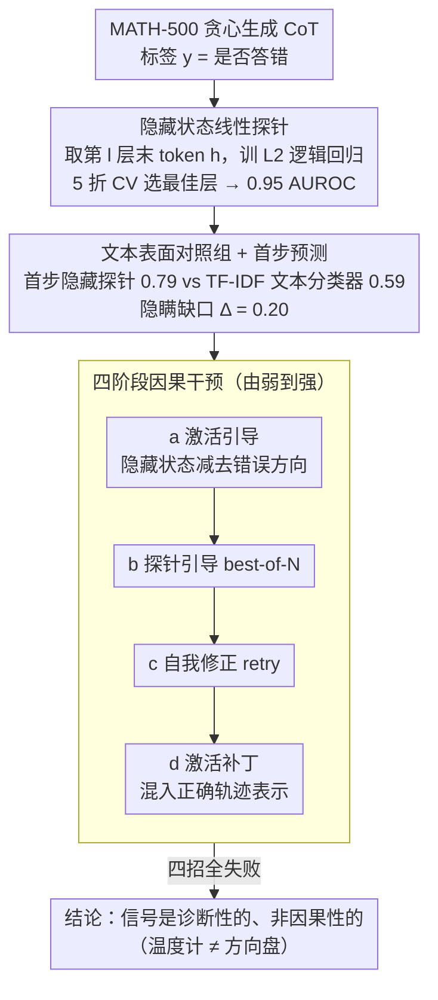

# Hidden Error Awareness in Chain-of-Thought Reasoning: The Signal Is Diagnostic, Not Causal

**会议**: ICML 2026  
**arXiv**: [2605.09502](https://arxiv.org/abs/2605.09502)  
**代码**: 论文附录给出关键代码片段  
**领域**: LLM 推理 / 机制可解释性 / CoT 忠实性  
**关键词**: 思维链, 隐藏状态探针, 错误检测, 激活引导, 因果干预

## 一句话总结
用一个简单的逻辑回归探针在 LLM 思维链生成时的隐藏状态上能以 0.95 AUROC 预测整条推理是否会出错（从第 1 步就有 0.79），但文本表面同样训出来的分类器只有 0.59；可惜 4 种干预手段（激活引导、探针引导 best-of-N、自我修正、激活补丁）全部失败——这个错误信号是"诊断性"的而非"因果性"的。

## 研究背景与动机

**领域现状**：CoT prompting 的隐含契约是"模型写出来的推理 = 它内部的计算过程"。前人 (Turpin et al., Lanham et al.) 通过行为干预（如打断 CoT 但答案不变）质疑过这一契约，但都停留在文本表层；同时机制可解释性领域 (Meng et al. ROME, Li et al. ITI) 已经成功定位并编辑事实知识表示，自然要问：能否同样定位并修正推理错误？

**现有痛点**：(1) 言语化的 confidence 不靠谱——错误轨迹自报 4.55/5，正确的 4.87/5，几乎区分不开；(2) 文本表面没有可观察的错误信号（hedging 词、长度差异都统计不显著）；(3) 已有自纠正方法效果有限，但缺乏机制解释为什么失败。

**核心矛盾**：模型"知道自己错了"和"能不能改正错"是两回事。前者属于表示层面（probe 能读出来），后者属于因果机制（能不能干预）。如果两者解耦，那机制可解释性的"诊断—编辑"范式在推理任务上会失效。

**本文目标**：(1) 量化模型隐藏状态对自己 CoT 正确性的预测能力，并与文本表面信号严格对比；(2) 通过 4 种渐强的干预实验严格区分"诊断性"vs"因果性"信号；(3) 把这个区分推广到不同模型规模、不同家族、不同训练范式 (RL distilled)。

**切入角度**：训一个线性探针 $p(\text{error} \mid h) = \sigma(w^\top h + b)$，用 100 道 MATH-500 题做训练集，5 折 CV 选最佳层；同时训一个 TF-IDF + LR 文本分类器作为"文本表面对照组"。两者 AUROC 差值就是"隐藏 vs 表面"的隐瞒程度。

**核心 idea**：用"隐藏 vs 表面"的 AUROC 差距量化模型的"隐藏错误意识"，再用激活引导、best-of-N、自我修正、激活补丁四件套从弱到强测试这个意识能否反过来修正错误。

## 方法详解

### 整体框架
全文是一出"三幕剧"：先训一个线性探针，把每条 CoT 在隐藏状态里"是否会答错"读出来；再把第一步的隐藏状态单独拉出来做早期检测，并配一个文本分类器作"表面对照组"，量化"模型内部知道、文本表面藏着"的隐瞒缺口；最后拿探针读出的"错误方向"做四种由弱到强的因果干预，验证这个信号到底能不能反过来修正错误。整套设计的精巧之处在于：探针、对照、干预层层递进，把"诊断"和"因果"两件事干净地解耦开。

### 关键设计

**1. 隐藏状态线性探针：诊断性信号从哪读出来**

模型写下错误推理之前，内部到底"知不知道"自己会错？这一步就是要把这份隐藏的判断读出来。做法刻意选了最弱的形式：贪心生成完整 CoT，取每个样本在第 $l$ 层最后一个 token 的 hidden state $h_T^{(l)}$ 作特征，标签 $y = 1$ 表示最终答错，训一个 L2 正则逻辑回归（$C = 0.1$，最多 2000 迭代），损失就是标准带正则的交叉熵 $\mathcal{L} = -\frac{1}{N}\sum [y_i \log \hat p_i + (1-y_i)\log(1-\hat p_i)] + \frac{1}{2C}\|w\|^2$。100 道 MATH-500 题训练，5 折 CV 在 70-85% 深度选最佳层，200 道题评估。之所以特意用最弱的线性模型，是因为如果连一条直线都能读出 0.95 AUROC，就说明"会出错"这个信息在隐藏状态里本就是线性可分的，无需任何非线性解释——MLP (0.944) 和 RF (0.893) 反而不如线性探针 (0.955)，正好佐证了这点；而且只要 20 道题就能到 0.956 AUROC，数据效率高得惊人。

**2. 文本表面对照组 + 首步预测：把"隐瞒"量化成一个数**

光证明隐藏状态读得出还不够，得回答"这份信息是不是只藏在内部、文本里完全看不到"。于是用同样 200 道题搭一个对照：把每条轨迹的第一步文本喂给 TF-IDF + 逻辑回归得到表面分数 $s_{text}$，再用第一步隐藏状态训探针得到 $s_{hidden}$，两者之差定义为隐瞒缺口 $\Delta_{conceal} = s_{hidden} - s_{text}$。Qwen2.5-3B 上 $s_{hidden} = 0.787$、$s_{text} = 0.590$，缺口高达 $0.197$。首步 AUROC 0.787 是整个论文的胜负手——它说明模型从写第一句话开始就已经"知道"自己会走错，而文本表面对此守口如瓶：长度差异 $p = 0.211$、数字密度 $p = 0.726$、hedging 词出现率不到 1%，统计上全都看不出破绽。更刺眼的是有 65% 的错误轨迹同时满足"言语自报 confidence ≥ 4 且探针错误分数 > 0.5"，作者把这片区域命名为 unfaithful region，正是"hidden error awareness"这一概念最硬的证据。

**3. 四阶段因果干预：从"读得出"到"改得动"的强度光谱**

读得出方向，是否就等于改得动错误？这一步用四种渐强的干预去逼问。（a）激活引导：从隐藏状态减去归一化的错误方向 $h' = h - \alpha (h \cdot \hat w) \hat w$，最多只涨 4%，强干预 $\alpha = 8$ 时 3B 反而掉 6%。（b）探针引导 best-of-N：生成 $N$ 条轨迹挑探针得分最低的那条，结果居然不如简单多数投票，而 oracle 上限有 88-91%，说明候选里明明有对的却选不出来。（c）自我修正：探针判定可疑后让模型重答，反而掉 3%，连 oracle 触发也只涨 1%。（d）激活补丁是最强测试，把正确轨迹的隐藏状态按 $h'_{wrong} = (1 - \alpha) h_{wrong} + \alpha h_{correct}$ 混进错误轨迹，$\alpha = 0.5$ 时 3B 准确率直接崩到 0%——补丁把输出连贯性整个打碎了。这四招覆盖了从"读出方向"到"植入正确表示"的完整强度谱，唯有全军覆没才能严格断言这个信号"只是温度计、不是方向盘"。激活补丁的崩溃尤其决定性：同样的"读+编辑"范式在 ROME 里能精准改写事实知识，到了推理质量上却彻底失效，反证出推理是分布式、跨层涌现的，而事实关联是局部可编辑的，二者在表示层面有本质区别。

## 实验关键数据

### 主实验

| 模型 | 类型 | 准确率 | 最佳层 | CV AUROC | Eval AUROC |
|------|------|--------|--------|----------|------------|
| Qwen2.5-1.5B | std | 0.35 | 27 | 0.918 | 0.724 |
| Qwen2.5-3B | std | 0.53 | 27 | 0.953 | **0.956** |
| Qwen2.5-7B | std | 0.62 | 16 | 0.669 | 0.737 |
| Qwen2.5-32B | std | 0.53 | 32 | **0.956** | — |
| Qwen2.5-72B | std | 0.41 | 64 | **0.977** | — |
| Llama-3.1-8B | std | 0.46 | 16 | 0.703 | 0.811 |
| Phi-3.5-mini | std | 0.39 | 8 | 0.936 | — |
| DeepSeek-R1-7B | RL distilled | 0.76 | 12 | 0.884 | 0.852 |

| 检测方法 | AUROC | 成本 |
|----------|-------|------|
| **隐藏状态探针 (本文)** | **0.953** | 1 次前向 |
| Self-Consistency ($N = 5$) | 0.823 | 5× 生成 |
| CCS (Burns et al.) | 0.718 | 1 次前向 |
| $P(\text{True})$ | 0.721 | 1 次查询 |
| Verbalized Confidence | 0.674 | 1 次查询 |
| Sequence Log-prob | 0.676 | 免费 |

### 干预实验

| 干预方式 | 3B 准确率变化 | 7B 准确率变化 |
|----------|---------------|---------------|
| 激活引导 (最优 $\alpha$) | +3% | +4% |
| 激活引导 ($\alpha = 8$，强) | -6% | +4% |
| Best-of-N 探针选择 ($N = 12$) | 0.62 (oracle 0.88) | 0.70 (oracle 0.91) |
| 多数投票 (对照) | 0.75 | 0.75 |
| 自我修正 (always retry) | -3% | -3% |
| 激活补丁 (混入正确, $\alpha = 0.5$) | **0%** | **7%** |

### 关键发现
- **首步就能预测**：Qwen2.5-3B 第一步 AUROC 0.787，已经达到完整轨迹的 98%——模型在写出错误之前内部就已"知道"会错。
- **两种时间动力学**：3B 是"前置型"（第 1 步差距最大 0.41，提前承诺到错误轨道），7B 是"累积型"（差距从 0.11 涨到 0.38），说明不同规模模型有不同的错误编码方式。
- **跨域弱迁移**：MATH 训的探针去 ARC-Challenge 测只剩 0.54-0.55 AUROC，但 ARC 上原生训探针 0.63-0.69，说明"错误方向"是领域相关的，不是单一通用方向。
- **非单调的 scale 曲线**：1.5B (0.918) → 7B (0.669) → 72B (0.977)，中间规模 dip 是因为它们"错误更分散更难线性分"，大模型反而把错误表示规整化了。
- **激活补丁的崩溃是决定性证据**：能改事实但改不了推理质量，说明推理是分布式涌现而非单一可编辑特征——这是和 ROME 等事实编辑工作的本质区别。

## 亮点与洞察
- **"诊断 vs 因果"二分**：作者用温度计类比明确区分"读得出"和"改得动"，这个区分在机制可解释性领域非常有价值，画出了 ROME 等"事实编辑"方法的边界。
- **CoT 忠实性的表示学证据**：之前讨论 CoT 忠实性都是行为层面，本文给出了"hidden vs surface AUROC = 0.20"的严格量化，建立了"hidden error awareness"这一新概念。
- **诚实但悲观**：四种干预全失败本身就是一个有说服力的负结果，作者没有刻意藏失败实验，反而把它当作主结论的关键证据，研究风格值得学习。
- **对 process reward model 的启示**：PRM 训出来的可能就是同一种诊断信号，缺乏因果杠杆，意味着 PRM 主要用途是"选择"而非"训练时矫正推理过程"。

## 局限与展望
- 没有测试在探针信号上做 fine-tuning 或 RL（如 RLPF），可能这是关闭"诊断—因果"鸿沟的训练时方案，作者也承认这是开放问题。
- 主要在 MATH-500 上做实验，ARC 上做了跨域但其他推理任务（HumanEval、TheoremQA、MMLU-Pro）没覆盖。
- 4 种干预都是后训练干预，没尝试在预训练阶段用 probe loss 联合训练，可能那是真正的解决方案。
- DeepSeek-R1 上"难度对照"效应弱了（$p = 0.447$, $d = -0.30$），可能因为 76% 准确率下混合轨迹问题太少 ($n = 14$)，统计能力不足。

## 相关工作与启发
- **vs Turpin et al. 2023 / Lanham et al. 2023**：前人用行为干预（提示注入、轨迹截断）质疑 CoT 忠实性，本文从表示层面用 AUROC 差量化"隐瞒"，方法学互补。
- **vs ROME (Meng et al., 2022)**：ROME 能编辑事实关联，本文证明同样的"读 + 编辑"范式在推理错误上完全失败，给机制可解释性画出边界。
- **vs Zhang et al., 2025**（并行工作）：他们也探针隐藏状态做 self-verification，发现能做 best-of-N 选择；本文反过来证明探针无法改善推理本身，结论方向相反但互补。
- **vs CCS (Burns et al., 2023)**：CCS 用无监督找"真值方向"，本文用监督探针做错误检测，AUROC 0.953 vs CCS 0.718，监督在这种任务上有明显优势。

## 评分
- 新颖性: ⭐⭐⭐⭐ "诊断 vs 因果"的二分是清晰的概念创新，hidden vs surface 量化也是新视角，但探针本身是标准工具。
- 实验充分度: ⭐⭐⭐⭐⭐ 9 个模型覆盖 1.5B-72B + Qwen/Llama/Phi + RL distilled，4 种干预 + 跨域 + 难度对照 + 层分析，做得非常彻底。
- 写作质量: ⭐⭐⭐⭐⭐ "三幕剧"结构很有戏剧性，温度计类比让概念易懂；负结果讲得明确不藏。
- 价值: ⭐⭐⭐⭐⭐ 给 LLM 安全监控（CoT 审计不可靠）、机制可解释性（边界）、PRM 训练等多个方向都打了重要警钟，影响面广。

<!-- RELATED:START -->

## 相关论文

- [\[ICML 2026\] Dynamics Within Latent Chain-of-Thought: An Empirical Study of Causal Structure](dynamics_within_latent_chain-of-thought_an_empirical_study_of_causal_structure.md)
- [\[ICML 2026\] Chain-of-Thought Reasoning in the Wild Is Not Always Faithful](chain-of-thought_reasoning_in_the_wild_is_not_always_faithful.md)
- [\[AAAI 2026\] Deep Hidden Cognition Facilitates Reliable Chain-of-Thought Reasoning](../../AAAI2026/llm_reasoning/deep_hidden_cognition_facilitates_reliable_chain-of-thought_.md)
- [\[ICML 2026\] Verifying Meta-Awareness via Predictive Rewards in Reasoning Models](verifying_meta-awareness_via_predictive_rewards_in_reasoning_models.md)
- [\[ACL 2026\] Do Not Step Into the Same River Twice: Learning to Reason from Trial and Error](../../ACL2026/llm_reasoning/do_not_step_into_the_same_river_twice_learning_to_reason_from_trial_and_error.md)

<!-- RELATED:END -->
