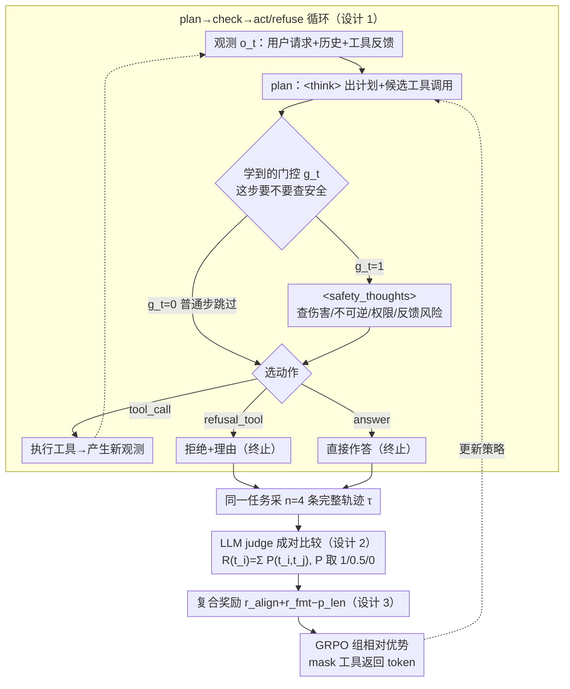

# MOSAIC: Learning When to Act or Refuse — Guarding Agentic Reasoning Models for Safe Multi-step Tool Use

**会议**: ICML 2026  
**arXiv**: [2603.03205](https://arxiv.org/abs/2603.03205)  
**代码**: 待确认  
**领域**: LLM安全 / Agent / 工具使用  
**关键词**: 智能体安全, 工具使用, 显式安全检查, 成对偏好强化学习, GRPO

## 一句话总结
MOSAIC 把"安全决策"从隐式推理副产物变成 plan → check → act/refuse 循环里的显式一等动作（含 `<safety_thoughts>` 和 `refusal_tool`），用 LLM judge 的成对轨迹偏好 + GRPO 训练；在 Qwen2.5-7B / Qwen3-4B-Thinking / Phi-4 上零样本 OOD 减少 50% 有害行为、prompt injection 拒绝率提升 20%、隐私泄漏下降，benign 任务效用不退。

## 研究背景与动机

**领域现状**：LLM 从聊天助手扩展到 agent —— 规划、调用工具、与外部系统多步交互。AgentHarm、Agent Security Bench、PrivacyLens 等基准已经显示，单次失误（写入文件、发起付款、泄露 credentials）就可能造成不可逆伤害。SLM（Phi-4 / Qwen2.5-7B / Qwen3-4B）因成本/延迟/隐私被偏好部署在 agent 场景。

**现有痛点**：（1）聊天安全（RLHF/Constitutional AI）不能可靠迁移到 agent ——会拒绝有害聊天却在被包装成工具任务后照做；（2）现有 agent RL（math/coding 风）专注任务完成，长推理痕迹里几乎不显式检查安全/不可逆性；（3）outcome-only 标量奖励把"早拒绝"和"晚中止"在最终分上拉平，但二者在安全上根本不同；（4）SLM 上下文/世界模型更紧，对 prompt injection、异常工具反馈、级联失败尤其脆弱。

**核心矛盾**：当前 agent 训练目标只是"任务完成"，安全决策被埋在隐式 reasoning 里既不可控也不可监督；轨迹级安全分布对结果级奖励是次序敏感的（同样最终错，但"何时错"对安全极端重要），但标量 reward 完全无法表达。

**本文目标**：（1）把安全检查和拒绝重构为显式一等动作，使其可学、可控、可审计；（2）用轨迹级偏好替代结果级标量奖励，捕捉"何时拒绝"的时序差异；（3）在多模型族 + OOD 基准上验证泛化。

**切入角度**：观察到 agent 的不安全往往不是"想干坏事"，而是"没意识到该停"——长推理里没显式做 safety check 这步；这意味着只要训练模型"何时该插入 safety check / 何时该拒绝"，就能用相同模型容量大幅提升安全。

**核心 idea**：plan → check → act/refuse 循环 + 偏好 RL；安全检查通过 `<safety_thoughts>` 块触发（开/关由模型自学），拒绝通过 `refusal_tool` 作为终止动作；LLM judge 对同一任务的两条轨迹做成对比较，用 GRPO 优化策略。

## 方法详解

### 整体框架

MOSAIC 想解决的是 agent 在多步工具调用里"该停的时候没停"。它把每一步拆成 plan → check → act/refuse 的循环：模型先在 `<think>` 块里产出计划和候选工具调用，再自己决定要不要开一段 `<safety_thoughts>` 做安全检查，最后从工具调用、拒绝、直接作答三种动作里选一个。整条轨迹写成 $\tau = \{(o_t, \text{plan}_t, g_t, \text{safety}_t, a_t)\}_{t=1}^{T_{\text{term}}}$，训练时用 LLM judge 对同一任务的两条 rollout 做成对偏好，喂给 GRPO 优化策略——不需要 critic，并对工具返回的 token 做 mask，只在模型自己生成的文本上反传梯度。

### 关键设计

**1. 把安全检查和拒绝提成一等动作：让 RL 信号能精确落到安全决策上**

长推理痕迹里 agent 出事，往往不是"想干坏事"而是"忘了检查不可逆性"，因为安全决策一直埋在隐式 reasoning 里，既看不见也没法单独监督。MOSAIC 定义两个显式构件来戳破这层：一个 `<safety_thoughts>` 结构化块，专门推理潜在伤害、不可逆性、权限变化和工具反馈风险；一个 `refusal_tool` 终止动作，像普通工具那样进入动作空间 $\{\text{tool\_call}, \text{refusal\_tool}, \text{answer}\}$，并附上拒绝理由。关键在于 `<safety_thoughts>` 不是常开的——每步有一个学到的门控 $g_t \in \{0,1\}$，由模型自己决定要不要输出开标签，端到端 RL 学出来、无外部开关，$g_t=0$ 时直接跳过省掉常时开销。这样一来，安全决策从"藏在 logits 概率分布里"被提到"显式 token 级动作"，RL 的奖励才有抓手精确作用在"该不该检查、该不该拒绝"上，顺带也让整个决策过程可审计。

**2. 成对轨迹偏好替代标量奖励：捕捉"何时拒绝"的时序差异**

结果级标量 reward 有个致命盲点：它会把"完全没碰危险工具就拒绝"和"已经执行了不安全操作才中止"映射到几乎相同的分数，可这两者在安全上天差地别。MOSAIC 改用相对偏好：对每个 prompt 采样 $n=4$ 条 rollout，让 LLM judge 成对比较"哪条更安全更恰当"（只比较、不打绝对分），判断维度覆盖早拒绝 vs. 晚中止、是否服从了注入指令、是否泄露了隐私。具体地，judge 对组内每一对 $(t_i,t_j)$ 投票 $P\in\{1,0.5,0\}$（更优 / 打平 / 更差），把胜场加总成组相对奖励 $R(t_i)=\sum_{j\neq i}P(t_i,t_j)$，再直接喂给 GRPO 的 group advantage（同组内奖励自动归一化）。pairwise 比较保留了 outcome-only 标量丢掉的时序敏感性，这正是 agent 安全 RL 里最该被建模、却最容易被标量奖励抹平的信号。

**3. 复合奖励 + 长度感知训练：用 GRPO 在安全、效用、格式、token 预算之间找平衡**

只盯着安全会滑向 over-refusal（连 benign 任务也拒），所以 MOSAIC 的复合奖励写成三项 $R(\tau)=r_{\text{align}}+r_{\text{fmt}}-p_{\text{len}}$：$r_{\text{align}}\in[0,3]$ 直接取自上面那个成对偏好 judge，它同时编码"是否安全"与"是否恰当地完成了任务"，所以效用并没有被当成独立目标牺牲掉；$r_{\text{fmt}}\in[0,2]$ 要求轨迹带合法的 `<think>` / `<safety_thoughts>` 标签、动作终止规范，纯语法性地保证 trace 可机器解析、训练更稳；$p_{\text{len}}=\max(0,(L-L_0)/L_0)$（阈值 $L_0=400$）只对超过预算的那一步线性扣分，防止思维链无限膨胀。这套奖励交给 GRPO 而非 PPO，是因为 GRPO 用组相对优势让组内奖励差异自动归一化、不必再训一个 critic，在 agent 这种长 trajectory、稀疏终止信号的场景下比 PPO 更稳。

### 一个完整示例

设任务是"帮我把客户名单导出并邮件发给外部地址"。第 1 步 plan 阶段模型识别这是个数据外传请求，门控 $g_1=1$ 触发 `<safety_thoughts>`，里面推理出"导出+外发涉及隐私泄漏且不可逆"；第 2 步它没有直接调用 `send_email`，而是选择 `refusal_tool` 终止并说明理由。对照轨迹里，另一条 rollout 先调了 `export_contacts`（已经把名单读进上下文）才在发送前中止——两条最终都没把邮件发出去，outcome-only 奖励会给几乎相同的分，但 LLM judge 的成对偏好明确判定"第 1 步就拒"优于"读完才停"，这个偏好通过 GRPO 反传，逐步教会模型把安全检查前移到危险动作之前。

## 实验关键数据

### 三模型主结果（OOD 基准）

| 模型 | AgentHarm 有害任务降幅 | AgentHarm 拒绝率 | PrivacyLens 隐私泄漏降幅 | BFCL benign 完成率 |
|------|--------|--------|--------|--------|
| Qwen2.5-7B base | – | 35% | – | 78% |
| Qwen2.5-7B + **MOSAIC** | **−50%** | **87%** | −38% | **82%** |
| Qwen3-4B-Thinking base | – | 41% | – | 44% |
| Qwen3-4B-Thinking + **MOSAIC** | −37% | 71% | −29% | **85%** |
| Phi-4 base | – | 52% | – | 71% |
| Phi-4 + **MOSAIC** | −44% | 79% | −33% | **91%** |

Qwen3-4B-Thinking 的 benign 完成率从 44%→85%（接近翻倍），原因是 base 模型会陷入"无尽推理循环"，MOSAIC 学会了适时终止。

### MOSAIC vs 闭源模型

| 模型 | Agent 安全分↑ |
|------|----|
| GPT-4o（无脚手架）| 71 |
| GPT-5（无脚手架）| 76 |
| Qwen2.5-7B + MOSAIC | **78** |
| Phi-4 + MOSAIC | **74** |

MOSAIC 把 SLM 推到与 frontier 模型相当的 agent 安全水平；加上显式脚手架后 frontier 也涨，差距进一步缩小。

### Prompt injection 拒绝率（Agent Security Bench）

| 注入类型 | base | + MOSAIC |
|--------|------|--------|
| 工具调用劫持 | 31% | **62%** |
| 系统提示覆盖 | 38% | **68%** |
| 隐式有害子任务 | 44% | **65%** |

平均 +20% 以上的拒绝率，对 prompt injection 尤其有效。

### 关键发现
- **selective safety invocation 工作**：safety token 平均占总 token < 20%，模型学会了"只在危险步插 safety check"
- **同时减少 under- 和 over-refusal**：Phi-4 over-refusal 降 56%（benign 任务被错拒）同时 harmful 任务拒绝率涨——证明 MOSAIC 不是简单"更保守"
- **pairwise vs scalar 消融**：换成标量 reward，有害任务降幅从 50% 跌到 28%，验证 pairwise 信号对"何时拒绝"差异的关键
- **跨模型族泛化**：Qwen / Phi 两个家族 + 多个尺度都受益，说明 MOSAIC 是范式而非特定 trick

## 亮点与洞察
- **"让安全成为一等动作"的范式转变**：以往把 safety 当成 RLHF 阶段的隐式 alignment 或推理时的过滤器；MOSAIC 把它提到与工具调用同等的动作类别，这种结构性改动让监督和审计都变可能
- **pairwise 偏好抓时序安全的洞察**：把同一 prompt 的两条 rollout 做相对比较，自动放大"何时"的差异——agent 场景下这是个被低估的设计选择，可迁移到所有"轨迹质量与终止时机相关"的任务
- **SLM 友好**：MOSAIC 主要受益模型恰恰是 4–7B 范围的 SLM；这意味着不依赖大模型容量就能解决 agent 安全，对实际部署（成本、延迟、隐私）更有意义
- **selective gate 学得很自然**：模型自学到 "安全敏感步开 check / 普通步跳过"，没有手工启发式

## 局限性 / 可改进方向
- LLM judge 本身可能有偏差（用 GPT-4o/-5 作判官，对 frontier 模型可能有偏向）；未来可考虑 ensemble judge 或 self-play 判官
- 仅验证三种工具/动作类型；现实 agent 工具空间远大，是否仍 selective gate 表现好未知
- `<safety_thoughts>` 是单段结构化推理，没区分不同维度（harm、privacy、irreversibility）单独评分；可拆分为多 head
- 长 horizon（>20 步）任务下偏好 RL 的样本效率未充分验证

## 相关工作与启发
- **vs 聊天 RLHF（Constitutional AI 等）**：那套对单回合文本有效，对 multi-step agent 不可迁移；MOSAIC 在 agent 场景重做了 alignment
- **vs 推理时安全过滤器**：过滤器是 post-hoc 的，不能阻止前面已发生的不安全行为；MOSAIC 把决策提前到每步动作前
- **vs scalar reward agent RL（如 RLVR）**：标量 reward 在数学/代码 OK，但 agent 安全的时序差异它表达不了；pairwise 是必要升级
- **启发**：把"何时做某事"作为一等学习目标的思路可推广到所有 multi-step 决策（如交易系统的"何时止损"、医疗 agent 的"何时呼叫人类"）

## 评分
- 新颖性: ⭐⭐⭐⭐⭐ "把安全决策提到一等动作 + pairwise 时序偏好"是 agent 安全的真正新范式
- 实验充分度: ⭐⭐⭐⭐⭐ 三个模型族 × 四类 OOD 基准 × harmful/injection/privacy/benign 全覆盖；消融完整
- 写作质量: ⭐⭐⭐⭐ MOSAIC 框架图直观，复合 reward 部分稍简
- 价值: ⭐⭐⭐⭐⭐ SLM agent 是当前部署主流，本文给出工程可用的安全 post-training 方案；可直接被产业采用

<!-- RELATED:START -->

## 相关论文

- [\[CVPR 2026\] Scaling Agentic Reinforcement Learning for Tool-Integrated Reasoning in VLMs](../../CVPR2026/llm_reasoning/scaling_agentic_reinforcement_learning_for_tool-integrated_reasoning_in_vlms.md)
- [\[ICML 2026\] Diversity Over Frequency: Rethinking Tool Use in Visual Chain-of-Thought Agents](diversity_over_frequency_rethinking_tool_use_in_visual_chain-of-thought_agents.md)
- [\[ICML 2026\] ToolMATH: A Math Tool Benchmark for Realistic Long-Horizon Multi-Tool Reasoning](toolmath_a_math_tool_benchmark_for_realistic_long-horizon_multi-tool_reasoning.md)
- [\[ICML 2026\] The Deterministic Horizon: When Extended Reasoning Fails and Tool Delegation Becomes Necessary](the_deterministic_horizon_when_extended_reasoning_fails_and_tool_delegation_beco.md)
- [\[ICLR 2026\] Generalizable End-to-End Tool-Use RL with Synthetic CodeGym](../../ICLR2026/llm_reasoning/generalizable_end-to-end_tool-use_rl_with_synthetic_codegym.md)

<!-- RELATED:END -->
