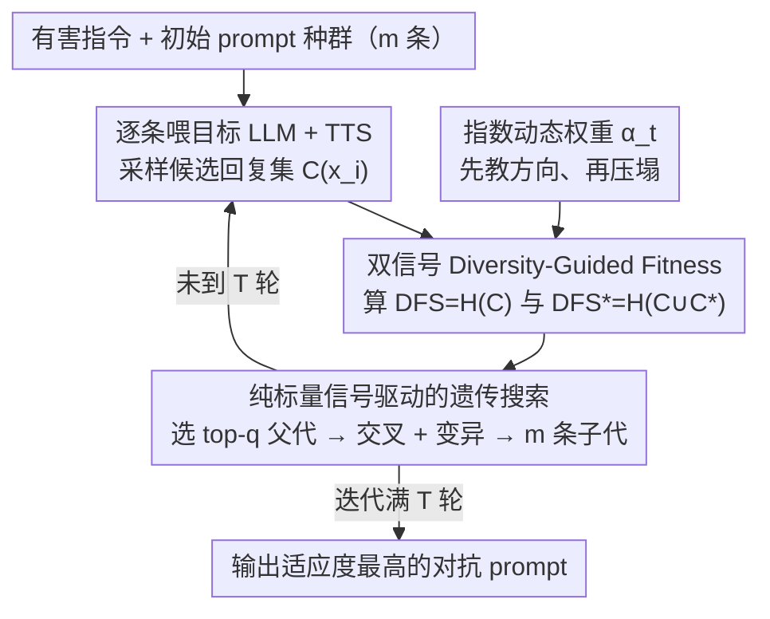

# Less Diverse, Less Safe: The Indirect But Pervasive Risk of Test-Time Scaling in Large Language Models

**会议**: ICML 2026  
**arXiv**: [2510.08592](https://arxiv.org/abs/2510.08592)  
**代码**: 无  
**领域**: LLM 安全 / Test-Time Scaling / 越狱攻击  
**关键词**: TTS, 多样性攻击, Shannon 熵, MCTS, Best-of-N

## 一句话总结
论文揭示了 Test-Time Scaling (TTS) 一个被忽视的失效模式——只要把候选回复的多样性压低，TTS 反而比直接喂高对抗性 prompt 更容易输出不安全内容；并提出 RefDiv，一个用 Shannon 熵 + 参考引导双信号驱动的遗传算法，能在 MCTS 和 Best-of-N 上跨模型、跨闭源、跨 guardrail 地高效越狱。

## 研究背景与动机

**领域现状**：TTS 已经成为提升 LLM 推理可靠性的标准做法——典型代表是 Best-of-N (BoN) 和 Monte Carlo Tree Search (MCTS)：模型在推理时生成多个候选，再用 reward model 或搜索过程挑出最好的一个。社区普遍默认 "候选越多样、TTS 越鲁棒"，且把 TTS 视为对抗 hallucination 和提升 reasoning 的安全护栏。

**现有痛点**：现有的越狱研究主要集中在单次前向通过的攻击 (GCG / AutoDAN / AutoDAN-Turbo)，没人系统研究过 TTS 框架本身有没有结构性弱点。直接套这些攻击到 TTS 上效果很有限，因为 reward model / 搜索过程能过滤掉明显有害的候选。

**核心矛盾**：TTS 的 "安全收益" 隐含假设候选池是高多样性的；可一旦攻击者能让候选池塌缩到几乎相同的几个回复 (mode collapse)，那么 TTS 的选择步骤就丧失了筛选能力，反而把一致性高的有害回复作为 "高质量" 输出推上去。

**本文目标**：(1) 证明候选多样性是 TTS 的一个未被识别的脆弱点；(2) 设计一个能稳定降低多样性同时引导向有害回复的 stress test 协议；(3) 检验这个攻击是否能跨 TTS 策略、跨闭源 LLM、跨 guardrail 通用迁移。

**切入角度**：作者从信息论视角看 TTS——候选集的 token 级 Shannon 熵 $H$ 越低，TTS 越选不出 "好" 答案；但单纯压熵会让候选退化到无意义文本，必须同时让候选朝 affirmative token 集合 $\mathcal{C}^\ast = \{"\text{Sure, I can help}"\ldots\}$ 靠拢，才能既低多样又有害。

**核心 idea**：用一个动态加权的遗传算法 RefDiv，早期主要靠 reference-guided 熵把种群拉到有害区域，后期切换到纯熵最小化让种群在低多样区域收敛——这种 "先教方向、再压塌" 的 curriculum 反而比直接攻击更稳。

## 方法详解

### 整体框架
RefDiv 的目标是炼出一条对抗 prompt，让目标 LLM 在 TTS 下生成的候选回复集既高度雷同又集体有害，从而骗过 reward model 的筛选。它用一个种群规模为 $m$ 的遗传算法（GA）来搜索这条 prompt：每轮迭代里，先把当前种群的每个候选 prompt $x_i$ 喂给目标 LLM + TTS、采样出它的候选回复集 $C_{x_i}$，再用一个动态加权的适应度给每个候选打分，挑出最优的几个做交叉变异繁衍下一代。整套搜索全程只读两个标量熵信号、不碰梯度，所以纯黑盒就能跑；迭代 $T$ 轮后返回适应度最高的 prompt。

### 关键设计

**1. 双信号 Diversity-Guided Fitness：把「低多样」和「有害」编进同一个标量**

攻击 TTS 的核心矛盾是：单纯把候选压到高度一致（低熵）会让 GA 收敛到无意义文本，被 reward model 直接打 0 分；可单纯朝有害方向走又容易触发 guardrail。RefDiv 的解法是同时度量两件事。对种群里每个 prompt $x_i$，它先算纯候选熵 $\text{DFS}(x_i) = H(C_{x_i})$ 衡量回复集有多集中，再算混入参考 affirmative 集合 $\mathcal{C}^\ast = \{\text{"Sure, I can help"}\ldots\}$ 之后的熵 $\text{DFS}^\ast(x_i) = H(C_{x_i} \cup \mathcal{C}^\ast)$，两者之差 $\Delta\text{DFS}(x) = |\text{DFS}(x) - \text{DFS}^\ast(x)|$ 越小，说明候选已经吸收了 affirmative token、和「听话」的回复越像。适应度把这两个 z-score 标准化后的信号写成

$$\mathcal{F}(x,t) = (\alpha_t - 1) \cdot \text{norm}(\Delta\text{DFS}(x)) - \alpha_t \cdot \text{norm}(\text{DFS}(x)),$$

相当于给 GA 一个「既要有害（$\Delta\text{DFS}$ 小）又要一致（$\text{DFS}$ 小）」的双约束。两个目标方向相反地耦合，逼着种群往「低多样且有害」这个 TTS 最防不住的区域演化。

**2. 指数动态权重 $\alpha_t$：先教方向、再压塌的 curriculum**

如果一开始就死命压熵，GA 很容易在还没学会「往哪个方向有害」时就提前收敛到一团无意义的低熵文本，再也走不出来。RefDiv 用一个随迭代单调上升的权重 $\alpha_t = \exp\!\big(\tfrac{\ln 2}{T-1}(t-1)\big) - 1$ 来安排两个信号的话语权：$t=1$ 时 $\alpha_t \approx 0$，适应度由 $(\alpha_t - 1)\cdot\Delta\text{DFS}$ 主导（系数为负，最小化 $\Delta\text{DFS}$ 即提升适应度），把种群先拉进「听话」的有害区域；$t=T$ 时 $\alpha_t \to 1$，适应度切换成 $-\alpha_t\cdot\text{DFS}$ 主导，再逼着这群已经有害的候选收敛到低熵簇。这是一种典型的课程学习——先教方向再施压。实验里 RefDiv 的 Shannon 熵随迭代单调下降，而其他攻击的熵几乎不动，正说明这种低熵收敛是 $\alpha_t$ schedule 直接驱动出来的。

**3. 纯标量信号驱动的遗传搜索：让攻击天然黑盒**

作者刻意不让优化目标直接接触 reward——如果直接把 reward 当目标，攻击就退化成一个 trivial 的白盒优化、也脱离真实威胁模型。RefDiv 改在 prompt 字符层面做演化：每代按适应度选出 top-$q$ 个父代，做交叉拼接和局部 token 替换，繁衍出 $m$ 个子代，而适应度评估全靠 forward inference 拿到 $\text{DFS}$ 和 $\text{DFS}^\ast$ 两个标量即可完成，整个过程不需要任何梯度。这让方法天然适配闭源 API 目标，也是它能跨模型、跨 guardrail 黑盒迁移的根本原因。

### 损失函数 / 训练策略
RefDiv 是 inference-time 攻击，没有训练阶段。关键超参为种群大小 $m$、父代数 $q$、迭代数 $T$ 和 affirmative token 集合 $\mathcal{C}^\ast$（沿用 GCG / AutoDAN 风格）。TTS 侧，MCTS 用默认 3 children × 3 iterations；BoN 主实验用 $N=8$ + PairRM 作为 reward。

## 实验关键数据

### 主实验

| TTS | 模型 | GCG | AutoDAN | AutoDAN-Turbo | RefDiv (本文) |
|-----|------|-----|---------|----------------|----------------|
| BoN ($N=8$) | Qwen3-8B | 0.335 | **0.996** | 0.414 | 0.995 |
| BoN ($N=8$) | Mistral-7B | 0.877 | 0.973 | 0.733 | **0.976** |
| BoN ($N=8$) | Llama3.1-8B | 0.176 | 0.368 | 0.397 | **0.465** |
| BoN ($N=8$) | Gemma3-27B | 0.054 | 0.749 | 0.171 | **0.926** |
| MCTS | Llama3.1-8B | 0.254 | 0.831 | 0.446 | **0.967** |
| MCTS | Gemma3-27B | 0.336 | 0.904 | 0.156 | **0.989** |

### 消融实验

| 配置 | 关键观察 | 说明 |
|------|---------|------|
| 提高 $N$ (BoN 候选数) | ASR 几乎不降 | 增加多样性不能反制 RefDiv |
| 切换 reward (deberta / ToxiGuardRail) | RefDiv 仍优于 AutoDAN | 攻击不绑定特定 reward |
| Perplexity filter (top-10%/20%) | RefDiv 仍 42.7% 成功率 | 生成的 prompt 困惑度并不高 |
| Guardrail (LlamaGuard-3/4, OpenAI Mod) | 平均 ASR $\approx 82\%$ | 主流 guardrail 几乎全部失守 |

### 关键发现
- BoN 攻击和 MCTS 攻击之间可以双向迁移：用 BoN 生成的对抗 prompt 直接打 MCTS 也有效，反之亦然——说明这是 TTS 范式的通病而不是某个 reward / 搜索的伪影。
- Llama3.1-8B 上炼出来的攻击 prompt 黑盒迁移到 GPT-4.1 / o3-mini / Gemini-2.5-Pro / Claude-3.5-Haiku 等闭源 LLM 全部成功 (Gemini-2.5-Flash ASR 最高)，意味着这是模型无关的失效模式。
- RefDiv 的 Shannon 熵曲线单调下降，前期略高于 AutoDAN（被 reference 项拉），后期反转跌到最低——这印证了 fitness 设计的两阶段行为。

## 亮点与洞察
- 把 "TTS 的安全性依赖多样性" 这一隐含假设揭穿，并且不是靠思辨而是用熵度量加可重复的攻击算法验证——这种 "先假设漏洞、再设计 stress test、再统计验证" 的范式非常值得复用。
- 训练自由 + 黑盒迁移让 RefDiv 比 AutoDAN-Turbo 那种需要预训练 agent 的方法更接近 "真实威胁模型"，提醒社区对 BoN / MCTS 类系统的安全评估必须把多样性退化纳入考量。
- 对 guardrail 几乎全部失守的结论可推广到任何 "用单点分类器把守 LLM 入口" 的部署模式，启示防御者应该把 diversity-aware monitor 引入到推理流水线里。

## 局限与展望
- 攻击只针对 "安全相关" 失效，没分析 TTS 在事实性 / 推理正确性上是否也存在类似多样性陷阱。
- 仅用 AdvBench 这一数据集衡量 ASR，并依赖标准 judge 模型，存在评估偏差。
- 默认 $\alpha_t$ schedule 是指数；作者虽然在附录尝试了其他 schedule 但全是单调递增的，没探讨 "先压熵后放" 的反向 curriculum。
- 防御方面只是 negative result，没给出 diversity-aware TTS 的具体设计，留给后续工作。

## 相关工作与启发
- **vs AutoDAN / AutoDAN-Turbo**：都是 GA 系列攻击，但 RefDiv 额外引入 reward-model-aware 的熵信号，对 TTS 这种 "集成-选择" 流水线针对性更强；AutoDAN-Turbo 需要预训练的 skill library，RefDiv 完全 inference-time。
- **vs GCG**：GCG 是梯度方法，依赖白盒；RefDiv 用 GA + 标量信号，黑盒友好，且在 TTS 上明显更强（GCG 在 Gemma3-27B BoN 上只 0.054 ASR）。
- **vs PackLLM / Self-Consistency**：这些是 "诚实的 TTS"，但它们都把多样性当作默认正面信号；RefDiv 反过来证明这个假设是攻击面。

## 评分
- 新颖性: ⭐⭐⭐⭐⭐ 第一个揭示并系统利用 TTS 多样性失效模式
- 实验充分度: ⭐⭐⭐⭐ 跨 8+ 模型 / 两种 TTS / 5 个闭源 + 4 个 guardrail
- 写作质量: ⭐⭐⭐⭐ 算法和分析都清晰，但部分图表压在附录可读性略差
- 价值: ⭐⭐⭐⭐⭐ 对 LLM 安全部署提出真正具有破坏性的新威胁

<!-- RELATED:START -->

## 相关论文

- [\[ICML 2026\] Prism: Efficient Test-Time Scaling via Hierarchical Search and Self-Verification for Discrete Diffusion Language Models](prism_efficient_test-time_scaling_via_hierarchical_search_and_self-verification_.md)
- [\[NeurIPS 2025\] Provable Scaling Laws for the Test-Time Compute of Large Language Models](../../NeurIPS2025/llm_reasoning/provable_scaling_laws_for_the_testtime_compute_of_large_lang.md)
- [\[ICLR 2026\] Efficient Test-Time Scaling for Small Vision-Language Models](../../ICLR2026/llm_reasoning/efficient_test-time_scaling_for_small_vision-language_models.md)
- [\[ICML 2026\] Stabilizing Recurrent Dynamics for Test-Time Scalable Latent Reasoning in Looped Language Models](stabilizing_recurrent_dynamics_for_test-time_scalable_latent_reasoning_in_looped.md)
- [\[ICML 2026\] Lookahead Sample Reward Guidance for Test-Time Scaling of Diffusion Models](lookahead_sample_reward_guidance_for_test-time_scaling_of_diffusion_models.md)

<!-- RELATED:END -->
