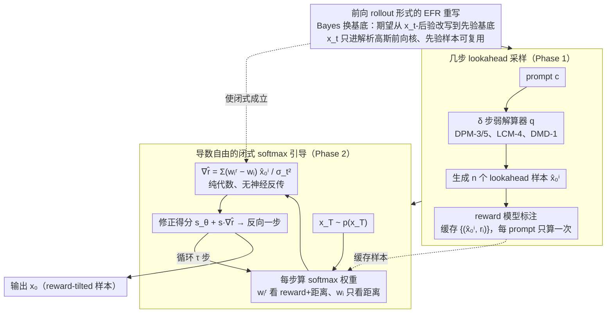

# Lookahead Sample Reward Guidance for Test-Time Scaling of Diffusion Models

**会议**: ICML 2026 Spotlight  
**arXiv**: [2602.03211](https://arxiv.org/abs/2602.03211)  
**代码**: https://github.com/aailab-kaist/Diffusion-LiDAR-Sampling  
**领域**: 扩散模型 / 测试时扩展 / 奖励引导  
**关键词**: 扩散模型, test-time scaling, reward guidance, lookahead sampling, closed-form Stein score

## 一句话总结
LiDAR 用预先生成的几步 lookahead 样本和前向扰动核重写期望未来奖励（EFR），把 reward guidance 变成无需神经反传的闭式 softmax 权重，在 SDXL/GenEval 上匹配 DATE 的指标却快 9.5×。

## 研究背景与动机
**领域现状**：T2I 扩散模型常常生成不符合人类意图的样本，主流的对齐路线分两类——一是微调（DPO、RLHF 类），二是测试时扩展（test-time scaling），后者无需训练就能换取性能，是近来研究热点。其核心是把分布 $p_\theta(\mathbf{x}_0\mid\mathbf{c})$ 推向 reward-tilted 目标 $p_\theta^r(\mathbf{x}_0\mid\mathbf{c}) \propto p_\theta(\mathbf{x}_0\mid\mathbf{c})\exp(\lambda r(\mathbf{x}_0,\mathbf{c}))$，求解对应的 target Stein score 时需要估计任意中间粒子 $\mathbf{x}_t$ 的**期望未来奖励（Expected Future Reward, EFR）**$r_t^\lambda(\mathbf{x}_t,\mathbf{c}) = \log\mathbb{E}_{p_\theta(\mathbf{x}_0\mid\mathbf{x}_t,\mathbf{c})}[\exp(\lambda r(\mathbf{x}_0,\mathbf{c}))]$。

**现有痛点**：现有 EFR 估计路线各有硬伤：

- **Backward rollout**（多次回滚到 $\mathbf{x}_0$ 取均值）：每个时间步都要完整跑反向扩散，开销近乎不可接受。
- **Tweedie 一阶 Taylor 近似**：用 $\bar{\mathbf{x}}_0 = \mathbb{E}[\mathbf{x}_0\mid\mathbf{x}_t]$ 代替样本，随 $\lambda$ 变大误差线性扩张，奖励信号一强就失真。
- **Gradient guidance**（UG / DATE）：需要 $\mathbf{x}_t \to \mathbf{s}_\theta \to$ 解码器 $\to r$ 三段神经网络的反向传播，要求 reward 可微，且对 SDXL 这种 2.6B 模型动辄 OOM。
- **SMC** 类方法：用重要性重采样避免反传，但在高维像素空间粒子很快坍缩到单个高奖励样本，多样性大幅下降，且性能高度依赖粒子数 $N$。

**核心矛盾**：EFR 表达式天生让 $\mathbf{x}_t$ 同时作为「神经网络输入」和「梯度变量」，这是反传必要、近似不准、SMC 不稳的共同根源。

**本文目标**：找到一种 EFR 重写方式，使 $\mathbf{x}_t$ 不再以输入身份进入任何神经网络，同时仍能精确刻画 reward-tilted 分布的 Stein score。

**切入角度**：注意到 $p_\theta(\mathbf{x}_0\mid\mathbf{x}_t,\mathbf{c}) \propto p(\mathbf{x}_t\mid\mathbf{x}_0)p_\theta(\mathbf{x}_0\mid\mathbf{c})$，能不能把期望换基底，从「条件在 $\mathbf{x}_t$ 上的后验」改写为「先验 $p_\theta(\mathbf{x}_0\mid\mathbf{c})$ 加权前向核 $p(\mathbf{x}_t\mid\mathbf{x}_0)$」？这样 $\mathbf{x}_t$ 只出现在已知解析形式的高斯核里，神经依赖被剥离。

**核心 idea**：用 *future marginal samples + 前向扰动核* 重写 EFR（Theorem 3.1），并用几步 ODE 求解器（DPM-3/5/8、LCM-4、DMD-1）做廉价的 **lookahead 采样**生成这些 marginal 样本；再证明 Stein score 在该形式下有 softmax 闭式（Theorem 3.3），从而实现一个无神经反传的、成本和 vanilla 几乎持平的 reward guidance 采样器——**LiDAR**。

## 方法详解

### 整体框架
LiDAR 想做的是测试时把扩散采样推向 reward-tilted 分布，却不付出反向传播的代价。它把奖励引导拆成两个解耦阶段（论文 Algorithm 1/2）：先用一个便宜的弱采样器对每个 prompt 一次性生成一批 lookahead 样本并打好分，再在正式采样时把这批样本当作"路标"，每个时间步用一条闭式 softmax 公式把粒子 $\mathbf{x}_t$ 朝高奖励样本拉、远离低奖励样本，"引力"强度正比于 reward（直觉见图 1(b)）。具体地，Phase 1 给定 prompt $\mathbf{c}$，用 $\delta$ 步快速求解器 $q(\mathbf{x}_0\mid\mathbf{c})$（DPM-Solver、LCM、DMD 等）批量生成 $n$ 个 lookahead 样本 $\{\hat{\mathbf{x}}_0^i\}_{i=1}^n$ 并用 reward 模型标注成 $\{(\hat{\mathbf{x}}_0^i, r_i)\}$，这步与 $\mathbf{x}_t$ 无关、每个 prompt 只算一次；Phase 2 从 $\mathbf{x}_T\sim p(\mathbf{x}_T)$ 反向迭代，每步用 $\mathbf{s}_\theta(\mathbf{x}_t,t,\mathbf{c}) + s\cdot\nabla_{\mathbf{x}_t}\hat r_t^\lambda$ 替代普通 Stein score，梯度项就是 lookahead 样本的 softmax 加权差。整条链路没有任何反传，reward 模型甚至可以不可微（如离散分子的环数）。

### 关键设计

**1. 前向 rollout 形式的 EFR 重写（Theorem 3.1）：把 $\mathbf{x}_t$ 从神经网络里剥出来**

EFR 的麻烦在于 $\mathbf{x}_t$ 既要作为输入喂进网络、又要被求导，这正是反传不可省、Taylor 近似不准的共同病根。LiDAR 用一次 Bayes 换基底化解：注意到 $p_\theta(\mathbf{x}_0\mid\mathbf{x}_t,\mathbf{c}) \propto p(\mathbf{x}_t\mid\mathbf{x}_0)p_\theta(\mathbf{x}_0\mid\mathbf{c})$，于是把后验上的期望 $\mathbb{E}_{p_\theta(\mathbf{x}_0\mid\mathbf{x}_t,\mathbf{c})}[\exp(\lambda r)]$ 等价改写为先验上的加权期望 $\mathbb{E}_{p_\theta(\mathbf{x}_0\mid\mathbf{c})}\big[\tfrac{p(\mathbf{x}_t\mid\mathbf{x}_0)}{\mathbb{E}[p(\mathbf{x}_t\mid\mathbf{x}_0)]}\exp(\lambda r)\big]$。换基底之后 $\mathbf{x}_t$ 只剩在解析高斯前向核 $p(\mathbf{x}_t\mid\mathbf{x}_0)$ 里出现，对它求导有闭式解，而先验样本 $\mathbf{x}_0\sim p_\theta(\mathbf{x}_0\mid\mathbf{c})$ 与 $\mathbf{x}_t$ 无关、可以被任意时间步、任意粒子复用——rollout 从"每步重跑反向扩散"变成"预生成一次、处处复用"。这是整篇文章的钥匙。

**2. 几步 lookahead 采样 + Weak-to-Strong 解释：把预生成成本摊到可忽略**

光把基底换好还不够，若仍坚持用完整的 $p_\theta$ 跑 $n$ 个先验样本，预处理依旧很慢。LiDAR 干脆用便宜的弱采样器 $q(\mathbf{x}_0\mid\mathbf{c})$（DPM-3/5、LCM-4、DMD-1 等几步求解器）近似昂贵的 $p_\theta$ 来产生 marginal 样本。把 $q$ 代入重写式（Eq. 11）得到 lookahead reward $\tilde r_t^\lambda$（Definition 3.2），其引导项恰好等价于 $s\cdot\nabla_{\mathbf{x}_t}\log\tfrac{q^r(\mathbf{x}_t\mid\mathbf{c})}{q(\mathbf{x}_t\mid\mathbf{c})}$——也就是把"弱采样器在 reward 下的密度变化"当作信号、迁移到强采样器身上，引导尺度 $s$ 可自由放缩。这正是 weak-to-strong generalization 的标准形式：弱解算器只当 reward 信号的"探针"，完整 50/100 步反向采样当"执行器"，目标分布仍由强采样器把控，而 EFR 估计成本被压成一次性、可缓存的预处理。

**3. 导数自由的闭式 softmax 引导（Theorem 3.3）：彻底消灭反传**

有了前两步，引导梯度就能写成纯代数式，不再碰任何神经网络反向传播。在 Eq. 11 的有限样本估计上直接求导，得到 $\nabla_{\mathbf{x}_t}\hat r_t^\lambda = \sum_{i=1}^n (w_i^r - w_i)\hat{\mathbf{x}}_0^i / \sigma_t^2$，其中 $w_i^r = \mathrm{Softmax}_i(\lambda r_i - \|\mathbf{x}_t-\hat{\mathbf{x}}_0^i\|^2/2\sigma_t^2)$ 同时按 reward 和到 $\mathbf{x}_t$ 的距离加权，$w_i = \mathrm{Softmax}_i(-\|\mathbf{x}_t-\hat{\mathbf{x}}_0^i\|^2/2\sigma_t^2)$ 只看距离。两者之差 $w_i^r - w_i$ 就是"reward 要我比单纯就近时更偏向哪个 lookahead 样本"：$r_i$ 高时 $w_i^r > w_i$，把 $\mathbf{x}_t$ 朝 $\hat{\mathbf{x}}_0^i$ 拉，反之推开。正是这条闭式同时满足论文 Table 1 的 Efficient-Rollout / Finite i.i.d. / No-Taylor / No-BackPropagation 四项性质，9.5× 加速、不增显存、能套任意黑盒 reward 全靠它。

### 损失函数 / 训练策略
LiDAR 是纯 *training-free* 测试时方法，不引入任何 loss 与参数更新。关键超参为 lookahead 解算器步数 $\delta$、lookahead 样本数 $n$、reward 温度 $\lambda$、引导尺度 $s$ 和目标采样总步数 $\tau$。论文给了两条 scaling law 来指导预算分配：随 $\delta$ 增大有 $D_{TV}\le O(1/\sqrt{\delta})$（Theorem 3.4），随 $n$ 增大有限样本误差以 $1/\sqrt n$ 收敛到 lookahead 目标（Theorem 3.5），实践上 $n=50$ 已足够。

## 实验关键数据

### 主实验
所有方法在 SD v1.5 / SDXL 上用 ImageReward 作为引导奖励，在 GenEval prompts（每 prompt 4 张图）上比较生成质量与单次推理成本（单卡 A100）：

| 骨架 (sampler) | 方法 | IR ↑ | GenEval ↑ | Time(s) ↓ | Mem(GiB) ↓ |
|----------------|------|------|-----------|-----------|------------|
| SD v1.5 (DDPM-100) | Vanilla | -0.001 | 0.426 | 7.07 | 8.90 |
| SD v1.5 (DDPM-100) | UG (Bansal'24) | 0.326 | 0.355 | 58.36 | 28.16 |
| SD v1.5 (DDPM-100) | DATE (Na'25) | 0.364 | 0.438 | 32.89 | 24.71 |
| SD v1.5 (DDPM-100) | **LiDAR (DPM-5,n=50)** | **0.384** | **0.478** | **13.41** | **8.90** |
| SDXL (DDPM-100) | Vanilla | 0.722 | 0.545 | 42.0 | 33.84 |
| SDXL (DDPM-100) | UG | 0.749 | 0.541 | 334.4 | OOM* |
| SDXL (DDPM-100) | DATE | 0.960 | 0.570 | 272.3 | OOM* |
| SDXL (DDPM-100) | **LiDAR (DPM-8,n=50)** | 0.994 | 0.585 | **97.99** | **33.84** |
| SDXL (DDPM-100) | **LiDAR (DMD-1,n=100)** | **1.006** | **0.598** | **78.67** | **33.84** |

LiDAR 在 SDXL 上达到与 DATE 同档的 GenEval（0.585 vs 0.570）只用 ~30% 的时间，且不需要 OOM 级别的反传显存。

### 消融实验

| 配置 | IR | GenEval | Time(s) | 说明 |
|------|----|---------|---------|------|
| Vanilla SD v1.5 | -0.001 | 0.426 | 7.07 | 无引导基线 |
| DPM-3, n=3 | 0.109 | 0.439 | 7.44 | 极弱 lookahead，几乎免费即可见效 |
| DPM-5, n=3 | 0.172 | 0.449 | 7.54 | 仅升级 lookahead 解算器精度 |
| DPM-5, n=9 | 0.211 | 0.453 | 8.27 | 加 $n$ |
| DPM-5, n=50 | 0.384 | 0.478 | 13.41 | 完整配置 |
| DPO 微调 + DPM-5, n=50 | 0.445 | 0.489 | 13.41* | 与训练侧方法正交叠加 |

### 关键发现
- **lookahead 精度 $\delta$ 和样本数 $n$ 都单调有益**，且符合理论给出的 $O(1/\sqrt\delta)$ 与 $O(1/\sqrt n)$ scaling（Figure 3）；意味着用户可以根据预算无痛调档。
- **加速来源于"没有反传"**：UG/DATE 的瓶颈是对 2.6B 的 SDXL 反向求导，时间和显存都成倍涨；LiDAR 因 score 闭式，显存退回 vanilla 水平。
- **与 DPO 微调正交叠加**有效（IR 0.384 → 0.445），说明 LiDAR 不是 reward hacking 的替代品而是无伤叠加项。
- **可适配非可微 reward**：在 UDLM 离散扩散 + QM9 分子上以"环数"为 reward，$n=4096$ 时新颖分子数从 130 → 257（Table 4）；FLUX flow matching 模型上 IR 也从 1.019 提升到 1.198（Table 3）。
- **CLIP/HPS 几乎不退化**说明引导没有以牺牲 prompt 对齐为代价（mitigates reward hacking），而 UG 的 HPS 反而从 0.263 跌到 0.236。

## 亮点与洞察
- **「换基底」一招把所有限制一并解开**：把 EFR 从 $p_\theta(\mathbf{x}_0\mid\mathbf{x}_t)$-基改写到 $p_\theta(\mathbf{x}_0)$-基，看似只是 Bayes 一拐弯，却让 efficient-rollout、finite i.i.d.、no-Taylor、no-backprop 四项一次性成立——这是论文真正的 "啊哈" 时刻。
- **闭式 softmax 公式具有强可解释性**：$w_i^r - w_i$ 同时是"奖励差"和"距离差"的函数，与 SMC 的硬采样、UG 的 gradient 都是同源思想的软化版本，物理含义清晰。
- **lookahead = "Weak-to-Strong" 的连续推广**：把弱解算器仅当作 reward 探针、强解算器当作执行器的拆解，可迁移到任何需要昂贵反传/rollout 估计的引导式生成（视频扩散、3D、语言扩散等）。
- **预生成样本可缓存**：在线服务里同一 prompt 的 $\{(\hat{\mathbf{x}}_0^i, r_i)\}$ 是一次性资产，多用户多种子下摊销成本进一步压低，工程友好。

## 局限与展望
- **质量天花板受弱采样器封顶**：lookahead 样本由 $q$ 给出，若 prompt 处于 $q$ 失效区域（如超长 prompt 或罕见组合），LiDAR 的引导信号可能失真。
- **$n$ 与显存换性能曲线在 SDXL 仍较陡**：$n=100$ 已逼近显存上限，FLUX 上 $n=100$ 后 GenEval 反而几乎不再提升（0.667 vs 0.668），说明在某些 reward 下存在饱和点。
- **奖励组合策略未深入**：Table 6 仅尝试 IR 和 CLIP 的简单加权，对多 reward 的 Pareto 前沿、对抗 reward hacking 的工程组合（如硬约束 + 软引导）还有空间。
- **理论 scaling law 是上界**：实际 $\delta$ 与 $n$ 间的最优 trade-off 仍需经验调参，没有统一的自适应策略。
- **离散扩散和 flow matching 上的实验规模偏小**，QM9/FLUX 的迁移成功更像 PoC，工业级文本/视频扩散的大规模验证缺失。

## 相关工作与启发
- **vs UG (Bansal 2024) / DATE (Na 2025)**：两者都用 Tweedie 一阶 Taylor 在 $\bar{\mathbf{x}}_0$ 上算 reward 再反传到 $\mathbf{x}_t$，受 $\lambda$ 放大的近似误差牵制并要求 reward 可微。LiDAR 直接给出 EFR 闭式，无近似、无反传，速度快 9.5× 且支持非可微 reward。
- **vs SMC 系列（Singhal 2025、Li 2025）**：SMC 同样想避反传，但用粒子重采样在高维像素空间快速坍缩、多样性丢失，且性能强依赖粒子数 $N$。LiDAR 的 Finite i.i.d. 属性保证粒子数与生成质量解耦。
- **vs Backward rollout（Holderrieth 2026、Potaptchik 2025）**：rollout 思想本质对，但被"每个 $t$ 重跑"卡住；LiDAR 用前向核 + 一次性 marginal 样本把 rollout 成本平摊一次完成。
- **vs DPO/ReFL/DRaFT 等微调路线**：训练侧方法需要梯度、数据和算力。LiDAR 是测试时方法，可与 DPO **正交叠加**，对部署阶段二次调优特别友好。
- **启发**：任何"中间变量 $\to$ 神经网络 $\to$ 反传"型的引导/控制问题（如 classifier guidance、可控分子生成、可控视频生成）都可以尝试"换基底 + 解析核 + softmax 闭式"的这套套路。

## 评分
- 新颖性: ⭐⭐⭐⭐⭐ 「Bayes 换基底 + 前向核重写 EFR」是真正的思想突破，把多个限制一次解开。
- 实验充分度: ⭐⭐⭐⭐ SD v1.5/SDXL/FLUX/UDLM 四种 backbone + 主表 + 消融 + scaling law 完备，但工业级长 prompt/视频维度缺验证。
- 写作质量: ⭐⭐⭐⭐⭐ Table 1 把四项性质对齐排开、定理与算法穿插推进，叙事极清晰。
- 价值: ⭐⭐⭐⭐⭐ 推理快 9.5× 且不增显存，可与微调正交叠加，工程价值直接落地于 T2I 商业服务。

<!-- RELATED:START -->

## 相关论文

- [\[ICML 2026\] Prism: Efficient Test-Time Scaling via Hierarchical Search and Self-Verification for Discrete Diffusion Language Models](prism_efficient_test-time_scaling_via_hierarchical_search_and_self-verification_.md)
- [\[ICLR 2026\] Efficient Test-Time Scaling for Small Vision-Language Models](../../ICLR2026/llm_reasoning/efficient_test-time_scaling_for_small_vision-language_models.md)
- [\[ACL 2026\] Parallel Test-Time Scaling for Latent Reasoning Models](../../ACL2026/llm_reasoning/parallel_test-time_scaling_for_latent_reasoning_models.md)
- [\[ACL 2025\] Revisiting the Test-Time Scaling of o1-like Models: Do they Truly Possess Test-Time Scaling Capabilities?](../../ACL2025/llm_reasoning/revisiting_the_test-time_scaling_of_o1-like_models_do_they_truly_possess_test-ti.md)
- [\[ICML 2026\] Stabilizing Recurrent Dynamics for Test-Time Scalable Latent Reasoning in Looped Language Models](stabilizing_recurrent_dynamics_for_test-time_scalable_latent_reasoning_in_looped.md)

<!-- RELATED:END -->
