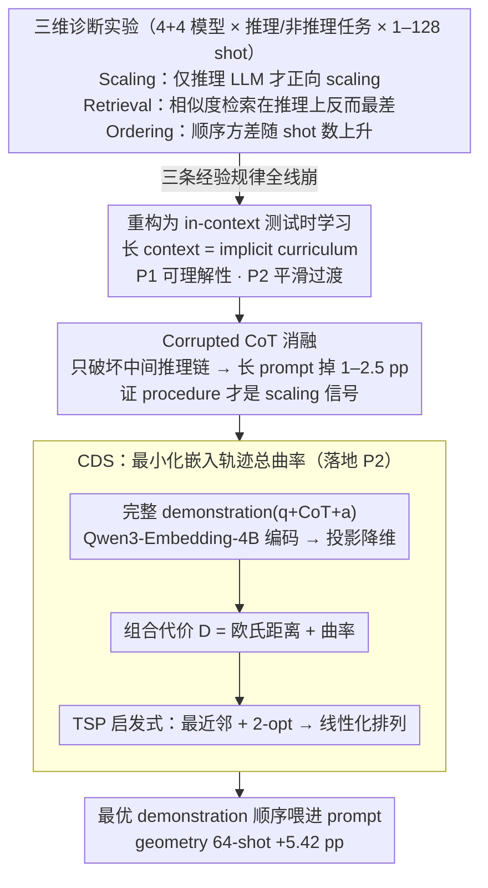

# Many-Shot CoT-ICL: Making In-Context Learning Truly Learn

**会议**: ICML 2026  
**arXiv**: [2605.13511](https://arxiv.org/abs/2605.13511)  
**代码**: 无  
**领域**: 大模型推理 / 上下文学习 / Chain-of-Thought  
**关键词**: many-shot ICL, chain-of-thought, in-context test-time learning, demonstration ordering, 曲率正则

## 一句话总结
本文系统揭示了非推理任务的 many-shot ICL “经验法则”在 CoT 推理任务上**全部失效**——相似度检索反而有害、顺序敏感性随 shot 数增长——并把成功的 many-shot CoT 重新解读为“in-context 测试时学习”，由此提出按 embedding 轨迹曲率排序 demonstration 的 CDS 方法，在 64-shot 几何题上提升 5.42 pp。

## 研究背景与动机

**领域现状**：长上下文 LLM 让 many-shot ICL 成为可能，已有工作（Bertsch et al., Baek et al.）在非推理任务（分类、简单 QA）上观察到三条规律：(1) shot 数变大性能稳定上升；(2) demonstration 顺序敏感性随 shot 数下降；(3) 相似度检索（top-k 最相似）能提升性能。同时 chain-of-thought (CoT) 已成复杂推理标配，但 CoT-ICL 大都在 few-shot 设定研究。

**现有痛点**：当 CoT 与 many-shot 结合（即 many-shot CoT-ICL），三条经验规律是否还成立？这件事完全没系统研究过。如果规律仍然 hold，那继续按检索/堆 shot 的工程套路即可；如果规律破坏了，整个 prompt 工程范式都要重新思考。这不仅是工程问题，更牵涉 ICL 本质是“规模化模式匹配”还是“真正学习”的根本争论。

**核心矛盾**：CoT demonstration 长度（geometry 任务下单条 CoT 比 BANKING77 长约 30×）、内部包含 procedural 推理链、对 model 提出更高 understanding 要求；这些性质让传统“多即是好、检索即对”的 many-shot 直觉在 CoT 场景未必成立。如果 ICL 真在“学习”，那 demonstration 是 supervision、顺序就是 curriculum，类似教学需要循序渐进；而模式匹配视角下顺序根本不该重要。

**本文目标**：(1) 系统刻画 many-shot CoT-ICL 的 scaling、retrieval、ordering 三个维度行为；(2) 找出经验规律失效的根本原因；(3) 提出一个新视角统一解释现象并指导 demonstration 选择/排序设计。

**切入角度**：把 many-shot CoT 看作 **in-context test-time learning**（in-context 测试时学习）：long-context window 不是简单的“检索缓存”，而是一个 implicit curriculum，模型 forward pass 是一种 gradient-free adaptation。这视角自然推出两条 pedagogical 原则：(P1) demonstration 必须**对模型可理解**才能成为有效 supervision；(P2) demonstration 顺序必须**平滑过渡**，避免突兀的概念跳跃打断 implicit 学习轨迹。

**核心 idea**：基于 P2，把 demonstration 顺序看作 embedding 空间中的轨迹，**总曲率**（相邻位移角度之和）就是顺序“平滑度”的量化指标；最小化总曲率即可得到一个连贯的 in-context curriculum——这就是 Curvilinear Demonstration Selection (CDS)。

## 方法详解

### 整体框架
本文走的是「诊断—理论—算法」三步链条：先用大规模对照实验把 many-shot ICL 的三条经验规律一条条放进 CoT 推理场景，发现它们全线崩塌；再以 in-context test-time learning 视角重构解释，把长 context 看成一条 implicit curriculum 而非检索缓存；最后把「顺序要平滑过渡」这条原则落地成 CDS——给定 $n$ 条 demonstration，求一个排列 $O = [\mathbf{d}_{\pi(1)}, \ldots, \mathbf{d}_{\pi(n)}]$ 最小化嵌入轨迹的总曲率 $\Theta(O) = \sum_{t=2}^{n-1} \arccos\!\left(\frac{\mathbf{v}_t \cdot \mathbf{v}_{t+1}}{\|\mathbf{v}_t\|\|\mathbf{v}_{t+1}\|}\right)$，其中 $\mathbf{v}_t = \tilde{\mathbf{e}}_t - \tilde{\mathbf{e}}_{t-1}$ 是相邻投影嵌入的位移向量。诊断阶段覆盖 4 类非推理 LLM（LLaMA 3.1 8B / 3.3 70B / Qwen2.5 7B / 14B）与 4 类推理 LLM（Qwen3 8B / 14B / QwQ 32B / DeepSeek-R1 685B），在分类任务（SuperGLUE, NLU, TREC, BANKING77）和数学/叙事推理任务（GSM8K, MATH 的 geometry / number_theory / counting_and_probability, DetectiveQA）上跑 1–128 shot，统一用开放式生成 + exact match 评估。

### 关键设计

**1. 三维诊断实验：把 many-shot 的三条常识逐条压在显微镜下，证明它们在 CoT 推理上同时崩**

许多 many-shot 工程套路（堆 shot、相似度检索、不在乎顺序）都建立在非推理任务上观察到的三条规律之上，本文要回答的核心问题就是：这些规律在 CoT 推理里还成不成立。于是作者沿 scaling / retrieval / ordering 三个独立维度各设一组对照。**Scaling** 这一维在非推理 LLM 上跑 geometry、number_theory 等推理任务，发现 shot 数增加时性能不稳甚至下降（如 LLaMA 3.3 70B 在 CoT-ICL 上出现 negative gain），只有 reasoning-oriented LLM（Qwen3、QwQ、R1）才呈现单调正向 scaling；表 1 进一步显示在 Qwen3 上关闭 thinking mode 会直接掉几何题约 7 pp，说明 reasoning prior 是 scaling 的必要条件。**Retrieval** 这一维用 embedding cosine 取 top-$k$ 最相似与 bottom-$k$ 最不相似对照：BANKING77（非推理）上 top-$k$ 显著占优、印证了检索假设，但在 geometry/number_theory/DetectiveQA 上 top-$k$ 反而最差——semantic similarity 根本不预测 procedural compatibility。**Ordering** 这一维对 5 个随机 permutation 算标准差，非推理任务 std 随 shot 数下降（顺序越来越无所谓），推理任务 std 反而随 shot 数上升，说明 path dependence 不仅存在而且越堆越深。三个独立维度同时破坏，才足以说服读者「CoT-ICL 是另一回事」而非某个数据集的巧合。

**2. Corrupted CoT 消融：用反事实证明模型真的在吸收中间推理过程，而不只是读最终答案**

诊断暴露了现象，但还需要回答一个更尖锐的问题：模型到底是在「学」demonstration 里的推理过程 $C$，还是只用了输入到输出的映射 $x \to y$。作者在 geometry 上构造一对只差 $C$ 的 prompt——正常版 $(x_i, C_i, y_i)$ 和 procedurally corrupted 版 $(x_i, C_0, y_i)$，后者把每条的 rationale 全替换成第一条 demonstration 的同一条 chain $C_0$，但保留各自的 question 和最终 answer，因而格式、context 长度、$x\to y$ 映射全被控住，唯一变量就是中间过程是否连贯。结果（表 2）很有说服力：在 $n=16$ 的 short prompt 下两组几乎没差，说明模型既能从 IO 也能从 CoT 学；而在 $n=128$ 的 long prompt 下 corrupted 版让 Qwen3-8B 掉 1.25 pp、Qwen3-14B 掉 2.51 pp——一旦 context 拉长，破坏 procedure 就实打实地伤性能。这正是「in-context test-time learning」视角需要的硬证据：procedure 才是 long-context scaling 的真正信号，比单纯讲哲学有力得多。

**3. Curvilinear Demonstration Selection (CDS)：把「平滑过渡」量化为嵌入轨迹的总曲率并最小化它**

既然顺序敏感来自「概念突变打断 implicit 学习轨迹」，那让轨迹尽量平滑就该有帮助。CDS 把这条 pedagogical 原则做成可计算的目标：先把每条 demonstration $\mathbf{d}_i$ 按 (question + CoT + answer) 整体用 Qwen3-Embedding-4B 编码成 $\mathbf{e}_i \in \mathbb{R}^d$——刻意用**完整 demonstration**而非仅 question，因为顺序效应取决于 procedural 内容，只看 question 抓不到 CoT 结构；再把 prompt 内所有嵌入投影到低维子空间 $\tilde{\mathbf{e}}_i \in \mathbb{R}^{d'}$ 让曲率估计稳定；然后把相邻两段位移的夹角定义为局部曲率 $\theta_i = \arccos\!\left(\frac{(\tilde{\mathbf{e}}_i - \tilde{\mathbf{e}}_{i-1}) \cdot (\tilde{\mathbf{e}}_{i+1} - \tilde{\mathbf{e}}_i)}{\|\tilde{\mathbf{e}}_i - \tilde{\mathbf{e}}_{i-1}\|\,\|\tilde{\mathbf{e}}_{i+1} - \tilde{\mathbf{e}}_i\|}\right)$，整条排列的总曲率即 $\Theta(O) = \sum_{i=2}^{n-1}\theta_i$（这里 $\theta_i$ 衡量「拐弯角度」，越大表示过渡越突兀），CDS 就是搜一个排列把 $\Theta$ 最小化。但精确最小化是组合爆炸（$n!$ 种排列，$n \leq 128$ 时不可行），且只压角度可能得到「整体笔直、却在嵌入空间大跳」的轨迹，于是作者退一步用 **TSP 近似**：把相邻代价定为欧氏距离与曲率之和 $D_{\text{CDS}} = D_{\text{euclidean}} + D_{\text{curvature}}$——欧氏项把相邻 demonstration 锁在邻近区域、曲率项压制突兀转折——在完整图上用最近邻启发式 + 2-opt 局部搜索求一条短路径，再线性化成最终顺序；$n \leq 128$ 时普通 CPU 上一分钟内就能算完。把最小曲率当目标不是拍脑袋：作者先量到 ordering curvature 与准确率显著负相关（总 $r=-0.547$，geometry $-0.545$，counting $-0.628$）。更关键的是为了排除「无非是把相似项聚到一起」的混淆，他们做了 high-curvature 反向 baseline——保持局部邻域不变、只反转曲率目标制造突兀转折——CDS 仍然胜出，证明起作用的是**平滑过渡本身**而非聚类，这条 causal smoothness ablation 是方法论上的点睛之笔。

### 损失函数 / 训练策略
CDS 完全是**推断时**算法，无任何训练。底层 embedding 模型用 Qwen3-Embedding-4B（off-the-shelf），评估模型涵盖 LLaMA、Qwen2.5、Qwen3、QwQ、DeepSeek-R1 系列，prompt 上下文最大 131K tokens，shot 数扫 $n \leq 128$。

## 实验关键数据

### 主实验
CDS 在 Qwen3 系列上的提升（几何 / 数论 / DetectiveQA）：

| 任务 | 模型 | 配置 | n=64 提升 |
|---|---|---|---|
| Geometry | Qwen3-14B | CDS vs 随机排序 | **+5.42 pp** |
| Geometry | Qwen3-14B | n=128 + thinking on | 73.07% vs n=16 的 66.18% |
| Geometry | Qwen3-14B | thinking on vs off (n=128) | 73.07 vs 65.76 |
| Number_theory | Qwen3-14B | thinking on vs off (n=128) | 91.30 vs 88.15 |
| DetectiveQA | Qwen3-8B | thinking on vs off (n=128) | 69.48 vs 66.88 |

### 消融实验

| 配置 | 行为 | 说明 |
|---|---|---|
| CDS (low curvature) | 最佳 | 完整方法 |
| High-curvature baseline | 显著差 | 同 embedding 邻域、反转曲率目标 |
| 相似度 top-k 检索 | 反而差 | semantic similarity 不预测 procedural compatibility |
| 相似度 bottom-k | 介于 top-k 与原始之间 | 反直觉 |
| Procedurally corrupted CoT (n=128) | 显著差（-1.25 to -2.51 pp） | 证明 procedure 起关键作用 |
| Thinking mode disabled | 显著差 | reasoning prior 是 scaling 必要条件 |
| 非推理 LLM + CoT-ICL | scaling 不稳甚至负向 | model class 决定能否吸收 CoT |

### 关键发现
- **CoT-ICL 不是规模化模式匹配**：相似度检索在 BANKING77（非推理）有效但在 geometry/number_theory/DetectiveQA（推理）**反向**，否决了 retrieval hypothesis 在推理上的有效性。
- **顺序敏感性随 shot 数上升**（与非推理任务相反）：100+ 个 demonstration 随机排会有更多“概念突变”，触发 procedural 不连贯。
- **Self-generated CoT 优于 ground-truth CoT**：弱模型上自生 CoT（甚至带错答案）比数据集 CoT 表现更好；这种优势随模型变强而缩小，验证 P1（“可理解性优先”）。
- **Reasoning-oriented LLM 与非推理 LLM 的 scaling 差距**根源在 thinking token——它把 demonstration 当 procedural supervision 抽取，而非把 IO 当模式匹配。
- **总曲率与准确率显著负相关**（geometry $r=-0.545$，counting $r=-0.628$），所以最小曲率不是 ad-hoc 启发式而是可量化的目标。

## 亮点与洞察
- **in-context test-time learning 视角是个统一锚点**：从这个角度看，scaling 失败（P1 违反）、相似度失败（procedure 不匹配 surface）、顺序敏感（P2 违反）三件事全都被一句话覆盖——长 context 是 implicit curriculum 而非 cache。这种“一个视角解释三类异常现象”的统一性给后续 prompt 工程提供了清晰的设计指导。
- **Self-generated CoT 优于 ground-truth CoT** 是一个非常反直觉但合理的发现：模型对自己生成的 CoT 更“能读懂”，即使带错答案也能从 procedural 上下文中受益。把它写进 prompt pipeline 就是一个免费的工程升级——给弱模型用自己的 CoT 训自己。
- **总曲率作为 ordering 目标**：把抽象的“平滑过渡”量化为相邻位移夹角之和，既几何直觉强又算得动；causal smoothness ablation 用高曲率反向 baseline 排除“相似聚集”混淆，方法论扎实。
- **embedding 用完整 demonstration**这一细节关键：仅 question embedding 会丢失 CoT procedural 结构；用 question + CoT + answer 才能让曲率反映 procedural 转换难度。

## 局限与展望
- CDS 的核心“平滑过渡”假设依赖 embedding 空间对 procedural 内容的可表达性；如果 embedding 模型本身对 CoT 内部结构编码差（如 instruction-only 模型），曲率信号失真，方法效果难保证。
- 实验集中在数学和叙事推理；编程、定理证明、agentic planning 等更复杂的推理类型是否同样满足曲率-性能负相关未验证。
- CDS 用 TSP 近似（最近邻 + 2-opt）求顺序，论文虽给出「$n \leq 128$ 时 CPU 上一分钟内」的实测代价，却没刻画这个启发式离全局最小曲率有多远；组合代价里欧氏项与曲率项的权重也未做敏感性分析。
- “self-generated CoT 优于 ground-truth” 的优势随模型变强缩小——但这是否意味着未来强模型完全可以扔掉 self-generation 这一步骤，论文没量化。
- 未来可探索把曲率项作为可微正则直接 inject 到训练里（curriculum learning fine-tuning），或与 RAG 的 chunk 排序结合做 retrieval-aware curriculum。

## 相关工作与启发
- **vs Bertsch et al. / Baek et al.（many-shot ICL）**：他们在非推理任务上发现 scale + 顺序鲁棒 + 检索有效；本文证明这三条在 CoT 推理上同时失效，是对该工作的关键 corrective。
- **vs Auto-CoT (Zhang et al.) / Dr.ICL (Luo et al.)**：他们在 few-shot 场景做 CoT demonstration 选择；本文聚焦 many-shot 设定的全新动力学。
- **vs Test-time scaling (Snell et al.)**：test-time scaling 主要靠 sample-and-revise 增加 inference 计算；本文把 many-shot CoT 视为另一种 test-time scaling 形式，把 demonstration 当 in-context supervision。
- **启发**：(1) 任何依赖“长 context 把检索做大”的工程（RAG、agent memory）都应该重新考虑 ordering 的影响；(2) 教育心理学的 "zone of proximal development" 和 textbook 曲线观点在 prompt 工程里有具体可量化对应物，可能催生“pedagogical prompting”这个新子领域。

## 评分
- 新颖性: ⭐⭐⭐⭐⭐ 第一个系统化否定 many-shot ICL 经验法则在 CoT 上的迁移，重构视角并落地 CDS
- 实验充分度: ⭐⭐⭐⭐ 4+4 模型 × 多任务 × 多 shot × 多 seed，covered 三大维度且配 causal ablation；但 CDS 评测主要在 Qwen3 一家
- 写作质量: ⭐⭐⭐⭐⭐ 诊断—理论—算法—验证的链条清晰，pedagogical 类比贴切
- 价值: ⭐⭐⭐⭐⭐ 对所有依赖 long-context 的 prompt 工程都是 wake-up call，CDS 是即插即用的工程升级

<!-- RELATED:START -->

## 相关论文

- [\[ACL 2025\] CoT-ICL Lab: A Synthetic Framework for Studying Chain-of-Thought Learning from In-Context Demonstrations](../../ACL2025/llm_reasoning/cot-icl_lab_a_synthetic_framework_for_studying_chain-of-thought_learning_from_in.md)
- [\[ICLR 2026\] CoT-RVS: Zero-Shot Chain-of-Thought Reasoning Segmentation for Videos](../../ICLR2026/llm_reasoning/cot-rvs_zero-shot_chain-of-thought_reasoning_segmentation_for_videos.md)
- [\[ICLR 2026\] Is In-Context Learning Learning?](../../ICLR2026/llm_reasoning/is_in-context_learning_learning.md)
- [\[AAAI 2026\] LLMs for Game Theory: Entropy-Guided In-Context Learning and Adaptive CoT Reasoning](../../AAAI2026/llm_reasoning/llms_for_game_theory_entropy-guided_in-context_learning_and_adaptive_cot_reasoni.md)
- [\[ICML 2026\] Clustering as Reasoning: A $k$-Means Interpretation of Chain-of-Thought Graph Learning](clustering_as_reasoning_a_k-means_interpretation_of_chain-of-thought_graph_learn.md)

<!-- RELATED:END -->
