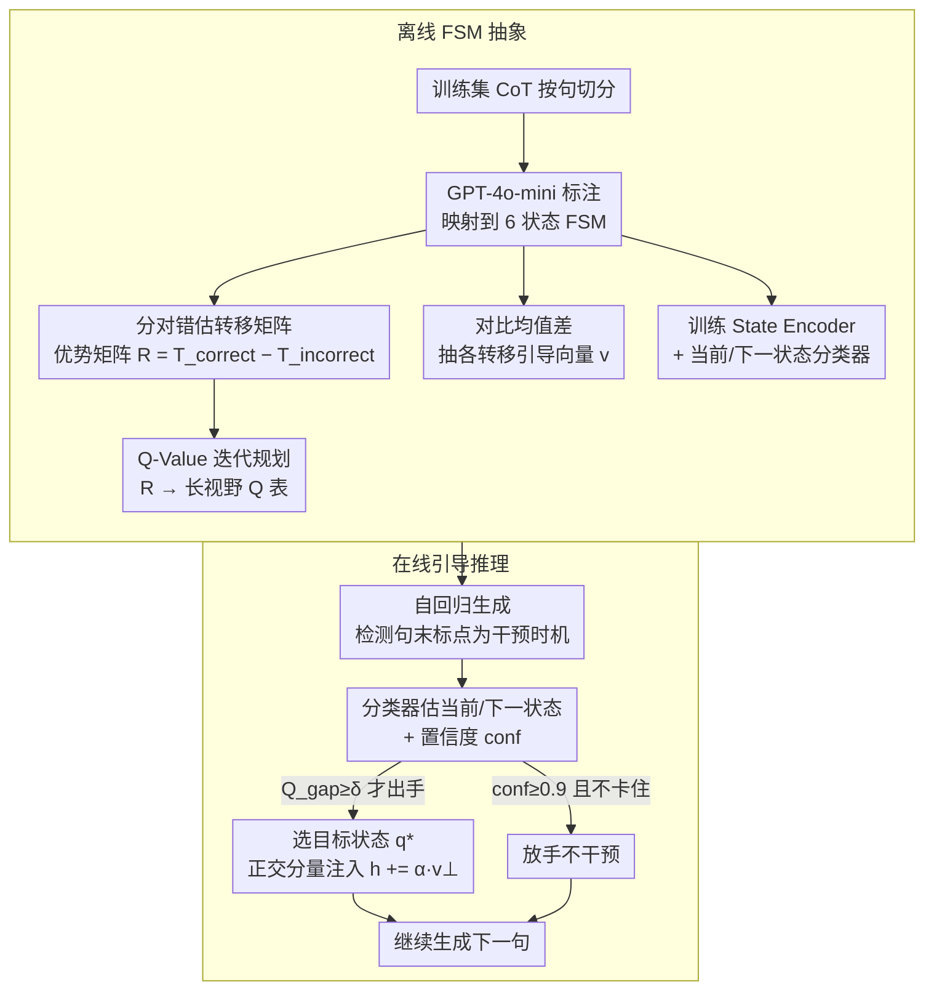

# Modeling Hierarchical Thinking in Large Reasoning Models

**会议**: ICML2026 Oral  
**arXiv**: [2510.22437](https://arxiv.org/abs/2510.22437)  
**代码**: https://github.com/shahariar-shibli/CoT-FSM (有)  
**领域**: LLM推理  
**关键词**: 有限状态机, 思维链, 激活引导, Q-Value 规划, 推理可解释性

## 一句话总结
作者把大推理模型（LRM）的长 CoT 抽象成一个 6 状态有限状态机（FSM），用「成功 vs 失败」的状态转移概率差构造 Transition Advantage Matrix，并基于 Q-Value 迭代得到长视野规划策略，仅在句子边界做稀疏的正交激活引导，就能用约 25× 更少的干预次数把 AIME25 等难题的准确率拉高最高 +13%。

## 研究背景与动机

**领域现状**：LRM 通过生成动辄上千 token 的 CoT 完成复杂推理任务，已在 AIME、GPQA 这类难题上展现出近似人类「思考再答」的层次化结构。围绕 CoT 的可解释性，近期工作开始用激活引导（activation steering）做行为级控制，比如 SEAL 抑制冗余反思、Venhoff 等人识别行为对应的线性方向。

**现有痛点**：这些控制手段都停留在「局部行为」层面——要么只压制单一类型片段（如 reflection / transition），要么只验证某个行为在激活空间里可调，但都回答不了一个关键控制问题：**当模型当前正处于推理轨迹的某个阶段时，下一步最该往哪个认知状态走，才最有利于最终答对**？

**核心矛盾**：可解释性（identify steerable behaviors）和可操作控制（decide when & where to intervene）之间存在缺口。逐 token 干预会破坏内容连贯性、成本极高；只看一步贪心又会落入「短视陷阱」，把模型推进死胡同。

**本文目标**：(1) 给 CoT 一个全局的层次化结构刻画；(2) 量化哪些认知转移真正区分对错；(3) 设计一个训练无关、干预稀疏、有长期视野的引导策略。

**切入角度**：人类问题求解理论（Polya 的「四步法」、Schoenfeld 的 Episode Theory）早就把解题过程划成有限的高层认知阶段；LRM 既然是在人类 CoT 上训练出来的，其涌现轨迹应当也能用一组离散状态来近似。

**核心 idea**：把 CoT 建模成 6 状态 FSM，用「正确 vs 错误」转移矩阵之差 $R$ 当作奖励，用 Q-Value 迭代算出长视野效用，在句子边界做「正交分量」激活引导——把推理控制从「逐 token 微调」变成「认知策略规划」。

## 方法详解

### 整体框架
方法分两阶段：**离线 FSM 抽象** 与 **在线引导推理**。

离线阶段：对训练集生成完整 CoT，按句子切分后用 GPT-4o-mini 自动标注，把每句映射到 6 个高层状态之一 $\mathcal{Q}=\{\text{init, deduce, augment, uncertain, backtrack, closure}\}$；据此估计「正确轨迹」和「错误轨迹」两套条件转移矩阵 $T^{(correct)}$ 与 $T^{(incorrect)}$，得到 Transition Advantage Matrix $R = T^{(correct)} - T^{(incorrect)}$；同时用 contrastive difference-of-means 抽取每个有向转移 $(u\to v)$ 的激活引导向量 $\mathbf{v}^{(\ell)}_{u\to v}$，并训练一个 State Encoder + 两个轻量分类器（当前状态 $g_{curr}$、下一状态 $g_{next}$）。

在线阶段：自回归生成时持续检测句末标点（`. ? !`）作为干预时机；遇到边界就用分类器估当前/下一状态，按 Q-Value 策略决定是否引导、引导到哪个目标状态 $q^\star$，然后把对应引导向量在隐藏空间做正交分量注入，最后照常继续生成。

### 关键设计

**1. 6 状态 FSM 抽象 + Transition Advantage Matrix $R$：把无结构的 CoT 压成一张能区分对错的转移图**

之前的 CoT 控制要么按行为类别一刀切、要么只盯单条线性方向，始终没有一个能比对、能当奖励空间的全局结构。本文先把 LRM 的 CoT 句子序列 $\mathcal{S}=(s_1,\dots,s_K)$ 用标注函数 $\phi:\mathcal{S}\to\mathcal{Q}$ 投影到 6 状态轨迹并合并自环（只保留真正发生的状态转移），这 6 个状态 $\mathcal{Q}=\{\text{init, deduce, augment, uncertain, backtrack, closure}\}$ 对应 Polya 的「理解—计划—执行—回顾」框架，再补上 LRM 特有的 uncertainty / backtracking，既贴着人类认知传统、人工一致性也很高（Cohen's Kappa 0.89）。

有了离散轨迹，就能分别在「答对」「答错」两组样本上估计条件转移概率 $T^{(correct)}_{ij}$、$T^{(incorrect)}_{ij}$，并令 $R_{ij}=T^{(correct)}_{ij}-T^{(incorrect)}_{ij}$。$R_{ij}>0$ 意味着「从 $i$ 跳到 $j$ 在正确轨迹里更常见」，是该鼓励的正向转移；$R_{ij}<0$ 则是失败模式的信号。这张 $|\mathcal{Q}|\times|\mathcal{Q}|$ 的优势矩阵第一次让「control」挂到了一个外推后仍稳定的转移图上，而不是依赖某模型某次 prompt 的临时统计——它既是认知结构的刻画，又直接是后面规划要用的奖励。

**2. Q-Value 迭代规划 + 置信度门控的稀疏触发：把单步奖励变成长视野效用，并精确决定何时、往哪干预**

直接拿 $R$ 最大那一格做贪心，会把模型推进「短期高回报但远期错误」的路径——实验里 QWEN+AIME25 就因此从 83.3% 反掉到 76.67%。本文把 FSM 当成一个小型规划问题，对裁剪后的奖励 $R_{clip}=\text{clip}(R,[-c,+c]),\ c\in[0.2,0.3]$ 跑 Bellman 风格迭代

$$Q_{k+1}(q,q'):=R(q,q')+\gamma\max_{q''}Q_k(q',q''),\quad \gamma=0.9$$

迭代 100 步收敛得到 $Q$ 表，于是「下一步之后的累积收益」也被纳入考量。推理时分类器给出当前状态 $q$、下一状态概率向量 $\mathbf{p}$ 和置信度 $\text{conf}=\max_j p_j$，定义最优目标 $q^\star=\arg\max_{q'}Q(q,q')$ 与缺口 $Q_{gap}=Q(q,q^\star)-Q(q,\hat q_{t+1})$。门控分三重：若模型既不「卡住」（最近 5 步同状态）又有 $\text{conf}\ge 0.9$ 就放手不管；否则只有当 $Q_{gap}\ge\delta=0.06$ 才出手，强度按 $\alpha=\max(\beta,\,Q_{gap}\cdot\text{conf})$ 动态调（$\beta\in[0.1,1.2]$）。正是这套「长视野 + conf/stuck/$Q_{gap}$ 三重门控」把干预集中到「模型正要跑偏的高杠杆决策点」，才能把每题干预次数压到 0.48 还能涨点。

**3. 句子边界的正交分量激活注入：保住内容、只换方向，把下一句偏向目标状态**

确定要引导到 $q^\star$ 后，怎么注入也有讲究：直接加 $\alpha\mathbf{v}$ 会破坏隐藏向量里已承载的内容信息，让下一句语义跑偏。本文只在句末标点 token 处取第 $\ell$ 层隐藏向量 $\mathbf{h}^{(\ell)}_k$，归一化得 $\hat{\mathbf{h}}=\mathbf{h}/(\|\mathbf{h}\|_2+\varepsilon)$，再把离线抽到的转移引导向量 $\mathbf{v}^{(\ell)}_{u\to v}$ 中平行于内容的分量减掉、只留正交部分注入：

$$\mathbf{v}_\perp=\mathbf{v}-(\mathbf{v}^\top\hat{\mathbf{h}})\hat{\mathbf{h}},\qquad \tilde{\mathbf{h}}^{(\ell)}_k=\mathbf{h}^{(\ell)}_k+\alpha\mathbf{v}_\perp$$

这相当于「保住内容、只换方向」，做一次小幅侧向扰动把下一句的状态分布偏向 $q^\star$。引导向量本身用 contrastive difference-of-means 抽取：正集是该转移所有句末隐藏向量、负集是其它所有转移，取均值差。之所以选句末标点，是因为这正是「模型即将提交下一句」的语义点，与 transition vector 抽取时取的 last-token-of-sentence 严格对齐——引导粒度和控制粒度一致，扰动才能可靠生效。

### 损失函数 / 训练策略
State Encoder 是 2 层 MLP（LayerNorm + ReLU + dropout 0.1）投到 512 维单位球面，用 triplet loss $\mathcal{L}_{triplet}=\max(0,\|\mathbf{z}_a-\mathbf{z}_p\|^2-\|\mathbf{z}_a-\mathbf{z}_n\|^2+m)$（$m=1.1$）训 50 epoch，Adam $lr=10^{-4}$；当前/下一状态分类器在编码上 80/20 train-test 划分，测试准确率 >90%。引导向量逐层抽并按验证集挑层（GPT-L/M 第 19 层、PHI 22 层、QWEN 30 层），Greedy $\alpha=1.0$，Weighted $\alpha\in[0.1,1.0]$，Q-Value $\delta=0.06$。整个 pipeline 不更新 LRM 权重。

## 实验关键数据

### 主实验

| 数据集 | 模型 | Default Acc | Q-Value Acc | Q-Value 干预次数 | Greedy 干预次数 |
|--------|------|------|----------|------|------|
| AIME25 | GPT-L | 43.30 | **56.67** | 55.20 | 77.60 |
| AIME25 | QWEN | 83.33 | **86.67** | 42.40 | 287.13 |
| MATH-500 | GPT-L | 79.00 | **83.20** | **0.48** | 12.17 |
| MATH-500 | GPT-M | 86.40 | **87.00** | **0.30** | 42.69 |
| GPQA-D | GPT-M | 64.14 | **67.17** | 88.12 | 246.93 |
| GSM8K | QWEN | 78.77 | **79.30** | **6.05** | 40.39 |

最亮的一条是 GPT-L 在 MATH-500：Q-Value 仅平均 0.48 次干预/题就把准确率从 79.0% 提到 83.2%，比 Greedy 用 12.17 次干预换 81.2% 还省 25×。

### 消融实验

| 配置 | AIME25 GPT-L Acc | MATH-500 GPT-L Acc | 说明 |
|------|----|----|------|
| Default | 43.30 | 79.00 | 无任何引导 |
| Greedy | 50.00 | 81.20 | 短视贪心，QWEN/AIME25 还会掉点 |
| Weighted | 56.67 | 82.40 | 软混合多个正/负转移 |
| Q-Value | **56.67** | **83.20** | 长视野规划 + 置信度门控 |
| Cross-Model（QWEN→GPT-L, MATH-500） | — | 82.80 (Q-Val) | 仅比 model-specific 掉 0.4 点，但干预数翻倍 |

### 关键发现
- **干预稀疏性 ≈ 推理效率**：Q-Value 在准确率打平甚至略升的情况下，干预次数能比 Greedy 少 25×（MATH-500 GPT-L 0.48 vs 12.17），说明 FSM + 长视野规划真的能定位「高杠杆决策点」而不是均匀加噪。
- **短视贪心会反噬**：QWEN 在 AIME25 上 Greedy 让准确率从 83.3% 掉到 76.67%、GPT-M 在 MATH-500 也轻微下滑，验证了「下一步看似最优 ≠ 长程最优」，长视野规划的必要性是被实证打出来的。
- **难题增益最大**：AIME25 上 GPT-L 直接 +13.37 点、QQ 让 QWEN 的 token 数几乎不变就涨点；越是需要长链反复 backtrack 的任务，FSM 抽象提供的全局结构越值钱。
- **转移图部分跨模型迁移**：用 QWEN 的 advantage matrix 去引导 GPT-L 在 MATH-500 上还能拿 82.8%，说明 LRM 的认知转移有「通用骨架」，但精细校准还是模型特定的。

## 亮点与洞察
- **把 CoT 控制问题改写成 6 状态规划问题**：之前的激活引导工作要么按行为类别一刀切、要么只验证「某方向可调」；本文把「该不该干预、往哪干预」整体上升为一个有 Bellman 解的 RL 子问题，等于给可解释性研究装了个「策略层」。这条思路可以平行迁移到工具调用规划、多步 agent 决策等同样有「离散状态 + 长视野」结构的任务。
- **句子边界 + 正交分量**：把干预严格对齐到「模型刚提交完一句话」的语义点，且只动正交方向，把内容连贯性和方向偏置解耦——这套「在哪干预 / 怎么干预 / 干预多少」的三段式 recipe 非常通用，可以照搬到对话风格控制、安全对齐等场景。
- **「Advantage 矩阵 - Q 表 - conf 门控」三件套**：把基于模型本身的统计偏差（$R$）转成可规划奖励、再用置信度判定是否真的需要干预，这是一个非常干净的「数据驱动控制」框架，门槛低于 RLHF / DPO 但效用明显。

## 局限与展望
- **依赖 GPT-4o-mini 标注的状态**：6 状态边界本身由 frontier 模型注释，作者也承认这会把 annotator 的认知偏差刻进 $R$；如果换一个标注器或换一个领域（如代码、agent 工具调用），状态分类法很可能要重新设计与验证。
- **FSM 无记忆假设过强**：真实推理里「现在该不该回溯」往往依赖于「之前已经回溯过几次」这种历史信息，纯 Markov 转移图捕捉不到这种依赖；作者把它列为未来工作（POMDP / 带 memory 的状态机）。
- **句子边界检测有歧义**：靠 `.?!` 切句会把方程里的小数点、缩写、公式当作句末，inference 时无法在生成中可靠区分，这是所有 sentence-level 干预方法的共同瓶颈。
- **干预过度可能压制多样性**：作者在 Impact Statement 里点出，过度对齐到「典型成功路径」可能抑制非常规但正确的解法；缺少在 creative / open-ended 任务上的反向评测。
- **跨模型 $R$ 迁移虽可行但有损**：cross-model 实验在 MATH-500 上能保住大部分性能，但准确率会掉、干预数翻倍，说明每个 LRM 还得有自己的一套 $R$ 才能榨干性能，规模扩展时是一笔不小的离线成本。

## 相关工作与启发
- **vs SEAL (Chen et al., 2025a)**：SEAL 把 CoT 切成 execution / reflection / transition 三类并整体抑制 reflection/transition；本文不是「永远压住某类行为」而是「按 state 动态选下一步该跳哪」，控制粒度从「行为类别」细化到「具体转移」，且第一次回答了 *when & where* 的问题。
- **vs Venhoff et al. (2025)**：他们证明单个行为对应激活空间里的线性方向；本文继承其抽 steering vector 的技巧，但把「孤立行为的单次干预」升级成「跨转移的策略级控制」，同时把「在哪干预」交给学到的分类器 + Q-Value gating，干预频次大降。
- **vs Bogdan et al. (2025) thought anchors**：thought anchors 用 sentence-level 分析识别关键推理步；本文复用了句子粒度的合理性，但更进一步给出可执行的控制策略，从「分析」走到「干预」。
- **vs Minegishi/Matsutani/Xiong 系列「reasoning graph」工作**：他们从隐状态聚类或 token 聚类抽出 reasoning graph 来「分析」推理结构与准确率的相关性；本文走的是「先定义紧凑的 6 状态空间 → 再用规划论做控制」的另一条路，是分析 + 控制闭环。
- **启发**：「把开放生成抽成有限离散状态 + 在状态空间做规划」是一种非常通用的范式，可往 multi-agent 协同、code agent 工具调用次序、安全拒答路径上迁移；尤其是「Advantage matrix 差分得奖励」这一招对任何「有 success/failure label 的轨迹数据」都直接可用。

## 评分
- 新颖性: ⭐⭐⭐⭐ 不是第一个做 CoT 抽象或激活引导的，但把两者用 FSM + Q-Value iteration 串起来形成完整控制框架，是干净有力的组合创新。
- 实验充分度: ⭐⭐⭐⭐ 4 个 benchmark × 3 个 LRM × 3 个引导策略 + 跨模型迁移 + 与 prompt 引导的对比，规模够、对比够，对每个设计点都给了数字。
- 写作质量: ⭐⭐⭐⭐ 框架图、qualitative case、公式推导、超参表都齐；6 状态选择上引了两套人类认知理论做辩护，论证链清晰。
- 价值: ⭐⭐⭐⭐ 25× 更少干预拿到等价/更高准确率，作为 train-free inference-time 控制方法已经非常实用；且整个 pipeline 提供了一个可被任何「能拿到 success label 的轨迹任务」复用的控制框架。

<!-- RELATED:START -->

## 相关论文

- [\[ICML 2026\] Inducing Overthink: Hierarchical Genetic Algorithm-based DoS Attack on Black-Box Large Language Reasoning Models](inducing_overthink_hierarchical_genetic_algorithm-based_dos_attack_on_black-box_.md)
- [\[ICML 2026\] Are Large Reasoning Models Interruptible?](are_large_reasoning_models_interruptible.md)
- [\[NeurIPS 2025\] Controlling Thinking Speed in Reasoning Models](../../NeurIPS2025/llm_reasoning/controlling_thinking_speed_in_reasoning_models.md)
- [\[ICML 2026\] Reasoning Structure of Large Language Models](reasoning_structure_of_large_language_models.md)
- [\[CVPR 2026\] VisRef: Visual Refocusing while Thinking Improves Test-Time Scaling in Multi-Modal Large Reasoning Models](../../CVPR2026/llm_reasoning/visref_visual_refocusing_test_time_scaling.md)

<!-- RELATED:END -->
