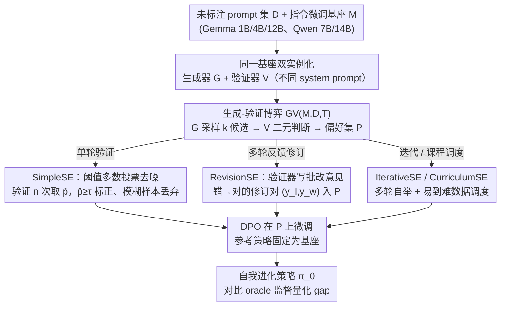

# On the Generalization Gap in Self-Evolving Language Model Reasoning

**会议**: ICML 2026  
**arXiv**: [2606.01075](https://arxiv.org/abs/2606.01075)  
**代码**: 无  
**领域**: LLM推理 / 自我进化 / 偏好学习  
**关键词**: 闭环自我进化, DPO, 生成-验证博弈, Knights & Knaves, 推理泛化

## 一句话总结
本文在"只有未标注 prompt + 基座模型"的严格闭环设定下，系统比较了 4 种自我进化（SE）策略（单轮验证、多轮修订、迭代训练、课程学习）与 oracle 监督的差距，发现在 Knights & Knaves 逻辑推理上 SE 能把 Gemma 3 4B 从 31.0% 提到 44.8%，但相对 oracle 的 53.3% 仍有 8–13% 的持续 gap，只有 12B 模型的 RevisionSE 才能逼近 oracle（52.8% vs 53.6%）。

## 研究背景与动机

**领域现状**：LLM 后训练正从 SFT/RLHF/RLVR 这种依赖人类标注或可验证奖励的范式，转向"自我进化"（Self-Evolution, SE）——让模型用自己产生的监督信号去改进自己，例如自我验证、生成式反馈、internal confidence reward（INTUITOR、Absolute Zero、R-Zero、EMPO 等）。

**现有痛点**：现有 SE 工作各自挑设定、各自报数，难以判断"在最干净的闭环约束下，SE 到底能逼近 oracle 监督多少？"。同时另一派研究又警告 model collapse、generator–verifier gap、从合成数据学习的理论障碍。两边都有结论，但缺少在统一框架下的横向对比。

**核心矛盾**：SE 想要的是"模型自带的验证能力 ≥ 训练所需的监督质量"，但实际上验证器就是生成器本身，验证误差会污染偏好对，进而限制 DPO 的提升空间。问题的根本是：**internal verifier 究竟能多准、能否替代 ground-truth？**

**本文目标**：在严格闭环约束（仅给定未标注 prompt 集 $\mathcal{D}$ 和基座 $\mathcal{M}$，所有 reasoning trace / reward / feedback / preference label 都必须由 $\mathcal{M}$ 自产）下，系统刻画 SE 与 oracle supervision 的 generalization gap，并分析这个 gap 受什么因素决定（模型规模、任务可验证性、训练算力、课程顺序）。

**切入角度**：把所有闭环 SE 方法统一抽象为"生成器–验证器博弈"$\mathsf{GV}(\mathcal{M},\mathcal{D},T)$，差别只在于"信号怎么提取、怎么复用、怎么结构化"。再选 Knights & Knaves（KK）作为主测试平台——它确定可验证、难度参数化（人数 2–8）、几乎无污染，是研究 easy-to-hard 泛化的干净实验台。

**核心 idea**：用"统一 GV 框架 + 越来越复杂的 SE 变体（SimpleSE → RevisionSE → IterativeSE → CurriculumSE）"逐步逼近 oracle，量化"再多投入算力 / 再多结构，闭环 SE 是否能彻底关掉与 oracle 的 gap"。

## 方法详解

### 整体框架
论文要回答的是"在最干净的闭环约束下，自我进化能逼近 oracle 监督多少"，所以先把四种 SE 方法统一塞进同一个生成器–验证器博弈 $\mathsf{GV}(\mathcal{M},\mathcal{D},T)\rightarrow\mathcal{P}$：同一个基座 $\mathcal{M}$ 用不同 system prompt 实例化成生成器 $\mathcal{G}$ 和验证器 $\mathcal{V}$，对每个 prompt $q$ 让 $\mathcal{G}$ 采样 $k$ 个候选 $\{\hat{y}_1,\dots,\hat{y}_k\}$、$\mathcal{V}$ 逐个给二元判断，只有当 $\mathcal{V}(q,y_w)=\texttt{Correct}$ 且 $\mathcal{V}(q,y_l)=\texttt{Incorrect}$ 时才把 $(y_w,y_l)$ 收进偏好集 $\mathcal{P}$，最后用 DPO 在 $\mathcal{P}$ 上微调。输入是未标注 prompt 集加指令微调过的基座（gemma-3-it 1B/4B/12B、Qwen-2.5-Instruct 7B/14B），输出是 DPO 后的策略 $\pi_\theta$；四种方法的全部区别都落在"$\mathcal{P}$ 到底怎么造"这一点上——SimpleSE、RevisionSE、Iterative/CurriculumSE 共用同一个 GV 博弈骨架与 DPO 收尾，只在分支处用不同方式从博弈里榨出偏好对。

### 关键设计

**1. SimpleSE + 阈值多数投票去噪：把单轮自我验证升级成高置信偏好对挖掘**

最朴素的做法是让验证器对每个候选判一次对错直接当标签，但单次验证噪声大，错判会直接污染偏好集、把 DPO 带偏。这里的做法是对每个候选 $\hat{y}$ 让验证器独立跑 $n$ 次，算出经验正确率 $\hat{p}(q,\hat{y})=\frac{1}{n}\sum_j \mathbf{1}\{\mathcal{V}^{(j)}=\texttt{Correct}\}$，只有 $\hat{p}\geq\tau$ 才标 Positive、$1-\hat{p}\geq\tau$ 才标 Negative，落在中间"模棱两可"的样本一律丢掉，再用标准 DPO 损失 $\mathcal{L}_{\text{DPO}}=-\mathbb{E}[\log\sigma(\beta\log\frac{\pi_\theta(y_w|x)}{\pi_{\text{ref}}(y_w|x)}-\beta\log\frac{\pi_\theta(y_l|x)}{\pi_{\text{ref}}(y_l|x)})]$ 训练。阈值 $\tau$ 就是去噪旋钮：$\tau=0.5$ 退化成普通多数投票，$\tau=0.7$ 在 4B 上 precision/recall 平衡最好。它之所以有效，是因为丢掉低置信样本等价于把验证器的有效准确率拉到训练能消化的水位（Fig 2a），这正是 4B 起步就能正向自进化的前提，也是后面所有变体共用的基础去噪组件。

**2. RevisionSE（多轮反馈修订）：让验证器从"打标签"升级成"写批改意见"，把反馈本身变成监督信号**

单轮验证只用到"对/错"这一 bit，白白浪费了大模型其实擅长"指出错在哪里"的能力。RevisionSE 把博弈展开成 $T>1$ 轮，下一轮候选按 $\hat{y}^{(t+1)}\sim\mathcal{G}(\cdot\mid q, f(\mathcal{V}(q,\hat{y}^{(t)})))$ 生成，其中 $f$ 把验证判断映射成一段文字反馈喂回生成器；当且仅当 $\mathcal{V}(q,\hat{y}^{(t)})=\texttt{Incorrect}$ 而 $\mathcal{V}(q,\hat{y}^{(t+1)})=\texttt{Correct}$（修订把错改对）时，才把 $(y_l,y_w)$ 收进 $\mathcal{P}$，最稳的实现是只取一条修订链最后两个样本。这等价于把验证器的隐式判别力放大成可解释的结构化训练数据，也是全文唯一能逼近 oracle 的设定（12B 上 52.8% vs 53.6%）。但它有明显的规模门槛：1B 上反而比 SimpleSE 低 1.4 个点（22.4% vs 23.8%），因为小模型的修订过程常把本来对的答案改错。

**3. IterativeSE / CurriculumSE（数据顺序与轮次）：把单轮 SE 摊成多轮，并用难度调度替代随机混合**

单轮 SE 能挖到的偏好对在数量和质量上都有上限，于是这里从两个维度继续榨：迭代版从 $\mathcal{M}_0=\mathcal{M}$ 出发，每轮做 $\mathcal{P}_t=\mathsf{GV}(\mathcal{M}_{t-1},\mathcal{D}_t,T)$、$\mathcal{M}_t=\texttt{Finetune}(\mathcal{M}_{t-1},\mathcal{P}_t)$ 且全程 offline，靠"模型变好→验证更准→数据更干净"的正反馈滚动改进；课程版则把 $\mathcal{D}$ 按 KK 人数切成 $\mathcal{D}_{\text{easy}}\cup\mathcal{D}_{\text{hard}}$，先在 KK23 上跑 SimpleSE 再迁到 KK45，用"先简单后难"压低早期 verifier 噪声、同时显式测 easy-to-hard 泛化，末尾可选再补一轮 oracle round 把上限往上顶。两种调度都能稳定打过随机混合，但相对 oracle 仍留 ~5% 的 gap，说明"会安排数据"补不了"验证器本身能力有限"这个根。

### 损失函数 / 训练策略
全程用 DPO，参考策略固定为基座，$\beta>0$ 控制偏好对齐的锐度；评测用 exact-match accuracy，temperature 0.7 采样 1 次、4 个随机种子取平均。算力分析里 $n_1$ 是每个 query 的生成次数、$n_2$ 是每个候选的验证次数，网格搜索的结论是"加 verifier 算力比加 generator 算力更划算"。

## 实验关键数据

### 主实验：KK 上四种 SE 与 oracle 的差距（Gemma 3 4B）

| 方法 | 2–3 ppl | 4–5 ppl | 6–8 ppl | All | vs Oracle |
|------|---------|---------|---------|-----|-----------|
| Baseline (gemma-3-4b-it) | 62.0 | 31.0 | 10.3 | 31.0 | −22.3 |
| SimpleSE ($\tau=0.6$) | 70.9 | 45.4 | 17.5 | 40.7 | −12.6 |
| RevisionSE | 75.8 | 46.4 | 17.1 | 42.2 | −11.1 |
| Iterative SimpleSE ×3 | 75.2 | 49.6 | 19.7 | 44.1 | −9.2 |
| Curriculum SimpleSE (KK23→KK45) | 76.2 | 49.7 | 20.6 | 44.8 | −8.5 |
| **Oracle Verifier (KK23→KK45)** | **80.8** | **60.9** | **29.8** | **53.3** | — |

### 规模消融：RevisionSE 与 oracle 的差距随模型规模收窄

| 模型 | Baseline | SimpleSE 最佳 | RevisionSE | Oracle | RevisionSE 与 Oracle gap |
|------|----------|---------------|------------|--------|--------------------------|
| Gemma 3 1B | 7.8 | 8.4 ($\tau=0.8$) | 7.8 | 12.5 | −4.7（小模型反向） |
| Gemma 3 4B | 31.0 | 40.7 | 42.2 | 46.6 | −4.4 |
| Gemma 3 12B | 47.5 | 51.1 | **52.8** | 53.6 | **−0.8（≈ 闭合）** |

### 关键发现
- **持续 gap = 8–13%**：除 12B 的 RevisionSE 外，所有 4B 上的 SE 变体相对 oracle 都留下 8–13% 的差距；加再多迭代轮次也只是边际收益递减，唯一能再推一截的是"最后加一轮 oracle"（4B 上 44.1→53.2）。
- **存在能力门槛**：1B 模型无论怎么 SE 都几乎不动甚至倒退（RevisionSE 会把对的改错），4B 才稳定正收益；自验证需要基座准确率约 ≥30% 才能正向自举。
- **任务可验证性决定上限**：把 SimpleSE 搬到 OpenThoughts3 + GSM8K/MATH500/MATHHard/TabMWP/KK 五个开放推理任务后，4B 上的提升从 KK 的 +10% 萎缩到 MATH500 +1.6%、TabMWP +2.9%——因为开放题没有 deterministic 答案，internal verifier 区分"看起来对但其实错"的能力很弱。
- **算力分配启发**：网格搜索 $n_1$（生成）与 $n_2$（验证）显示"加 verifier passes 比加 generator candidates 更性价比"，$\tau=0.7$ 是 precision/recall 的甜点。
- **Pass@1 ↑ 但 Pass@32 ≈**：支持 sharpening 假说——闭环 SE 只是把模型已有的高概率正确路径"放大"，并没有教会它新的解法，所以提升 OOD 难度（6–8 人）的能力有限。

## 亮点与洞察
- **把"零碎的 SE 工作"压成一根坐标轴**：从 SimpleSE → RevisionSE → IterativeSE → CurriculumSE 是按"信号丰富度 × 计算开销"递增排列的，每一格都对应 oracle gap 的一次缩小，结论清楚，复现路径明确。读完能直接判断"自己的 SE 方法卡在哪一格"。
- **RevisionSE 在 12B 上的"几乎闭合 gap"是全文最 surprising 的实证**：它说明只要模型大到能给自己写出合格的"批改作业"，闭环 SE 就有可能不输 oracle。这把 SE 的研究重心从"找新算法"指向"看 verifier capability 怎么随 scale 涨"。
- **可迁移的 trick**：阈值多数投票 + DPO 是任何用"模型当 verifier"的 pipeline 都能直接套用的去噪模块；"加一轮 oracle round 收尾"是预算受限场景里把 SE 拉满的便宜操作；"先 SimpleSE 自举、再用少量 oracle 校准"的 hybrid 是论文给出的实用建议。

## 局限与展望
- 作者承认：评测主要绑定 Knights & Knaves，开放推理只是次要验证；只用了 DPO 一种 offline 优化，没碰 online RL；只在 Gemma/Qwen 两族指令模型上测，base model 行为未知。
- 我的观察：（1）"闭环"定义偏窄——禁用代码执行器、外部工具、其他模型，导致结论里"SE 关不掉 gap"几乎是定义决定的；放宽到允许 self-consistency / multi-agent verification 时结论可能不同。（2）4B 的 baseline 31% 刚好踩在"能自举"的门槛上，gap 大；如果换成更弱的家族（如 LLaMA-3 8B base），SE 可能直接负收益，论文没有覆盖。（3）KK 任务太"封闭"，verifier 几乎只需要做布尔判定，无法回答 internal verifier 在"过程性奖励"上的表现。
- 改进思路：把 Pass@32 与 sharpening 假说做成定量监控指标；把 oracle round 的稀疏插入策略做成 schedule learning 问题；研究 verifier capability 与 model scale 的 scaling law，预测多大模型才能彻底关掉 gap。

## 相关工作与启发
- **vs Absolute Zero (AZR)**：AZR 在线 self-play + 代码执行器拿可验证奖励，本文严格闭环不允许外部环境。在 Qwen2.5-7B 上 SimpleSE（offline、无环境）反而在 GSM8K/MATH500/TabMWP/KK 上全面打过 AZR/AZR-Coder，说明"指令微调 + offline DPO" 起点比从 base model 做 online RL 更稳。
- **vs INTUITOR**：INTUITOR 用 self-certainty 作为 online RL 奖励，是闭环 SE 的另一个分支。本文的 SimpleSE 在多数 benchmark 上略优，但更重要的是给出了"闭环 SE 的上限就在 oracle 附近，且要靠 RevisionSE + 大模型才能逼近"这一更普适的结论。
- **vs Song et al. (2024) 的 generation–verification gap 理论**：本文把理论上的 gap 落成了具体数字（8–13%），并指出 gap 的关键决定变量是 internal verifier 准确率，与"sharpening hypothesis"互相支持。
- **vs 自我修正 / self-refinement（Madaan et al. 2023, Kumar et al. 2024）**：那一脉是推理时改写输出，本文是把修订过程"蒸馏"成训练数据，方向正交但可叠加。

## 评分
- 新颖性: ⭐⭐⭐⭐ 没提新算法，但把"闭环 SE 的 gap"做成系统量化，框架贡献明显。
- 实验充分度: ⭐⭐⭐⭐⭐ 4 种 SE × 3 种规模 × 多个阈值 × 5 个开放推理 benchmark，覆盖度高。
- 写作质量: ⭐⭐⭐⭐ 框架清晰、表格信息密度高；个别符号（SimpleGV vs SimpleSE）混用稍乱。
- 价值: ⭐⭐⭐⭐⭐ 给整个 self-evolution 子领域提供了诚实的"地板/天花板"参照系，避免后续工作在"虚高的 gap"上做无用功。

<!-- RELATED:START -->

## 相关论文

- [\[AAAI 2026\] Incorporating Self-Rewriting into Large Language Model Reasoning Reinforcement](../../AAAI2026/llm_reasoning/incorporating_self-rewriting_into_large_language_model_reasoning_reinforcement.md)
- [\[ICML 2026\] SmartThinker: Progressive Chain-of-Thought Length Calibration for Efficient Large Language Model Reasoning](smartthinker_progressive_chain-of-thought_length_calibration_for_efficient_large.md)
- [\[ICLR 2026\] Why is Your Language Model a Poor Implicit Reward Model?](../../ICLR2026/llm_reasoning/why_is_your_language_model_a_poor_implicit_reward_model.md)
- [\[ICML 2026\] GRPO is Secretly a Process Reward Model](grpo_is_secretly_a_process_reward_model.md)
- [\[ICML 2026\] Prism: Efficient Test-Time Scaling via Hierarchical Search and Self-Verification for Discrete Diffusion Language Models](prism_efficient_test-time_scaling_via_hierarchical_search_and_self-verification_.md)

<!-- RELATED:END -->
