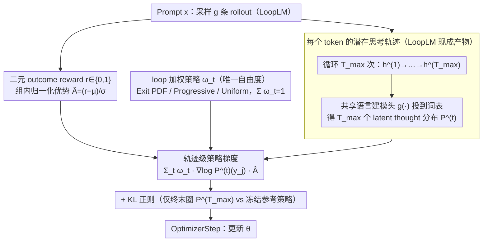

# Prioritize the Process, Not Just the Outcome: Rewarding Latent Thought Trajectories Improves Reasoning in Looped Language Models

**会议**: ICML 2026  
**arXiv**: [2602.10520](https://arxiv.org/abs/2602.10520)  
**代码**: https://github.com/jonwill8/RLTT.git  
**领域**: LLM 推理 / 强化学习 / 循环 Transformer  
**关键词**: Looped Language Model, 隐式推理, 轨迹级信用分配, GRPO, 过程奖励

## 一句话总结
针对 Looped Language Model（LoopLM）在每个 token 输出前会反复迭代 $T_{\max}$ 次潜在表征的特点，本文提出 RLTT：把 GRPO 中"只奖励最后一圈"的策略梯度改成"按权重 $\omega_t$ 给每一圈的 next-token 分布都打分"，在不引入外部 verifier、计算开销几乎为零的情况下，把 Ouro-2.6B 在 MATH/AIME/BeyondAIME 上的平均准确率提升 +10.9%，并出现训练时间下降 10% + 响应长度自发缩短的副产物。

## 研究背景与动机

**领域现状**：主流的"长链推理"路线靠显式 chain-of-thought（CoT）token 把思考过程吐出来，再用 RL with verifiable rewards（GRPO 为代表）按最终答案的正误回灌梯度。而另一条路线是**隐式推理**：以 Ouro、Huginn 为代表的 LoopLM，在每个输出 token 之前把同一组 transformer 权重循环执行 $T_{\max}$ 次，让模型在隐藏空间里"想"完再说，参数量更小却能匹敌显式 CoT。

**现有痛点**：当把 GRPO 直接套到 LoopLM 上时，几乎拿不到增益——Ouro 原论文承认 RL 相对 SFT 几乎没有提升；LSRL 试图用 GPT-4.1 nano 给每一圈中间状态打过程奖励，但需要把隐状态解码成文本再调外部 API，工程开销和成本都极高。

**核心矛盾**：GRPO 的策略梯度 $\nabla_\theta \log P_\theta^{(T_{\max})}(y_j\mid x,y_{<j}) \hat{A}_i$ 只是终末一圈输出分布的函数，**隐式假设每个 token 只有一步决策**；可 LoopLM 实际经历了 $h_j^{(1)}\to\cdots\to h_j^{(T_{\max})}$ 的完整轨迹，奖励信号必须穿过所有中间 loop 才能反向传播到早期表征，形成"信用分配瓶颈"。

**本文目标**：设计一个能直接替换 GRPO、无需外部 verifier、且让 RL 信号同时作用在每一圈隐式分布上的策略梯度框架。

**切入角度**：LoopLM 架构有一个被忽视的便利——**每一圈的隐状态 $h_j^{(t)}$ 都可以通过共享的语言建模头 $g(\cdot)$ 投到词表上**，免费产出 $T_{\max}$ 个"latent thought distribution"。既然这些分布本来就在前向计算里被算出来，那把它们都纳入策略梯度几乎不增加计算量。

**核心 idea**：用一个权重序列 $\{\omega_t\}_{t=1}^{T_{\max}}$（$\sum \omega_t = 1$）把每一圈的 $\log P_\theta^{(t)}$ 加权求和，替换 GRPO 里那个只看终末分布的 $\log P_\theta^{(T_{\max})}$——以此把信用直接打在"思考轨迹"上而不是"思考终点"上。

## 方法详解

### 整体框架
RLTT 想解决的是"GRPO 套到 LoopLM 上几乎拿不到增益"这个老问题，它的答案是一个即插即用的 GRPO 替代品：流程上和 GRPO 完全同构——对 prompt $x$ 采样 $g$ 条 rollout $\{y_i\}$，按二元正确性奖励 $r_i\in\{0,1\}$ 算组内归一化优势 $\hat{A}_i=(r_i-\mu)/\sigma$——唯一改动落在策略梯度的形式上。GRPO 只对每个 token 的终末一圈分布求 $\nabla_\theta\log P$，RLTT 则把这个 token 在全部 $T_{\max}$ 圈循环里产生的 next-token 分布都按权重 $\omega_t$ 加权进梯度，从而让奖励信号直接作用在整条"思考轨迹"上而非只作用在终点。

### 关键设计

**1. 轨迹级策略梯度：把信用打在每一圈，而不是只打在最后一圈**

GRPO 的策略梯度 $\nabla_\theta\log P_\theta^{(T_{\max})}(y_j\mid x,y_{<j})\hat{A}_i$ 只是终末一圈输出分布的函数，等于隐式假设"每个 token 只有一步决策"；但 LoopLM 实际经历了 $h_j^{(1)}\to\cdots\to h_j^{(T_{\max})}$ 的完整轨迹，奖励要先穿过所有中间 loop 才能反传到早期表征，形成信用分配瓶颈。RLTT 的做法是把式 (3) 里的单圈梯度替换成全圈加权和 $\sum_{t=1}^{T_{\max}}\omega_t\nabla_\theta\log P_\theta^{(t)}(y_j\mid x,y_{<j})\hat{A}_i$，使梯度直接成为所有圈隐式分布的函数。这之所以可行，是因为 LoopLM 每一圈的隐状态 $h_j^{(t)}$ 都能经共享语言建模头 $g(\cdot)$ 投到词表，本来就在前向里被算出 $T_{\max}$ 个"latent thought distribution"，把它们都纳入策略梯度几乎不增加算力。它带来两个直接后果：奖励信号不必再单纯靠终末一圈反传，而整条轨迹 $P_\theta^{(1)}\to\cdots\to P_\theta^{(T_{\max})}$ 都被推向高优势的预测——等价于把有效信用分配视域从 $T_{\max}$ 步压到 1 步，每次更新更信息密集，并天然鼓励模型"早收敛"。

**2. 三种 loop 加权策略 $\{\omega_t\}$：RLTT 唯一的自由度**

权重序列 $\{\omega_t\}_{t=1}^{T_{\max}}$（满足 $\sum_t\omega_t=1$）决定每一圈贡献多少信用，是整个方法唯一需要选择的东西。作者给了三种：**Exit PDF** 取 $\omega_t=p_{\text{exit}}(t\mid x)$，直接复用 Ouro 学到的 early-exit head 概率当"该圈可信度"，模型自己觉得该停的那一圈得分最高；**Progressive** 取 $\omega_t=t^\alpha/\sum_s s^\alpha$，越靠后的圈权重越大，对应"refinement 越多越逼近真分布"的直觉；**Uniform** 取 $\omega_t=1/T_{\max}$，所有圈等权，逼模型尽早形成正确分布并维持。有意思的是三种策略实测差异 < 1%（附录 A.3），这说明收益主要来自"暴露完整轨迹"这件事本身，而不是某种精巧调度——也反过来证伪了 LSRL "必须用 GPT 给中间状态打分"那条重外部依赖路线。论文主表用 Exit PDF，因为它最贴近 Ouro 原生的 halting 行为。

### 损失函数 / 训练策略
最终损失（式 (5)–(7)）把全圈加权项和 GRPO 风格的 KL 正则拼在一起：

$$J_{\text{RLTT}}(\theta) = -\mathbb{E}\Big[\frac{1}{g|y_i|}\sum_{i,j,t} \omega_t \log P_\theta^{(t)}(y_{i,j}\mid x,y_{<j})\hat{A}_i\Big] + \beta D_{\mathrm{KL}}(\pi_\theta \| \pi_{\mathrm{ref}})$$

奖励是二元 outcome reward（最终答案精确匹配 → 1，否则 0），训练集只用 MATH；优势用组内 z-score 归一化（同 GRPO）。KL 正则只对终末圈 $P_\theta^{(T_{\max})}$ 与冻结参考策略 $P_{\mathrm{ref}}^{(T_{\max})}$ 计算，避免对所有圈算的显存爆炸。加权默认 Exit PDF，附录验证 Progressive 与 Uniform 在大多数 benchmark 上差距 < 1%。工程上真正的代价不是算力（per-loop logits 在前向里本就存在），而是显存翻倍，这也是 per-GPU token 打包被砍半的根因。

## 实验关键数据

### 主实验

LoopLM+RL 这条路过去屡战屡败，所以论文刻意把改进和"调参侥幸"撇清：rollout 预算、优化器、奖励函数、advantage 归一化、训练步数（140 步）、KL 系数全部与 GRPO 对齐，唯一被迫不同的是为保留全部 $T_{\max}$ 圈 log-prob 而把 `ppo_max_token_len_per_gpu` 从 16384 砍半到 8192（用 mini-step 补偿）；math 评估时甚至故意给 GRPO 更长的 token budget（MATH-500 上 GRPO 3072 vs. RLTT 2048），主动消除"RLTT 赢只是因为响应更短"的干扰。

| 模型 | MATH-500 | AIME24 | AIME26 | BeyondAIME | GSM8K | Math Avg | Non-Math Avg |
|---|---|---|---|---|---|---|---|
| Ouro-1.4B-Thinking | 73.2 | 16.7 | 13.3 | 4.0 | 90.7 | 39.6 | 58.7 |
| + GRPO | 77.4 | 16.7 | 16.7 | 6.0 | 91.7 | 41.7 | 59.5 |
| **+ RLTT** | **81.2** | **26.7** | **20.0** | **12.0** | 90.3 | **46.0 (+5.8)** | **64.8 (+5.3)** |
| Ouro-2.6B-Thinking | 75.6 | 13.3 | 6.67 | 5.0 | 93.6 | 38.8 | 64.5 |
| + GRPO | 79.0 | 16.7 | 16.7 | 6.0 | 93.9 | 42.5 | 65.2 |
| **+ RLTT** | **86.0** | **33.3** | **26.7** | **16.0** | **94.0** | **51.2 (+10.9)** | **71.8 (+6.6)** |
| Qwen3-4B + GRPO | 62.2 | 3.33 | 3.33 | 0.0 | 89.8 | 31.7 | 58.7 |

Ouro-1.4B+RLTT 的 math 平均（46.0%）已经超过 Qwen3-4B+GRPO（31.7%）；2.6B+RLTT 在 AIME24/26/BeyondAIME 上对 GRPO 的提升分别达 +16.6/+10.0/+10.0%。配对 t 检验显示 RLTT 优于 GRPO 在 2.6B 上 8/9 benchmark 显著（p<0.05），1.4B 上 7/9 显著。

### 训练动态与消融

| 指标 | GRPO | RLTT | 说明 |
|---|---|---|---|
| 训练时间（140 step） | 54.42 hrs | 49.05 hrs | RLTT 自发缩短响应 → 训练时间 -10% |
| Min/Step | 23.3 ± 8.31 | 21.1 ± 9.87 | 同 |
| 响应长度趋势 | 平稳 | 持续下降 | reward 不含 brevity incentive，纯涌现 |
| 终末熵下降 | 缓慢 | 更陡更持续 | 配合 Pass@k 排除了 entropy collapse |
| Loop weighting 策略 | n/a | Exit/Progressive/Uniform 差 < 1% | 增益来自暴露完整轨迹，而非精巧调度 |
| GPQA（zero-shot） | 19.7 (2.6B) | 38.4 (2.6B) | 多跳事实推理几乎翻倍 |
| 1-2 loop 评估 | 大幅退化 | 仍显著优于 GRPO | 早期 loop 的推理能力被真正强化 |

### 关键发现
- **零显式奖励却自发缩短输出**：reward 只看最终答案对错，但 RLTT 把信用平摊到每一圈隐式分布，等价于在隐式空间里逼迫"早收敛"，于是不需要靠 token 级长尾修正 → 响应自然变短、训练更省时。
- **GPQA 几乎翻倍是最有力的迁移证据**：训练只用 MATH，但 GPQA（图形/事实多跳）对"reasoning trajectory 是否能在 token budget 内稳定收敛"极度敏感，RLTT 在这种受限场景下优势最大。
- **理论支撑（附录 A.10 Theorem A.5）**：在"loop refinement 降不确定性 + 终末奖励对长度凹 + 总不确定度成本近似线性"三条假设下，可证 RLTT 比 GRPO 期望需要更少 token 才能达到正确解——解释了 RLTT 在小 token budget 下尤其稳健。
- **GSNR 显著提升**：在 AIME24 / BeyondAIME 这种最难、信用分配最稀疏的任务上，RLTT 的梯度信噪比统计显著优于 GRPO，是"richer gradient signal"假说的直接证据。

## 亮点与洞察
- **架构对齐式 RL**：识别出 GRPO 的"单步决策假设"与 LoopLM 多步隐推理的根本错配，并用"复用每圈现成 logits"几乎零成本修正，是把 RL 算法和模型架构语义对齐的范例——这种"算法该长什么样取决于模型在算什么"的思路可迁移到任何带中间表征可读出的架构（如 recurrent-depth、speculative decoding 的 draft head）。
- **过程奖励无需外部 verifier**：相比 LSRL 用 GPT-4.1 nano 解码每圈中间状态再打分，RLTT 直接把"模型自己每圈预测的 next-token 分布"当作过程信号，零额外 API 调用，是过程奖励路线里少见的"自给自足"方案。
- **副产物即诊断信号**：响应长度下降、熵更陡降、训练时间缩短全是 reward function 没显式优化的方向，说明 RLTT 改的是"模型怎么想"而不是"模型学什么"。这种"过程对齐 → 推理效率涌现"的现象，对当前显式 CoT 模型常见的 overthinking 病可能有启发。

## 局限与展望
- 作者承认：(i) 保留每圈 log-prob 显存翻倍，限制 per-GPU token 打包；(ii) 方法专用于 LoopLM 架构，对标准非循环 LLM 不适用；(iii) 训练/推理用固定 loop 深度，牺牲了 Ouro 原生的 adaptive early-exit 能力。
- 自己发现的局限：评估全部基于 Ouro 一个 LoopLM family（作者也明示"目前唯一开源 LoopLM"），结论是否在不同 base 模型上普适尚未验证；training 数据仅 MATH，跨域泛化结论虽强但缺乏控制变量的"非数学训练"对照；理论 Theorem A.5 的关键假设之一（$c_{\textsc{rltt}} \geq c_{\textsc{grpo}}$）只是直觉论证，没在真实模型上验证不等式是否严格成立。
- 改进思路：(i) 用 gradient checkpointing 或 FP8 存 per-loop log-prob，缓解显存瓶颈；(ii) 把 RLTT 与 adaptive halting 结合——让 $\omega_t$ 随 input 难度动态变化，恢复 Ouro 的 per-token compute allocation；(iii) 推广到 Huginn / Coconut 等其他隐式推理架构验证"轨迹级信用"是否仍然奏效。

## 相关工作与启发
- **vs GRPO**：本文最直接的 baseline，区别就在"终末-only" → "轨迹加权"；RLTT 实测全面胜出且几乎零额外算力，但显存翻倍。
- **vs LSRL（Ren, 2025）**：同样想给 LoopLM 加过程奖励，但 LSRL 把每圈隐状态解码成文本送给 GPT-4.1 nano 打分，工程开销和成本极高，且增益只有 +4.27% on GSM8K；RLTT 直接复用每圈 logits 当过程信号，零外部依赖且增益大得多。
- **vs Ouro（Zhu et al., 2025b）**：Ouro 论文给出了 LoopLM 架构和 SFT 配方，但坦言 RL 加不上去；RLTT 正面解决了这个"为何 RL 在 LoopLM 上失效"的问题，是对 Ouro 工作的直接补完。
- **vs Coconut / CODI / CCoT**：这些工作把 CoT 压进连续潜在空间但训练仍用 SFT 或蒸馏；RLTT 证明在隐式推理架构上 RL 可行的关键不是改 reward 形式，而是改 credit assignment 的目标分布。

## 评分
- 新颖性: ⭐⭐⭐⭐ 把 GRPO 改成轨迹加权的想法本身朴素，但精准对接到 LoopLM 架构上的"现成 per-loop logits"使得收益与成本的比值极好。
- 实验充分度: ⭐⭐⭐⭐⭐ 1.4B/2.6B 双尺度 × 9 个 benchmark × 严格对齐协议 + 配对 t 检验 + GSNR + Pass@k + loop-count 分析 + loop weighting 消融 + 理论附录，是少见的把 RL 改进写到这么扎实的论文。
- 写作质量: ⭐⭐⭐⭐ 动机—方法—why-it-works 三段结构清晰，公式标号统一；缺点是把核心想法藏在式 (4) 才出场，前面铺垫稍长。
- 价值: ⭐⭐⭐⭐⭐ 第一个让 RL 在 LoopLM 上明确 work 的工作，且无需外部 verifier，预计会成为后续 latent reasoning + RL 路线的强基线。

<!-- RELATED:START -->

## 相关论文

- [\[ICML 2026\] Stabilizing Recurrent Dynamics for Test-Time Scalable Latent Reasoning in Looped Language Models](stabilizing_recurrent_dynamics_for_test-time_scalable_latent_reasoning_in_looped.md)
- [\[ICML 2026\] GRPO is Secretly a Process Reward Model](grpo_is_secretly_a_process_reward_model.md)
- [\[ICLR 2026\] Co-rewarding: Stable Self-supervised RL for Eliciting Reasoning in Large Language Models](../../ICLR2026/llm_reasoning/co-rewarding_stable_self-supervised_rl_for_eliciting_reasoning_in_large_language.md)
- [\[ACL 2026\] Large Reasoning Models Are (Not Yet) Multilingual Latent Reasoners](../../ACL2026/llm_reasoning/large_reasoning_models_are_not_yet_multilingual_latent_reasoners.md)
- [\[NeurIPS 2025\] Smaller Models, Smarter Rewards: A Two-Sided Approach to Process and Outcome Rewards](../../NeurIPS2025/llm_reasoning/smaller_models_smarter_rewards_a_two-sided_approach_to_process_and_outcome_rewar.md)

<!-- RELATED:END -->
