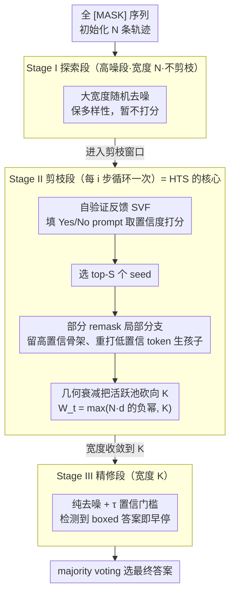

# Prism: Efficient Test-Time Scaling via Hierarchical Search and Self-Verification for Discrete Diffusion Language Models

**会议**: ICML 2026  
**arXiv**: [2602.01842](https://arxiv.org/abs/2602.01842)  
**代码**: https://github.com/viiika/Prism  
**领域**: LLM 推理 / 测试时算力扩展 / 离散扩散语言模型  
**关键词**: dLLM、test-time scaling、层级轨迹搜索、自验证、部分 remask

## 一句话总结
作者把"为离散扩散语言模型（dLLM）做高效 test-time scaling"这一问题拆成三件事——按"探索→渐进剪枝→精修"的层级时间表分配计算（HTS）、用部分 remask 做局部分支保住高置信"逻辑骨架"、把 dLLM 自己当 Yes/No 验证器（SVF），最终在 4 个数学/代码基准、3 个 dLLM 上以远少于 best-of-$N$ 的 NFE 达到相近甚至更好的精度。

## 研究背景与动机

**领域现状**：测试时算力扩展（TTS）已经成为给 LLM 加 reasoning 能力的主流工具——chain-of-thought、self-consistency、best-of-$N$、PRM 引导搜索等等几乎全都建立在自回归（AR）解码上：从左到右展开搜索树，prefix 一旦定下来就难以回头。最近兴起的离散扩散语言模型 dLLM（LLaDA 8B、Dream 7B、LLaDA 2.0-mini 等）则完全不同：从一段全 [MASK] 序列出发，每一步并行去噪、双向上下文可见，看起来更适合规划和自我纠错。

**现有痛点**：把 AR 时代的 TTS 直接套到 dLLM 上有两个具体问题。(1) dLLM 的解码步数通常已经被锁死到序列长度（每个 token 一步），不像图像扩散可以 10–50 步搞定，所以"length scaling"几乎没多少空间；只剩"width scaling"也就是同时跑多条轨迹。(2) 走最朴素的 best-of-$N$，跑 $N$ 条轨迹 $T$ 步去噪需要 $O(NT)$ 次函数评估（NFE）；再加一个外置 PRM/ORM 验证器，又是一大块 GPU 显存和计算。HEX 类的 schedule 集成虽然有用，但同样要把所有轨迹跑完。

**核心矛盾**：dLLM 的并行去噪使得"早期高熵、中后期 logic skeleton 成形"的动力学和 AR 完全不同——把算力均匀撒在所有轨迹和所有时间步上，等于在前期高熵阶段对每个还看不清的草稿都付全价、又在后期对已经差不多的稳定 trajectory 浪费 GPU。同时 AR 时代的 PRM 是在 well-formed prefix 上训的，对 dLLM 那种"中间部分还是 [MASK]"的状态根本不 calibrate。

**本文目标**：分解为三件事——(i) 在 $T$ 个去噪步里 *不均匀* 地分配 trajectory 数量；(ii) 在不重新抽样、不丢掉已成形结构的前提下增加 *局部* 多样性；(iii) 在不引入外置 PRM 的情况下给出一个对部分 mask 状态依然可信的打分信号。

**切入角度**：作者注意到 dLLM 的熵在早-中期最高、后期 collapses 到 logic skeleton，而 best-of-$N$ 把每条轨迹的打分时机统一推到最后，浪费极大；不如在中期做粗筛、并用 dLLM 自己的 Yes/No prompt 打分（复用一次 forward + 一个 token 的 cost）。

**核心 idea**：用"层级轨迹搜索（HTS）+ 部分 remask 局部分支 + 自验证反馈（SVF）"把 dLLM 的 TTS 复杂度从 $O(NT)$ 压到近线性的 $O(N+KT)$，其中 $K\ll N$ 是最终留下的精修宽度。

## 方法详解

### 整体框架
Prism 把一条 dLLM 去噪轨迹切成"先广撒网、再狠剪枝、最后精修"的三阶段流水线（这套三段时间表本身就是层级轨迹搜索 HTS）：从 $t=T$ 全 [MASK] 出发往 $t=1$ 去噪，前期用大宽度 $N$ 随机探索保多样性，中期沿一个"剪枝窗口"按几何速率把活跃轨迹砍到只剩 $K$ 条，后期对这 $K$ 条纯去噪并 majority voting 选答案。窗口由两个超参 $W=[w_{\min},w_{\max}]$ 划定，对应阈值 $T_p=\lceil w_{\max} T\rceil$、$T_r=\lceil w_{\min} T\rceil$：$T_p<t\le T$ 是探索段（宽度 $N$、不剪枝），$T_r<t\le T_p$ 是剪枝段（每 $i$ 步"打分→选 top-$S$→部分 remask 生孩子"循环一次），$1\le t\le T_r$ 是精修段（宽度收敛到 $K$）。剪枝段里的两个操作——用自验证反馈 SVF 打分、用部分 remask 做局部分支生孩子——正是另外两个关键设计；整套打分不靠任何外部模型，全部复用 dLLM 自己在 Yes/No 验证 prompt 上的 logits。

### 关键设计

**1. 层级轨迹搜索 HTS：把算力撒在中期 logic skeleton 成形的那段窗口**

best-of-$N$ 把每条轨迹都跑满 $T$ 步再选，复杂度是 $O(NT)$——可 dLLM 的熵随 $t$ 单调下降，早期 $\hat{\mathbf{z}}_0$ 完全发散、中期 logic 雏形刚成形、后期高度收敛，把算力均匀撒在所有时间步等于既在前期对每个看不清的草稿付全价、又在后期对已经定型的轨迹做无谓去噪。HTS 据此让活跃宽度随时间走三段：Stage I 高噪段保持 $N$ 条做随机探索且不剪枝（此时 $\hat{\mathbf{z}}_0$ 不稳定、下面的 SVF 打分不可靠，优先保多样性）；Stage II 进入剪枝窗口后每 $i$ 步做一次"按 SVF 打分留 top-$S$ 个 seed、每个 seed 用局部分支生 $b_t=\lceil W_{t-1}/S\rceil$ 个孩子"，活跃池按几何衰减 $W_t=\max(\lfloor N\cdot d^{-(T_p-t)}\rfloor,\,K)$ 收缩（衰减率 $d>1$ 比线性更激进地清掉差 trajectory）；Stage III 宽度收敛到 $K$ 后停止剪枝做纯去噪，并配 $\tau$-置信门槛和"出现 `\boxed{}` 就早停"两个加速。整段总计算

$$C_{\mathrm{HTS}}=N(T-T_p)+\sum_{t=T_r+1}^{T_p}|\mathcal{P}_t|+KT_r\approx O(N+KT),$$

把 best-of-$N$ 的乘法 $O(NT)$ 拆成加法——只要最终精修宽度 $K\ll N$，NFE 在 $K$ 固定时随 $N$ 几乎不增长。

**2. 部分 remask 的局部分支：在已成形的解法骨架上换实现细节，而非从头重启**

剪枝段只留 top-$S$ 个 seed，若直接复制它们继续去噪，孩子之间毫无差异、很快 collapse 到同一个局部最优；可若像 best-of-$N$ 那样从 $[m]^L$ 重新抽样，又会丢掉已经形成的逻辑结构、还把算力浪费回前期高熵阶段。局部分支取折中：对一个 survivor 状态 $\mathbf{z}_t$ 先算出草稿 $\hat{\mathbf{z}}_0=\mathcal{C}_\theta(\mathbf{z}_t,c,t)$，再按 token 级不确定度（如 entropy）把高置信 token 当"逻辑骨架"保留、只挑低置信子集 $\mathcal{I}_t\subseteq\{1,\dots,L\}$ 用 $\mathbf{z}_t^{\exp}=\mathrm{Remask}(\mathbf{z}_t;\mathcal{I}_t)$ 重新打 mask 后继续去噪。每个 survivor 随机抽不同的 $\mathcal{I}_t$ 就生出多个有差异的 child，等于"在同一个解法 mode 里换一种实现细节"，多样性和已成形结构的重用同时拿到。这也是 dLLM 双向上下文的独有便利——AR 模型没法只挑某几个位置换掉。

**3. 自验证反馈 SVF：让 dLLM 自己当 Yes/No 验证器，对部分 mask 状态依然可信**

剪枝得有打分信号，但 AR 时代的 PRM/ORM 都是在干净 prefix 上训出来的，对 dLLM"中间还是 [MASK]"的状态根本不 calibrate；外挂一个 7B 级 PRM 又要额外显存和算力。SVF 改让 dLLM 自评：对每条轨迹 $\mathbf{z}_t^{(i)}$ 先用 argmax 拿到完整草稿 $\hat{\mathbf{z}}_0^{(i)}$，把它填进一个 Yes/No 验证 prompt $\pi(c,\hat{\mathbf{z}}_0^{(i)})$，再从 dLLM 自身 logits 取 Yes/No 两个 token 集合的最大 logit $s_{\text{Yes}},s_{\text{No}}$，定义打分

$$\Phi_{\mathrm{SVF}}(\mathbf{z}_t^{(i)};c)=\frac{\exp(s_{\text{Yes}})}{\exp(s_{\text{Yes}})+\exp(s_{\text{No}})}.$$

因为评估对象始终是补全后的完整草稿 $\hat{\mathbf{z}}_0$ 而非带 mask 的中间态，这个分数对部分 mask 不敏感；又因为复用的是同一份预训练知识，省掉了 PRM 的显存，每次只是 prefill + 解一个 token，代价远小于一步去噪。SVF 也只在 thinning 阶段、按 $i$ 步间隔稀疏触发，进一步压低开销。

### 损失函数 / 训练策略
Prism 完全是 inference-time 方法，不动 dLLM 权重也不训练任何额外组件，所以没有训练 loss。dLLM 自身的训练目标沿用标准 MDM ELBO $\mathcal{L}(\theta)=\mathbb{E}[w(t)\sum_{i:z_{t,i}=m}(-\log\tilde p_\theta(z_{0,i}\mid\mathbf{z}_t,c,t))]$。

## 实验关键数据

### 主实验
在 4 个基准（GSM8K、MATH500、HumanEval、MBPP）× 3 个 dLLM（LLaDA 8B Instruct、Dream 7B Instruct、LLaDA 2.0-mini）上对比 best-of-$N$（$N\in\{4,8,16\}$）。固定 $N=16$、$S=K/2$，对比目标宽度 $K\in\{2,4,8\}$。代表数据点（LLaDA 8B Instruct）：

| 设置 | GSM8K Acc / NFE | MATH500 / NFE | HumanEval / NFE | MBPP / NFE |
|------|----------------|---------------|------------------|------------|
| $N=1$ 基线 | $67.58$ / $256$ | $26.40$ / $256$ | $54.88$ / $512$ | $21.80$ / $512$ |
| best-of-$16$ | $87.50$ / $4096$ | $38.00$ / $4096$ | $82.32$ / $8192$ | $35.20$ / $8192$ |
| Prism $K=2$ | $74.24$ / $283$ | $30.16$ / $334$ | $71.34$ / $549$ | $29.40$ / $561$ |
| Prism $K=4$ | $75.30$ / $509$ | $37.70$ / $622$ | $76.19$ / $1133$ | $32.40$ / $1196$ |
| Prism $K=8$ | $85.30$ / $1048$ | $42.80$ / $1304$ | $79.27$ / $2480$ | $38.20$ / $2576$ |

Prism $K=4$ 在 MATH500 上以约 $622$ NFE 达到 $37.70$，接近 best-of-$16$ 的 $38.00$ 但只用了 $\sim 1/7$ NFE；MBPP 上 Prism $K=8$ 的 $38.20$ 甚至超过 best-of-$16$ 的 $35.20$。

### 消融实验

| 配置 | 关键指标 | 说明 |
|------|---------|------|
| 完整 Prism（HTS+SVF+local branch） | 见主表 | 三件套全开 |
| 去掉 HTS（best-of-$N$） | NFE 直接 $N\times$ | 浪费在差 trajectory 上 |
| 去掉 SVF（用 PRM/外部判分） | 显存暴涨、打分对部分 mask 失准 | 验证 dLLM 自我评分够用 |
| 去掉 local branch（每次重新 $[m]^L$） | 早期算力被浪费 | 丢掉逻辑骨架 |

### 关键发现
- "把算力集中在中期"是 dLLM 区别于 AR 模型的关键洞见——AR 模型每步都条件在固定 prefix 上，需要保广 sampling；dLLM 早期状态高度模糊、晚期高度收敛，所以"中期狠剪枝"才有意义。
- SVF 触发次数远小于 NFE（一次 SVF 只是 prefill + 解一个 token），所以即便 Prism $K=8$ 在 GSM8K 上只多了 $33$ 次 SVF call，远小于 $1048$ 次去噪步。
- HTS 用几何衰减（$d>1$）比线性衰减更激进地丢轨迹，但配合 local branch 保持的多样性能弥补 collapse 风险，所以 $K=2$ 也能比 $N=1$ baseline 大幅提升精度。

## 亮点与洞察
- "让模型自己打分"在 dLLM 上特别有意义——dLLM 本来就要在每一步做并行 token 预测，复用同一个 forward 评估"是否合理"几乎不要额外显存，远比挂一个 7B 级别 PRM 划算。这套"复用 base model 当 verifier"的思路完全可以挪到 KV cache 检索、Mixture-of-Experts gating 评分等场景。
- Local branching 用"高置信骨架 + 低置信 token remask"做局部探索，本质是"在解法空间的同一个 mode 里换实现细节"，比从头重启鲁棒得多。这是利用 dLLM 双向上下文的一个独特优势：AR 模型没法这样"只挑某些位置换掉"。
- $O(N+KT)$ 的 NFE 公式直接揭示了 Prism 的最大杠杆——把 best-of-$N$ 的乘法关系拆成加法，意味着早期增加 $N$ 几乎不增成本，可以用很大的 $N$ 做随机探索而最后只精修 $K$ 条。

## 局限与展望
- HTS 的关键超参（$N,K,S,d,i,w_{\min},w_{\max}$）数量不少，论文虽然给了实用默认值但缺乏理论指导，跨任务/跨模型迁移可能要重新调。
- SVF 假设 dLLM 自己能区分"看起来对"和"看起来错"，但当模型本身在某类问题上系统性犯错时（hallucination 一致），自我验证会一起跟着错，缺一个"反事实校验"。
- 只在数学和代码这两类有明确 boxed answer 或可执行验证的任务上测；对开放式长文本生成（创意写作、长摘要）这套 voting + Yes/No 验证范式不适用。
- 与 PG-DLM 那种 SMC-style 重要性重采样相比，Prism 是 heuristic 的；论文没给收敛性分析，最终 majority voting 选答案的质量上界还不清晰。

## 相关工作与启发
- **vs Best-of-$N$**：把 $N$ 条轨迹跑完 $T$ 步再选，复杂度 $O(NT)$。Prism 把后期收敛到 $K$ 条压成 $O(N+KT)$，在相同 NFE 下精度更高、或在相同精度下 NFE 少 $4\text{--}8\times$。
- **vs HEX（schedule 集成）**：HEX 通过组合多个 semi-AR block 调度增广多样性，但仍要把每条都跑完。Prism 的剪枝-分支机制和 HEX 互补，理论上可以叠加。
- **vs PG-DLM（SMC for dLLM）**：PG-DLM 把 TTS 视作奖励-tilted 概率推断，用重要性权重重采样，可分析；Prism 用 SVF 做启发式排序、top-$S$ 硬剪枝、partial remask 局部变异，更工程化但对验证型推理任务更高效。
- **vs PRM 类工作**：PRM 是 AR 时代的好工具但对部分 mask 状态失配；Prism 用同一个 dLLM 做 Yes/No 验证天然适配 dLLM 的中间状态。

## 评分
- 新颖性: ⭐⭐⭐⭐ 三件套（HTS+local branch+SVF）单独看都有先例，但组合成专门为 dLLM 设计的 NFE-efficient TTS 框架在文献里是首个。
- 实验充分度: ⭐⭐⭐⭐ 4 个基准 × 3 个 dLLM × 3 个目标宽度，NFE 计费清晰，并提供 SVF 额外开销分项。
- 写作质量: ⭐⭐⭐⭐ 算法伪代码完整、复杂度分析直白，Figure 1 的"精度-NFE 曲线"很有说服力；motivation 也讲清了 dLLM 的熵动力学差异。
- 价值: ⭐⭐⭐⭐⭐ 开源、可即插即用、不需要重训 dLLM 或外部 PRM，对推理服务厂商落地价值极大。

<!-- RELATED:START -->

## 相关论文

- [\[ICML 2026\] Lookahead Sample Reward Guidance for Test-Time Scaling of Diffusion Models](lookahead_sample_reward_guidance_for_test-time_scaling_of_diffusion_models.md)
- [\[ICLR 2026\] Efficient Test-Time Scaling for Small Vision-Language Models](../../ICLR2026/llm_reasoning/efficient_test-time_scaling_for_small_vision-language_models.md)
- [\[ICML 2026\] Stabilizing Recurrent Dynamics for Test-Time Scalable Latent Reasoning in Looped Language Models](stabilizing_recurrent_dynamics_for_test-time_scalable_latent_reasoning_in_looped.md)
- [\[ICML 2026\] Less Diverse, Less Safe: The Indirect But Pervasive Risk of Test-Time Scaling in Large Language Models](less_diverse_less_safe_the_indirect_but_pervasive_risk_of_test-time_scaling_in_l.md)
- [\[NeurIPS 2025\] Rethinking Optimal Verification Granularity for Compute-Efficient Test-Time Scaling](../../NeurIPS2025/llm_reasoning/rethinking_optimal_verification_granularity_for_compute-efficient_test-time_scal.md)

<!-- RELATED:END -->
