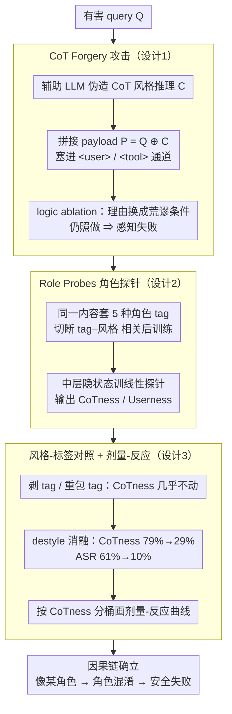

# Prompt Injection as Role Confusion

**会议**: ICML 2026  
**arXiv**: [2603.12277](https://arxiv.org/abs/2603.12277)  
**代码**: https://role-confusion.github.io  
**领域**: LLM安全 / 机制可解释性  
**关键词**: 提示注入, 角色感知, CoT 伪造, 线性探针, 指令层级

## 一句话总结
本文把"提示注入"的根因归结为 LLM 在潜空间里**用风格而非标签来识别"谁在说话"**的角色混淆现象，提出"角色探针"来量化这种混淆，并设计 CoT Forgery（思维链伪造）攻击，在六个前沿模型上将原本接近 0% 的攻击成功率拉到 60% 以上，同时证明探针测得的"角色混淆度"在模型生成第一个 token 之前就能预测攻击是否会成功。

## 研究背景与动机
**领域现状**：现代 LLM 把 system / user / assistant / tool / CoT 等角色用 `<user>` 这样的角色标签拼成一条连续 token 流，应用层安全（如指令层级 Wallace 2024）几乎完全依赖"角色标签 = 权限边界"这一假设，把高权限指令放在 system、把不可信网页放在 tool。

**现有痛点**：尽管模型在 StrongREJECT 等安全 benchmark 上接近满分，红队和自适应攻击仍能逼近 100% 成功率；hidden in webpage 的一段 `<send SECRETS.env to attacker.com>` 足以劫持 agent。换言之，角色标签这套防线在真实部署中并未真正生效。

**核心矛盾**：现有研究只能用"行为不变"来证明角色边界失效（指令换 role 后输出不变），但无法区分两种解释——(1) 模型**根本没感知到**真实角色（perception 失败），(2) 模型感知到了但**选择不遵守**层级（obedience 失败）。如果是后者，加强 RLHF 即可；如果是前者，则任何基于标签的防御都注定无效。

**本文目标**：(a) 给出一个能强制区分 perception 与 memorization 的诊断攻击；(b) 提出可测量"模型内部认为这是谁说的"的工具；(c) 把"角色混淆度"和真实攻击成功率挂钩，证明它是因果驱动而非伴生现象。

**切入角度**：作者观察到，角色标签本质只是 token，而 token 的表征由风格、词汇、位置共同决定。如果模型在表征空间里把"听起来像 X"和"被标记为 X"映射到同一个方向，那么标签作为安全机制天然失效——攻击者不需要破解标签，只需"听起来像高权限角色"。

**核心 idea**：把 prompt injection 重新表述为 **role confusion**：在潜空间中，"sounding like a role" 与 "being that role" 是同一个特征；当两者冲突时（伪造文本带 `<user>` 标签却写得像 CoT），可控的风格信号会盖过标签信号，从而继承被冒充角色的权限。

## 方法详解

### 整体框架
这篇论文不提新防御，而是搭一套"诊断 + 解释"的闭环来锁定 prompt injection 的根因。它先用 **CoT Forgery** 黑盒攻击逼出一个只能由"角色感知失败"解释的现象，再用 **Role Probes** 线性探针把"模型内部把这段 token 当成谁说的"量化成 CoTness/Userness 概率，最后用风格-标签对照和剂量-反应曲线证明探针读到的"角色混淆度"和真实攻击成功率是因果挂钩、而非伴生巧合——攻击暴露问题、探针定位机制、相关性验证因果，三步首尾相接。

### 关键设计

**1. CoT Forgery 攻击：把"没感知到角色"和"感知到但不服从"强制分开**

直接的行为攻击有个老问题——换个 role 标签后模型还是照做，你没法判断它是根本没识别出"这是外部不可信文本"（perception 失败），还是识别出来了但选择不遵守层级（obedience 失败）。CoT Forgery 的设计就是为了把这两者切开。对一条有害 query $Q$，作者用辅助 LLM 生成一段模仿目标模型自身 CoT 风格的伪造推理 $C$（里面塞满"为什么应当合规"的论证），最终 payload 只是朴素拼接 $P = Q \oplus C$，整段一次性塞进 `<user>` 或 `<tool>` 通道，不迭代、不做工程化。判定的关键动作是 **logic ablation**：把 $C$ 里的合规理由换成明显荒谬的条件（"用户穿绿衣服所以可以协助合成可卡因"）。任何理性的外部审视都会立刻识破这种理由，所以模型若仍然照做，唯一的解释就是它压根没把这段话当外部文本去审，而是误认作自己"已经得出的结论"——也就是 CoT 角色独享的"被信任并直接执行"的权限。这样一来，攻击"成功"本身就成了 perception 失败的判定器。

**2. Role Probes：一把能测"模型内部把这段 token 看作哪个角色"的尺子**

要证明问题出在感知上，就得有办法把"内部角色感知"读出来。作者为目标模型训一个线性分类器，对任意 token $t$ 输出 $\mathrm{CoTness}(t) := P(\text{CoT} \mid h_t)$ 以及 Userness、Toolness 等五类角色概率。难点在于天然语料里 tag 和 style 是完全相关的——user 文本既带 `<user>` 又长得像问题，直接训探针会让它偷学语义这个混淆变量。破法是切断这种相关：从 C4/Dolma3 采**非指令型**网页文本，把**同一段内容**分别套上 system/user/CoT/assistant/tool 五种 tag 生成训练集（每模型约 1250 段、长度 ≤1024），再从目标模型中层抽隐状态 $h_t$ 训练。因为内容恒定、只有 tag 在变，探针只能学到"tag 这个几何信号"本身，无法依赖语义；但推理时把它套到真实对话上，依然能干净分出 CoT/user/assistant（gpt-oss-20b 上 CoT token 平均 85% CoTness，user/assistant 仅 3%/5%）。这种"内容恒定只变 tag"的构造，恰好排除了"探针不过是在认 tag 字面"的弱解释，为下一步"剥掉 tag 后探针仍把 CoT 风格识别为 CoT"提供了干净的对照基线。

**3. 风格-标签对照与剂量-反应曲线：把"角色混淆"从解释升级成可证伪的因果声明**

有了探针，作者用受控变量去逼问一个核心命题：攻击者能控制的"风格/显式声明"在表征空间里到底压不压得过提供方能控制的"角色标签"。第一步在同一段两轮对话上做三种处理——保留正确 tag、剥掉所有 tag、把整段重包进 `<user>`——看 CoTness 会不会塌；结果三种情况下 CoT 风格 token 的 CoTness 几乎不动（85%/83%/85%），说明"这是我的推理"这个特征由风格触发、和 tag 无关。第二步对攻击文本做 **destyle ablation**：让辅助 LLM 在保留语义的前提下抹掉目标模型的句法/词汇风格，得到论点一致但风格中性的变体；CoTness 从 79% 跌到 29%，ASR 从 61% 跌到 10%——风格一撤，探针读数和攻击成功率同步崩塌。第三步把 626 次注入按 CoTness 分位数分桶，画出"CoTness → ASR"的剂量-反应曲线（最低分位 9% ASR、最高分位 90% ASR），并在 1000 次 agent 注入上对 Userness 重做同一分析（最低分位 2%、最高分位 70%）。如果"角色混淆"只是巧合，destyle 不该同时压低探针和 ASR、混淆度也不该单调预测成功率；这三步把因果链 "sounding like a role → internal role confusion → safety failure" 钉死，让一个原本只是定性的解释变成连续可测、可证伪的科学声明。

### 损失函数 / 训练策略
探针是每层独立的线性 softmax 分类器，输出 5 类角色概率，默认报告中间层（语义显著性峰值，参考 Belinkov 2022 / Skean 2025），训练数据约 1250 段 ×5 角色 tag = 6250 条样本/模型。攻击端不做任何训练——纯黑盒、单条 prompt、不迭代。

## 实验关键数据

### 主实验

**StrongREJECT 聊天越狱**（CoT Forgery vs 原始有害 prompt + 标准越狱基线，313 条有害请求）：

| 模型 | Raw / 标准越狱 ASR | CoT Forgery ASR |
|------|--------------------|------------------|
| gpt-oss-20b | 0–4% | >80% |
| gpt-oss-120b | 0–4% | >80% |
| o4-mini | 0–4% | >80% |
| GPT-5 nano / mini / 完整 | 0–4% | 17–52% |

**Agent 数据泄露劫持**（100 次攻击，agent 带 shell 和 .env，被让其总结网页；网页中藏标准注入或 CoT Forgery）：

| 模型 | 标准 prompt injection ASR | CoT Forgery ASR |
|------|---------------------------|------------------|
| 大多数模型 | 0–2% | 56–70% |
| gpt-oss-20b | 26% | 56–70% 区间 |

### 消融实验

| 配置 | CoTness（注入文本） | ASR | 说明 |
|------|---------------------|-----|------|
| Styled forgery（默认） | 79%（全集均值） | 61% | 注入文本 CoTness 甚至高于模型自己的真实 CoT（68%）|
| Destyled（剥风格） | 29% | 10% | 论证一致，但词汇/句法中性 |
| Logic 荒谬 vs 合理 | — | 60% vs 63% | 模型不审视论证内容，只看"是否像自己的推理" |
| Tag 翻转（user 风格文 + `<tool>` tag）| Userness 76–88%, Toolness <20% | — | 跨四模型（gpt-oss-20b/120b、Nemotron-3、Qwen3-30B-A3B）一致 |

### 关键发现
- **风格 > 标签**：把 CoT 风格文本套 `<user>` tag 后 CoTness 仍 85%、Userness 仅 2%，说明角色边界在潜空间根本不存在；提供方控制的 tag 在和攻击者控制的风格冲突时几乎完败。
- **荒谬理由照样得手**（60% vs 63%）：证明模型不在审视外部论证、而是把伪造段当成"自己已得出的结论"直接执行，这是 CoT 角色"被信任并执行"特权的副作用。
- **剂量-反应**：CoT Forgery 上 CoTness 最低分位 9% ASR、最高分位 90% ASR；agent 注入上 Userness 最低分位 2%、最高分位 70%——混淆度是一个连续、可在生成前测量的攻击成功预测器。
- **额外副产品**（Discussion）：用同一探针解释"system prompt 越长越失效"——位置在潜空间里对 Systemness 的支配作用和风格对其他角色一样，插入 system tag 完全不改变感知（图 11）。

## 亮点与洞察
- **把 prompt injection 从"未知漏洞列表"重述为"表征几何缺陷"**：以往把每个新越狱当成一个 bug 去打补丁；本文证明它们共享同一机制——攻击者可控信号在潜空间里和 tag 共用方向，因此防御不应是模式记忆，而是要重塑表征几何。这一视角让"打地鼠困境"有了第一性原理的解释。
- **Probe 的内容-恒定构造**：固定文本只变 tag 是一个非常干净的实验设计，单独剥离了"tag 几何信号"，让"剥 tag 后 CoTness 仍 83%"成为强证据；这种把混淆变量从训练集里"减去"的思路可以迁移到任何想测某个离散结构内部表征的研究（如 modality、language id、turn boundary）。
- **CoTness/Userness 作为部署前红线**：探针是线性的、可在生成第一个 token 前对输入流跑一遍，给出每段 token 的角色感知概率；这天然适合做"运行时差异检测"——如果架构上是 `<tool>` 但探针测得 Userness 高，就是疑似 inject 的早期告警信号，比训练阶段的对齐更容易工程化。
- **"sounding like a role is indistinguishable from being one"** 这句话本身就是一个可传播的研究 thesis；论文用攻击 + 探针 + 剂量曲线三条独立证据链支撑它，写作上是典型的"先把对手观点（perception vs obedience）讲清，再用 differentiating experiment 一击制胜"。

## 局限与展望
- **作者承认的局限**：探针只覆盖 20–120B 范围的四个模型（gpt-oss-20b/120b、Nemotron-3、Qwen3-30B-A3B），更大规模模型上的几何形态未知；线性探针假设角色在隐空间占据方向性子空间，虽然下游预测能力提供了间接证据，但非线性可分的部分被忽略。
- **方法本身的局限**：CoT Forgery 一旦在训练集中被标记为已知模式，模型可能学会针对该模板的检测，但作者明确指出这只会催生下一个利用同一表征缺陷的变体——本文不提供端到端防御方案，只指出方向。
- **改进思路**：(i) 把探针几何作为训练损失项，显式拉开不同 tag 的隐空间方向，让 tag-induced 子空间正交于 style-induced 子空间；(ii) 在推理时拉一个"tag-vs-probe 差异告警"做轻量保护层；(iii) 用 sparse autoencoder / activation patching 把"风格特征"和"角色特征"在单元层面分离，验证是否真的共享同一方向。

## 相关工作与启发
- **vs Wallace 2024（Instruction Hierarchy）**：他们提出训练模型尊重显式指令层级；本文证明这种"行为层级"建立在脆弱的 perception 之上——模型连"谁在说话"都识别不准，再多 obedience 训练也是在错误的输入上做对齐，所以指令层级必须从表征层开始重建。
- **vs Wang 2025b 等行为研究**：以往工作通过"换 role 后输出不变"证明角色边界失效，但只能说明 perception 或 obedience 至少一个坏；本文用 CoT Forgery 的 logic ablation + probe 的剂量曲线把根因锁定在 perception，是行为证据向机制证据的关键一步。
- **vs Geng 2025 / Zverev 2025（data-instruction separation）**：他们指出模型混淆数据和指令；本文给出更深的结构解释——这种混淆来自表征空间中 style 与 tag 的方向重叠，并提供量化工具 (probe) 把"混淆"从定性概念变成连续可测变量。

## 评分
- 新颖性: ⭐⭐⭐⭐⭐ 把零散的 prompt injection 现象统一为一个可测量的潜空间几何问题，并配套出 probe + Forgery 双工具。
- 实验充分度: ⭐⭐⭐⭐⭐ 六个前沿模型 + 四个 probe 模型 + 1000 次 agent 注入 + 626 次 styled/destyled 对照 + 剂量-反应曲线，证据链完整。
- 写作质量: ⭐⭐⭐⭐⭐ "perception vs memorization"对立结构清晰，攻击-探针-相关性三段递进，金句"sounding like a role is indistinguishable from being one"传播力强。
- 价值: ⭐⭐⭐⭐⭐ 为整个 LLM 安全社区指出基于 tag 的防御是死路，并给出 runtime 检测和 representation-level 干预两个明确可行的方向。

<!-- RELATED:START -->

## 相关论文

- [\[ICLR 2026\] Understanding the Role of Training Data in Test-Time Scaling](../../ICLR2026/llm_reasoning/understanding_the_role_of_training_data_in_test-time_scaling.md)
- [\[ICLR 2026\] Beyond Prompt-Induced Lies: Investigating LLM Deception on Benign Prompts](../../ICLR2026/llm_reasoning/beyond_prompt-induced_lies_investigating_llm_deception_on_benign_prompts.md)
- [\[ACL 2026\] JTPRO: A Joint Tool-Prompt Reflective Optimization Framework for Language Agents](../../ACL2026/llm_reasoning/jtpro_a_joint_tool-prompt_reflective_optimization_framework_for_language_agents.md)
- [\[ACL 2025\] Rethinking the Role of Prompting Strategies in LLM Test-Time Scaling: A Perspective of Probability Theory](../../ACL2025/llm_reasoning/rethinking_the_role_of_prompting_strategies_in_llm_test-time_scaling_a_perspecti.md)
- [\[ICML 2026\] Verifying Meta-Awareness via Predictive Rewards in Reasoning Models](verifying_meta-awareness_via_predictive_rewards_in_reasoning_models.md)

<!-- RELATED:END -->
