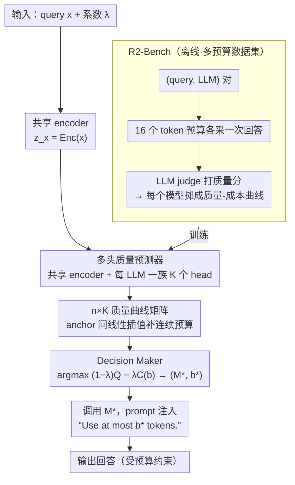

# R2-Router: A New Paradigm for LLM Routing with Reasoning

**会议**: ICML 2026  
**arXiv**: [2602.02823](https://arxiv.org/abs/2602.02823)  
**代码**: https://github.com/UCF-ML-Research/R2-Router (有)  
**领域**: LLM推理 / LLM路由 / 推理时计算  
**关键词**: LLM 路由, 输出长度预算, 质量-成本曲线, 推理式路由, 长度约束提示

## 一句话总结
本文提出 R2-Router，把"输出 token 预算"从被动估计量改造成可控变量，让路由器在 (LLM, 预算) 联合空间里搜索，用一个轻量的多头质量预测器把每个 LLM 从一个静态点扩展成一条质量-成本曲线，从而以 4–5× 更低的成本达到与现有路由器相当的质量。

## 研究背景与动机
**领域现状**：LLM 数量爆炸式增长后，"该用哪个模型回答这条 query"成为系统级问题。主流做法是 LLM Routing：用一个小模型预测每个候选 LLM 在给定 query 上的质量 $Q$ 和成本 $C$，按 $S=(1-\lambda)Q-\lambda C$ 排序后挑分最高的。代表工作如 FrugalGPT / AutoMix（级联式）、CARROT、MIRT、UniRouter（预测式）等。

**现有痛点**：所有现有路由器都把每个 LLM 当成一个静态的"质量-成本点"。一旦某个强模型（如 Qwen3-235B）预估成本超出预算，路由器会直接把它排除掉，从而错失"用更短输出依然能给出高质量"的机会。问题的本质是：**同一个 LLM 的质量随输出长度变化**，但这条曲线在现有路由框架里根本不存在。

**核心矛盾**：路由器的搜索空间被锁死在 $\mathcal{S}_{reactive}=\{(M_i,\hat{c}_i)\}$ 上，而真正的最优解很可能落在 $\mathcal{S}_{reasoning}=\{(M_i,b_j)\mid M_i\in\mathcal{M},b_j\in\mathcal{B}\}$ 这个更大的笛卡尔积里。前者是后者的真子集，但被动式路由根本没有探索后者的能力。

**本文目标**：(i) 重新定义路由问题，把输出长度预算 $b$ 当作和 LLM 选择同等地位的决策变量；(ii) 给出一个轻量、数据高效的预测器实现；(iii) 构造一个能"看见"质量-成本曲线的数据集，让这套机制可训可评。

**切入角度**：作者借鉴近期 efficient reasoning 的经验性发现——LLM 的回答质量随输出长度增长但很快饱和，而且可以通过 "use at most $k$ tokens" 这种长度约束提示稳定地控制输出长度（在附录 A 中实证）。这意味着 $b$ 是个真正可控的旋钮。

**核心 idea**：把路由从"在点上路由"升级为"在曲线上路由"——预测每个 LLM 在多个预算下的质量曲线，然后在 (LLM, 预算) 联合空间里挑最大化 $S$ 的组合，并通过提示词把预算约束传给被选中的 LLM。

## 方法详解

### 整体框架
R2-Router 想解决的是"被动式路由按静态成本估计一票否决强模型"这个老毛病，办法是把输出长度预算 $b$ 升格成和选哪个 LLM 同等地位的决策变量。它分离线、在线两段：离线先构造 R2-Bench——对每个 (query, LLM) 对在 16 个不同 token 预算下各采一次回答、用 LLM judge 打质量分，从而把每个模型从一个点摊成一条质量-成本曲线，这批多预算数据用来训练预测器；在线时输入 query $x$ 和 trade-off 系数 $\lambda$，共享 encoder 先编码出 $z_x=\text{Enc}(x)$，每个 LLM 的一族多头 MLP 一次性预测所有 (LLM, 预算) 组合的质量、拼成 $n\times K$ 曲线矩阵，Decision Maker 按重表述后的目标 $(M^*,b^*)=\arg\max\bigl((1-\lambda)Q-\lambda C(b)\bigr)$ 在矩阵上挑出最优组合，最后调用 $M^*$ 并把 "Use at most $b^*$ tokens." 注入 prompt 强制约束输出长度。

### 关键设计

**1. 把输出长度变成决策变量的问题重表述：让强模型"在合适预算下也能用"**

现有路由器把每个 LLM 钉成一个静态质量-成本点，一旦预估成本超预算就直接排除——可同一个模型的质量本来就随输出长度变化，这条曲线在旧框架里根本不存在。R2-Router 干脆把目标从传统的 $\arg\max_{M_i}\,(1-\lambda)\hat{Q}_i-\lambda\hat{C}_i$ 改写成 $(M^*,b^*)=\arg\max_{M\in\mathcal{M},\,b\in\mathcal{B}}\bigl((1-\lambda)Q(x,M,b)-\lambda C(b)\bigr)$，其中 $C(b)$ 是单价乘以预算 $b$ 的解析函数。关键在于成本不再是"预测出来的标量"而是"被强制施加的可控量"：执行端用 Lee et al. 2025 的长度约束提示（"use at most $k$ tokens"）把 $b$ 真正落地，于是预测的 $\hat{Q}(x,M,b)$ 和实际成本 $C(b)$ 都是确定性可控的。论文进一步给出 Theorem 4.3——因为 reactive 的搜索空间 $\mathcal{S}_{reactive}$ 只是 reasoning 空间 $\mathcal{S}_{reasoning}$ 的真子集，reasoning-based 路由的最大效用恒不劣于 reactive 路由。这是全篇的杠杆点：$b$ 从被动估计变成可控旋钮后，强模型不再被"预估太贵"一票否决，而这条改写对上层用 KNN/MLP/GNN 的各种路由器都正交可叠加。

**2. 多头质量预测器 + 稀疏 anchor + 线性插值：用很少的训练点逼近整条曲线**

要在 (LLM, 预算) 联合空间搜索，就得先把整条质量曲线预测出来；但若朴素地为每个连续预算都训一个 head，需要的数据量会爆炸。R2-Router 的做法是共享 encoder 抓 query 通用语义、每个 LLM $M_i$ 配 $K$ 个独立 head 抓"该模型在某个预算下"的特异行为：第 $k$ 个 head $g_{i,k}$ 是三层 MLP（隐层 [256,128,64] + ReLU + Sigmoid），输出 $\hat{Q}(x,M_i,b_k)=\sigma(g_{i,k}(z_x))$，每个 head 只在自己那个 anchor 预算上用 MSE 损失 $\mathcal{L}_{i,k}=\mathrm{MSE}(\hat{Q}(x,M_i,b_k),Q^{\text{true}}(x,M_i,b_k))$ 独立优化。anchor 之间的任意预算用分段线性插值补上：$\hat{Q}(x,M,b')=(1-\alpha)\hat{Q}(x,M,b_k)+\alpha\hat{Q}(x,M,b_{k+1})$，$\alpha=(b'-b_k)/(b_{k+1}-b_k)$。这种"稀疏 anchor + 插值"在数据效率和搜索粒度之间取了个甜点：经验上 $K=6{\sim}8$ 个 anchor 就够逼近连续曲线，$K=4$ 都已碾压点式 baseline；15 个 LLM 全套训练在单张 RTX 3090 上 30 分钟搞定，单次路由开销 <400 ms、占总生成时间不到 1%，加新模型也只需补这一族 head。

**3. R2-Bench：把"曲线"做成可观测量的多预算数据集**

机制再好，也得有能"看见曲线"的数据才能训和评——现有 RouterBench / SPROUT / RouterEval 每个 (query, LLM) 只采一条回答，物理上学不到曲线。R2-Bench 系统化地变化输出预算来补这个缺口：在 6 个公开 benchmark（GPQA / MuSR / MMLU-Pro / MATH / OpenHermes / RAGBench）上整合 30,968 条 query × 15 个 LLM × 16 个预算，每个 (query, LLM, 预算) 三元组都记录质量分和实际消耗 token 数。质量分由 LLM-as-a-judge 给出，走 Zheng et al. 2023 的协议——500 条样本 × 30 位标注者 × 4 个候选 judge，按 Pearson 相关系数挑出 Qwen3-80B-Instruct（$\rho=0.82$）当最终 judge。R2-Bench 和 R2-Router 是互补关系：前者把更大的 (LLM, 预算) 优化空间暴露出来（Oracle AUDC 从 0.85 提升到 0.98、QNC 从 0.18 降到 0.04），后者提供搜索该空间的机制，缺一个增益都拿不到。

### 损失函数 / 训练策略
对每个 (LLM $i$, 预算 anchor $k$) 独立做 MSE 回归：$\theta_{i,k}^*=\arg\min_{\theta_{i,k}}\mathcal{L}_{i,k}$。Adam 优化器，学习率 $1\times 10^{-4}$，训 100 epoch；query encoder 用 Qwen3-Embedding-0.6B 把 query 编码成 1024 维向量。所有 head 共享 encoder 输出但参数独立，便于"加一个新 LLM 只补这一族 head"的增量更新。

## 实验关键数据

### 主实验

| 数据集 / 设定 | 指标 | R2-Router | 之前 SOTA | 提升 |
|--------|------|------|----------|------|
| R2-Bench (Main) | 达到 quality≈0.8 所需 cost | $0.5\times 10^{-3}$ | $2{\sim}2.5\times 10^{-3}$ (MIRT / CARROT) | 4–5× 更便宜 |
| MMLU-Pro OOD (非 STEM 测试) | AUDC ↑ | 0.71 | 0.67 (CARROT-L) | +0.04 |
| MMLU-Pro OOD | QNC ↓ | 0.26 | 0.56 (CARROT-L) | −54% |
| Uni-R2Router vs UniRouter (5 个新 LLM 加入) | AUDC ↑ | 0.623 | 0.590 | +5.6% |
| Uni-R2Router vs UniRouter | QNC ↓ | — | — | −80% |
| RouterArena 公开榜单 | 排名 | 第 1（论文接收时） | — | — |

### 消融实验

| 配置 | AUDC ↑ | QNC ↓ | Peak Acc ↑ | 说明 |
|------|--------|-------|------------|------|
| 默认（Qwen3-Embed + MLP head + Qwen3 judge）| ≈0.80 | ≈0.12 | ≈0.83 | 完整模型 |
| 换 MiniLM-L6-v2 embedding | 0.76 | 0.32 | 0.79 | 小 encoder 仍显著优于点式 baseline |
| 换 LGBM 作为预测 head | 0.80 | 0.29 | 0.81 | 与架构无关，增益来自曲线搜索 |
| 换 DeepSeek-V3.1 作 judge | 0.80 | 0.35 | 0.90 | judge 换了也稳定领先 |
| anchor 头数 $K=4$ | — | ≈0.20 | — | 仍优于 MIRT(0.43) / CARROT-L(0.32) |
| anchor 头数 $K=6{\sim}8$ | — | ≈0.12 | — | 接近最优 |
| 给 reactive baseline 加 "Be concise" 提示 | < R2-Router | — | — | 提示词改输出但改不了选择逻辑，强模型仍被错杀 |

### 关键发现
- **杠杆点在路由器侧而非 LLM 侧**：直接给 baseline 加 "Be concise" 不解决问题——reactive 路由器仍然按静态成本估计排除强模型，"曲线视角"必须在路由决策层引入才能拿到增益。
- **稀疏 anchor 就够用**：$K=6{\sim}8$ 个预算 anchor 配合线性插值已逼近连续曲线最优，$K=4$ 都已大幅领先所有点式 baseline，证明质量-成本曲线在 query embedding 空间里相当光滑。
- **正交可叠加**：和 UniRouter 集成的 Uni-R2Router 在 5 个未见 LLM 加入后 AUDC 涨 5%、QNC 降 80%，说明"曲线化"是一种通用增强，可以套在 KNN/IRT/UniRouter 等不同上层框架上。
- **数据集 Oracle 上界本身就涨了 15%**：R2-Bench 让 Oracle AUDC 从 0.85 推到 0.98，说明现有 benchmark 在测的是一个被人为压缩过的问题——曲线视角揭示的路由潜力比之前以为的大得多。

## 亮点与洞察
- **把"被动估计"变成"主动控制"的问题重表述**：现有路由器都在被动估计 $\hat{C}_i$，R2-Router 看穿"反正预算只是写在 prompt 里的一句话"，干脆把它升格成决策变量。这种"既然你能控制就别去预测"的思路可以迁移到许多 system + ML 的场景（缓存、调度、推测解码等）。
- **Theorem 4.3 提供了干净的理论保证**：$\mathcal{S}_{reactive}\subseteq\mathcal{S}_{reasoning}$ 让"R2-Router 不会更差"成为代数事实而非经验观察，这在路由这类工程性极强的领域里相当稀缺。
- **"Routing as Reasoning"的命名很有传播力**：作者把它类比为 Gemini 等模型"动态决定 thinking depth"，但这里的 "reasoning" 是路由器在 (LLM, 预算) 空间里的 deliberation 而非 LLM 内部 CoT——这条命名既蹭到了 reasoning 红利，又划清了边界。
- **可复用 trick：多头共享 encoder + 独立小 head**：用一个共享 encoder + 一族很小的 MLP head 来分别建模"同一对象在不同条件下的行为"是个通用 pattern，可以套在 multi-budget、multi-temperature、multi-objective 等几乎所有"输入相同、配置不同"的预测任务上。

## 局限与展望
- **依赖长度约束提示能被 LLM 听话执行**：方法的全部理论保证都建立在 "use at most $k$ tokens" 能稳定生效之上；对小模型 / 弱指令遵循模型，这个假设会松动，论文虽在附录 A 做了实证但没系统量化失败模式。
- **质量监督来自 LLM judge**：30,968 query × 15 model × 16 budget ≈ 7.4M 条样本全靠 Qwen3-80B-Instruct 打分，存在 judge 偏置（虽然 Table 4 换 DeepSeek-V3.1 验证过鲁棒性，但两个都是大模型自打分）；judge 失败的子领域可能整段被错误标注。
- **预算粒度仍是离散 anchor + 线性插值**：当成本-质量曲线在某些 LLM 上呈现明显非线性"阶跃"时（例如某些 reasoning model 必须 >$N$ token 才能想清楚），线性插值会高估中间预算的质量；可改进方向是用单调神经网络或样条预测器。
- **没考虑延迟（latency）和并发**：cost 只算 token 费用，但工业部署中 latency 和 throughput 经常是更硬的约束；把 latency 也纳入 $C(\cdot)$ 是显然的延伸。

## 相关工作与启发
- **vs CARROT / MIRT / NIRT**: 它们分别预测 $\hat{Q}_i$ 和 $\hat{T}_i$ 或固定 $C_i$，仍是点式路由；R2-Router 把成本从"预测出来的标量"变成"被强制施加的可控变量"，理论上严格包含它们的搜索空间。
- **vs UniRouter**: UniRouter 解决"动态 LLM 池"问题，把每个 LLM 表示成验证集误差向量；R2-Router 跟它正交——Uni-R2Router 把误差向量从一个 cost 扩展到多个 cost 形成曲线表示，同时拿到曲线增益和池子动态适应能力。
- **vs Route-To-Reason / BEST-Route**: Route-To-Reason 路由到 (LLM, reasoning strategy) 对但不显式控成本；BEST-Route 选 LLM 和采样数提升质量但增加调用次数；R2-Router 的成本控制是"在 prompt 里写一句"，单调降本而非加调用。
- **vs Semantic Router / Think When Needed**: 它们在单个 LLM 内部选推理模式；R2-Router 在多 LLM 之间选 (模型, 预算)，粒度和搜索空间都更大。
- **vs FrugalGPT / AutoMix**: 级联式按 cost 顺序串行调用直到合格，延迟和调用次数都高；R2-Router 是一次性预测式决策，单次路由 <400ms。

## 评分
- 新颖性: ⭐⭐⭐⭐⭐ 把输出长度从被动估计量重定义为可控决策变量，是 LLM routing 范式级别的转变，并配套提供了能"看见曲线"的数据集。
- 实验充分度: ⭐⭐⭐⭐⭐ 15 LLM × 16 预算 × 30k query，主实验 + OOD + 动态池 + 4 个消融 + RouterArena 公开榜第 1，覆盖面与可信度都很高。
- 写作质量: ⭐⭐⭐⭐⭐ "Route on Points vs Route on Curves" 的对比图示和 Theorem 4.3 的代数证明都很清楚，narrative 容易跟。
- 价值: ⭐⭐⭐⭐⭐ 4–5× 成本降低 + 30 分钟训练 + 与现有路由器正交可叠加，是真正能落地的工程性贡献，对 OpenRouter / NotDiamond 这类商业路由平台直接可用。

<!-- RELATED:START -->

## 相关论文

- [\[AAAI 2026\] A Reasoning Paradigm for Named Entity Recognition](../../AAAI2026/llm_reasoning/a_reasoning_paradigm_for_named_entity_recognition.md)
- [\[AAAI 2026\] Intention Chain-of-Thought Prompting with Dynamic Routing for Code Generation](../../AAAI2026/llm_reasoning/intention_chain-of-thought_prompting_with_dynamic_routing_for_code_generation.md)
- [\[ICML 2026\] Beyond Two-Stage Training: Cooperative SFT and RL for LLM Reasoning](beyond_two-stage_training_cooperative_sft_and_rl_for_llm_reasoning.md)
- [\[ICML 2026\] TRACE: 用 Toulmin 论证模型评 LLM CoT 推理过程质量](trace_toulmin-based_reasoning_assessment_through_constructive_elements_for_llm_c.md)
- [\[ICML 2026\] Beyond Test-Time Memory: State-Space Optimal Control for LLM Reasoning](beyond_test-time_memory_state-space_optimal_control_for_llm_reasoning.md)

<!-- RELATED:END -->
