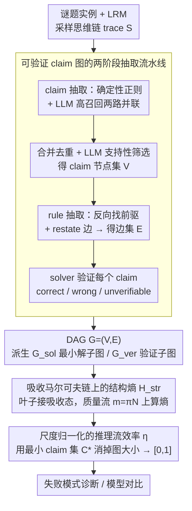

# Reasoning Structure of Large Language Models

**会议**: ICML2026  
**arXiv**: [2606.03883](https://arxiv.org/abs/2606.03883)  
**代码**: https://github.com/ETH-DISCO/llm-reasoning-efficiency  
**领域**: LLM推理  
**关键词**: 推理图、结构熵、效率指标、逻辑谜题、过程评估

## 一句话总结
本文把大型推理模型（LRM）的自由文本思维链转成"原子声明 + 演绎依赖"的可验证 DAG，并基于吸收马尔可夫链的结构熵定义一个推理流效率指标 $\eta$，证明在准确率和 token 数都饱和或重叠的区间，$\eta$ 仍能分辨"专注推理"与"发散探索"两种行为，从而成为诊断 LRM 失败模式的细粒度工具。

## 研究背景与动机

**领域现状**：当前评估 LRM 几乎只盯两个一维数字 —— 最终答案的 accuracy 和生成的 token 数；少数工作（Tree-of-Thoughts、Graph-of-Thoughts、RLVR）改进的是推理的"激发方式"，而非推理过程本身的度量。

**现有痛点**：同样的 accuracy 和 token 数背后可能是完全不同的推理结构：一条 trace 可能是几乎直线的演绎，另一条可能是大量回溯、重复验证甚至沿错误假设漂移很久才纠正回来。这两种行为对 RL 训练、failure mode 诊断和模型挑选有完全不同的意义，但现有指标把它们抹平了。

**核心矛盾**：要做"过程级"评估，就必须有可以机器验证的中间状态；但自由文本 CoT 既不是结构化的，也很难和环境对齐。已有的 reasoning-graph 工作（Xiong et al. 2025；Minegishi et al. 2025）要么图节点缺乏外部验证、要么纯靠 hidden state 推断，无法判定单个 claim 的对错。

**本文目标**：(1) 提供一个可控难度、可执行验证的推理 benchmark；(2) 把自由文本 trace 自动重构成可机器验证的 DAG；(3) 给出一个不依赖图大小、能与 accuracy 解耦的"结构性"效率指标。

**切入角度**：作者选择 Simon Tatham 的 21 种 2D 网格谜题作为载体 —— 规则完全形式化、可执行验证、难度可平滑缩放；同时把推理过程建模为吸收马尔可夫链上的"逻辑质量流"，借鉴结构信息论用熵度量"专注 vs 发散"。

**核心 idea**：用"原子 claim 节点 + 演绎边"的 DAG 表示推理；把图归一化后投到吸收马尔可夫链上算结构熵 $H_{\text{str}}$；再用最小 claim 集 $C^*$ 做尺度归一化，得到一个落在 $[0,1]$ 的效率分数 $\eta$，使其与图规模、token 数解耦，只反映"逻辑流相对于最小解骨架的集中程度"。

## 方法详解

### 整体框架
这篇论文要把 LRM 那条没有结构的自由文本思维链，变成一个能被机器逐句验证的推理图，再从图上读出一个"逻辑流是否聚焦"的标量。输入是模型在某谜题实例上生成的 trace $S=(s_1,s_2,\dots)$，流水线四步走：先在可执行谜题环境里跑模型采集 trace；再用"确定性抽取 + LLM 抽取"的混合 pipeline 把 trace 切成原子 claim 节点 $V$；接着让 LLM 对每个 claim 反向找出它依赖的前驱、生成边集 $E$，并把重述的 claim 用 restate 边连回首次出现；最后用谜题求解器给每个 verifiable claim 打 correct/wrong/unverifiable 标签。最终得到 DAG $G=(V,E)$，再衍生出"最小解子图" $G_{\text{sol}}$（所有支撑解的节点及祖先）和"验证子图" $G_{\text{ver}}$（解节点的后代及其再上溯的祖先），所有结构指标和效率 $\eta$ 都在这三个图上计算。

### 关键设计

**1. 可验证 claim 图的两阶段抽取流水线：让评估器和被评估模型解耦**

要做过程级评估，第一道坎是自由文本 CoT 既不结构化、又无法对齐环境，单一抽取器还会把自己的 bias 写进图里。作者让 claim 抽取走"两路并联"：一路是高精度的确定性正则模板（针对每种谜题的 claim schema），再让 LLM 做 schema 修复和补全；另一路是无规则约束的高召回 LLM 抽取。两路结果在 token-balanced chunk 内合并去重，再让 LLM 在 200 个 claim 的 batch 上做支持性校验丢掉幻觉。rule 抽取则按 trace 顺序处理每个非临时 claim，给 LLM 一个截到该 claim 最后支持句的 prefix，让它要么返回一条"前驱 claim → 当前 claim"的规则应用、要么标为"直接陈述"；如果推导需要的前提没出现在 trace 里，就插入一个占位 claim 显式标记缺口。最后所有 verifiable claim 都被丢回可执行谜题环境做确定性校验，给出 correct/wrong/unverifiable 标签。关键在分角色——用 GPT-5.2 抽 claim、GPT-5-mini 抽 rule，评估模型和被评估模型互不相同；六抽取器消融显示 $\eta$ 在不同抽取器间只波动 1.9%，200 条 rule 的人工抽检在严格判定下 75.5% 完全正确，说明结构指标对 pipeline 选择是鲁棒的。

**2. 吸收马尔可夫链上的结构熵：把"图长什么样"翻译成"逻辑流是否集中"**

有了图还不够——传统图统计（深度、直径、宽度）都和图规模强耦合，难题的图天生又大又宽，会被误读成"推理质量差"。作者改用一个对图规模不敏感的量：把每个 claim 节点视为瞬态状态，给所有出度为 0 的叶子加一条边连到唯一吸收态 $a$，得到增广图 $G_{\text{abs}}$；它的行归一化邻接矩阵分块成 $P=\begin{pmatrix}Q & R\\ 0 & 1\end{pmatrix}$，其中 $Q$ 是瞬态到瞬态、$R$ 是瞬态到吸收。初始"逻辑质量" $\pi$ 在所有入度为 0 的源节点上均匀分布，按 $\pi Q^t$ 演化，累积质量为 $m=\pi N$，其中 $N=\sum_t Q^t$ 是基本矩阵。结构熵就定义在这股质量流的分布上：

$$H_{\text{str}}(G)=-\sum_v \frac{m(v)}{\|m\|}\log\frac{m(v)}{\|m\|}$$

直线型推理会把质量压在少数节点上，熵低；发散型推理把质量摊到大量旁支和重述上，熵高，同时也自动惩罚了未被使用的 claim 和无效重述。换句话说，度量对象从"图的形状"变成了"路径上的概率分布是否聚焦"，这才是真正想捕捉的"专注 vs 发散"。

**3. 尺度归一化的推理流效率 $\eta$：消掉图大小，让不同难度、不同模型直接可比**

结构熵本身仍带着 $\log|V|$ 量级的尺度，没法横向比较。作者用最小解骨架做归一化，把指标压进 $[0,1]$：

$$\eta=\frac{\log|V|-H_{\text{str}}(G)}{\log|V|-\log|C^*|}$$

分子是"实际熵相对最大可能熵 $\log|V|$ 的减少量"，分母是"理想最小解骨架能带来的最大可能减少量"，其中 $|C^*|$ 是完整还原解所需的最少 claim 数。$\eta\approx 1$ 表示逻辑流几乎完全压在最小解骨架上，$\eta$ 小则意味着大量质量摊到了 verification 和发散探索上。这个归一化让一个 4×4 Tents 的 $\eta$ 能直接和 7×7 Sudoku 比。它的价值在 Table 2 里被验证：宽度、$|V|$、token 都和 accuracy 强负相关、彼此也强相关，本质上只是在追踪"题目变难"；只有 $\eta$ 同时满足"和 accuracy 正相关"与"和 token 数解耦"（$r=-0.05,p=0.64$），证明它捕获的是"题目难度之外"的结构信号。

### 训练策略
本文不训练模型，只评估。所有 LRM 用同一个 solver prompt、温度 $T=1$ 采样，21 种谜题各 4 个难度、每档 5 个固定实例。claim 抽取用 GPT-5.2，rule 抽取用 GPT-5-mini。图抽取只在开源模型（DeepSeek V3.2、Qwen3 235B、Kimi K2）上做，闭源 GPT-5 因为拿不到完整 trace 只参与 accuracy/token 对比。

## 实验关键数据

### 主实验
21 谜题 × 4 难度，accuracy 和平均完成 token 数：

| 模型 | Trivial Acc/Tok | Human easy | Human normal | Human hard | 平均 Acc / Tok |
|------|-----------------|------------|--------------|------------|-----------------|
| GPT-5 | 83.8 / 4.2k | 69.5 / 10.2k | 58.1 / 17.3k | 5.7 / 19.9k | 54.3 / 12.9k |
| Qwen3 235B | 69.5 / 10.3k | 44.8 / 19.0k | 21.0 / 23.1k | 0.0 / 23.6k | 33.8 / 19.0k |
| DeepSeek V3.2 | 77.1 / 7.7k | 53.3 / 20.6k | 44.8 / 27.0k | 0.0 / 36.8k | 43.8 / 23.0k |
| Kimi K2 | 77.1 / 10.6k | 56.2 / 29.7k | 41.0 / 43.8k | 1.0 / 61.3k | 43.8 / 36.3k |

GPT-5 在每个难度都最准，同时是 token 最省的；Kimi K2 砸了最多 token 反而没超过 GPT-5；所有模型在 Human hard 上几乎全军覆没（最高 5.7%），说明加 token 并不能解决最难一档 —— 这是当前 LRM 的结构性瓶颈。

### 消融 / 结构指标对比
$\eta$ 与传统图统计的 Pearson 相关性（同一批图上算）：

| 指标 | vs. Claim Accuracy | vs. $\eta$ |
|------|-------------------|------------|
| Depth | −0.263 | +0.046 |
| Diameter | −0.329 | +0.010 |
| Avg. path length | −0.182 | +0.051 |
| Width | −0.618 | −0.431 |
| $|V|$ | −0.666 | −0.419 |
| Tokens | −0.576 | −0.120 |
| $\eta$ | **+0.368** | — |

宽度、$|V|$、token 都和 accuracy 强负相关，但它们的相关性主要被"题目难度"主导；只有 $\eta$ 既和 accuracy 正相关、又和 token 解耦（$r=-0.05,p=0.64$），证明它捕获到的是"题目难度之外"的结构信号。

### 关键发现
- **额外 token 主要流向 verification overhead**：token 数和 $|V_{\text{ver}}|/|V_{\text{sol}}|$ 的相关性高达 $r=0.53\ (p=3\times10^{-9})$，说明模型加 token 不是在扩展解的核心链，而是反复检查 —— 这直接反驳了"长 CoT = 更好推理"的朴素假设。
- **早错 → 低效**：首个错误 claim 出现越深，$\eta$ 越高（$r=0.28,p=0.015$）；早犯错会触发漫长的纠错探索，把逻辑流摊薄。
- **适度重述反而有益**：每个 unique claim 的平均重述次数和 $\eta$ 正相关（$r=0.27,p=0.0078$），说明对关键约束的"复述锚定"是结构化推理的一部分，不是浪费。
- **饱和区分辨力**：Figure 6 显示在所有模型都 100% 解出的小尺寸谜题上，$\eta$ 仍能拉开模型差距，证明它在 accuracy 饱和、token 重叠的区间依旧有判别力 —— 这正是 accuracy / token 看不到的地方。
- **泛化到失败 trace**：在 Tents 失败 trace 上 $\eta$ 下降超过一半，图也更大更散，首错出现得更早 —— 说明 $\eta$ 不只是分"对/错"，而是真在度量推理质量。

## 亮点与洞察
- **把"推理过程"变成可量化对象的范式**：用可执行谜题环境提供 ground-truth 验证 + 用 LLM 做语法/语义抽取，绕开了 PRM（process reward model）必须人工标注的瓶颈；结构层（图构造、马尔可夫链、$\eta$）是 puzzle-agnostic 的，只要能验证中间状态就能搬到数学（符号验证）、代码（单元测试）、agentic tool-use（环境反馈）上。
- **结构熵的尺度归一化漂亮**：分母用 $\log|V|-\log|C^*|$ 把"图大小"和"解最小复杂度"都消掉，让一个 4×4 Tents 的 $\eta$ 能直接和 7×7 Sudoku 比，避免了"难题自然图大 → 看起来不效率"的混淆。
- **可迁移的 trick**：把任何 DAG 加一个吸收态、用基本矩阵 $N=(I-Q)^{-1}$ 算质量流的做法，可以直接套到 RL 中"动作 DAG 的探索集中度"、agent 框架里"工具调用图的发散度"等场景；同样的 entropy-on-stationary-flow 公式直接复用。
- **训练信号潜力**：作者在 conclusion 里提到，如果抽取能做到足够快，$\eta$ 可以作为 RLVR 的辅助 shaping reward —— 鼓励在保住答案正确性的同时压低结构熵，可能是 reducing overthinking 的新切入口。

## 局限与展望
- **抽取 pipeline 引入 LLM 噪声**：claim/rule 抽取本身就用 LLM，理论上存在 self-bias。作者用"GPT-5.2 抽 claim、GPT-5-mini 抽 rule + 六抽取器消融（$\eta$ 波动 1.9%）+ 200 条人工抽检 75.5% 严格正确"来论证鲁棒性，但严格意义上不是确定性的；面对推理痕迹很弱的 trace 会失败。
- **每种谜题需定制 claim/rule 类型**：虽然结构层 puzzle-agnostic，但要新接一个 domain 仍需写 claim schema 和 rule template；这点 PRM 也有同样问题，但作者没给出快速冷启动的工具链。
- **样本量偏小**：21 谜题 × 4 难度 × 5 实例 = 420 个实例，且只抽 3 个开源 reasoning 模型的图（GPT-5 因闭源不参与结构分析），统计强度还需扩展。
- **gameability 风险**：作者承认如果 $\eta$ 被当作单一 leaderboard 分数，模型可能学会"删 verification、强行直奔答案"的捷径来刷分；建议永远和 accuracy/calibration 一起报。
- **可改进方向**：把结构层延伸到数学（用 SymPy/Lean 做 step verifier）和代码（用单元测试做 partial verifier），以及用 $\eta$ 做 RLVR shaping reward 都是天然的下一步。

## 相关工作与启发
- **vs ZebraLogic / SATBench（Lin et al. 2025；Wei et al. 2025）**：它们也用可控难度的逻辑谜题，但只验证最终答案；本文在此基础上加了 claim 级 verifier 和结构层指标，把"benchmark"升级成"reasoning microscope"。
- **vs Shojaee et al. 2025（Apple Illusion of Thinking）**：那篇也观察到 LRM 在高难度处崩溃且 "reasoning effort" 反直觉下降；本文用 $\eta$ 给"reasoning effort"一个有理论根基的、puzzle-agnostic 的定义，并把现象拓展到更多谜题家族。
- **vs 推理图类工作（Xiong et al. 2025；Minegishi et al. 2025；Zhang et al. 2026；Zeng et al. 2025）**：那些工作要么用 hidden state、要么用 task-specific DAG，且 claim 节点缺乏外部验证。本文的独有优势是图节点能被可执行环境硬验证，结构指标的因果含义更可靠。
- **vs 过度思考 / 思考不足类研究（Chen et al. 2025b；Wang et al. 2025；Dang et al. 2025；Fan et al. 2025）**：那些工作主要诊断行为现象、给定性结论；本文把这些现象量化成同一个 $\eta$ 指标，并发现"额外 token 几乎全用于 verification"这一可操作的设计指引。

## 评分
- 新颖性: ⭐⭐⭐⭐ 把吸收马尔可夫链结构熵 + 尺度归一化结合做 reasoning 评估，是个干净且少见的视角；不过 reasoning-graph 思路本身已有先例，主要创新在"可验证 + 解耦于 token"。
- 实验充分度: ⭐⭐⭐ 4 个 frontier 模型 × 21 谜题 × 4 难度覆盖较广，pipeline 稳定性消融做得仔细；但样本量偏小、且 $\eta$ 只在开源模型的图上算，没在数学/代码上延伸验证。
- 写作质量: ⭐⭐⭐⭐ 公式定义清晰，Figure 1 / Figure 5 / Table 2 都精准地服务于结论；表 2 用一张表干掉所有 baseline 指标的做法尤其漂亮。
- 价值: ⭐⭐⭐⭐ 一个 puzzle-agnostic 的结构指标 + 现成代码，对 RL 训练、failure mode 诊断、模型对比都直接可用；如果 $\eta$ 真能搬到数学/代码，可能成为 PRM 之外的轻量替代。

<!-- RELATED:START -->

## 相关论文

- [\[ICML 2026\] DecepChain: Inducing Deceptive Reasoning in Large Language Models](decepchain_inducing_deceptive_reasoning_in_large_language_models.md)
- [\[ICML 2026\] Scaling-Aware Adapter for Structure-Grounded LLM Reasoning](scaling-aware_adapter_for_structure-grounded_llm_reasoning.md)
- [\[ICML 2026\] Modeling Hierarchical Thinking in Large Reasoning Models](modeling_hierarchical_thinking_in_large_reasoning_models.md)
- [\[ACL 2026\] SeLaR: Selective Latent Reasoning in Large Language Models](../../ACL2026/llm_reasoning/selar_selective_latent_reasoning_in_large_language_models.md)
- [\[ICML 2026\] Are Large Reasoning Models Interruptible?](are_large_reasoning_models_interruptible.md)

<!-- RELATED:END -->
