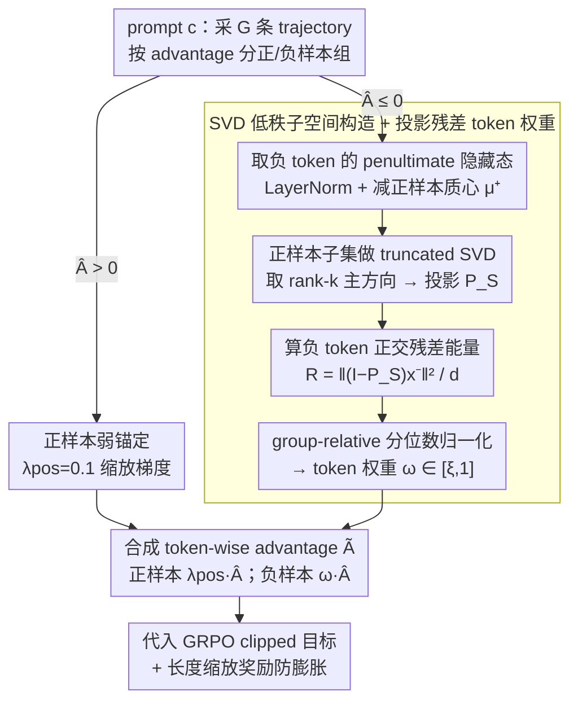

# ResRL: Boosting LLM Reasoning via Negative Sample Projection Residual Reinforcement Learning

**会议**: ICML 2026  
**arXiv**: [2605.00380](https://arxiv.org/abs/2605.00380)  
**代码**: https://github.com/1229095296/ResRL.git (有)  
**领域**: 强化学习 / LLM 推理 / RLVR  
**关键词**: GRPO, 负样本投影, SVD 子空间, Lazy Likelihood Displacement, Pass@k

## 一句话总结
ResRL 从理论上把 RLVR 中 "负样本梯度污染正样本"现象 (Lazy Likelihood Displacement) 分解成"logit × 表征"两个分量,然后在表征层用正样本的 SVD 低秩子空间做投影残差,根据每个负 token 的"正交分量能量"给它一个 [ξ,1] 区间的梯度权重——表征越像正样本(残差越小)就罚得越轻,纯错误成分才被重罚,既保住 Pass@1 又不丢 Pass@k 多样性;在 Qwen3-4B 数学任务上 Avg@16 比 NSR 提升 9.4%,Pass@128 提升 7.0%。

## 研究背景与动机

**领域现状**:RLVR (Reinforcement Learning with Verifiable Rewards) 已经成为 LLM post-training 主流——DeepSeek-R1 用 GRPO 显著提升复杂推理能力。其变体 NSR (Negative Sample Reinforcement) 通过加大负样本梯度权重,在保持多样性 (Pass@k) 的同时改善 Pass@1。

**现有痛点**:GRPO 和 NSR 都把负样本 token 一视同仁地惩罚,但"正负样本的回答在语法、部分推理步、常见表达上高度重叠"——当 NSR 加大对负样本的压制力度时,这些**共享的合法 token 分布**也被一起压低,导致正样本对应的关键 token 也变难生成,即 LLD (Lazy Likelihood Displacement) 现象:训练完后 $\ln \pi(y^+|c)$ 反而下降。NSR 因为 negative 权重更大,这个副作用比 vanilla GRPO 还要严重,所以 NSR 虽然 Pass@k 强,Pass@1 (即 Avg@1) 提升有限。

**核心矛盾**:正负样本的语义分布在 token 表征空间里有显著重叠,但梯度方向是"打整个回答的所有 token",没有机制区分"这个 token 是负样本独有的错误模式 (该重罚)"还是"这个 token 是正负共享的合法表达 (该轻罚)";理想做法应该是只罚负样本里"和正样本正交"的那部分梯度方向。

**本文目标**:在保持 NSR Pass@k 优势的同时,真正打通 Pass@1——具体是设计一种 token 级、表征感知的梯度调制机制,把负样本的惩罚限制在与正样本表征正交的方向上。

**切入角度**:作者从 LLD 的一阶展开出发,严格证明了 LLD 与"正负样本输出头梯度内积"成正比 (Eq.2),然后利用线性输出头 $z=Wx$ 的结构,证明梯度内积可以分解为 $\langle \delta_1, \delta_2 \rangle \cdot \langle x_1, x_2 \rangle$ (Lemma 1)——logit 分量和表征分量。logit 分量是 forward 时就知道的"backprop signal"形状,代价大;但**表征分量可以通过单次 forward 估计**,而且 Transformer 表征经验上具有 anisotropy 和 approximate low-rank 性质,完全可以用 SVD 子空间逼近。

**核心 idea**:把每个负 token 的隐藏表征对"正样本 SVD 低秩子空间"的正交分量能量 $e(x)$ 作为"该负 token 与正样本表征对齐度"的代理,对齐度低 (正交残差大) 就重罚、对齐度高 (落在正样本子空间) 就轻罚——这样保护共享语义,只压制独立错误。

## 方法详解

### 整体框架
ResRL 是对 GRPO 的 token-wise advantage 重加权扩展。对一个 prompt $c$ 采 $G$ 条 trajectory,正样本组 $\mathcal{P}$ (advantage $>0$) 一律用小常数 $\lambda_{\text{pos}} = 0.1$ 弱锚定 (防 mode collapse);负样本组 (advantage $\leq 0$) 的每个 token 都拿到一个动态权重 $\omega_{i,t} \in [\xi, 1]$——它来自三步流程:(1) 取 penultimate hidden state $h_{i,t}$,经 LayerNorm + 减去正样本质心 $\mu^+$ 得 centered 表征 $x_{i,t}$;(2) 对正样本子集 $\hat{X}^+$ 做 truncated SVD 得到 rank-$k$ 主方向 $V_k$,构造投影 $P_S = V_k V_k^\top$;(3) 每个负 token 算正交残差能量 $\mathcal{R}_{i,t} = \frac{1}{d}\|(I-P_S) x_{i,t}^-\|_2^2$,经过 group-relative 分位数归一化映射到 $[\xi, 1]$,作为最终 token-wise 权重。整个流程没有额外训练参数,只是改了 advantage 形状。下图把这套"分组 → 负样本表征加权 → 合成 advantage"的数据流画出来(理论框架是这套加权的合理性来源,不作为运行时阶段单列):

### 关键设计

1. **理论框架:LLD 与梯度分解**:

    - 功能:从一阶 Taylor 展开和线性头的代数结构出发,证明"为什么投影残差是合理代理"。
    - 核心思路:**(a)** 定义训练前后正样本 log-likelihood 变化 $\Delta(c) = \ln \pi_{\theta_{\text{fin}}}(y^+|c) - \ln \pi_{\theta_{\text{init}}}(y^+|c)$,一阶近似得 $\Delta(c) \approx -\eta \sum_{(i,t) \in \mathcal{N}(c)} \langle \nabla_W \ell^+, g^-_{i,t} \rangle$,说明 LLD 由"正负输出头梯度内积"决定 (Eq.2)。**(b)** Lemma 1: 由 $\nabla_W \ell = \delta x^\top$ ($\delta$ 是 logit 处 backprop signal,$x$ 是表征),$\langle \nabla_W \ell_1, \nabla_W \ell_2 \rangle = \langle \delta_1, \delta_2 \rangle \cdot \langle x_1, x_2 \rangle$——梯度内积干净分解成 logit 项和表征项的乘积。**(c)** Lemma 2 (Alignment bound): 对 $x^+ \in S$ 子空间内,$\langle x, x^+ \rangle^2 \leq \|x^+\|^2 (\|x\|^2 - d \cdot e(x))$——增大正交分量能量 $e(x)$ 会单调降低任何与正样本表征的相似度上界。**(d)** Theorem 1: 综合 Lemma 1+2,得 $|\langle x^-, x^+ \rangle| \leq \|P_S x^+\|_2 \sqrt{\|x^-\|^2 - d\cdot e(x^-)} + \|x^-\|_2 \sqrt{d \cdot e(x^+)}$,在子空间充分覆盖正样本 ($e(x^+) \leq \varepsilon_+$) 假设下,$e(x^-)$ 成为梯度内积的 conservative 上界代理。
    - 设计动机:这套理论把"why 用投影残差"从启发式变成可证明的"上界代理",且只需 single forward 估计 (不像直接算 token-wise full-parameter 梯度需要额外 backward + 全参通信),计算可行性大幅提升。

2. **SVD 低秩子空间构造 + 投影残差 token 权重**:

    - 功能:把理论上的 $e(x)$ 代理变成可在 GRPO 训练循环里在线计算的轻量算子。
    - 核心思路:每个 prompt group 内,**(1)** 从正样本 token 池中均匀采 $M$ 个,LayerNorm + 减质心后形成矩阵 $\hat{X}^+ \in \mathbb{R}^{M \times d}$,做 truncated SVD: $\hat{X}^+ = U \Sigma V^\top$,取前 $k$ 个右奇异向量构造 $V_k \in \mathbb{R}^{d \times k}$ 和 projector $P_S = V_k V_k^\top$。**(2)** 对每个负 token 算 $\mathcal{R}_{i,t} = \frac{1}{d}\|(I-P_S) x^-_{i,t}\|^2$。**(3)** 用 group-relative 分位数 $q_{\text{low}} = \mathcal{Q}(\mathbf{D}, \alpha)$、$q_{\text{high}} = \mathcal{Q}(\mathbf{D}, \beta)$ 替代 min/max 做 robust normalization: $z_{i,t} = \text{clamp}((\mathcal{R}_{i,t} - q_{\text{low}}) / (q_{\text{high}} - q_{\text{low}} + \epsilon), 0, 1)$。**(4)** 映射到 [ξ,1]: $\omega_{i,t} = \xi + (1-\xi) z_{i,t}$。**(5)** Token-wise advantage: $\tilde{A}_{i,t} = \lambda_{\text{pos}} \hat{A}_i$ 若 $\hat{A}_i > 0$,$\omega_{i,t} \hat{A}_i$ 若 $\hat{A}_i \leq 0$;代入标准 GRPO clipped 目标。
    - 设计动机:用采样 + 低秩 SVD (而非全 token 全 rank 计算) 把复杂度降到可接受;用分位数归一化代替 min-max 防止异常值影响整体权重分布;用 [ξ,1] 区间而非 [0,1] 保证即使表征完全对齐也仍有最小惩罚 (ξ 是下界),防止模型完全无视那部分错误。表征取 penultimate 层而非 final,是因为 final 层直接 feed 输出头,会被 token 预测目标 bias;penultimate 层更接近"语义抽象"。

3. **正样本弱锚定 + 长度缩放奖励**:

    - 功能:防止只对负样本下重手时正样本"无人加强"导致 mode collapse,同时遏制生成 verbosity (RL 训练常见副作用)。
    - 核心思路:对正 advantage tokens 用 $\lambda_{\text{pos}} = 0.1$ 缩放——不完全去除正样本梯度,留个小的"弱奖励锚"防止 policy 完全偏向"避免错误"而忘记"得到正确"。同时引入 length-scaled reward 机制 (具体公式作者放在附录) 作为"防膨胀阀门"——保证 ResRL 在追求多样性时不会产生超长 chain-of-thought。
    - 设计动机:作者沿用 Zhu 2025a (NSR) 的"小正锚"做法,因为完全去掉正梯度会让训练失稳;长度奖励作 safeguard 是因为多样性 RL 经常诱发 verbose 生成,长度爆炸会拖累 inference 速度和效果。

### 损失函数 / 训练策略
$$
\mathcal{L}_{\text{ResRL}}(\theta) = \mathbb{E}_{x, \mathcal{G}}\left[\frac{1}{G}\sum_i \frac{1}{T_i} \sum_t \min(\rho_{i,t} \tilde{A}_{i,t}, \text{clip}(\rho_{i,t}, 1-\epsilon, 1+\epsilon) \tilde{A}_{i,t}) \right]
$$
- 实验配置: Qwen3-1.7B/4B/8B backbone,4096 max response length,group size $G$ 按 GRPO 默认,SVD 秩 $k$、采样数 $M$、quantile $(\alpha, \beta)$、$\xi$ 都在 ablation 里 grid search。

## 实验关键数据

### 主实验

| 方法 (Qwen3-4B) | AIME24 | AIME25 | AMC23 | MATH500 | Minerva | Olympiad | Avg |
|---|---|---|---|---|---|---|---|
| Backbone | 20.0 | 17.3 | 56.9 | 77.8 | 36.9 | 48.2 | 35.5 |
| GRPO | 37.1 | 27.7 | 87.2 | 79.9 | 31.5 | 55.1 | 53.1 |
| DAPO | 23.5 | 18.9 | 63.4 | 80.8 | 39.1 | 51.2 | 46.2 |
| FlowRL | 35.4 | 30.2 | 74.5 | 84.7 | 38.9 | 58.1 | 53.6 |
| NSR | 38.5 | 33.1 | 79.8 | 77.4 | 33.5 | 50.1 | 52.1 |
| **ResRL** | **45.2** | **38.6** | **89.4** | 77.8 | **38.6** | 52.3 | **57.0** |

| 方法 (Qwen3-8B) | AIME24 | AIME25 | AMC23 | MATH500 | Minerva | Olympiad | Avg |
|---|---|---|---|---|---|---|---|
| Backbone | 25.4 | 18.1 | 61.4 | 77.6 | 39.2 | 48.6 | 45.1 |
| GRPO | 36.3 | 29.2 | 78.0 | 89.4 | 42.1 | 62.0 | 56.2 |
| FlowRL | 47.7 | 33.3 | 85.8 | 92.1 | 44.6 | 68.5 | 62.1 |
| NSR | 55.4 | 38.5 | 89.8 | 87.3 | 40.0 | 60.6 | 61.9 |
| **ResRL** | 50.8 | **41.1** | 89.7 | **92.7** | **46.0** | 68.1 | **64.7** |

| 代码 (Qwen3-4B) | LiveCodeBench Avg/Pass@16 | CodeForces Rating (Pct.) | HumanEval+ Pass@16 |
|---|---|---|---|
| Backbone | 30.5 / 40.9 | 578.8 (1.2) | 89.0 |
| GRPO | 39.5 / 55.1 | 1267.9 (63.1) | 95.7 |
| NSR | 32.8 / 52.3 | 1340.9 (69.3) | 96.9 |
| **ResRL** | **43.2 / 59.9** | **1469.5 (78.9)** | **97.0** |

| Agent / 工具调用 | ALFWorld All | WebShop Succ. | BFCL Overall |
|---|---|---|---|
| Prompting ReAct | 31.2 | 19.5 | - |
| PPO | 80.4 | 68.7 | - |
| EMPG | 78.5 | 69.3 | - |
| ResT-8B | - | - | 多项强 |
| **ResRL** | **86.7** | **71.5** | 多项最佳 |

### 消融实验
作者在论文中报了 rank $k$、采样数 $M$、hidden 层选择、quantile $(\alpha, \beta)$、$\xi$ 等多组 ablation (具体表见原文 5+ 节,这里限于篇幅只保留核心结论)。

| 关键超参 | 结论 |
|---|---|
| Rank $k$ | 太低 (k=1) 子空间表达不够,太高 (k≈ d) 等同退化为无投影;$k \approx 8-16$ 最优 |
| Penultimate vs final layer hidden | Penultimate 显著更好,验证作者关于"final 层被 prediction objective bias"的假设 |
| Quantile $(\alpha, \beta)$ | (0.1, 0.9) 比 (0, 1) min-max 更鲁棒,异常值不会扭曲整体权重分布 |
| $\xi$ (最小权重) | $\xi \approx 0.3-0.5$ 最稳,$\xi=0$ 会让某些 token 完全无监督导致漂移 |

### 关键发现
- **Pass@1 (Avg@16) 与 Pass@128 同时提升**:NSR 主要 Pass@k 强,Pass@1 提升小;ResRL 在两个维度同时刷新——Qwen3-4B 数学上 Avg@16 +9.4%、Pass@128 +7.0%,这是 NSR 的痛点被 ResRL 解决了。
- **理论 → 算法落地一致**:Theorem 1 预测"$e(x^-)$ 越大梯度对齐上界越紧、罚得越重应该越合理",ablation 经验上 quantile normalization + $\xi$ lower bound 都不偏离理论。
- **跨任务普适**:数学 (AIME/MATH500)、代码 (LiveCodeBench/CodeForces)、长 horizon agent (ALFWorld/WebShop)、function call (BFCL) 都拿到 SOTA,说明"投影残差权重"不是 task-specific 技巧而是通用 RL 改进。
- **CodeForces +9.6% rating**:从 NSR 1340 → ResRL 1469,Pct. 从 69% → 78%,这是相当大的实战水平跨越——说明"保护共享语义"对结构性更强的代码生成尤其重要。
- **小常数 $\lambda_{\text{pos}}=0.1$ 是关键**:完全去掉正梯度会立即崩,保留一点弱锚定就能稳——这是 NSR-family 方法共享的工程经验。

## 亮点与洞察
- **Lemma 1 的输出头梯度分解**:$\langle \nabla_W \ell_1, \nabla_W \ell_2 \rangle = \langle \delta_1, \delta_2 \rangle \cdot \langle x_1, x_2 \rangle$——这个等式干净到漂亮,提供了"为什么能用 single forward 代理 token-wise 梯度交互"的理论根基;后续任何想做"表征级 RL 调控"的工作都可以借这个 hammer。
- **正样本 SVD 子空间作为"合法语义流形"**:概念上把"什么是 acceptable token"用一个低秩子空间显式表达,投影外能量大就是"独立错误"该重罚——这种"语义流形 + 正交残差"的观点比"梯度方向角度"的纯几何视角更可解释。
- **Group-relative quantile gating**:每个 prompt group 独立做分位数归一化,避免不同 prompt 间的 scale 差异污染统一阈值;这种"相对而非绝对"的设计是 GRPO 已有的精神,作者把它推到 token 级别。
- **penultimate vs final layer**:这个细节看似工程,实则反映"什么层位的表征最适合代表语义而不被 prediction bias 干扰",值得后续 representation engineering 工作借鉴。
- **理论 + 实证双闭环**:Theorem 1 给出 conservative bound,实验把 bound 的实际松紧调出来——这种"理论指方向、实验调参数"的范式比纯堆实验或纯讲理论都更有说服力。

## 局限与展望
- SVD 在每个 prompt group 都要做一次,即使采样 + 低秩仍有计算开销;对超大 group size 或超长序列可能成本上升明显,作者用采样缓解但没给详细 wall-clock 对比。
- 子空间 $k$、采样数 $M$、quantile $(\alpha, \beta)$、$\xi$ 都需要 grid search,对实际部署而言这种"四个超参互相影响"会增加调参负担。
- penultimate hidden state 的"语义"假设是经验性的,未在多种 LLM 架构 (Mistral、Llama、GLM) 上系统验证。
- 长度奖励 (length-scaled reward) 是 safeguard,但作者没给"如果不加 length penalty 会发生什么"的对比——可能 ResRL 本身就有 verbose 倾向。
- 只在 RLVR 设置下验证 (binary reward),对 dense reward 或 preference learning (DPO/RLHF) 是否同样适用没讨论。
- 与 ConsisCo, RPO 等同样关注表征几何的 RL 算法没比;与 PRM-based 方法的对比也仅停留在简单 baseline。

## 相关工作与启发
- **vs GRPO (DeepSeek-R1) / DAPO**:它们 token-wise advantage 由 group 归一化决定,不区分共享 vs 独立 token;ResRL 在 negative tokens 上叠加表征感知权重,精度更高。
- **vs NSR (Zhu 2025a)**:NSR 直接加大负样本梯度但未解决 LLD,Pass@1 提升有限;ResRL 用投影残差 selectively suppress,把 NSR 的多样性优势保留同时打通 Pass@1。
- **vs FlowRL (Zhu 2025b)**:FlowRL 通过 flow matching 控制 policy 分布,ResRL 通过表征几何控制——两条路径都瞄准"diversity vs precision" tradeoff,ResRL 在 8B 综合性能 64.7 > FlowRL 62.1。
- **vs LLD 研究 (Deng 2025c, 2025b)**:他们识别了 LLD 现象,ResRL 是第一个把 LLD 的"梯度内积"代理化、可微化、并写进 GRPO 训练循环的工作——从诊断走到药方。
- **vs Token-level loss balancing / Curriculum**:它们试图通过 reweighting 解决,但 weight 是基于启发式 (loss 大小、长度等);ResRL 的 weight 基于理论上界,更有原则性。
- **vs 表征工程 (Repeng, Steering Vectors)**:那些工作在推理时改激活,ResRL 在训练时改梯度——同样借力表征几何但作用方向相反。

## 评分
- 新颖性: ⭐⭐⭐⭐⭐ 把"梯度内积 = logit × 表征"分解 + SVD 低秩投影 + group-relative gating 做出一套 principled 框架,理论性 + 工程性兼具
- 实验充分度: ⭐⭐⭐⭐⭐ 12 个 benchmark + 4 类任务 + 3 个模型规模 + 多组 ablation,Qwen3-1.7B/4B/8B 都稳赢
- 写作质量: ⭐⭐⭐⭐ Lemma → Theorem → Algorithm 的链条清晰,公式严谨;但部分推导塞在附录,正文略密
- 价值: ⭐⭐⭐⭐⭐ 既给 RLVR 社区一个 actionable 改进 (代码开源即可用),也给后续表征感知 RL 工作打了理论模板

<!-- RELATED:START -->

## 相关论文

- [\[ICLR 2026\] Stabilizing Policy Gradients for Sample-Efficient Reinforcement Learning in LLM Reasoning](../../ICLR2026/llm_reasoning/stabilizing_policy_gradients_for_sample-efficient_reinforcement_learning_in_llm_.md)
- [\[NeurIPS 2025\] The Surprising Effectiveness of Negative Reinforcement in LLM Reasoning](../../NeurIPS2025/llm_reasoning/the_surprising_effectiveness_of_negative_reinforcement_in_llm_reasoning.md)
- [\[ACL 2026\] TemplateRL: Structured Template-Guided Reinforcement Learning for LLM Reasoning](../../ACL2026/llm_reasoning/templaterl_structured_template-guided_reinforcement_learning_for_llm_reasoning.md)
- [\[ICLR 2026\] Temperature as a Meta-Policy: Adaptive Temperature in LLM Reinforcement Learning](../../ICLR2026/llm_reasoning/temperature_as_a_meta-policy_adaptive_temperature_in_llm_reinforcement_learning.md)
- [\[AAAI 2026\] Well Begun, Half Done: Reinforcement Learning with Prefix Optimization for LLM Reasoning](../../AAAI2026/llm_reasoning/well_begun_half_done_reinforcement_learning_with_prefix_optimization_for_llm_rea.md)

<!-- RELATED:END -->
